Q1. Explain briefly the ecological and economic benefits of solar energy generation in India with suitable examples.
[Year: 2025] [Group: UPSC CSE] [Exam: Mains] [Stage: Mains] [Paper: Mains - GS 1]
[Subject: GEOGRAPHY]
[Section Group: Economic & Resource Geography]
[Microtopic: Distribution of key Natural Resources (world, South Asia and Indian subcontinent)]
[Subtopic: Energy]
[Macrotag: Descriptive, Applied]
[Microtag: Explain, India]

1. Explanation_Civilsdaily:
Source Question: Explain briefly the ecological and economic benefits of solar energy generation in India with suitable examples. [Year: 2025] [Marks: 10]

India has emerged as a global leader in solar energy with over **140 GW of installed solar capacity (Nov 2025)** and ranks **3rd in the world in solar capacity and generation.**

**Ecological Benefits**

1. **Carbon Sequestration**

a. By replacing coal-fired thermal power, which is the primary source of CO-2 emissions. Every 1 GW of solar power reduces CO2 emissions by approximately **1.5 million tonnes** annually.

b. Supports India’s NDC targets - 500 GW non-fossil capacity by 2030 and net-zero by 2070.

2. **Water Conservation -** Use 95% less water than thermal power plants. Shifting to solar saves roughly **2.5 liters of water per kWh** generated.

3. **Preservation of Fragile Ecosystems -** Installing panels on reservoirs reduces water evaporation and algae growth. Eg- **Omkareshwar Floating Solar Park** (Madhya Pradesh).

4. **Agrivoltaic Biodiversity -** "Solar farming" allows crops to grow beneath panels, creating a micro-climate that reduces soil moisture loss.

5. **Reduction Air Pollution -** Unlike fossil fuels, solar generation releases zero SOx, NOx, or particulate matter (PM 2.5).

6. **Soil Reclamation -** Solar parks built on saline or degraded "wastelands," prevent further soil erosion.

Eg- **Khavda Hybrid Park** in the Rann of Kutch

7. **Transition to Circular Economy - Eg- Draft Solar Waste Management Rules** mandate recycling of end-of-life panels.

8. **Protection of Glacial Regions - Eg-** Solar projects in **Ladakh (13 GW planned)** can reduce black carbon deposits on glaciers, which otherwise accelerate melting.

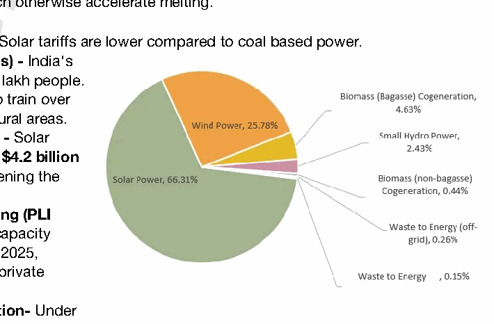

**Economic Benefits**

1. **Cost Savings for Households -** Solar tariffs are lower compared to coal based power.

2. **Job Creation (Green-Collar Jobs) -** India's solar PV sector employs over 3.5 lakh people.

The **Suryamitra program** aims to train over 50,000 solar technicians across rural areas.

3. **Reduction in Energy Import Bill -** Solar energy helped India save roughly **$4.2 billion** in fuel costs in 2024-25, strengthening the Current Account Balance.

4. **Boost to Domestic Manufacturing (PLI Scheme) -** Solar manufacturing capacity jumped from 38 GW to **74 GW** in 2025, attracting **₹52,900 crore** in fresh private investment.

5. **Agricultural Income Diversification-** Under **PM-KUSUM Component A,** farmers can earn **income** by installing solar plants on unproductive land.

6. **Attraction of Global FDI -** 100% FDI under the automatic route has made India a top destination for ESG-focused global funds.

7. **Rural Electrification -** Solar micro-grids provide 24/7 power to remote villages where grid extension is expensive.

8. **Infrastructure Development -** Mega solar parks bring roads, water, and connectivity to previously isolated regions.

9. **Export Potential-** India exported $1.5 billion worth of solar equipment in 2025.

**Challenges in Solar Energy Generation**

1. **Intermittency and Storage Gap-** shortage of **Battery Energy Storage Systems (BESS)**

2. **Land Acquisition Hurdles** for Mega-parks

3. **Lack of grid connectivity**

4. **Import dependency-** India still imports over **90% of its wafers and ingots** from China.

5. Limited **recycling infrastructure** creates a toxic waste risk (lead and cadmium).

6. **Poor Financial Health of DISCOMs-** delayed payments to solar developers and deterring investment.

**Steps Taken by Governments**

5. **PM-Surya Ghar- Muft Bijli Yojana** to solarize **1 crore households** by 2027

6. **Solar Park Scheme-** A target of **40 GW** across 50+ parks by March 2026.

7. **PM-KUSUM-** Solarizing over 30 million irrigation pumps.

8. **PLI Scheme-** to boost domestic manufacturing of high-efficiency solar modules A balanced strategy focusing on **decentralised solar, grid expansion, storage systems, and region-specific planning** is essential to achieve **Panchamrit Targets.**

---

1. Explanation_Drishti IAS:
Source Question: Explain briefly the ecological and economic benefits of solar energy generation in India with suitable examples. (Answer in 150 words) 10

| **Approach:**  • **Introduction:** Introduce solar energy as a key component of India's renewable energy strategy.  • **Body:** Discuss the ecological benefits, including reduced emissions, water conservation, and improved air quality, with relevant examples.  • Explain the economic benefits, such as job creation, cost-effectiveness, and income diversification, while connecting them to national energy security and sustainable growth.  • **Conclusion: Conclude accordingly.** |
| --- |

### Introduction

Solar energy, a key pillar of India’s renewable energy transition, contributes significantly to ecological sustainability and economic development. It aligns with India’s commitments under the Paris Agreement and SDG-7 (Affordable and Clean Energy), promoting Justice, Sustainability, and Fraternity in development.

### Body

**Ecological Benefits of Solar Energy**
**1. Reduction in Carbon Emissions:** Solar power emits approximately 20 times less CO **2** than coal-based power (IPCC).

- E.g., India’s solar capacity avoided over 60 million tonnes of CO **2** in 2023. **2. Conservation of Water Resources: Solar PV requires minimal water** compared to thermal plants and supports SDG-6 (Clean Water and Sanitation). **3. Decentralised Clean Energy:** Solar microgrids reduce dependence on fossil fuels in rural areas (e.g., Sunderbans).

- Promotes **environmental justice for marginalised communities.** **4. Improved Air Quality:** Reduces pollutants like **SO2 and NOx from thermal plants**, aiding public health.

- Example: Delhi’s Indraprastha Gas Ltd. **replaced diesel gensets with rooftop solar.**
**5. Land Optimization through Agrivoltaics: Dual land use** - **crop growth under solar panels** (e.g., **Delhi’s Agriculture-cum-Solar Farm Scheme).**

**Economic Benefits of Solar Energy**

- **Employment Generation:** The solar PV sector in India employed about 318,600 people in both on-grid and off-grid systems (IRENA 2024).

- By 2030 Target: India can create 3.4 million jobs by achieving 500 GW non-fossil fuel capacity by 2030 (CEEW).

- **Cost-effectiveness & Energy Security:** India's **solar costs drop 95% (2010-2024),** paving the way for affordable, round-the-clock clean energy.

- India being 3rd-largest oil importer can reduce its import dependence for fossil fuels.

- **Income Diversification for Farmers: PM-KUSUM and PM Surya Ghar-Muft Bijli Yojana:** enables **farmers and householders to earn from selling surplus** power to the grid.

- **Boost to Manufacturing & Exports:** PLI Scheme for solar PV modules to boost domestic industry.

- India aims for 280 GW solar capacity by 2030.

- **Support for MSMEs and Urban Poor:** Rooftop solar reduces operational cost for MSMEs and lowers electricity bills.

### Conclusion

Solar energy in India exemplifies the synergy of environmental sustainability and inclusive economic growth. By promoting clean energy, it helps achieve climate justice and ensures energy access for all, in line with Sustainable Development Goals and the Preamble’s vision of justice and equality. Effective implementation of solar missions can transform India into a global green energy leader.

---

1. Explanation_PWOnlyIAS:
Source Question: Explain briefly the ecological and economic benefits of solar energy generation in India with suitable examples.

| **Core Demand of the Question**  • Ecological Benefits of Solar Energy  • Economic Benefits of Solar Energy in India |
| --- |

### Introduction

India has surpassed Japan to become the ***world’s third-largest solar power producer** *, leveraging **300+** sunny days annually *(Source: MNRE)*. This clean and abundant energy source offers significant **ecological** and **economic benefits** for sustainable growth.

### Body

**Ecological Benefits of Solar Energy**
- **Significant Reduction in Carbon Emissions:** Solar power generation is virtually emissions-free, reducing greenhouse gases.

  - **Eg:** The **2,245 MW Bhadla Solar Park** (Rajasthan) offsets **~4 million tonnes of CO₂** annually (Source: PIB)

- **Preservation of Water Resources:** Solar PV systems consume negligible water, unlike coal-based thermal plants that rely heavily on water. This feature is particularly vital in **arid western regions** like Rajasthan.
- **Efficient Use of Unproductive Land:** Solar parks utilize wastelands and semi-arid regions, preventing pressure on fertile agricultural land.
- **Support for Climate Goals:** Solar energy aligns with India’s commitment to clean energy transitions under **COP26** and the **National Action Plan on Climate Change**.

  - **Eg:** By June 2025, non-fossil fuel capacity reached **49% of total installed power capacity** of **476 GW**.

- **Cleaner Air Quality:** Solar energy produces **no air pollutants** such as sulphur dioxide (SO₂) or nitrogen oxides (NOx), unlike thermal power plants.

**Economic Benefits of Solar Energy in India**
- **Reduced Import Dependence:** By harnessing abundant sunlight, India lowers its reliance on imported fossil fuels, reducing the **import bill** and exposure to **global price shocks**.

  - **Eg:** Coal imports fell **7.9%** in FY 2024–25, saving **$7.93 billion**, reflecting India’s push to cut import dependence.

- **Renewable Capacity Addition:** Solar energy is driving India’s transition from a coal-dominated power mix to a more balanced, sustainable system.

  - **Eg:** India’s total installed power capacity reached **476 GW**, with **110.9 GW from solar**.

- **Job Creation and Rural Livelihoods:** Solar energy projects create direct jobs in **manufacturing, installation,** and **maintenance** while also providing **income opportunities** for rural households.

  - **Eg:** PM Surya Ghar scheme is also expected to create approximately 17 lakh direct jobs.

- **Support for Long-Term Economic Growth & Investments:** Expansion of solar energy attracts investment, strengthens domestic manufacturing, and contributes to India’s energy transition.

  - **Eg:** The PLI Scheme for High-Efficiency Solar PV Modules is projected to create over **6 lakh green jobs** by **2030**.

### Conclusion

Solar energy in India reduces emissions, conserves resources, and ensures **energy security** while generating **jobs** and **investments**. Its ecological and economic benefits make it a cornerstone of sustainable development.

---

1. Explanation_Superkalam:
Source Question: Explain briefly the ecological and economic benefits of solar energy generation in India with suitable examples.

India's solar capacity crossed** 136 GW in 2025**, making it the world's third-largest solar energy producer while delivering significant ecological and economic dividends.

India's solar power potential and parks

## Ecological Benefits of Solar Energy Generation

-** Carbon Emission Reduction**: Solar installations prevented** 410.9 million tonnes of CO2 emissions **in 2024, supporting India's** Net Zero 2070 **commitment.
-** Water Conservation**: Solar PV systems use** 95% less water **than thermal plants - crucial for water-stressed states like Rajasthan where the** Bhadla Solar Park **saves 1.5 million liters daily.
-** Air Quality Improvement**: Solar energy reduces** particulate matter and sulfur dioxide emissions**, contributing to cleaner air in pollution-heavy regions like NCR and Maharashtra.
-** Land Optimization**:** Agri-voltaics projects **in Gujarat combine farming with solar panels, increasing land productivity by 60% while generating clean energy.
-** Biodiversity Conservation**:** Floating solar projects **like Ramagundam in Telangana (100 MW) preserve terrestrial ecosystems while** reducing water evaporation by 70%**.

## Economic Benefits of Solar Energy Generation

-** Employment Creation**: Solar sector employed** 1.3 million people **in 2023, with** Skill India's Suryamitra program **training over 50,000 solar technicians across rural areas.
-** Rural Electrification**:** PM-KUSUM scheme **has installed 2.8 lakh solar pumps, benefiting farmers in states like** Haryana and Uttar Pradesh **with 24x7 irrigation access.
-** Cost Competitiveness**: Solar tariffs in India dropped to a range of** ₹2.48 – ₹4.99 per unit **during FY 2024-25, a roughly 50% decrease from the FY 2013-14, with an** all-time low bid of ₹2.44/kWh **for the Bhadla Solar Park. This makes it cheaper than coal-based power, reducing electricity costs for industries and households.
-** Energy Security**: Domestic solar manufacturing supported by** PLI scheme **reduced import dependency by 40%, with companies like** Adani and Tata **establishing gigawatt-scale facilities.
-** Export Potential**: India exported** $1.5 billion **worth of solar equipment in 2024, positioning itself as a global solar hub under** One Sun One World One Grid**.

Solar energy transformation exemplifies India's commitment to sustainable development, with initiatives like** International Solar Alliance **fostering global cooperation toward** 500 GW renewable capacity by 2030**.

---

---

Q2. Give a geographical explanation of the distribution of off-shore oil reserves of the world. How are they different from the on-shore occurrences of oil reserves?
[Year: 2025] [Group: UPSC CSE] [Exam: Mains] [Stage: Mains] [Paper: Mains - GS 1]
[Subject: GEOGRAPHY]
[Section Group: Economic & Resource Geography]
[Microtopic: Distribution of key Natural Resources (world, South Asia and Indian subcontinent)]
[Subtopic: Energy]
[Macrotag: Descriptive, Comparative]
[Microtag: How, Different]

1. Explanation_Civilsdaily:
Source Question: Give a geographical explanation of the distribution of off-shore oil reserves of the world. How are they different from the on-shore occurrences of oil reserves? 

Petroleum reserves [Year: 2025] [Marks: 15]

are found in **sedimentary basins,** where organic matter is trapped under pressure. Offshore reserves account for **~30% of global crude oil** production. Their distribution is linked to **continental shelf geology, passive margins, and deep-water basins.**

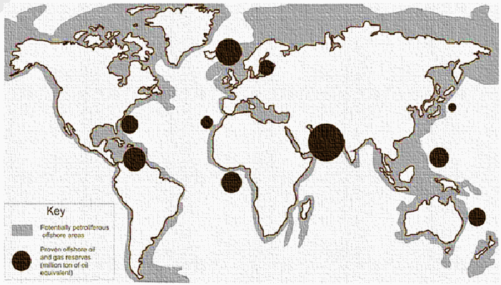

**Geographical distribution**

1. **The Persian Gulf (Middle East)-** result of the collision between the Arabian and Eurasian plates, which created perfect "anticline" traps for oil. Eg- **Safaniya field** (Saudi Arabia), largest offshore oil field in the world.

2. **The Gulf of Mexico (North America)-** It is characterized by **salt domes** that trap oil in the surrounding porous rock.

3. **The North Sea (Europe)-** Situated between the UK, Norway, and Denmark. This region is a **rift basin,** with deep depressions where organic matter could settle.

4. **The South Atlantic Margins (Brazil & West Africa)-** formed when South America and Africa drifted apart.

5. **Southeast Asia & India-** in the **South China Sea** and India’s **Mumbai High** and **Krishna-Godavari**

**(KG) Basin Difference between off-shore and on-shore oil reserves**

| Basis | Offshore Oil Reserves | Onshore Oil Reserves |
| --- | --- | --- |
| Location | Beneath seabed on continental shelf | Beneath land surface in sedimentary basins |
| Geological setting | Mostly marine sedimentary basins | Continental sedimentary basins and ancient geosynclines |
| Extraction cost | Very high (deep-water drilling, platforms) | Relatively lower |
| Technology requirement | Advanced offshore rigs and subsea systems | Conventional drilling technology |
| Production risk | High due to storms, blowouts, oil spills | Comparatively lower environmental risk |
| Reserve potential | Large untapped reserves, especially deep sea | Many mature and declining fields |
| Accessibility | Difficult and weather dependent | Easier access and transport |
| Geopolitics | Reserves are clearly within a nation's sovereign land borders. | Frequently subject to disputes over Exclusive Economic Zones (EEZ). Eg- South China Sea. |
| Examples | North Sea, Gulf of Mexico, Mumbai High | Middle East fields, Texas, Assam |

**Implications of uneven distribution of mineral oils in the world**

1. **Energy security challenges** - Oil-deficient countries face high import bills and current account deficits.

Eg- India imports ~85% of its crude oil requirement.

2. **Resource Curse in Oil-rich Nations (Paradox of Plenty)** - Overdependence on oil leads to limited economic diversification. Eg- Venezuela’s economic crisis.

3. **Energy trade** is one of the key drivers of global geopolitics. Eg- US sanctions on Russian and Iran oil trade

4. Competition for oil resources leads to **wars and regional instability.** Eg- Gulf Wars, Saudi-Iran rivalry.

5. Oil-rich regions face **oil spills, land degradation, and marine pollution.** Eg- Niger Delta pollution.

6. **Global Carbon Emissions** - oil and gas industry is responsible for over 5 billion tonnes of CO2 equivalent in direct emissions annually (15% of total energy-related emissions) In the long run, reducing oil dependence through **clean energy, strategic reserves, and diversified supply chains** is essential for ensuring **equitable and sustainable global development.**

---

1. Explanation_Drishti IAS:
Source Question: Give a geographical explanation of the distribution of off-shore oil reserves of the world. How are they different from the on-shore occurrences of oil reserves? (Answer in 250 words) 15

| **Approach:**  • Give a short introduction on oil reserves and their global significance.  • Explain the geographical distribution of offshore reserves with examples.  • Compare offshore vs onshore oil reserves with clear distinctions.  • Conclude with a balanced statement on their relevance. |
| --- |

### Introduction

Petroleum resources are unevenly distributed across the globe, concentrated mainly in **sedimentary basins** formed under marine conditions. With technological advancements,

**off-shore oil reserves**

- deposits located beneath continental shelves and shallow seas-have become a major contributor to global supply, a significant proportion of the world's heavy oil reserves. Their distribution and occurrence differ significantly from **on-shore reserves**, shaping energy geopolitics.

### Body
**Geographical Distribution of Offshore Oil Reserves**

- **Middle East & Persian Gulf:** Offshore fields in **Saudi Arabia (Safaniya), Iran, Qatar, and UAE** dominate global supply with low-cost, shallow-water reserves.

- **North Sea Basin (Europe):** Offshore reserves in the **UK** and **Norway** (e.g., Brent field) have been vital for European energy since the 1970s.

- **West Africa (Atlantic Margin):** Countries like **Nigeria and Angola** possess deep-water reserves yielding high-quality sweet crude, mainly for export.

- **Latin America:** **Brazil’s Santos and Campos pre-salt basins** are among the world’s largest deep-water reserves, while **Venezuela’s Orinoco delta** adds further strength.

- **North America:** The **Gulf of Mexico** (USA, Mexico) produces significant offshore oil with advanced deep-water technology.

- **Russia & Arctic:** **Caspian Sea (Kashagan)** and **Sakhalin Basin** reserves are major, though Arctic offshore exploration faces technical and ecological challenges.

- **Asia-Pacific:** Offshore reserves in the **South China Sea, East China Sea, and Indian basins (Mumbai High, KG-D6)** contribute strategically to regional energy security. **Differences between Offshore and Onshore Oil Reserves**
| **Aspect** | **Offshore Oil Reserves** | **Onshore Oil Reserves** |
| --- | --- | --- |
| **Geological Location** | Found in **continental shelves and seabeds** beneath shallow or deep seas. | Found in **terrestrial sedimentary basins** on land. |
| **Extraction Techniques** | Require **drilling rigs, subsea pipelines, floating platforms** due to marine conditions. | Use **conventional rigs, surface wells, and secondary recovery methods**. |
| **Cost & Technology** | **High-cost and technologically intensive**, involving seismic surveys and deep-sea drilling. | **Relatively cheaper and simpler**, though mature basins need enhanced recovery. |
| **Global Production Share** | Contribute around **30% of global output** (IEA, 2022). | Dominate with nearly **70% of total output**. |
| **Risks & Environment** | Risk of **oil spills, marine damage, and storm disruptions** (e.g., Deepwater Horizon, 2010). | Risks include **land degradation, groundwater contamination, and community displacement**. |
| **Geopolitical Dimensions** | Often located in **disputed maritime zones** (South China Sea, Eastern Mediterranean). | Largely within **national borders**, making governance easier. |

### Conclusion

The **geography of offshore oil reserves** shows their concentration in **continental margins and tectonic shelves**, from the Persian Gulf to Brazil, the Gulf of Mexico, and the North Sea. Offshore reserves differ from onshore in **location, technology, costs, risks, and geopolitical sensitivity**, but both remain vital for global energy security. With onshore reserves maturing, the **future of oil increasingly depends on offshore exploration**, balanced with sustainability and environmental safeguards.

---

1. Explanation_PWOnlyIAS:
Source Question: Give a geographical explanation for the distribution of off-shore oil reserves of the world. How are they different from the on-shore occurrences of oil reserves?

| **Core Demand of the Question**  • Geographical Explanation for the Distribution of Offshore Oil Reserves  • Difference between Onshore and Offshore Oil Reserves |
| --- |

### Introduction

**Oil reserves** are formed in **sedimentary basins** where organic matter is trapped and transformed over geological time. Offshore oil reserves, found beneath **continental shelves** and **oceanic basins**, have emerged as key resources shaping the geography of **global energy distribution**. **Body** 

**Geographical Explanation for the Distribution of Offshore Oil Reserves**
- **Continental Shelves:** Broad and shallow shelves favour thick deposition of marine sediments rich in organic matter, which, under pressure convert into **hydrocarbons**.

  - **Eg:** Persian Gulf, Mumbai High.

- **Passive Continental Margins:** These margins experience slow subsidence and **continuous sediment accumulation**, creating ideal conditions for hydrocarbon generation.

  - **Eg:** Brazil’s Atlantic coast, West Africa (Nigeria, Angola).

- **Rifted Basins and Fault Zones:** Submerged rift valleys and grabens act as structural traps that preserve petroleum deposits beneath the sea floor.

  - **Eg:** North Sea basins of UK and Norway.

- **Deltaic and Coastal Sedimentation:** River deltas carry **organic-rich sediments** into the ocean, forming prolific offshore basins with large reserves.

  - **Eg:** Niger Delta, Krishna–Godavari Basin (India).

- **Sedimentary Troughs and Depressions:** Thick layers of porous rocks overlain by **impervious cap rocks** in troughs trap oil effectively in offshore settings.

  - **Eg:** Campos Basin (Brazil), South China Sea. **Difference between Onshore and Offshore Oil Reserves** | **Aspect** | **Off-shore Oil Reserves** | **On-shore Oil Reserves** |
| --- | --- | --- |
| **Location** | Found beneath **continental shelves and deep-sea basins**, formed by marine sedimentation. | Found in **continental sedimentary basins** and **inland plains**, often associated with folded mountains or basins. |
| **Geological Setting** | Linked to **passive margins, rift basins,** and **deltaic deposits** rich in marine organic matter. **Eg:** North Sea, Gulf of Mexico. | Associated with **foreland basins, continental shelves, and interior basins**. **Eg:** Persian Gulf fields (Saudi Arabia, Iraq), Texas and Siberian plains. |
| **Depth & Accessibility** | Located in shallow to ultra-deep waters; extraction requires offshore rigs and subsea technology. | Occur at relatively **shallower depths**; accessible by land-based rigs and simpler infrastructure. |
| **Cost of Exploration** | Very high due to complex technology, offshore platforms, and safety measures. | Lower cost as drilling and transport infrastructure is easier and less risky on land. |
| **Environmental Impact** | Greater risk of **oil spills, marine pollution, and ecological damage** to coastal ecosystems. | Leads to **land degradation, deforestation, and groundwater contamination**. |
| **Production Share** | Contributes about **30% of global crude oil output**, increasingly important due to deep-water discoveries. **Eg:** Brazil’s pre-salt fields, West Africa offshore. | Historically dominant, still supplies **major share of global oil**. **Eg:** On-shore fields in Middle East, Russia, USA. |
| **Technological Dependence** | Heavily reliant on **R&D, subsea pipelines** and **remotely operated vehicles.** | Less dependent on high-end technology. Conventional drilling methods often suffice. | **Conclusion** The distribution of offshore oil reserves underlines geography’s role in g **lobal energy supply**. While these reserves are crucial for energy security, their exploitation must be balanced with **ecological safeguards** and a **gradual shift** towards offshore wind and other renewables for a sustainable energy future.

---

1. Explanation_Superkalam:
Source Question: Give a geographical explanation of the distribution of off-shore oil reserves of the world. How are they different from the on-shore occurrences of oil reserves?

Onshore oil reserves are those found on land, such as the Cambay Basin and Assam fields in India, while offshore oil reserves lie beneath the seabed, like the Mumbai High and KG-D6 basins. As onshore fields mature and deplete, offshore reserves are increasingly important for meeting global and national energy demands.

Major offshore oil provinces around world

### Geographical Distribution of Off-shore Reserves

1.** Passive Margins: **Offshore reserves concentrate along continental shelves, which act as massive, oxygen-depleted sinks for buried marine organic matter.
2.** The Golden Triangle: **Deepwater reserves heavily cluster geographically across the** Gulf of Mexico**,** West Africa**, and** Brazil’s Campos basin**.
3.** Pre-Salt Traps: **The tectonic rifting of Pangea left thick "pre-salt" layers in Brazil, forming impermeable seals that trap massive hydrocarbons beneath the seabed.
4.** Flooded Depressions: **The** Persian Gulf **represents a flooded tectonic basin, holding massive shallow-water reserves directly connected to Middle Eastern land fields.
5.** Emerging Deepwater Frontiers: **Exploratory geography is actively shifting to ultra-deep African margins, highlighted by Namibia's** Orange Basin **discoveries in 2024.
6.** Marginal Seas: **Indo-Pacific distribution, including India’s** KG-D6 basin**, locates critical reserves along tectonically active archipelagos and coastal shelves.
7.** Arctic Shelves: **Receding sea ice limits are gradually transforming the high-latitude continental shelves of Russia into newly accessible offshore distribution zones.

### Differences Between Off-shore and On-shore Occurrences

1.** Geomorphological Setting: **Onshore reserves reside in terrestrial foreland basins, whereas offshore fields are intrinsically linked to continental slopes and abyssal plains.
2.** Trapping Mechanisms: **Onshore oil relies heavily on terrestrial anticlines, while offshore oil frequently utilizes complex, highly pressurized sub-sea salt diapirs.
3.** Discovery Trends: **As onshore basins face depletion, marine geography now dominates, accounting for** ~73% of all global discoveries **in the 2020s.
4.** Extraction Infrastructure: **Onshore extraction utilizes fixed land rigs, contrasting with offshore's reliance on** Floating Production, Storage, and Offloading (FPSO) **vessels.
5.** Reservoir Dynamics: **Deepwater offshore fields typically yield massive, highly pressurized volumes from untapped sources, unlike mature onshore wells with declining outputs.
6.** Capital Geography: **Offshore geography demands monumental upfront capital—exemplified by Suriname's** $10 billion GranMorgu project**—compared to cheaper onshore extraction.
7.** Environmental Vulnerability: **Offshore spills threaten transboundary marine ecosystems, prompting a** South African High Court (2025) **halt on coastal drilling to protect fisheries.
8.** Jurisdictional Frameworks: **Offshore areas require specific legal regimes—like India's** Oilfields Amendment Bill (2024)**—unlike standard terrestrial mining leases.

As India rapidly expands deepwater energy security via** OALP Round-X (2025)**, this offshore momentum must align with the** UN's 2024 mandate **for standardized transboundary safeguards, ensuring economic progress respects marine ecology.

---

---

Q3. Examine the potential of wind energy in India and explain the reasons for their limited spatial spread.
[Year: 2022] [Group: UPSC CSE] [Exam: Mains] [Stage: Mains] [Paper: Mains - GS 1]
[Subject: GEOGRAPHY]
[Section Group: Economic & Resource Geography]
[Microtopic: Distribution of key Natural Resources (world, South Asia and Indian subcontinent)]
[Subtopic: Energy]
[Macrotag: Descriptive, Analytical, Applied]
[Microtag: Explain, Examine, India]

1. Explanation_Civilsdaily:
Source Question: Examine the potential of wind energy in India and explain the reasons for their limited spatial spread. [Year: 2022] [Marks: 10]

India is the 4th **largest wind power producer** in the world. Wind energy constitutes around 25% of total renewable energy production in India.

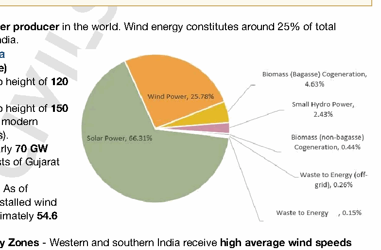

**Wind energy potential in India**

1. **Gross Potential (Onshore)**

  - **695.5 GW** at a hub height of **120 meters.**

  - **1,164 GW** at a hub height of **150 meters** (reflecting modern turbine capabilities).

2. **Offshore Potential** of nearly **70 GW** (concentrated off the coasts of Gujarat and Tamil Nadu).

3. **Current Capacity (2026)-** As of January, 2026, the total installed wind capacity stands at approximately **54.6 GW.**

4. **High Wind Power Density Zones** - Western and southern India receive **high average wind speeds (6-8 m/s).** Eg- Muppandal wind farm (Tamil Nadu) - one of the largest in Asia.

**Reasons behind limited spatial spread**

**1. Geographical reasons**

1. **Wind Speed Variability-** Eg- Low wind speeds in **eastern and northern plains.**

2. Ideal wind sites are **"topography-dependent"-requiring** open plains, mountain gaps, or coastal fronts. This naturally limits development to the Peninsular and Western regions.

**2. Transmission Constraints** - Grid congestion and curtailment issues.

**3. Land Acquisition** Challenges - Delays and opposition

**4. Financial Stress of DISCOMs** - **delays in** Power Purchase Agreements **discourage developers.**

**5. High Initial Investment** especially for offshore wind projects.

**6. Competition from Solar Energy** - Solar has become cheaper and easier to deploy across more regions.

**7. Infrastructure and Logistical Challenges**

- Wind farms are often located in **remote areas.** Building high-voltage **transmission lines** is a slow and expensive process.

- **Transportation Logistics challenges-** Modern wind blades can exceed 80 meters in length.

**Steps Taken**

**1. National Wind-Solar Hybrid Policy**

**2. National Offshore Wind Energy Policy**

**3. Renewable Purchase Obligation (RPO)**

**4. Waiver of Inter-State Transmission System (ISTS) Charges** To achieve **Panchamrit Targets,** there is need for

1. Offshore wind development

2. Hybrid projects

3. Improved grid connectivity

4. Better market mechanisms

5. Repowering old wind farms,

---

1. Explanation_Drishti IAS:
Source Question: Examine the potential of wind energy in India and explain the reasons for their limited spatial spread.

The wind is used to produce electricity using the kinetic energy created by air in motion. Wind turbines or wind energy conversion systems transform this into electrical energy.

**Potential:**

- India has the potential of about 60 GW of wind.
  - It is quite likely that it would go up substantially because over time some of the old wind power stations that have very low capacity could be replaced with wind turbines that have higher capacity.
- There is another unexplored area, which is in the oceans.
  - Across the world, exploration in this area is at a nascent stage.
  - On the eastern side of India, there are a lot of cyclones that hit the coast.
    - India is a country having around 7,516.6 km long coastline and in all of its exclusive economic zones, it has enough opportunity to harness wind energy.
- It is found by the National Institute for Wind Energy (based in Chennai) that western states have larger potential in terms of a stable, steady and speedy windflow.
  - In 2022, Tamil Nadu is among the largest producer of wind energy.

**Reasons:**

- Wind power must compete with other low-cost energy sources.
- Wind plants can impact local wildlife.
- A wind project may face public opposition if a cultural or historically important land is being occupied by a wind farm.
- Lack of infrastructures and institutions to carry out R&D (Research & Development).

---

1. Explanation_PWOnlyIAS:
Source Question: Examine the potential of wind energy in India and explain the reasons for their limited spatial spread.

**Answer:**

| **Approach:** **Introduction**  • Discuss the potential of wind energy in India. **Body**  • Discuss the limited spatial spread of wind energy in India. **Conclusion**  • Conclude your answer with a Futuristic Approach. |
| --- |

### Introduction

** India is the world’s fourth largest country in terms of total wind installations after China, the USA and Germany. India has a manufacturing base of about 10 GW per annum. The total installed wind capacity in India is 40.8 GW as of June 30, 2022. States like Tamil Nadu, Gujarat, Karnataka, and Maharashtra were the leading markets for wind, accounting for 72.3% of the cumulative capacity.

### Body
**Reasons for the limited spatial spread of wind energy:** 1. **Land availability:** Wind turbines require large tracts of land. Acquiring land becomes challenging and time-consuming due to issues related to land ownership, local regulations, and environmental concerns.
2. **Transmission infrastructure:** Wind energy projects require adequate transmission infrastructure to transport the electricity from the project site to the grid. The existing transmission infrastructure in India is often inadequate, leading to grid congestion and curtailment of wind power generation. **E.g The nation is on a clear and achievable path towards its renewable energy target of 275 gigawatts (GW) by 2026/27.** 3. **Financing:** The high capital costs associated with wind energy projects often make it challenging for developers to secure financing. Lack of a supportive regulatory framework, including feed-in-tariffs and other incentives, can discourage private investment in wind energy. **E.g India aims to achieve 60 GW of wind power by 2022, necessitating a doubling of the current deployment rate.** 4. **Political and regulatory challenges:** The development of wind energy projects in India is often hindered by political and regulatory challenges, including bureaucratic delays, corruption, and a lack of clear policy directives.
5. **Environmental issues :** Killing of birds by turbines or fans of wind projects. **E.g The Great Indian Bustard, an endangered bird, has been affected by wind turbines in the Kutch region.**

### Conclusion

India to overcome these limitations and promote the development of wind energy projects. Government has implemented a national wind energy policy to encourage private investment in wind energy, and it has initiatives to improve the transmission infrastructure in the country. India is continuously moving towards complying with its climate change commitments under the Paris Agreement (COP21).

---

1. Explanation_Rau IAS:
Source Question: Examine the potential of wind energy in India and explain the reasons for their limited spatial spread. (10 Marks, 150 Words)

### Introduction

India has the world's fourth largest wind power capacity due to high onshore potential. However, nearly 70% is concentrated in a few states showing limited spatial spread. Wind energy's huge promise remains underexploited.

### Body

**Potential of wind energy in India:**

- India has a long coastline and warm tropical climate make it suitable to reap its natural wind energy potential.

- India's estimated wind power potential at 120m height is 695 GW.

- India's offshore wind potential is about 174 GW.

- Highest potential lies in 7 states of Gujrat, Karnataka, Rajasthan, T.N, M.P, Maharashtra and Andhra.

**Despite this high potential, its spatial spread in India is limited because:**

- Wind plants require specific site conditions like tops of hills; open plains and water; mountain gaps that funnel and intensify wind.

- Lack of diurnal reversal of winds as most of the states are not coastal.

- Limited exploitation of offshore wind capacity.

- More emphasis on Solar energy.

### Conclusion

Therefore, steps to harness offshore winds, Increase hub height, deploy larger turbines and streamline transmission systems must be taken to tap the true potential of wind energy in India.

---

---

1. Explanation_Superkalam:
Source Question: Examine the potential of wind energy in India and explain the reasons for their limited spatial spread.

India has the** 4th largest installed wind power capacity **in the world (~45 GW as of 2024, MNRE data). Its long coastline (~7,500 km) and high-wind inland plateaus provide significant renewable energy opportunities, aligning with India’s** National Wind-Solar Hybrid Policy **and** Net Zero 2070 target**.

India wind energy potential outline map

##** Potential of Wind Energy in India **1.** Geographic Potential **-** Coastal states: **Tamil Nadu, Gujarat, Maharashtra, Andhra Pradesh — strong and consistent winds.
 -** Inland high plateaus: **Karnataka, Rajasthan, Madhya Pradesh with open terrain and low obstructions.
 -** Offshore wind: **Estimated potential >70 GW (MNRE) in Gujarat and Tamil Nadu coastal waters.

2.** Economic & Environmental Benefits **- Reduces dependence on fossil fuels, aiding in emission reduction.
 - Creates rural employment via manufacturing and maintenance of turbines.
 - Helps meet Renewable Purchase Obligations (RPOs) for states.

##** Reasons for Limited Spatial Spread **1.** Wind Resource Concentration: **High wind speeds (>6 m/s) are mainly along** southern & western coasts **and some inland ridges; most of north & central India have low wind potential.
2.** Seasonal Variability: **Strongest winds occur during** southwest monsoon (May–Sept)**; low generation rest of the year makes it less viable in low-storage grids.
3.** High Land Requirement & Competing Land Use: **Large wind farms need open, non-forested land; difficult in densely populated or ecologically sensitive regions.
4.** Transmission Bottlenecks: **Remote high-wind areas (e.g., Kutch, coastal Karnataka) lack adequate** Green Energy Corridors **for evacuation to demand centres.
5.** High Initial Capital Costs: **Despite falling prices, offshore and high-capacity onshore installations require heavy upfront investment.
6.** Environmental & Social Concerns: **Bird migration routes (e.g., Kutch), noise pollution, and resistance from local communities.

India’s** wind energy potential is immense **but geographically uneven. Achieving the 2030 target of** 140 GW wind capacity **requires** offshore expansion**, hybrid parks with solar, better transmission, and local community integration.

---

1. Explanation_Unacademy:
Source Question: Q7.Examine the potential of wind energy in India and explain the reasons for its limited spatial spread. (150 Words, 10 Marks) Approach

- **Introduction: :** Briefly introduce the potential of wind energy in India, one of the largest in the world.

- **Body:** Discuss the various challenges limiting the spatial spread of wind energy, including inconsistent wind speeds, economic constraints, land availability, usage issues, etc.

- **Conclusion:** Summarize the discussion and emphasize the need for addressing these challenges to fully harness India’s vast wind energy potential. **Answer:** **Introduction:** India is the **world’s fourth-largest wind** **power producer,** possessing immense potential for wind energy production due to its vast coastline and high altitude. **India’s installed wind power capacity** **is over 38 GW, with the potential for much more.** The recent assessment indicates a **gross wind power** **potential of 302 GW in the country at 100 meters and** **695.50 GW at 120 meters above ground level** 

 **Body: India’s wind energy potential is primarily** ## **attributed to** - **Extensive coastline:** India’s extensive 7,517 km coastline, particularly the western coastline and parts of the southern coastline, experiences highspeed winds ideal for wind energy generation.

- **Mountainous regions:** The high-altitude regions in India, particularly in the Western Ghats and the Himalayas, are also suitable for harnessing wind energy due to the high wind velocities. Key states contributing to wind power in India include **Tamil Nadu, Gujarat, Maharashtra, Karnataka, and** **Rajasthan.** Tamil Nadu is the largest producer, due to its long coastline and geographical location, which result in high wind velocities. Despite its potential, the spatial spread of wind energy

## **in India remains limited due to several reasons** - **Inconsistent Wind Speeds:** Wind energy generation depends on consistent and high wind speeds, which are not available throughout the year. This inconsistency reduces the overall efficiency and reliability of wind power.

- **High Initial Investment:** The installation of wind turbines requires a high initial investment, which can be a deterrent, particularly in regions with other readily available and cheaper sources of power.

- **Land Availability and Usage:** Wind farms require large tracts of land, which can lead to conflicts due to land acquisition issues. Furthermore, the land where wind potential is high is often agricultural or forest land, leading to concerns about food security and environmental conservation.

- **Technological Limitations:** Advanced technology is needed for the efficient generation and transmission of wind energy. India has had to rely on imported technology, which adds to the cost and limits the spread.

- **Grid Integration:** The integration of wind energy into the existing power grid poses challenges due to the intermittent nature of wind power. The grid infrastructureneedstobeflexibletoaccommodate fluctuating power input, which is currently a limitation.

- **Competition with Solar Energy:** India’s ambition to become a global solar power has negatively impacted the wind power sector.

- **Low Surface Power Density:** Wind farms require more land compared to other power stations due to their low surface power density, leading to conflicts related to land usage.

- **Environmental Impact:** The visual impact and landscape changes caused by wind farms often face opposition from local residents. **Conclusion:** While India has a high potential for wind energy, several technological, economic, and infrastructural constraints limit its spatial spread. To overcome these challenges, India needs to focus on technologicaladvancements,infrastructuralupgrades, flexible grid solutions, and policies that balance land use, environmental concerns, and energy generation. ThiswillenableIndiatoutilizeitswindenergypotential more effectively, contributing to its renewable energy goals and reducing its carbon footprint.

---

---

Q4. Discuss the multi-dimensional implications of uneven distribution of mineral oil in the world.
[Year: 2021] [Group: UPSC CSE] [Exam: Mains] [Stage: Mains] [Paper: Mains - GS 1]
[Subject: GEOGRAPHY]
[Section Group: Economic & Resource Geography]
[Microtopic: Distribution of key Natural Resources (world, South Asia and Indian subcontinent)]
[Subtopic: Energy]
[Macrotag: Analytical]
[Microtag: Discuss]

1. Explanation_Civilsdaily:
Source Question: Discuss the multi-dimensional implications of uneven distribution of mineral oil in the world. [Year: 2021] [Marks: 15]

Mineral oil (petroleum) is a **strategic, exhaustible, and unevenly distributed resource,** with major reserves concentrated in regions such as the **Middle East, Russia, and North America.**

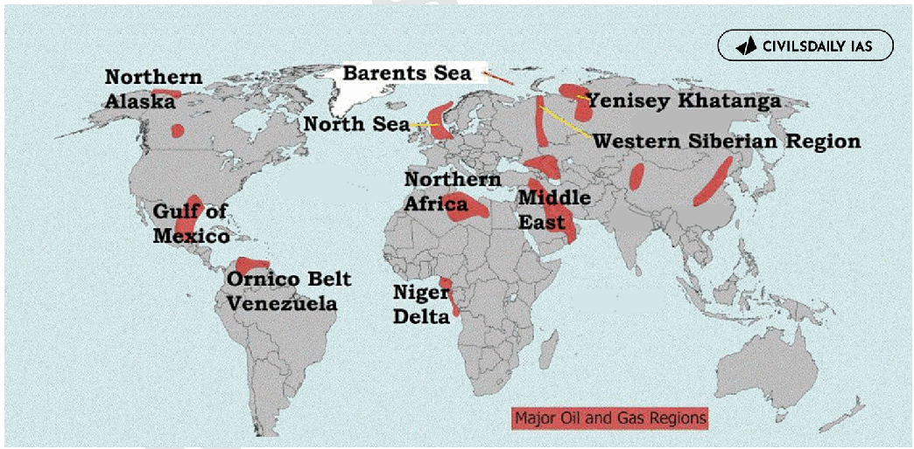

**Implications of uneven distribution of mineral oils in the world**

**1. Economic Implications a)** Energy security challenges - Oil-deficient countries face high import bills and current account deficits. Eg- India imports ~85% of its crude oil requirement.

**b)** Price Volatility- Supply disruptions cause global oil shocks, affecting global inflation. Eg- Oil price spike during the Russia-Ukraine conflict.

**c)** Resource Curse in Oil-rich Nations (Paradox of Plenty) - Overdependence on oil leads to limited economic diversification. Eg- Venezuela’s economic crisis.

**d)** Petrodollar Accumulation - Oil exporters accumulate large foreign exchange reserves and sovereign wealth funds. Eg- Norway's GPFG or Saudi Arabia's PIF e) Development of Unconventional Sources - Countries adopt shale oil and oil sands to reduce dependence. Eg- USA shale revolution.

**2. Geopolitical Implications a)** Energy trade is one of the key driver of global geopolitics. Eg- US sanctions on Russian and Iran oil trade **b)** Competition for oil resources leads to wars and regional instability. Eg- Gulf Wars, Saudi-Iran rivalry.

**c)** Formation of Cartels - to influence global supply and prices. Eg- OPEC’s production decisions.

**d)** Strategic Alliances - Oil trade shapes foreign policy and defence partnerships.

- US-Saudi strategic relations.

- India’s look west policy **e)** Chokepoint Vulnerability due to dependence on narrow sea routes. Eg- Strait of Hormuz, Malacca Strait.

**3. Developmental and Regional Inequality a)** Infrastructure and Urbanisation - Oil wealth funds modern cities and mega-projects. Eg- Dubai and Doha.

**b)** Energy Poverty in Import-dependent Nations as high oil prices constrain development spending.

**c)** Migration patterns - Eg- expats constitute approximately 88%-90% of the total population of UAE

**4. Environmental Implications** a) Oil-rich regions face **oil spills, land degradation, and marine pollution.** Eg- Niger Delta pollution.

**b)** Global Carbon Emissions - oil and gas industry is responsible for over 5 billion tonnes of CO2 equivalent in direct emissions annually (15% of total energy-related emissions) **c)** Shift to Renewables - Import-dependent countries invest more in clean energy for energy security. Eg- India’s solar mission and Panchamrit targets In the long run, reducing oil dependence through **clean energy, strategic reserves, and diversified supply chains** is essential for ensuring **equitable and sustainable global development.**

---

1. Explanation_Drishti IAS:
Source Question: Discuss the multi-dimensional implications of uneven distribution of mineral oil in the world.

Petroleum is not distributed evenly around the world. Slightly less than half of the world’s proven reserves are located in the Middle East (including Iran but not North Africa). Following the Middle East are Canada and the United States, Latin America, Africa, and the region made up of Russia, Kazakhstan, and other countries that were once part of the Soviet Union. **This uneven distribution of mineral oil across the globe has many multi-dimensional implications.** - **Economic**: Uneven distribution of the mineral oil across the world, affects the balance of trade between the importing and the exporting countries. This in turn affects the foreign exchange reserves of the country. It also leads to economic consequences like inflation, for the importing country.

- **Political:** Many historical and present-day conflicts involve nations trying to control resource-rich territories. For example, the desire for diamond and oil resources has been the root of many armed conflicts in Africa. USA’s interference in the geopolitics of West Asia is also one of the reasons for uneven distribution of oil minerals.

- **Employment & Migration:** Availability of oil reserves leads to more job opportunities in the Middle east. That is the reason why India has a large diaspora in the middle east.

- **Uneven Growth:** Uneven distribution of mineral oil has also led to uneven growth across the globe. Rise in import prices directly hamper the capabilities of the government to spend on welfare objectives.

- **Energy Security:** The uneven distribution of the mineral oil resource is the reason for energy insecurity in the oil deficient countries. It also directly affects their strategic autonomy.

The uneven distribution of the mineral oil resources leads to various implications ranging from economic to energy security. This highlights the need for India to diversify its energy basket both in terms of content and geography.

---

1. Explanation_PWOnlyIAS:
Source Question: Discuss the multi- dimension implications of uneven distribution of mineral oil in the world.

| **Approach:** **Introduction**  • Explaining the uneven distribution of mineral oil. **Body**  • Mention some Implication that the uneven distribution of mineral oil **Conclusion**  • Conclude your Answer with significant multi-dimensional implications of mineral oil. |
| --- |

### Introduction

**The uneven distribution of mineral oil in the world. Slightly less than half of the world’s proven reserves are located in the Middle East [including Iran but not North Africa]. Following the Middle East are Canada and the United States, Latin America, Africa, and the region made up of Russia, Kazakhstan, and other countries that were once part of the Soviet Union.** Body: **The uneven distribution of mineral oil around the world has various implications that affect different dimensions, including economic, political, environmental, and social aspects.** Economic Implications **:**

- **Dependence on oil exports:** Countries with significant oil reserves tend to depend heavily on oil exports, which can make their economies vulnerable to price fluctuations, supply disruptions, and changes in global demand.
- **Resource curse:** Countries that depend solely on oil exports may experience the “resource curse” where the abundance of natural resources can lead to corruption, economic mismanagement, and social instability.
- **Unequal distribution of wealth:** The unequal distribution of oil wealth can lead to income inequality and exacerbate social tensions within countries. **Political Implications**:

- **Geopolitical tensions:** The control and ownership of oil reserves can be a source of geopolitical tensions and conflicts between countries. Countries with significant oil reserves may use oil as a tool of foreign policy, by withholding exports or using oil revenues to support political allies or proxies, leading to power imbalances and political instability.
- **Influence on international relations:** The unequal distribution of oil can create power imbalances in international relations, with countries with significant reserves of oil having greater bargaining power than those without.

**Environmental Implications:**
- **Environmental degradation:** The extraction, production, and use of mineral oil can lead to environmental degradation, such as air and water pollution, greenhouse gas emissions, and land degradation.
- **Climate change:** The continued use of fossil fuels due to an uneven distribution of mineral oil can exacerbate climate change and environmental problems, leading to long-term environmental consequences. **Social Implications**:

- **Health and safety hazards:** Communities living in proximity to oil extraction and production facilities may experience health and safety hazards due to exposure to pollution, accidents, and other risks.
- **Social inequality:** The unequal distribution of oil wealth can exacerbate income inequality and lead to social unrest within countries.

### Conclusion

The uneven distribution of mineral oil in the world has significant multi-dimensional implications for the global economy, geopolitics, and the environment. As the world continues to rely heavily on mineral oil, it is important to consider the long-term implications of this reliance and work towards finding sustainable alternatives.

---

1. Explanation_Rau IAS:
Source Question: Discuss the multi-dimensional implications of uneven distribution of mineral oil in the world. (10 Marks, 150 Words)

### Introduction

The world's supply of petroleum is not equally divided. The Middle East is home to just over half of the world's proven reserves (including Iran but not North Africa). The Middle East is followed by Canada and the United States, Latin America, Africa, and the former Soviet Union area, which includes Russia, Kazakhstan, and other nations.

### Body

**Multi-dimensional implications of uneven distribution of mineral oil:**

- Unequal access to mineral oil creating issues of energy security in countries like India, China.

- Creation of trade surplus and deficit

 - In case of Indian trade deficit, a major contribution comes from import of fossil fuel.

- Enables monopolization over scarce natural resource giving these countries disproportionate leverage over price manipulation and diplomacy. For ex: OPEC

- Conquest, conflict, and war as many historical and present-day conflicts involve nations trying to control mineral oil rich territories

 - Disproportionate attention given to the middle east region by the developed world.

- High standard of living derived not from value addition or high tech innovation but rather trade of mineral oil. 

 - Countries of the Middle East like UAE, Kuwait and Qatar have one of the highest per capita income.

### Conclusion

Because of these factors, the countries which have traditionally low levels of mineral oils have taken aggressive steps to diversify the energy sources. For example Indian investments.

---

---

1. Explanation_Superkalam:
Source Question: Discuss the multi-dimensional implications of uneven distribution of mineral oil in the world

Uneven mineral oil distribution creates complex global dynamics affecting geopolitics, economics, and environmental patterns. Recent data shows** 70% of proven reserves **concentrated in just 10 countries, fundamentally reshaping international relations.

Global Mineral Oil Distribution and Trade

## Geopolitical Implications of Oil Distribution

-** Strategic Power Centers**: Oil-rich regions like** Middle East **(48% of global reserves) and** Venezuela **(303.8 billion barrels) become focal points of international politics and potential conflict zones
-** Alliance Formation**: Resource-based partnerships emerge through organizations like** OPEC+**, controlling 40% of global oil production and influencing diplomatic relations
-** Energy Security Concerns**: Import-dependent nations like** Japan **and** Germany **develop strategic petroleum reserves and diversify supplier relationships to ensure energy security
-** Regional Conflicts**: Competition over oil resources intensifies territorial disputes, as seen in** South China Sea **tensions and** Russia-Ukraine conflict **disrupting global supply chains
-** Sanctions and Energy Weapons**: Oil becomes a geopolitical tool, with sanctions on** Iran **and** Russia **affecting global markets and creating new trade partnerships

## Economic Implications of Uneven Distribution

|** Oil-Rich Nations **|** Oil-Importing Nations **|
| --- | --- |
| Rapid GDP growth (Saudi Arabia: $833 billion GDP) | Trade deficits exceeding $2 trillion annually |
| High per-capita income but economic over-dependence | Diversified economies with renewable investments |
| Currency stability linked to oil prices | Vulnerability to price volatility ($20-120/barrel) |
| Limited economic diversification (Nigeria: 90% export dependency) | Innovation in energy efficiency and alternatives |

-** Investment Patterns**: Global energy investment reached** $3.3 trillion in 2024**, with importing nations leading renewable energy investments to reduce dependency
-** Market Concentration**: Five largest oil companies control 25% of global production, creating oligopolistic market structures affecting pricing mechanisms

## Environmental and Technological Implications

Global Oil Distribution showing concentration in Middle East, Americas, and Russia with environmental impact zones

-** Localized Environmental Degradation**: Concentrated extraction in regions like** Niger Delta **and** Alberta Tar Sands **causes severe ecological damage and pollution
-** Carbon Emission Patterns**: Oil-producing nations often have higher per-capita emissions, while importing countries develop cleaner technologies for energy efficiency
-** Clean Energy Innovation**: Oil-importing nations like** Denmark **and** Germany **lead renewable energy development, achieving 50%+ renewable electricity generation
-** Climate Policy Divergence**: Oil exporters show slower adoption of climate policies compared to importers implementing carbon pricing and green transitions
-** Technological Transfer**: Uneven distribution drives technology sharing between resource-rich and technology-advanced nations for sustainable development

The uneven mineral oil distribution continues reshaping global dynamics, with** India's **renewable energy capacity reaching** 180 GW in 2024**, demonstrating how resource constraints drive sustainable energy transitions.

---

1. Explanation_Unacademy:
Source Question: Q16. Discuss the multi-dimensional implications of uneven distribution of mineral oil in the world. (15 Marks, 250 Words) Tags: Distribution of key natural resources across the world.

## **Decoding the Question** - **Introduction: Define mineral oil and** **illustrate the distribution of mineral oil.** ## **y Body** - **Discuss several implications related to** **the uneven distribution of mineral oil.** - **Conclusion: Conclude with providing** **an insight of the current scenario and** **suggesting a way forward.** **Answer:** **Mineral oils (also known as base oils, mineral base** **oils or lubricant base oils) are chemical substances** prepared from naturally occurring crude petroleum oil. The Middle East is home to more than half of the world’sprovenoilreserves.Lessthan15%oftheworld’s proven reserves are found in Canada, the United States, Latin America, Africa, and the area inhabited by the former Soviet Union. Oil production in one area may not necessarily be equal to the size of its known reserves. For instance, the Middle East contributes for approximately 30% of global oil output despite having more than 50% of the world’s confirmed reserves. While producing around 10% of the world’s oil, the United States possesses less than 2% of the world’s proven oil reserves.

 **Fig: Distribution of Mineral Oil in the World** **The uneven distribution of oil around the world has a** ## **variety of multifaceted implications, including** - **Economical:** The balance of commerce between the nations that export and buy mineral oil is impacted by the uneven distribution of this commodity worldwide. This has an impact on the nation’s foreign exchange reserves. Additionally, it has economic repercussions for the importing nation, such as inflation. For instance: India’s current account deficit is mostly caused by India’s reliance on oil and natural gas. Kazakhstan had a national crisis as a result of an abrupt and rapid increase in fuel costs.

- **Political:** Nations vying for control of regions with abundant resources are a common factor in both historical and contemporary wars. For instance: many military conflicts in Africa have their roots in the quest for oil and diamonds.

- **Job Opportunities:** The Middle East has greater employment prospects as a result of the oil resourcesthere.Thisexplainswhythereisasizable diaspora of Indians in the middle east.

- Energy insecurity in **Security of Energy:** countries with a shortage of oil is caused by the uneven distribution of mineral energy resources. Additionally, their strategic autonomy is directly impacted. Therefore, ensuring the nation’s energy security is one of the top concerns for policymakers.

- **InternationalRelations:Theinequitableallocation** of oil resources is a crucial element in using their availability for diplomatic purposes. For instance, India has to give in to US sanctions in order to stop importing cheap Iranian oil. Similar to this, the strategic location of Pakistan poses serious obstacles to the TAPI gas project.

- **Uneven development:** Uneven growth has occurred all around the world as a result of uneven mineral oil distribution. Increased import costs have a direct negative impact on the government’s ability to spend money on welfare goals. It is generally acknowledged that energy and growth complement one another. As a result of the uneven distribution of mineral oil resources, there are several consequences, from economic to energy security. This demonstrates the necessity for India to diversify its energy portfolio in terms of both geographic and energy-related content. In order to improve energy security, which also reduces emissions and stimulates economic growth, it is vital to reduce reliance on imported fuels and diversify the energy sources used to produce power.

---

---

Q5. India has immense potential of solar energy though there are regional variations in its development. Elaborate.
[Year: 2020] [Group: UPSC CSE] [Exam: Mains] [Stage: Mains] [Paper: Mains - GS 1]
[Subject: GEOGRAPHY]
[Section Group: Economic & Resource Geography]
[Microtopic: Distribution of key Natural Resources (world, South Asia and Indian subcontinent)]
[Subtopic: Energy]
[Macrotag: Descriptive, Applied]
[Microtag: Elaborate, India]

1. Explanation_Civilsdaily:
Source Question: India has immense potential for solar energy though there are regional variations in its developments. Elaborate. [Year: 2020] [Marks: 15]

India has emerged as a global leader in solar energy with over **140 GW of installed solar capacity (Nov 2025)** and ranks **3rd in the world in solar capacity and generation.**

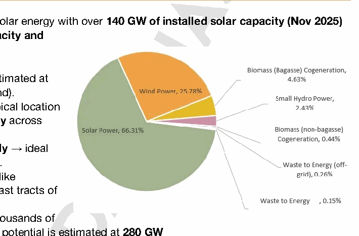

**India's Immense Potential**

1. **Total Theoretical Potential** is estimated at **748 GW** (using only 3 % wasteland).

**2. High Solar Radiation** due to tropical location

- Receives **4-7 kWh/m²/day** across most regions.

- **~300 sunny days annually** → ideal for large-scale generation.

3. **Waste Land Availability-** States like Rajasthan and Ladakh possess vast tracts of high-albedo, non-arable land

4. **Water Body Integration-** With thousands of reservoirs, India's **Floating Solar** potential is estimated at **280 GW Regional Variations in Development**

1. Western India has seen the highest development of solar power. Rajasthan accounts for around 27% of India's total capacity (~37 GW). Gujarat ranks second with ~20 GW.

  - High solar insolation

  - Availability of barren land

  - Strong transmission infrastructure

  - **Proximity to Manufacturing-** 70% of India's solar module manufacturing is concentrated in **Gujarat**

  - Eg- Bhadla (Rajasthan), Charanka Solar Park (Gujarat).

2. Southern India has witnessed moderate to high growth

  - Progressive state policies

  - Land availability in dry interiors

  - Strong private sector participation

  - **Karnataka & Tamil Nadu** have combined capacity exceeding **20 GW.**

  - Eg- Pavagada Solar Park (Karnataka).

3. Northern Plains - Moderate Potential but Slower Growth

- High population density → **land constraint.**

- Pollution and fog reduce efficiency.

- Majority of land is under Agriculture

4. Eastern and Northeastern India - Low Development

- High cloud cover, heavy rainfall, and forest cover.

- Limited grid infrastructure and investment.

5. Himalayan Region - Ladakh has very high insolation but faces-

  - Harsh climate

  - Transmission constraints

  - Fragile ecology.

6. Coastal and Urban Regions - Space constraints for large plants but high scope for distributed solar. EgKerala’s rooftop solar model.

**Steps Taken by Governments**

**Central Government Initiatives**

1. **PM-Surya Ghar- Muft Bijli Yojana** to solarize **1 crore households** by 2027

2. **Solar Park Scheme-** A target of **40 GW** across 50+ parks by March 2026.

3. **PM-KUSUM-** Solarizing over 30 million irrigation pumps.

4. **PLI Scheme-** to boost domestic manufacturing of high-efficiency solar modules .

**State Government Initiatives**

- **Surya Urja Yojana of Gujarat** provides subsidy upto 40000.

- **Delhi** residential rooftop solar scheme

- **Uttar Pradesh-** Promoting **"Solar Cities"** like Ayodhya A balanced strategy focusing on **decentralised solar, grid expansion, storage systems, and region-specific planning** is essential to achieve **Panchamrit Targets.**

---

1. Explanation_Drishti IAS:
Source Question: India hasimmense potential ofsolar energy though there are regional variationsin its developments. Elaborate.

- Solar energy is a renewable source of energy that is sustainable and inexhaustible, unlike fossil fuels. Fortunately, India has been endowed with huge solar energy potential with 5,000 trillion kWh per year energy incident over India’s land area and most parts receiving 4-7 kWh per sq. m per day.

- However, different parts of Earth’s surface receive different amounts of sunlight; therefore, all regions are not equally suitable for solar power generation. Since almost half of India lies in the tropical region while the other half in the temperate region, therefore all regions within the country are not equally suitable for solar energy generation.

- South Western parts of Rajasthan, Gujarat, Maharashtra, Karnataka,Odisha, Tamil Nadu, Telangana, and Andhra Pradesh are some of the beststatessuited forsolar power generation, asthey lie in the tropics. On the other hand, areas of Punjab,Himachal Pradesh,Uttar Pradesh, and Bihar are comparatively lesssuited to solar power generation, as they are mainly concentrated in temperate regions.

- Besides solar radiation intensity, various other factors responsible for installation of solar power plants are quality of local physical terrain, environment, and distance of the site from the nearest substations for grid connectivity.

- As per current position (May 2020), Karnataka leads the solar power production in the country with a total installed capacity of about 7100 MW. The second position is occupied by Telangana (5000 MW) followed by Rajasthan (4400 MW).

- India is a solar rich country and is also leading the International Solar Alliance (ISA). In fact, India’s prolific solar power producing states are boosting India’s ability and willingness to ensure fulfilment of the country’s aim of achieving 175 GW of renewable energy by 2022.

---

1. Explanation_PWOnlyIAS:
Source Question: India has immense potential for solar energy though there are regional variations in its development. Elaborate.

**Answer:**

| **Approach:** **Introduction**  • Write data related to Solar Energy. **Body**  • Elaborate regional variation in India. **Conclusion**  • Conclude your answer with Government initiative and its impact. |
| --- |

### Introduction

**Solar energy is a major component of India’s renewable energy portfolio, owing to its vast potential with a solar energy availability of 4000 trillion KWh per year. India has committed to generating 100 GW of solar power out of 175 GW of renewable energy by 2022 under the Intended Nationally Determined Contributions (INDCs). Currently, India has an installed solar capacity of 43 GW.** Body: ****
**Regional variations**:

- **Desert areas:** of Rajasthan and Kutch, which have barren lands and receive high insolation, are considered ideal for solar energy generation.
- **Himalayan and north-eastern regions:** have a lower potential for solar energy generation due to their low insolation levels and challenging terrain.
- **Coastal states:** like Kerala have moderate solar energy generation potential due to the long monsoon season compared to heartland states.
- **States closer to the tropics:** , which receive high solar insolation, are considered hotspots.
- **Rooftop solar panel program:** has tremendous potential in urban cities and can contribute significantly to India’s solar energy goals.

**Challenges to solar energy program:**
- **Overproduction:** Leading to very low tariff rates is one such challenge, which can discourage investment in solar energy projects.
- **Poor integration:** Solar energy with the grid and the acquisition of land for solar parks are other challenges.
- **Production and technological barriers:** , particularly the dependence on lithium imports from China for PV cells, are another challenge that needs to be addressed.
- **Rooftop solar installations:** issue because of poor awareness and finances.

### Conclusion

The Indian government has taken several initiatives and policies to propel the solar energy market, including, SARAL Index, PM KUSUM Floating solar plants in Gujarat, and ISA in Haryana. Solar energy, with its low carbon footprint, can be a potential substitute for conventional energy sources and can help India fulfill its commitments under the INDCs and Panchamrit proposals at COP 26.

---

1. Explanation_Superkalam:
Source Question: India has immense potential for solar energy though there are regional variations in its developments. Elaborate.

India's abundant solar potential is transforming its energy landscape, with the country receiving approximately** 4-7 kWh per square meter daily **of solar radiation across different regions.

India solar energy potential outline map

## India's Solar Energy Potential

-** Geographic Advantage**: Located between 8°4'N to 37°6'N latitude, India receives about** 5,000 trillion kWh **of solar energy annually with over** 300 sunny days **per year.
-** Current Capacity**: Achieved** 75+ GW **of installed solar capacity as of 2024, targeting** 280 GW **by 2030 under National Solar Mission.
-** Land Availability**: Possesses vast unused land areas, particularly in Rajasthan and Gujarat, suitable for large-scale solar installations.
-** Government Support**: Enhanced policies including** Production Linked Incentive (PLI) **scheme with ₹24,000 crore allocation for solar manufacturing.
-** Cost Competitiveness**: Solar tariffs have dropped to** ₹1.99 per kWh **in recent auctions, making it highly competitive with conventional sources.

## Regional Development Variations

### High Potential Regions

-** Rajasthan**: Leads with** Bhadla Solar Park (2,245 MW) **- world's fourth-largest solar park, receiving 5.5-6.5 kWh/m²/day
-** Gujarat**: Houses** Charanka Solar Park **and benefits from minimal cloud cover with 5.0-6.0 kWh/m²/day
-** Madhya Pradesh**:** Rewa Solar Park (750 MW) **demonstrates excellent solar irradiance of 5.5 kWh/m²/day

### Moderate Potential Areas

-** Maharashtra & Karnataka**: Developing significant capacity despite moderate irradiance of 4.5-5.5 kWh/m²/day
-** Andhra Pradesh & Telangana**: Rapidly expanding with favorable state policies and 5.0-5.5 kWh/m²/day potential

### Challenging Regions

-** Northeastern States**: Limited development due to high monsoon rainfall, cloud cover, and hilly terrain reducing irradiance to 3.5-4.5 kWh/m²/day
-** Coastal Areas**: Face humidity-related efficiency losses and space constraints despite moderate solar potential

## Key Development Factors

|** Factor **|** Impact **|** Regional Example **|
| --- | --- | --- |
|** Solar Irradiance **| Direct correlation with generation | Rajasthan > Northeast |
|** Land Availability **| Determines project scale | Desert regions advantageous |
|** Grid Infrastructure **| Affects project viability | Better in western/southern states |
|** State Policies **| Influences investment flow | Gujarat's early mover advantage |

India's** National Solar Mission 2.0 **and initiatives like** PM-KUSUM **for agricultural solar pumps are addressing regional disparities while maximizing the country's immense** 748 GW **theoretical solar potential across diverse geographical zones.

---

1. Explanation_Unacademy:
Source Question: Q16. India has immense potential for solar energy though there are regional variations in its developments. Elaborate. (250 words, 15 marks) Tag: Distribution of key natural resources across the world (including South Asia and the Indian sub-continent).

## **Decoding the Question** - **In Introduction, try to put some facts/data** **with respect to Solar Energy in India and its** **huge potential.** - **In Body,** - **Elaborate about solar energy regional** **variation in India with one or two** **examples.** - **Elaborate measures which can overcome** **these regional variations as well as other** **problems associated with solar energy.** - **In Conclusion, you can quote Research and** **Development in Solar Installations and also** **mention Government’s initiative and its** **impact.** **Answer:** Solar power in India is a fast-developing industry. As a part of its efforts under the 2015 Paris Climate Agreement and Commitment of International Solar Alliance, Indiahascommitted to **cut carbon emissions** **byathirdby2020from2005levels.Solarenergyandits** potential would be significant in India’s commitment.

## **India’s Potential of Solar Energy** - India lying in the tropical belt has an advantage of receiving peak solar radiation for 300 days, **amounting 2300-3,000 hours of sunshine** **equivalent to above 5,000 trillion** KWh.

- The country’s solar installed capacity reached **35.12 GW recently.** - India has the **lowest capital cost per MW** globally of installing solar power plants.

- The government of India had an initial target of 20 GW capacity for 2022, which was **achieved four** **years ahead of schedule.** - In 2015, the **target was raised to 100 GW of solar** **capacity** (including 40 GW from rooftop solar) by 2022, targeting an investment of US$100 billion. **ThoughIndiahasmadeprogressintermsofdeploying** **renewables as part of its climate commitments, there** **has been a temporal and regional variation in terms** **of installed capacity due to geographical conditions,** **insolation received in various parts varies thus** ## **affecting the solar energy potential** ## **y Rajasthan** - **Rajasthan clinched the top position** in the list of states with the highest estimated solar energy potential in the country. Reason behind this achievement is that Rajasthan receives maximum insolation as well as has barren unculturable land. That’s why it **has the** **maximum number of solar power projects.** - Most identified **solar hotspots lie in states** **like Gujarat, Maharashtra, Andhra Pradesh,** **Karnataka, and Tamil Nadu** are fortunate in receiving insolation of Sun.

 - The **Eastern Himalayan states like Arunachal** **Pradesh, Nagaland, and Assam receive** **annual average insolation below 4Kwh/meter.** **Sq./Day,** which makes these states rely more on power grid and electricity from different states.

## **y Addressing the regional variations** - This can be done through **Concentrated Solar** **Power** wherein storing heat is an option. Due to better cooling of the solar panels and the sun tracking system, the output of solar panels is enhanced substantially.

 - One alternative is to **use the water-surface** **area on canals, lakes, reservoirs, farm ponds** **and the sea for large solar-power plants.** These water bodies can also provide water to clean the solar panels.

 - The architecture best suited to most of India would be a set of **rooftop power-generation** **systems** connected via a local grid.

 - The **National Solar Mission** also aimed to launch major R&D programmes in order to create more affordable and convenient solar systems with provisions for long term storage options. Therefore, **aggressive R&D** has also been initiated empowering the domestic manufacturing sector and creation of intra-state transmission lines in states like Gujarat, Himachal Pradesh, Karnataka, Madhya Pradesh,Rajasthan,andMaharashtra.Strongfinancial **measures** are required to fund the solar projects, innovative steps like green bonds, institutional loans and clean energy funds can play a crucial role.

---

---

Q6. What are the economic significances of discovery of oil in Arctic Sea and its possible environmental consequences?
[Year: 2015] [Group: UPSC CSE] [Exam: Mains] [Stage: Mains] [Paper: Mains - GS 1]
[Subject: GEOGRAPHY]
[Section Group: Economic & Resource Geography]
[Microtopic: Distribution of key Natural Resources (world, South Asia and Indian subcontinent)]
[Subtopic: Energy]
[Macrotag: Descriptive]
[Microtag: What]

1. Explanation_PWOnlyIAS:
Source Question: What is the economic significance of the discovery of oil in the Arctic Sea and its possible environmental consequences?[200 Words, 12.5 Marks ]

| **Approach:** **Introduction**  • Start your answer with Data and importance. **Body**  • Discuss the advantages and disadvantages of Arctic oil reserves. **Conclusion**  • Summary of the answer with futuristic approach. |
| --- |

### Introduction

**Arctic oil can be found both on and offshore but the vast majority [an estimated 84%] is offshore. The Arctic Sea has the potential to transform the global energy market. The economic benefits of this discovery must be weighed against the potential environmental consequences of extracting and transporting oil in this sensitive ecosystem.** Body: ****

**Positive Implications:**
- **Increased oil supply:** The Arctic region is estimated to hold significant oil reserves, and the discovery of oil in the Arctic ocean could increase global oil supply, potentially reducing oil prices.
- **Economic growth:** The development of infrastructure, connectivity and the extraction of oil in the Arctic could create jobs and stimulate economic growth in countries with Arctic coastlines, Like **Russia, Canada, and Norway**.

**

**
- **Diversification of energy sources:** Access to Arctic oil could reduce dependence on oil from other regions, providing a more diverse energy mix for countries and enhancing energy security.

**Negative Implications:**
- **Environmental risks:** The exploration and extraction of oil in the Arctic pose significant environmental risks, including oil spills, pollution, and damage to the fragile Arctic ecosystem. Any accidents could have severe and long-lasting impacts on marine life, birds, and other wildlife in the area.
- **Climate change:** The extraction of fossil fuels, including Arctic oil, contributes to greenhouse gas emissions and climate change. As the urgency of reducing emissions and limiting global warming grows, exploiting Arctic oil reserves may not be a sustainable long-term solution for energy security and economic growth.
- **Geopolitical tensions:** Access to Arctic oil reserves could exacerbate geopolitical tensions between Arctic countries and could lead to conflicts over oil reserves and shipping routes.

### Conclusion

The discovery of oil reserves in the Arctic Sea could have significant economic benefits, it is essential to consider the potential environmental consequences carefully. Developing sustainable and responsible methods for extracting and transporting oil in this region is crucial to ensure that the economic benefits are balanced with protecting the delicate Arctic ecosystem for future generations.

---

1. Explanation_Superkalam:
Source Question: What is the economic significance of the discovery of oil in the Arctic Sea and its possible environmental consequences?

The discovery of oil in the Arctic Sea presents both significant economic opportunities and environmental challenges, requiring careful evaluation of its implications for global energy security and ecological preservation.

Arctic Oil Discovery Dual Branch Flowchart

## Economic Significance of Arctic Oil Discovery

-** Massive Energy Reserves**: The Arctic region holds an estimated** 90 billion barrels **of technically recoverable oil reserves according to the** USGS**, representing approximately** 13% of global undiscovered oil resources**.
-** Energy Security Enhancement**:

 - Potential to reduce dependency of oil-importing nations like** India**, which currently imports** 90.6% **of its crude oil requirements
 - Could stabilize global oil prices and diversify supply sources away from geopolitically sensitive regions

-** Economic Development Opportunities**:

 - Creation of new employment in oil exploration, extraction, and supporting industries
 - Development of Arctic shipping infrastructure and the** Northern Sea Route**, reducing shipping distances by up to** 40% **- Technological advancement in Arctic drilling and extraction capabilities

-** Regional Economic Growth**:

 - Significant revenue generation for Arctic nations like** Norway, Russia, and Canada **- Development of remote Arctic communities through industrial activities
 - Investment in research and development of cold-weather technologies

-** Strategic Geopolitical Advantages**: Enhanced energy independence and bargaining power in international relations for resource-holding nations

## Environmental Consequences of Arctic Oil Extraction

|** Environmental Impact **|** Specific Consequences **|
| --- | --- |
|** Climate Change **| Accelerated Arctic ice melting, release of trapped methane from permafrost |
|** Marine Ecosystems **| Oil spill risks, disruption of Arctic marine food chains |
|** Wildlife Impact **| Threat to polar bears, seals, Arctic birds migration patterns |
|** Ocean Chemistry **| Potential acidification, temperature changes affecting marine life |
|** Global Weather **| Disruption of Arctic's role in global climate regulation |

-** Regulatory Framework Challenges**:

 -** UNCLOS **establishes** Exclusive Economic Zones (EEZs) **but enforcement remains complex
 - Need for enhanced international cooperation through bodies like the** Arctic Council **-** Sustainable Development Conflict**: Balance between** SDG 7 (Affordable Energy) **and** SDG 13 (Climate Action) **objectives

The Arctic oil discovery represents a critical juncture where economic imperatives must be balanced with environmental stewardship. The** Paris Agreement **commitments and** COP28 **outcomes should guide responsible extraction practices while ensuring this fragile ecosystem's preservation for future generations.

---

1. Explanation_Unacademy:
Source Question: Q20. What is the economic significance of the discovery of oil in the Arctic Sea and its possible environmental consequences? (12.5 marks, 200 words) Tag: Distribution of key natural resources across the world.

## **Decoding the Question** - **In Introduction, try to begin with the** **discovery of oil in the Arctic region and give** **some supporting data.** - **In Body, discuss** - **About the economic effect.** - **It’s environmental consequences.** - **Briefly on areas of focus.** - **Conclude the answer with some recent** **developments and SDG outlook.** **Answer:** The Arctic’s vast reservoirs of fossil fuel, fish and minerals, including rare earth materials, are now accessible for a longer period. But unlike Antarctica, which is protected from exploitation by the Antarctic Treaty framed during the Cold War and is not subject to territorial claims by any country. There is no legal regime protecting the Arctic from industrialisation, especiallyatatimewhentheworldcravesformoreand more resources. Of the eight Arctic nations—Russia, Sweden, Norway, Iceland, Denmark (Greenland), Finland, Canada and the US—several have explored the Arctic waters and found over 400 oil fields with proven reserves of around 240 billion barrels of crude oil and natural gas. This is about 10 percent of the world’s known hydrocarbon reserves. They have also discovered significant deposits of various minerals on the seabed. New reserves will be available with further melting of the polar sea ice. The US Geological Survey estimates that the Arctic holds up to 20 per cent of the world’s unexplored hydrocarbon reserves, with potential oil reserves of 90 billion barrels, natural gas reserves of 47.3 trillion cubic metres and gas condensate reserves of 44 billion barrels. Around 80 per cent of these new discoveries are likely to be found offshore at an easy depth of 500 metres. **Economic impact:** With oil prices fluctuating over the past few years and a great uncertainty on how to secure the world’s future energy supply, the attractiveness of Arctic petroleum exploration is increasing, bringing with it the promise of economic development and job creation. Approximately 10% of the Arctic population is indigenous, and many Arctic inhabitants sustain a traditional livelihood that combines hunting and fishing or reindeer herding with a nomadic lifestyle. Offshore petroleum activities, which are, of course, carried out mainly at sea, have a limited impact on them, although any industrial development or population increase caused by the oil industry can boost to the local economy **Environmental impact:** Chances of an oil spill accident in the Arctic are higher, as navigation for oil carrying ships is extremely tricky given nautical maps cannot be faithfully relied on. This is due to lack of mapping, rising sea levels, melting permafrost and coastal erosion. If an oil spill does happen, the Arctic is particularly vulnerable as there is little capacity to respond. The region is highly remote, and responders may have a long way to travel. Changing weather conditions, low visibility and a lack of emergency preparedness, equipment and trained responders does not promote a quick and efficient response either.

- Greenpeace (a non-governmental environmental organization) asserted that the drilling industry is unprepared, in fact unable, to clean up a major Arctic oil spill.They do not have the technology, nor the infrastructure, to deal with the specific challenges of a disaster in this region Additionally, national and international regulation in the areas of environmental safety, legality, liability and compensation in offshore oil exploration in the Arctic is insufficient and uncoordinated, and adequate technology to contain and remove oil spilled in ice covered waters has not been fully developed. Although working groups like the Emergency Prevention, Preparedness and Response (EPPR) under the Arctic Council have the mandate to develop guidelines for risk assessment, methodologies for response, and more, they are not complete and will not be legally binding. But of greatest concern from an ecological and ecotoxicological data standpoint, there is so little known about the Arctic, especially when it comes to understanding the physiological and life cycle adaptationsofuniquemarineecosystemsintheregion. **Area of focus within water and environment, the** ## **areas we need to explore further include** - Combined effects of stress from climate change and pollution from oil

- Cumulative effects from other kinds of pollution and potential oil spills

- Better and more effective oil spill response technologies

- Proper research, risk assessment, innovation & regulation are mandatory European Union’s project Arctic Climate Change, Economy and Society (ACCESS) carried out a transdisciplinary assessment of physical impacts of climate change on the Arctic Ocean and the resulting socio-economic impacts within the Arctic region focussing on key economic activities: shipping, tourism, sea food production and natural resource extraction up to 2050. Oil and gas exploitation in the Arctic region is by no means a new development but to achieve Sustainable Development Goals we must use this opportunity judiciously.

 **ANSWERS AND EXPLANATION** ---

---

Q7. It is said the India has substantial reserves of shale oil and gas, which can feed the needs of country for quarter century. However, tapping of the resources doesn’t ap- pear to be high on the agenda. Discuss critically the availability and issues involved.
[Year: 2013] [Group: UPSC CSE] [Exam: Mains] [Stage: Mains] [Paper: Mains - GS 1]
[Subject: GEOGRAPHY]
[Section Group: Economic & Resource Geography]
[Microtopic: Distribution of key Natural Resources (world, South Asia and Indian subcontinent)]
[Subtopic: Energy]
[Macrotag: Descriptive, Analytical, Applied]
[Microtag: How, Discuss, India]

1. Explanation_PWOnlyIAS:
Source Question: It is said that India has substantial reserves of shale oil and gas, which can feed the needs of the country for a quarter century. However, tapping of the resource does not appear to be high on agenda. Discuss critically the availability and issues involved.

| **Approach:** **Introduction**  • Brief about significant reserves in India. **Body**  • Discuss availability and issues involved in tapping of shale oil and gas in India. **Conclusion**  • Conclude your answer with issues involved in tapping. |
| --- |

### Introduction

**India is believed to have significant reserves of shale oil and gas, which could potentially meet the country’s energy needs for a quarter-century. Despite the potential, the tapping of these resources does not seem to be high on the agenda.** Body: ****

**Availability of Shale Oil and Gas in India**
- **India is estimated to have significant reserves of shale oil and gas, primarily located in the Cambay, Krishna-Godavari, and Cauvery basins. These reserves are estimated to be:** around 96 trillion cubic **feet of gas and** 1 billion barrels **of oil.**
- The extraction of shale oil and gas requires advanced drilling technologies, which are expensive and complex to deploy. The commercial viability of shale gas and oil extraction in India largely depends on the availability of cost-effective and efficient extraction technologies.
- India has significant reserves of coal bed methane [CBM], which can be extracted using similar techniques as shale gas.
- India has the fifth-largest CBM reserves in the world, with an estimated reserve of **2,700 billion cubic meters**.

 **Issues Involved in Tapping Shale Oil and Gas Reserves in India:** Despite having substantial reserves, tapping shale oil and gas reserves in India has been slow due to various reasons, including regulatory issues, environmental concerns, and lack of infrastructure:-

- **The regulatory framework:** for shale gas extraction is not well developed, and the environmental impact of fracking and drilling operations is not fully understood.
- This has led to concerns about potential **groundwater contamination** and seismic activity.
- The **lack of infrastructure,** including pipelines, storage facilities, and processing plants, is a significant challenge in the development of shale gas and oil industry in India. This lack of infrastructure has also contributed to the slow progress of CBM extraction in the country.
- The **cost of shale gas and oil extraction** in India is also relatively high compared to other countries due to the lack of economies of scale, regulatory challenges, and lack of infrastructure.

### Conclusion

India has substantial reserves of shale oil and gas, there are several challenges that need to be addressed to effectively tap into these resources. These include environmental concerns, the high cost of extraction, and the need for advanced technology and infrastructure. As such, a critical evaluation of the feasibility of shale oil and gas extraction is necessary before making any decisions on their exploitation.

---

1. Explanation_Superkalam:
Source Question: It is said that India has substantial reserves of shale oil and gas, which can feed the needs of the country for a quarter century. However, tapping the resources doesn’t appear to be high on the agenda. Discuss critically the availability and issues involved.

India's pursuit of energy security has led to increased focus on unconventional hydrocarbon resources. According to recent estimates by the US Energy Information Administration, India possesses** 96 trillion cubic feet of recoverable shale gas and 3.8 billion barrels of shale oil**, potentially meeting energy needs for decades.

India's Major Shale Gas Basins Highlighted

## Availability and Potential of Shale Resources

-** Major Basins**: Primary deposits located in** Cambay Basin (Gujarat), Krishna-Godavari Basin (Andhra Pradesh), Cauvery Basin (Tamil Nadu)**, and** Damodar Valley (Jharkhand-West Bengal) **-** Resource Assessment**: ONGC's preliminary studies indicate substantial reserves in** Cambay Basin alone estimated at 26 trillion cubic feet **-** Strategic Importance**: Could reduce India's** 85% crude oil import dependency **and enhance energy security
-** Policy Framework**:** Hydrocarbon Exploration and Licensing Policy (HELP) 2016 **unified licensing for conventional and unconventional resources
-** Current Status**:** ONGC and Oil India Limited **conducting pilot projects in identified shale blocks

## Issues and Challenges in Exploitation

-** Technological Barriers**:

 - Limited expertise in** hydraulic fracturing (fracking) **technology
 - Lack of advanced horizontal drilling capabilities
 - Inadequate processing and transportation infrastructure
 - Dependence on foreign technology and equipment

-** Environmental Concerns**:

 - High water requirements (**3-5 million gallons per well**) in water-stressed regions
 - Risk of groundwater contamination from chemical additives
 - Potential for induced seismicity and air quality degradation
 - Waste management challenges from flowback water

-** Economic Viability Issues**:

 -** High extraction costs ($40-60 per barrel) **compared to conventional oil
 - Uncertain global energy prices affecting investment returns
 - Competition from cheaper** imported crude oil and LNG **- Limited private sector participation due to regulatory uncertainties

-** Regulatory and Land Acquisition Challenges**:

 - Complex environmental clearance procedures
 - Land acquisition difficulties in densely populated areas
 - Lack of comprehensive shale-specific regulations
 - State vs. central government jurisdictional issues

## Way Forward

India needs strategic technology partnerships with countries like the** USA**, streamlined regulatory frameworks, and comprehensive environmental impact assessments. The success of** HELP policy implementation **and initiatives like the** National Exploration Licensing Policy **will determine India's shale energy future while balancing economic benefits with environmental sustainability.

---

1. Explanation_Unacademy:
Source Question: Q25. It is said that India has substantial reserves of shale oil and gas, which can feed the needs of the country for a quarter century. However, tapping of the resources doesn’t appear to be high on the agenda. Discuss critically the availability and issues involved. 10 marks-200 words Tags: Distribution of key natural resources. Decoding the Question;

- **In Introduction, try to define shale gas.** - **In Body, mention the major challenges to tap** **the potential of shale gas in India.** - **Conclude your answer by suggesting** **measures to use the resources available to** **meet the demands in the energy sector.** **Answer:** **India** is the **third largest consumer of energy** in the world after China and the USA but most of this energy demand is **met through imports.** These high imports dent the **fiscal stability** and adversely affect the **energy** **security** of the country. **Unconventional gas sources** may come to the rescue to address these issues. One of the unconventional gas sources is known as the **shale oil and gas,** these are basically the **fine grained** **sedimentary rocks** formed of organic mud in the river basins or near the **bottom of the old seas.** Unconventional gas sources are the ones that their production needs **greater effort** than the other similar resources. They also **require specialized technology,** depending on the nature of their presence. The **following sources of gas have been categorized as** ## **unconventional ones** - Coal bed methane (CBM)

- Coal mine methane (CMM)

- **Shale oil and gas** - Tight gas **Availability of the Shale Oil and Gas Resources in** **India:** The Government of India has carried out studies throughvariousnationalandinternationalagenciesfor the identification of shale oil and gas resources in the country. Based on thedata available from conventional oil/gas exploration in the country for the last so many years, the country holds **promising reserves of Shale** **Gas & Oil resources,** and the following **sedimentary** **basins** are considered prospective from Shale oil and

## **gas point of view** - Cambay Basin

- Gondwana Basin

- KG Basin

- Cauvery Basin

- Indo-Gangetic Basin

- Assam & Assam-Arakan Basin **Major Challenges Utilizing the Shale Oil and Gas** **Resources:** Though India has **substantial reserves of shale oil** **and gas,** which can feed the needs of the country for a quarter century, taking advantage of these resources have never been on the forefront. The challenges for

## **this are** - The reserves are usually very deep, exceeding 5000 feet, hence it becomes very tedious and risky to extract the gas.

- Deep drillings have been detested by the environmentalists as they could permanently damage the quality of **the ground water and** **contaminate them.** - The drilling (known as fracking activity) **needs a** **lot of water consumption** (around 10 times more needed for conventional sources), a water scarce country like India cannot afford that.

- Structural integrity of the land remains an issue as it exposes the potential **for increased seismic** **activity.** Thelatestpolicybrief“ShaleGasinIndia:LookBefore **You Leap”** by The Energy and Research Institute (TERI) explores the question of **shale gas being a** **game changer in the context of India.** The Ministry of Petroleum & Natural Gas, Govt. of India has **granted** **permission for Shale gas and oil exploration and** **exploitation** to various groups now. The policy was announced with the exclusive **purpose of promoting** **Shale Gas & Oil operations,** which has the potential to **feed the energy needs of the country for a quarter** **century.** **ANSWERS AND EXPLANATION**

---

---

Q8. With growing scarcity of fossil fuels, the atomic energy is gaining more and more sig- nificance in India. Discuss the availability of raw material required for the generation of atomic energy in India and in the world.
[Year: 2013] [Group: UPSC CSE] [Exam: Mains] [Stage: Mains] [Paper: Mains - GS 1]
[Subject: GEOGRAPHY]
[Section Group: Economic & Resource Geography]
[Microtopic: Distribution of key Natural Resources (world, South Asia and Indian subcontinent)]
[Subtopic: Energy]
[Macrotag: Analytical, Applied]
[Microtag: Discuss, India]
##### Subtopic: Natural resources Potential

1. Explanation_PWOnlyIAS:
Source Question: With growing scarcity of fossil fuels, atomic energy is gaining more and more significance in India. Discuss the availability of raw material required for the generation of atomic energy in India and in the world.

**Answer:**

| **Approach:** **Introduction**  • Start your answer with the importance of fossil fuel. **Body**  • Discuss about Uranium and Thorium reserves in India and world and their Challenges. **Conclusion**  • Summary of the answer with futuristic approach. |
| --- |

### Introduction

**India currently has a total installed nuclear power capacity of 6,780 MW, which accounts for around 2% of the country’s total power generation capacity. The government has set a target to increase this capacity to 22,480 MW by 2031, with several new nuclear power plants under construction or planned for construction.** Body: **The increasing scarcity of fossil fuels has led to a greater reliance on nuclear energy worldwide, and India is no exception. It is crucial to examine the availability of raw materials required for the generation of atomic energy both in India and globally.**

 **Uranium reserves:**

- India has significant reserves of uranium, a key raw material required for the generation of atomic energy. The country is estimated to have around **70,000 tonnes** of uranium, primarily located in the states of Jharkhand, Andhra Pradesh, and Meghalaya.
- The uranium reserves in India are considered to be of medium to high-grade, and efforts are being made to increase uranium exploration and mining in the country. Australia, Canada, and Kazakhstan have large uranium reserves and are major producers of uranium, supplying it to countries such as the USA, France, and China. **Thorium reserves:
- **India has significant reserves of thorium, another raw material used in the generation of atomic energy. India is estimated to have around:** 25% **of the world’s thorium reserves, primarily located in the beach sands of the southern states of** Tamil Nadu, Kerala, and Odisha **.**
- The country’s vast thorium reserves offer significant potential for the development of a thorium-based nuclear power program.

**Challenges in raw material availability**
India has significant reserves of uranium and thorium, there are challenges associated with the availability of these raw materials.
- Uranium mining in India faces several regulatory and environmental challenges, which have resulted in delays and a slower pace of exploration and mining.
- India’s thorium-based nuclear program is still in the research and development stage, and there are challenges associated with the commercial-scale deployment of thorium-based reactors.

### Conclusion

India has significant reserves of uranium, it still relies on imports to meet its requirements. Moreover, the production of nuclear energy raises concerns regarding the safe disposal of nuclear waste. Therefore, the development of alternative sources of energy remains a pressing need.

---

1. Explanation_Superkalam:
Source Question: With the growing scarcity of fossil fuels, atomic energy is gaining more and more significance in India. Discuss the availability of raw materials required for the generation of atomic energy in India and the world.

With fossil fuel depletion accelerating globally, India's atomic energy program has emerged as a crucial pillar for sustainable energy security and climate commitments.

India atomic mineral reserves uranium locations

## Uranium Availability in India

-** Domestic Reserves **- India possesses approximately** 76,000 tonnes **of uranium reserves, sufficient for** 10,000 MW **capacity for 30 years
 - Major deposits located in** Jharkhand (Jaduguda mines)**,** Andhra Pradesh (Tummalapalle)**,** Rajasthan (Rohil)**, and** Meghalaya **-** Tummalapalle **in Andhra Pradesh contains one of world's largest uranium deposits with** 49,000 tonnes **- Domestic production meets only** 25% **of current demand, creating import dependency
 - Extraction challenges due to low-grade ore and high mining costs

-** Import Dependencies **- Strategic agreements with** Kazakhstan**,** Canada**,** Australia**, and** Uzbekistan **for uranium supply
 - Plans to import** 9,000 MTU **between 2025-2033 for upcoming reactors
 -** Civil Nuclear Deal **with USA opened access to international nuclear fuel markets
 - Recent partnerships with** Russia **for long-term fuel supply security

## Thorium Resources - India's Strategic Advantage

-** World's Largest Reserves **- India holds** 25%** of global thorium reserves (**457,000-508,000 tonnes**)
 -** Monazite-rich beach sands **along coasts of** Kerala**,** Tamil Nadu**,** Odisha**, and** Andhra Pradesh **-** 11.93 million tonnes **of in-situ monazite resources identified by Department of Atomic Energy
 -** Three-stage nuclear program **designed specifically to utilize thorium effectively
 - Thorium can provide energy for over** 400 years **at current consumption rates

## Global Raw Material Distribution

| Country | Uranium Reserves (tonnes) | Thorium Reserves (tonnes) | Key Features |
| --- | --- | --- | --- |
|** Australia **| 1,692,700 | 595,000 | World's largest uranium producer |
|** Kazakhstan **| 906,800 | 50,000 | Major supplier to India |
|** Canada **| 588,500 | 172,000 | Advanced nuclear technology |
|** Russia **| 486,000 | 75,000 | Complete fuel cycle services |
|** India **| 76,000 | 457,000 | Largest thorium reserves globally |

## Challenges and Opportunities

-** Technical Challenges **- Complex thorium fuel cycle technology still under development
 -** Fast Breeder Reactors **required for Stage-2 of nuclear program
 - High capital costs for thorium-based reactor construction
 - Limited global experience with thorium utilization

-** Strategic Opportunities **-** Prototype Fast Breeder Reactor (PFBR) **at Kalpakkam operational since 2024
 - Indigenous** Advanced Heavy Water Reactor (AHWR) **development for thorium use
 - Potential thorium export opportunities to countries like** China **and** USA **-** Make in India **initiative promoting domestic nuclear equipment manufacturing

India's unique position with abundant thorium reserves and the visionary three-stage nuclear program positions it as a future leader in clean atomic energy. Success in thorium utilization under the** Atmanirbhar Bharat **initiative will significantly enhance energy security while supporting** Net Zero 2070** commitments.

---

1. Explanation_Unacademy:
Source Question: Q24. With growing scarcity of fossil fuels, atomic energy is gaining more and more significance in India. Discuss the availability of raw material required for the generation of atomic energy in India and in the world. (10 marks, 200 words) Tag: Distribution of key natural resources.

## **Decoding the Question** - **In Introduction, start with writing briefly** **on why and how atomic energy can be an** **alternative to fossil fuel.** - **In Body,** - **Discuss the reasons why atomic energy** **can be chosen as an alternative to fossil** **fuel.** - **Mention the raw materials required for** **the generation of atomic energy.** - **In Conclusion, mention the importance of** **atomic energy and provide some relevant** **statistics.** **Answer:** Rapid **expansion in global energy demand** and the growing awareness of the **need for sustainable** **development** has put increasing focus on the environmental consequences of burning fossil fuels. India **imports 80% of its energy demand** and **more than half of the total electricity produced** in the country is through **thermal plants.** The need to look beyond fossil fuels and invest more on atomic energy now seems to be a viable option. Nuclear power, which currentlysuppliesaboutone-sixthofglobalelectricity, is the **principal alternative of fossil fuel** that could, in the foreseeable future, provide electricity on a large scale. **Reasons why Atomic Energy can be Chosen as an** ## **Alternative to Fossil Fuel** - The burning of fossil fuels (oil, gas, and coal) emits **greenhousegases,thereisnogreenhouseemission** of nuclear fuel produced by atomic energy.

- Nuclear fuel is a more **efficient energy source.** For the same volume of fuel, it produces far more energy than carbon-based fuels.

- Fossil fuel has a **limited supply** where nuclear fuel can be used alternatively.

- Atomic energy is a reliable **source of energy.** Reactors, with a few exceptions, spend little down time.

- Atomicenergyiscosteffectivewhenastandardized reactor design is used. Breeder reactors are designed such that they can be used as **renewable** **resources.** - Atomic energy produces **fewer wastages** as compared to fossil fuel. **Raw Materials Required for the Generation of Atomic** ## **Energy** - There are two main processes, by which atomic energy is generated: **Nuclear Fusion and Nuclear** **Fission.** For Nuclear Fission, **Uranium (U- 235,** **U233), Thorium, and Plutonium** are used. Isotopes of **Lithium and Hydrogen** are used in the process of Nuclear Fusion.

## **AvailabilityofRawMaterialinIndiaandintheWorld** - India’s **Thorium reserves account for one-fourth** of the global reserves. India, at **70,000 tonnes, has** **a significant amount of Uranium** available for the generation of atomic energy as well.

- Major areas where Thorium is found are in the States of **Odisha, West Bengal, Kerala, Jharkhand,** **Maharashtra, Tamil Nadu, Andhra Pradesh, etc.** - Uranium reserves are mostly found in **Bihar and** **Jharkhand.** Recently, it has been discovered in **Arunachal Pradesh** as well.

- Across the world, **Kazakhstan, Canada, and** **Australia lead the Uranium** mining production.

- Apart from India, **Australia, Canada and the US** have the biggest reserve of **Thorium.** With raw materials available, India is at a juncture where it has to take the atomic energy programme forward. Currently, only around **3 percent** of the total energy is being generated through this means. The government has signed **agreements regarding this** **with the USA, Japan, the UK, Australia to increase** **energy production. Energy demand** is increasing in India about twice as fast as overall energy use and is likely to rise by more than half to 2040. Nuclear deals with these countries are a step in the right direction to **meet the sustainable energy demands.** ---

---

Q9. Discuss the distribution and density of population in the Ganga River Basin with special reference to land, soil and water resources.
[Year: 2025] [Group: UPSC CSE] [Exam: Mains] [Stage: Mains] [Paper: Mains - GS 1]
[Subject: GEOGRAPHY]
[Section Group: Economic & Resource Geography]
[Microtopic: Distribution of key Natural Resources (world, South Asia and Indian subcontinent)]
[Subtopic: Natural resources Potential]
[Macrotag: Analytical]
[Microtag: Discuss]

1. Explanation_Civilsdaily:
Source Question: Discuss the distribution and density of population in the Ganga River Basin with special reference to land, soil and water resources. [Year: 2025] [Marks: 15]

The Ganga River Basin houses around **43%** of India's population (600 million) in about **26% of its geographical area.** The average population density exceeds **520 persons/km².**

**Distribution and Density of Population**

1. Upper Ganga Basin

- Characterized by **low density** (approx. 150-300 persons/km²).

- Rugged terrain and steep slopes restrict large-scale habitation to river valleys like Dehradun and Haridwar.

2. Middle Ganga Plain - "demographic heartland" with very high density (800-1,100+ persons/km²).

3. Lower Ganga Plain - extremely high density (exceeding 1,000-1,300 persons/km²), particularly in the deltaic regions and the Kolkata Metropolitan Area.

**Impact of Land on Distribution and Density of Population**

1. Extensive level plains support agriculture, transport, and urban expansion. Eg- eastern Uttar Pradesh and north Bihar.

2. A high proportion of cultivable land supports intensive agricultural activity. Eg- Rice-wheat belt of the middle Ganga plain.

3. Deltaic plains - Urban and industrial concentration. Eg- Kolkata-Howrah region in the lower Ganga plain.

4. Piedmont and Tarai zone - Forests converted into agricultural land increased settlement. Eg- Tarai region of Uttarakhand and Uttar Pradesh.

5. Himalayan Foothills-In the Upper Basin (Uttarakhand), rugged terrain restricts population to valley floors.

Eg- Dehradun and Haridwar

6. **Ease of Habitation-The** vast, flat alluvial plains allow for the construction of dense transport networks.

**Eg- National Highway 19** corridor connects mega-cities like Delhi, Kanpur, and Kolkata.

7. **Gentle Slope-A** gradient of barely **20cm/km** facilitates large-scale urban sprawl. **Eg-** The rapid expansion of cities like **Noida and Ghaziabad**

8. **Doab Regions-The** fertile land between two rivers (Doabs) shows the highest density. **Eg-** The **Ganga-Yamuna Doab Impact of soil on distribution and density of population**

1. Alluvial Dominance-Over 70% of the basin is covered by nutrient-rich alluvium, supporting 80% of its population.

**2.** Soil suitable for diverse crops - Rice, wheat, sugarcane, pulses and jute support a dense population.

Eg- Jute cultivation in West Bengal delta.

3. Khadar (New Alluvium)-Annually replenished by floods, these soils support intensive agriculture. EgNorth Bihar plains sustain a density of over 1,100 persons/km² due to its high productivity.

4. Bhangar (Old Alluvium)-Stable, older soils support the wheat-sugar cane belt and high rural density of Western Uttar Pradesh.

5. Multi-cropping Potential-Eg- Farmers in the Lower Ganga Basin (West Bengal) grow three rice crops (Aman, Aus, Boro), sustaining very high rural populations.

6. Deltaic Silt-The nutrient-dense silt in the Sunderbans and Bengal delta supports high-intensity fishing and farming. Eg- High densities in districts like South 24 Parganas despite the risk of cyclones.

**Impact of water on distribution and density of population**

1. Perennial river system - Reliable water for domestic and agricultural use supports dense settlements.

Eg- Kanpur on Ganga bank.

2. Extensive canal irrigation supports agricultural intensification and increases rural density. Eg- Upper Ganga Canal in western Uttar Pradesh.

3. Groundwater Availability-Eg- The widespread use of tubewells in the Bihar plains allows for dense human clusters away from the main river.

4. Inland water transport supports urban growth. Eg- Eg- National Waterway-1 along the Ganga.

**Major Challenges**

1. Very high population pressure on land - Average landholding size in Bihar and eastern UP is less than 1 hectare.

2. Frequent floods - Displacement and loss of livelihood. Eg- Annual floods in north Bihar.

3. Groundwater depletion - Over-extraction for irrigation in western and central UP.

4. Water pollution - Eg- Industrial and domestic waste in Kanpur-Varanasi stretch.

5. Declining soil fertility due to overuse of fertilisers. Eg- Green Revolution areas of western UP.

6. Unplanned urbanisation - Pressure on land and water resources

7. Climate variability - Irregular monsoon and heat stress impact agriculture productivity and public health.

**Efficient land use planning, flood management, groundwater regulation, and soil conservation** are essential for maintaining the region’s demographic and ecological balance.

**Society**

**Salient Features**

---

1. Explanation_Drishti IAS:
Source Question: Discuss the distribution and density of population in the Ganga River Basin with special reference to land, soil and water resources. 15 (Answer in 250 words)

| **Approach:**  • Introduce the Ganga River Basin’s significance in population density and resource availability.  • Discuss the role of fertile land and water resources in sustaining high population density.  • Highlight challenges like land degradation, soil erosion, and water pollution affecting resources.  • Conclude with the need for sustainable resource management to balance population growth and environmental conservation. |
| --- |

### Introduction

The **Ganga River Basin, covering 11 states**, is a densely populated region known for its fertile land, abundant water resources, and historical importance as a **cradle of civilization and agriculture.** The distribution and density of the population in the basin are influenced by the availability and utilization of land, soil, and water resources.

### Body

**Distribution and Density of Population:** The Ganga River Basin covers about **26% of India’s geographical area** but sustains over 40% of the country's population. This results in a relatively high population density, particularly in the Upper and Middle Gangetic Plains of Uttar Pradesh and Bihar. The density is primarily concentrated in areas where agricultural activities are intensive, owing to the fertile nature of the land. The basin's role as an agricultural hub has led to the establishment of **numerous urban centers,** further enhancing population growth in these regions.

- **Land Resources:** The Ganga Basin is characterized by **fertile alluvial soil,** which has been a crucial factor in supporting intensive agriculture. The land in the basin is **largely flat** and consists of deep alluvial deposits carried by the river and its tributaries. These features make the land highly productive, supporting **multiple cropping cycles and sustaining a large rural population.** However, **urbanization, land conversion, and overexploitation** for agricultural purposes have contributed to land degradation. This has led to reduced per capita land availability, especially in densely populated areas.

- **Soil Resources:** The soil in the Ganga Basin is primarily alluvial, which is highly productive and supports diverse crops. However, the **extensive use of fertilizers, intensive farming, and the lack of proper crop rotation** have resulted in soil nutrient depletion and erosion. These practices, coupled with deforestation and urban sprawl, have further degraded the soil's fertility, making it harder to sustain the growing population's agricultural needs.

- **Water Resources:** The Ganga River provides essential water resources for irrigation, domestic use, and industrial activities in the basin. The river’s perennial flow ensures a continuous supply of water throughout the year. However, **pollution from domestic sewage, industrial effluents**, and agricultural runoff has significantly degraded the water quality. Additionally, seasonal variability in water flow, particularly during dry periods, has affected the availability of water for various uses.

### Conclusion

The high population density in the Ganga Basin is a **direct function of its superior land, soil, and water endowments.** The future challenge lies in managing this population-resource equation sustainably. This requires integrated basin management, as recommended by expert committees such as the **Mihir Shah Committee,** ensuring the constitutional mandate of a clean environment **(Article 48A and Article 21)** while supporting the livelihoods of the millions dependent on this vital river system. Programs like **Namami Gange** aim to address these issues by focusing on

**river rejuvenation, sustainable agriculture, and water conservation.**

- --

1. Explanation_PWOnlyIAS:
Source Question: Discuss the distribution and density of population in the Ganga River Basin with special reference to land, soil and water resources.

| **Core Demand of the Question**  • Distribution and Density of Population in the Ganga River Basin  • Role of Land Resource  • Role of Soil Resource  • Role of Water Resource  • Other Contributing factors |
| --- |

### Introduction

The Ganga River Basin, covering about **27% of India’s geographical area** across **11 states**, supports the largest population concentration ( **47%** of its population) in the country. Its **distribution** and **density** of population are deeply linked to the availability of **fertile alluvial soils, abundant water resources,** and **cultivable land**, making it one of the most densely populated regions of the world. **Body** 

 **Fig: Ganga River Basin**

**Distribution and Density of Population in the Ganga River Basin**
- **Upper Ganga Basin:** **Low Density due to Terrain:** Uttarakhand and Himalayan parts of the basin have rugged mountains and steep slopes, restricting agriculture and habitation. Population density in Uttarakhand (2011 Census) is **189 persons/km²**, much below the basin average (Census of India 2011).
- **Valley Concentrations:** Densities rise in valley towns such as Dehradun ( **550/km²** ) and Haridwar ( **801/km** ²) where flat alluvial terraces and irrigation support settlements.

- **Middle Ganga Basin:** 
- **Very High Densities:** Uttar Pradesh (828/km²) and Bihar (1,102/km²) are among the most densely populated states of India (Census 2011). Fertile plains and water availability explain these concentrations.
- **Urban–Rural Clusters:** Cities like Kanpur, Prayagraj, Varanasi, and Patna cluster along rivers, creating dense linear settlements.

- **Lower Ganga Basin:** 
- **Deltaic Concentration:** West Bengal has **1,029/km² density** (Census 2011), with extremely high values in the Ganga–Brahmaputra delta. Flat terrain and fertile soils sustain this intensity.
- **Urban Regions:** The Kolkata Metropolitan Area (~14.8 million people, Census 2011) stands out as a mega-urban cluster, benefiting from port location and dense transport networks.

**Role of Land Resource**
- **Flat Alluvial Plains:** The extensive plains of UP, Bihar, and West Bengal provide cultivable land, encouraging dense agrarian and urban settlements.
- **Ease of Transport:** Level terrain facilitates rail–road networks and market linkages, reinforcing high rural and urban densities.
- **Mountainous Upper Basin:** Limited arable land in the upper reaches explains sparse settlements in **Uttarakhand** and **Himachal** parts of the basin.

**Role of Soil Resource**
- **Fertile Alluvial Soils:** Deep alluvium supports rice–wheat farming and multiple cropping, sustaining large rural populations *(Source: ICAR, Soil Resource Atlas of India).*
- **Doab Advantage:** The Ganga–Yamuna Doab is one of the most productive tracts of India, explaining the dense settlement belt in western UP.
- **Deltaic Soils:** Nutrient-rich silt soils in West Bengal delta support intensive rice cultivation, balancing risks of flooding with very high rural density.

**Role of Water Resource**
- **Perennial Rivers:** The Ganga and its tributaries (Yamuna, Ghaghara, Gandak, Kosi, Son) ensure reliable irrigation and domestic supply, underpinning population density (NMCG, Govt of India).
- **Canal Irrigation Systems:** The Upper Ganga Canal (constructed 1854, still vital) irrigates ~9,000 km², boosting agriculture in western UP (UP Irrigation Dept).
- **Deltaic Water Abundance:** Extensive groundwater and distributaries in lower basin sustain both agriculture and cities like Kolkata, further raising density.

*While land, soil, and water resources form the core basis for high population density in the Ganga Basin, other factors also played a crucial role, such as*

**Other Contributing Factors**
- **Historical and Cultural Factors:** The Ganga valley has been a cradle of civilization since ancient times, hosting sacred cities like **Varanasi**, **Prayagraj**, and **Haridwar**, which continue to attract dense permanent and pilgrim populations.
- **Economic and Industrial Development:** Industrial hubs such as **Kanpur** (textiles, leather), **Patna** (trade), and **Kolkata** (port-based industries) drive urbanisation and migration, reinforcing high population densities.
- **Infrastructure and Connectivity:** Dense networks of railways, roads, and inland waterways in the basin enhance mobility and access to markets, encouraging **concentrated settlements** along major **transport corridors**.

### Conclusion

The Ganga Basin’s dense population thrives on fertile soils, flat land, and perennial water. To sustain this pressure, tech-enabled tools like **GIS** and **remote sensing** must be harnessed for mapping resources and ensuring their **optimum utilization**, thereby balancing development with environmental safeguards.

---

1. Explanation_Superkalam:
Source Question: Discuss the distribution and density of population in the Ganga River Basin with special reference to land, soil and water resources.

The** Ganga River Basin **sustains over** 600 million people**, making it the world's most** densely populated river basin **due to its unique convergence of land, soil, and water resources.

Ganga River Basin Population Density Map

### Spatial Distribution and Density Patterns

1. The** Upper Basin **shows** sparse density (150–300 persons/km²) **as rugged** Uttarakhand terrain **restricts large-scale human habitation.
2. The** Middle Basin **supports** extreme density (800–1,200 persons/km²) **where the flat topography of** UP and Bihar **enables** intensive agriculture**.
3. The** Lower Basin **records the** highest density (>1,000 persons/km²)**, driven by highly fertile** Bengal deltaic plains **and megacities like** Kolkata**.
4. Population distribution follows a distinctly** linear pattern **along the** Ganga and Yamuna**, evolving historically around** navigation routes **and** water access**.

### Impact of Land Resources on Population

1. A** 2026 Scientific Reports study **notes that basin settlements have** expanded by 270%**, drastically altering land use at the expense of agriculture.
2. Highly cultivated** Doab regions **dictate rural density, with agriculture supporting over** 80% of the rural basin population**.
3. Severe** land fragmentation **(holdings** under 1.08 hectares**) is driving out-migration from rural heartlands to urban nodes like** Ghaziabad**.
4. Rising demographic pressure on land prompted the** Supreme Court (2024) **to heavily reprimand authorities over** illegal encroachments **of Patna's floodplains.
5. To curb land-use conflicts, the** National Green Tribunal (2024) **mandated strict** 3D-contour mapping **to halt illegal urban constructions.

### Influence of Soil Characteristics

1. Deep** alluvial soils**, covering** 70% of the basin**, anchor the massive population by enabling** multiple annual cropping cycles**.
2. Areas dominated by** Khadar (newer alluvium) **support the densest rural clusters due to their immense** natural fertility **in eastern UP and Bihar.
3. The** Ganga River Basin Management Plan 2.0 (2024) **warns that intensive farming by dense populations is rapidly depleting** Soil Organic Matter**, threatening future** agricultural carrying capacity**.

### Role of Water Resources and Emerging Stresses

1. While abundant surface water historically enabled demographic booms, the** UN Interconnected Disaster Risks Report 2023 **warns the basin has crossed its** groundwater depletion tipping point**.
2. Urban water demands are critical; a 2023 study forecasts a** 44% drop **in Kolkata’s water table by** 2025 **due to massive** over-extraction**.
3. High population density has introduced** Emerging Organic Contaminants **into shallow aquifers, posing severe** public health risks **to rural inhabitants reliant on groundwater.

To balance this immense demographic pressure, policymakers must enforce the** "Arth Ganga" **sustainable monetization model. By implementing** PRS Legislative Research (2025) **recommendations on scaling** sewage treatment **and adopting** regenerative agriculture**, India can ensure this** UN World Restoration Flagship **continues to nourish its population safely.

---

---

Q10. Comment on the resource potentials of the long coastline of India and highlight the status of natural hazard preparedness in these areas.
[Year: 2023] [Group: UPSC CSE] [Exam: Mains] [Stage: Mains] [Paper: Mains - GS 1]
[Subject: GEOGRAPHY]
[Section Group: Economic & Resource Geography]
[Microtopic: Distribution of key Natural Resources (world, South Asia and Indian subcontinent)]
[Subtopic: Natural resources Potential]
[Macrotag: Descriptive, Analytical, Applied]
[Microtag: Highlight, Comment, India]

1. Explanation_Civilsdaily:
Source Question: Comment on the resource potentials of the long coastline of India and highlight the status of natural hazard preparedness in these areas. [Year: 2023] [Marks: 15]

India’s coastline, extending approximately **7,517 km** (with high-resolution mapping in 2026 citing nearly **11,100 km** including islands), is the backbone of the nation's **Blue Economy.**

**Natural Resource Potential of Indian Coastline**

1. **Marine Fisheries-India** is the world’s **2nd largest fish producer.** With the 2025-26 production hitting **19.5 million tonnes,** the coastline supports over 30 million livelihoods.

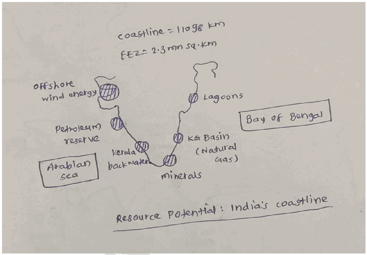

2. **Deep-Sea Mineral Wealth-The** Exclusive Economic Zone (EEZ) contains vast deposits of polymetallic nodules and crusts rich in cobalt, nickel, and manganese.

3. **Hydrocarbons-Offshore** basins are a source of oil and gas. Eg- The **Mumbai High** and **Krishna-Godavari (KG) Basin.**

4. **Beach Sand Minerals-Eg-** The Monazite and Ilmenite sands of **Kerala and Odisha** are critical for India's nuclear energy and aerospace programs.

5. **Offshore Renewable Energy-The** wind speeds along the western and southern coasts offer a potential of over **70 GW** for offshore wind energy. Eg- **Gujarat and Tamil Nadu.**

6. **Tidal and Wave Energy-Eg-** The **Gulf of Khambhat** and **Gulf of Kutch.**

7. **Salt Production-India** is the **3rd largest salt producer** globally, with coastal topography favoring extensive salt pans.

8. **Marine Biotechnology (Blue Carbon)-Coastal** ecosystems like mangroves and seagrass act as carbon sinks and sources of bioactive compounds.

9. Coastal Tourism - Eg- Goa beaches and Kerala backwaters.

10. Mangroves and Coastal Ecosystems - Support fisheries, carbon sequestration and shoreline protection.

Eg- Sundarbans mangrove forests.

**Status of Natural Hazard Preparedness**

1. **Advanced Early Warning Systems (EWS)-Eg-** The **IMD’s** latest models in 2026 provide hyper-local cyclone alerts with a lead time of 5-7 days.

2. The **Indian Tsunami Early Warning Centre (ITEWC)** at INCOIS provides real-time alerts to the entire Indian Ocean region. Over 100 coastal villages in **Odisha** have now achieved UNESCO’s "Tsunami Ready" certification.

3. **Bio-Shield Protection-Eg-** The **MISHTI Scheme** (2023-27) has successfully restored nearly **3,000 hectares** of mangroves along the East Coast.

4. **Hazard Line Demarcation-The Survey of India (SOI)** has integrated this line into the updated **Coastal Zone Management Plans (CZMP)** for all maritime states.

5. **Last-Mile Connectivity-Eg-** The **NavIC-based GAGAN** system provides emergency alerts to deep-sea fishermen even beyond cellular range.

6. **Integrated coastal zone management and Coastal regulation zones** to regulate development activities.

7. Cyclone-resistant infrastructure - Eg- Multipurpose cyclone shelters in Odisha and Andhra Pradesh.

**Challenges**

1. Nearly **33%** of India's coastline is experiencing active erosion

2. **Sea-Level Rise (SLR)** threatens to submerge low-lying deltas and "sinking" cities. Eg- **Mumbai.**

3. **Pollution and Eutrophication-Runoff** from coastal cities and farms creates "dead zones" in the ocean.

4. **Lack of last mile connectivity**

5. Increasing frequency and intensity of **Cyclones.**

**Way Forward**

1. **Integrated Coastal Zone Management (ICZMP)-Focus** on holistic "Ridge-to-Reef" planning rather than localized seawalls.

2. **Innovative Financing-Eg- Parametric Insurance** for faster post-disaster recovery.

3. **Green Port Transition-Incentivize** the "Harit Sagar" guidelines to reduce the carbon footprint of maritime trade.

4. **Blue Carbon Economy-Eg-** Integrating **MISHTI scheme** outcomes with the **National Carbon Market (NCM).**

5. Mandatory enforcement of the **National Building Code (2016)** for all new coastal constructions.

6. **Technology-Led Monitoring-Use** AI, IoT sensors, and drones for 24/7 surveillance of the "Hazard Line." These measures are essential to ensure that India’s vast coastline becomes a **source of long-term prosperity rather than vulnerability.**

---

1. Explanation_Drishti IAS:
Source Question: Comment on the resource potentials of the long coastline of India and highlight the status of natural hazard preparedness in these areas.

India's long coastline, stretching over 7,500 kilometers along the Arabian Sea and the Bay of Bengal, presents a wealth of resource potentials as well as significant challenges related to natural hazard preparedness.

- **Resource Potentials of India's Coastline:** **Fisheries:** India's coastline is abundant in marine life, making it a crucial hub for fisheries. It supports a thriving fishing industry, contributing significantly to the country's food security.

- **Ports and Shipping:** The coastline hosts several major ports, such as Mumbai, Chennai, and Kolkata, facilitating trade and commerce.

- **Tourism:** Coastal regions, including Goa, Kerala, and Andaman and Nicobar Islands, are popular tourist destinations due to their scenic beauty and cultural attractions.

- **Mineral Resources:** Coastal areas are often rich in mineral resources, including sand, salt, and minerals like ilmenite, garnet, and monazite.

- **Renewable Energy:** India's coastline has immense potential for renewable energy generation, particularly through offshore wind and tidal energy projects.

- **Status of Natural Hazard Preparedness:** While India's coastline offers significant opportunities, it is also highly vulnerable to natural hazards, including cyclones, tsunamis, and sea-level rise:

- India has been actively monitoring **sea-level changes, bolstering coastal infrastructure resilience, conserving mangroves**, and engaging in urban planning.

- This includes establishing the **National Disaster Management Authority (NDMA) and State Disaster Management Authorities (SDMAs)** to coordinate disaster response and preparedness at national and state levels.

- **Early warning systems:** , particularly for **cyclones,** have been improved, saving countless lives.

- **India:** has established an advanced **Indian Tsunami Early Warning Centre (ITEWC),** which is operated by the **Indian National Centre** for

**Ocean Information Services (INCOIS).**

- The **INCOIS** and **National Institute of Ocean Technology (NIOT)** are key agencies for monitoring and understanding trends and variations in sea levels.

India's vulnerable coastal regions require ongoing efforts in disaster preparedness, infrastructure development, and climate adaptation for sustainable growth.

---

1. Explanation_PWOnlyIAS:
Source Question: Comment on the resource potentials of the long coastlines of India and highlight the status of natural hazard preparedness in these areas.

**Answer:**

| **Approach:** **Introduction**  • Write about India in relation to its coast line. **Body**  • Resource Potentials of the Long Coastlines of India.  • Status of Natural Hazard Preparedness in these Areas **Conclusion**  • Give appropriate conclusion in this regard |
| --- |

### Introduction

India is blessed with an extensive and diverse coastline that extends along the Arabian Sea and the Bay of Bengal, **spanning a length of 7,516.6 kilometres.** This coastline boasts various resources **ranging from fisheries to minerals.** Nevertheless, these coastal regions are vulnerable to natural hazards such as cyclones, floods, and coastal erosion, underscoring the importance of robust natural hazard preparedness in these areas.

### Body

**Resource Potentials of the Long Coastlines of India:**
- **Fisheries:** India’s coastline is a hotspot for fisheries, both marine and inland, as

**exemplified by Kerala’s Malabar Coast, renowned for its seafood varieties, including fish, prawns, and crabs.It has been estimated that India possesses fisheries potential of 4.41 million tonnes.**
- **Minerals:** Coastal regions often harbor rich mineral deposits, including heavy minerals, rare earth elements, and industrial minerals.

**For instance, substantial reserves of polymetallic nodules containing manganese, nickel, and cobalt are believed to exist on the Indian Ocean seabed.**
- **Sand and Gravel:** Coastal regions are often sources of sand and gravel, vital for construction and infrastructure development.

**Notably, the sands found on beaches and dunes in India contain light heavy minerals like ilmenite, garnet, zircon, and monazite.**
- **Biodiversity:** Coastal ecosystems, such as mangroves and estuaries, support rich biodiversity.

**A prime example is the Sunderbans, which is home to approximately 350 vascular plant species, 250 fish species, 300 bird species, and numerous other organisms, spanning from phytoplankton and fungi to mammals.**
- **Renewable Energy:** India’s coastlines offer vast potential for harnessing renewable energy, particularly through offshore wind farms and tidal energy installations.

**For instance, Ocean Thermal Energy Conversion (OTEC) could theoretically provide 180,000 MW of energy in India.**
- **Oil and Gas:** Indian coastal areas have offshore oil and gas reserves.

**As of April 2022, the estimated crude oil reserves in India stood at 651.77 million tonnes.**
- **Ports and Trade:** India boasts **13 major ports and 187 minor and intermediate ports** along its coastlines, facilitating international trade and commerce.
- **Coral Reefs:** Coastal regions, **particularly around the Andaman and Nicobar Islands and the Gulf of Mannar**, harbor diverse coral reef ecosystems. These reefs support unique marine biodiversity, attract ecotourism, and protect coastlines from erosion and storm surges.

**Status of Natural Hazard Preparedness in these Areas:**
- **Early Warning Systems:** India’s advanced early warning systems, especially for cyclones, demonstrate the nation’s commitment to natural hazard preparedness.

**The India Meteorological Department (IMD) provides timely and accurate alerts, enabling efficient evacuation.**
- **Cyclone Preparedness:** Coastal states, **as demonstrated in Orissa,** have made investments in cyclone shelters, which function as evacuation centers during cyclone threats.

**The National Cyclone Risk Mitigation Project (NCRMP) underscores the nation’s commitment to enhancing cyclone preparedness in coastal regions.**
- **Disaster Management Authorities:** Coastal states have dedicated disaster management authorities responsible for coordinating response and preparedness efforts.

**For example, the National Disaster Management Authority (NDMA) plays a vital role in policy formulation and coordination.**
- **Mangrove Conservation:** Ongoing initiatives to conserve and restore mangrove forests demonstrate a proactive stance in bolstering natural defenses against hazards.

**The announcement of the MISHTI SCHEME in the FY2023-24 budget further underscores the nation’s commitment to this cause.**
- **Climate Resilience:** Initiatives **like the Integrated Coastal Zone Management Project (ICZMP),** have been implemented to address the challenges posed by climate change in coastal areas.
- **Community Awareness:** Initiatives to raise awareness among coastal communities about disaster preparedness and response have been implemented. These efforts include **community drills and education on how to respond during emergencies.**

### Conclusion

India’s extensive coastlines present a unique duality, offering abundant resources while also being susceptible to natural hazards. However, through concrete measures, India can pave the way for unlocking the full potential of its blue economy resources while enhancing disaster resilience.

---

1. Explanation_Rau IAS:
Source Question: Comment on the resource potentials of the long coastline of India and highlight the status of natural hazard preparedness in these areas. (15 Marks, 250 Words)

### Introduction

India''s long coastline of 7517 km is rich in varied resources which can harnessed for development of blue economy.

### Body

**Energy Resources:**

- Shale deposits along coasts of Gujarat, TN and Andhra Pradesh

- Rich Methane Hydrate deposits along the KG Basin. (Not yet harnessed).

Renewable Energy Potential:

- Significant wind energy potential (665 GW) along with offshore wind.

- Tropical coasts of India have vast solar energy potential.

- Tidal energy and OTEC

**Mineral Resources**

- Monazite sands and critical minerals important for India's nuclear energy security.

- Placer deposits rich in titanium and gold along coasts

- Salt production and export principally in Gujarat.

- Sand and construction material from coasts.

**Food Resources**

- Rich in fisheries - Rich source of protein and exports.

- Seaweeds for food and fertilisers.

Though India has rich resources along its coastal areas, we have not been able to succesfully harness them due to technological, policy and financial bottlenecks. There is a need for a comprehensive Blue Economy Policy for harness these resources.

**Natural Hazard Preparedness in coastal areas:**

India's coastal areas suffer from the following natural disasters: Cyclone, Tsunami, Storm surges, coastal erosion. Climate change is increasing the intensity and frequency of natural hazards in coastal areas and sea level rise leading to risk of submergence of coastal areas.

**Steps taken for Preparedness:**

- **Legal framework:** Disaster Management Act, 2005 provides framework for handling of natural disaster among NDMA at Central Level, SDMA at State Level and District Magistrate at Local level.

**Early warning systems:**

Name of disasterEarly Warning SystemCycloneBy IMDTsunamiBy INCOISStorm SurgeBy INCOISCoastal ErosionNational Centre for Coastal Research

- Guidelines: NDMA has developed comprehensive guidelines for Tsunami and Cyclones but similar guidelines have not yet been developed for other hazards in the coastal areas such as storm surges.

**Specific interventions:**

- National Cyclone Risk Mitigation Project aims to undertake structural and non-structural measures to mitigate effects of cyclones in coastal areas.

- Odisha has developed 'Odisha model' of handling cyclones.

- National Centre for Coastal Research monitors the shoreline changes through satellites.

- INCOIS has developed Coastal Vulnerability Index for Indian Coastline.

- MOEFCC has developed Coastal Regulation Zone Notification, 2019 to conserve and protect coastal stretches.

- Other measures: Promotion Mangrove and shelterbelt plantations in coastal areas, awareness among fishermen and coastal communities etc.

### Conclusion

Thus, to sustainable harness the resource potential there is a need for develop a comprehensive policy framework for addressing coastal disasters in line with Sendai Framework of Disaster Management.

---

---

1. Explanation_Superkalam:
Source Question: Comment on the resource potentials of the long coastline of India and highlight the status of natural hazard preparedness in these areas.

India has a coastline of** 11,098.81 km**, touching** 13 states and UTs**, with a vast Exclusive Economic Zone (EEZ) of** over 2.3 million sq km**. This long coastline is rich in natural, economic, and strategic resources. However, it is also vulnerable to natural hazards like cyclones, tsunamis, and sea-level rise.

##** Resource Potentials of India’s Long Coastline **1.** Marine Resources **-** Fisheries: **Over** 4 million people **depend on marine fishing, India is the** third-largest fish producer globally **(FAO, 2022).
 -** Aquaculture zones **and** brackish water **have rich potential in states like Andhra Pradesh and Kerala.

2.** Mineral Wealth **-** Beach placer deposits**: Monazite (largest deposit is in India), ilmenite, and rutile (e.g., Tamil Nadu, Odisha coast).
 -** Offshore oil & natural gas**: Mumbai High, KG Basin (Andhra Pradesh), and Cambay Basin.

3.** Trade & Port Economy **- 13 major and ~200 non-major ports handle** ~90% of India’s external trade by volume**.
 - Maritime trade hubs of India are Mumbai, Kandla, Chennai, Kochi and Vishakhapatnam.

4.** Tourism and Cultural Resources **- Coastal tourism (Goa, Kerala backwaters ad Andaman Islands) boosts local economy.
 - Cultural heritage sites (e.g., Konark Temple, Rameswaram, Mamallapuram) are located near coasts.

5.** Renewable Energy Potential **-** Offshore wind farms **(Tamil Nadu and Gujarat coast) hold both economic and climate action potential.
 -** Tidal energy **potential in Gulf of Khambhat, Gulf of Kutch and Sunderbans.

6.** Blue Economy **-** Sagarmala Project **for port-led development.
 - Draft** Blue Economy Policy 2021 **focuses on fisheries, tourism, marine biotechnology, and coastal livelihood development.

##** Status of Natural Hazard Preparedness in Coastal Regions **India’s coastline is vulnerable to** cyclones, tsunamis, storm surges, coastal erosion, and sea-level rise **due to climate change.

Hazard Prone zones in Coastal Regions

1.** Institutional Mechanisms **-** National Disaster Management Authority (NDMA) **and** State Disaster Management Authorities (SDMAs) **provide overall direction and superitendance in disaster management.

2.** Early Warning Systems **- Satellite-based cyclone prediction and real-time alerts via INCOIS, IMD, and ISRO.
 -** Indian National Centre for Ocean Information Services (INCOIS) **in Hyderabad provides early warnings for tsunamis and storm surges.

3.** Infrastructure and Capacity Building **- Cyclone shelters, embankments, and saline-resistant infrastructure (especially in Odisha and Andhra Pradesh) have been in place.
 - Coastal Regulation Zone (CRZ) norms enacted aim to restrict hazardous constructions.

4.** Community Participation **- Regular disaster preparedness training and mock drills by NDRF and NGOs boost confidence and ensure timely mitigation.
 - Cyclone risk mitigation projects (NCRMP Phase I & II) have been implemented in Odisha, Andhra Pradesh, Tamil Nadu.

5.** Legal framework **- The NDMA 2005 provides overarching legal framework for disaster management.
 - Cyclone and Tsunamis have been recognized as disaters under NDMA 2005.

6.** Internaltional cooperation **- India is proactive member of SCO, BIMSTEC and IORA where best practices on coastal disater management are shared along with humanitarian assistance.
 - The country is considered a leader in predicting coastal disaster risks through** the Indian Tsunami Early Warning Centre (ITEWC)**, providing timely alerts to the Indian Ocean region.

India’s long coastline is both an economic asset and an environmental challenge. Leveraging its potential through** sustainable blue economy models**, while investing in** climate-resilient infrastructure, community awareness, and disaster risk reduction**, is key to ensuring inclusive coastal development.

---

1. Explanation_Unacademy:
Source Question: Q14. Comment on the resource potentials of the long coastline of India and highlight the status of natural hazard preparedness in these areas. (15 Marks, 250 Words)

## **Approach** - **Introduction:** Briefly present India’s long coastline and its economic potential under the blue economy.

- **Body:** Explain major resource potentials (fisheries, minerals, energy, salt, maritime trade, livelihoods, food security). Then, discuss disaster vulnerabilities (cyclones, tsunamis, floods, sea-level rise) and preparedness measures.

- **Conclusion:** Suggest sustainable development with conservation, better regulations, and mission-based approaches. **Answer:** **Introduction:** India’s coastline of over 7,500 km and its Exclusive Economic Zone (EEZ) provide vast opportunities for economic growth, marine resources, and global trade. Recognising this, the Government of India has been promoting the ‘Blue Economy’ and ‘Blue Growth Initiative’ to harness ocean wealth sustainably while improving coastal livelihoods. **Body** **Resource Potentials of the Indian Coastline** - **Fisheries:** Marine fishery potential of ~4.4 million metric tonnes annually supports nutrition and livelihoods. The Pradhan Mantri Matsya Sampada Yojana (PMMSY) seeks to boost fish production and employment.

- **Minerals:** Rich in cobalt, manganese, zinc, and rare earth elements critical for electronics and strategic industries.

- **Manganese Nodules and Crusts:** Source of manganese, iron, copper, nickel, and cobalt with vast industrial applications.

- **Energy Resources:** Offshore oilfields (e.g., Ankleshwar,Khambhat)andgashydratesdiversify India’s energy mix.

- **Salt and Chemicals:** Seawater provides common salt, gypsum, and other valuable minerals for industries.

- **Maritime Trade:** Major ports handled 795 million tonnes of cargo in FY23, registering 10.4% growth.

- **Employment & Livelihoods:** Fishing, salt production, shipping, and port-led activities sustain millions.

- **Food Security:** Fisheries strengthen protein intake and nutrition security.

- **SustainableGrowth:Coastalandmarineresources** can fuel the $5 trillion economy target if harnessed through a balanced blue economy approach. **Natural Hazards and Preparedness** India’s coasts are highly vulnerable to climate-induced disasters due to dense population and economic activities.Preparednesshasimprovedthroughmultiple

## **initiatives** - **Cyclones:** Eastern and western coasts are cycloneprone.PreparednessthroughtheNationalCyclone Risk Mitigation Project, IMD’s colour-coded cyclone warnings, and Integrated Coastal Zone Management (ICZM).

- **Tsunamis:** Indian Tsunami Early Warning System, collaboration with UNESCO’s Intergovernmental Oceanographic Commission, and INCOIS realtime monitoring of tectonic movements.

- **Floods and Tidal Surges:** Flood forecasting, resilient infrastructure, and flood-resistant agriculture reduce risks.

- **Sea-Level Rise:** Adaptation measures include mangrove reforestation, coastal embankments, and urban planning for resilience.

- **Institutional Measures:** Coastal Regulation Zone (CRZ) rules and the proposed National Coastal Mission focus on conservation, development, and disaster preparedness. **Conclusion** India’s coastline is both an economic powerhouse and a zone of vulnerability. The Shailesh Nayak Committee’s recommendations on CRZ reforms and the proposed National Coastal Mission are key steps toward balancing conservation and development. Building ecologically sensitive zones, enhancing disaster preparedness, and integrating sustainability with blue economy strategies will ensure that India’s coasts remain resilient while contributing to national growth.

---

---

Q11. Discuss the natural resource potentials of ‘Deccan Trap’.
[Year: 2022] [Group: UPSC CSE] [Exam: Mains] [Stage: Mains] [Paper: Mains - GS 1]
[Subject: GEOGRAPHY]
[Section Group: Economic & Resource Geography]
[Microtopic: Distribution of key Natural Resources (world, South Asia and Indian subcontinent)]
[Subtopic: Natural resources Potential]
[Macrotag: Analytical]
[Microtag: Discuss]

1. Explanation_Civilsdaily:
Source Question: Discuss the natural resource potentials of ‘Deccan trap’. [Year: 2022] [Marks: 10]

The **Deccan Trap** is one of the **largest volcanic basalt provinces in the world,** formed by massive lava flows during the **late Cretaceous period.** It covers nearly **5 lakh sq km across Maharashtra, Madhya Pradesh,**

**Gujarat, Karnataka and Telangana.**

**Natural Resource Potentials of the Deccan Trap**

1. **Black Cotton Soil (Regur)**

a. Formed due to weathering of basaltic rocks.

b. Its high clay content and moisture-retention capacity make it ideal for rain-fed agriculture.

c. Supports India’s primary **Cotton, Sugarcane, and Soybean** belts in Maharashtra and Gujarat.

2. **Bauxite Reserves (Aluminum Ore)** formed due to intensive chemical weathering (lateritization) of basalt in high-rainfall zones. Eg- **Kolhapur and Ratnagiri** Belt.

3. **Geothermal Energy Potential-Eg-** Clusters of hot springs in **Unhavare, Tural, and Rajapur** along the Konkan coast.

4. **Multi-Layered Aquifer Systems-The** vesicular (porous) and fractured nature of certain lava flows allows for significant groundwater storage.

5. **Hydrocarbon-Recent** seismic surveys have indicated the presence of oil and natural gas trapped beneath the thick basaltic "lid." Eg- in the **Cambay Basin** (Gujarat).

6. **Strategic Industrial Minerals like Zeolites** are formed in the cavities (vugs) of basalt.

7. **Semi-Precious Gemstones-Eg- Agates, Amethyst, and Chalcedony**

8. The varying rainfall patterns across the plateau support diverse forest types, from moist evergreen to dry deciduous. Eg- **Teak and Bamboo.**

9. **Hydroelectric Power-The** steep escarpments (Western Ghats) provide high-head sites for power generation. Eg- **Koyna Hydroelectric Project Major Challenges**

1. **Over-extraction of Groundwater**

2. **Soil Degradation & Salinity** in the sugarcane belt

3. **Seismic Vulnerability-Eg- 1967 Koyna** and **1993 Latur** earthquakes

4. **Eco-Sensitivity-Eg-** mining in Western Ghats

5. **Technological Barriers in Exploration-Eg-** High costs of **Sub-basalt Imaging.**

6. **Pollution from Industrial Clusters-Eg-** Dust pollution in **Navi Mumbai and Pune** Sustainable management is essential to harness these potentials while ensuring **long-term environmental stability and regional development.**

---

1. Explanation_Drishti IAS:
Source Question: Discuss the natural resource potentials of ‘Deccan Trap’.

Deccan Trap is a large region of thick basaltic rock located in west-central India and associated with one of the largest volcanic eruptions in the history of the earth.

- The Deccan Trap covers a significant part of western peninsular India, in states of Maharashtra, Goa, and Gujarat and to some extent in Madhya Pradesh and southern Rajasthan.

**Natural resources found in Deccan Trap:**

- **Soil & Rocks:** 

- **Black Soil:** It is also known as “Regur Soil” or the “Black Cotton Soil”.

- Black soils are rich in iron, lime, aluminium, magnesium and also contains potassium. However, these soils are deficient in nitrogen, phosphorus and organic matter.

- Cotton, pulses, millets, castor, tobacco, sugarcane, citrus fruits, linseed, etc. are mainly cultivated in black soil.

- **Rocks:** Ancient cave temples have been carved out of the Deccan basalts in many places and the Elephanta Caves located on a small island offshore Mumbai (Bombay) is one such place.

- **Non-Ferrous Minerals:** **Bauxite:** India’s reserves of bauxite are sufficient to keep the country self-reliant.

- Major reserves occur in Jharkhand, Maharashtra, Madhya Pradesh, Chhatisgarh, Gujarat, Karnataka, Tamil Nadu, Goa and Uttar Pradesh.

- **Ferrous Minerals:** India is endowed with fairly abundant resources of iron ore. It has the largest reserve of iron ore in Asia.

- The districts Maharashtra and Goa have also emerged as important producers of iron ore.

- **Natural Gas:** It is obtained along with oil in all the oil fields, but exclusive reserves have been located along the eastern coast as well as Tripura, Rajasthan and offshore wells in Gujarat and Maharashtra.

- Recently, the National Geophysical Research Institute (NGRI) has noticed the presence of oil and natural gas in the Deccan region that spreads over a vast area including parts of Telangana, Karnataka, and Maharashtra.

- **Geothermal Energy:** The western margin of volcanic Deccan traps, also known as Western Ghats, is characterized by the presence of numerous hot springs.

- **Nuclear Energy:** Nuclear energy has emerged as a viable source in recent times. Important minerals used for the generation of nuclear energy are uranium and thorium.

- The important nuclear power projects are Tarapur (Maharashtra), Rawatbhata near Kota (Rajasthan), etc.

---

1. Explanation_PWOnlyIAS:
Source Question: Discuss the natural resource potentials of ‘Deccan trap’.

**Answer:**

| **Approach:** **Introduction**  • Write about Deccan Trap in brief. **Body**  • Write about the significant natural resources found in the Deccan Trap. **Conclusion**  • Conclude your answer with the importance of Deccan Trap. |
| --- |

### Introduction

** The Deccan Trap is a large volcanic feature located in west-central India. It has several natural resources that are economically valuable.

### Body

**Natural resources found in the Deccan Trap:**
- **Minerals:** The Deccan Traps have rich deposits of minerals such as **iron, manganese, copper,** and **gold**. These minerals are essential raw materials for various industries, including construction, manufacturing, and electronics.
- **Coal:** The Deccan Traps have significant reserves of coal, which is used for power generation and various industries.
- **Oil and natural gas:** National Geophysical Research Institute [NGRI] has found the reserve presence of oil and natural gas in the Deccan region that spreads over a vast area including part of Karnataka, Telangana and Maharashtra.
- **Geothermal Energy:** It is the source of many springs. The springs in places like Sativli, Mandangad, Aravali, Anjaneri, Rajapur and others, form a cluster of hot springs found in these rock formations
- **Hydroelectric power:** The **Godavari and Krishna rivers** originate in the Western Ghats, have the potential to generate hydroelectric power.
- **Agricultural land:** The **fertile soil** of the Deccan Trap is ideal for agriculture, and the region is a major producer of crops such as **cotton, sugarcane, and tobacco**.
- **Timber and medicinal plants:** The forests of the Western Ghats are rich in timber and medicinal plants, which can be used for various purposes, including traditional medicine, construction, and furniture-making.

### Conclusion

Deccan Traps is a region with diverse natural resources, which can contribute to the economic development of the region and the country. It is important to ensure that the exploitation of these resources is done in a sustainable and responsible manner to minimize their environmental impact and preserve them for future generations.

---

1. Explanation_Rau IAS:
Source Question: Discuss the natural resource potentials of 'Deccan Trap'. (10 Marks, 150 Words)

### Introduction

The Deccan Trap formations in peninsular India were created by massive volcanic eruptions. They hold natural resources that continue to shape the region's economic and developmental trajectories.

### Body

**They have a huge variety of natural resources:**

- **Mineral resources:** Manganese (Kajlidongri mine), copper (Malanjkhand mine), bauxite (Kolhapur and Satara), dolomite, limestone, quartz, silica etc.

- **Energy resources:**

 - **Oil & Gas:**around 30 billion tonne in Saurashtra-central India belt

 - **Geothermal:** numerous hot springs present in Konkan geothermal province. Reservoirs at Unhavare, Tural and Aravali have been found.

 - **Hydro:**Rivers like Narmada, Godavari and Krishna have high potential.

- **Soil resources:** Black soil has a high water retention capacity; good for cotton, sugarcane and groundnut.

- **Water resources:** Low availability due to Hard rocks and seasonal rivers like Narmada and Tapi.

- **Forest resources:** Deccan has tropical dry deciduous forests with Hardwickia-dominated woodlands.

- **Wildlife:** Huge biodiversity; tiger, wild buffalo, wild dog, four-horned antelope, gaur, blackbuck, and chinkara present.

### Conclusion

Despite all these resources, the true potential of these resources has not been reaped because of factors like eco-sensitive regions, frequent landslides, difficult mining, lack of water availability and soil degradation.

---

---

1. Explanation_Superkalam:
Source Question: Discuss the natural resource potentials of ‘Deccan trap’.

The** Deccan Trap **is a vast volcanic province formed during the late Cretaceous (~66 million years ago), covering ~5 lakh sq. km across Maharashtra, Madhya Pradesh, Gujarat, and parts of Andhra Pradesh. Its basaltic lava flows and lateritic soils offer rich** geological, agricultural, and mineral resources**.

Deccan Traps Location Diagram on Map

## Natural Resource Potentials of Deccan Trap

1.** Mineral Resources **-** Manganese: **Found in districts like Nagpur and Bhandara (Maharashtra).
 -** Bauxite: **In lateritic caps over basalts (e.g., Satara, Kolhapur) – used in aluminium production.
 -** Iron ore & Copper: **Small deposits in Maharashtra and Madhya Pradesh.
 -** Zeolites & Bentonite clay: **For industrial uses like water purification and drilling mud.

2.** Soil Fertility **-** Black cotton soil (Regur): **Derived from basaltic weathering, high in calcium and magnesium, ideal for cotton, soybean, pulses, and oilseeds.
 - Supports cash crops like sugarcane in irrigated zones.

3.** Groundwater Potential **- Weathered basalt and fractures act as aquifers; critical for irrigation in semi-arid areas.
 - Used extensively in Maharashtra’s sugarcane belt.

4.** Building and Decorative Stones **- Basalt as construction material (e.g., Ajanta & Ellora caves carved into trap rock).
 - Used in roads, railway ballast, and ornamental stones.

5.** Fossil and Palaeoenvironmental Records **- Inter-trappean beds contain freshwater fossils, plant remains, and dinosaur fossils (Narmada valley) — important for research and geo-tourism.

6.** Renewable Energy Potential **-** Wind energy: **Elevated plateaus like Satara and Ahmednagar.
 -** Solar energy: **Vast semi-arid tracts with high insolation.

The Deccan Trap is not just a geological marvel but a multi-resource region contributing to** agriculture, industry, research, and energy**. Sustainable exploitation with soil conservation and groundwater management is essential to preserve its productivity.

---

1. Explanation_Unacademy:
Source Question: Q6.Discuss the natural resource potential of the ‘Deccan trap’. (150 Words, 10 Marks) Approach

- **Introduction:** Briefly introduce the Deccan Traps, highlighting their geographical and geological significance.

- **Body:** Analyze the various natural resources found in the Deccan Traps, discussing minerals,groundwater,soilfertility,andfossil fuels, along with examples and implications for industries and agriculture.

- **Conclusion:** Conclude by emphasizing the need for sustainable management of these resources. **Answer:** **Introduction:** The Deccan Traps, one of the largest igneous provinces globally, are situated in the western part of India. These regions have been subjected to fissure-type flood basaltic volcanic eruptions when the Indian plate moved over the Reunion hotspot approximately 150 million years ago during the Cretaceous period. The **Deccan Traps cover around** **500,000 sq km, spanning Maharashtra, Goa, North** **Karnataka, and North Telangana, and extend to parts** **of Satpuras, Vindhyas, Malwa, and Chotanagpur.** ## **Body: Natural Resources Potential of Deccan Traps** - **Building Materials:** The Deccan Traps provide substantial construction materials. Basalt rock, for example, is extensively used in the construction industry as a building stone and road metal. It also serves as an aggregate in cement concrete.

- **Soil:** The weathering of the Deccan Traps results in the formation of rich Black soil, which is particularly suitable for cotton cultivation.

- **Bauxite:** The region is endowed with high-grade bauxite, rich in alumina. This mineral is crucial for petroleum filtration, and the manufacturing of aluminum and alumina cements.

- **Groundwater:** The Deccan Traps’ vesicular parts within bedded lavas form excellent aquifers, yielding considerable supplies of underground water.

- **Oil and Natural Gas:** Recently, the National GeophysicalResearch Institute (NGRI) discovered potential deposits of oil and natural gas in the Deccan region, which covers large parts of Telangana, Karnataka, and Maharashtra.

- **Other Minerals:** Alongside basalt, laterite, and bauxite, the Deccan Traps contain minerals such as Zeolites, Olivines, Pyroxenes, and Uranium. Chandrapur district in Maharashtra, part of the Deccan region, is notably rich in coal and lime.

- **Rare Earth Elements:** Deposits of rare earth elements like Lithium have been found in areas of Maharashtra and Karnataka.

- **Fossils:** The Deccan Traps are renowned for the fossil beds discovered between layers of lava.

- **Wind and solar energy:** The Deccan Traps offer substantial potential for harnessing wind and solar energy due to their vast and open landscapes. The region’s elevated plateaus and hills provide ideal conditions for wind farms, benefiting from consistent winds. **Conclusion:TheDeccanTrapsoffersubstantialnatural** resources, from essential minerals to water supply, to fossil records that enrich our understanding of the past. Its geological significance underscores the need for sustainable management and protection.

---

---

Q12. Why is India taking keen interest in resources of Arctic Region?
[Year: 2018] [Group: UPSC CSE] [Exam: Mains] [Stage: Mains] [Paper: Mains - GS 1]
[Subject: GEOGRAPHY]
[Section Group: Economic & Resource Geography]
[Microtopic: Distribution of key Natural Resources (world, South Asia and Indian subcontinent)]
[Subtopic: Natural resources Potential]
[Macrotag: Descriptive, Applied]
[Microtag: Why, India]

1. Explanation_Civilsdaily:
Source Question: Why is India taking keen interest in the Arctic region? [Year: 2018] [Marks: 10]

The **Arctic region,** once considered a remote and inaccessible area, has gained global prominence due to **climate change, emerging sea routes, vast natural resources, and geopolitical competition.**

**India’s Steps with Reference to the Arctic**

1. **Himadri Station (2008)-** India’s first permanent research base at Svalbard (Norway).

2. **IndARC (2014)-** India's first multi-sensor moored observatory in the Kongsfjorden fjord to monitor Arctic climate changes.

3. India was granted Observer status in the **Arctic Council** in 2013

4. **Arctic Policy (2022)-** six pillars

a. Research, climate, and environmental protection

b. Promoting economic and human development

c. Enhancing transportation and connectivity

d. Improving governance and international cooperation

e. Building national capacity in Arctic studies.

5. **Polar Research Vessel (PRV)-** indigenous ice-breaker to ensure independent logistical capability.

**Reasons Behind India’s Interest in the Arctic**

1. Arctic and Monsoon Linkages

a. Arctic warming affects **Himalayan cryosphere, monsoon patterns, and extreme weather events.**

b. Melting sea ice influences **ocean circulation and jet streams,** impacting Indian agriculture and water security.

2. Geopolitical Reasons

1. **Voice in emerging Arctic governance** - observer status in the **Arctic Council** helps India participate in rule-making for global commons.

2. **Balancing major power competition** - Eg- By strengthening its presence, India counters China's self-proclaimed "Near-Arctic State" status.

3. Ensures India is not excluded from evolving **Eurasian polar geopolitics.** Eg- Collaboration with Norway and Iceland in polar research diplomacy.

3. Geo-economic Reasons

- **Access to critical minerals** - Arctic has deposits of **rare earths, nickel, cobalt, and phosphates,** essential for India’s manufacturing and clean-tech sectors.

- **New opportunities for trade and investment** - Eg- Indian companies exploring LNG projects in the Russian Arctic.

- **Blue economy prospects** - Sustainable fisheries and bio-resources for food and pharmaceutical industries.

4. Energy Security

- The Arctic holds nearly **13% of undiscovered oil and 30% of natural gas.**

a. Supports India’s energy security and transition to a **gas-based economy.**

b. Eg- Indian investment in **Vostok Oil and Yamal LNG projects (Russia).**

- **Clean energy research** - Cooperation in **offshore wind, hydrogen, and carbon sequestration studies** in polar conditions.

5. Connectivity and Maritime Trade

- Melting ice is opening **Northern Sea Route (NSR) and Trans-Arctic routes** These routes can-

  - Reduce **India-Europe travel distance by up to 40%**

  - Lower logistics cost and time.

  - Strengthen India’s **maritime trade and Sagarmala initiative.**

  - Reduces dependence on vulnerable chokepoints like the Suez **Canal.**

  - Eg- **Chennai-Vladivostok Maritime Corridor.**

India’s engagement reflects a **responsible stakeholder approach,** balancing **environmental sustainability with strategic and economic interests**

---

1. Explanation_Drishti IAS:
Source Question: Why is India taking keen interest in resources of Arctic region? (2018)

According to the Ministry of External Affairs, India’s interests in Arctic Ocean region are commercial, strategic, environmental and scientific. Pursuant to this, in 2013, India gained Observer status in the Arctic Council.

- **Potential Natural Resources:** Arctic region holds oil and natural gas resources which can boost India’s energy security and diversify its energy imports especially when West Asia is under geopolitical turmoil. Arctic is also an abundant source for fishing.

- **Potential for Newer Shipping Routes:** As global climate warms up and polar ice recedes, new paths between Asia, Europe and North America become open which can reduce cost of transportation for India’s exports and imports. For example, the Northern Sea Route, a mostly frozen seaway can become navigable throughout the year.

- **Increased Vulnerability of Coastal Communities:** Melting of ice on large scale can make India’s coastal cities more vulnerable to sea level rise.

- **Potential for Joint Research on Environmental Issues:** Joint research with countries like Norway can help India in better research on issues related to aerosol radiation, space weather, glacier cycles which are also mandate of Himadri Research Station.

- **Geopolitical Importance:** While a treaty for Arctic, a global common, being negotiated, it is a strategic necessity to mould it in India’s favour. Also, India needs to make investments to match Chinese investments in Arctic.

---

1. Explanation_PWOnlyIAS:
Source Question: Why is India taking keen interest in the Arctic region?

**Answer:**

| **Approach:** **Introduction:**  • Write about the Arctic region. **Body:**  • Discuss India’ s interest in the Arctic region. **Conclusion:**  • Conclude your answer with Importance of the Arctic region. |
| --- |

### Introduction

** India’s interest in the Arctic region is motivated by economic, strategic, scientific, and diplomatic factors. The region’s resource exploration potential, new trade routes, climate change impact, scientific research opportunities, and diplomatic engagement make it an attractive area for India.

### Body

**India’s**

**interest in the Arctic region:**
- **Resource Exploration:** The Arctic is believed to hold abundant reserves of oil, gas, minerals, and rare earth elements, and India is interested in exploring these resources to meet its growing energy demands and reduce its dependence on foreign imports.
- **Trade Routes:** The melting of Arctic ice has opened up new trade routes, which are shorter and more cost-effective than traditional routes. India sees the Arctic as a new trade corridor that can help reduce the cost of transportation and increase trade between **Asia, Europe, and North America**.
- **Climate Change:** The melting of Arctic ice is a major concern for India, which is vulnerable to the impacts of climate change, such as **rising sea levels and changes in monsoon patterns**.
- **Scientific Research:** India is interested in conducting scientific research in the Arctic region to better understand its impact on global climate and to study the unique flora and fauna of the region.
- **Diplomacy:** India is keen to play a more active role in global diplomacy, and its interest in the Arctic is seen as a way to engage with other countries in the region and expand its international presence.

### Conclusion

India’s interest in the Arctic region is driven by a combination of economic, strategic, scientific, and diplomatic factors. The country is taking a proactive approach to securing a foothold in the region, and it will be interesting to see how its efforts unfold in the years to come.

---

1. Explanation_Superkalam:
Source Question: Why is India taking a keen interest in the Arctic region?

India's growing Arctic engagement represents a strategic shift from passive observation to active participation, driven by climate science, economic opportunities, and geopolitical positioning.

India's Arctic Interests Hub and Spoke

## Scientific Research and Climate Monitoring

-** Arctic Research Station**: "Himadri" at Svalbard, Norway conducts critical polar research on ice sheet dynamics and atmospheric studies
-** International Collaborations**: Partnerships with Norwegian Polar Institute and Alfred Wegener Institute for marine ecosystem research
-** Climate Connection**: Arctic warming directly affects Indian monsoon patterns, impacting agriculture and water security across the subcontinent
-** Permafrost Studies**: Research on methane emissions and carbon release affecting global climate models
-** Ocean-Atmosphere Interaction**: Understanding Arctic influence on Indian Ocean Dipole and El Niño patterns

## Economic and Strategic Opportunities

|** Sector **|** Opportunity **|** Impact **|
| --- | --- | --- |
|** Shipping **| Northern Sea Route (NSR) | 40% reduction in Asia-Europe transit time |
|** Energy **| Hydrocarbon reserves | 13% of global oil, 30% natural gas |
|** Minerals **| Rare earth elements | Critical for renewable energy technology |
|** Fisheries **| Marine resources | New fishing grounds as ice retreats |

-** Maritime Trade**: NSR offers alternative to Suez Canal, reducing shipping costs and dependency
-** Resource Access**: Potential partnerships in sustainable Arctic resource extraction

## Geopolitical and Diplomatic Engagement

-** Arctic Policy 2022**: Comprehensive framework emphasizing "science, research, and sustainable development"
-** Arctic Council Observer**: Active participation since 2013 in regional governance and environmental protection
-** International Treaties**: Signatory to Central Arctic Ocean Fisheries Agreement (2018)
-** Bilateral Partnerships**: Enhanced cooperation with Arctic nations like Norway, Russia, and Canada
-** Strategic Positioning**: Balancing great power competition while maintaining independent approach

## Environmental and Security Implications

-** Sea Level Rise**: Arctic ice melt threatens India's 7,500 km coastline and 250 million coastal population
-** Food Security**: Changes in Arctic circulation patterns affect monsoon reliability
-** Disaster Preparedness**: Arctic research improves cyclone and extreme weather prediction models
-** Marine Ecosystem**: Understanding Arctic changes helps protect Indian Ocean biodiversity

India's Arctic engagement reflects its** "Vasudhaiva Kutumbakam" **philosophy, combining scientific diplomacy with strategic foresight under the** National Mission for Sustaining Himalayan Ecosystem**, positioning India as a responsible Arctic stakeholder.

---

1. Explanation_Unacademy:
Source Question: Q5. Why is India taking keen interest in the Arctic region? (10 marks, 150 words) Tag: Distribution of key Natural Resources (World, S. Asia, Indian subcontinent).

## **Decoding the Question** - **In Introduction, write the definition of the** **Arctic region.** - **In Body, state the reasons why India is** **interested in the region, steps taken to** **ensure it, and the environmental impact of** **it.** - **Conclude with stating the benefits that India** **is eyeing to reap from the region.** **Answer:** The Arctic region, the **enormous area around the** **North Pole spreading over one-sixth of the earth’s** **landmass,** is increasingly being affected by external global forces - environmental, commercial, and strategic, and in turn is poised to play an increasingly **greater role in shaping the course of world affairs.** Its implications have caught India’s interest.

## **India’s Interest in the Arctic region** - India has been invested in the Arctic region for years and to secure its share of the pie that the region offers in terms of research and resources, including minerals and hydrocarbons. The Indian government has now unveiled a **draft Arctic** **policy.** India now has **‘observer’ status** in the Arctic Council.

 - It envisages India’s engagement in the Arctic region for **climate research, environmental** **monitoring, maritime cooperation, and** **energy security.** - **Impact on India’s Climate:** Though none of India’s territory directly falls in the Arctic region, it is a crucial area as the **Arctic influences** atmospheric, oceanographic and biogeochemical cycles of the earth’s ecosystem.

 - Duetoclimatechange,theregionfacestheloss of sea ice, ice caps, and warming of the ocean, which in turn impacts the global climate.

- **Enormous Natural Resources: The** Arctic region is **rich in oil and gas reserves,** unexploited marine living resources which can boost India’s energy security and diversify its energy imports.

- **New shipping route:** As global climate warms up and polar ice recedes, **new paths between Asia,** are opening up, which **Europe and North America** can **reduce the cost of transportation** for India’s exports and imports. The Arctic region is not regarded as a global common, and its discourse remains dominated by the Arctic Five countries and the Arctic Council. India now has **‘observer’statusintheArcticCouncil.Therefore,it’sin** **India’s interest to make Arctic talks more accessible.** With Russia, China already placing their claims on various parts of the region, India should strive to promote its agenda in the Arctic Council. Pursuing the Arctic dream, **India intends to take a step further** **to be a global power** and position itself to challenge China in the future.

---

---

Q13. How does India see its place in the economic space of rising natural resource rich Africa?
[Year: 2014] [Group: UPSC CSE] [Exam: Mains] [Stage: Mains] [Paper: Mains - GS 1]
[Subject: GEOGRAPHY]
[Section Group: Economic & Resource Geography]
[Microtopic: Distribution of key Natural Resources (world, South Asia and Indian subcontinent)]
[Subtopic: Natural resources Potential]
[Macrotag: Descriptive, Applied]
[Microtag: How, India]
#### Microtopic: Factors responsible for the location of primary, secondary, and tertiary sector industries in various parts of the world (including India).
##### Subtopic: Land use planning

1. Explanation_PWOnlyIAS:
Source Question: How does India see its place in the economic space of rising natural resource rich Africa?

**Answer:**

| **Approach:** **Introduction**  • Start your answer with India relations with Africa. **Body**  • Discuss the economic space of rising natural resource-rich Africa. **Conclusion**  • Summary of the answer with futuristic approach. |
| --- |

### Introduction

**India’s relations with Africa have been traditionally strong, dating back to the days of India’s independence movement. With Africa’s increasing importance as a strategic partner, India has been keen to expand its presence and influence in the continent, including in the natural resource-rich areas.** Body: ****

**Economic space of rising natural resource-rich Africa:**
**Strategic partnership:
- India views Africa as a strategic partner and has been engaging with the continent on multiple fronts, including economic, political, and social.

**India has been providing technical and financial assistance to African countries, with a focus on infrastructure development, capacity building, and human resource development.** Natural resources ****
Africa is rich in natural resources, including minerals, oil, and gas. India, as a rapidly growing economy, needs access to these resources to fuel its own growth.

**India has been investing in the exploration and development of natural resources in Africa.** Trade and investment ****
India is Africa’s third-largest trading partner, and bilateral trade has been increasing steadily.
- India has been investing in various sectors in Africa, including agriculture, mining, infrastructure, and energy.

**Cooperation on regional and global issues**
India and Africa have been cooperating on various regional and global issues, including climate change, peace and security, and UN reforms.
- India has been supporting African countries in their efforts to achieve sustainable development and has been advocating for a greater role for Africa in global governance.

**People-to-people contacts**
- **India has been promoting people-to-people contacts with Africa, including through:** scholarships and training programs**.
- This has helped in building goodwill and strengthening ties between India and Africa.

### Conclusion

India’s engagement with Africa is expected to continue to deepen as it seeks to leverage the continent’s vast natural resources and explore new opportunities for economic growth and development. Through partnerships and investments, India hopes to create a win-win situation for both sides, while also promoting regional stability and cooperation.

---

1. Explanation_Superkalam:
Source Question: How does India see its place in the economic space of rising natural resource-rich Africa?

India views Africa as a transformative economic partner, leveraging the continent's abundant natural resources to fuel its own growth while establishing a development-oriented partnership model that contrasts with traditional resource extraction approaches.

India-Africa Bilateral Exchange Framework Diagram

## India's Strategic Vision for Africa

-** Resource Security Partnership**: India seeks** diversified energy sources **beyond Middle Eastern dependence, targeting Africa's** 30% of global mineral reserves **including cobalt, lithium, and rare earth elements crucial for renewable energy transition.
-** Market Access Strategy**: Positioning Africa's** 1.4 billion population **and** USD 3.4 trillion economy **as key export destinations for Indian pharmaceuticals, automobiles, and IT services.
-** South-South Cooperation Model**: Emphasizing** shared colonial experience **and** non-aligned movement heritage **to build trust-based partnerships rather than exploitative relationships.
-** Manufacturing Hub Development**: Supporting** "Make in Africa" **initiatives through technology transfer, creating local value addition rather than raw material export dependency.
-** Infrastructure-Led Growth**: Facilitating** connectivity projects **linking landlocked African nations to ports, enhancing trade efficiency and regional integration.

## Key Economic Engagement Areas

| Sector | India's Approach | Examples |
| --- | --- | --- |
| Energy | Joint exploration & refining | ONGC investments in Sudan, Mozambique |
| Mining | Technology transfer & processing | Vedanta's copper mining in Zambia |
| Agriculture | Food security partnerships | Fertilizer production in Nigeria |
| Digital | Leapfrog technology solutions | e-Governance platforms in Rwanda |

## Development Partnership Initiatives

-** Lines of Credit**: Extended** 196 LOCs worth USD 12 billion **to** 42 African countries**, supporting** 600+ development projects **in railways, power, and healthcare.
-** Capacity Building**:** ITEC Program **has trained over** 50,000 African professionals **in sectors ranging from IT to renewable energy.
-** Healthcare Access**: Generic drug manufacturing and** telemedicine networks **making healthcare affordable across Africa.
-** Digital Infrastructure**:** Pan-African e-Network **connecting 48 African countries for education and healthcare delivery.
-** Climate Partnership**:** International Solar Alliance (ISA) **headquarters in India promotes** solar energy adoption **across 37 African member nations.

India's Africa strategy represents a** "Development Partnership Model" **emphasizing mutual growth, technology sharing, and sustainable resource utilization. This approach positions India as Africa's preferred partner through initiatives like the** India-Africa Forum Summit **and** Asia-Africa Growth Corridor**, creating long-term economic interdependence beneficial to both regions.

---

1. Explanation_Unacademy:
Source Question: Q25. How does India see its place in the economic space of rising natural resource rich Africa? (10 marks, 150 words) Tag: Distribution of key natural resources across the world (including South Asia and the Indian sub-continent).

## **Decoding the Question** - **InIntroduction,brieflywriteabouttheIndia-** **Africa ties that are inextricably connected by** **their shared colonial pasts and geographic,** **political, and socio-cultural commonalities.** - **In Body, elaborate India’s place in the** **economic space of rising natural resource** **rich Africa.** - **Conclusion with a holistic and long-term** **approach to energy supply and security is** **required for both Nations.** **Answer:** India and Africa are **inextricably connected by their** **shared colonial pasts and geographic, political, and** **socio-cultural commonalities.** These similarities in their two ecosystems have allowed for natural synergies in identifying common socio-economic and developmental challenges, exploring opportunities, and developing solutions. These interlinkages have beenmanifestedintheeconomicspaceofrisingnatural resource rich Africa as well as various development initiatives. **India’s place in the economic space of rising natural** ## **resource rich Africa** - Africa plays an **increasingly important role in** **the international hydrocarbon markets.** More than half of the recent oil discoveries have been in Africa, which accounts today for about 10% of the world’s oil reserves.

 - India is now the fastest growing **major** **importer of oil and natural gas in the world.** It also continues to be a **major importer of coal** **from Africa.** - There are also a number of other primary commodities for which India is a major consumer, such as **phosphates that are** **imported** from Africa.

- **Strengthening the supply links between India and** **Africa in the energy sector** in both upstream and downstream should be an imperative.

 - India’s ties with large energy exporters like Angola and Nigeria is pertinent here.

 - Energy relations are often strategic. They tend to be much easier if stronger political and strategic relations are developed in tandem. **Renewable energy and niche areas like** **microgrids could be where India contributes** **to Africa’s energy development.** - Africa’s **renewable energy potential** is already beginning to be translated into achievements. Electricity generation from renewable energies (solar, hydro, wind, etc.) is being developed in Africa.

 - The **International Solar Alliance, India’s** **brainchild initiative** can offer a concrete platformwhereIndia,asamajorplayerandthe host country of this international government Organization, can work together with African countries to address convergent renewable energy priorities.

- Africa is still mainly rural. The combination of **off-grid renewable solutions and mini-grids** can prove to be **the most cost-effective in bringing** **customized energy supply solutions** to diverse economies and territories with low population densities.

 - **Thedevelopmentofmini-gridsinIndia,fueled** **by renewable energy, has been successful.** This experience of India, and similar other innovations, **could apply to some regions in** **sub-Saharan Africa.** Africa is endowed with **important oil and natural gas** **resources.** Till date, revenues from these resources have not materialised into perceptible socio-economic benefits for the population. **A holistic and long-term** **approach to energy supply and security is required,** where a share of revenues from fossil fuels is used to finance the clean energy transition. India can help African countries to tap the potential of natural resources and further strengthen the ties between the two. **ANSWERS AND EXPLANATION** ---

---

Q14. How can Artificial Intelligence (AI) and drones be effectively used along with GIS and RS techniques in locational and areal planning?
[Year: 2025] [Group: UPSC CSE] [Exam: Mains] [Stage: Mains] [Paper: Mains - GS 1]
[Subject: GEOGRAPHY]
[Section Group: Economic & Resource Geography]
[Microtopic: Factors responsible for the location of primary, secondary, and tertiary sector industries in various parts of the world (including India).]
[Subtopic: Land use planning]
[Macrotag: Descriptive, Applied]
[Microtag: How, Artificial Intelligence, Drones]
##### Subtopic: Primary sector

1. Explanation_Civilsdaily:
Source Question: How can Artificial Intelligence (AI) and drones be effectively used along with GIS and

RS techniques in locational and aerial planning? 

Locational and aerial planning [Year: 2025] [Marks: 15]

involves selecting optimal sites for infrastructure and managing land use through spatial analysis. The integration of **AI, drones, GIS, and Remote Sensing** makes planning more efficient, accurate, and sustainable.

**Technological Synergy**

- **Drones & RS-** Satellites provide the macro-view (regional scale), while Drones provide the micro-view (site scale) with high-resolution imagery and LiDAR.

- **GIS** acts as the central "brain" where all spatial data is layered, stored, and visualized.

- **AI** processes the massive data from drones/RS to automatically detect patterns, classify land, and predict future trends.

**Role of AI with GIS and RS in Planning**

1. **Automated Land Use Classification-** Eg- **ISRO’s Bhuvan portal** uses AI to automate the Land Use Land Cover (LULC) mapping across India.

2. **Infrastructure Corridor Optimization-** Eg- The **PM Gati Shakti** platform integrates 200+ GIS layers to plan multi-modal connectivity projects across India.

3. **Predictive Urban Growth-** AI analyzes historical RS data to predict future urban sprawl, helping in proactive zoning.

4. **Optimal Site Selection for Renewables-** AI evaluates GIS layers like slope, solar radiation, and grid proximity to identify high-yield locations.

5. **Traffic and Mobility Planning-** AI analyzes real-time GIS traffic data to optimize the location of new flyovers or metro stations.

6. **Environmental Risk Assessment-** AI simulates flood or landslide scenarios based on RS topographical data to designate "no-build" zones.

7. **Precision Agriculture Planning-** AI analyzes multispectral RS data to determine the best locations for warehouses based on crop yield forecasts. Eg- **FASAL project** uses AI to forecast district-level yields.

8. **Illegal Construction Detection-** AI compares time-series satellite images to automatically flag unauthorized changes in land use.

9. **Retail and Logistics Locational Planning-** Eg- **Amazon and Flipkart** use spatial AI to decide the location of "Dark Stores" for 10-minute deliveries.

**Role of Drones with GIS and RS in Planning**

1. **High-Resolution Cadastral Mapping-** Drones create centimeter-level accurate maps for property titling.

2. **3D Digital Twins of Cities-** Drones use LiDAR to create 3D replicas of urban areas for detailed architectural planning.

3. **Real-Time Construction Monitoring-** Eg- **NHAI** has mandated drone surveys for all highway projects to monitor progress.

4. **Disaster Damage Assessment-** In areas inaccessible to RS due to cloud cover, drones provide immediate imagery for relief planning.

5. **Mining Area Surveillance-** Wg- using drones to prevent illegal iron ore mining.

6. **Coastal Zone Management-** Drones map shoreline erosion and mangrove health with high precision for environmental planning.

7. **Transmission Line Planning-** Eg- **PowerGrid Corporation of India** uses drones for the inspection and locational planning of pylons in hilly terrains.

8. **Hydrological Planning-** Eg- Under the **Jal Shakti Abhiyan,** drones map micro-watersheds for water conservation planning.

**Challenges**

1. High initial cost of technology and data processing infrastructure

2. Shortage of skilled geospatial and AI professionals

3. Data integration issues between multiple agencies due to different formats and standards delay implementation.

4. Regulatory restrictions on drone operations

5. Data privacy - High-resolution mapping of urban areas raises privacy issues.

6. Inadequate real-time data sharing due to low inter-agency coordination

7. Lack of decentralised planning capacity at local level - ULBs and PRIs lack funds and functionaries.

**Way Forward**

1. Implement **National Geospatial Policy 2022** for open access and standardised datasets

2. Capacity building at state and local levels - Establish **district-level geospatial planning units**

3. Promote **public-private partnerships for geospatial infrastructure**

4. Integrate **Bhuvan, Digital India Land Records, and urban GIS databases**

5. Simplify **drone regulations under Drone Rules 2021** for planning use **These measures can improve evidence-based spatial planning and resource optimisation in India.**

**Environmental Geography**

---

1. Explanation_Drishti IAS:
Source Question: How can Artificial Intelligence (AI) and drones be effectively used along with GIS and RS techniques in locational and aerial planning? (Answer in 250 words) 15

| **Approach:**  • Briefly introduce the role of AI, drones, GIS, and Remote Sensing (RS) in planning.  • Explain their effective applications in locational planning and aerial planning with examples.  • Highlight the emerging role of GeoAI as the integration of these tools.  • Conclude with their significance for sustainable and inclusive planning. |
| --- |

### Introduction

The integration of **Artificial Intelligence (AI), drones, Geographic Information Systems (GIS), and Remote Sensing (RS)** is transforming modern planning processes. Together, they constitute **Geospatial Artificial Intelligence (GeoAI)**, which enhances **data acquisition, analysis, and decision-making** for locational and aerial planning. From urban development to agriculture and disaster management, their applications are increasingly shaping evidence-based and sustainable planning in India and worldwide.

### Body

**Applications in Locational Planning**

- **Urban Infrastructure:** AI-enabled GIS helps optimize **land-use allocation, transport corridors, and public utilities** for efficient cities.

- For instance, **Delhi Master Plan 2041** uses GIS datasets for zoning and expansion planning.

- **Agriculture and Land Use:** RS imagery analyzed through AI and drones supports **precision farming, soil mapping, and irrigation planning**, enhancing productivity.

- India’s **Digital Agriculture Mission (2021–25)** promotes AI- and drone-driven monitoring.

- **Industrial and Economic Planning:** AI integrated with GIS assists in **identifying industrial clusters, logistics hubs, and SEZs** by analyzing terrain, resource distribution, and accessibility.

- The **Delhi–Mumbai Industrial Corridor (DMIC)** uses GIS-based locational modelling.

- **Public Services:** Machine learning applied to geospatial data optimizes the **location of schools, hospitals, and emergency services**, improving equitable access in rural and urban areas.

**Applications in Aerial Planning**

- **Disaster Management:** AI-driven drones combined with RS provide **real-time monitoring of floods, cyclones, and earthquakes**.

- During the **2018 Kerala floods**, drones mapped inundated areas to guide relief operations.

- **Environmental Monitoring:** GIS-RS with drones track **deforestation, wetland loss, and coastal erosion**, while AI predicts long-term impacts.

- The **National Wetland Atlas** demonstrates RS-GIS integration for conservation.

- **Transport and Connectivity:** Aerial surveys via drones and AI enhance **route alignment of highways, railways, and metro corridors**, reducing ecological disruption.

- The **Bharatmala Pariyojana** employs such geospatial planning.

- **Smart Cities:** Drones generate **3D models of urban areas**, integrated with AI and GIS for planning utilities, drainage, and energy systems under India’s **Smart Cities Mission**.

- **Defense and Security:** AI-enabled drones and RS strengthen **border surveillance and terrain analysis**, supporting strategic planning in sensitive zones like **Ladakh and Northeast India**.

**Emerging Role of GeoAI**

- **GeoAI:** combines AI with GIS and RS to enable **spatial representation learning, knowledge-guided models, and predictive analytics**.

- It enhances **pattern recognition in satellite imagery**, aids in **urban computing**, and improves **Earth system science modelling**.

- Challenges include ensuring **fairness, privacy, and explainability** in GeoAI applications, highlighting the need for ethical frameworks in India’s digital governance.

### Conclusion

AI, drones, GIS, and RS-together under

**GeoAI frameworks**

- are revolutionizing **locational and aerial planning** by providing **real-time, accurate, and predictive insights**. For India, their integration in **agriculture, smart cities, disaster management, and infrastructure planning** will ensure inclusive growth, resilience, and sustainability. As technology advances, combining GeoAI with ethical safeguards will be key to maximizing its developmental potential.

---

1. Explanation_PWOnlyIAS:
Source Question: How can Artificial Intelligence (AI) and drones be effectively used along with GIS and RS techniques in locational and area planning?

| **Core Demand of the Question**  • How AI can be effectively used along with GIS and RS in locational and area planning  • How Drones can be effectively used along with GIS and RS in locational and area planning |
| --- |

### Introduction

**Locational and area planning** involves selecting suitable sites and allocating land uses by analysing physical and human geography. With the rise of **AI and drones**, coupled with **GIS** and **Remote Sensing (RS)**, new possibilities have emerged that are reshaping how such planning can be carried out.

### Body
- **How AI can be effectively used along with GIS and RS in locational and area planning:** **Land Suitability Analysis:** AI analyzes GIS–RS layers on soil, slope, rainfall, and vegetation to identify the most suitable land parcels. This ensures **optimum site selection** for agriculture, industries, or housing projects.
- **Predictive Modelling of Hazards:** Machine learning applied on RS imagery **forecasts** floods, droughts, or **landslides** in vulnerable terrains. Planners can thus avoid **high-risk areas** when allocating land uses.

  - **Eg:** LiDAR: **and** GIS **are used in** Varanasi **to model flood-prone zones under the 3D urban twin initiative.**

- **Urban Growth Forecasting:** AI models use past **RS data** and **GIS layers** to project urban expansion patterns. This helps in **designing transport networks** and zoning policies proactively.
- **Resource Allocation:** By scanning spatial data, AI pinpoints **underserved areas** lacking basic amenities. **GIS-based maps** then guide the location of schools, health centres, or water supply.
- **Change Detection:** AI detects even **subtle land-use changes** like **deforestation** or **illegal construction** in RS images. Such insights help in conservation planning and regulatory action.
- **Decision Support Systems:** AI integrates large volumes of RS data into easy-to-use GIS dashboards. Planners get ready scenarios for sustainable land-use planning.

  - **Eg:** Real-Time 3D flood model:** of Varanasi offers over 75 GIS thematic layers for decision support.

**How Drones can be effectively used along with GIS and RS in locational and area planning**
- **High-Resolution Mapping:** Drones capture **centimetre-level images** of terrain and settlements. When fed into GIS, these maps improve **precision** in **micro** – **levelplanning**.
- **Ground-Truthing of RS Data:** Drone surveys validate satellite imagery by offering near-real observations. This enhances the accuracy of **GIS-based land-use** and resource maps.
- **Monitoring of Land Use:** Periodic drone flights detect encroachments, land degradation, or urban sprawl. GIS layers are updated in **real time** for corrective planning.

  - **Eg:** Maharashtra government launched a pilot project in **Pune** to conduct **drone-basedsurveys** of mining sites

- **Infrastructure Layouts:** Drone imagery helps trace the exact alignment for roads, canals, and pipelines. Overlays with GIS ensure **minimal displacement** and **optimal land use**.
- **Disaster Assessment:** Drones map flood plains, landslide scars, or cyclone-hit areas within hours. This real-time data feeds into GIS for **relief distribution** and **rehabilitation planning**.
- **Agricultural Planning:** Drones capture crop health and irrigation stress at field level. Combined with RS data, this guides **location-specific planning** for farm productivity.

  - **Eg:** Farmer in Odisha was honored for using **drones** to **spray fertiliser** across **640+ acres**, improving land management efficiency.

### Conclusion

The integration of **AI, drones, GIS and RS** strengthens locational and area planning by improving spatial accuracy and predictive capability. To **sustain** and **expand** these gains, India must invest in R&D and skilled human resources so that technology is applied effectively for **informed** and **balanced planning**.

---

1. Explanation_Superkalam:
Source Question: How can Artificial Intelligence (AI) and drones be effectively used along with GIS and RS techniques in locational and areal planning?

AI, drones, GIS, and RS techniques have transformed locational and areal planning into precise, data-driven systems. They allow planners to collect real-time data, analyze spatial patterns, and make better, faster decisions.

Projects like the** Survey of India’s SVAMITVA initiative**, which mapped** 6.62 lakh villages**, demonstrate the power of these technologies in improving land management and planning.

Use of Technology in Smart Planning Process

## AI and Drones in Locational Planning

|** Technology **|** Application **|** Accuracy **|** Coverage **|** Key Uses **|
| --- | --- | --- | --- | --- |
|** AI-powered drones **| Site selection and terrain analysis | 1–5 cm precision | 10,000 sq km/week | Automated site selection, real-time adjustments for projects |
|** Machine learning **| Land suitability and zoning mapping | ~95% accuracy | State-level coverage | Predictive modeling, risk assessment, and urban growth projections |
|** Computer vision **| Infrastructure and asset monitoring | Real-time updates | City-wide surveillance | Infrastructure optimization, hazard mapping, and quick decision-making |

## AI and Drones in Areal Planning

-** Land Use Classification: **Maharashtra’s AI-based crop mapping achieved** 92% accuracy **across 3.07 lakh hectares, improving crop pattern optimization and precision farming strategies.
-** Urban Growth Modeling: **Bengaluru’s AI-GIS system predicts urban sprawl with** 85% precision**, enabling proactive zoning and sustainable urban design.
-** Resource Distribution: **Automated analysis helps governments identify underserved areas, ensuring equitable allocation of public services and utilities.
-** Environmental Impact Monitoring: **Drones and AI regularly track changes in vegetation cover, water quality, and air pollution to inform climate adaptation policies.
-** Disaster Management: **Uttarakhand integrates drones and GIS to monitor** 13,000 sq km **of landslide-prone zones, supporting early warning systems and efficient relief planning.
-** Biodiversity Planning: **High-resolution imagery and AI-based analytics identify habitat loss and monitor wildlife corridors for conservation strategies.

## Implementation Examples

-** Smart Cities Mission: **Surat uses AI-drone integration for traffic management and urban design.
-** Agricultural Planning: **Punjab’s soil health mapping project covers** 5.03 million hectares**.
-** Forest Management: **Odisha uses AI-powered systems to track** 37% of its forest cover **for conservation.
-** Mining Surveillance: **Chhattisgarh employs drones and AI to monitor and curb illegal mining.

The integration of** AI, drones, GIS, and RS **has created a comprehensive ecosystem for spatial planning, ensuring accuracy, efficiency, and sustainability.

Backed by policies like the** National Geospatial Policy 2022 **and initiatives under** Digital India**, these technologies are redefining how locational and areal planning drive smarter, more resilient, and sustainable development across sectors.

---

---

Q15. What are non-farm primary activities? How are these activities related to physio- graphic features in India? Discuss with suitable examples.
[Year: 2025] [Group: UPSC CSE] [Exam: Mains] [Stage: Mains] [Paper: Mains - GS 1]
[Subject: GEOGRAPHY]
[Section Group: Economic & Resource Geography]
[Microtopic: Factors responsible for the location of primary, secondary, and tertiary sector industries in various parts of the world (including India).]
[Subtopic: Primary sector]
[Macrotag: Descriptive, Analytical, Applied]
[Microtag: What, How, Discuss, India]

1. Explanation_Civilsdaily:
Source Question: What are non-farm primary activities? How are these activities related to physiographic features in India? Discuss with suitable examples. [Year: 2025] [Marks: 10]

**Non-farm primary activities** are those primary sector activities that involve the **direct extraction or**

**harvesting of natural resources other than crop cultivation.**

**Major non-farm primary activities in India**

- Mining

- Fishing and aquaculture

- Forestry and logging

- Animal husbandry and pastoralism

- Collection of minor forest produce **Relation with physiographic features**

1. Mining - Concentration in plateau and mountain regions due to ancient crystalline rocks and sedimentary basins. Eg- Iron ore in Odisha-Jharkhand belt, coal in Damodar valley, bauxite in Eastern Ghats.

2. Forestry - Dense forests grow in high relief and high rainfall areas. Eg- Coniferous forests in Himachal & Uttarakhand, tropical evergreen forests in Western Ghats.

3. Animal Husbandry - Arid, Semi-Arid and Grassland Regions. Eg- Sheep rearing in Rajasthan, cattle in Gujarat, transhumance in Himalayas.

4. Fishing - Coastal Plains and Riverine Regions. Eg- Marine fishing in Kerala & Gujarat, inland fisheries in Ganga-Brahmaputra plains, brackish water aquaculture in Andhra Pradesh and Chilika lake

5. Minor Forest Produce in Central Indian Highlands and North-East hills. Eg- Tendu leaves in Madhya Pradesh, lac in Jharkhand.

6. Horticulture and Plantation - Grows in hill slopes and high rainfall areas. Eg- Tea in Assam & Darjeeling, spices in Kerala.

This reflects the intimate relationship between **natural resource endowment and livelihood patterns,** and highlights the need for **region-specific, sustainable development strategies.**

**The Peninsular Plateau**

- The presence of hard rock structures and sedimentary basins in rift valleys makes this region the center for mining.

- **Examples-**

  - **Coal Mining-** Located in the **Gondwana coalfields** of the Damodar Valley (Jharkhand/West Bengal).

  - **Iron Ore and Bauxite-** Concentrated in the **Chota Nagpur Plateau** and **Eastern Ghats** (Odisha, Chhattisgarh) due to the mineral-rich Dharwar rock system.

  - **Quarrying-** Marble and sandstone extraction in the **Aravalli Range** (Rajasthan).

**The Coastal Plains**

- **Western Coast** (Konkan/Malabar) has a narrow continental shelf with strong upwelling currents, making it ideal for high-yield marine fishing.

- **Eastern Coast** (Coromandel) features wide deltas and lagoons for brackish-water fishing.

- **Examples-**

  - **Marine Fishing-** Dominant in **Kerala and Gujarat** due to favorable maritime physiography.

  - **Brackish Water Aquaculture-** Thriving in the **Chilika Lake (Odisha)** and the backwaters of Kerala (Vembanad Lake).

  - **Salt Production-** Solar evaporation in the **Rann of Kutch (Gujarat),** a unique saline marshland.

**The Himalayan Mountains**

- Varied altitudinal zones support different forest types (from tropical to alpine). Steep slopes and seasonal snow cover lead to **Transhumance.**

- **Examples-**

  - **Forestry-** Timber extraction (Chir Pine, Deodar) in **Himachal Pradesh and Uttarakhand.**

  - **Gathering-** Collection of medicinal plants and saffron in the alpine meadows of **Kashmir.**

  - **Pastoralism-** The **Gujjars and Bakarwals** move livestock vertically between high-altitude summer pastures and lower winter valleys.

**The Northern Plains**

- The deep alluvial deposits brought by the Ganga-Brahmaputra system are sources of construction materials and inland water resources.

- **Examples-**

  - **Sand Mining-** Extensive riverine sand extraction from the **Yamuna and Ganga floodplains.**

  - **Inland Fisheries-** Flourishing in the **Beels and Oxbow lakes** of the Bengal and Assam deltas.

---

1. Explanation_Drishti IAS:
Source Question: What are non-farm primary activities? How are these activities related to physiographic features in India ? Discuss with suitable examples. (Answer in 150 words)

| **Approach:**  • **Introduction:** Define non-farm primary activities and highlight their importance in the economy.  • **Body:** Discuss how these activities are influenced by India's diverse physiographic features, with specific examples from different regions.  • **Conclusion:** Conclude by emphasizing the strong relationship between non-farm primary activities and India’s varied geographical landscape. |
| --- |

### Introduction

**Non-farm primary activities** involve the extraction of natural resources without crop cultivation, including **fishing, mining, forestry, and animal husbandry**. India’s diverse physiography ranging from **mountains and plains to coasts and plateaus**, significantly influences the type and distribution of these activities across the country.

### Body
**Non-Farm Primary Activities and their Relationship with Physiographic Features in India:**
**Fishing: Coastal and Inland Water Bodies** - **Coastal Areas**: In coastal regions where the presence of **seas and oceans provides rich marine resources**, fishing is one of the non-farm primary activities. States like **Kerala**, **West Bengal**, **Tamil Nadu**, and **Andhra Pradesh** benefit from their extensive coastlines, making **marine fishing** a vital economic activity.

- The **Sundarbans** mangrove forest in West Bengal is renowned for **aquaculture** and **fishing**.

- The **Konkan Coast** (Maharashtra and Goa) is known for its fishing industry, where traditional methods like **trawl fishing** and **seaweed farming** are prevalent.

- **Inland Water Bodies:** Rivers and lakes also support **freshwater fishing**.

- For example, **Kerala** is also known for **backwater fishing**, and the **Madhya Pradesh** regions engage in **river-based fishing**. **Forestry: Rich Forest Resources in Hills** - **Himalayan and Mountainous Regions**: The **Himalayas** are rich in forest resources, providing timber, medicinal plants, and firewood.

- **Uttarakhand:** , **Himachal Pradesh**, **J&K** and **Northeastern India** are famous for **forestry activities**, including **silviculture** (forest management and cultivation), and the collection of **herbal plants**.

- The **Western Ghats** are rich in biodiversity and forests, with **Karnataka**, **Kerala**, and **Tamil Nadu** benefiting from activities like **rubber production**, **spices**, and **bamboo harvesting**. **Mining: Mineral Rich Areas** - **Chotanagpur Plateau**: One of India’s primary **mining hubs**, rich in minerals such as **coal**, **iron ore**, **bauxite**, and **mica**. States like **Jharkhand**, **Odisha**, **Bihar**, and **Chhattisgarh** have substantial mining operations due to the presence of rich deposits of minerals.

- **Example:** The **Dhanbad** region in Jharkhand is one of the largest coal mining areas in India.

- **Deccan Plateau:** The **Deccan Plateau** is also known for its rich **bauxite** and **limestone** deposits, particularly in **Maharashtra**, **Karnataka**, and **Andhra Pradesh**. **Animal Husbandry: Grazing Lands in Arid and Semi-Arid Regions** - **Desert and Semi-Arid Regions**: Animal husbandry is an essential non-farm activity in areas with large stretches of **pastureland**.

- The **deserts of Rajasthan** and **Gujarat**, with their extensive grazing lands, are known for **camel rearing**, **sheep farming**, and **cattle rearing**.

- **Hilly Areas:** The **Himalayan foothills** are suitable for **yak farming** and **sheep rearing** due to the terrain and climate, providing wool, milk, and meat.

### Conclusion

From **fishing** along coastal regions to **mining** in plateau areas, and **animal husbandry** in arid regions, India’s physical landscape has shaped the evolution and success of these non-agricultural primary activities. Understanding this relationship is

**crucial for regional development and resource management strategies.**

- --

1. Explanation_PWOnlyIAS:
Source Question: What are non-farm primary activities? How are these activities related to physiographic features in India? Discuss with suitable examples.

| **Core Demand of the Question**  • Non-Farm Primary Activities  • How are these activities related to physiographic features in India |
| --- |

### Introduction

Non-farm primary activities refer to those economic activities that are directly dependent on **natural resources** but are not **agriculture**. These include ***forestry, fishing, quarrying,** * and ***animal rearing** *. They play a vital role in India’s rural economy, often complementing farming activities.

### Body

**Non-Farm Primary Activities**
- **Fishing:** Capture of aquatic resources from rivers, lakes, and seas.
- **Forestry:** Extraction of timber, firewood, and medicinal plants.
- **Mining and Quarrying:** Extraction of minerals like coal, iron, and bauxite.
- **Hunting and Pastoralism:** Traditional livelihoods in forested or tribal regions.
- **Salt and Mineral Production:** Evaporation and collection in coastal or arid areas.

**How are these activities related to physiographic features in India:**
- **Fishing:** **Coastline:** India’s ***7,500 km long coastline** * provides rich avenues for marine fisheries.

- **Western Coast:** Narrow continental shelf, upwelling currents provide a rich source of fish catch.
- **Eastern Coast:** Wider continental shelf, estuaries, lagoons. Good for prawn & brackish water fishing.

- **Inland Fisheries:** Extensive river systems (Ganga, Brahmaputra, Godavari), reservoirs, lakes, and tanks serve as **inland aquaculture hubs**.

- **Forestry:** 
- **Himalayas and North-East:** Dense evergreen and temperate forests provide timber, bamboo, medicinal plants.
- **Central Plateau and Chhota Nagpur:** Tropical deciduous forests yield tendu leaves, lac, and sal.

- **Animal Rearing:** 
- **Arid and Semi-Arid (Rajasthan, Gujarat):** Sparse vegetation supports camel, goat, and sheep rearing.
- **Alluvial Plains (Punjab, Haryana, UP):** Abundant fodder sustains dairy farming and cattle rearing.
- **Mountainous Areas (Himalayas, Ladakh):** Alpine pastures sustain yak, sheep, and pashmina goat.

- **Mining and Quarrying:** 
- **Peninsular Plateau:** Old crystalline rocks provide coal (Jharkhand), iron ore (Odisha, Chhattisgarh), manganese (Karnataka), and bauxite (Odisha).
- **Himalayas:** Limited mineral fuels but abundant hydro-power potential.

-

**Horticulture and Plantation:**
- **Hill Slopes:** Tea in Assam, Nilgiris, Darjeeling; coffee in Karnataka and Kerala.
- **Temperate Climate Hills:** Apple, peach, and plum in Himachal Pradesh and J&K.
- **Tropical Coastal Plains:** Coconut and spices in Kerala; cashew in Konkan and Goa.

### Conclusion
**Non-farm primary activities** are vital for rural diversification and resilience beyond agriculture. Harnessing physiographic advantages can enhance **employment, income,** and **balanced regional development**.

---

1. Explanation_Superkalam:
Source Question: What are non-farm primary activities? How are these activities related to physiographic features in India? Discuss with suitable examples.

Non-farm primary activities extract resources without crop cultivation (e.g., mining). Crucially, India's coal output crossed 1 billion tonnes in 2024.

Non Farm Economic Activities Across India

### Non-Farm Primary Activities

1.** Mining: **Deep geological ore extraction (e.g., Bailadila iron ore), boosted by the** Mines and Minerals Amendment Act, 2023**.
2.** Quarrying: **Surface-level extraction of building materials (e.g., Makrana marble in Rajasthan).
3.** Fisheries: **Harvesting aquatic resources (e.g., marine catch in Kerala), supported by the** PM-MKSSY **scheme.
4.** Forestry: **Commercial harvesting of timber and non-timber forest produce (e.g., tendu leaves in Odisha).
5.** Pastoralism: **Livestock rearing on natural pastures without fodder cultivation (e.g., Changpa herders).

### Relationship with Physiographic Features in India

1.** Peninsular Plateau: **Ancient Dharwar crystalline rocks harbor massive mineral reserves, driving coal and iron ore extraction in Jharkhand.
2.** Himalayas: **Steep topography limits conventional farming, prompting transhumant pastoralism (e.g., Bakarwals) and temperate timber forestry.
3.** Himalayan Tectonics: **Geological collisions trapped strategic critical minerals, evidenced by the** Geological Survey of India's (2023) **lithium discovery in J&K.
4.** Coastal Plains: **India's long coastline and shallow continental shelves naturally dictate marine fisheries as the primary non-farm activity.
5.** Thar Desert: **Arid conditions limit agriculture, making extensive livestock rearing and sandstone quarrying (e.g., Jodhpur sandstone) economic lifelines.
6.** Indo-Gangetic Plains: **Abundant alluvial deposits structurally facilitate riverine sand mining and clay extraction for the brick-kiln industry.

Physiography fundamentally dictates resource distribution. Aligning these non-farm activities with green extraction technologies and a** Circular Economy **will ensure sustainable resource security, fulfilling India's** Net Zero 2070 **vision.

---

---

Q16. From being net food importer in 1960s, India has emerged as a net food exporter to the world. Provide reasons.
[Year: 2023] [Group: UPSC CSE] [Exam: Mains] [Stage: Mains] [Paper: Mains - GS 1]
[Subject: GEOGRAPHY]
[Section Group: Economic & Resource Geography]
[Microtopic: Factors responsible for the location of primary, secondary, and tertiary sector industries in various parts of the world (including India).]
[Subtopic: Primary sector]
[Macrotag: Applied]
[Microtag: India]

1. Explanation_Civilsdaily:
Source Question: From being net food importer in 1960s, India has emerged as a net food exporter to the world. Provide reasons. [Year: 2023] [Marks: 15]

At independence in 1947, India produced a mere **50 million tonnes (MT).** By 2025-26, production has scaled to a record **330+ MT,** catering to 1.4 billion people while maintaining a massive surplus for global trade.

**India as major importer in 1950s-1960s**

1. **Low Productivity** due to primitive farming methods.

2. **Monsoon Dependency** and lack of irrigation.

3. **Colonial Legacy-The** British prioritized cash crops (Indigo, Cotton) over food staples.

4. **Partition Impact-The** most fertile, well-irrigated lands of the Indus basin went to Pakistan.

5. **Technological** Gap-Absence of chemical fertilizers and high-yielding seed varieties.

6. **Neglect of Agriculture-Early** Five-Year Plans focused heavily on rapid industrialization (Nehru-Mahalanobis model) at the expense of rural investment.

7. **Institutional Failures-Lack** of formal credit led to debt traps.

**Reasons Behind India’s Emergence as a Net Food Exporter**

1. **The Green Revolution (Phase I &** II)-Adoption of **HYV seeds, fertilisers, pesticides, and irrigation.**

2. **Expansion of Irrigation-Total** irrigated area rose from 22 million hectares (1950) to over **115 million hectares** by 2026

3. **Institutional Support-The Minimum Support Price (MSP)** provided price certainty, while the **Food Corporation of India (FCI)** ensured a guaranteed buyer for surpluses.

4. **The White & Blue Revolutions-India** is now the **world's largest milk producer** (~230 MT) and the **3rd largest fish producer,** diversifying the export basket beyond grains.

5. Through the **National Horticulture Mission,** India became the 2nd largest producer of fruits and vegetables globally.

6. **Agricultural Export** Policy-identified 46 export hubs and the created **Agri-Cells** in Indian embassies abroad to find new markets.

7. **S&T and Digitalization-Tools** like **AgriStack** (Farmer IDs) and **e-NAM** (National Market) have streamlined the supply chain, making Indian produce more competitive.

8. **Infrastructure &** Logistics-Development of **Mega Food Parks** and the **PM-Kisan SAMPADA Yojana** have reduced post-harvest losses and increased shelf life for exports.

9. **GI Tagging-Branding** products like **Basmati Rice, Darjeeling Tea, and Alphonso Mangoes** with Geographical Indication (GI) tags has fetched premium prices in EU and Middle Eastern markets.

10. **Resilience to Global Shocks-During** the **Russia-Ukraine conflict (2022-24),** India stepped in as a critical supplier of wheat and rice to the Global South, cementing its status as a reliable partner.

| Major Challenges | Way Forward |
| --- | --- |
| Depleting groundwater tables in Northwest India | Promote Micro-irrigation and "Per Drop More Crop" |
| due to rice-wheat monoculture. | under PMKSY. |
| --- | --- |
| Ad-hoc export bans (e.g., on wheat/onion) to control domestic inflation hurt global credibility. | Adopt a Stable Export Policy with "Buffer Stocking" instead of sudden bans. |
| Non-Tariff Barriers (NTBs) in markets like the EU/USA. | Strengthen Traceability and residue-testing labs via APEDA. |
| High logistics cost (~14% of GDP) compared to global competitors. | Integrate PM GatiShakti to improve port connectivity and "Farm-to-Fork" speed. |

To reach the target of **$100 billion in agricultural exports by 2030,** India must shift from "Volume-driven" to "Value-driven" exports while ensuring the ecological sustainability of its farming practices.

---

1. Explanation_Drishti IAS:
Source Question: From being a net food importer in the 1960's, India has emerged as a net food exporter to the world. Provide Reasons.

Since the 1960s, when it was forced to rely on imports and food aid from other nations due to chronic food shortages, India has made great advancements in its ability to produce and export food.

According to WTO's Trade Statistical Review (2022), India was in the top 10 ranking of the global Agri exporters.

Some of the major factors are mentioned as below:

1. **Green Revolution**: The green revolution initiated in the **mid 1960’** s boosted agricultural productivity, food grain production and better **irrigation infrastructure.** 2. **Government Policies:** Supportive government policies such as **Minimum Support Price , e-NAM**, subsidized inputs, better procurement system incentivised farmers to increase food production.

3. **Research and Development:** Investment in agricultural research and development helped in adoption of better technologies and methods. E.g **Indian council for agriculture research.** 4. **Private Sector Participation**: Private sector involvement in agriculture and allied fields such as **food processing industries** etc. lead to better infrastructure, better **market access** and better market prices e.g e-Choupal ,Tata Kisan Kendras.

5. **Diversification of Crops:** The government’s focus on diversifying India's food supply e.g.Launching technology mission, Crop diversification programme (CDP) etc.

6. **Trade liberalization:** Trade liberalization in the 1990's and thereafter too contributed to better exports.

7. **Global Demand:** More global demand in the ever expanding world markets has also boosted the prospects of Indian agriculture.

While India has made **significant strides** in becoming a net food exporter, certain challenges remain including **climate change, sustainable agriculture,water management** and to ensure that the benefit of the exports reaches to small and marginal farmers as well.

Addressing these challenges will enhance and sustain India’s position in the global food market while at the same time ensure

**national food security.**

- --

1. Explanation_Rau IAS:
Source Question: From being net food importer in 1960s, India has emerged as a net food exporter to the world. Provide reasons. (15 Marks, 250 Words)

### Introduction

Partition of India led to the most productive parts of India's agricultural land this made India dependent on food imports. (PLI-480 program). However, despite domestic production increasing till the 1990s India's agricultural exports was not very significant due to instability of domestic production and inward looking trade policies.

However, since the 1990s India became a net exporter of agricultural commodities. Exports increased in both dollars terms and as a proportion of total agricultural output.

### Body

- **Green Revolution:**Green Revolution boosted agricultural productivity in the areas of Punjab, Haryana , Western Uttar Pradesh and coastal deltas of Andhra Pradesh. This made India sufficient in food-production.

- **Marketing reforms:**such as introduction of MSP regime and based on recommendations of CACP, formation of Food Corporation of India for mandatory procurement of cereals from farmers incentivised farmers to boost production of cereals.

- **Adoption of high yielding variety** (HYVs) seeds by farmers has led to increase in per hectare productivity as well as cropping intensity. Later interventions like introduction of Bt-cotton boosted cotton productivity.

- **Widespread canal irrigation** in alluvial rich areas of northern and coastal areas has brought more area under cultivation leading to increase in overall production.

- **Slowdown in population growth** compared to growth of agricultural production leading to surplus produce which could be exported.

- **Improved infrastructure**: like roads, rail, warehouses, cold storages etc have reduced post-harvest losses.

- **Agro based industries** promoted value addition as well as strengthened the forward linkages with foreign countries.

- **Marin food exports:**Schemes like PMMSY, setting up of Fisheries and Aquaculture Infrastructure Development Fund.

- **Liberal export policies:**First following the economic reforms and later because of WTO agreement. This was further liberalised due to various FTAs signed by India.

- **Other government policies** like land reforms, MSP, Agriculture export policy, setting up of Canada, PMKSY, PMFBY, National mission for sustainable agriculture all have reformed the agriculture sector and ultimately increased the food exports.

### Conclusion

India's Agricultural Export Policy aims that India's net agri-exports should cross $60 billion. This gradual outward orientation of agricultural exports will improve India's image as provider of global food security, boost farmers income and earn foreign exchange for the country.

This can be done by increasing competitiveness by agricultural diversification, boosting productivity, shift towards organic and higher value-added products and developing logistics infrastructure in agricultural exports.

---

---

1. Explanation_Superkalam:
Source Question: From being net food importer in 1960s, India has emerged as a net food exporter to the world. Provide reasons.

In the 1960s, India faced recurring famines and food shortages, leading to dependence on imports like PL-480 wheat from the US. However, by 2022–23, India had become the** 2nd largest producer of rice and wheat **and a significant** net exporter of foodgrains**, reflecting a structural transformation in its agricultural economy.

Trade Balance Shift: 1960 to 2023

##** Reasons for the Shift from Net Food Importer to Exporter **1.** Green Revolution (1965 onwards) **- Introduction of** High Yielding Variety (HYV) seeds**, chemical fertilizers, and irrigation in Punjab, Haryana, and western UP.
 - Wheat production grew from** 11 million tonnes (1960s) **to** over 110 million tonnes (2022)**.

Food production in India 1950s vs 2020s

2.** Government Support & MSP Regime **- Institutional support via** Minimum Support Price (MSP)**, procurement by** Food Corporation of India (FCI)**, and** public distribution system (PDS)**.
 - Encouraged large-scale cultivation and marketable surplus.

3.** Irrigation and Infrastructure Expansion **- Canal networks (like Indira Gandhi Canal),** Pradhan Mantri Krishi Sinchai Yojana (PMKSY)**, and rural electrification worked in synergy to expand irrigation facilities in India.
 - Reduced monsoon dependence and stabilized yields.

4.** Agri-Research and Extension Services:** **Indian Council of Agricultural Research** (ICAR) and **Krishi Vigyan Kendras** (KVK) helped develop region-specific cropping techniques and climate-resilient varieties.
5. **Policy Shifts towards Agri-Exports** - Launch of **Agri Export Policy 2018** and identification of **46 export hubs**.
 - India now exports** rice, wheat, sugar, spices, marine products**, and** processed foods **to over 100 countries.

6.** Diversification and Value Addition **- Growth of** horticulture, dairy, and fisheries **with targeted schemes like** Operation Greens**,** Blue Revolution**, and** PM Kisan Sampada Yojana**.
 - India became** world’s largest producer of milk **(220 MMT in 2022–23).

7.** WTO-compliant Subsidies and Global Market Access **- Export subsidies phased out, replaced by infrastructure and logistics support.
 - Enhanced competitiveness in global markets (e.g., Basmati rice to the Middle East & EU).

8.** Use of Digital and Agri-Tech Tools: **Use of** eNAM**, Kisan drones, and mobile apps for weather, pricing, and supply chain planning increased farmer efficiency.

India’s transition from food insecurity to food surplus is a testament to visionary policy, scientific innovation, and farmer resilience. As the world faces new food security challenges due to climate change and geopolitics, India’s role as a** “grain basket of the Global South” **will continue to grow, provided sustainability and inclusivity are ensured.

---

1. Explanation_Unacademy:
Source Question: Q17. From being a net food importer in 1960s, India has emerged as a net food exporter to the world. Provide reasons. (15 Marks, 250 Words)

## **Approach** - **Introduction:** Briefly highlight India’s transformation from food scarcity in the 1960s to food surplus in the present.

- **Body:** Explain major drivers like Green Revolution, policy reforms, infrastructure, diversification, technology, trade liberalization, and global demand.

- **Conclusion:** Conclude with India’s global role, economic benefits, and the need for sustainable agriculture. **Answer:** **Introduction:** India’s remarkable transformation from a net food importer in the 1960s to a net food exporter in recent yearsstandsasatestamenttothecountry’sagricultural resilience and strategic reforms. This transformation has been driven by a confluence of factors that have revolutionizedtheIndianagriculturallandscape.From the introduction of the Green Revolution to policy reforms, infrastructure development, and changing consumer demands, India’s journey to becoming a net food exporter is a story of innovation, adaptation, and sustainable growth. In this discussion, we will explore the key factors that have underpinned this significant shift in India’s position in the global food market. **Body** India’s transformation from a net food importer in the 1960s to a net food exporter in recent years can be

## **attributed to several key factors** - **Green Revolution:** Introduction of high-yielding crop varieties, improved irrigation methods (like the Indira Gandhi canal), and use of fertilizers and pesticides boosted crop yields, enabling food selfsufficiency.

- **Agricultural Policy Reforms:** Price support mechanisms, Minimum Support Prices (MSPs), and procurement systems ensured stability and incentivized higher production.

- **Infrastructure Development:** Investments in irrigation, rural roads, and cold storage reduced post-harvest losses and improved supply chains.

- **Crop Diversification:** Expansion beyond rice and wheatintofruits,vegetables,spices,andcashcrops helped meet global market demand.

- **Trade Liberalization:** Export-oriented policies and removal of restrictions enabled farmers and agribusinesses to access international markets.

- **Commercialization and Technology Adoption:** Modern farming equipment, biotechnology, and precision farming improved productivity and efficiency.

- Growing **Rising Middle-Class Consumption:** domestic demand for dairy, meat, and processed food pushed diversification and value addition.

- Rice,spices,fruits,andvegetables **GlobalDemand:** from India have strong international appeal, driving export growth.

- **Government Initiatives:** Schemes under Atmanirbhar Bharat, the Agricultural and Processed Food Products Export Development Authority (APEDA), and trade promotion programs like TIES and MAI boosted exports.

- **Trade Agreements:** Bilateral and multilateral agreements opened new markets and reduced trade barriers. **Conclusion** This transformation not only ensures India’s food security but also positions the country as a significant player in the global food market. It has created economicopportunitiesforfarmersandagribusinesses, boosted rural development, and contributed to India’s overall economic growth. However, to sustain this achievement, India must adopt environmentally responsible farming practices, strengthen resource management, and adapt to climate change challenges to secure its long-term role as a global food exporter.

---

---

Q17. Describing the distribution of rubber producing countries, indicate the major envi- ronmental issues faced by them.
[Year: 2022] [Group: UPSC CSE] [Exam: Mains] [Stage: Mains] [Paper: Mains - GS 1]
[Subject: GEOGRAPHY]
[Section Group: Economic & Resource Geography]
[Microtopic: Factors responsible for the location of primary, secondary, and tertiary sector industries in various parts of the world (including India).]
[Subtopic: Primary sector]
[Macrotag: Descriptive]
[Microtag: Describe, Indicate]

1. Explanation_Civilsdaily:
Source Question: Describing the distribution of rubber producing countries, indicate the major environmental issues faced by them. [Year: 2022] [Marks: 15]

Natural rubber is a **tropical plantation crop** that requires **high temperature (25°-35°C), heavy rainfall (>200 cm), and well-drained lateritic soils.** Its production is highly concentrated in the **humid equatorial and**

**tropical monsoon regions.**

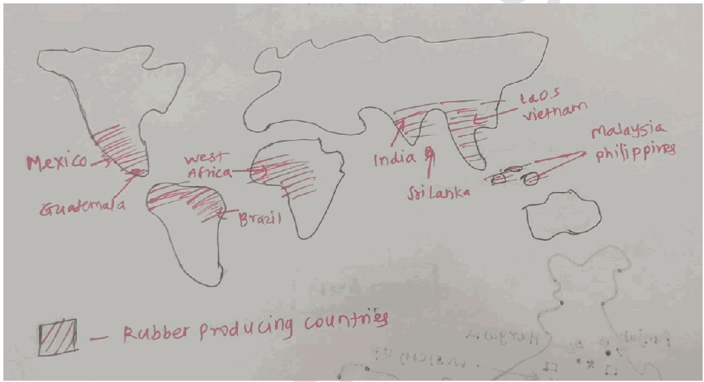

**Distribution of Rubber Producing Countries**

1. Approximately **85-90%** of the world’s natural rubber is produced in Asia, primarily by smallholders (plantations under 4 hectares).

2. **Southeast Asia**

- **Thailand-** The world’s leading producer with **32-36%** of global supply.

- **Indonesia-** The second-largest producer (~22% share)

- **Other countries - Vietnam and Malaysia**

**3. West Africa**

- **Ivory Coast-** 4th largest global producer (over **1.3 million tonnes)**

- **Others-** Nigeria, Ghana, and Liberia etc

4. **India-** production is centered in Kerala and the North-East.

5. Other Producers

- **China** - Yunnan and Hainan Island.

- **Latin America** - Brazil (original home of Hevea brasiliensis).

**Major Environmental Issues**

1. **Deforestation-** Since 2000, over **4 million hectares** of tropical forest in Southeast Asia have been cleared for rubber.

**a. Forest-to-plantation land-use change increase carbon emissions**

2. **Loss of Biodiversity** due to **monoculture. Eg-** Decline of wildlife habitats in Southeast Asia.

3. **Water Stress-** Rubber trees have high evapotranspiration rates, leading to depletion of local aquifers.

4. Soil Degradation - Continuous monocropping reduces soil fertility and increases erosion on slopes. EgRubber plantations in hilly tracts of Kerala.

5. **Effluent Pollution-** discharge from small-scale processing units leads to high **Biological Oxygen Demand (BOD)** and ammonia levels in nearby rivers.

6. Habitat Fragmentation leading to human-wildlife Conflict. Eg- Elephant habitat loss in Kerala.

7. **Climate Change Vulnerability -** Rising global temperatures (the "28°C threshold") and erratic rainfall are making traditional regions less viable.

8. **Disease Proliferation -** Monocultures are highly susceptible to pathogens like **Circular Leaf Spot** and **White Root Rot** Adoption of **sustainable rubber agroforestry, intercropping, and landscape-level land-use planning** is essential to reconcile **economic benefits with ecological stability.** Programs like the Global Platform for Sustainable Natural Rubber (GPSNR) are pushing for "Deforestation-Free" supply chains.

---

1. Explanation_Drishti IAS:
Source Question: Describing the distribution of rubber producing countries, indicate the major environmental issues faced by them.

- Natural rubber is a polymer of isoprene, an organic compound. It comes from various sources, the most common being the Pará rubber tree (Hevea brasiliensis).

- **Distribution of rubber producing countries:** Thailand produced 35% share of global natural rubber in 2020 followed by Indonesia.

- The tropical climate supports healthy rubber trees. It thrives in deep soil with resistance to flooding and in areas where the annual rainfall remains between 60 and 78 inches.

- Despite **natural rubber being native to the Amazon basin**, approximately **90% of the world’s supply is grown in Asia.** Much of this comes from Southeast Asia – specifically Thailand, Indonesia, Vietnam, and Malaysia.

- The other countries of the world that are producing the rubbers are Ivory coast, Brazil, Mexico, Gabon, Guina, Ecuador and Sri Lanka etc.

### Environmental issues

The rubber cultivation is a plantation crop and takes a long gestation period to become a fruitful crop for providing monetary benefits. This plantation incurs many negative externalities like:

- Countries like Malysia and Indonesia has lost a large part of its natural forest due to cultivation of Rubber.

- It also leads to extinction of biodiversity and population of some of the iconic species like orangutans have reduced.

- Preference to plantation crops like Rubber reduces the cultivation of the food crops and reduces the chance to achieve SDGs.

- Monotonous cropping pattern reduces the rejuvenation capacity of the soil and the accelerated application of the synthetic fertilizer further reduces the capacity of the soil and residue fertilizer prevails various illnesses in the society.

- The long gestation period of the rubber plantation (7-8 years) makes it more vulnerable to pests and other climate induced diseases and illnesses that hamper the interest of the small crop holders and bring the issue of livelihood.

- The rubber plantation itself is the source of various pollution and GHGs like:

- The open burning of rubber plantation wastes in the form of rubber tree stumps after land clearing (in Malaysia).

- Per kg dry rubber generates eight kg of effluents and its Natural degradation releases a huge amount of carbon dioxide (CO2) and methane.

- The emission of the rubber industry has been linked to various diseases and diverse impacts on human health.

- The rubber industry is one of the major water polluting industries. It accelerates the problem of water scarcity in the rubber producing countries.

Increasing demand of rubber due to industrial expansion, the sustainable cultivation of rubber is the only way forward. The synthesis of local and global knowledge with the use of modern technology can prevail in the interest of all the stakeholders involved in the industry.

---

1. Explanation_PWOnlyIAS:
Source Question: Describing the distribution of rubber producing countries, indicate the major environmental issues faced by them.

**Answer:**

| **Approach:** **Introduction**  • Write about the distribution of rubber producing countries in World. **Body**  • Discuss the major environmental issues faced by rubber producing countries **Conclusion**  • Conclude your answer with a Futuristic Approach. |
| --- |

### Introduction

**Natural rubber is a polymer of isoprene, an organic compound. Thailand is the largest producer of rubber in the world followed by Indonesia, Vietnam, Brazil, India and China. These nations are located in** tropical regions **. Their climate is warm and humid which is ideal for growing rubber trees.**

### Body

**Major environmental issues faced by these country:**
- **Deforestation:** The rubber industry has led to the conversion of large areas of natural forests into rubber plantations. This deforestation has caused the loss of biodiversity and habitats of many species, contributing to the decline of their populations. E.g **Brazil**
- **Soil degradation:** The cultivation of rubber trees on a large scale has led to soil degradation, causing a decline in soil fertility and productivity. The extensive use of pesticides, herbicides, and fertilizers has also polluted soil and water resources. E.g Venezuela.
- **Water pollution:** The rubber industry uses significant amounts of water for irrigation, which can lead to the depletion of water resources and the pollution of water bodies due to the discharge of agrochemicals. E.g **Peru**
- **Climate change:** The rubber industry contributes to climate change by releasing greenhouse gasses, primarily through deforestation, land-use change, and the use of fossil fuels for transportation. E.g **Brazil**
- **Labor and human rights issues:** The rubber industry is associated with labor and human rights violations, including exploitation of workers, child labor, and land grabbing from indigenous communities.

### Conclusion

The rubber industry is an important economic sector for several countries, but it is associated with significant environmental issues. **WWF’s goal** is to have the majority of companies that produce and use rubber commit to sustainably and ethically produced rubber.

---

1. Explanation_Rau IAS:
Source Question: Describing the distribution of rubber producing countries, indicate the major environmental issues faced by them. (15 Marks, 250 Words)

### Introduction

Rubber is produced in tropical regions of Southeast Asia, South America and West Africa which provide ideal climatic conditions for rubber trees. However, rubber plantations face significant environmental challenges.

### Body

**Distribution of rubber producing countries:**

- Asia is the largest producer of the world and produces about 91% of the world production, followed by Africa which produces 6%.

- South East Asian countries like Thailand, Indonesia, Vietnam and Malaysia are the leading producers of natural rubber.

- In addition to these, Ivory coast, India, Brazil and China also produce a significant share of rubber.

**Environmental issues faced by them:**

- **Deforestation:** In order to plant rubber, vast tracts of forest land are cleared which destroy native vegetation base.

- **Water stress:**Rubber trees in areas having insufficient rainfall, require artificial irrigation which reduces groundwater.

- **Soil degradation:** These trees devoid the soil of natural moisture.

- **Disease outbreaks:** Mono-plantation reduces the resistance against diseases and pest attacks.

- **Pollution and water contamination:** effluent discharge from rubber industries contain high concentrations of acids and sulphates.

**Case study:** In South-East Asia, rubber monoculture has taken over 250,000 hectares of natural forest and 61,000 hectares of protected area between 2005 and 2010. Over half of these plantations are in areas which are susceptible to insufficient water availability and soil erosion. Scientists have also linked rubber monoculture to reduction in water reserves, soil productivity and biodiversity in South-East Asia.

### Conclusion

Therefore focus must be given to grow rubber trees on low-quality, degraded land instead of clearing high-quality natural forests, install water treatment plants and reduce chemical usages in the industries.

---

---

1. Explanation_Superkalam:
Source Question: Describing the distribution of rubber producing countries, indicate the major environmental issues faced by them.

Natural rubber is obtained mainly from the latex of *Hevea brasiliensis*, a tropical tree requiring hot, humid conditions. Its production is concentrated in the humid tropics between **5°N and 10°S latitude**, especially in Southeast Asia.

##** Distribution of Rubber-Producing Countries **

Major Rubber Producing Countries World Map

1.** Asia (dominates global production, ~90%) **-** Thailand **– Largest producer (~35% of world’s output), concentrated in the southern peninsula.
 -** Indonesia **– Major plantations in Sumatra and Kalimantan.
 -** Vietnam **– Expanding production in central highlands.
 -** Malaysia **– Historical leader, now overtaken by Thailand and Indonesia.
 -** India **– Kerala, Tamil Nadu, and Karnataka contribute ~90% of national output.

2.** Africa **-** Nigeria, Liberia, Côte d’Ivoire, Cameroon **– Rubber estates often linked to multinational companies.

3.** Latin America **(origin region of rubber tree)

 -** Brazil **– Amazon basin production; affected historically by “South American Leaf Blight.”
 -** Guatemala & Mexico **– Small-scale but significant exports.

##** Major Environmental Issues Faced by Rubber-Producing Countries **1.** Deforestation & Loss of Biodiversity **- Large-scale conversion of tropical rainforests into monoculture rubber estates is one of the most visible environmental impacts.
 -** Example: **In** Cambodia and Laos**, forest cover loss has been closely linked to foreign investment–driven rubber plantations.
 - This reduces biodiversity, fragments habitats of species such as the Asian elephant and Malayan tiger, and disrupts ecosystem services like carbon sequestration.

2.** Monoculture-Induced Soil Degradation & Erosion **- Rubber plantations are typically monocultures, leading to nutrient depletion and reduced organic matter in the soil.
 -** Example: **In** Kerala’s Western Ghats**, plantations on steep slopes have increased run-off and soil erosion during monsoon seasons.
 - Over time, this necessitates heavier fertilizer use, creating a vicious cycle of soil exhaustion.

3.** Water Stress & Pollution from Processing Units **- While the rubber tree itself is moderately drought-resistant, large plantations demand water for nursery maintenance and processing.
 - Latex processing releases ammonia and formic acid; untreated effluents can lower dissolved oxygen in rivers, killing fish.
 -** Example:** **Perak River in Malaysia** faced significant water quality decline in the 2010s due to rubber factory discharges.

4. **Chemical Dependency – Pesticides & Fertilizers** - Intensive chemical inputs, including herbicides for weed control and synthetic fertilizers, harm beneficial soil microbes and contaminate groundwater.
 - **Example:** In **southern Thailand**, nitrate levels in groundwater have exceeded WHO limits in plantation belts, impacting drinking water safety.

5.** Climate Change Sensitivity **- Rubber trees require stable temperature (25–35°C) and rainfall (>2,000 mm annually). Variability in monsoons or prolonged droughts directly reduces latex yield.
 -** Example: **In** Indonesia**, the El Niño events of 2015 and 2019 caused severe drought stress, forcing tapping suspension and lowering incomes for thousands of smallholders.

6.** Plant Diseases & Pest Outbreaks **- Monocultures are highly susceptible to epidemics.
 -** South American Leaf Blight **devastated Brazil’s Amazon plantations, forcing large-scale shift to Southeast Asia.
 - In recent years,** Pestalotiopsis leaf disease **in Thailand and Indonesia has caused up to 40% yield losses.

7.** Displacement of Indigenous & Rural Communities **- Land acquisition for plantations often displaces small farmers and tribal populations, leading to socio-economic and cultural disruption.
 -** Example: **In** Liberia**, large concessions to foreign companies for rubber led to community protests over loss of ancestral lands and poor compensation.

8.** Carbon Emissions from Land Conversion **- Forest-to-plantation conversion releases stored carbon, contributing to greenhouse gas emissions.
 -** Example: **Studies in** Myanmar **show that rubber expansion between 2000–2020 released millions of tonnes of CO₂ equivalents annually.

9.** Human–Wildlife Conflict **- Habitat loss forces wildlife into plantation zones, damaging crops and leading to retaliatory killings.
 -** Example: **Notable in** Assam’s Karbi Anglong **region, where elephants have entered rubber plantations in search of food.

While rubber cultivation supports millions of livelihoods and is vital for the global automobile and manufacturing industries, its environmental footprint—ranging from deforestation to biodiversity loss—demands** sustainable agroforestry models, disease-resistant varieties, and eco-certification **to balance economic benefits with ecological integrity.

---

1. Explanation_Unacademy:
Source Question: Q15.Describingthedistributionofrubber-producing countries, indicate the major environmental issues faced by them. (250 Words, 15 Marks) Approach

- **Introduction:** Introduce with discussing Rubber and its position in the world map.

## **y Body** - Mention the Distribution of RubberProducing Countries.

- Mention the Major Environmental Issues Faced by Rubber-Producing Countries.

- Concludetheanswermentioning **Conclusion:** way forward measures. **Answer:** **Introduction:** Rubber, a critical raw material used extensively worldwide, is primarily produced in countries situated in the equatorial region, thanks to the tropical climate that is conducive for rubber tree growth. The major rubber-producing countries are found in Southeast Asia, Africa, and South America.

## **Body: Distribution of Rubber-Producing Countries** - **Southeast Asia:** The region is the world’s largest rubber producer, with Thailand, Indonesia, and Vietnam leading the charge. They contribute significantly to global natural rubber production due to their tropical climates and massive plantation areas.

- **Africa:** Africa is another significant player in the rubber industry. Côte d’Ivoire and Liberia are the main rubber-producing nations on the continent.

- **South America:** Brazil, being the native land of rubber trees, contributes significantly to rubber production, even though its output is overshadowed by Southeast Asian countries. **Major Environmental Issues Faced by Rubber-** ## **Producing Countries** - **Deforestation:** One of the significant environmental issues related to rubber production is deforestation. Expanding rubber plantations often involve clearing of forests, leading to loss of biodiversity, disruption of ecosystems, and increased carbon dioxide levels.

- **Soil Degradation:** Large-scale rubber plantations can lead to soil degradation. Rubber trees require a significantamountofnutrients,leadingtonutrient depletion in the soil over time.

- **Water Pollution:** The use of pesticides and fertilizers in rubber plantations can lead to water pollution if these substances leach into local water bodies. This contamination can harm aquatic life and impact the quality of water available for human use.

- **Monoculture:** Monoculture, the cultivation of a single crop over a large area, is a common practice in rubber production. This practice reduces biodiversity, making plantations more susceptible to diseases and pests. It also disrupts local ecosystems and food chains.

- **Climate Change Impacts:** Changes in rainfall patterns, temperatures, and incidences of extreme weather events due to climate change can negatively impact rubber production, as rubber trees are sensitive to these changes. **Conclusion:** Rubber production is crucial for global industries, it presents significant environmental challenges. It’s imperative for rubber-producing countries to embrace sustainable farming practices, such as agroforestry, organic farming, and responsible land use planning, to mitigate these environmental issues. Policymakers, industry, and local communities need to work together to ensure the long-term sustainability of the rubber industry

---

---

Q18. Despite India being one of the countries of the Gondwanaland, its mining industry contributes much less to Gross Domestic Product (GDP) in percentage. Discuss.
[Year: 2021] [Group: UPSC CSE] [Exam: Mains] [Stage: Mains] [Paper: Mains - GS 1]
[Subject: GEOGRAPHY]
[Section Group: Economic & Resource Geography]
[Microtopic: Factors responsible for the location of primary, secondary, and tertiary sector industries in various parts of the world (including India).]
[Subtopic: Primary sector]
[Macrotag: Analytical, Applied]
[Microtag: Discuss, India]

1. Explanation_Civilsdaily:
Source Question: Despite India being one of the countries of Gondwanaland, its mining industry contributes much less to its Gross Domestic Product(GDP) in percentage. Discuss. [Year: 2021] [Marks: 10]

India's mining sector’s contribution to GDP is around **2.2% to 2.5%.** This is significantly lower than other Gondwanaland peers like **Australia (~8-10%)** or **South Africa (~8%).**

**Reasons for low contribution of mining to GDP**

1. Shift Toward Service-Led Growth - Service sector contributes 55% of GDP.

2. Limited Exploration - Only about 10-15% of India’s geological potential has been explored in detail. EgDeep-seated and critical minerals remain largely unexplored.

3. Low Value Addition - India largely exports iron ore instead of finished steel or high-value products

4. Regulatory and Policy Bottlenecks - Multiple approvals related to environment, forest, and land acquisition slow down project implementation.

5. Infrastructure Deficiency - Poor connectivity between mines and ports/industries increases transport cost. Eg- Coal evacuation constraints in eastern India.

6. Environmental and Social Concerns - Approximately 70% of India's mineral reserves are located in forested areas.

7. Mining in forest and tribal areas faces resistance due to displacement and ecological damage. EgBauxite mining issues in Niyamgiri hills.

8. Low Private and Foreign Investment -

a. India has one of the highest effective tax rates (ETR) for mining globally, when royalties, DMF funds, and corporate taxes are combined.

b. Many of the most lucrative **mineral belts in Central India** have been affected by **Left-Wing Extremism (LWE).**

9. Illegal Mining - Unregulated extraction leads to loss of royalty and taxes. Eg- Iron ore mining scam in Karnataka.

10. Dominance of Small and Unorganised Mines - Eg- Minor mineral quarries across states.

**Other Structural Constraints**

1. Low level of **technology adoption and mechanisation**

2. Inadequate **skilled manpower**

3. Weak **mineral-based industrial linkages Way Forward**

1. Intensifying **exploration through private participation and advanced technology**

2. Developing **mining corridors and logistics infrastructure** under PM Gati Shakti

3. Ensuring **transparent and stable policy regime. Eg- single window clearances**

4. Focusing on **critical and strategic minerals** under the National Mineral Policy This can ensure that mining becomes a stronger pillar of India’s economic growth and support the transition toward **resource-based industrialisation.**

---

1. Explanation_Drishti IAS:
Source Question: Despite India being one of the countries of Gondwanaland, its mining industry contributes much less to its Gross Domestic Product (GDP) in percentage. Discuss.

Despite being a part of Gondwana land, rich in providing minerals such as coal, iron, mica, aluminium, etc., the contribution of the mining sector to India’s GDP has been on a steady decline. Contribution by the mining sector to India’s GDP is only 1.75%. Whereas other countries like South Africa and Australia contribute 7.5% and 6.99%.

**Reasons:**

- Mining is harmful from an environmental point of view. There has hardly been a mining project that did not face opposition on this front.

- Several tribal communities and Particularly Vulnerable Tribal Groups (PVTGs) fall into the mining zones. Their residence is also threatened by an increase in mining. Their rehabilitation and compensation is another major issue.

- The auction of a mine is a process where the power rests in the hands of State governments. There might exist ambiguity in the case where there are two different political parties in power at the Center and the State.

- There are also issues like technological advancements and availability of cheap funds. Lack of these is the major determinant in poor growth of the mining industry.

- India has majorly been an exporter of raw materials and an importer of finished products made out of those raw materials. As the raw materials are sold at dirt cheap rates, it reflects poorly in the GDP calculations.

---

1. Explanation_PWOnlyIAS:
Source Question: Despite India being one of the countries of Gondwanaland, its mining industry contributes much less to its Gross Domestic Products [GDP] in percentage. Discuss.

**Answer:**

| **Approach:** **Introduction**  • Explaining contribution of the mining sector in India GDP. **Body**  • Mention reasons behind this less percentage of contribution. **Conclusion**  • Significance of mining Industry with government approach. |
| --- |

### Introduction

**India is one of the countries of the ancient supercontinent, Gondwanaland, which is known for its rich mineral deposits. Mining sector is an important contributor to India’s economy, with its contribution to India’s Gross Domestic Product (GDP) ranging from 2.3% to 2.9% over the last decade.** Body: **The mining sector in India has historically contributed a relatively low percentage to the country’s Gross Domestic Product (GDP) compared to other sectors.**

**Reasons for low contribution:**
- **Modernization and technological advancements:** The mining industry in India is predominantly carried out by small-scale miners who use outdated technology and equipment, resulting in low productivity and efficiency. The lack of modernization and technology also hinders the exploration and extraction of minerals in the country.E.g J

- **Labour laws framework:** The mining industry in India is subject to various regulations, including environmental and labor laws, which can make it difficult for companies to operate efficiently.
- **Complex regulatory framework:** Obtaining permits and approvals for mining activities can be a cumbersome and time-consuming process, leading to delays and reduced productivity.
- **Slow pace of land acquisition:** Land acquisition in India is a complex and time-consuming process, and the mining industry often faces challenges in acquiring land for its activities. This can lead to delays in the implementation of mining projects, resulting in lower productivity and output.
- **Lack of investment:** The mining sector requires significant investment in exploration, technology, and infrastructure, which can be a deterrent for investors. The lack of investment also affects the value addition in the sector, leading to the export of raw minerals without processing them, which reduces their value and contribution to India’s economy.

### Conclusion

India’s mining industry has significant potential to contribute to the country’s economy given its rich mineral deposits. The government needs to address these challenges and create a conducive environment for investment in the sector, technology upgradation, skill development, and sustainable mining practices can help enhance the mining sector’s contribution to India’s GDP and overall economic growth.

---

1. Explanation_Rau IAS:
Source Question: Despite India being one of the countries of the Gondwanaland, its mining industry contributes much less to its Gross Domestic Product (GDP) in percentage. Discuss. (10 Marks, 150 Words)

### Introduction

Gondwanaland is viewed as a complicated amalgamation of many pieces from various epochs. Many ore-formation processes occurred throughout Earth's history in a variety of geotectonic settings and hence these regions are endowed with rich mineral resources. But instead, India's mining sector provides just 2.2 percent to 2.5 percent of the country's GDP.

### Body

**Causes behind low contributions of mining industry in India's GDP**

- Increasing concerns related to environmental pollution, Loss of biodiversity, Water Pollution.

- Displacement and rehabilitation issues

- Lack of transparency in licensing/allocation leads to large scale cancellations.

- In comparison to other mining locations, India's mining sector is exposed to substantially higher taxes. High royalties, for example, or double taxes, to name a few examples.

- Issues plaguing India's Public sector like low skills, lack of modernization and insufficient capital investment.

### Conclusion

In this regard, the government initiatives like Star rating of mining leases, mining surveillance system, District Mineral foundation and National Mineral Exploration Policy are a welcome steps which will go a long way in ensuring higher contribution of mining to India's GDP.

---

---

1. Explanation_Superkalam:
Source Question: Despite India being one of the countries of Gondwanaland, its mining industry contributes much less to its Gross Domestic Product (GDP) in percentage. Discuss

Despite India's** Gondwanaland heritage **providing rich mineral deposits, the mining sector contributes only** 0.9% to GDP **(2023-24), significantly lower than Australia (10%) or South Africa (8%).

Gondwana Mineral Belts of India Map

## Gondwanaland Mineral Inheritance

-** Coal Reserves**: India holds world's 4th largest coal reserves (344 billion tonnes) in** Jharkhand, Odisha, Chhattisgarh **-** Iron Ore Abundance**: Massive deposits in** Bailadila, Kudremukh **regions from Precambrian formations
-** Base Metal Wealth**: Rich** copper, zinc, lead **reserves in** Rajasthan Belt **and** Singhbhum Craton **-** Rare Earth Elements**: Significant** thorium, uranium **deposits along** Kerala, Tamil Nadu **coasts
-** Bauxite Resources**: Second-largest global reserves concentrated in** Eastern Ghats **region

Gondwanaland India Mineral Distribution showing coal fields, iron ore belts, and metamorphic zones

## Constraints Limiting Mining GDP Contribution

|** Challenge Area **|** Specific Issues **|** Economic Impact **|
| --- | --- | --- |
|** Regulatory Bottlenecks **| Multi-level clearances, Land acquisition delays | 3-5 year project delays |
|** Infrastructure Deficit **| Poor rail connectivity, Power shortages | 30% higher operational costs |
|** Technology Gaps **| Outdated extraction, Limited mechanization | 40% lower productivity |
|** Environmental Hurdles **| Forest clearances, Community resistance | Project cancellations |
|** Value Addition Deficit **| Raw material exports, Limited processing | Lost revenue potential |

### Policy Implementation Challenges

-** MMDR Act Amendments (2015, 2021)**: Despite auction reforms, clearance bottlenecks persist
-** National Mineral Policy 2019**: Implementation gaps in exploration and technology adoption
- Limited private sector participation due to complex regulatory framework
- Insufficient investment in** deep-sea mining **and** critical mineral exploration **-** District Mineral Foundation**: Underutilization of mining revenue for local development

### Strategic Reform Requirements

-** National Mineral Information Centre**: AI-powered geological mapping and exploration
-** Critical Mineral Mission 2023**: Focus on lithium, cobalt for renewable energy transition
- Single-window clearance system implementation
-** Gati Shakti integration **for mining corridor development
- Enhanced** Make in India **initiatives for mining equipment manufacturing

India's mining potential remains underexploited despite** Gondwanaland geological advantages**. Implementing comprehensive reforms under** Atmanirbhar Bharat **with sustainable mining practices can significantly boost GDP contribution while supporting India's net-zero commitments by 2070.

---

1. Explanation_Unacademy:
Source Question: Q5. Despite India being one of the countries of the Gondwanaland, its mining industry contributes much less to its Gross Domestic Product (GDP) in percentage. Discuss. (10 Marks, 150 Words) Tags: Natural Resources

## **Decoding the Question** - **Introduction: Briefly define Gondwanaland.** -

## **Body** - **Mention the causes of decline of the** **mining industry in GDP share and give** **appropriate data.** - **Discuss all major aspects related to the** **downfall of stunted growth of mining.** - **Conclusion: Conclude with a way forward** **whileaddingpositivesofMinesandMinerals** **(Development and Regulation) Amendment** **Act, 2021.** **Answer:** Gondwanaland is a complicated assemblage of many elements from various eras. Numerous ore-building processes occurred over the history of the earth in a variety of geo-tectonic settings. There are a lot of mineral reserves in the nations that were once a part of Gondwanaland, including India.

## **The Declining Share of Mining in India’s GDP** - Despite increases in output and value addition, the mining sector’s contribution to the nation’s gross domestic product (GDP) has been dropping recently.

- From1.93percentin2012-13,theminingsector’s **share of GDP (excluding petroleum & natural** **gas) fell to 1.53 per cent in 2017-18. India’s GDP** **grew from 5 per cent to 7 per cent during the** **same period.** **The Causes of Declining Share of Mining in India’s** ## **GDP** - **Tribal areas with forests are where minerals are** **found.** Conflicting priorities between resource exploitation and tribal development are formed by democratic governments with a welfare mandate. A significant problem is tribal rehabilitation and compensation.

- **Multiple clearances and Legal hurdles:** Multiple clearances are necessary, which hurts the mining industry and renders it unprofitable. Clearances of the environment or forests, for instance. The mining industry is also subject to several legal rulings. For instance, the production of coal mining was impacted by the SC’s coal block allotment decision.

- India has **struggled to make significant** **investments** in its capital-intensive industries, suchasmining.Boththegovernmentalandprivate sectors are lacking in the mining industry.

- The mining industry is directly linked to a number of **environmental issues.** It continues to be difficult to strike a balance between mining policy development and environmental protection.

- In comparison to other mining regions, India has **substantially higher levies** on the mining industry. High royalties, double taxation, etc. are a few examples.

- The mining of ferrous, non-ferrous, and minor minerals has also been badly impacted by unanticipated problems like the **Covid-19** **pandemic.** - **Poor exploration: High licensing requirements** discourage private players from engaging in mineral prospecting.

- **Monopoly of PSUs:** Due to PSU monopolies, the mining industry is plagued by the issue of unproductive asset utilisation. Think of India’s monopoly in the coal industry.

- **Slowmodernisation:TheminingindustryinIndia** has been hesitant to follow positive global trends. Smart mines, for instance, etc.

 **Fig: Major Mining States in India** The **Mines and Minerals (Development and** **Regulation) Amendment Act, 2021** must be implemented successfully in order to remove restrictions on the final use of minerals, allow captive mines to sell minerals, allow the Central Government to auction minerals in certain circumstances, transfer statutoryclearances,allocatemineswithexpiredleases, and extend leases to government-owned companies. For the wise utilisation of mineral resources, the clearanceprocedureneedstobeexpedited.Theanswer is to concentrate on cutting-edge underground mining technology that is employed by miners all over the world.

---

---

Q19. Define blue revolution, explain the problems and strategies for pisciculture develop- ment in India.
[Year: 2018] [Group: UPSC CSE] [Exam: Mains] [Stage: Mains] [Paper: Mains - GS 1]
[Subject: GEOGRAPHY]
[Section Group: Economic & Resource Geography]
[Microtopic: Factors responsible for the location of primary, secondary, and tertiary sector industries in various parts of the world (including India).]
[Subtopic: Primary sector]
[Macrotag: Descriptive, Applied]
[Microtag: Define, Explain, India, Problem]

1. Explanation_Civilsdaily:
Source Question: Defining blue revolution, explain the problems and strategies for pisciculture development in India. [Year: 2018] [Marks: 15]

**Blue Revolution (Neel Kranti Mission)** is an initiative aimed at rapid and sustainable growth in the aquaculture and fisheries sector to **increase production, enhance fishers' income, and ensure nutritional security.**

**Fact File**

1. India is currently the **3rd largest fish producer and 2nd largest in aquaculture**

2. Fisheries contribute **~1.1% to GDP and 7% to agricultural GDP.**

3. Total production is **197.75 lakh tonnes** in FY 2024-25.

**Key Components of the Blue Revolution**

1. **Scientific modernization.** Eg- Biofloc, RAS.

2. **Infrastructure Modernization. Eg-** fishing harbors, cold chains, and processing units.

3. **Species Diversification.** Eg- focus on high-value species like Tilapia and Sea Bass.

4. **Sustainable Governance -** "Ecosystem-based Fisheries Management".

5. **Social Empowerment -** Doubling Fishers income **Problems in Pisciculture**

1. **Weak centre-state coordination** leading to **policy fragmentation. Eg-** inland fisheries are a State subject, while deep-sea activities fall under the Central Government.

2. **Inadequate institutional reach and limited last-mile delivery. Eg-** exclusion of small fish farmers in eastern India from benefits of **PMMSY**

3. **Limited access to institutional credit** and over **dependence on informal finance** leads to high input costs and working capital shortages. Eg- Low KCC coverage.

4. **Post-harvest losses -** India loses **20-25% of fish produce** due to poor storage and transport.

5. **Market intermediaries** cause **low price realisation** for fish farmers.

6. **Small and fragmented holdings - Low economies of scale. Eg-** Majority ponds are below 1 hectare.

7. While small-scale fishers comprise **90% of the workforce,** they contribute less than 10% of the marine catch

8. **Low Productivity - 4 to 5 kg/ day in India vs 250 kg/day in Norway**

9. **Low skills -** Limited adoption of scientific aquaculture.

10. Absence of **quality seed and high cost of formulated feed** leads to **low productivity and reduced profitability. Eg-** Feed accounts for **60-70% of input cost.**

11. **Low adoption of modern systems** like **Biofloc, RAS, cage culture**

12. **Water pollution -** Industrial effluents in rivers affect inland fisheries. Eg- Fish mortality in stretches of Yamuna and Godavari.

13. **Climate change - Erratic monsoons have affected breeding cycles** of fisheries

14. **Climate-Driven Migration and Disease** due to rising sea temperatures and water pollution. **Eg- White Spot Syndrome Virus (WSSV)** in shrimps.

15. **Over-exploitation of marine resources - 90% of the global marine fish stocks have either been fully exploited or overfished or depleted (FAO) Strategies for pisciculture development**

1. Government Initiatives

a. PM Matsya Sampada Yojana - Integrated value chain development

b. Fisheries and aquaculture infrastructure development fund - concessional finance for cold storage

c. **PM Matsya Kisan Samridhi Sah-Yojana (PM-MKSSY)** to **formalize the unorganized sector and supporting MSMEs** through digital IDs

d. **2026 Budget** earmarked funds for integrated development of **500 reservoirs** and Amrit Sarovars

2. Other strategies needed

a. Brood Banks and Hatchery Modernisation to ensure quality seed supply. Eg- Jayanti rohu.

b. Promoting **Fish Farmer Producer Organizations (FFPOs)** to help small farmers gain "collective bargaining power" for bulk feed purchase and direct market access.

c. Expansion of Culture Area - Bringing unused water bodies under aquaculture. Eg- wetland fisheries development.

d. Affordable Institutional Credit - Universalisation of KCC for fishers and aquaculture farmers.

e. **Women's Participation-** Providing up to **60% subsidy** for women-led aquaculture projects, particularly in ornamental fisheries and seaweed farming.

f. **Safety Nets- Accidental Insurance Scheme** for fishers and the deployment of **transponders** on vessels for real-time safety tracking.

g. Promotion of Modern Technologies for intensive and high-density farming. Eg- Biofloc and RAS units in Andhra Pradesh and Tamil Nadu.

h. Scaling digital fish marketing for better price discovery. Eg- Platforms like Matsya Setu

i. Integrated Fish Farming for income diversification. Eg- Fish + duck + paddy systems in Assam and West Bengal.

j. **GlobalGAP and BAP Certifications** to tap into premium markets in Japan and the EU.

k. Climate-resilient and Sustainable Aquaculture - Ecosystem-Based Management by adopting the FAO’s Code of Conduct for Responsible Fisheries.

These can enable India to unlock its vast inland and marine fisheries potential and strengthen its **blue economy.**

---

1. Explanation_Drishti IAS:
Source Question: Defining blue revolution, explain the problems and strategies for pisciculture development in India. (2018)

The concept of rapid increase in the production of fish and marine product through package programme like Green Revolution is called as Blue Revolution. It was launched during the seventh Five-Year Plan, when the Central Government sponsored the Fish Farmers Development Agency (FFDA) with an aim to create an integrated and holistic development and management of fisheries in the country and to improve the socio-economic conditions of fisher folk and fish farmers.

**Problems**

- There are lack of reliable database relating to aquatic and fisheries resources in India as well as lack of suitable policies of government and inefficiency of an enforcement agency to monitor the supply of good quality seeds and feeds.

- Water pollution, unscientific management of aquaculture and over exploitation of coastal fisheries along with problems in harvest and post-harvest operation; lack of landing and berthing facilities for fishing vessels.

- Many fisheries management bodies do not heed scientific advice on fish quotas and set catch limits above the recommended maximum amount.

- Lack of adequate financial support and proper transport and marketing facilities for the products.

- Lack of skill and prevalence of negative social perception and prejudice regarding fishing as a profession in the caste ridden Indian society.

**Strategies for the Development of Pisciculture**

- Focus on the improvements in breeding technology, disease control, feeds and nutrition, and low-impact production systems to complement traditional knowledge to improve efficiency.

- Focus on spatial planning and zoning to ensure that aquaculture operations stay within the surrounding ecosystem’s carrying capacity.

- Formulation of public and private policies to provide financial support, enhance skill and make farmers aware and capable to practice sustainable pisciculture.

- Emphasis on leveraging the latest information technology for better planning and monitoring.

- Invest on cold chain and market infrastructure to avoid loss due to delay in selling and price fall.

India is home to more than 10 percent of the global fish diversity and it ranks second in the world in total fish production. Realizing the immense scope for development of fisheries and aquaculture, the Government of India has restructured the Central Plan Scheme named, Blue Revolution: Integrated Development and Management of Fisheries for overall development of the sector.

---

1. Explanation_PWOnlyIAS:
Source Question: Defining Blue Revolution. Explain the problem and strategies for pisciculture development in India.

| **Approach:** **Introduction**  • Write about the Blue Revolution. **Body**  • Discuss the Problems of pisciculture development and its strategies in India. **Conclusion**  • Conclude your answer with a futuristic approach. |
| --- |

### Introduction

**The “Blue Revolution” refers to the sustainable and innovative development of the world’s fisheries and aquaculture sectors to meet the growing demand for seafood while protecting the health of marine ecosystems and improving the livelihoods of fishing communities. The sector has enormous potential to contribute to the country’s food security and rural livelihoods.** Body: ****

**Problems of pisciculture development in India:**
- **Lack of infrastructure:** Primary challenges facing the development of pisciculture in India is the lack of adequate infrastructure, including fish hatcheries, fish seed farms, fish processing facilities, and transportation networks. This lack of infrastructure makes it difficult for fish farmers to produce and sell their products.
- **Limited access to credit:** Fish farmers in India often face difficulty in accessing credit, which limits their ability to invest in infrastructure and expand their operations. This lack of access to credit is a major impediment to the growth of the pisciculture sector.
- **Poor quality fish seed:** The quality of fish seed in India is often poor, with high mortality rates and low growth rates. This is due to a lack of proper breeding and selection techniques, which results in low-quality fish seed.
- **Water scarcity:** Water scarcity is a major challenge for the pisciculture sector in India, as fish require large quantities of water for their growth and survival. This problem is compounded by the fact that many of India’s rivers are heavily polluted, making it difficult to maintain clean water for fish farming.
- **Lack of skilled manpower:** Another problem facing the development of pisciculture in India is the shortage of skilled manpower, including aquaculture technicians, fish health professionals, and fish processing workers. This shortage of skilled manpower makes it difficult for fish farmers to produce high-quality fish products and compete in the global market.
- **Low profitability:** Despite the potential benefits of pisciculture, many fish farmers in India struggle to make a profit. This is due to a variety of factors, including high production costs, low market prices, and limited market access.
- **Environmental issues:** related to fishing, a recent WTO agreement has been proposed on illegal and unregulated **Strategies of pisciculture development in India:
- To properly plan freshwater and brackish water aquaculture, it is necessary to strengthen the current database, which is not sufficient for empirical policy analysis. By taking these steps, we can ensure the sustainable growth of the brackish aquaculture sector, benefiting both the economy and the environment.

**In Telangana and Andhra Pradesh, India, a study found that the lack of reliable data on water availability and quality hindered the development of brackish water aquaculture. Improving data collection and analysis can lead to sustainable growth of the industry and benefit local communities.**
- **Leveraging the latest information technology:** is also critical to improving planning and monitoring of brackish aquaculture. Important to encourage this activity only in areas suitable for its purpose, which can be identified through remote sensing and GIS techniques to minimize ecological pollution and social conflicts.
- **Improvements in breeding technology:** , disease control, feeds and nutrition, and low-impact production systems must be made to complement traditional knowledge and enhance efficiency. Both public and private policies should be formulated to provide financial support, enhance skills, and educate farmers about sustainable practices.
- **Financial institutions:** should strengthen the flow of credit to the aquaculture sector, taking into consideration the ecology and regulatory framework governing this sector.
- The growth of the aquaculture sector, specifically brackish aquaculture, is largely driven by exports. However, in order to maintain this growth, it is essential to address the issues surrounding the ecological and economic sustainability of brackish aquaculture, while also identifying its comparative advantage through multidisciplinary and regional studies.
- **Legal and institutional measures:** must be developed to regulate aquaculture activity in ecologically fragile zones, and these measures must be implemented and enforced by local authorities. Enforcing quarantine measures on fish seed and feed is also essential to ensure that imported material is not infected or unwanted.

### Conclusion

India possesses a significant portion of the world’s fish diversity and stands as the second-largest fish producer globally. In the current climate of food insecurity, the prospects of pisciculture are immense in providing sustenance for the growing population. A sustainable and ecologically balanced approach towards aquaculture can cater to both the environmental and socioeconomic needs of the society.

---

1. Explanation_Superkalam:
Source Question: Defining the blue revolution, explain the problems and strategies for pisciculture development in India.

The** Blue Revolution **represents India's comprehensive program to enhance aquaculture and fisheries productivity through scientific methods, technological integration, and sustainable resource management for achieving self-sufficiency in fish production.

India Fisheries Potential Outline Map

## Problems in Pisciculture Development

### Environmental and Resource Constraints

-** Water Pollution**: Industrial effluents and agricultural runoff degrading aquatic ecosystems, affecting fish health and breeding
-** Climate Impact**: Rising temperatures altering fish migration patterns and spawning cycles
-** Habitat Destruction**: Wetland conversion and coastal development reducing natural breeding grounds
-** Water Scarcity**: Competition for freshwater resources between agriculture and aquaculture
-** Disease Outbreaks**: Viral and bacterial infections causing mass mortality in fish farms

### Technical and Infrastructure Deficits

-** Quality Seed Shortage**: Limited availability of disease-resistant fish varieties and quality fingerlings
-** Feed Quality Issues**: Dependence on costly imported feed ingredients affecting production economics
-** Processing Gaps**: Inadequate cold storage facilities leading to 20-25% post-harvest losses
-** Technology Access**: Limited adoption of modern aquaculture techniques among small-scale farmers
-** Research Limitations**: Insufficient species-specific breeding and nutrition research

### Socio-economic Challenges

-** Credit Access**: Limited institutional financing for aquaculture infrastructure development
-** Market Linkages**: Poor connectivity between producers and consumers, causing price volatility
-** Skill Gaps**: Lack of technical knowledge among traditional fishermen
-** Insurance Coverage**: Inadequate risk coverage for climate-related losses
-** Land Rights**: Unclear water body ownership affecting investment decisions

| Challenge Type | Impact Level | Primary Affected Regions |
| --- | --- | --- |
| Water Pollution | High | Industrial corridors, urban areas |
| Technology Gap | Medium | Rural inland areas |
| Market Access | High | Coastal and remote regions |

## Strategies for Pisciculture Development

### Government Policy Framework

-** Pradhan Mantri Matsya Sampada Yojana (PMMSY)**: ₹20,050 crore investment targeting 22 million tonnes fish production by 2024-25
-** Fisheries Infrastructure Development Fund**: Establishment of modern processing units and cold chain facilities
-** Blue Economy Policy 2023**: Integrated approach combining marine conservation with economic development
-** National Fisheries Development Board**: Coordinating research, extension services, and technology transfer
-** Kisan Credit Card Extension**: Financial support coverage extended to fishermen and aquaculture farmers

### Technological and Scientific Interventions

-** Biofloc Technology**: Water recycling systems reducing production costs by 30-40%
-** Cage Aquaculture**: Utilizing reservoir and lake waters for intensive fish farming
-** Integrated Farming**: Combining fish production with poultry, agriculture, and livestock
-** Genetic Improvement**: Development of high-yielding fish varieties through selective breeding
-** Digital Monitoring**: IoT-based water quality management and disease surveillance systems

### Sustainable Development Approaches

-** Ecosystem-based Management**: Balancing production with environmental conservation
-** Community Participation**: Formation of self-help groups and fishermen cooperatives
-** Export Promotion**: Quality certification and traceability systems for international markets
-** Research Enhancement**: Strengthening ICAR institutes and state fisheries universities
-** Climate Resilience**: Developing adaptive strategies for sea-level rise and temperature changes

The** Odisha model **demonstrates successful integration, achieving 8.5 lakh tonnes production in 2023-24 through scientific pond management and farmer training programs, positioning India as the world's second-largest aquaculture producer.

---

1. Explanation_Unacademy:
Source Question: Q15. Defining Blue Revolution, explain the problems and strategies for pisciculture development in India. (15 marks, 250 words)

**Tag:** Distribution of key natural resources across the world including India.

## **Decoding the Question** - **In Introduction, start with the definition of** **Blue Revolution and its significance.** - **In Body, elaborate the problems and** **strategies of pisciculture development in** **India.** - **In conclusion, put some data and mention** **the seriousness of the government to tap the** **potential of the fish industry.** **Answer:** The term Blue Revolution applies to the striking emergence of aquaculture as an important and highly productive agricultural activity. Hence, the concept of the rapid development in fish production and marine products through package programmes is called the Blue Revolution, started during the **seventh Five-year** **plan** (1985-1990). The Blue Revolution has brought significant improvement in pisciculture by embracing new techniques like **fish breeding, rearing, marketing,** **and fish export.** Despite tremendous success in the development of fisheries in the country, pisciculture development in India faces specific problems.

## **Problems of pisciculture development in India** - **Unutilized Potential:** It is a matter of great concern that India can exploit only a fraction of the aquaculture potential available to it.

 - India uses only about 40% of the available ponds, tanks, and other water bodies for freshwater aquaculture and 15% of total potential of brackish water resources.

- **Farming fish can make fish prices** go down because farms produce a lot of fish, all the time, consistently flooding the market.

 - Commercial fishermen often lose their jobs when there is farming of the species that they normally catch in the wild.

 - In case of ocean fish farming, fish wastes, excess food, fish escapes, antibiotics and variouschemicalsfromfishfarmscanallresult in water pollution and harm surrounding habitats by poisoning wildlife and causing other disturbances.

 - Industries are also a factor that can destroy fish farming. It also contributes to pollution that could contaminate the water.

- **Social problems:** Norms and religious values excluded women or other groups from participation in certain activities.

 - Lack of family encouragement considering low prestige occupation.

 - Inadequate family labour.

 - Multiple use of pond water, especially for domestic purposes, restricts commercial fish farming.

- **Economicproblems:Highcostsofculturalinputs,** **especially fish feed.** - Lack of financial assistance.

 - Inadequate loan from financial agencies.

 - Lackofremunerativepriceforthecommodity.

- **Technological problems:** Lack of value addition for improving profit margin. The market for processed fish is bounded in the domestic market and is restrained to fish pickles, cutlets etc. The technology of fish production is complex. Lack of timely availability of information nearby, lack of quality feed in the local market, absence of location-specific modernised technology, imperfect knowledge, and scientific fish farm management skills. **Creating an enabling environment for integrated** **utilization of the full potential of fisheries of the** **country, GOI came with many strategies and** **solutions.** ## **Strategies of pisciculture development in India** - Scheme like **Pradhan Mantri Matsya Sampada** **Yojana is aimed to turn India into a hotspot for** **fish and aquatic products through appropriate** **policy** marketing and infrastructure support.

 - With this scheme, the government intends to **bring all fishermen under the ambit of farmer** **welfareprogramsandsocialsecurityschemes.** - The new **National Policy on Marine Fisheries** talks of introducing deep-sea fishing vessels and assisting fishing communities to convert their vessels and gears for the waters beyond.

- The focus of **the Blue Revolution 2.0** is on development and management of fisheries which covers inland fisheries, aquaculture, marine fisheriesincludingdeepseafishing,marineculture and all activities undertaken by the National Fisheries Development Board.

 - **The National Fisheries Development** **Board (NFDB)** was established in 2006 as an autonomous organization under the administrative control of the Department of Fisheries,MinistryofAgricultureandFarmers Welfare, to enhance fish production and productivity in the country and to coordinate fishery development in an integrated and holistic manner.

- **Improving breeding technology,** disease control, feeds and nutrition, and low-impact production systems to complement traditional knowledge to enhance efficiency is needed. India showed an average annual growth of **14.8 per** **cent in the production of fish and allied products** in the last decade compared to the global average of **7.5 per cent** in the same period. In the era of food insecurity, **pisciculture shows enormous potential** to serve the ever-increasing human population. Ecofriendly aquaculture following the environmental and socioeconomic needs of the society must be evolved.

---

---

Q20. In spite of adverse environmental impact, coal mining is still inevitable for develop- ment.” Discuss.
[Year: 2017] [Group: UPSC CSE] [Exam: Mains] [Stage: Mains] [Paper: Mains - GS 1]
[Subject: GEOGRAPHY]
[Section Group: Economic & Resource Geography]
[Microtopic: Factors responsible for the location of primary, secondary, and tertiary sector industries in various parts of the world (including India).]
[Subtopic: Primary sector]
[Macrotag: Analytical]
[Microtag: Discuss]

1. Explanation_Drishti IAS:
Source Question: “In spite of adverse environmental impact, coal mining is still inevitable for development”. Discuss. (2017)

India’s coal reserves, fourth largest in the world, provide it with a cheap source of energy. However, the mining of coal causes severe damage to the environment:

- Pollution due to exposure of mining waste to air and water.

- Coal mining results in methane emissions, a powerful greenhouse gas.

- Fires from underground mines can burn for years, releasing smoke containing CO2, CO, NOx, SO2 etc.

- Deforestation when trees are cut down or burned for clearing the way for a coal mine.

Despite the damage caused by coal mining, it is expected to contribute the dominant share to India’s electricity production for decades to come. Even with annual growth rates above 10%, the share of renewable sources in India is unlikely to reach even 10% of the energy mix before 2040. (Solar energy still provides only about 1 per cent of the electricity generated in the country).

India’s reliance on coal is expected to persist even in 2040s, with an envisaged share of 42%-50% in energy mix. A lower growth trajectory of renewable energy in view of the challenges and uncertainty of prices, storage costs, grid connectivity and parity make it over-ambitious to expect them to be central for India’s development.

---

1. Explanation_PWOnlyIAS:
Source Question: “In Spite of adverse environmental impact, coal mining is still inevitable for development”. Discuss.

**Answer:**

| **Approach:** **Introduction**  • Write about the importance of Coal Mine and its impact. **Body**  • Discuss the advantages and disadvantages of coal Mining. **Conclusion**  • Conclude your answer with a futuristic approach. |
| --- |

### Introduction

**Coal mining has been a crucial part of global energy production for centuries, but it is not without its drawbacks. Despite its environmental impacts, many argue that it is still necessary for development. In this essay, we will explore both sides of this argument.** Body: **

**

**Inevitability of Coal Mining:**
- **Energy Security and needs:** Coal is the most abundant and widely used fossil fuel. It provides a reliable and affordable source of energy that is essential for economic growth and development.
- **Job Creation:** Coal mining provides employment opportunities for millions of people worldwide. The industry creates jobs in mining, transportation, and other related industries.
- **Infrastructure Development:** Coal mining requires the development of transportation infrastructure such as railways, roads, and ports, which can contribute to regional development and economic growth.
- **Revenue Generation:** Coal mining generates significant revenue for governments through taxes, royalties, and other fees. This revenue can be used to fund social welfare programs, education, and healthcare.
- **Renewable energy:** has not been fully utilized yet.

**Issues persistent with Coal Mining:**
- **Environmental Impacts:** Coal mining has significant environmental impacts, including air and water pollution, soil degradation, and greenhouse gas emissions. These impacts can lead to health problems, loss of biodiversity, and climate change.
- **Health Hazards:** Coal mining can have adverse health effects on workers and nearby communities. Miners are exposed to coal dust, which can cause respiratory diseases such as black lung. Coal-fired power plants also emit toxic pollutants that can affect public health.
- **Resource Depletion:** Coal is a non-renewable resource that is finite. As such, its continued use for energy generation will lead to its eventual depletion.
- **Climate Change:** Coal is a major contributor to greenhouse gas emissions, which are responsible for climate change. The continued use of coal for energy generation is unsustainable and will lead to further environmental degradation.

### Conclusion

Coal mining is still inevitable for development, but its negative impacts cannot be ignored. To ensure sustainable development, it is necessary to adopt cleaner coal technologies and invest in renewable energy sources such as solar and wind power. Governments and businesses should also focus on reducing the environmental and health impacts of coal mining and address the social and economic concerns of affected communities. Only by balancing the benefits and costs of coal mining can we achieve sustainable development in the long run.

---

1. Explanation_Superkalam:
Source Question: “In spite of adverse environmental impact, coal mining is still inevitable for development”. Discuss

Despite environmental concerns, coal mining remains crucial for development due to energy security needs and economic imperatives, creating a complex sustainability challenge.

India's Power Capacity Mix Pie Chart

## Environmental Impact of Coal Mining

-** Air Pollution**: Coal mining releases harmful** PM2.5 particles **and toxic gases, contributing to respiratory diseases and smog formation
-** Land Degradation**: Open-pit mining causes permanent landscape alterations, leading to** soil erosion **and loss of biodiversity across mining regions
-** Water Contamination**:** Acid mine drainage **contaminates groundwater and surface water, affecting aquatic ecosystems and drinking water sources
-** Greenhouse Gas Emissions**: Mining operations contribute significantly to global warming through** methane releases **and CO2 emissions from coal combustion
-** Habitat Destruction**: Large-scale mining destroys forests and wildlife habitats, disrupting ecological balance

## Development Imperatives Making Coal Mining Inevitable

-** Energy Security**: India's coal production reached** 1,047.57 million tonnes in FY 2024-25**, meeting 70% of electricity generation needs
-** Economic Benefits**: Coal mining saved India approximately** $7.93 billion **in foreign exchange by reducing imports in 2024
-** Employment Generation**: Provides direct employment to over** 4.5 lakh workers **and indirect employment to millions in associated industries
-** Industrial Foundation**: Essential for** steel production **(requiring metallurgical coal), cement manufacturing, and aluminum smelting
-** Rural Development**: Mining activities bring infrastructure development to remote areas, improving connectivity and local economies

## Balancing Development with Environmental Protection

-** Clean Coal Technologies**: Implementation of** Carbon Capture and Storage (CCS) **and cleaner extraction methods to reduce environmental impact
-** Regulatory Framework**: Strict environmental compliance under** Forest Rights Act 2006 **and mandatory environmental impact assessments
-** Renewable Transition**: Countries like** Germany **phasing out coal while ensuring energy security through renewable alternatives
-** Rehabilitation Programs**: Post-mining land restoration and afforestation initiatives, with** Jharia coalfield **rehabilitation as example
-** International Cooperation**: Technology transfer for sustainable mining practices and global climate commitments under** Paris Agreement **Coal mining remains inevitable for development, particularly in emerging economies requiring affordable energy. The solution lies in adopting** sustainable mining practices **while accelerating the transition to renewable energy, as demonstrated by India's target of** 500 GW renewable capacity by 2030**.

---

1. Explanation_Unacademy:
Source Question: Q6. “In spite of adverse environmental impact, coal mining is still inevitable for development”. Discuss. (150 words, 10 marks) Tag: Geography.

## **Decoding the Question** - **In Introduction, try to write about coal** **mining briefly.** - **In Body,** - **Write how coal mining affects the** **environment.** - **Also, write how it contributes to** **development.** - **In Conclusion, try to write other alternative** **methods.** **Answer:** Coal mining is the extraction of coal deposits from the surface of Earth and from underground. India has the 4th largest coal reserve in the world. It is recognized as a leading energy source in India for many decades and contributes to nearly 55% of India’s energy requirement. Right from its genesis, commercial coal mining in modern times in India has been dictated by domestic consumption needs. Unscientific mining practices followed by some of them and poor working conditions of labour in some private coal mines became matters of concern for the Government.

## **Adverse Environmental Impacts of Coal Mining** - Coal mining is usually associated with the **degradation of natural resources and the** **destruction of habitat.** It also causes invasive species to occupy the area, thus posing a **threat to** **biodiversity. Deforestation** for the mining of coal affects the entire ecosystem of the region.

- Vast quantities of waste material are produced by mining activities in the coal-mining region and pollute the **surrounding environment.** The method of waste disposal affects land, water and air and, in turn, the quality of life of the people in the adjacent areas.

 - **Water pollution:** Pollution of both surface water and groundwater is becoming rampant due to coal mining activity. There is a release of obnoxious substances such as ash, oil, phosphorus, ammonia, urea, and acids contaminating the mining regions’ surface water quality. Overexploitation of water from nearby water bodies is also becoming the primary cause of water scarcity.

 - **Air Pollution:** Mining activities have both direct or indirect association with air pollution. The activities such as drilling,

 blasting, releasing fugitive dust into the air and transportation are the leading cause of air pollution. **It releases methane in the** **atmosphere, which is a potent greenhouse** **gas.** - **Noise Pollution:** The noise coming out of the mining activities during blasting, drilling, and transportation is polluting the entire environment.

- It also affects the health and lives of workers & people living in surrounding areas. Accidents of collapsing mines and diseases like asthma etc., are the leading cause of deaths.

## **Coal Mining is Inevitable for Development** - Coal is **cheaper** than other energy sources like natural gas, etc., which is essential to cater to the country’s energy requirement.

- It is **abundant** in India, which helps in supplying a stable source of energy.

- Coal mining also **provides jobs** to a large number of unskilled workers in mining, transporting etc.

- Coal-fired power **contributes substantially more** **to output** than overall costs, helping to keep electricity tariffs affordable for consumers.

- Withtheavailabletechnology,coalminingismore **prudent than other energy sources.** It creates less burden on the national economy. With the population growth, energy demand is also increasing. Coal mining activity puts tremendous pressure on local flora and fauna, mainly where diversion of forest land for mining takes place. So, it is high time to think about any other alternative energy sources to achieve United Nations Sustainable Development Goal 7 (that aims to correct this enormous imbalance by ensuring everyone has access to affordable, reliable, and modern energy services by the year 2030).

---

---

Q21. Mention the advantages of the cultivation of pulse because of which the year 2016 was declared as the International Year of Pulses by the United Nations.
[Year: 2017] [Group: UPSC CSE] [Exam: Mains] [Stage: Mains] [Paper: Mains - GS 1]
[Subject: GEOGRAPHY]
[Section Group: Economic & Resource Geography]
[Microtopic: Factors responsible for the location of primary, secondary, and tertiary sector industries in various parts of the world (including India).]
[Subtopic: Primary sector]
[Macrotag: Descriptive]
[Microtag: Mention]

1. Explanation_Drishti IAS:
Source Question: Mention the advantages of the cultivation of pulses because of which the year 2016 was declared as the International Year of Pulses by United Nations. (2017)

Despite the strong evidences of health and nutritional benefits of pulses, its consumption remains low in many developing and developed countries. Therefore, the United Nations declared the year 2016 as the International Year of Pulses to heighten public awareness of the nutritional benefits of pulses as part of sustainable food production aimed towards food security and nutrition.

**Advantages of Cultivation of Pulses:**

- Pulses are able to **increase biodiversity** as they are able to fix their own nitrogen into the soil, which increases soil fertility.

- Introducing pulses into crop production can be key to increasing **resilience to climate change**.

- Pulses also offer a great potential to lift farmers out of rural poverty, as they can yield two to three times **higher prices** than cereals, and their processing provides additional economic opportunities, especially for women.

- Pulses are a powerful ally in achieving **food security**. They are economically affordable, can be grown in dry environments, and have a low food wastage footprint, as they can be stored for long periods without spoiling.

Therefore, pulses contribute significantly in addressing hunger, food security, malnutrition, environmental challenges and human health and also are a vital source of plant-based proteins and amino acids.

---

1. Explanation_PWOnlyIAS:
Source Question: Mention the advantages of the cultivation of pulses because of which the year 2016 was declared as the International year of Pulses by United Nations.

**Answer:**

| **Approach:** **Introduction**  • Write the data with respect to pulses in India. **Body**  • Discuss the advantage Pulses. **Conclusion**  • Conclude your answer with the importance of pulses with a futuristic approach. |
| --- |

### Introduction

**Pulses are an essential source of nutrition for millions of people worldwide. From 19 million ha in 1950-51 to 28 million ha in 2021,the area under pulses has grown. The production of pulses surged by nearly 200 % during the same span. In 2016, the United Nations declared it the International Year of Pulses to highlight their importance.** Body: ****

**Advantages of Pulses:**
- **Nutritional benefits:** Pulses are a rich source of **protein, fiber, vitamins**, and They are low in fat and have no cholesterol, making them an excellent choice for a healthy diet.
- **Soil health:** Pulses are **nitrogen-fixing crops**, which means they help to enrich the soil with nitrogen. This reduces the need for synthetic fertilizers, which can be harmful to the environment.
- **Water conservation:** Pulses require **less water** than other crops, making them an ideal choice for areas with limited water resources.
- **Income generation:** Pulses are a valuable cash crop for farmers, providing them with a source of income and helping to support local economies.
- **Climate change mitigation:** The cultivation of pulses can help to **reduce greenhouse gas emissions** by improving soil health and reducing the need for synthetic fertilizers.
- **Carbon emission:** Pulses have been shown to increase yields while reducing carbon emissions. Studies have shown that planting a sequence of pulse-pulse-durum wheat every three years yielded 13% more wheat and reduced the carbon footprint of the wheat by 34%. This is because farmers used less fertilizer and fuel, resulting in fewer emissions.

### Conclusion

The cultivation of pulses has several advantages, including their high nutritional value, ability to improve soil health, and contribution to sustainable agriculture. By promoting the cultivation and consumption of pulses, we can help address issues such as malnutrition, food insecurity, and environmental degradation. It is crucial that we continue to support the cultivation of pulses to achieve a healthier and more sustainable future.

---

1. Explanation_Superkalam:
Source Question: Mention the advantages of the cultivation of pulses because of which the year 2016 was declared as the International Year of Pulses by the United Nations.

Recent global malnutrition statistics show that** 828 million people faced hunger in 2021**, highlighting the critical importance of nutrient-dense crops like pulses in achieving food security.

Legume root system botanical diagram with nodules

## Nutritional Advantages

-** High Protein Content**: Pulses contain** 20-25% protein**, making them excellent plant-based protein sources for vegetarian populations
-** Essential Amino Acids**: Provide lysine and other amino acids that complement cereal proteins, creating complete protein profiles
-** Micronutrient Dense**: Rich in** iron, folate, zinc, and B-vitamins**, addressing widespread micronutrient deficiencies
-** Low Glycemic Index**: Help manage diabetes and blood sugar levels due to complex carbohydrates and fiber
-** Heart Health**: High fiber and potassium content support cardiovascular health and cholesterol management

## Environmental Benefits

-** Nitrogen Fixation**: Fix** 50-300 kg nitrogen per hectare **through symbiotic bacteria, reducing chemical fertilizer dependency
-** Carbon Sequestration**: Store carbon in soil, contributing to** climate change mitigation **efforts
-** Water Efficiency**: Require** 43% less water **compared to other protein sources like meat production
-** Soil Health**: Improve soil fertility and structure through organic matter addition
-** Biodiversity**: Support beneficial soil microorganisms and pollinator populations

## Economic and Food Security Benefits

-** Affordable Nutrition**: Provide cost-effective protein compared to animal sources, especially for low-income populations
-** Smallholder Income**: Generate stable income for** 600 million smallholder farmers **globally
-** Storage Stability**: Long shelf life reduces post-harvest losses and ensures year-round availability
-** Climate Resilience**: Drought-tolerant varieties suitable for marginal lands and changing climate conditions
-** Import Substitution**: Reduce dependency on expensive protein imports in developing countries

The** UN's Pulse Agenda **promotes sustainable intensification of pulse production to achieve** SDG 2 (Zero Hunger) **and** SDG 13 (Climate Action) **by 2030, recognizing pulses as climate-smart crops essential for global food system transformation.

---

1. Explanation_Unacademy:
Source Question: Q7. Mention the advantages of the cultivation of pulses because of which the year 2016 was declared as the International Year of Pulses by the United Nations. (150 words, 10 marks) Tag: Geography.

## **Decoding the Question** - **In Introduction, try to briefly write about** **the production of pulses and reasons for** **declaration.** - **In Body,** - **Write various advantages of the** **cultivation of pulses.** - **In Conclusion, try to write the significance** **of the declaration and the way forward.** **Answer:** Pulse crops are the most important food crops after cereals. It has been an essential part of the human diet since 8000 BC. Pulses account for around 20 percent of the area under food grains and contribute around 7-10 percent of the total foodgrains production in the country. After the Green revolution, the production of pulses declined. India faced a situation of acute scarcity of pulses in 2015-16. The country witnessed unprecedentedshortageandinflationduetosuccessive droughts, providing free pulses to most of the citizens in the country.

## **Advantages of the Cultivation of Pulses** - **Advantages for Farmer:** Pulses help in fixing nitrogen in soils and reduce the requirement of using synthetic nitrogen. Some (types) of pulses are also able to free soil-bound phosphorus. Both nitrogen and phosphorus are essential nutrients for growing plants and help in improving yields.

 - It also provides a cost-effective way of generating income for farmers. Including pulses in intercropping farming systems helps reduce soil erosion and contribute to overall soil health.

- **Advantages for Consumer:** Pulses are a rich source of proteins containing about 20-30%. In India, pulses form an integral part of the diet as a source of protein and are also rich in Calcium and Phosphorous.

 - It is the second major source of dietary protein (27%) after cereals (55%). Food legumes are commonly known as “poor man’s meat” because of their high protein content, low price and its widespread access to the poor.

- **Environmental benefits:** Pulses can fix atmospheric nitrogen and their deep penetrating root system enables the plants to utilize limited available moisture more efficiently.

 - It improves the physical condition of the soil like soil aeration, water holding capacity, improving microbial population, breaking of hard pans etc. Pulses can be used as catch crop, cover crop, intercrop and crop rotation.

 - Pulse crops are important components of productionsystemsthatareresilienttoclimate change. The less fertilizers and pesticides applied, the lower the risk of environmental contamination and unintended effects on the environment.

 - The reduced need for synthetic fertilizers indirectly reduces the level of greenhouse gases released in the atmosphere.

- Byfurtherprocessingorvalueaddition,itmayalso generate employment opportunities and boost its exports. The year 2016 was declared the International Year of Pulses by the 68th UN General Assembly to help raise public awareness of the nutritional benefits and the role of pulses in sustainable food production. In India, pulse productivity is much lower than other pulse producing countries. India needs to import pulses to the tune of 2 M tonne every year (Rs 3000 crores) to meet its domestic requirement.

---

---

Q22. Whereas the British planters had developed tea gardens all along the Shivaliks and Lesser Himalayas from Assam to Himachal Pradesh, in effect they did not succeed beyond the Darjeeling area. Explain.
[Year: 2014] [Group: UPSC CSE] [Exam: Mains] [Stage: Mains] [Paper: Mains - GS 1]
[Subject: GEOGRAPHY]
[Section Group: Economic & Resource Geography]
[Microtopic: Factors responsible for the location of primary, secondary, and tertiary sector industries in various parts of the world (including India).]
[Subtopic: Primary sector]
[Macrotag: Descriptive]
[Microtag: Explain]

1. Explanation_PWOnlyIAS:
Source Question: Whereas the British planters had developed tea gardens all along the Shivaliks and lesser Himalayas from Assam to Himachal Pradesh, in effect they did not succeed beyond the Darjeeling area. Explain.

| **Approach:** **Introduction:**  • Start your answer with the history of tea cultivation. **Body:**  • Discuss the planters had developed tea gardens all along the Shivaliks and lesser. **Conclusion:**  • Summary of the answer with futuristic approach. |
| --- |

### Introduction

**Tea cultivation has a long history in India, with British planters introducing the crop in the mid-19th century. Tea gardens were established along the Shivaliks and lesser Himalayas from Assam to Himachal Pradesh; the planters did not succeed in replicating the success of Darjeeling elsewhere.** Body: **

**

**Reasons for this disparity:**
- **Geography:** The geography of the Darjeeling region plays a crucial role in the success of tea cultivation. The area is situated at an altitude of **2,000 to 7,000 feet** above sea level, which provides the perfect conditions for growing high-quality tea.
 - The **cool temperatures and frequent mists** create a unique microclimate that is ideal for tea plants. Shivalik and lesser Himalayas have a different geography, with lower elevations and warmer temperatures that are less suitable for tea cultivation.

- **Soil:** The soil in the Darjeeling region is also conducive to tea cultivation. The area has a diverse range of soils, including sandy loam, clay, and red soil, which are ideal for growing different varieties of tea.
 - The soil in the **Shivaliks and lesser Himalayas** is less diverse and often contains high levels of acidity, which can be detrimental to tea plants.

- **Labor:** Another factor that contributed to the success of tea cultivation in Darjeeling was the availability of skilled labor.
 - The local population had a long history of working in the tea industry, and many were trained in the art of tea plucking and processing.

- The labor force in other regions was less experienced and often had to be trained from scratch.
- **Marketing:** The success of tea cultivation in Darjeeling can also be attributed to effective marketing strategies.
- The British planters were able to market Darjeeling tea as a premium product, commanding high prices in international markets.

### Conclusion

British planters established tea gardens along the Shivaliks and lesser Himalayas from Assam to Himachal Pradesh; they were unable to replicate the success of Darjeeling. The geography, soil, labor force, and marketing strategies of the region all played a crucial role in the success of tea cultivation in Darjeeling. These factors provide valuable insights into the challenges and opportunities associated with tea cultivation in other regions of the world.

---

1. Explanation_Superkalam:
Source Question: Whereas the British planters had developed tea gardens all along the Shivaliks and Lesser Himalayas from Assam to Himachal Pradesh, in effect they did not succeed beyond the Darjeeling area. Explain.

The unique geographical and ecological conditions of the Darjeeling region created an ideal microclimate that the British could not replicate elsewhere in the Himalayan belt.

Himalayan Mountain Range in Northern India

## Climatic Constraints Beyond Darjeeling

-** Temperature Variations**: Darjeeling's elevation (2,000m) provides optimal temperatures of** 13-25°C**, while western regions experience extreme variations unsuitable for tea cultivation
-** Rainfall Patterns**: Darjeeling receives consistent** 3,100mm annual rainfall**, whereas western areas face irregular monsoons and prolonged dry spells
-** Humidity Levels**: Eastern Himalayas maintain** 70-80% humidity **essential for tea growth, lacking in drier western regions
-** Frost Risk**: Higher altitude areas in western Himalayas experience severe frost damage, destroying tea plants
-** Growing Season**: Darjeeling offers** 8-month growing season **compared to shorter periods elsewhere

## Soil and Topographical Limitations

-** Soil Composition**:

 - Darjeeling has deep, well-drained** acidic soil (pH 4.5-6.0) **with rich organic matter
 - Western regions lack essential clayey-loamy composition required for tea cultivation

-** Slope Gradient**: Gentle slopes of** 15-30 degrees **in Darjeeling ideal for plantation management
-** Drainage Systems**: Natural drainage in Darjeeling prevents waterlogging, absent in other regions
-** Soil Stability**: Western Himalayan slopes prone to landslides and erosion, damaging plantations

|** Factors **|** Darjeeling **|** Western Himalayas **|
| --- | --- | --- |
|** Annual Rainfall **| 3,100mm | 1,200-2,000mm |
|** Temperature Range **| 13-25°C | 5-35°C |
|** Soil pH **| 4.5-6.0 | 6.5-8.0 |
|** Elevation Success **| 1,500-2,500m | Limited success |

## Infrastructure and Labor Challenges

-** Transportation Access**:** Darjeeling Himalayan Railway (1881) **provided crucial connectivity to Calcutta port
-** Skilled Labor**: Availability of experienced workers from Nepal and local communities
-** Processing Facilities**: Established tea processing infrastructure concentrated in eastern regions
-** Market Proximity**: Direct access to Calcutta's export facilities reduced transportation costs

The British success remained geographically confined to Darjeeling due to its unique** ecological niche **and established infrastructure networks. Modern tea cultivation continues this pattern, with Darjeeling maintaining its** Geographical Indication status **and global premium market position.

---

1. Explanation_Unacademy:
Source Question: Q21. Whereas the British planters had developed tea gardens all along the Shivaliks and Lesser Himalayas from Assam to Himachal Pradesh, in effect they did not succeed beyond the Darjeeling area. Explain. (10 marks, 150 words) Tag: Distribution of key natural resources.

## **Decoding the Question** - **In Introduction, mention how and why** **tea plantation was introduced in India by** **British.** - **In Body, discuss significant reasons** **why British did not succeed beyond the** **Darjeeling area.** - **Conclude with the effect of initiative and** **how it is relevant even today.** **Answer:** With the intention to overthrow China’s monopoly on tea and having found that Indian soil was eminently suitable to cultivate tea plants British developed tea gardens in India. After many trials and extended periods of dedicated efforts, the first British-led commercial tea plantation in India was established in 1837 in Chabua in Upper Assam. Tea planting in Darjeeling officially began in 1841, when the first superintendent of Darjeeling, Archibald Campbell, experimented by planting a few chinary tea seeds near his house. There are certain reasons why British plantation was highly successful in Darjeeling not

## **beyond it, such as** ## **y Geographical reasons** - Tea plants need plenty of water but do not grow well in stagnant water near roots. In this region the topography is such that no stagnant water can be found here, which is favourable for tea cultivation. In the Northeastern region stagnant water hampers tea cultivation. On the other hand, in western Himalayan region terrain and soil are not suitable for tea plantations.

 - Tista ,Rangreej, Mhananda, Balason and many more Himalayan streams and SouthWest monsoon supply sufficient water for tea cultivation.

 - Other than Darjeeling steep slope and absence of soil or fertile soil is the major reason for the absence of tea plantation developments. In the case of Darjeeling soil has an immense amount of potassium and phosphorus which is essential for tea cultivation.

 - High altitude of this region allows low temp and thus frost.

 - Low population density allows large areas under tea plantations.

## **y Economic reasons** - All the places other than Darjeeling are far away from Kolkata or Chittagong port. Thus, the location was prominent for export.

 - Difficult terrain in the Northeastern regions make severe hindrances for tea plantation developments, particularly transportation issues.

 - Cheap labour was available.

 - Social reasons.

 - Northeastern India is a tribal based area. The local tribes did not allow British dominance and commercialization. The plantation British introduced is continuing with a great pace. At present 70 percent of the Darjeeling tea produced is exported to international markets. In 2004, Darjeeling tea became the first product in India to be registered under the Geographical Indications of Goods.

---

---

Q23. Why did the Green Revolution in India virtually by-pass the eastern region despite fertile soil and good availability of water?
[Year: 2014] [Group: UPSC CSE] [Exam: Mains] [Stage: Mains] [Paper: Mains - GS 1]
[Subject: GEOGRAPHY]
[Section Group: Economic & Resource Geography]
[Microtopic: Factors responsible for the location of primary, secondary, and tertiary sector industries in various parts of the world (including India).]
[Subtopic: Primary sector]
[Macrotag: Descriptive, Applied]
[Microtag: Why, India]
##### Subtopic: Secondary sector

1. Explanation_PWOnlyIAS:
Source Question: Why did the Green Revolution in India virtually bypass the eastern region despite fertile soil and good availability of water?

| **Approach:** **Introduction**  • Brief about the green revolution. **Body**  • Discuss factors that contribute to the Green Revolution. **Conclusion**  • Conclude your answer with a futuristic approach. |
| --- |

### Introduction

**The Green Revolution, initiated in the 1960s, brought a significant transformation in the agricultural sector in India. This revolution virtually bypassed the eastern region of India, despite the availability of fertile soil and water resources.** Body: ****

**Factors that led to the Green Revolution bypassing the northeastern region of India:**
- **Lack of Irrigation Infrastructure:** One of the main reasons for the Green Revolution’s limited impact in the eastern region was the lack of adequate irrigation infrastructure. The region had fertile soil and good availability of water, there was little investment in irrigation systems, leading to lower yields and less efficient use of resources.
- **Poor Agricultural Inputs:** In the eastern region was the lack of access to quality agricultural inputs such as high-yielding varieties of seeds, fertilizers, and pesticides. This was compounded by a lack of awareness among farmers about the benefits of using such inputs, leading to low adoption rates.
- **Fragmented Land Holdings:** The eastern region also suffered from a fragmented land holding pattern, with small and marginal farmers owning most of the land. This made it difficult to achieve economies of scale, leading to low productivity and inadequate returns on investment.
- **Lack of Political Will:** Lack of political will to invest in the eastern region’s agriculture sector was a significant contributing factor to the Green Revolution’s failure to take root in the region. Policymakers prioritized other regions with more significant political clout and focused less on the eastern region.
- **Poor infrastructure, instability in the region and connectivity issues.:** 

### Conclusion

Despite the availability of fertile soil and water resources, the Green Revolution virtually bypassed the eastern region of India due to several factors, including lack of infrastructure, fragmented landholding, inadequate research and development, and policy neglect. Challenges require a concerted effort between the government, research institutions, and local communities to develop and implement suitable policies and programs to improve agricultural productivity and support the development of the region.

---

1. Explanation_Superkalam:
Source Question: Why did the Green Revolution in India virtually bypass the eastern region despite fertile soil and good availability of water?

The Green Revolution's selective impact represents a critical policy challenge, where India's eastern region remained largely untouched despite possessing ideal agricultural conditions. Understanding these barriers provides insights into comprehensive rural development requirements.

North Western India Map Outline and Shade

##** Infrastructure and Institutional Gaps **-** Inadequate Irrigation Systems**: Despite abundant water from** Ganga-Brahmaputra **systems, lack of canal networks and modern irrigation infrastructure prevented optimal water utilization
-** Poor Storage and Processing**: Absence of grain storage facilities and food processing units reduced farmer incentives for increased production
-** Weak Financial Infrastructure**: Limited banking penetration and institutional credit access compared to northwestern states like** Punjab **and** Haryana **-** Transportation Bottlenecks**: Poor rural connectivity hindered input supply chains and market access for agricultural produce
-** Extension Service Deficits**: Insufficient agricultural extension workers and demonstration farms for technology transfer

##** Socio-Economic and Policy Constraints **-** Land Tenure Complexities**: Fragmented landholdings, tenant farming systems, and unclear land titles discouraged long-term agricultural investments
-** Policy Bias**: Initial Green Revolution focus on wheat-growing northwestern regions over eastern rice-growing areas
-** Input Supply Challenges**: Limited availability of** High Yielding Variety (HYV) **seeds, fertilizers, and pesticides suited to local conditions
-** Risk Aversion**: Traditional farming communities hesitant to adopt new technologies without adequate crop insurance and support systems
-** Market Access Issues**: Weak** Agricultural Produce Market Committee (APMC) **systems and middleman exploitation reduced farmer profitability

##** Natural and Geographic Challenges **-** Flood Vulnerability**: Regular flooding in** Bihar**,** West Bengal**, and** Assam **created production uncertainty and infrastructure damage
-** Monsoon Dependency**: High rainfall variability affecting crop planning and productivity
-** Topographic Constraints**: Hilly terrain in northeastern states limiting mechanization possibilities

The eastern region's experience demonstrates that natural endowments require complementary institutional support for agricultural transformation. Recent initiatives like** PM-KISAN**,** Pradhan Mantri Fasal Bima Yojana**, and** National Food Security Mission **specifically target these historical gaps, emphasizing integrated rural development approaches.

---

1. Explanation_Unacademy:
Source Question: Q22.Why did the Green Revolution in India virtually by-pass the eastern region despite fertile soil and good availability of water? (10 marks, 150 words) Tag: Post-independence consolidation and reorganization within the country.

## **Decoding the Question** - **In Introduction, try to briefly write about** **how and why the Green Revolution came** **into force.** - **In Body, discuss significant reasons why it** **virtuallyby-passestheeasternregiondespite** **fertile soil and good availability of water.** - **Conclude the answer by discussing pros and** **cons of Green Revolution** **Answer:** At the time of independence, about 75 per cent of the country’s population was dependent on agriculture. Productivity in the agricultural sector was very low because of the use of old technology and the absence of required infrastructure for most farmers. India’s agriculture vitally depends on the monsoon and if the monsoon fell short the farmers were in trouble unless they had access to irrigation facilities which very few had. The Government of India embarked upon introducing agricultural reforms to improve Indian agriculture in the 1960s and 1970s known as Green Revolution. The Green Revolution based on the use of package technology of Indian agriculture. But this too led to the concentration of development in few selected areas for the following reasons-

- Itincludedbothinstitutionalandtechnicalreforms which required both finance and skilled labour.

- Inputs were expensive. Thus, it required rich farmers while it was mostly available in Northern India, not Eastern India.

- Useofhighyieldingvariety(HYV)seedsespecially forwheatandricewasoneofthekeydevelopments. The use of these seeds required the use of fertilizer and pesticide in the correct quantities as well as regular supply of water. Water was available near the Punjab region as it is fed by Indus and its tributaries. To buy ample amounts of fertilizer and pesticides farmers must be financially strong which was available in Northern India.

- Introduction of machinery such as tillers, tractors, threshers, and harvesters (in areas such as Punjab and parts of Madhya Pradesh) required finance too, which came from rich farmers. The green revolution enabled the government to procure enough food grains to build a stock that could be used in times of food shortage. The success of the green revolution in Punjab, Haryana, western Uttar Pradesh, and parts of Rajasthan has also been a significant factor in the growth of rabi crops. However, while the nation had immensely benefited from the green revolution, the technology was not free from risks. Disparities between small and big farmers, land degradation, and excess usage of chemicals were most relevant.

---

---

Q24. Account for the present location of iron and steel industries away from the source of raw material, by giving examples.
[Year: 2020] [Group: UPSC CSE] [Exam: Mains] [Stage: Mains] [Paper: Mains - GS 1]
[Subject: GEOGRAPHY]
[Section Group: Economic & Resource Geography]
[Microtopic: Factors responsible for the location of primary, secondary, and tertiary sector industries in various parts of the world (including India).]
[Subtopic: Secondary sector]
[Macrotag: Descriptive]
[Microtag: Account for]

1. Explanation_Civilsdaily:
Source Question: Account for the present location of iron and steel industries away from the source of raw material, by giving examples. [Year: 2020] [Marks: 10]

Several steel plants are located **away from raw material regions** due to changes in **technology, transport, market orientation, and globalisation.**

**Traditional Factors for Location**

**1. Proximity to Iron Ore Deposits and Flux Materials (Limestone & Dolomite)** - **Eg- Bhilai Steel Plant (Chhattisgarh)** and **Rourkela Steel Plant (Odisha)**

**2. Proximity to Coal Fields**

a. **Bokaro (Jharkhand)** and **Durgapur (West Bengal)**

b. **Ruhr Valley in Germany**

**3. Water Supply - Eg- TISCO (Jamshedpur)** at confluence of the **Subarnarekha and Kharkai rivers Factors Responsible for the Shift in Location**

1. Market-Oriented Location - Near Consumption Centres.

a. Mini-Steel Plants in Delhi-NCR/Haryana

b. Detroit, USA

2. Development of efficient transport networks reduces transport cost of raw materials. Eg- Eg- Iron ore transported from Odisha to Visakhapatnam Steel Plant.

3. Coastal Location for imported raw materials -

a. Vizag Steel Plant and JSW Steel (Vijayanagar) using imported coal via ports.

b. Japanese steel plants are located on reclaimed land in coastal areas

4. Availability of Power Supply - Electric furnaces and new technologies depend more on power than coal proximity. Eg- Salem Steel Plant (Tamil Nadu).

5. Technological Advancements - Modern mini steel plants using scrap and sponge iron.

a. JSW Steel, Tarapur (Maharashtra)

b. Steel Scrap-based plants in Punjab

6. Availability of Flat Land for Expansion - Large integrated plants need extensive land near urban-industrial regions.

7. Agglomeration Economies - Proximity to engineering, automobile, and construction industries ensures demand. Eg- Steel units near the Mumbai-Pune industrial belt.

8. Government Policies for balanced regional development. Eg- Salem Steel Plant (Tamil Nadu) was established to boost the industrial economy of Southern India.

This shift reflects the growing importance of **global raw material sourcing, efficient logistics, and agglomeration economies.**

---

1. Explanation_Drishti IAS:
Source Question: Account for the present location of iron and steel industries away from the source of raw material, by giving examples.

The iron and steel industry is called a basic industry. It is basic because it provides the raw material for other industries such as machine tools used for further production.

The iron and steel industry istraditionally located close to the sources ofrawmaterials – iron ore, coal,manganese and limestone. For example, Jamshedpur TISCO plant. However, later it wasrealised that accessto markets, cheap labour, access to ports, and government policies are considerably more important than inputs.

- **Cheap Labour:** In the USA, the industry has also moved towards the southern state of Alabama because of factorslike cheap labour and globalsupply chain. Pittsburg area, which wastraditionally the hub ofthe industry, is now losing ground. It has now also called the “rust bowl” of the USA.

- **Market:** Japan is deficient in both iron ore and coal and almost all raw materials are imported. Japanese steel plants aremostlymarket-based. Example: The ‘Tokyo-Yokohama’ and ‘Osaka – Kobe –Heemeji’ iron steelregions.

- **Port:** The Vizag Steel Plant, in Visakhapatnam in Andhra Pradesh, is a port-based plant which started operating in 1992. Its port location is of advantage.

- **Government Policy:** In India, which is the 2nd largest crude steel producer, new steel plants which were set up in the Fourth Plan period are away from the main raw material sources in southern states to promote regional parity. Example, Salem steel plant in Karnataka.

Iron and Steel Industry, not located near the source of raw materials, are less expensive to build and operate and can be located near markets because of the abundance of scrap metal, which is the main input. Realising the changing trends ofthe industry, India in 2017 launched theNational Steel Policy to create a technologically advanced and globally competitive steel industry that promotes economic growth.

---

1. Explanation_PWOnlyIAS:
Source Question: Account for the present location of iron and steel industries away from the raw material, by giving examples.

| **Approach:** **Introduction:**  • Start your answer with discussing major location factors for the iron and steel industries. **Body:**  • Discuss the present location factor of iron and steel industries away from the source of raw material. **Conclusion:**  • Conclude your answer with Suitable factor for the iron and steel industries. |
| --- |

### Introduction

**Major location factors for iron and steel industries include proximity to raw materials such as iron ore and coal, access to transportation, availability of energy sources, and proximity to markets for finished products.** Body: ****

**Factor that affect location the of iron and steel industries away from raw material:**
- **Access to better infrastructure:** The present location of iron and steel industries is close to ports, roads, and railways, which makes transportation of finished products more convenient. E.g. **The Vizag steel Plant, in Andhra Pradesh,** is the first port – based plant.
- **Skilled labor:** The shift in location is also due to the availability of skilled labor in the new areas, which has become an essential factor in the success of the industry. E.g.

**Steel Authority of India Limited (SAIL) in Rourkela.**
- **Market Based Location:** it is generally found in countries where coal and iron ore deposits are rare. E.g. Japan is deficient in almost all raw materials that are to be imported from other countries.
- **Government policies:** Governments often provide incentives to industries that set up in certain areas, such as tax exemptions and subsidies, which can influence their location decisions. E.g. Tata Iron and Steel Company **(TISCO)** in Jamshedpur.

### Conclusion

The location factors for iron and steel industries have evolved over time, with advancements in transportation, globalization, availability of skilled labor, infrastructure development, and government policies all playing critical roles in determining the location of these industries away from the source of raw material

---

1. Explanation_Superkalam:
Source Question: Account for the present location of iron and steel industries away from the source of raw material, by giving examples.

The accelerating melting of Himalayan glaciers, containing the world's third-largest ice reserves after the poles, threatens to fundamentally reshape India's water security across multiple dimensions.

Melting Himalayan Glaciers Hierarchical Flowchart Diagram

##** Impact on River Systems and Water Availability **-** Ganga Basin**: Glacial melt contributes** 70% of flow during dry seasons**, with recent studies showing** 24% decline **in snow persistence affecting 400 million people dependent on the river
-** Brahmaputra System**:** 65% summer flow **originates from glacial melt, with** 27.9% reduction **in snow cover during 2024-25 threatening Northeast India's water security
-** Indus Basin**:** 41% total runoff **comes from glacial sources, critical for Punjab and Haryana's agricultural productivity
-** Seasonal Flow Pattern**: Initial flood risks from increased melt, followed by severe water scarcity as glacier reserves deplete
-** Groundwater Recharge**: Reduced glacial contribution affects aquifer replenishment in Indo-Gangetic plains

##** Sectoral Implications and Consequences **-** Agricultural Impact**:

 - Irrigation disruption for** 60% of India's cultivated area **dependent on glacier-fed rivers
 - Food security threat for 600 million people in river basins

-** Energy Security**:

 -** 156 GW hydropower potential **at risk from unpredictable water flows
 - Reduced capacity factors for existing projects like Tehri and Bhakra dams

-** Urban Water Supply**:

 - Cities like Delhi, Kanpur facing acute shortages as** Yamuna flow decreases **- Industrial water demand competing with domestic needs

-** Climate Feedback**: Accelerated warming due to reduced albedo effect, creating self-reinforcing cycle

The crisis demands immediate implementation of** National Water Mission **strategies and** Himalayan Ecosystem Protection **initiatives for sustainable water resource management.

---

1. Explanation_Unacademy:
Source Question: Q7. Account for the present location of iron and steel industries away from the source of raw material, by giving examples. (150 words, 10 marks) Tag: Distribution of key natural resources across the world.

## **Decoding the Question** - **In Introduction, try to compare earlier** **and present situations of the iron and steel** **industry.** - **In Body, give reason for shifting of Iron** **and Steel Industry and Give examples like** **market-based industries, the technology** **used in steel industry.** - **In Conclusion, try to provide an insight of a** **futuristic idea talking about the factors that** **might decide the site for plants.** **Answer:** At the early period of growth, the **location of the iron** **and steel industry was entirely governed by the ratio** **of raw material assembling cost and distribution cost** of finished product to the consumer. But now, with many states of art technology, the new iron and steel industries have moved away from the source of raw material. **Reason for Shift of Iron and Steel Industries Away** ## **from the Source of Raw Material** - **Absence** or **limited coal and iron ore deposits,** like in Japan where iron ore, coal, and almost all raw materials are to be imported. The great ‘TokyoYokohama’ and ‘Osaka – Kobe – Heemeji’ iron steel regions are market-based.

- **Transportation:** The intermediate location of port like Vizag port because of which Vizag Steel Plant, Visakhapatnam gets distinct advantages in terms of the accessibility with raw materials, market and transportation.

- **Technology:Openhearthsystem,electricsmelters** are now used as state of art and raw material is being replaced by clean energy. Example: Essar steels and tata steel switching over clean energy. Nowadays, the localization of steel plants, each of the three factors, i.e., coal, iron ore, and the market, have equal importance. With this, recently Government of India launched Mission ‘Purvodaya’ aimed at the accelerated development of eastern India through the establishment of an integrated steel hub.

---

---

Q25. Can the strategy of regional-resource based manufacturing help in promoting em- ployment in India?
[Year: 2019] [Group: UPSC CSE] [Exam: Mains] [Stage: Mains] [Paper: Mains - GS 1]
[Subject: GEOGRAPHY]
[Section Group: Economic & Resource Geography]
[Microtopic: Factors responsible for the location of primary, secondary, and tertiary sector industries in various parts of the world (including India).]
[Subtopic: Secondary sector]
[Macrotag: Applied]
[Microtag: India]

1. Explanation_Civilsdaily:
Source Question: Can the strategy of regional resource-based manufacturing help in promoting employment in India? [Year: 2019] [Marks: 10]

**Regional resource-based manufacturing** refers to the establishment of industries based on the **locally**

**available raw materials, labour, skills, and ecological conditions.**

**Role of regional resource based manufacturing in employment generation**

**1. Labour-Intensive Industrialisation -** Processing of local raw materials creates large employment in production and allied activities. Eg- Food processing industries in Punjab and Maharashtra.

**2.** Local Livelihood Creation reduces rural-to-urban migration. Eg- Agro-based industries in eastern Uttar Pradesh and Bihar.

3. **Ancillary and small industries** grow around core manufacturing units. Eg- Textile clusters in Tamil Nadu.

**4.** Value Addition at Source generates farm and non-farm employment and increases rural incomes.

a. Sugar mills in western Uttar Pradesh and Maharashtra

b. Dairy industry in Gujarat

**5.** Promotion of Cluster-Based Development creates specialised labour markets. Eg- Coir industry in Kerala, bamboo industry in Northeast.

**6.** Women Employment - Agro and forest-based industries employ women in large numbers. Eg- Cashew processing in Kerala.

**7.** Strengthening of Supply Chains (Transport, storage, packaging, and marketing) creates employment opportunities

**8.** Development of Backward Regions - Industrialisation in mineral and tribal regions creates new livelihood options. Eg- Aluminium and steel plants in Odisha and Chhattisgarh.

**9.** Encouragement to Traditional Industries - Boosts handicrafts and handloom sectors. Eg- Varanasi silk, Bhagalpur jute.

**Challenges**

1. "Resource Curse"- Over-dependence on a single resource can lead to economic stagnation if global demand shifts. Eg- the decline of jute in West Bengal.

2. Poor Infrastructure in Resource-Rich Regions. Eg- Chhattisgarh and Jharkhand

3. Low Skill Levels - Mismatch between industrial needs and available human capital.

4. Environmental Degradation due to mining and forest-based industries.

5. Market Access Issues - Remote areas face high transport cost and weak market linkages. Eg- North East Resource based manufacturing promotion can reduce the "urban-rural divide" and ensure that the benefits of the $5 trillion economy reach the grassroots level.

---

1. Explanation_Drishti IAS:
Source Question: Can the strategy of regional-resource based manufacturing help in promoting employment in India?

The National Manufacturing Policy aims to increase the share of manufacturing in the country’s GDP to 25% by 2022. However, It has been observed that the rate of development in certain areas is very fast due to some locational advantages with a high degree of industrialization while other areas lag behind. In this regard, regional manufacturing becomes very important.

### Employment generation due to Regional-Resource based manufacturing

- Suitably organized industries can utilize raw materials in the area and thereby give a fillip to greater production and processing. This would help in overall regional development.

- Manufacturing creates employment in the industry at various levels of skills. Normally a good proportion of the employment is in the unskilled and semi-skilled labor field who can expect higher wages than the informal sector earning.

- The industry also creates opportunities for entrepreneurship and employment in ancillary industries and services in the secondary and tertiary sectors.

- There would be greater and more varied demand for consumer goods. This creates its own cycle of possible growth in local production, distribution and support in the secondary and tertiary sectors.

- It would also reduce the income gap between rural and urban areas and thereby reducing the distress migration.

### Challenges to regional-resource based manufacturing

- While many states like Jharkhand, Chattisgarh have abundant mineral resources, it is the lack of adequate infrastructure — mainly roads and power — that has been a major roadblock.

- Lack of skills amongst people in these manufacturing industries.

- MSME sector which will have lion’s share in such a strategy are already facing challenges related to marketing, credit, growth, and non-availability of suitable technology for manufacturing, etc.

- Intellectual Property protection and enforcement are expensive and high risk in India.

In this regard, State and the Union government have come up with various strategies for harnessing the regional manufacturing potential-

- Orissa has also launched **‘Odisha Industrial Development Plan: Vision 2025’** the with focussed attention on five sectors that aim to attract investments of Rs. 2.5-lakh crore and generate direct and indirect employment opportunities for 30 lakh people.

- UP government’s **One District, One Product scheme** seeks to promote traditional industries synonymous with their respective districts to spur the local economy and create jobs.

- **North East Industrial Development Scheme (NEIDS):** encourages micro, small, and medium enterprises (MSMEs) to set up in the north-east region.

- Forest-based industries and Tribal Products are being encouraged in different states because of its ability to solve the problem of unemployment and poverty.

- Different states and regions harbor GI tagged products that could be manufactured locally and marketed globally.

The overall development of the country can happen only by securing a balanced and coordinated development of the decentralized manufacturing economy in each region.

---

1. Explanation_Superkalam:
Source Question: Can the strategy of regional resource-based manufacturing help in promoting employment in India?

India's regional resource-based manufacturing strategy can significantly boost employment by leveraging local advantages and creating sustainable industrial ecosystems. Recent data shows** manufacturing employment grew by 12.1% in 2023-24**, indicating strong potential for this approach.

Local Regional Resources Flowchart Top Down

## Employment Generation Potential Through Regional Manufacturing

-** Direct Job Creation **- Primary processing units create immediate employment opportunities
 -** Odisha's aluminum industry **employs over 500,000 people directly through bauxite processing
 - Food processing in Punjab generates** 2.3 lakh jobs **annually through wheat and rice value addition

-** Multiplier Effect on Employment **- Every manufacturing job creates 2-3 indirect jobs in supporting sectors
 -** Gujarat's chemical industry **demonstrates this with extensive supplier networks
 - Transport, logistics, and service sectors benefit significantly

-** Skill-Based Employment **- Regional specialization develops location-specific skills
 -** Karnataka's aerospace cluster **in Bangalore leverages local engineering talent
 - Traditional crafts get modern industrial applications (handloom to power loom transition)

-** Women's Participation **- Agro-processing and textile manufacturing offer significant opportunities for women
 -** Tamil Nadu's garment industry **employs over 1 million women workers
 - Self-help group integration in rural manufacturing

|** Sector **|** Key States **|** Employment Potential (2024-25) **|
| --- | --- | --- |
| Textiles | Tamil Nadu, Gujarat | 45 lakh jobs |
| Food Processing | Punjab, Maharashtra | 38 lakh jobs |
| Leather | Tamil Nadu, West Bengal | 25 lakh jobs |
| Electronics | Karnataka, Andhra Pradesh | 32 lakh jobs |

## Challenges Limiting Employment Potential

-** Infrastructure Constraints **- Poor connectivity affects 60% of potential manufacturing locations
 -** Power shortage **impacts production capacity in several states
 - Inadequate cold chain facilities limit food processing employment

-** Skill Mismatch Issues **- 45% of rural youth lack industry-relevant skills
 - Limited technical training institutes in resource-rich regions
 - Language barriers in adopting new technologies

Regional resource-based manufacturing holds immense potential for employment generation, with the** PM Gati Shakti initiative **expected to unlock 50 lakh new jobs by 2025 through improved connectivity and industrial development.

---

1. Explanation_Unacademy:
Source Question: Q6. Can the strategy of regional-resource based manufacturing help in promoting employment in India? (150 words, 10 marks) Tag: Developmental issues, urbanization.

## **Decoding the Question** - **In Introduction, try to briefly write about the** **manufacturing sector and need for regional-** **resource based manufacturing.** - **In Body,** - **Write** **how** **regional** **resource-** **based manufacturing can promote** **employment in India.** - **Also,writesomechallengesindeveloping** **regional resource-based manufacturing.** - **In Conclusion, try to write about the overall** **significance of regional-resource based** **manufacturing.** **Answer:** Manufacturing sector is **regarded as the backbone of** **development in general and economic development** by reducing the dependence of people on agricultural income and providing jobs in secondary and tertiary sectors. India is **highly diverse in terms of natural** **resources,** which provides **employment opportunities** **to local communities** and contributes to economic growth. but this sector is highly unorganised and underdeveloped, which leads to problems like migration, underemployment, unemployment etc. **Regional Resource-Based Manufacturing Areas Can** ## **Promote Employment** - **Bamboo:** India has around 30% of the world’s bamboo resources but it contributes to approximately 4% share of the global market. It is used as food, wood substitute, building, construction, handicraft, instrument, pulp & paper industries.

 - India is the second leading producer of bamboo. In North-eastern States the organised production of bamboo-based goods can provide dependable and respectable employment opportunities.

- **Coir** (coarse fibre derived from the outer husk of the coconut): This is used for making ropes, mats, and mattresses. Coir is available mostly in coastal areas like Maharashtra, Goa, Odisha, Karnataka, Andhra Pradesh due to availability of coconut. At present 50% coconut husk is used for coir industries; the rest are being used as fuel. This industry employs 7 lakh people among whom 80% are women according to government data.

 - With proper financing, Research & Development, storage facilities and capacity building it can strengthen the local economy along with women empowerment.

- **Jute:** India is the leading producer of **raw jute and** **other jute products** and holds second position as an exporter after Bangladesh. Most of the jute mills are located in West Bengal, mainly along the banks of the Hugli River, in a narrow belt. It has potential to provide employment to semi-skilled people of West Bengal, Bihar, Odisha and Uttar Pradesh and boost the socio-economic conditions of the region.

- **Tea:** The eastern and southern States are leading producers of tea in India, there is huge demand of Indian tea in the world market. By strengthening the existing tea industries and organising new industriescanaddresstheissue of demand- supply gap and underdevelopment of the region.

- **Similarly other region-based industries like food** **processing industries in western States, Cotton** **industryintheregionofMaharashtraandGujarat** **etc., will enhance the entrepreneurship among** **local people, cut manufacturing cost, increase** **market base and improve overall development of** **the region.** **Challenges** **in** **Regional** **Resource** **Based** ## **Manufacturing** - It includes **stiff competition** in the international market from synthetic substitutes and from other competitors like Bangladesh, Brazil, Philippines, Egypt and Thailand etc.

- The growing global **concern for environment** friendly, biodegradable materials, has once again opened the opportunity for jute products.

- **Lackofskilledlabour,cheapfinances,government** etc.,arealsohamperinggrowthofregional **support** resource-based industries.

- The **Indian MSME sector is plagued with various** **issues like lack of technology, limited market base** **etc.** Regional resource -based manufacturing can greatly help generate employment in India especially in the case of renewable resources such as agro products, bamboo, coir, jute etc. By providing adequate capital, finance, skills etc. can help in tapping the wide potential of natural resources in the growth of people. The government steps like **One Nation One Product,** **Atma Nirbhar Bharat Abhiyan, Udhyami mitra,** **MSMEs Outreach Programme** etc. are giving boost to regional resource-based manufacturing.

---

---

Q26. Discuss the factors for localization of agro-based food processing industries of North-West India.
[Year: 2019] [Group: UPSC CSE] [Exam: Mains] [Stage: Mains] [Paper: Mains - GS 1]
[Subject: GEOGRAPHY]
[Section Group: Economic & Resource Geography]
[Microtopic: Factors responsible for the location of primary, secondary, and tertiary sector industries in various parts of the world (including India).]
[Subtopic: Secondary sector]
[Macrotag: Analytical, Applied]
[Microtag: Discuss, India]

1. Explanation_Civilsdaily:
Source Question: Discuss the factors for localisation of agro-based food processing industries of North-West India. [Year: 2019] [Marks: 10]

**Agro-based food processing industries** are industries that use agricultural raw materials as inputs. **Post**

**Green Revolution** North-West India has emerged as major hub of **food processing industries**

**Factors responsible for localisation of agro-based food processing**

**industries of North-West India**

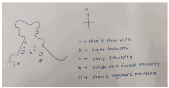

**1. Raw Material Abundance ("Granary of India")**

- Punjab and Haryana produce roughly **19% of India’s wheat** and **70% of its basmati rice,** leading to a concentration of rice mills and flour-based industries.

- **Dairy-** high density of milch animals in Haryana and Punjab supports massive value-added dairy units. Eg- Nestlé in Moga, Punjab.

- **Oilseeds-** Rajasthan contributes about **14% of India’s oilseed output** (especially mustard), driving the localization of edible oil refineries.

2. Strategic Infrastructure and Logistics

- **Connectivity-** major corridors like the **Delhi-Mumbai Industrial Corridor (DMIC)** and the **Western/Eastern Dedicated Freight Corridors (DFCs)** reduce transit times to ports.

- **Storage Ecosystem-** mature cold-chain network and "Plug-and-Play" facilities for small entrepreneurs.. Eg- **Mega Food Parks** in Fazilka in Punjab and Ajmer in Rajasthan

- **Irrigation Reliability-** The extensive canal networks (Indira Gandhi Canal, Bhakra-Nangal system) ensure stable year-round crop cycles.

3. Proximity to High-Value Markets

- **Urban Demand-** Proximity to Delhi-NCR, Chandigarh, and Jaipur creates a massive local market for **Ready-to-Eat (RTE)** and **Ready-to-Cook (RTC)** products.

- **Export Gateways-** air connectivity via Delhi’s IGI Airport and rail links to Gujarat’s ports (Mundra/Kandla) allow for export of high-value items like organic ghee, basmati rice etc.

4. Government Policy and Institutional Support

- **State-Specific Incentives-** Agencies like **RIICO (Rajasthan)** and **PAIC (Punjab)** offer capital subsidies (up to 35-50%), interest subvention for food processing units.

- **ODOP (One District One Product)-** Targeted development of local specialties. Eg- **citrus (Kinnow) in Fazilka** or **mustard in Bharatpur**

5. Socio-Economic and Climatic Factors

- **Entrepreneurial Culture-** high density of progressive farmers and an enterprising diaspora.

- **Favorable Climate-** The relatively cooler winters in the North-West are conducive for the storage and processing of temperate fruits and vegetables

- **Availability of labour** from states like Bihar and UP By bridging the gap between the "farm gate" and the "factory floor," the region has minimized post-harvest losses and maximized value addition.

---

1. Explanation_Drishti IAS:
Source Question: Discuss the factors for localisation of agro-based food processing industries of North-West India.

Agro-based food processing industry, aptly recognised as ‘sunrise industry’, is described as one that adds value to agricultural raw materials. This value addition converts the raw agricultural products into marketable, easy-to-use or edible products like corn flakes, chips, ready to serve drinks, etc.

The Indian food processing industry accounts for 32% of the country’s total food market. It is one of the largest industries in India and is ranked fifth in terms of production, consumption, export and expected growth.

However, the North-West India showcases a better-developed agro-based food processing industry. The factors for this localisation are as follows:

- **Geography:** The region is blessed with a diverse agro-climatic zones, fertile soil and undulating plains. These support a multitude of crops, vegetables and fruits round the year which provide ample raw material.

- **Raw material:** Availability of diverse raw materials viz. cereals, fruits, vegetables and livestock provide attractive base for food processing industry in this region. For instance, Punjab accounts for 17% of rice and 11% of wheat production of India. This region also has the distinction of having the largest population of livestock and largest producer of milk in India.

- **Infrastructure:** Well-connected transportation network, subsidised electricity, irrigation facilities (such as Indira Gandhi canal and Bhakhra Nangal) and ample warehousing and storage facilities contribute to flourishing agro-based industries in the region.

- **Agricultural marketing:** This region has well-developed agri-export zones, market yards, organised APMCs and mandis, etc. which have provided a conducive environment for the establishment of agro-based industries.

- **Socio-economic status:** The population of the region has good literacy rate, including financial literacy, and enjoys an efficient banking network. This helps channel easy availability of credit and capital investment.

- **Policy support:** The Punjab government operates an agricultural mega project policy to facilitate investment in the food processing sector. Additionally, large landholdings, single window clearance, permission to set up private sub e-markets, amendment to APMC Act, etc. have enabled agro-based industries in this region to flourish.

- **Capacity building and R&D:** Capacity building of the manpower in food processing sector in India is spearheaded by the National Institute of Food Technology Entrepreneurship and Management which is located in Sonepat, Haryana. Likewise, a prominent institution for research and development to improve agricultural productivity and business opportunities is the Indian Institute of Maize Research located in Ludhiana, Punjab.

The initiatives taken at the Union level like permitting 100% FDI through the automatic route in food processing sector and Scheme for Mega Food Parks under the Ministry of Food Processing Industries are conducive steps. However, the challenges for the industry remain such as fluctuations in the availability of raw material due to climate change, inadequate implementation of the APMC Act, multiplicity of ministries and laws to regulate food value chain, etc.

---

1. Explanation_Superkalam:
Source Question: Discuss the factors for localisation of agro-based food processing industries of North-West India.

India's North-West region has emerged as a leading hub for agro-based food processing industries, driven by favorable agricultural conditions and supportive infrastructure.

North West India 2019 Thematic Map

## Raw Material Availability

-** High Agricultural Productivity**: Punjab and Haryana contribute over** 50% of India's wheat **and** 40% of rice **to central pool, ensuring abundant raw material supply
-** Crop Diversification**: Production of** basmati rice, wheat, sugarcane, and oilseeds **supports diverse processing industries like rice milling, flour production, and oil extraction
-** Seasonal Surplus**:** Green Revolution **success created marketable surplus, requiring processing to add value and reduce post-harvest losses
-** Quality Standards**: High-quality produce meets international standards, supporting export-oriented processing units
-** Multiple Cropping**:** Intensive agriculture **with 2-3 crops annually ensures year-round raw material supply

## Infrastructure and Connectivity

-** Transportation Network**: Well-developed** Golden Quadrilateral **and** NH-44 **provide excellent connectivity to major markets and ports
-** Cold Chain Facilities**: Established** cold storage infrastructure **with capacity of over** 35 million tonnes **nationally, concentrated in this region
-** Power Supply**: Reliable electricity infrastructure supporting energy-intensive processing operations
-** Mega Food Parks**: Government-established parks in** Fazilka (Punjab) **and** Sampla (Haryana) **provide integrated processing facilities
-** Proximity to Ports**: Strategic location near** Kandla and Mumbai ports **facilitates export of processed products

## Market Access and Demand

-** Dense Population**: High population density in** Delhi NCR **and surrounding areas creates substantial local demand
-** Urban Markets**: Proximity to metropolitan cities like** Delhi, Chandigarh, and Jaipur **ensures ready market access
-** Export Potential**: Established export networks for** basmati rice, wheat products, and processed foods **to Middle East and Europe
-** Industrial Linkages**: Presence of related industries like packaging, machinery, and chemicals supports processing activities
-** Consumer Preferences**: Growing demand for processed and packaged foods in urban areas

## Government Support and Policies

-** Policy Incentives**: Implementation of** PM Kisan Sampada Yojana **providing financial assistance and infrastructure development
-** State Support**: Punjab's** New Industrial Policy 2017 **and Haryana's food processing promotion schemes offer subsidies and land allotment
-** Export Promotion**:** Agricultural Export Policy 2018 **focuses on doubling agricultural exports, benefiting processing industries
-** Skill Development**: Training programs under** Skill India **creating skilled workforce for food processing sector
-** Research Support**:** Punjab Agricultural University **and** CCS Haryana Agricultural University **provide technical expertise and innovation

The convergence of abundant raw materials, robust infrastructure, favorable policies, and strong market demand positions North-West India as the country's premier agro-processing hub, contributing significantly to rural employment and economic growth.

---

1. Explanation_Unacademy:
Source Question: Q7. Discuss the factors for localization of agro-based food processing industries of North West India. (150 words, 10 marks) Tag: Developmental issues..

## **Decoding the Question** - **In Introduction, try to briefly write about the** **agro based food processing industries.** - **In Body,** - **Write various factors for localization of** **agro-based food processing industries** **in North West India.** - **In Conclusion, try to write about the** **importance of agro-based food processing** **industries.** **Answer:** Argo-based food processing industry refers to the **subset of manufacturing that processes raw materials** **and intermediate products derived from the** **agricultural sector.** It transforms products originating from agriculture, forestry and fisheries. **Agriculture is** **the hallmark of the first stage of development along** **with industrialization. It can be taken to be the most** **relevant indicator of a country’s progress along the** **development path.** **Factors for Localization of Agro-based Food** ## **processing Industries in North West India** - **Entrepreneurship;** - Before independence some agro based industries were developed in India which paved the way for today’s large growth in this sector. For example: Haldiram (1937), MDH (1919) etc. Subsidiaries of these companies, associates of these companies formed a cluster.

 - During the 20th century several banks like PNB, Punjab-Sind bank etc., were established near this region. So, farmers of this region **opted for loans to invest in agro based** **startups.** - After the Green Revolution, farmers of Punjab and Haryana invested in creating agro based industries both in small and large scale. For example: In the 1990s during LPG reforms Pepsico company gave contracts to Punjab farmers etc.

- **Raw Material:** Green Revolution enhanced the agriculture production and supplied optimum amount of raw materials to such industries.

 - Operation flood milk cooperatives were formed in North West regions for the first time. This helped in the emergence of various Dairy industries like Amul etc.

- **Cheap Labor:** High population in North west Indiaisthereasonbehindgettingcheaplabor.This helps the industries to function smoothly in both forward and backward linkage spheres.

- **Geography and climate:** The region has fertile soil due to the influence of the Indus river system and the good amount of sunshine and rainfall are suitable for wheat etc.

- **Energy Resources:** Water resource, Thermal resources, Electricity are optimum in this region to support industries.

- **Market:** High population in North west India creates a market for the final product.

- **Export potential:** Punjabi diaspora present abroad creates demand and rich entrepreneurs are encouraged to export. Thus, these industries are flourishing beyond the boundaries.

- **Government** **support:** Food processing ministry **(MOFPI)** has created **Mega food parks** **(Government provides common infrastructure** **for weighing, labeling, packaging, marketing)** in North West India such as -Kapurthala, Ludhiana, Fazilka in Punjab, Sonipat in Haryana, Ajmer in Rajasthan.

- **Cold chain projects** are also encouraging new entrepreneurship. There is a large network of cold storage by the private public sector. The **Agro-based food processing industries** provide vital linkages and **synergies between producer,** **manufacturer and consumers.** It helps in reducing wastage, increase market based & shelf life, better income opportunities to farmers etc., it can **ensure** **both food and nutritional security for people.** Similar enabling conditions like North-west India, can be created in other regions also to **promote growth and** **development.** ---

---

Q27. What is the significance of Industrial Corridors in India? Identify industrial corridors, explain their main characteristics.
[Year: 2018] [Group: UPSC CSE] [Exam: Mains] [Stage: Mains] [Paper: Mains - GS 1]
[Subject: GEOGRAPHY]
[Section Group: Economic & Resource Geography]
[Microtopic: Factors responsible for the location of primary, secondary, and tertiary sector industries in various parts of the world (including India).]
[Subtopic: Secondary sector]
[Macrotag: Descriptive, Applied]
[Microtag: Explain, What is, India]

1. Explanation_Civilsdaily:
Source Question: What is the significance of Industrial Corridors in India? Identifying industrial corridors, explain their main characteristics. [Year: 2018] [Marks: 15]

**Industrial corridors** are **integrated economic regions developed along high-capacity transport networks**

to promote **manufacturing, urbanisation, and investment** through **node-based industrial development and world-class infrastructure.**

**Significance of Industrial Corridors in India**

1. Manufacturing-led Growth - Helps move towards the target of 25% manufacturing share in GDP.

2. Employment Generation - NICDP projects are expected to generate approximately 1 million direct and up to 3 million indirect jobs.

3. Logistics Cost Reduction - Integrated with Dedicated Freight Corridors (DFC) → faster freight movement.

4. Balanced Regional Development - Growth of backward regions Eg- Amritsar-Kolkata Industrial Corridor (AKIC) covering eastern states.

5. Urbanisation - Planned greenfield smart cities with modern infrastructure. Eg- Dholera Special Investment Region (Gujarat).

6. Improved logistics competitiveness and ease of doing business attract FDI. Eg- Plug-and-play infrastructure

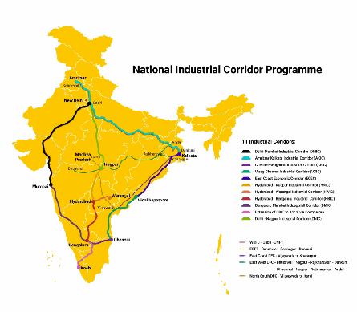

7. Export Promotion - Port-linked corridors enable export-oriented industries. Eg- Visakhapatnam-Chennai Industrial Corridor (VCIC).

8. Ancillary industrial growth and MSME Cluster Development. Eg- Eg- Auto and electronics clusters along Chennai Bangalore Industrial Corridor.

9. Multi-modal connectivity - Power, roads, rail, logistics parks developed together. Eg- PM Gati Shakti integration.

10. **High-tech manufacturing zones** - Eg- Semiconductor cluster in Dholera **Major Industrial Corridors in India**

1. **Delhi-Mumbai Industrial Corridor (DMIC)**

2. **Chennai-Bengaluru Industrial Corridor (CBIC)**

3. **Bengaluru-Mumbai Industrial Corridor (BMIC)**

4. **Amritsar-Kolkata Industrial Corridor (AKIC)**

5. **Visakhapatnam-Chennai Industrial Corridor (VCIC)**

6. **Hyderabad-Bengaluru Industrial Corridor (HBIC)**

7. **Odisha Economic Corridor (OEC)**

**8. Delhi-Nagpur Industrial Corridor (DNIC) Main Characteristics of Industrial Corridors**

1. **Multi-modal Connectivity-** Seamless integration of High-speed Rail, 6-8 lane Expressways, and Deep-water Ports. Eg- **Dighi Port** in DMIC.

2. **Plug-and-Play Infrastructure-** Allotment of land with pre-cleared environmental permits and ready-to-use water, power, and gas connections.

3. **Greenfield Smart Cities-** Entirely new urban centers built from scratch with ICT-enabled utilities. Eg**Dholera SIR.**

4. **Walk-to-Work Culture-** Residential zones are located within walking or cycling distance of industrial units to minimize commuting and pollution.

5. **ICT Integration-** Using "Unified Logistics Interface Platform" (ULIP) and **PM Gati Shakti** for real-time tracking of cargo and efficient project management.

6. **Sector-Specific Clusters** foster economies of scale. Eg- **Pharma cluster in Zaheerabad** or **Agro-processing in Gaya**

7. **Sustainability-** Adoption of green building standards, water recycling, and massive renewable energy parks

8. **Single-Window Clearance-** Streamlined regulatory processes through a digital interface

9. PPP Model - Private sector participation in infrastructure and industry.

10. Global Collaboration - Technology and finance support from international partners. Eg- Japan in DMIC, ADB in VCIC.

11. Sustainable and Green Development - Eg- Use of renewable energy, zero liquid discharge systems.

Industrial corridors are the pillars of **Viksit Bharat @2047** and key to transition to a **globally competitive manufacturing economy.**

---

1. Explanation_Drishti IAS:
Source Question: What is the significance of Industrial Corridors in India? Identifying industrial corridors, explain their main characteristics. (2018)

Industrial Corridors (ICs) are stretches across the country allocated to a specific geographical area with the intent to stimulate industrial development. It aims to create an area with a cluster of manufacturing or other industries and gives an impetus to smart and sustainable cities by leveraging on the high speed, high connectivity transportation system.

**The Significance of Industrial Corridors in India**

- Setting up of industrial townships, educational institutions, roads, railways, airports, hospitals along industrial corridors would generate employment and raise standard of living.

- Production costs would come down due to improved transportation system and agglomeration effect, making Indian goods competitive in domestic as well as foreign markets.

- Provide necessary logistics infrastructure needed to reap economies of scale, thus enabling firms to focus on their areas of core competence.

- People would find job opportunities close to their homes which would curb migration towards cities, thus preventing stress on already burdened urban landscape.

- Prevention of concentration of industries in one particular location would prevent exploitation of environment as well as ensure balanced development in the country.

**Various Industrial Corridors of India**

- Delhi – Mumbai Industrial Corridor

- Bengaluru – Mumbai Economic Corridor

- Chennai – Bengaluru Industrial Corridor

- Vizag - Chennai Industrial Corridor

- Amritsar – Kolkata Industrial Corridor

**The Main Characteristics of Industrial Corridors**

- Constructed in areas that have pre-existing infrastructure, such as ports, highways and railroads.

- Each IC would have 6-8 key nodes developed on Smart City principles.

- Dedicated construction of residential areas, public utilities, production units, schools, and hospitals.

- Freight cargo would be brought to the industrial corridor via rail and road feeder links that shall provide last mile connectivity.

- The challenges while creating ICs would include correctly assessing the demand and viability, transport options for goods and workers, land values, and economic incentives for companies. The economic and financial feasibility of ICs should be ensured by attracting potential investors to set up manufacturing units at National Investment and Manufacturing Zones (NMIZs). India will also have to rely on foreign players for innovative technologies. The fundamental focus of ICs should be on improving both Industrial and Urban Infrastructure.

---

1. Explanation_PWOnlyIAS:
Source Question: What is the significance of Industrial Corridors in India? Identifying Industrial Corridors, explain their main characteristics.

**Answer:**

| **Approach:** **Introduction**  • Write the importance of Industrial corridors. **Body**  • Discuss the Significance and Characteristics of Industrial Corridors. **Conclusion**  • Conclude your answer with a futuristic approach. |
| --- |

### Introduction

**Industrial corridors are critical to** India’s economic development **as they offer a platform for industrial growth by providing state-of-the-art infrastructure and logistics facilities. They can stimulate economic growth, attract investment, create employment, and improve the overall standard of living. The identification of specific corridors for development is a step towards increasing industrial competitiveness and creating employment opportunities.** Body: ****

**Significance of Industrial Corridors in India:**
- **Promote industrialization:** Industrial corridors provide an opportunity for the government to develop new industrial clusters, which will promote industrialization and economic growth.
- **Infrastructure development:** These corridors also focus on the development of modern infrastructure facilities, such as power, water supply, and transportation, which are essential for the growth of industries.

- **Job creation:** The development of industrial corridors will lead to the creation of new jobs, both directly and indirectly, thereby reducing unemployment in the country.
- **Foreign investment:** The development of industrial corridors will also attract foreign investment, which will help in the transfer of technology and knowledge, leading to the growth of industries.
- **Regional development:** The development of these corridors will also promote the overall development of the region, leading to improved living standards for the people.

**Characteristics of some of the industrial corridors in India:**
- **Delhi-Mumbai Industrial Corridor (DMIC):** Covers an overall length of 1483 km between Delhi and Mumbai
 - Aims to create futuristic industrial cities by leveraging the high-speed, high-capacity connectivity provided by the Western Dedicated Freight Corridor.
 - The project is being funded by the Government of India, Japanese loans, investments by Japanese firms, and through Japan depository receipts issued by Indian companies.
 - The estimated cost of the project is USD 100 billion

- **Chennai-Bengaluru Industrial Corridor (CBIC):** Covers Tamil Nadu, Andhra Pradesh, and Karnataka.
 - Aims to create a high-tech industrial zone in southern India
 - Being funded by the Japan International Cooperation Agency (JICA)

- **Bengaluru-Mumbai Economic Corridor (BMEC):** Covers Maharashtra and Karnataka
 - Aims to create a knowledge-based economy by promoting research and innovation in these states
 - Being developed with the help of Britain (UK)

- **Amritsar-Kolkata Industrial Corridor (AKIC):** Covers Punjab, Haryana, Uttarakhand, Uttar Pradesh, Bihar, Jharkhand, and West Bengal.
 - Aims to provide a boost to industrial development in the eastern part of India
 - The Eastern Dedicated Freight Corridor is the backbone of this economic corridor

- **East Coast Economic Corridor (ECEC):** Covers West Bengal, Odisha, Andhra Pradesh, and Tamil Nadu
 - Aims to enhance industrial competitiveness by focusing on development of ports, logistics, and energy infrastructure along the east coast of India

- **North East Myanmar Industrial Corridor:** The North East Myanmar Industrial Corridor is a project that has been launched as part of the Tokyo Declaration for the India-Japan Special Strategic and Global Partnership.
- This initiative aims to boost connectivity and development in the Northeast region, ultimately driving economic growth and increasing prosperity in the area.

### Conclusion

The development of industrial corridors in India is crucial for the country’s sustained economic growth and overall development. They have the potential to transform the economy by creating new industries, promoting exports, and increasing employment opportunities. The government’s focus on building industrial corridors is a positive step towards achieving these goals.

---

1. Explanation_Superkalam:
Source Question: What is the significance of Industrial Corridors in India? Identifying industrial corridors, and explaining their main characteristics.

Industrial Corridors represent integrated industrial development zones connecting major cities and ports, designed to accelerate India's manufacturing growth and economic transformation under the** National Industrial Corridor Development Programme (NICDP)**.

India Industrial Corridors Outline Map

## Significance of Industrial Corridors in India

### Economic Growth and Manufacturing Hub

-** Boost Manufacturing GDP**: Aims to increase manufacturing sector's contribution from** 17-18% to 25% by 2025 **-** Investment Magnet**: DMIC alone has attracted investments worth** $20.6 billion **in Phase 1
-** Export Enhancement**: Strategic location near ports facilitates global trade connectivity
-** Economic Integration**: Links industrial production with consumption centers efficiently
-** GDP Contribution**: Expected to contribute significantly to India's** $5 trillion economy **vision

### Employment Generation and Skill Development

-** Direct Employment**: Phase 1 created jobs for over** 100,000 people **-** Multiplier Effect**: Each direct job creates 2-3 indirect employment opportunities
-** Skill Upgradation**: Promotes technical training and modern manufacturing skills
-** Rural-Urban Linkage**: Provides employment opportunities reducing rural-urban migration pressure
-** Women Participation**: Special focus on women's participation in manufacturing sector

|** Industrial Corridor **|** States Covered **|** Length (km) **|** Key Focus **|
| --- | --- | --- | --- |
|** Delhi-Mumbai (DMIC) **| Rajasthan, Haryana, UP, MP, Gujarat, Maharashtra | 1,483 | Flagship project, 12 smart cities |
|** Amritsar-Kolkata (AKIC) **| Punjab, Haryana, UP, Bihar, Jharkhand, WB | 1,839 | Eastern connectivity |
|** Bengaluru-Mumbai (BMIC) **| Karnataka, Maharashtra | 966 | IT-Manufacturing link |
|** Chennai-Bengaluru (CBIC) **| Tamil Nadu, Karnataka | 360 | Auto-Tech corridor |
|** Vizag-Chennai (VCIC) **| Andhra Pradesh, Tamil Nadu | 800 | Coastal industrial belt |

## Key Characteristics of Industrial Corridors

### Infrastructure Integration

-** Multi-modal Connectivity**: High-speed rail, expressways, and dedicated freight corridors
-** Smart Cities Development**:** 12 industrial nodes **with world-class infrastructure under DMIC
-** Logistics Excellence**: Integration with** PM Gati Shakti **for seamless connectivity
-** Digital Infrastructure**: 5G networks, digital governance, and smart utilities
-** Environmental Sustainability**: Green building norms and renewable energy integration

### Investment and Policy Framework

-** PPP Model**: Public-Private Partnership for efficient project implementation
-** SEZ Integration**: Special Economic Zones and National Investment Manufacturing Zones (NIMZs)
-** Single Window Clearance**: Simplified approval processes for industries
-** Land Bank Creation**: Pre-developed industrial land with ready infrastructure
-** International Cooperation**: Technical assistance from countries like** Japan (DMIC) **and** UK (CBIC) **Industrial corridors are transforming India into a global manufacturing hub through** Make in India **and** Atmanirbhar Bharat **initiatives, creating integrated ecosystems that combine industrial production, urban development, and sustainable growth.

---

1. Explanation_Unacademy:
Source Question: Q16. What is the significance of Industrial Corridors inIndia?Identifyingindustrialcorridors,explain their main characteristics. (15 marks, 250 words) Tag: Factors responsible for the location of primary, secondary, and tertiary sector industries in various parts of the world.

## **Decoding the Question** - **In Introduction, try to begin with the** **definition of Industrial Corridor and the** **vision and mission associated with it.** - **In Body,** - **Elaborate on the significance of** **Industrial Corridors.** - **In the characteristics part, write a few** **unique points about the five industrial** **corridors like the involvement of foreign** **organizations, etc.** - **In Conclusion, Conclude with the unified** **framework on Industrial Corridor.** Industrial Corridors are stretched across the country allocated to a **specific geographical area with the** **intent to stimulate industrial development.** They are envisioned to create a robust economic base with a **globally competitive environment** and state-ofthe-art infrastructure to activate local commerce, enhance foreign investments and attain sustainable development. For India’s development journey, **Industrial Corridor development can leverage the** **potential** of various levers of the economy and provide for environmentally sustainable and socially equitable growth.

## **Significance of Industrial Corridors in India** - Industrial corridor attracts **investments and** **creates jobs in the manufacturing sector.** It also,

 - Increases the contribution of the manufacturing sector to GDP.

 - Promotes equitable industrialization and urbanization.

 - Increases labour productivity and income levels.

- **Infrastructure development:** The **transportation** **componentintheIndustrialCorridorservesasthe** spine, robust grid networks need to be developed, connecting the clusters to the hinterlands and gateways.

 - For example, the Odisha government is developing the Biju-expressway corridor connecting its most backward districts along itswesternborder,someofwhichareNaxalhit regions.

- **Corridor centric skill-development roadmap:** Skill availability is a key determinant of private sector investment decisions. The Industrial Corridors have a skill agenda, tailored specifically to meet the skill requirements of the corridors with short-term, medium-term, and long-term plans. This gives a boost to **‘Skill India Initiative’** **and employment generation.** ## **Main characteristics of Industrial Corridors** ## **Answer** 

- **Delhi-Mumbai Industrial Corridor (DMIC)** **covers a length of 1483 km.** - It covers the state of Uttar Pradesh, Haryana, Rajasthan, Madhya Pradesh, Gujarat and Maharashtra.

 - The US $100 bn project is being funded by the Government of India, Japanese loans, investments by Japanese firms and through Japan depository receipts issued by Indian companies.

 - The DMIC project aims to create futuristic IndustrialCitiesbyleveragingthe“HighSpeed – High Capacity” connectivity backbone provided by the Western Dedicated Freight Corridor (DFC).

- **Chennai-Bengaluru Industrial Corridor (CBIC)** **covers Tamil Nadu, Andhra Pradesh, and** **Karnataka.** - It is being funded by the Japan International Cooperation Agency (JICA).

- **Bengaluru-Mumbai Economic Corridor** (BMEC) covers Maharashtra and Karnataka. It is being developed with the help of Britain (UK).

- **Amritsar-Kolkata Industrial Corridor (AKIC)** covers Punjab, Haryana, Uttarakhand, Uttar Pradesh, Bihar, Jharkhand, and West Bengal.

 - The Project extends from Amritsar (Punjab) to Dankuni (West Bengal) for a length of 1839 kms.

 - **TheEasternDedicatedFreightCorridoristhe** backbone of this economic corridor.

- **East Coast Economic Corridor (ECEC)** covers West Bengal, Odisha, Andhra Pradesh, and Tamil Nadu. Vizag to Chennai segment of this Corridor has been taken as phase 1.

 - Vizag-Chennai Industrial Corridor (VCIC) is the first coastal economic corridor in the country.

 - **It also plays a critical role in the “Act East** **Policy” of India.** The power of an industrial corridor lies in its ability to mobilize many moving parts of the economy and institutionalize many factors required for equitable and sustained economic growth. Therefore, India needs a **National Industrial Corridor Development** **Framework** that builds on the good work in the recent past and provides a twenty-five-year vision, strategy, and implementation roadmap where the National Government and all the State Governments come together to realize a unified national vision of making India a global manufacturing hub.

---

---

Q28. Petroleum refineries are not necessarily located nearer to crude oil producing areas, particularly in many of the developing countries. Explain its implications.
[Year: 2017] [Group: UPSC CSE] [Exam: Mains] [Stage: Mains] [Paper: Mains - GS 1]
[Subject: GEOGRAPHY]
[Section Group: Economic & Resource Geography]
[Microtopic: Factors responsible for the location of primary, secondary, and tertiary sector industries in various parts of the world (including India).]
[Subtopic: Secondary sector]
[Macrotag: Descriptive]
[Microtag: Explain]

1. Explanation_Drishti IAS:
Source Question: Petroleum refineries are not necessarily located nearer to crude oil producing areas, particularly in many of the developing countries. Explain its implications. (2017)

Oil refineries usually in developing countries are built away from the oil producing areas, the implications of which are both negative and positive, vis –a- vis environmental and economic costs:

**Positive implications:**

- Rrefineries tend to be situated closer to markets or distribution centres as it helps in saving transport costs of refined products because transport costs of refined products tends to be higher than transporting crude, as refined products lose weight through evaporation during transporting.

- Since pipeline transfer of refined products in India is still only with private companies, it is not evenly distributed, making transportation through this method difficult. When refineries are far away from the market, other modes of transport for refined products like railways, road or waterways, always increases the economical as well as the environmental costs (eg. air pollution).

- Since oil producing areas have a limited oil producing capacity the investments in setting up a refinery in its vicinity can go to waste once oil in the area dries up. Hence, it becomes economical to set up refineries near markets where a continuous consumer demand keeps it viable for longer durations of time.

- Refineries also need abundant sources of water for cooling purpose and for discharge of wastes, and hence environmental concerns make refineries viable only where there are sufficient water resources available.

- Promote decentralized industrial growth and balanced regional development.

- Seaboard location eases the export of petrochemical products.

**Negative implications:**

- Having crude transported to large distances add to environmental pollution and economic costs.

- Also, it does not incentivise further exploration and setting up of oil producing areas as it doesn't attract other industrial investments.

---

1. Explanation_PWOnlyIAS:
Source Question: Petroleum refineries are not necessarily located nearer to crude oil producing areas, particularly in many of the developing countries. Explain its implications.

**Answer:**

| **Approach:** **Introduction**  • Write briefly about Petroleum. **Body**  • Discuss the advantages and disadvantages of Petroleum Industries. **Conclusion**  • Summary of the answer with futuristic approach. |
| --- |

### Introduction

**Petroleum, a natural resource found underground, is extracted from wells and then refined into various types of fuels using fractional distillation to separate its components. Oil refineries are often situated far from crude oil-producing areas, particularly in developing countries.** Body: ****

**Benefit of Refineries near oil resources**
Refineries located close to crude oil sources can reduce transportation costs and ensure a steady supply of crude oil, lowering the cost of final products and increasing profitability.
- Refineries need access to transportation infrastructure like pipelines, railways, and highways to transport their products to customers. Being located near such infrastructure can reduce transportation costs and increase efficiency.
- Refineries require skilled labor to operate and maintain their equipment. Being located in an area with a skilled workforce can save on labor costs and increase efficiency.
- Refineries located in areas with favorable regulatory environments can benefit from lower regulatory costs and fewer restrictions on their operations, resulting in increased profitability and a competitive advantage over other refineries.
- Refineries require a range of support services such as engineering, maintenance, and repair services. Being located in an area with a strong support services industry can save on costs and increase efficiency.
- Refineries can bring significant economic benefits to the communities in which they are located. They create jobs, increase tax revenue, stimulate local businesses, and provide new opportunities for investment and growth.

**Drawback of Refineries away from the oil resource:**
- **Increased transportation costs:** Refineries located far from crude oil sources require transportation of crude oil over long distances, resulting in higher transportation costs, which may ultimately increase the cost of petroleum products.
- **Dependence on imports:** Countries with refineries located far from their oil sources become increasingly dependent on imports, making them vulnerable to supply disruptions and price volatility in the global oil market.
- **Environmental impact:** Long-distance transportation of crude oil also poses environmental risks, such as oil spills during transportation, which can have catastrophic consequences for ecosystems and human populations.
- **Lack of local benefits:** Refining operations located far from crude oil producing areas may not provide significant benefits to the local economy or employment opportunities.
- **Energy security concerns:** Relying on imports for petroleum products raises energy security concerns for countries that lack adequate domestic refining capacity, making them more vulnerable to geopolitical tensions and economic disruptions.

### Conclusion

The location of petroleum refineries in developing countries away from crude oil producing areas can have various implications, including higher transportation costs, increased dependence on foreign oil, and potential environmental risks associated with transporting crude oil over long distances. Policymakers need to carefully consider these implications when planning energy infrastructure to ensure sustainable and secure energy supply chains.

---

1. Explanation_Superkalam:
Source Question: Petroleum refineries are not necessarily located nearer to crude oil producing areas, particularly in many of the developing countries. Explain its implications.

Petroleum refineries in developing countries are strategically positioned away from crude oil sources due to economic and logistical considerations, creating significant implications for national development.

Petroleum Refinery Locations Spatial Model Diagram

## Economic Implications

-** Transportation Cost Burden**: Moving crude oil over long distances increases operational expenses significantly.** India's crude transport costs increased by 12-15% in 2023-24 **due to global shipping disruptions.
-** Import Dependency Challenges**: Developing nations face massive foreign exchange outflows, with** India's crude oil import bill reaching $132.4 billion **in FY 2023-24.
-** Market Access Advantages**: Coastal refineries near consumption centers enable efficient distribution and export opportunities.** Reliance Jamnagar **refinery leverages this advantage as the world's largest refining complex.
-** Value Addition Benefits**: Processing crude oil domestically creates higher-value petroleum products, generating employment and industrial linkages.
-** Revenue Generation**: Refined product exports contribute to foreign exchange earnings and reduce trade deficits.

## Strategic and Security Implications

-** Energy Security Enhancement**: Dispersed refinery locations reduce vulnerability to geopolitical tensions and supply chain disruptions.
-** Port Infrastructure Development**: Coastal refineries like** BPCL Kochi **and** HPCL Vishakhapatnam **facilitate easier crude imports and refined product exports.
-** Industrial Corridor Creation**: Refineries act as anchor industries, attracting petrochemical complexes and downstream manufacturing units.
-** Strategic Petroleum Reserves**: Proximity to consumption centers enables efficient management of emergency fuel stocks.

## Regional Development Impact

-** Employment Generation**: Refineries create direct and indirect employment opportunities in regions often lacking industrial development.
-** Infrastructure Development**: Associated development of roads, railways, ports, and utilities benefits entire regions.
-** Skill Development**: Technical training and capacity building enhance local human resources.
-** Urban Growth**: Refinery townships and industrial areas stimulate regional urbanization and economic activity.

## Environmental and Social Considerations

-** Pollution Management**: Modern refineries incorporate** BS-VI emission standards **and advanced pollution control technologies.
-** Environmental Impact Assessment**: Strategic location planning considers ecological sensitivity and community concerns.

This decentralized approach, while increasing transportation costs, enables developing countries to maximize economic benefits, ensure energy security, and promote balanced regional development through initiatives like** India's National Solar Mission **complementing traditional energy infrastructure.

---

1. Explanation_Unacademy:
Source Question: Q15. Petroleum refineries are not necessarily located nearer to crude oil producing areas, particularly in many of the developing countries. Explain its implications. (15 marks, 250 words) Tag: Geography.

## **Decoding the Question** - **In Introduction, try to briefly write about the** **origin of petroleum refineries and reasons** **for its far location.** - **In Body,** - **Write both positive and negative** **implications of location of refineries.** - **In Conclusion, try to write a balanced view.** **Answer:** Petroleum is a dark oily liquid with an unpleasant odour. It is a mixture of various constituents such as petroleum gas, petrol, diesel, lubricating oil, paraffin wax, etc. Oil extracted from the wells is crude oil and contains many impurities and cannot be used directly. Itneedstoberefined.Digboi,Baraunietc.areexamples of oil refineries which are largely market based, in stable and conflict free regions. With the development of infrastructure like oil pipelines and transport, the location of refineries are not dependent on oil fields.

## **Positive Implications of Refineries** - Anoilrefineryisanindustrialplantthattransforms, or refines crude oil into various usable petroleum products. It **generates employment and promotes** **holistic development** of the concern area. Trickledown effect promotes growth of alliance sectors.

- These refineries are located near ports that can promote export thus generating foreign exchange. In this way it helps in managing the current account deficit. Example- Reliance complex in Jamnagar or Abadan port complex in Iran

- Oil fields can be exhausted in the future, but the market can last for a longer period. Thus, establishing refinery near to consuming market helps in **optimal utilization of capital-intensive** **infrastructure.** Because it can draw crude oil from multiple fields from multiple countries.

- It also insulates developing country from abrupt supply disruption arising from socio-political issues or UN sanctions in the exporter country e.g., Libya or Syria.

- Attimesthecrude-oilrichcountrieshaveproblems like **political instability, lack of skilled manpower** **and technology** to refine the oil and utilize its byproducts in the most-optimal manner. These are also prime reasons behind the price volatility.

- The refineries need water resources for cooling purpose and for discharge of wastes thus these are located based on it.

- Transport and infrastructure development like oil pipelines reduced the cost of transportation thus otherfactorsplayanimportantroleindetermining location of refineries.

## **Negative Implications of Refineries** - Geographical positions **create political tensions.** Example- Sudan civil war.

- Cooperative federalism: When the Government decides to set up a refinery away from oil-fields, especially in a different state, then it creates a challenge **to cooperative federalism and provides** **propaganda pointsforthesecessionists,** asseenin Noonmati-Barauni refinery issue during 50s and 60s.

## **y Environmental issues** - Oil spillage- Oil spill, leakage of petroleum onto the surface of a large body of water. Oil spills may impact the environment.

 - Physical smothering of organisms, which affectanorganism’sphysicalabilitytocontinue critical functions such as respiration, feeding and thermoregulation.

 - Chemical toxicity: it absorbed into organs, tissues and cells of animals and can have sublethal or lethal toxic effects.

 - Ecological changes: This is caused by the loss of key organisms with a specific function in an ecological community. Indirect effects: Loss of shelter or habitat through oiling or clean-up operations.

 - **Noonmati refinery is** located near Brahmaputra to draw its water for its refining processes and for its township. But, **the silting** **in Brahmaputra creates water-crisis** on a routine basis, which 1) forces this refinery to partially shut down its operations, and 2) begin dredging & de-silting operations. Thus, it generates less than optimal profits.

 - Barauni Refinery was ordered to temporarily shut down by the government (2018) because of grave contamination of Ganga River.

 - Air pollution- Refineries emit harmful gases and are affluent. Thus, affecting the air standards. For example: Mathura refinery is a threat to both Taj Mahal and its surrounding human habitats. About 63 per cent of India’s petroleum production is from Mumbai High, 18 per cent from Gujarat and 16 per cent from Assam. For a developing country, a refinery located near a market has both positive and negative implications. On one hand it helps in jobscreation, economic growth and foreign exchange earning whereas on the other hand it can pose challenges to national integrity, environment and safety of the citizens.

---

---

Q29. Account for the change in the spatial pattern of the Iron and Steel industry in the world.
[Year: 2014] [Group: UPSC CSE] [Exam: Mains] [Stage: Mains] [Paper: Mains - GS 1]
[Subject: GEOGRAPHY]
[Section Group: Economic & Resource Geography]
[Microtopic: Factors responsible for the location of primary, secondary, and tertiary sector industries in various parts of the world (including India).]
[Subtopic: Secondary sector]
[Macrotag: Descriptive]
[Microtag: Account for]

1. Explanation_PWOnlyIAS:
Source Question: Account for the change in the spatial pattern of the Iron and Steel industry in the world.

**Answer:**

| **Approach:** **Introduction**  • Start your answer with Importance of the iron and steel industry. **Body**  • Explore some of the factors that contributed to some changes. **Conclusion**  • Summary of the answer with futuristic approach. |
| --- |

### Introduction

**The iron and steel industry has been one of the most important and strategic industries in the world since the Industrial Revolution. The spatial pattern of the industry has changed significantly over time.** Body: ****

**Reasons of change in spatial pattern in Iron industry:**
- **Technological Innovations:** Significant factors driving the change in the spatial pattern of the iron and steel industry has been technological innovation. The development of new technologies and production processes, it has become possible to locate iron and steel plants closer to raw material sources, reducing transportation costs and improving efficiency.
- **Globalization:** The process of globalization has a significant impact on the iron and steel industry’s spatial pattern. The industry has become increasingly integrated globally, with companies locating production facilities in countries with lower labor costs and fewer environmental regulations.
- **Shifts in Resource Availability:** Changes in resource availability have also contributed to the change in the iron and steel industry’s spatial pattern.
  - **Example:** the decline in iron ore reserves in some regions has led to companies locating production facilities in other regions with more abundant resources.
- **Government Policies:** Government policies have also played a significant role in shaping the spatial pattern of the iron and steel industry.
  - **Example:** governments may offer **subsidies or tax breaks** to attract iron and steel producers to their regions, or impose **environmental regulations** that make certain regions less attractive for production.

### Conclusion

The spatial pattern of the iron and steel industry in the world has changed due to various factors such as shifting demand patterns, availability of raw materials, and advancements in technology. The industry continues to evolve, and further changes are likely in the future.

---

1. Explanation_Superkalam:
Source Question: Account for the change in the spatial pattern of the Iron and Steel industry in the world.

The Indonesian and Philippines archipelagos, containing over 17,000 and 7,640 islands respectively, formed through complex geological processes driven by intense tectonic activity in the Pacific Ring of Fire.

Ocean Plate Subduction Convergence Cross Section

## Tectonic Plate Convergence and Formation

-** Multiple Plate Interactions**: The region lies at the convergence of four major tectonic plates - Pacific Plate, Philippine Sea Plate, Eurasian Plate, and Indo-Australian Plate
-** Subduction Zones**: Ocean plates subduct beneath continental plates, creating deep trenches like the** Philippine Trench **(10,540m deep) and** Java Trench **-** Island Arc Formation**: Subduction processes generate magma that rises to form volcanic island arcs through continuous eruptions
-** Crustal Uplift**: Tectonic compression uplifts seafloor sediments and oceanic crust, creating non-volcanic islands
-** Transform Boundaries**: Lateral plate movements create fault systems that fragment existing landmasses into smaller islands

## Volcanic Activity and Island Building

-** Active Volcanism**: Indonesia hosts** 130 active volcanoes **while Philippines has** 53 active volcanoes **as of 2024
-** Volcanic Island Formation**: Submarine volcanic eruptions accumulate materials that eventually emerge above sea level
-** Shield Volcano Development**: Continuous lava flows build broad, shield-shaped islands over hotspots
-** Stratovolcano Chains**: Explosive eruptions create steep-sided volcanic islands in linear arrangements
-** Recent Examples**: Mount Ruang eruption (2024) in Indonesia and Mayon Volcano activity (2023) in Philippines continue island modification

## Additional Geological Processes

| Process | Mechanism | Examples |
| --- | --- | --- |
|** Coral Reef Growth **| Accumulation of coral limestone forming atolls and barrier islands | Thousand Islands (Indonesia), Palawan reefs |
|** Sea Level Changes **| Glacial-interglacial cycles exposing/submerging landmasses | Sunda Shelf exposure during ice ages |
|** Erosion and Weathering **| Wave action and tropical weathering fragmenting larger landmasses | Fragmentation of Sundaland |

The ongoing tectonic activity ensures continuous island formation, with recent seismic events like the** 2024 Mindanao earthquake **(magnitude 7.6) demonstrating the dynamic geological processes still shaping these archipelagos through volcanic eruptions, crustal movements, and marine processes.

---

1. Explanation_Unacademy:
Source Question: Q23. Account for the change in the spatial pattern of the Iron and Steel industry in the world. (10 marks, 150 words) Tag: Factors responsible for the location of primary, secondary, and tertiary sector industries in various parts of the world (including India).

## **Decoding the Question** - **In Introduction, try to write a brief timeline** **in spatial pattern of the iron and steel** **industry.** - **In Body, elaborate the change in the** **spatial pattern attributing to factors like** **modernization, change in transportation,** **etc.** - **In Conclusion, mention the use of robots,** **drones and IoT in Iron and Steel industry** **and also certain challenges with solutions.** **Answer:** The development of the iron and steel industry opened the doors for accelerated industrial growth in the world.Beforethe19thcentury,thespatialpatternofthe iron and steel industry was located near the availability of raw materials, power supply, and running water was readily available. Later the ideal location for the industry was near coal fields and close to canals and railways. After 1950, the iron and steel industry began to be located on large areas of flat land near seaports. **The change in the spatial pattern of the Iron and Steel** ## **industry in the world** - : The Indian iron **Setting up Integrated Plants** and steel industry for example consist of large integrated steel plants, mini steel mills, secondary producers, rolling mills and ancillary industries. Because of the integration of many sectors, Integrated steel and Iron Plants are favored more.

 - For Example: The Tata Iron and Steel plant lies very close to the Mumbai-Kolkata railway line and also near to Kolkata that is the nearest port to export steel materials.  The rivers Subarnarekha and Kharkai provide water to the plant. The iron ore for the plant is obtained from Noamundi and Badam Pahar and coal is brought from Joda mines in Odisha.

- **Transportation:** Sites located at port areas may havebeendisadvantageousinearliertimesbecause of their distance from the coalfields. However, **the** **locational disadvantage** has been nullified with **the access to water transport,** one of the relatively cheaper means of transport, being put to good use.

 - For example, Japan’s steel capacity is concentrated near the major port cities of Himeji, Kobe-Osaka and Tokyo-Yokohama areas of South-Central Honshu.

- **Environmental Norms:** Another significant change that disables the establishment of Iron and Steel Industries in certain areas have been brought about by stringent Environmental norms. It is now difficult to obtain requisite environmental clearances. This negates the role of locational advantages.

- **Raw Materials:** earlier, Industries were located near Raw material availability. But now many countriesimporttheirrawmaterials.ForExample, Japan, Korea India largely fulfils its coking coal requirements through imports from Australia.

 - In fact, **India’s The National Steel Policy,** **2017,** envisages that 65% of India’s coking coal requirements will be met through imports by 2030–31.

- **Massive demands from other Industries.** The other sector of industries is more dependent on steel and Iron Industry, so Iron and steel industries are set up near them.

 - For example, The Indian automotive industry **contributes to around 9% of steel demand in** **India.** - Capital goods: The **sector contributes about** **15% of steel demand.** **Steel and iron industries are asset intensive.** The iron and steel industry is going through an exciting transformation with the evolution of various emerging technologies such as **robots, drones and IoT that** **provide business with valuable solutions.** Though the steel industry in India and the rest of the world is grappling with certain challenges. A push from the

 governmentandtheadoptionofemergingtechnologies will enable us to achieve the goals sustainably.

---

---

Q30. Analyze the factors for highly decentralized cotton textile industry in India
[Year: 2013] [Group: UPSC CSE] [Exam: Mains] [Stage: Mains] [Paper: Mains - GS 1]
[Subject: GEOGRAPHY]
[Section Group: Economic & Resource Geography]
[Microtopic: Factors responsible for the location of primary, secondary, and tertiary sector industries in various parts of the world (including India).]
[Subtopic: Secondary sector]
[Macrotag: Analytical, Applied]
[Microtag: Analyze, India]

1. Explanation_PWOnlyIAS:
Source Question: Analyze the factor for highly decentralized cotton textile industry in India.

| **Approach:** **Introduction**  • Start your answer with data or Report. **Body**  • Discuss Some of the key factors that have contributed to this decentralized nature of the industry are discussed below. **Conclusion**  • Summary of the answer with futuristic approach. |
| --- |

### Introduction

**In 202, India stood as the third highest exporter of raw cotton globally, accounting for about 10.2% of the global exports. India’s total cotton exports are estimated to be 4 million bales in 2021-22 [COCPC Report]. India has a highly decentralized cotton textile industry with a large number of small-scale units spread across the country.** Body: ****

**Some of the key factors that have contributed to this decentralized nature of the industry are discussed below:**
- **Historical Legacy:** The cotton textile industry in India has a long history, dating back to ancient times. The industry has traditionally been decentralized, with handloom weaving being practiced in homes and small workshops in different parts of the country. E.g

**The handloom weaving industry in Varanasi.**
- **Availability of Raw Materials:** India has a large and diverse cotton-growing region, which provides easy access to raw materials for textile production. This has allowed small-scale textile units to thrive in different parts of the country. E.g

**Cotton growing regions in India like Gujarat, Maharashtra, and Punjab provide easy access to raw materials for textile production**
- **Cheap Labor:** The availability of cheap labor is another significant factor for the decentralized nature of the cotton textile industry. Labor-intensive operations like spinning, weaving, and dyeing can be done with relatively low levels of capital investment, making it possible for small-scale units to operate profitably. E.g

**The city of Tirupur in Tamil Nadu is known for its knitwear industry and employs a large number of workers.**
- **Government Policies:** The Indian government has implemented policies to promote small-scale industries, including the cotton textile industry. This has led to the establishment of a large number of small-scale units across the country. E.g

**Technology Upgradation Fund Scheme (TUFS) provides subsidies and financial assistance for technology upgrades and modernization of textile units.**
- **Market Dynamics:** The Indian textile market is highly fragmented, with a large number of small players catering to different segments of the market. This has created opportunities for small-scale units to thrive in niche segments of the market. E.g **The city of Surat in Gujarat is known for its synthetic textile industry, while the city of Bhilwara in Rajasthan is known for its production of handloom textiles.**

### Conclusion

The decentralization of the cotton textile industry in India is influenced by factors such as the availability of raw materials, the low capital investment required, and the prevalence of traditional textile practices. Presents challenges such as lack of economies of scale and inadequate infrastructure.

---

1. Explanation_Superkalam:
Source Question: Analyze the factors for the highly decentralized cotton textile industry in India.

India's cotton textile industry demonstrates remarkable decentralization, with the sector contributing significantly to employment and exports. Recent data shows India as the world's second-largest textile exporter, with this spatial distribution driven by multiple interconnected factors.

India's Decentralized Cotton Textile Centers Map

## Raw Material Availability and Agricultural Base

-** Cotton Cultivation Zones**: Major cotton-producing states like Gujarat (33%), Maharashtra (26%), and Telangana (13%) naturally host textile clusters
-** Quality Variations**: Different cotton varieties (long-staple in Gujarat, medium-staple in central India) support specialized textile products
-** Seasonal Production**: Multiple cropping seasons ensure year-round raw material supply across different regions
-** Proximity Advantage**: Reduced transportation costs and supply chain efficiency when mills locate near cotton fields
-** Agricultural Infrastructure**: Established cotton marketing networks and warehousing facilities support decentralized processing

## Historical and Colonial Legacy Factors

-** Mill Development Pattern**: British colonial policies established mills in different presidencies (Bombay, Madras, Bengal) creating multiple centers
-** Traditional Weaving Centers**: Pre-colonial textile hubs in regions like Tamil Nadu (Coimbatore), Gujarat (Ahmedabad), and West Bengal (Kolkata) evolved into modern industrial clusters
-** Skill Heritage**: Generations of textile workers and artisans concentrated in specific regions
-** Infrastructure Development**: Railway networks built during colonial period connected cotton-growing and textile-producing regions
-** Market Access**: Historical trade routes and port connectivity influenced industrial location patterns

## Economic and Market Factors

-** Cost Advantages**: Lower labor costs in smaller towns and rural areas encourage decentralized production
-** Export Facilitation**: Proximity to ports (Mumbai, Chennai, Cochin) benefits different regional clusters
-** Domestic Market Access**: Distributed production centers serve local and regional markets efficiently
-** SME Dominance**: Over 85% of textile units are small and medium enterprises, naturally promoting decentralization
-** Financial Accessibility**: Regional banks and cooperative institutions support smaller textile units across various locations

|** Factor Category **|** Key Elements **|** Regional Examples **|
| --- | --- | --- |
|** Raw Material **| Cotton availability, Quality variations | Gujarat (Surat), Maharashtra (Nashik) |
|** Historical **| Colonial mills, Traditional centers | Tamil Nadu (Coimbatore), Gujarat (Ahmedabad) |
|** Economic **| Labor costs, Market access | Karnataka (Bangalore), Telangana (Hyderabad) |

## Government Policies and Infrastructure Support

-** Cluster Development**: Schemes like PM MITRA Parks (2021) promote textile manufacturing across multiple states
-** Technology Upgradation**: ATUFS and PLI schemes encourage modernization in various regions
-** Export Promotion**: Multiple textile export hubs reduce dependency on single locations
-** Power and Transportation**: Improved infrastructure connectivity supports decentralized growth
-** State Incentives**: Different states offer competitive incentive packages attracting textile investments

This decentralized pattern ensures resilient supply chains and balanced regional development, with recent initiatives like the National Technical Textiles Mission further strengthening India's position as a global textile manufacturing hub.

---

1. Explanation_Unacademy:
Source Question: (Year: 2013 | Paper: GS I) Q23(b). Analyse the factors for the highly decentralized cotton textile industry in India. (5 marks, 100 words) Tag: Distribution of key natural resources.

## **Decoding the Question:** - **In Introduction, try to start with the history** **of the cotton textile industry in India.** - **In Body, discuss the factors responsible** **for the highly decentralized cotton textile** **industry.** - **Conclude with India’s position globally** **manufacturing cotton and suggest a way** **forward.** **Answer:** Cotton textile industry is one of the most **important** **and one of the largest modernised** industries in India. The cotton sector in India is the **second most** **developed sector in the textile industry.** India is the **world’s largest producer of cotton,** contributing **18%** **of the total production. 25%** of the world’s cultivation **area for cotton belongs to India,** the **highest in the** **world.** The cotton industry **was largely concentrated in** **places like Maharashtra and Gujarat.** Gradually after the 1920s various factors **led to the decentralization** of the industry. **Factors for Highly Decentralized Cotton Textile** ## **Industry in India** - Earlier, inadequate number of raw materials debarred the decentralization of the textile industry. After the development of the railway, **supplyofrawmaterialsecuredthedecentralization** of the textile industry.

- The **emergence of hydro-electricity** helped boost the production in areas such as Coimbatore, Madurai, etc.

- **Labour cost** played a significant role in decentralizing the cotton industries. As more and more industries opened up in smaller cities for **cheap labour.** - **Black soil** is conducive for cotton production. **South India has a vast area under black soil** which is capable of producing cotton as raw material.

- Subsequently, **Ahmedabad became one of the** **developed** hubs of cotton production. It had an advantage of being able to manage the supply and demand chain. The **investment** poured from the rich Parsis and Gujrati to set up new cotton industries, helped this region become one of the major cotton producing centres. Ahmedabad, Bharuch, Vadodara, and Surat became the important centres where textile industries were developed.Coimbatore,Salem,Tuticorin,Pondicherry became some of the emerging centres of textile industry.Duetothis,Indiawasabletoexportcottonof **$6.3 billion in** the year 2019, which is **11.8% of global** **cotton export.** With the increasing demand of cotton produce, the decentralization of this industry was highly desired, and India is able to just manage that.

---

---

Q31. Do you agree that there is a growing trend of opening new sugar mills in the South- ern states of India? Discuss with justification
[Year: 2013] [Group: UPSC CSE] [Exam: Mains] [Stage: Mains] [Paper: Mains - GS 1]
[Subject: GEOGRAPHY]
[Section Group: Economic & Resource Geography]
[Microtopic: Factors responsible for the location of primary, secondary, and tertiary sector industries in various parts of the world (including India).]
[Subtopic: Secondary sector]
[Macrotag: Analytical, Applied]
[Microtag: Do you agree, Discuss, India]
##### Subtopic: Tertiary sector

1. Explanation_Superkalam:
Source Question: Do you agree that there is a growing trend of opening new sugar mills in the Southern states of India? Discuss with justification.

Recent industrial data from 2024-25 suggests a** mixed trend **regarding new sugar mill establishment in Southern India, requiring careful analysis of regional patterns.

India's Traditional Sugar Belt Uttar Pradesh Bihar

## Current Distribution of New Sugar Mills

### Geographic Spread Analysis

-** Karnataka Leadership**: Leads with** 6 new sugar mills**, representing the highest concentration in southern states
-** Telangana Emergence**:** 1 new mill **indicates gradual industrial expansion in newer sugar-producing regions
-** Maharashtra Dominance**:** 5 new mills **in western region shows continued investment outside the south
-** Total Expansion**:** 534 operational mills **nationwide demonstrate overall industry growth

### Southern States Performance Indicators

-** Tamil Nadu Challenge**: Significant production decline of** 32.01% **contradicts expansion narrative
-** Karnataka Paradox**: Despite new mills, faces** 3.1% production decline **in 2024-25
-** Andhra Pradesh**: Limited new mill establishment compared to traditional sugar regions
-** Kerala**: Minimal presence in large-scale sugar production infrastructure

## Justification for Limited Southern Expansion

### Structural Constraints

-** Water Scarcity**: Southern states face irrigation challenges affecting sustained sugarcane cultivation
-** Land Competition**: Urbanization and** IT sector expansion **compete for agricultural land
-** Climate Variability**: Erratic monsoon patterns impact consistent raw material supply
-** Economic Priorities**: States focus on** high-tech industries **over traditional sugar processing

### Northern Dominance Continuation

-** Uttar Pradesh**: Remains largest producer despite** 8.1% decline**, maintaining industrial infrastructure
-** Established Supply Chains**: Northern mills benefit from** mature procurement networks **-** Policy Framework**: Central sugar policies favor traditional producing regions
-** Cooperative Structure**: Strong** farmer cooperative systems **in northern states

## Assessment and Future Outlook

The data suggests** limited systematic expansion **of sugar mills in southern India. While Karnataka shows some growth, overall southern expansion remains constrained by** resource limitations **and** economic priorities**. The trend indicates** selective expansion **rather than comprehensive industrial shift southward.

Future growth depends on addressing** water management**,** sustainable agriculture practices**, and** integrated rural development **policies.

---

1. Explanation_Unacademy:
Source Question: (Year: 2013 | Paper: GS I) Q23(a). Do you agree that there is a growing trend of opening new sugar mills in the Southern states of India? Discuss with justification. (5 marks, 100 words)

**Tag:** Distribution of key natural resources.

## **Decoding the Question:** - **In Introduction, start with the raw material** **of the sugar industry and its nature,** **characteristics.** - **In Body, discuss the reasons for opening of** **new sugar mills in southern India.** - **Conclude the answer with some statistics** **and futuristic views.** **Answer:** **Sugarcane** which is the raw material of the sugar industry is a **water intensive cash-crop. Traditional** sugarcane areas are the **Northern plains** because **it** **lies in the subtropical region.** Sugarcane obtained from here are of sub-tropical variety **having low sugar** **content.** Sugar factories are shut in the winter season due to lack of production. A **shift of sugar industries** **is noticed from North India to South India** especially to the coastal regions. **Reasons of Opening of New Sugar Mills in Southern** ## **India** - Tropical **varieties** of sugarcane can be cultivated in **Southern coastal areas.** Coastal areas **consist** **of humidity that increases the sugar content** of sugarcane.

- Not only high sugar content but even **high yield** **variety** can be obtained in Southern India due to **favourable climatic conditions.** - Sugar **factories remain open year round** due to uninterrupted supply which is possible because of the conducive climate. This results in a hike **in the** **sugar production** as well as sugar industry.

- **Skilled, disciplined labours** are easily available in South India. Sugarcane **needs effective post-** **harvest management.** This can be done with a better labour force.

- **Well-formed and organized cooperative sector** works in South India. That helps the industries to function in a better way with a right pace and prosper. Indian sugar industry has always been a **focal point** **for socio-economic development** in the rural areas. **India** is the world’s **second-largest sugar-** **producing country.** To maintain this position India must ensure the conditions for high yield production of sugarcane. Opening of New Sugar Mills in Southern India is a **welcome step** in that direction.

---

---

Q32. Mention the significance of straits and isthmus in international trade.
[Year: 2022] [Group: UPSC CSE] [Exam: Mains] [Stage: Mains] [Paper: Mains - GS 1]
[Subject: GEOGRAPHY]
[Section Group: Economic & Resource Geography]
[Microtopic: Factors responsible for the location of primary, secondary, and tertiary sector industries in various parts of the world (including India).]
[Subtopic: Tertiary sector]
[Macrotag: Descriptive]
[Microtag: Mention]

1. Explanation_Civilsdaily:
Source Question: Mention the significance of straits and isthmus in international trade. [Year: 2022] [Marks: 15]

**Straits** are narrow natural waterways connecting two larger water bodies, while an **isthmus** is a narrow strip of land connecting two larger landmasses and separating two seas.

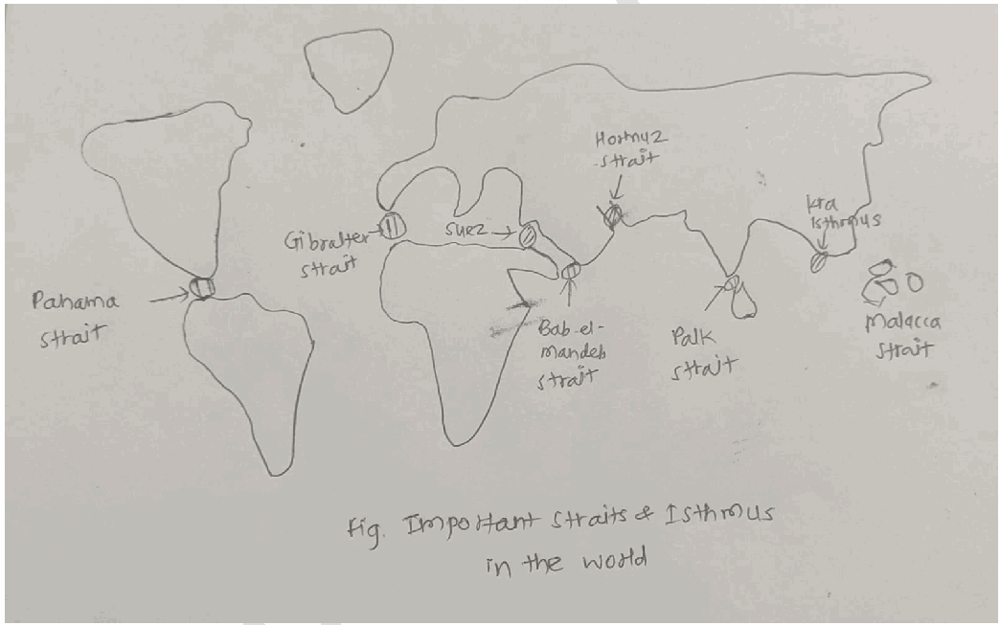

**Significance of Straits in International Trade**

1. Natural Maritime Chokepoints - They regulate access between major oceans and seas.

a. The Strait of Malacca connects the Indian Ocean with the Pacific.

b. 2024-25 Red Sea crisis at the **Bab-el-Mandeb**

2. Geopolitical Leverage- Eg-Turkey’s management of the Bosphorus and Dardanelles under the Montreux Convention is a primary tool of its foreign policy.

3. Shortest and Most Economical Trade Routes - Ships save time, fuel, and freight cost. Eg- Malacca Strait reduces distance between Europe and East Asia.

4. **Economic importance** - Straits connect emerging manufacturing hubs to mature consumer markets.

Eg- Over **60% of China’s trade** (by value) travels through the South China Sea via the **Strait of**

**Malacca.**

5. Energy Security - Eg- In 2025, the Strait of Hormuz handled roughly 21 million barrels of oil per day, representing over 20% of global consumption.

6. Growth of Port Cities and Trade Hubs due to heavy traffic. Eg- Singapore along the Malacca Strait.

7. **Marine Resource Wealth-** Many straits provide shallow, nutrient-rich waters that are significant for regional aquaculture and fishing industries. Eg- **Palk Strait**

8. **Strategic Military Value-** Straits enable naval fleets to move quickly between maritime theaters. Eg- the **Strait of Gibraltar** for the Mediterranean.

**Significance of Isthmus in International Trade**

1. Continental Connectors- serve as natural land bridges for the migration of people, resources, and culture between continents. Eg- Isthmus of Panama

2. Ideal Locations for Canal Construction

a. Suez Canal across Isthmus of Suez

b. Panama Canal across Isthmus of Panama.

3. For host countries, an isthmus is a primary revenue source. Eg- In 2025, the Panama Canal generated nearly $3 billion in tolls and services

4. Unlike straits, isthmuses allow for **controlled navigation** via locks.

5. **Multi-Modal Transshipment-** "Dry Canals" are used as a rail bridge to move containers between oceans without ships. Eg- **Isthmus of Tehuantepec** in Mexico

6. Reduction in Distance and Cost - Avoid long and hazardous sea routes. Eg- Suez Canal avoids the Cape of Good Hope route.

7. Development of Global Maritime Trade Centres. Eg- Port Said and Colón.

8. Promotion of Regional Economic Development - Boost to infrastructure, services, and employment in canal regions. Eg- Suez Canal Economic Zone (SCZONE)

9. **Climate Change Mitigation-** Canal shortcuts save an estimated **40-60 million tonnes of CO2** annually compared to circumnavigating continents.

Their control and uninterrupted functioning are essential for the smooth flow of **global commerce and supply chains.**

---

1. Explanation_Drishti IAS:
Source Question: Mention the significance of straits and isthmus in international trade.

- A strait is a narrow oceanic waterbody connecting two seas or two other large water bodies. It acts as a passage or gallery for ships in the water between water bodies. E.g., Malacca strait, Gibraltar strait, etc.

- An isthmus is a narrow strip of land that connects two larger landmasses and separates two bodies of water. E.g., Isthmus of Suez, connecting Africa and Asia.

### Significance of Staits and Isthmus in international trade

They reduce distance between the places and facilitate greater trade. E.g., the Suez Canal on the isthmus of Suez prevents the circumvent of the Africa by ships for trade between Asia and Europe.

- The straits and isthmus also provide good harbor and ports leading to international trade facilitation. E.g., Singapore port on the Malacca strait.

- It also provides connectivity between lager landmass and the water bodies. Like Panamá Canal on isthmus of Panama connects Atlantic and Pacific oceans.

- It also revolutionizes the shipping industry by facilitating efficient transportation.

- It provides the bridge between the demand and supply of the commodity. E.g., Japan buys the iron ore of India through the strait of Malacca.

- It provides environmentally friendly shipping. E.g., By making the Palk Strait deeper, Indian ships could circumvent Sri Lanka (a long route) while transporting goods from Vizag to Kochin (saving fuel).

- It facilitates the export and import of international trade in tourism services by providing recreational services along the coasts of the isthmus and straits.

- It provides good ground for fishing and aquaculture and thus, promotes international trade in marine products.

- It also provides the strategic place for defence establishment that facilitates international trade by providing security from pirates.

---

1. Explanation_PWOnlyIAS:
Source Question: Mention the significance of straits and isthmus in international trade.

**Answer:**

| **Approach:** **Introduction**  • Start your answer with strait and isthmus. **Body**  • Mention the significant roles of strait and isthmus in international trade: **Conclusion**  • Conclude your answer with the importance of Straits and isthmuses. |
| --- |

### Introduction

**Strait and isthmus are narrow passages of water and land, respectively, which have played a crucial role in international trade for centuries. These natural features have helped connect various regions of the world, facilitating the movement of goods and people. Like Malacca Strait, Gibraltar strait.** Body: ****

**Significance role of straits and isthmus in international trade:**
- **Reduced Distance:** Straits and isthmuses reduce the distance between regions, making transportation of goods and people more efficient. Like the **Suez Canal** on the isthmus of Suez prevents the circumvention of Africa by ship for trade between Europe and Asia.
- **Ports and Harbors:** Straits and isthmuses often have natural ports and harbors, providing easy access to the sea and facilitating trade. Like Malacca Strait
- **Revolutionized Shipping:** Straits and isthmuses have revolutionized the shipping industry, allowing for more efficient transportation and reducing the time and cost of shipping goods.
- **Connectivity:** Straits and isthmuses connect different regions of the world, providing access to markets, resources, and people. like the Panama Canal on isthmus connects Atlantic and Pacific oceans.
- **Bridge Between Demand and Supply:** Straits and isthmuses provide a bridge between the demand and supply of commodities, facilitating trade and economic growth.
- **Environmentally Friendly Shipping:** Straits and isthmuses provide environmentally friendly shipping options, **reducing the carbon footprint of** transportation and promoting sustainable trade practices.
- **Tourism and International Trade:** Straits and isthmuses provide opportunities for international trade in tourism services, promoting economic growth and development.
- **Marine Products:** Straits and isthmuses provide good grounds for fishing and aquaculture, promoting international trade in marine products.
- **Strategic Importance:** Straits and isthmuses have strategic importance, providing security from piracy and other threats, which is essential for international trade.

### Conclusion

Straits and isthmuses play an essential role in international trade, providing access to markets, resources, and people. They have provided opportunities for tourism and international trade in marine products and are essential for maintaining global economic growth and development.

---

1. Explanation_Rau IAS:
Source Question: Mention the significance of straits and isthmus in international trade. (15 Marks, 250 Words)

### Introduction

Straits are the narrow water bodies connecting two large water bodies whereas Isthmus are narrow piece of land which joins two larger landmasses and separates two water bodies.

### Body

**Significance in international trade:**

- **Passage & movement:** straits act like international waterways and isthmus are the best sites for construction of ports and canals. They help in reducing the time and increasing the navigational efficiency. For e.g. The Panama Canal is a constructed waterway that connects the Atlantic and Pacific oceans across the Isthmus of Panama.

- **Hydrocarbons:** Strait of Hormuz connects the oil rich west Asian countries to rest of the world. It is the main link for South Asian countries including India to meet their energy demands.

- **Key routes & choke points:** Approximately 12% of global trade passes through the Suez canal at isthmus of Suez and strait of bab el-mandeb representing 30% of all global container traffic, and over USD $1 trillion worth of goods per annum.

- **Reliability:** Countries like Russia depend heavily on straits of Bosphorous and black sea in order to have all weather port facility.

- **Strategic and geopolitical aspect:** Controlling of these narrow passage my alter the international trade and cut essential supplies. For e.g. strait of Malacca poses 'malacca dilemma' for China. Countries like India, Australia are focussing to develop canal across isthmus of kra to join Andaman sea and gulf of Thailand.

- **New routes:**In the backdrop of climate change and consequent melting of Arctic sea, The importance of Bering strait has grown multiple times.

### Conclusion

Despite all these significances, it must be understood that these areas are ecologically fragile too. Hence their overuse for trade might have detrimental effect on biodiversity. Therefore principles of sustainable development must be adopted while planning.

---

---

1. Explanation_Superkalam:
Source Question: Mention the significance of straits and isthmus in international trade.

Straits and isthmuses are key geographical features that influence** maritime trade, shipping routes, and global connectivity**. Understanding them helps explain the strategic and economic importance of certain global chokepoints.

Strait and Isthmus Schematic Diagram

##** Straits and Isthmuses: Meaning and Examples **

Schematic Diagram showing strait and Isthamus** a) Straits: **A strait is a** narrow waterway that connects two larger bodies of water**, often seas or oceans.

-** Examples: **-** Strait of Malacca: **Connects the Indian Ocean with the South China Sea; crucial for trade between East Asia and Europe.
 -** Strait of Hormuz: **Connects the Persian Gulf with the Gulf of Oman; key for global oil shipments.
 -** Strait of Gibraltar: **Connects the Atlantic Ocean with the Mediterranean Sea.** b) Isthmuses: **An isthmus is a** narrow strip of land connecting two larger landmasses**, often used for artificial canals to link seas or oceans.

-** Examples: **-** Isthmus of Panama: **Hosts the Panama Canal, connecting the Atlantic and Pacific Oceans.
 -** Isthmus of Suez: **Hosts the Suez Canal, connecting the Mediterranean Sea and the Red Sea.
 -** Isthmus of Kra (Thailand): **Proposed site for Kra Canal, potential shortcut between Pacific and Indian Oceans.

##** Significance of Straits and Isthmuses in International Trade **1.** Facilitating Global Shipping **- Straits provide** natural maritime shortcuts**, reducing travel distances between major oceans.
 -** Example:Strait of Malacca **enables faster trade between East Asia and Europe.

2.** Artificial Canals through Isthmuses **- Canals across isthmuses reduce the need for long maritime detours.
 -** Example:Panama Canal **saves ships about 8,000 nautical miles compared to circumnavigating South America.

3.** Reducing Transport Costs and Time **- Shorter routes cut** fuel consumption, voyage duration, and shipping costs**, making trade more efficient.
 -** Example:Suez Canal **avoids the long trip around Africa’s Cape of Good Hope.

4.** Strategic and Geopolitical Importance **- Control over straits or canals gives countries** leverage over global trade**.
 -** Example: **Strait of Hormuz – potential blockades can affect** 20% of global oil supply**.

5.** Supporting Port Development and Regional Trade **- Proximity to major straits and canals encourages** port growth, logistics hubs, and maritime industries**.
 -** Example: **Singapore (Strait of Malacca) and Port Said (Suez Canal) are major trade centers.

6.** Promoting Engineering Innovation: **Canals across isthmuses demonstrate** human ingenuity in overcoming geographic constraints**, improving trade efficiency.
7.** Encouraging Tourism and Economic Activity **- Straits and canal regions attract** cruise shipping, tourism, and commercial activities**, boosting local economies.
 -** Example: **Cruise tourism in the** Suez Canal region **and** Bosporus Strait **contributes significantly to the service sector.

8.** Enhancing Energy and Commodity Trade **- Many straits serve as chokepoints for** energy shipments and critical commodities**, ensuring global supply chains.
 -** Example:Strait of Malacca **is vital for LNG and oil exports from the Middle East to Asia.

9.** Facilitating Regional Integration **- Straits and isthmus canals connect** regional economies**, enabling trade agreements and economic corridors.
 -** Example: **Suez Canal promotes** trade between Europe, Africa, and Asia**, enhancing regional economic integration.

10.** Reducing Risk of Maritime Hazards **- Shorter routes through straits and canals** reduce exposure to piracy, storms, and navigational hazards**, ensuring safer trade.
 -** Example: **Panama Canal route is safer than the long and rough waters around Cape Horn.

Straits and isthmuses are** critical chokepoints **that facilitate efficient international trade, reduce costs, and shape** geopolitical and economic power**. Countries controlling these features often gain** strategic and economic advantages**, making them central to global commerce and maritime security.

---

1. Explanation_Unacademy:
Source Question: Q16. Mention the significance of straits and isthmus in international trade. (250 Words, 15 Marks) Approach

- **Introduction:** Introduce with acknowledging the importance of straits and isthmuses.

## **y Body** - Mention the Significance of Straits in International Trade.

 - Mention the Significance of Isthmus in International Trade.

- **Conclusion:** Conclude the answer mentioning way forward measures to enhance international trade through Straits and isthmus. **Answer:** **Introduction:Straits** and isthmuses have always held strategic importance in international trade due to their unique geographical positions. A strait is a narrow body of water that connects two larger bodies of water, while an isthmus is a narrow strip of land connecting two larger land masses and is often bordered by water on both sides.

## **Body: Significance of Straits in International Trade** - **Bypassing Land Routes:** Straits allow for maritime navigation, bypassing the need for lengthy and often more expensive land-based trade routes. For example, **the Strait of Malacca, between the Malay Peninsula** **and Sumatra,** serves as a critical shipping lane, significantly shortening the distance between the Pacific and Indian Oceans.

- Some straits function as **Gateway to Regions:** gateways to specific regions. For example, the **Strait of Hormuz is the only sea passage from the** **Persian Gulf to the open ocean and is strategically** **important for global energy trade** as a significant percentage of the world’s petroleum passes through it.

## **Significance of Isthmuses in International Trade** - **Facilitating Canal Construction:** Isthmuses have been historically significant due to their potential for canal construction. Canals across isthmuses significantly reduce travel time for shipping goods. The **Panama Canal,** built across the Isthmus of Panama, dramatically reduces the journey for vessels traveling between the Atlantic and Pacific Oceans, eliminating the need to traverse the treacherous Cape Horn route.

- **Connecting Major Markets:** Canals across isthmuses can connect major markets, facilitating quicker and more efficient trade. For example, **the Suez Canal, cutting through the Isthmus of** **Suez,** connects Europe with Asia, considerably reducing the maritime distance between these two continents. **Conclusion:** Straits and isthmuses continue to hold strategic importance in global trade, reducing distances, and facilitating quicker and more efficient transportation of goods between key markets. However, they also pose challenges such as territorial disputes, piracy, and vulnerability to blockages. Therefore, international cooperationandagreementsarecrucialformaintaining and enhancing their roles as critical junctions of world trade.

---

---

Q33. How can the mountain ecosystem be restored from the negative impact of develop- ment initiatives and tourism?
[Year: 2019] [Group: UPSC CSE] [Exam: Mains] [Stage: Mains] [Paper: Mains - GS 1]
[Subject: GEOGRAPHY]
[Section Group: Economic & Resource Geography]
[Microtopic: Factors responsible for the location of primary, secondary, and tertiary sector industries in various parts of the world (including India).]
[Subtopic: Tertiary sector]
[Macrotag: Descriptive]
[Microtag: How]

1. Explanation_Civilsdaily:
Source Question: How can the mountain ecosystem be restored from the negative impact of development initiatives and tourism? [Year: 2019] [Marks: 15]

As per the UN 2025 **Report on Sustainable Mountain Development,** mountains are at a breaking point due to unregulated "mass tourism" and unplanned infrastructure. Restoration requires a shift from **"Development at any cost"** to **"Ecosystem-led Resilience."**

**Negative Impact of Development & Tourism**

1. **Deforestation and Habitat Loss -** Eg- **Road widening under the Char Dham project in Uttarakhand** has involved extensive tree cutting in fragile Himalayan slopes.

2. **Landslides and Slope Instability -** Eg- Frequent **landslides in Himachal Pradesh and Uttarakhand** linked to road construction and blasting.

3. **Biodiversity Loss -** Eg- **Western Ghats biodiversity hotspots face pressure from tourism infrastructure and plantations.**

4. **Glacier and Snowfield Disturbance -** Eg- Rising tourism around **Gangotri and other Himalayan glaciers** increases pollution and ecological stress.

5. **Solid Waste and Plastic Pollution -** Eg- **Everest region in Nepal faces severe garbage accumulation from mountaineering expeditions.**

6. **Urbanisation of Hill Stations -** Eg- **Shimla and Mussoorie face water shortages and ecological stress due to tourism growth.**

7. **Climate Change Intensification -** Eg- Increased **black carbon deposition in Himalayan snowfields accelerates glacier melting.**

8. **Habitat Fragmentation-** Linear infrastructure like power lines and roads bisects forests, disrupting the migration corridors of species like the **Snow Leopard.**

9. **Micro-climatic Warming-** Dark asphalt roads and concrete surfaces contribute to local "heat islands," accelerating the melting of nearby permafrost.

**Way Forward**

1. **Scientific Carrying Capacity-** Conduct rigorous assessments to limit tourist entries and vehicle movement based on the ecological limits of a destination.

2. **Nature-Based Solutions (NbS)-** Replace concrete retaining walls with **bio-engineering** techniques like live-crib walls and grass turfing to stabilize slopes.

3. **Spring-shed Management-** Implement the **"Dhara Vikas"** model to revive dried-up mountain springs through recharge pits and staggered trenches.

4. **Strict Building Bylaws-** Enforce mandatory green building codes that prioritize lightweight, earthquake-resistant materials over heavy concrete.

5. **Decentralized Waste Management-** Install modular bioremediation units and solar-powered composting at all major tourist stopovers.

6. **Promotion of Ecotourism-** Incentivize low-impact **Homestays** instead of mega-resorts to ensure economic benefits reach the local community while protecting the land.

7. **Afforestation with Native Species-** Prioritize the planting of broad-leaved native trees (like **Oak and Rhododendron)** over monoculture commercial pine.

8. **AI-Based Early Warning Systems-** Deploy real-time sensors for **GLOFs (Glacial Lake Outburst Floods)** and landslides to mitigate human and ecological loss.

9. **Incentivizing "Green Jobs"-** Train local youth as **Ecological Guardians** for wildlife monitoring and forest fire prevention.

10. **Plastic Neutrality-** Implement a strict "Carry Back" policy for tourists and establish localized recycling hubs in hill towns.

11. **Buffer Zone Protection-** Maintain a **"No-Development Zone"** around retreating glaciers and sensitive wildlife habitats.

12. **Empowering Local Institutions-** Strengthen **Van Panchayats** and Biodiversity Management Committees (BMCs) to lead local restoration projects.

13. **Sustainable Energy Transition-** Promote micro-hydel and solar-thermal projects to reduce the local dependence on forest wood for heating.

14. **Integrated Policy Framework-** Adopt a **"Unified Mountain Authority"** to coordinate development across departments like PWD, Tourism, and Forest.

A **balanced approach combining ecological conservation, sustainable tourism practices, and climate-resilient development** is needed for ensuring long-term protection of these fragile environments.

---

1. Explanation_Drishti IAS:
Source Question: How can the mountain ecosystem be restored from the negative impact of development initiatives and tourism?

The Himalayan States, including the Northeast, and the Western Ghats are the most prominent mountain ecosystems in India which are struggling to cope up with the negative impacts of development initiatives and tourism. The * **Report of Working Group II Sustainable Tourism in the Indian Himalayan Region** * by the NITI Aayog highlights similar concern.

The negative impacts emerge out of the replacement of traditional eco-friendly and aesthetic architecture with inappropriate and dangerous construction, poorly designed roads and associated infrastructure, inadequate solid waste management, air pollution, degradation of water sources, and the loss of biodiversity and ecosystem services. Their repercussions were evident in the Kedarnath floods of 2013.

**In this respect, the following steps can be considered:**

- The reports by committees on Western Ghats ecology headed by **Madhav Gadgil** and **K. Kasturirangan** need urgent attention. The concept of **ecological sensitive zones (ESZ)** cannot be sacrificed for the sake of development. Likewise, NITI Aayog has suggested setting up of **Himalayan Authority** for coordinated and holistic development of entire Himalayan region.

- There has to be **clear demarcation and planning with respect to the extent of infrastructure development**. It should include a systematic process of urban planning, developing tourist hubs with strict controls, spring mapping and revival etc. For example, provision for no encroachment areas, well-preserved forested areas, etc.

- With respect to tourism, measures like application of **carrying capacity concept** to tourist destinations, implementation and monitoring of **tourism sector standards,** and **performance-based incentives** for States faring well on the standards can be considered. The unregulated tourism movement is a major reason for plastic pollution.

- States should also be encouraged to **spend more on sustainable development of tourism**. For instance, Uttarakhand stands second in tourist arrivals but invests only 0.15% of its total expenditure on this sector. Besides, States can also **adopt and share the best practices**. For example, Sikkim can be a lodestar for sustainable agriculture, **waste management** and **ecotourism**.

- With collaborative and participatory frameworks **capacity building** for conservation is required. Viable enterprises that can provide sustained economic incentives and support local communities need to be promoted. These can help achieve **SDG Goal 8** (decent work and economic growth) and **Goal 12** (responsible consumption and production).

To provide a better standard of living to the mountain communities and to meet the overall needs of the economy, a linkage between development and conservation needs to be formed. Besides, effective implementation of schemes and policies hold significance for any desirable results.

---

1. Explanation_PWOnlyIAS:
Source Question: How can the mountain ecosystem be restored from the negative impact of development initiatives and tourism?

| **Approach:** **Introduction**  • Start your answer with a brief about the mountain ecosystem. **Body**  • Discuss the major threats to mountainous ecosystems and its solution. **Conclusion**  • Conclude your answer with a futuristic approach and public awareness. |
| --- |

### Introduction

**The mountain ecosystem is a crucial and sensitive part of the environment, delicate and complex, and they are affected by human activities such as development initiatives and tourism. Some activities can cause a wide range of negative impacts on the ecosystem, habitat destruction, soil erosion, pollution, and the displacement of native species.** Body: ****

**Major threats to mountainous ecosystems include:**
- **Climate change:** Rising temperatures can cause glacial melting, altered precipitation patterns, and changes in the timing of seasonal events.

 - E.g. Loss of the

**West Antarctic ice sheet, sea level rise would approach 10.5 meters [34 feet].**
- **Deforestation:** Deforestation can result in soil erosion, habitat loss, and changes in water availability. Human–animal conflicts are common. E.g

**The Amazon rainforest has suffered from deforestation, causing soil erosion, habitat loss, and human-animal conflicts.**
- **Mining:** Mining activities can cause habitat destruction, soil erosion, and water pollution. E.g. Landslide in Joshimath in India.
- **Infrastructure development:** The construction of dams, roads, and other infrastructure can result in habitat loss, soil erosion, and fragmentation of ecosystems.
- **Agricultural practices:** Unsustainable agricultural practices can lead to soil erosion, habitat loss, and water pollution. E.g Punjab and Haryana Region in India.
- **Tourism:** Tourism activities can cause habitat destruction, pollution, and the displacement of native species. **Some of the measures that can be taken:
- **Conduct:** Environmental Impact Assessments** [EIA] before starting any development or tourism activity.
- Limit the number of tourists to reduce pressure on the ecosystem.
- Encourage **sustainable tourism** practices that minimize waste, conserve energy, and reduce water consumption.
- Restore degraded areas through **planting native species**, reducing soil erosion, and reducing pollution.
- Protect wildlife by reducing human-wildlife conflicts, protecting endangered species, and preserving their natural habitats.
- Promote **sustainable land use practices s** uch as organic farming, reducing deforestation, and reducing soil erosion.
- Educate the public about the importance of the mountain ecosystem and the negative impacts of development and tourism.

### Conclusion

Restoring the mountain ecosystem from the negative impact of development initiatives and tourism requires a collaborative effort to protect the ecosystem’s delicate balance. We can restore and preserve the mountain ecosystem. It is essential to prioritize sustainable development practices and promote responsible tourism to ensure that the ecosystem is protected for future generations.

---

1. Explanation_Superkalam:
Source Question: How can the mountain ecosystem be restored from the negative impact of development initiatives and tourism?

Recent studies show that mountain ecosystems face a** 15% biodiversity loss **due to unregulated development and tourism, requiring immediate restoration interventions to preserve these critical ecological zones.

Restoring Mountain Ecosystems: A Central Approach

## Challenges from Development and Tourism

-** Infrastructure Pressure **- Road construction causing** soil erosion and landslides **- Unplanned urbanization disrupting natural drainage systems
 - Mining activities degrading forest cover and wildlife habitats
 - Power projects altering river flow patterns
 - Construction waste contaminating pristine environments

-** Tourism Impact **-** Overtourism **exceeding carrying capacity in popular destinations
 - Waste generation increasing by** 300% during peak seasons **- Water table depletion due to excessive hotel construction
 - Noise pollution affecting wildlife migration patterns
 - Trail degradation from unregulated trekking activities

## Restoration Strategies and Implementation

### Policy Framework and Regulation

-** Environmental Impact Assessment **mandatory for all hill projects above 20 hectares
- Implementation of** carrying capacity limits **like Sikkim's daily tourist cap of 1,200
-** Green Tax **collection from tourists for conservation funding
- Strict enforcement of** Forest Rights Act 2006 **in tribal areas
-** Eco-sensitive Zone **designation around protected areas

### Scientific Restoration Methods

-** Assisted Natural Regeneration **using native species plantation
-** Bioengineering techniques **for slope stabilization and erosion control
-** Watershed management **through check dams and afforestation
-** Species reintroduction programs **for endangered flora and fauna
-** Soil restoration **using organic amendments and microbial inoculation

### Community-Based Conservation

-** Van Panchayat system **in Uttarakhand empowering local forest management
-** Homestay tourism **replacing large hotels, benefiting local communities
-** Traditional knowledge integration **in restoration planning
-** Skill development programs **for sustainable livelihood alternatives
-** Community monitoring **of restoration progress and wildlife protection

### Technology and Innovation

-** Remote sensing **for real-time ecosystem health monitoring
-** GIS mapping **for identifying degraded areas requiring restoration
-** Drone surveillance **for illegal activity detection
-** Mobile apps **for tourist education and waste tracking
-** Renewable energy adoption **reducing fossil fuel dependence

### Success Stories and Models

-** Chipko Movement legacy **continuing through modern conservation efforts
-** Spiti Valley model **balancing tourism with ecosystem preservation
-** Kerala's Munnar restoration **recovering** 40% degraded land **through community participation
-** Himachal's plastic ban **reducing mountain pollution significantly
-** Sikkim's organic state **model inspiring sustainable agriculture

## Government Initiatives and Funding

-** National Mission for Sustaining Himalayan Ecosystem** with ₹**2,000 crore allocation** - **Compensatory Afforestation Fund** providing ₹**47,000 crore for forest restoration** - **Green India Mission** targeting **5 million hectares** of ecosystem restoration
- **CAMPA funds** channeled for degraded land rehabilitation
- **Tourism development with environmental safeguards** under SWADESH Darshan

Mountain ecosystem restoration requires integrated approaches combining **scientific methods, community participation, and policy enforcement**. The** National Biodiversity Action Plan 2024-2030 **emphasizes ecosystem-based adaptation, ensuring these fragile environments can withstand climate change while supporting sustainable mountain development.

---

1. Explanation_Unacademy:
Source Question: Q15. How can the mountain ecosystem be restored from the negative impact of development initiatives and tourism? (15 Marks, 250 words) Tag: Developmental issues.

## **Decoding the Question** - **In Introduction, try to briefly write about the** **mountain ecosystem and tourism activities.** - **In Body,** - **Write negative impacts of human** **activities and tourism on mountain** **ecosystems.** - **Also, suggest measures to restore the** **mountain ecosystem.** - **In Conclusion, try to mention the overall** **significance of the mountain ecosystem.** **affected the biodiversity and lives of local** **communities in the region.** - **According to India State of Forest Report,** the development initiatives and human intervention in the region is responsible for loss of forest cover inmanyHimalayanStateslikeNagaland,Mizoram etc.

- The construction of roads and airports, and tourism facilities (resorts, hotels, restaurants etc.) negatively impacts environmental resources.

- The emission of harmful gases and spread of pollutants by tourists & other industrial activities is making the ecosystem unsustainable.

- **According to the World Bank survey (2015),** the performance on the criteria of Ease of Doing Business’ and ‘Environmental compliance of the Himalayan States is very poor.

- **The forest policy of these States is not** **comprehensive and sector centric and** **the Industrial policy is detrimental to the** **environment.** 

 **Answer:** **According to Report of Working Group II Sustainable** **Tourism in the Indian Himalayan Region released** **by the NITI Aayog** except for Sikkim and Himachal Pradesh, the environmental index of the rest of Himalayan states is very low. The report mentions that the tourism and hospitality sector is a highly lucrative for the Indian Himalayan Region (IHR). **It directly** **contributes about US$ 71.5 billion to the nation’s** **GDP.** **Negative Impacts of Development Activities and** ## **Tourism on Mountain Ecosystem** - **The NITI Aayog Report and the World Bank** has pointed out in the past that tourism in the IHR is not sustainable.

- **The tourism sector, human intervention and** **development activities in the region severely** ## **Measures to Restore the Mountain Ecosystem** - **The development of Ecotourism** can ensure sustainabletourismandconservetheenvironment without damaging its natural habitats.

- More emphasis should be given **on afforestation** **and social forestry** to increase green cover in the region.

- The **Environment impact assessment** in the region should be mandatory before starting any developmental activities.

- The **preparation of hazardous and vulnerability** **maps** by using technology can aid in creating sustainable infrastructure.

- Greater attention being given to **community** **involvement, voluntary organisations and** **using alternative routes** for travel and transport management. For example: waste warriors in Dharamshala.

- The focus should be **on conservation of agri-** **biodiversity and enhancing natural regeneration** of forest.

- The State and National Policies should be oriented towards climate change and sustainable development.

- The designated system of monitoring and gradience redressal on the ecological, cultural, human rights, development issues etc.

- The **guidelines of World Travel and Tourism** **Council (WTTC)** on sustainable tourism can be adopted. **Mountains are key canters of traditional ecological** **knowledge, cultural and biological diversity.** Therefore, tourism with a proper management of human activities and right approach can help to achieve sustainable development. The **Niti Aayog’s** **Sustainable Development of Mountains of Indian** **Himalayan Region (IHR) is the right step in the** **maintaining and restoring the ecology of mountains.** ---

---

Q34. Why is Indian Regional Navigational Satellite System (IRNSS) needed? How does it help in navigation?
[Year: 2018] [Group: UPSC CSE] [Exam: Mains] [Stage: Mains] [Paper: Mains - GS 1]
[Subject: GEOGRAPHY]
[Section Group: Economic & Resource Geography]
[Microtopic: Factors responsible for the location of primary, secondary, and tertiary sector industries in various parts of the world (including India).]
[Subtopic: Tertiary sector]
[Macrotag: Descriptive, Applied]
[Microtag: Why, How, India, Indian]

1. Explanation_Civilsdaily:
Source Question: Why is the Indian Regional Navigational Satellite System (IRNSS) needed? How does it help in navigation? [Year: 2018] [Marks: 10]

The **IRNSS,** operationally named **NavIC (Navigation with Indian Constellation),** is India's indigenous satellite navigation system developed by Indian Space Research Organisation.

**Need of IRNSS/NavIC**

1. **Strategic Autonomy** - Dependence on foreign systems like **GPS (USA), GLONASS (Russia), or Galileo (EU)** poses security risks, as access can be denied during conflicts. Eg- During the **Kargil War (1999),** USA denied GPS data to India.

2. **Sovereignty over Navigation** - Provides India independent and reliable **Position, Navigation, and Timing (PNT)** services over Indian territory and surrounding region.

3. **Regional Coverage** - Covers India and a region extending **1,500 km beyond its borders,** ensuring accurate navigation across South Asia and the **Indian Ocean Region.**

4. **Civilian Applications** - Terrestrial, aerial, and marine navigation; vehicle tracking; disaster management; mapping and geodetic surveys; mobile phone integration.

5. **Military Applications** - Missile guidance, troop movement, naval operations, border surveillance.

6. **Economic Benefits** - Supports precision agriculture, fisheries, transport logistics, and infrastructure development.

**How NavIC Helps in Navigation**

1. **Constellation** - **7 satellites** (3 **in Geostationary Orbit, 4 in Geosynchronous Orbit)** provide continuous coverage over the Indian region.

2. **Dual Frequency** - Operates on **L5 and S-band,** reducing errors caused by ionospheric delays and providing better accuracy than single-frequency systems.

3. **Accuracy** - Provides position accuracy better than **20 metres** in the primary service area and **10 metres** for restricted (military) service.

4. **Two Services** - **Standard Positioning Service (SPS)** for civilian use and **Restricted Service (RS)** for authorised users (military, strategic).

5. **Integration** with international systems like **GPS** for enhanced accuracy and reliability.

6. **Fishermen Safety** - Indian Space Research Organisation provides NavIC-based communication devices to fishermen for receiving emergency alerts and location-based services.

**NavIC** represents India's technological self-reliance in the strategic domain of satellite navigation, aligning with the vision of **Atmanirbhar Bharat.**

---

1. Explanation_Drishti IAS:
Source Question: Why is Indian Regional Navigational Satellite System (IRNSS) needed? How does it help in navigation? (2018)

**IRNSS:** NavIC (Navigation with Indian Constellation) is an independent and indigenous regional navigation satellite system developed by India. It is a set of 8 satellites which will be located in suitable orbital slots - geostationary or geosynchronous.

It makes India only the sixth country in the world to have its own navigation system.

This frees India from dependence on other countries for its navigation (GPS, GLONASS, Galileo etc.).

Given that it’s primary service area is India and the region extending up to 1500 km from its boundary, it’s expected to be more accurate (better than 20 m) and reliable. Also, this will help solidify India’s position as a regional power as NavIC will be open for use by India’s neighbours as well.

Further, it will help meet local user requirements of the positioning, navigation and timing services.

**Navigation**

- IRNSS will provide two types of navigation services:

- Standard Positioning Service – for all users.

- Restricted Service – an encrypted service only for authourised users.

- The signals broadcast by IRNSS satellites will transmit navigation service signals (timing and position information) to the users.

- This data will be used to give users visual and voice navigation assistance.

- These will form the basis for variety of navigation applications:

- Land navigation – traffic management, tracking train’s movement, land survey, etc.

- Marine navigation – fishermen, merchant ships, port operations, disaster management, etc.

- Aerial navigation – civil aviation, military operations, etc.

---

1. Explanation_PWOnlyIAS:
Source Question: Why is the Indian Regional Navigational Satellite System [IRNSS] needed? How does it help in navigation?

**Answer:**

| **Approach:** **Introduction**  • Briefly explain about IRNSS. **Body**  • Significant and helpful in navigation by IRNSS. **Conclusion**  • Conclude your answer with the importance of IRNSS. |
| --- |

### Introduction

**The Indian Regional Navigational Satellite System [IRNSS] is also known as** NavIC, **developed to provide India with its own independent navigation system that is not dependent on foreign systems like GPS. It is a sophisticated satellite-based navigation system designed to provide accurate and reliable location information for users on the ground.** Body: ****
**Need of the IRNSS:
- **To provide India with its:** own independent navigation system** that is not dependent on foreign systems like GPS.
- To provide accurate and reliable navigation services for **civilian and military** applications in India and the surrounding regions.
- To provide more **precise location** and timing information for various applications, including transportation, agriculture, disaster management, and national security.
- To enhance the **security and sovereignty of India** by providing an encrypted navigation signal for use by the military.
- To support the development of indigenous technology and expertise in the field of space technology.
- To contribute to the overall progress and development of India’s space program.
- To increase India’s self-reliance in the area of space technology.
- To provide a platform for scientific and technological research and development.

**Role of IRNSS in Navigation**
- **IRNSS provides:** accurate and reliable location** information for users on the ground, which is necessary for navigation in various applications.
- It provides **real-time information on location**, velocity, and time, which can be used to calculate the best route to a destination.
- IRNSS is designed to provide navigation services with an accuracy of up to 20 meters, which is much better than the accuracy provided by GPS.
- It can provide navigation services in areas where GPS signals are weak or unavailable. The system is highly reliable, and its signal is not subject to jamming or interference.
- IRNSS provides an **encrypted navigation signal** for use by the military, which is not available on GPS.
- The system is cost-effective, and its use is not subject to any licensing fees or restrictions.
- It can help in better transportation, logistics and promote ease of doing in business.
- It has wide-ranging applications in transportation, agriculture, disaster management, and national security.
- In April 2019, the government made IRNSS- based vehicle trackers mandatory for all commercial vehicles in the country in accordance with the Nirbhaya case verdict.

### Conclusion

IRNSS is a critical technological development for India as it enhances the efficiency, safety, and security of navigation-based applications. By providing accurate and reliable location information, IRNSS contributes significantly to the progress and development of India’s space program, and its use has wide-ranging applications in transportation, agriculture, disaster management, and national security.

---

1. Explanation_Superkalam:
Source Question: Why is the Indian Regional Navigational Satellite System (IRNSS) needed? How does it help in navigation?

India's indigenous navigation system** IRNSS (Indian Regional Navigation Satellite System)**, also known as** NavIC (Navigation with Indian Constellation)**, addresses critical strategic and technological requirements while reducing dependency on foreign systems like GPS.

Spatial Diagram of Earth Indian Subcontinent

## Strategic Need for IRNSS

-** National Security**: Ensures uninterrupted navigation services during conflicts when foreign systems like** GPS **might be denied or degraded by other countries
-** Sovereignty**: Provides complete control over navigation data and services within Indian territory and surrounding regions
-** Strategic Autonomy**: Reduces reliance on** US-controlled GPS **and** Russian GLONASS **systems, especially after GPS denial during** Kargil War (1999) **-** Regional Coverage**: Extends services up to** 1,500 km **beyond Indian borders, covering entire South Asian region
-** Economic Independence**: Eliminates licensing fees and restrictions associated with foreign navigation systems

## Navigation Capabilities and Applications

-** Precision and Accuracy**:

 - Provides positioning accuracy better than** 20 meters **in primary service area
 - Operates on dual frequency bands (**L5 and S bands**) for enhanced signal quality
 - Offers** Standard Positioning Service (SPS) **for civilian use and** Restricted Service (RS) **for authorized users

-** Transportation Sector**:

 -** Indian Railways**: Integration with** Kavach system **for automatic train protection and collision avoidance
 -** Civil Aviation**: Supports** Required Navigation Performance (RNP) **approaches at airports
 -** Maritime Navigation**: Assists coastal and inland waterway navigation with precise positioning

-** Disaster Management**:

 - Enables real-time tracking during natural disasters like** cyclones **and** earthquakes **- Supports search and rescue operations with accurate location services
 - Facilitates emergency response coordination through precise positioning

| Feature | IRNSS/NavIC | GPS |
| --- | --- | --- |
| Coverage | Regional (India + 1500km) | Global |
| Accuracy | <20m (Primary area) | 3-5m |
| Frequency Bands | L5 + S band | L1, L2, L5 |
| Control | Indian | US Military |

With** NVS-01 **successfully launched in** 2023 **and plans for** NVS-02 **in 2024, IRNSS continues strengthening India's position in space-based navigation under the** Atmanirbhar Bharat **initiative.

---

1. Explanation_Unacademy:
Source Question: Q4. Why is Indian Regional Navigational Satellite System (IRNSS) needed? How does it help in navigation? (10 marks, 150 words) Tag: Salient features of World Physical Geography; Important Geophysical phenomena (earthquakes, tsunami, volcanoes, cyclones); Geographical features and location.

## **Decoding the Question** - **In Introduction, try to write briefly about** **IRNSS.** - **In Body, elaborate about the need or** **application of IRNSS and explain how it will** **help in navigation.** - **Conclude by highlighting the prospect that** **IRNSS would contribute both, politically** **and economically.** **Answer:** The **Indian Regional Navigational Satellite System** **(IRNSS)isanindependentregionalnavigationsatellite** system developed by India. It is designed to provide **accurate position information service** to assist in the navigation of ships in the Indian Ocean waters. It provides accurate real-time positioning and timing services. The commercial name of the system is **NavIC** **(Navigation with Indian Constellation).** **Indian Regional Navigational Satellite System** ## **(IRNSS) is needed for the following** - Terrestrial, Aerial and Marine Navigation

- Disaster Management

- Vehicle tracking and Fleet management

- Integration with mobile phones

- Precise Timing

- Mapping and Geodetic data capture

- Terrestrial navigation aid for hikers and travelers

- Visual and voice navigation for drivers

## **In Navigation, IRNSS will help in following way** - The IRNSS system consists of a **constellation of** **eight satellites** to track and monitor movements. Currently, seven satellites are active in the following roles.

 - Four satellites are **geosynchronous in nature** and will continuously hover above Indian region.

 - Three **geostationary satellites** will act as a reference point for grid location.

- The users having IRNSS supported **chip-set in** **device** will be connected to the satellite system similar to GPS.

 - The system uses device location to track the movements and also guide in navigation.

- **Merchant vessels in Indian waters can use the** **“modern and more accurate” as the IRNSS** **System is expected to provide a position accuracy** **of better than 20 m in the primary service area** **(1500 km around India) and less than 10 m** **accuracy over india.** - IRNSS provides two types of services, namely, **Standard Positioning Service (SPS)** which is provided to all the users and **Restricted Service** **(RS),** which is an encrypted service provided only to the authorized users, hence useful for civilian as well as for strategic military purposes.

- An overdependence on one system (GPS) was not safe therefore, this is also a “significant achievement” towards the **‘Atmanirbhar Bharat’** **initiative towards India’s Coastal security.** After the US, Russia and China that have their own navigation systems, **India has become the fourth** **country** to have its independent regional navigation system. Unlike GPS, however, **IRNSS is a regional** **and not a global navigation system.** But now with the recognition as a component of the World-Wide Radio Navigation System (WWRNS), the Indian navigation system **is similarly placed as GPS,** most commonly used by marine shipping vessels across the world or the Russian Global Navigation Satellite System (GLONASS).

---

---

Q35. Enumerate the problems and prospects of inland water transport in India.
[Year: 2016] [Group: UPSC CSE] [Exam: Mains] [Stage: Mains] [Paper: Mains - GS 1]
[Subject: GEOGRAPHY]
[Section Group: Economic & Resource Geography]
[Microtopic: Factors responsible for the location of primary, secondary, and tertiary sector industries in various parts of the world (including India).]
[Subtopic: Tertiary sector]
[Macrotag: Descriptive, Applied]
[Microtag: Enumerate, India, Problem]

1. Explanation_Drishti IAS:
Source Question: Enumerate the problems and prospects of inland water transport in India. (2016)

India is estimated to have nearly 14,500 km of navigable inland waterways, even though the exploitation of sector has remained neglected as most waterways in the country require constant dredging on account of heavy silting and draft is available only seasonally.

In the European Union it is 44 per cent. Inland waterways transportation in India, however, is a paltry 3 per cent. The number of vessels carrying cargo that ply on inland waterway systems in China and the EU are 2,00,000 and 11,000, respectively, while there are less than 1,000 vessels estimated to be using the Indian inland waterway systems. The crucial difference being that these countries have maintained and upgraded their river systems on core routes that can support large modern vessel fleets up to 40,000 tonnes of cargo on a single voyage, even as India is struggling to create depth in its river systems for vessels of 1,500 tonnage to go through. Even in Bangladesh, about 35 per cent of the freight movement is by inland waterways, according to ADB figures.

**Problems of Inland Water Transport**

- There is a seasonal fall in water level in rivers especially in the rain-fed rivers of the peninsula which become nearly dry during summer.

- Reduced flow due to diversion of water for irrigation, for instance, in the Ganga which makes it difficult even for steamers to ply.

- There is reduced navigability due to siltation, as in the Bhagirathi-Hooghly and in the Buckingham Canal.

- There are problems in smooth navigation because of waterfalls and cataracts. For example, in rivers like Narmada and Tapti.

- Salinity, especially in the coastal stretches, affects navigation.

India should cash on its huge inland river network by addressing the above problems to save huge energy, time and environment costs (pollution)which it incurs on transport through road and rail network.

---

1. Explanation_PWOnlyIAS:
Source Question: Enumerate the problem and prospects of inland water transport in India. [200 Words, 12.5 Marks]

**Answer:**

| **Approach:** **Introduction**  • Brief about Inland water transport. **Body**  • Discuss about the problems and prospects of inland water transport in India. **Conclusion**  • Conclude your answer with a futuristic approach. |
| --- |

### Introduction

**Inland water transport [IWT] is a crucial mode of transportation in India that can provide a cost-effective, energy-efficient, and environmentally sustainable alternative to road and rail transport; it remains underutilized at a share of 2% in India’s model mix.** Body: ****

**Problems of Inland Water Transport in India:**
- **Infrastructure:** The lack of adequate infrastructure, such as ports, terminals, and navigational aids, hinders the growth of IWT in India.
- **Limited connectivity:** The limited connectivity of IWT with other modes of transport, such as road and rail, makes it less competitive and reduces its potential for intermodal transport.
- **Maintenance:** The inadequate maintenance of waterways, vessels, and related infrastructure reduces the efficiency and safety of IWT.
- **Inefficient regulatory framework:** The complex regulatory framework, overlapping jurisdictions, and bureaucratic hurdles hinder the development of IWT in India.
- **Environmental issues:** like pollution, biodiversity and floods in the river system.

**Prospects of Inland Water Transport in India:**
- **Economic benefits:** IWT has the potential to provide cost-effective, energy-efficient, and environmentally sustainable transportation for bulk cargo and passengers, particularly in the hinterland regions.
- **Employment opportunities:** The growth of IWT can create employment opportunities in the transport, logistics, and related sectors, particularly in the rural areas.
- **Integration with coastal shipping:** The integration of IWT with coastal shipping can enhance connectivity, reduce congestion, and promote intermodal transport in India.
- **Environmental benefits:** IWT is a low-carbon mode of transport that can reduce greenhouse gas emissions and air pollution, contributing to India’s sustainable development goals.

### Conclusion

Inland water transport in India has both challenges and opportunities such as developing infrastructure, enhancing the regulatory framework, and increasing investment, which can help realize the sector’s potential. A strategic approach that promotes sustainable development, private sector participation, and cooperation among stakeholders is necessary to maximize the prospects of inland water transport in India.

---

1. Explanation_Superkalam:
Source Question: Enumerate the problems and prospects of inland water transport in India

India's inland water transport system, utilizing 14,500 km of navigable waterways across rivers, canals, and backwaters, offers immense potential for sustainable cargo movement. With** 5 National Waterways **declared and cargo traffic reaching** 108 million tonnes **in 2023-24, this sector presents both significant challenges and promising opportunities.

India's National Waterways map and outline

## Problems of Inland Water Transport

###** Infrastructure Deficiencies: **-** Limited Terminal Facilities**: Only** 15 multi-modal terminals **operational against projected requirement of 50+
-** Poor Maintenance**: Inadequate dredging leads to reduced channel depth in rivers like** Ganga **and** Brahmaputra **-** Navigation Aids**: Insufficient modern navigational equipment and lighting systems for night operations
-** Connectivity Issues**: Weak last-mile connectivity between waterways and road/rail networks
-** Cargo Handling**: Outdated loading/unloading facilities increase turnaround time

###** Natural and Operational Constraints: **-** Seasonal Variations**: Water levels fluctuate drastically during monsoon and dry seasons affecting year-round navigation
-** Siltation Problems**: Heavy sedimentation in rivers requires continuous maintenance and dredging
-** Limited Vessel Availability**: Shortage of modern inland vessels suitable for Indian waterway conditions
-** Skilled Manpower**: Lack of trained personnel for waterway operations and maintenance
-** Environmental Clearances**: Complex approval processes delay project implementation

## Prospects of Inland Water Transport

|** Aspect **|** Current Status **|** Projected Growth **|
| --- | --- | --- |
|** Cargo Volume **| 108 MT (2023-24) | 200 MT by 2030 |
|** Cost Advantage **| 50% cheaper than road | Further reduction expected |
|** Fuel Efficiency **| 3x more than road transport | Enhanced with modern vessels |

###** Government Initiatives and Opportunities: **-** Jal Marg Vikas Project**: ₹5,369 crore investment for Ganga waterway development with** World Bank **support
-** Sagarmala Program**: Integration of inland waterways with coastal shipping and ports
-** Multi-Modal Transportation**: Development of** 35 multi-modal terminals **under various schemes
-** Digital Infrastructure**: Implementation of** River Information Systems (RIS) **for real-time navigation data
-** Private Participation**:** Viability Gap Funding **and PPP models attracting private investment

###** Economic and Environmental Benefits: **-** Carbon Footprint**: 32% lower emissions compared to road transport
-** Employment Generation**: Potential to create** 1 lakh direct jobs **by 2030
-** Export Facilitation**: Enhanced connectivity to** Bangladesh **via Protocol on Inland Water Transit
-** Tourism Development**: River cruise operations generating additional revenue streams
-** Logistics Cost Reduction**: Potential to reduce overall logistics cost from 13% to 8% of GDP

India's inland water transport sector, supported by the** National Waterway Act 2016 **and substantial government investment, stands poised for transformational growth while contributing to sustainable transportation goals.

---

1. Explanation_Unacademy:
Source Question: Q19.Enumeratetheproblemsandprospectsofinland water transport in India. (12.5 marks, 200 words) Tag: Distribution of key natural resources across the world (including South Asia and the Indian sub-continent).

## **Decoding the Question** - **In Introduction, try to write about the** **importance of Water based transport.** - **In Body, emphasize on two aspects i.e., The** **problems of inland water transport in India** **and the prospects of inland water transport** **in India.** - **Conclude with mentioning the measures like** **micro-level review to assess viability need to** **be done.** **Answer:** Water based transport is **effective as operating costs** **of fuel** are low and environmental pollution is lower than for corresponding volumes of movement by road, rail, or air. Inland water transport is most promising and the **cheapest modes of transport in India.** It has played an important part of the transport system in India since early times. However, with the expansion of road and railway **its importance has been reduced.** ## **The Problems of Inland Water Transport in India** - India is estimated to have nearly **14,500 km of** **navigable inland waterways,** even though the exploitation of the sector has remained neglected.

 - Inland waterways transportation in India is **approximately 3%** whereas it constitutes 20% of the transport sector in Germany and 32% in Bangladesh.

- Not many **private players are willing to invest** in inland vessels, which have resulted in underutilization of whatever infrastructure is created, thereby spelling trouble for the development of the sector.

- Accordingtothereport,“theoutcomeofaNational **Policy Dialogue on transboundary cooperation”** related to the Ganga and the Brahmaputra rivers states, there are not many industrial units on the riverside, especially not along the Brahmaputra.

- **Duetolessornodevelopmentofspecialeconomic** **zones along Ganga and Brahmaputra rivers,** there is hardly any presence of industries resulting in no cargo commitments by the private players.

- The inland water transport in the river **needs** **enough depth throughout the year for it to be a** **viable inland waterway.** - In their natural state, **many Indian rivers** **simply do not have that level of water.** This meansthatextensivedredgingwillberequired to make the rivers navigable.  Dredging will have a **tremendous impact** **ontheecologyoftherivers.Specieslikethe** blind Gangetic dolphin which navigates by echolocation, already endangered, may be wiped out.  Both for the dredging as well as the infrastructure, **very heavy investment is** **required.** - **The challenges of Inland waterways are regional** **in nature.** - The Ganga **has a high silt content as it flows** **through Bihar,** and the concern is about dams and water flow.

 - Kerala, with the sea nearby, **fears the ingress** **of salt water.** - The **water in rivers has competing demands,** including dams and farming.

 - To maintain the water levels in the river to the degree needed for them to function as inland waterways, the water use for these activities will be curtailed.

## **The Prospects of Inland Water Transport in India** - The Government of India has approved the enactment of **National Waterways Act 2016** for declaring **101 additional Inland Waterways as** **National Waterways** (NW) for navigation, which would transform the inland waterways system in the country.

- The waterways are proposed to be linked to the **eastern and western Dedicated Freight Corridors** **(DFCs), as well as the Sagarmala Project, which** **aims to promote port-led direct and indirect** **development.** - Inland waterway network has **no continuous** **connectivity** and requires a **multimodal network** **comprisingwaterbodiesandroadways,including** **culverts, bridges, etc., to be developed.** - This involves **investment in a large number of** **activities** to be carried out for infrastructure development.

 - **State-owned Inland Waterways Authority of** **India** is trying to raise funds through market borrowings and organize arrangements through multilateral agencies to fund the identified inland waterways.

- A well-coordinated inland waterways network could bring a fundamental alteration in the logistics scenario of the country.

 - It represents a ready built infrastructure network, which can be utilized without any further capital investment.

 - The network requires no green field investment, but only capex for improvement/ upgradation.

- Waterways can **decongest roads, including** **highways by moving cargo away.** Waterways do not involve challenges associated with land acquisition, which has always been a sensitive issue, causing time and cost overruns of numerous projects.

- The significant investment which India needs to build its roads/highways infrastructure network can be conserved through increased utilization of the waterways.

 - Userchargescanbeleviedtomeettheexpenses on maintenance of the waterways. As every riverine system is unique and presents diverse challenges, separate studies based on a detailed micro-level review to **assess viability need to be** **done for each,** before taking up implementation. An effective waterways network would **necessitate** **drawing up a well-coordinated strategy on lines of** **complementarity between the national network and** **other waterways.** The said strategy should closely look into the various undercurrents, including competing uses/needs, possible local resistance and also work closely and in coordination with local governments for quick and successful implementation of this important national project.

---

---

Q36. The states of Jammu and Kashmir, Himachal Pradesh and Uttarakhand reaching the limits of their ecological carrying capacity due to tourism. Critically evaluate.
[Year: 2015] [Group: UPSC CSE] [Exam: Mains] [Stage: Mains] [Paper: Mains - GS 1]
[Subject: GEOGRAPHY]
[Section Group: Economic & Resource Geography]
[Microtopic: Factors responsible for the location of primary, secondary, and tertiary sector industries in various parts of the world (including India).]
[Subtopic: Tertiary sector]
[Macrotag: Analytical]
[Microtag: Critically evaluate]
### Section Group: Environmental Geography & Climate Dynamics
#### Microtopic: Geographical features and their location-changes in critical geographical features (including water-bodies and ice-caps) and in flora and fauna and the effects of such changes.
##### Subtopic: Climate change

1. Explanation_PWOnlyIAS:
Source Question: The state of Jammu and Kashmir, Himachal Pradesh and Uttarakhand are reaching the limits of ecological carrying capacity due to tourism. Critically Evaluate. [200 Words, 12.5 Marks]

| **Approach:** **Introduction**  • Write data or importance of tourism. **Body**  • Discuss the Challenges of ecological carrying capacity due to tourism. **Conclusion**  • Summary of the answer with futuristic approach. |
| --- |

### Introduction

**Tourism sector contributes around 5.5-6% to the country’s GDP. It has become a significant contributor to the economies of Jammu and Kashmir, Himachal Pradesh, and Uttarakhand. This rapid growth in tourism has also put a strain on the fragile ecosystems of these states.** Body: ****

**Challenges of ecological carrying capacity due to tourism:**

**Environmental Degradation**
- **The:** increasing number of tourists** in Jammu and Kashmir, Himachal Pradesh, and Uttarakhand has led to significant environmental degradation, including deforestation, soil erosion, and water pollution.
- Tourists often indulge in activities like **littering, overuse of natural resources,** and degradation of fragile ecosystems, putting immense pressure on the region’s carrying capacity.
- The **construction of hotels, resorts**, and other tourist infrastructure has often led to the destruction of natural habitats, leading to significant biodiversity loss.

**Pollution in the region leads to clogging of water bodies.** Infrastructure Strain ****
The rapid growth of tourism in Jammu and Kashmir, Himachal Pradesh, and Uttarakhand has put immense strain on the region’s infrastructure, leading to increased congestion, traffic jams, and overcrowding.
- It has led to **increased air and noise pollution**, affecting the quality of life for local residents and tourists alike.
- The **inadequate supply of basic services** such as water, sanitation, and waste management has led to further environmental degradation and public health challenges.

**Social and Cultural Impacts**
- **The rapid growth of tourism in Jammu and Kashmir, Himachal Pradesh, and Uttarakhand has also had significant social and cultural impacts, with the influx of tourists leading to changes in:** local lifestyles, values, and traditions.
- The commodification of local culture and traditions has led to cultural homogenization, leading to the loss of cultural diversity and authenticity.

### Conclusion

The increasing pressure of tourism on the natural resources of Jammu and Kashmir, Himachal Pradesh, and Uttarakhand is a cause of concern. Challenge requires a collaborative effort between the government, tourism industry, and local communities to adopt sustainable tourism practices and protect the natural heritage of these states.

---

1. Explanation_Superkalam:
Source Question: The states of Jammu and Kashmir, Himachal Pradesh and Uttarakhand are reaching the limits of ecological carrying capacity due to tourism. Critically evaluate.

Recent studies indicate that Himalayan states are experiencing unprecedented tourist influx, with Uttarakhand receiving **4.5 crore visitors** in 2023, raising critical concerns about ecological sustainability.

Tourist Footprint Over Time Line Graph

## Evidence of Ecological Stress **Environmental Degradation:** - **Water Crisis**: Shimla faced severe water shortage in 2018 and 2023, with** tourist consumption **exceeding local supply capacity
-** Waste Overload**: Rohtang Pass generates** 500 tonnes of waste daily **during peak season, overwhelming disposal systems
-** Air Quality**: Manali and Mussoorie report deteriorating** AQI levels **due to increased vehicular traffic
-** Glacial Impact**:** Gangotri and Yamunotri glaciers **show accelerated retreat due to increased footfall and infrastructure development
-** Forest Loss**:** 18% decline **in forest cover in popular tourist circuits over the past decade** Infrastructure Burden: **-** Carrying Capacity Exceeded**: Kedarnath receives** 6 lakh pilgrims **annually against recommended capacity of** 4 lakh **-** Unregulated Construction**: Over** 2,000 illegal structures **in Uttarakhand's eco-sensitive zones
-** Traffic Congestion**: Manali-Leh highway experiences** 15-hour traffic jams **during peak tourist season
-** Power Crisis**: Frequent power cuts in tourist areas due to** 300% increased demand **during seasons
-** Sewage Problems**: Untreated sewage from hotels polluting rivers like** Beas and Alaknanda **## Economic vs Environmental Trade-offs

-** Employment Generation**: Tourism sector employs** 40 lakh people **directly and indirectly in these states
-** Revenue Contribution**: Tourism contributes** ₹45,000 crore **annually to combined state revenues
-** Infrastructure Development**: Improved connectivity through** All Weather Roads **and** Ropeway Projects **-** Cultural Preservation**: Revenue supports maintenance of heritage sites like** Hemis Monastery **and** Jagannath Temple **-** Livelihood Support**:** 3 lakh families **dependent on tourism-related activities

## Sustainable Solutions Framework

|** Challenge **|** Solution **|** Implementation Example **|
| --- | --- | --- |
|** Visitor Management **| Carrying Capacity Limits |** Valley of Flowers**: Daily 300 visitor cap |
|** Waste Management **| Zero Waste Tourism |** Spiti Valley**: Complete plastic ban |
|** Infrastructure **| Green Building Norms |** Sikkim**: Mandatory eco-friendly construction |
|** Transport **| Electric Vehicle Promotion |** Ladakh**: E-vehicle mandatory zones |
|** Accommodation **| Homestay Promotion |** Uttarakhand**: 2,000+ registered homestays |

## Government Initiatives and Challenges

-** Himalayan Char Dham Devasthanam Management Act 2019**: Regulating pilgrimage tourism
-** National Mission on Sustaining Himalayan Ecosystem**: ₹2,000 crore allocation for conservation
-** Eco-Tourism Policy 2022**: Promoting responsible tourism practices
-** Digital Yatra Project**: Managing visitor flow through technology
-** High Altitude Pseudo Taiga Conservation**: Protecting fragile mountain ecosystems

The Himalayan states face a critical juncture where unchecked tourism growth threatens their ecological foundation. Implementation of** Sustainable Development Goal 8.9 **focused on sustainable tourism, combined with strict enforcement of** Environmental Impact Assessments**, can ensure these pristine regions remain viable for future generations.

---

1. Explanation_Unacademy:
Source Question: Q17. The states of Jammu and Kashmir, Himachal Pradesh and Uttarakhand are reaching the limits of ecological carrying capacity due to tourism. Critically evaluate. (12.5 marks, 200 words) Tag: Distribution of key natural resources across the world.

## **Decoding the Question** - **In Introduction, begin your answer with** **some data and background of tourism.** - **In Body, write about the ecological impacts** **of tourism.** - **Conclude the answer with SDG & some** **positive way outs.** **Answer:** Covering around 27% of the earth’s land surface, mountains play a critical role in moving the world towards sustainable economic growth. They not only provide sustenance and wellbeing to 720 million inhabitantsaroundtheworld,butalsoindirectlybenefit billions more living downstream economically as well. Many countries are looking at tourism to generate income and strengthen the national economy, India is no exception. As one of the world’s largest industries, tourism is responsible for more than one in ten jobs globallyandconstitutesover8%ofdomesticeconomic activity- as per the data of NITI AAYOG. ‘Tourism’ in a broader sense of the word has existed for a very long time.

- With the arrival of the British in the 19th century, summer resorts, the so-called ‘Hill Stations’, were established. Examples of these are Darjeeling, Nainital, Mussoorie, and Shimla, which are today major tourism destinations.

- The Himalayan region has an important spiritual meaning for Hindus as a “sacred space”.

- Apartfrompilgrimagetourism,“modern”tourism in the IHR (Indian Himalayan region), which is represented by mass tourism, is largely limited to sightseeing and visiting major tourism hubs. All these activities are putting severe stress on the ecologyandecosystemservicesoftheHimalayaaswell as on local social structures. Modern form of tourism requires ever-expanding road networks, hotels, related infrastructure, and institutional capacities and puts huge demands on the water and natural resources of this fragile region. Over the years, trekking, mountain climbing, and nature-based tourism in the IHR have been gaining popularity. Issues of concern to IHR environments are continuing to be multiple with their magnitude ever becoming challenging as loss or degradation of mountain landscapes and their biodiversity because,

- Replacement of traditional eco-friendly and aesthetic architecture with inappropriate, anesthetic and dangerous construction,

- Poorly designed roads and associated infrastructure,

- Inadequate solid waste management,

- Air pollution,

- Degradation of watersheds and water sources,

- Loss of natural resources, biodiversity, and ecosystem services,

- Socio-economic development and conservation of IHR is increasingly challenged by the masstourism scenario which has also a crossborder connection, thus bound to face massive climate change related challenges as well as the conventional problems of huge fiscal deficits, gaps in environmental compliance and very minimal investments to promote sustainable tourism. These challenges can get worse if the envisaged tourist load of 240 million by 2025 becomes a reality. Moreover, the best practice of tourism (in Sikkim) is equally threatened by mass tourism and its fall-outs apart from losing forest cover to development. Sustainable aspects of tourism development in IHR, where carrying capacity of potential destinations should form the basis for planning long-term investments, do not find enough resonance to begin with. All mountain states have developed tourism/ ecotourismpoliciesandmasterplansbutnotallofthem address these challenges and harness opportunities that change brings. While tourism is one of the main development sectors for the Himalaya and can be the engine that drives future development in the region, this will only be possible if it is developed and implemented following principles of sustainability. These round-the-year tourismactivitiesneedtobeencouragedandpromoted responsibly. The prospects of tourism growth in IHR may be great but to achieve Sustainable Development Goals (SDGs) 8/12, managing such growth so that it is inclusive (focusing also on marginalized areas and groups) and sustainable (ensuring jobs, promotion of local culture and tourism product) is a proven challenge. To overcome this challenge maximizing tourism’s positive and creative contribution to IHR local economies, the conservation of natural and cultural heritage, and the quality of life of hosts and visitors and harnessing opportunities and innovative actions to make tourism sustainable are essential features.

---

---

Q37. How are climate change and the sea level rise affecting the very existence of many island nations? Discuss with examples.
[Year: 2025] [Group: UPSC CSE] [Exam: Mains] [Stage: Mains] [Paper: Mains - GS 1]
[Subject: GEOGRAPHY]
[Section Group: Environmental Geography & Climate Dynamics]
[Microtopic: Geographical features and their location-changes in critical geographical features (including water-bodies and ice-caps) and in flora and fauna and the effects of such changes.]
[Subtopic: Climate change]
[Macrotag: Descriptive, Analytical]
[Microtag: How, Discuss]

1. Explanation_Civilsdaily:
Source Question: How are climate change and the sea level rise affecting the very existence of many island nations? Discuss with examples. [Year: 2025] [Marks: 10]

As per the IPCC, global mean sea level rose by **0.20 m** between 1901 and 2018. It has projected a global mean SLR of **1.3 to 1.6 m** by **2100** under the high-emission scenario.

**Impact of Sea Level Rise on Island Nations**

1. Permanent submergence of land - Eg- Kiribati has already seen two small uninhabited islets (Tebua Tarawa and Abanuea) disappear underwater.

2. Coastal erosion - Wave action and storm surges remove shoreline. Eg- Shoreline retreat in the Maldives.

3. Salinisation of freshwater lenses - Sea water enters groundwater and contaminates wells leading to drinking water shortage.

4. Frequent flooding during high tides and storms can lead to large scale displacement. Eg- “King tide” flooding in Tuvalu.

5. Damage to housing and public infrastructure - EgMajuro Airport in the Marshall Islands frequently faces flooding

6. Loss of agriculture - Salinity affects soil fertility and traditional crops. Eg- Taro cultivation affected in Kiribati and Tuvalu.

7. Coral reef degradation - Ocean warming and acidification damage reefs that act as wave barriers.

Eg- Coral bleaching in Fiji and Maldives.

8. Impact on fisheries - Changes in ocean temperature and reef systems reduce fish catch, impacting livelihood

9. Climate-induced migration - Eg- Kiribati purchased land in Fiji for future resettlement.

**Way Forward**

**Hard Engineering Measures**

1. Seawalls to block wave attack.

2. Groynes - Trap sand and widen beaches. Eg- Puducherry groyne field.

3. Breakwaters - Offshore barriers that reduce wave energy. Eg- Chennai port.

4. Revetments - Sloped rock armour to absorb wave impact.

**Soft Engineering Measures**

1. Mangrove Restoration - Eg- MISHTI-based efforts in Sundarbans.

2. Coral and Seagrass Restoration - Eg- Andaman reef rehabilitation.

**Integrated Coastal Zone Management (ICZM)**

1. **Ecosystem-Based Coastal Planning** - Combines geomorphology, ecology and socio-economic factors.

2. **Regulatory Tools (CRZ Norms)** - no-development zones and hazard mapping reduce vulnerability.

3. **Early Warning Systems** - **INCOIS alerts** for timely action.

Strengthening coastal resilience and climate mitigation is essential to safeguard communities and advance

**SDG 13 (Climate Action)** and **SDG 14 (Life Below Water).**

**Water**

---

1. Explanation_Drishti IAS:
Source Question: How are climate change and the sea level rise affecting the very existence of many island nations ? Discuss with examples. (Answer in 150 words)

| **Approach**  • **Introduction:** Provide an overview of how climate change and sea level rise are impacting island nations globally.  • **Body:** Discuss the specific consequences faced by island nations due to rising sea levels, including examples and the social, economic, and environmental impacts.  • **Conclusion:** Conclude with the urgency of international cooperation and climate action to address the existential threat posed to island nations. |
| --- |

### Introduction

Since the late 19th century, global sea levels have risen by approximately **21–24 cm**, with the rate accelerating in recent decades. This rise is primarily due to the **melting of glaciers and ice sheets** and the **thermal expansion** of seawater caused by rising temperatures. This rapid rise in sea levels is threatening the very existence of many island nations.

### Body

**Sea Level Rise Affecting the Very Existence of Island Nations:**
**Submersion of Land and Loss of Habitats:**

- Many island nations are composed of small, **low-lying atolls**, which are highly vulnerable to rising seas.

- The **Maldives has** an average ground level of just **1.5 meters above sea level,** making it one of the most threatened countries in the world.

- As sea levels rise, entire islands are at risk of submersion, resulting in the displacement of populations.

- Similarly, **Kiribati**, another l **ow-lying Pacific island nation,** has been experiencing rising saltwater encroachment into freshwater sources and arable land.

- This not only affects drinking water but also disrupts agriculture, which is crucial for food security. The government of Kiribati has had to explore options for **relocation**.

**Economic Impacts on Livelihood:**

- Island nations heavily rely on industries like **fishing** and **tourism**, both of which are threatened by climate change.

- **For example, the Marshall Islands and Tuvalu are witnessing the degradation of coral reefs due to rising sea temperatures.:** Coral reefs also act as natural barriers against storm surges, and their destruction leaves coastal communities more vulnerable to tsunamis and tropical storms.

- Tourism is also being threatened by the rising sea levels and environmental degradation. **The Maldives**, known for its pristine beaches and luxury resorts, faces increasing challenges from beach erosion, flooding, and damage to infrastructure.

**Cultural and Social Implications:**

- The displacement caused by rising sea levels threatens the very existence of these cultures.

- The people of **Vanuatu** have already experienced the relocation of communities due to flooding.

- In the **Solomon Islands**, several villages have already been relocated due to rising sea levels, and there are fears that these migrations will lead to **loss of identity**, as communities struggle to preserve their traditions and way of life in new locations.

**Increased Vulnerability to Natural Disasters:**

- Island nations are often located in areas highly prone to **natural disasters**, such as **cyclones**, **hurricanes**, and **tsunamis**.

- **With climate change, the intensity and frequency of these storms are increasing, further threatening these fragile ecosystems and their inhabitants.:** The Philippines and Fiji have experienced more intense cyclones in recent years, which have caused widespread destruction.

**In response to these challenges, adaptation strategies such as:**

- Strengthening **coastal defenses**, improving **water management**, and implementing **technological solutions** are critical.

- **Global efforts to mitigate climate change:** , including reducing **greenhouse gas emissions** and shifting to **renewable energy sources**, are essential to prevent further exacerbation of this crisis.

### Conclusion

Global cooperation is crucial to protect these nations and ensure their resilience against the impacts of climate change. The **Paris Agreement** of 2015 was a step forward, but island nations continue to call for greater financial support for **adaptation and mitigation strategies**.

---

1. Explanation_PWOnlyIAS:
Source Question: How are climate change and the sea level rise affecting the very existence of many island nations? Discuss with examples.

| **Core Demand of the Question**  • Ways in which Climate Change affecting Island Nations  • Ways in which Sea Level Rise affecting Island Nations |
| --- |

### Introduction

According to the **WMO Report 2023**, sea levels are rising at **3.7–3.8 mm** **annually**. When combined with intensifying cyclones and coral bleaching, climate change poses an existential threat to island nations.

### Body

**Ways in which Climate Change Impacts Island Nations**
- **Rising temperatures damaging ecosystems:** Coral bleaching disrupts marine biodiversity and fisheries.
- **Frequent extreme weather events:** Intense cyclones like **Cyclone Winston** (2016) devastate infrastructure and livelihoods equivalent to around **31%** of **GDP** of **Fiji**.
- **Changing rainfall patterns:** Severe droughts disrupt **agriculture** and **drinking water** supply.

  - **Eg:** 2011 drought: **in** Tuvalu **leading to water rationing.**

- **Ecosystem collapse:** Loss of mangroves and seagrass beds reduces **climate resilience** as observed in **Micronesia.**
- **Economic stress:** Climate change could wipe out tuna stocks, which currently provide about **half** of Tuvalu’s revenues ( **Source**: **IMF** ).

**Ways in which Sea Level Rise impact Island Nations**
- **Submergence of Low-Lying Islands:** Islands just 1–2 metres above sea level risk permanent inundation.
- **Population displacement:** Communities forced into internal or external migration.

  - **Eg:** Tuvalu: **residents migrating to** New Zealand **(*world’s first planned migration*)under the** Falepili Union Treaty. ****
- **Freshwater contamination:** **Saltwater intrusion** renders aquifers non-potable.

  - **Eg:** Maldives:** faces severe freshwater shortages.

- **Accelerated Coastal Erosion:** Narrow shorelines shrink, reducing habitable and cultivable land.

  - **Eg:** Kiribati: **losing farmland due to saline intrusion. (** Commonwealth **)**

- **Loss of cultural heritage:** Disappearance of ancestral lands erases traditional identities.

  - **Eg:** Kiribati communities:** struggling to preserve oral traditions after relocation.

### Conclusion

Safeguarding island nations **requires** climate resilience **through** coastal zoning, mangrove restoration, **and** sustainable resource use. Such measures can help these fragile ecosystems withstand rising seas and climatic extremes.

---

1. Explanation_Superkalam:
Source Question: How are climate change and the sea level rise affecting the very existence of many island nations? Discuss with examples.

The** WMO Global Climate Report (2024/2025) **notes sea-level rise has doubled to** 4.7 mm/year**, severely threatening the existence of Small Island Developing States (SIDS).

Coastal Island Sea Level Rise Impact

### Impact on the Existence of Island Nations

1.** Territorial Submergence: **Projections show 95% of Tuvalu could be underwater by 2100 due to rapidly rising seas.
2.** Loss of Statehood: **Sinking territories threaten legal sovereignty and Exclusive Economic Zones (EEZs) under the Montevideo Convention.
3.** Freshwater Salinization:** Saltwater intrusion destroys aquifers, threatening food security and public health (**2024 Lancet SIDS Report**).
4.** Extreme Weather: **Warmer oceans fuel intense cyclones, projecting 5% annual economic losses for Caribbean SIDS by 2025.
5.** Forced Displacement: **Communities face total relocation, such as the Carteret Islanders (Papua New Guinea) and vulnerable Fijian villages.

### Recent Legal and Diplomatic Responses

1.** Constitutional Innovations: **Tuvalu amended its Constitution (2023) to legally enshrine "statehood in perpetuity" despite physical land loss.
2.** Digital Preservation: **Tuvalu's "Digital Nation" initiative digitizes administrative functions and cultural heritage into a metaverse to preserve national identity.
3.** Bilateral Treaties: **The 2023** Australia-Tuvalu Falepili Union **provides a legally binding "mobility with dignity" pathway for climate migration.
4.** International Rulings: **The May 2024** ITLOS Advisory Opinion **officially declared anthropogenic greenhouse gases as actionable "marine pollution" under UNCLOS.
5.** Institutional Action: **The** UN International Law Commission (2025) **concluded affected nations must retain statehood to prevent mass global statelessness.

The response must combine deep global mitigation, scaled and predictable adaptation & loss-and-damage finance, legal innovations to preserve sovereignty and maritime rights, and people-centred relocation pathways where in-place adaptation reaches its limits.

---

---

Q38. Discuss the consequences of climate change on the food security in tropical countries.
[Year: 2023] [Group: UPSC CSE] [Exam: Mains] [Stage: Mains] [Paper: Mains - GS 1]
[Subject: GEOGRAPHY]
[Section Group: Environmental Geography & Climate Dynamics]
[Microtopic: Geographical features and their location-changes in critical geographical features (including water-bodies and ice-caps) and in flora and fauna and the effects of such changes.]
[Subtopic: Climate change]
[Macrotag: Analytical]
[Microtag: Discuss]

1. Explanation_Civilsdaily:
Source Question: Discuss the consequences of climate change on the food security in tropical countries. [Year: 2023] [Marks: 10]

**Food security** refers to a situation where **all people at all times have physical, social and economic access**

**to sufficient, safe and nutritious food** (FAO).

According to the **2025 Global Report on Food Crises (GRFC),** over **295 million people** faced acute hunger last year, with climate extremes being a primary driver.

**Consequences of climate change on food security in tropical countries**

1. **Decline in Crop Yields -** Eg- **rice and wheat yields in South Asia may decline by 10-20% by 2050** due to warming.

2. **Increased Frequency of Droughts affects rain-fed agriculture.** Eg- **Horn of Africa droughts** have caused repeated crop failures and food shortages.

3. **Extreme Weather Events - Damage to crops and agricultural infrastructure.** Eg- **flood damage to paddy fields in Bangladesh.**

4. **Heat Stress on Crops reduce photosynthesis and crop growth.** Eg- Maize yields in tropical Africa and Latin America are projected to decline by up to **24%** by 2030 if current warming trends persist.

5. **Decline in Fisheries -** Eg- Tropical reef-based fisheries in Indonesia and the Philippines have seen a **20% decline** in catch potential since 2020 due to coral bleaching.

6. **Spread of Crop Pests and Diseases - Warmer climates favour pest outbreaks.** Eg- **2025-26 Locust swarms** in the Horn of Africa and South Asia have devastated over **200,000 hectares** of farmland.

7. **Loss of Arable Land** due to **sea-level rise and salinisation.** Eg- saltwater intrusion in **Vietnam’s Mekong Delta** impacting rice paddies.

8. **Reduced Nutritional Quality of Crops - Elevated CO₂ may reduce nutrient content in staples.** Eg**declining protein and micronutrient levels in rice and wheat.**

9. **Livestock Productivity Decline - Heat stress affects animal health and milk production.**

10. **Food Price Volatility and Poverty - Climate shocks disrupt supply chains and raise food prices.**

11. **Heatwaves** are disrupting the synchronization between flowering plants and their pollinators. Eg**decline** in native bee populations in Brazil impacting the yields of high-value tropical fruits and nuts.

12. **Soil Degradation and Erosion-Intense** tropical storms strip away the nutrient-rich topsoil (humus), leading to long-term infertility.

**Way Forward**

1. **Climate-Smart Agriculture (CSA)-** Promoting integrated systems that increase productivity and resilience while reducing emissions.

2. **Diversification of Cropping Systems** - Promoting millets, pulses and climate-resilient crops.

3. **Development of Heat-Tolerant Varieties-** Investing in "Scuba Rice" (flood-tolerant) and drought-resistant C4 crops like millets and sorghum.

4. **Managed Aquifer Recharge (MAR)-** Implementing "Sponge Farm" techniques to capture monsoon runoff and recharge groundwater for dry spells.

5. **Agroforestry and Intercropping-** Planting nitrogen-fixing trees alongside crops to provide shade, improve soil moisture, and diversify income.

6. **Strengthening Cold Chains-** Investing in solar-powered refrigerated storage and hermetic bags to reduce post-harvest spoilage.

7. **Promoting Crop Insurance-** Scaling up "Weather-Index Based Insurance" to protect farmers against total financial collapse after a climate disaster.

8. **Circular Food Systems-** Reducing food waste and converting agricultural by-products into biogas or organic fertilizers.

9. **International Climate Finance-** Ensuring that the **Loss and Damage Fund** (operationalized at COP28/29) is accessible to tropical nations for rebuilding food systems.

Tropical countries are the "frontline states" in the war against climate-induced hunger. A global commitment to **limit warming to 1.5^ C** and a radical shift from "exploitative" to "regenerative" food systems is needed.

---

1. Explanation_Drishti IAS:
Source Question: Discuss the consequence of Climate change on the food security in tropical countries.

Climate change impacts crop yields, water resources, biodiversity, food costs, and public health.

Some of the consequences are:

- **Reduced crop yields:** Higher temperatures, changing rainfall patterns, and more frequent and intense droughts and floods can reduce crop yields and quality.

- In Sub-Saharan Africa, maize yields have declined by 5.8%.

- **Altered growing seasons:** Climate change can alter farming seasons, harming agriculture's productivity.

- In India, climate change is leading to erratic rainfall patterns and shorter growing seasons for crops like rice.

- **Food price volatility:** Climate change can disrupt food supply and demand, causing price instability and harming food access.

- The 2007-2008 food crisis was partly triggered by climatic factors such as droughts and floods.

- **Increased vulnerability:** Tropical countries face increased vulnerability to cyclones, and storms, leading to damage to crops, and food systems.

- In 2021, Cyclone Amphan caused widespread damage to agriculture and fisheries in India.

To boost food security in tropical countries, we require adaptation and mitigation measures such as:

- Enhancing land management to reduce emissions and increase carbon sequestration.

- Developing resilient crop varieties.

- Diversifying food production systems and diets.

- Promoting healthy and sustainable eating habits.

- Reducing food waste throughout the supply chain.

---

1. Explanation_PWOnlyIAS:
Source Question: Discuss the consequences of climate change on the food security in tropical countries.

| **Approach:** **Introduction**  • Start briefly with climate change. **Body**  • Negative Consequences of Climate Change on the Food security in tropical countries  • Positive Consequences of Climate Change on the Food security in tropical countries **Conclusion**  • Give appropriate conclusion in this regard |
| --- |

### Introduction

Climate change, marked by enduring alterations in temperature, precipitation, and weather patterns **, has resulted in a significant average temperature rise of 0.08 degrees Celsius per decade since 1880, as documented in NOAA’s 2021 Annual Climate Report.** These transformations have profound implications for food security.

### Body

**Negative Consequences of Climate Change on the Food security in tropical countries:**
- **Change in Temperature:** In tropical regions, additional warming compounds heat stress on crops, further reducing productivity and jeopardizing food security.

**For instance, the wheat crop in India was significantly impacted by the heat stress caused by an unprecedented temperature surge that began in mid-March 2022.**
- **Alteration in Precipitation Patterns:** Climate change disrupts rainfall patterns, causing prolonged droughts or intense rainfall, which can result in crop failures, water scarcity, and food shortages in tropical countries.

**It has been predicted that every 1 degree Celsius rise in temperature will cause 10 percent heavier rainfall extremes in tropical regions.**
- **Effects on Soil Quality:** Changes in temperature and precipitation affect soil quality and fertility, reducing agricultural productivity and making it challenging to produce sufficient food for growing populations.
- **Changing Weather Patterns:** Climate change amplifies extreme weather events in tropical countries, causing severe damage to crops and disrupting food distribution

**. As an illustration, India experienced a total loss of 5.04 million hectares of crop area due to cyclonic storms, landslides, flash floods, regular floods, and cloudbursts up until November 25, 2021.**
- **Crop Vulnerability and Pests:** Climate change increases the susceptibility of crops to pests and diseases, endangering food security by reducing crop yields.

**For instance, since the beginning of January 2020, vast groups of desert locusts have inflicted harm on over 200,000 hectares of farmland in Ethiopia.**
- **Shifts in Growing Seasons:** Altered climate conditions can disrupt traditional growing seasons, making it difficult for farmers to predict when to plant and harvest crops. This uncertainty can lead to food shortages and price volatility.
- **Biodiversity Loss:** Climate change worsens biodiversity loss, impacting ecosystems and the availability of wild foods. This directly affects tropical communities, which heavily rely on these resources for sustenance and income, heightening the risk of food insecurity.

**For example, the loss of honey bees driven by climate change will lead to a shortage of food crops, including fruits, vegetables, nuts, and oilseeds, as they are crucial pollinators.**
- **Increase in Food Prices:** In tropical nations experiencing rapid population growth, climate change-induced disruptions in agriculture can intensify food insecurity by reducing accessibility and affordability for vulnerable populations.

**A rise of 1% in temperature compared to the previous year has been observed to raise food production expenses by approximately 0.5-0.8% within Southeast Asian economies.**
- **Furthermore, instances of extreme heat events in Thailand and Vietnam in recent years have resulted in price surges of approximately 5-6%.:** 

**Positive Consequences of Climate Change on the Food Security in Tropical Regions:**
- **Expansion of Agricultural Land:** Climate change allows for farming in previously unsuitable tropical areas, increasing food production,

**e.g., rice cultivation in cooler, elevated regions.**
- **Extended Growing Seasons:** Warmer winters in tropical regions lengthen crop growing periods, benefiting crops

**like tomatoes that require longer frost-free seasons.**
- **Increased Crop Diversity:** In response to climate variability, farmers may diversify their crops, incorporating options **like drought-tolerant sorghum,** which not only enhances food security by reducing reliance on a single crop but also broadens dietary options.
- **Boosted Livestock Productivity:** In some cases, higher temperatures can benefit livestock farming by reducing cold stress on animals and potentially improving livestock productivity. This can lead to increased meat, dairy, and other animal product availability.

### Conclusion

The consequences of climate change on food security in tropical countries are profound and multifaceted. While climate change poses a significant threat to food security in these regions, it also presents some opportunities for adaptation and innovation. A comprehensive approach, encompassing mitigation, adaptation, and stakeholder collaboration, is essential to ensure a food-secure and sustainable future in tropical regions.

---

1. Explanation_Rau IAS:
Source Question: Discuss the consequences of climate change on the food security in tropical countries. (10 Marks, 150 Words)

### Introduction

Climate change is affecting food security through increasing temperatures, changing precipitation patterns, and greater frequency of some extreme events.

Tropical countries of Asia, Africa and South America face the double burden of experiencing higher weather extremities on one hand and lower potential to deal with such challenges on the other.

### Body

**Consequences of climate change on Food Security in Tropical Countries**

- **Availability:**

 - Reduces yields in crop and livestock systems. According to NASA, Maize crop yields are projected to decline 24% on account of climate change.

 - Increases pest attacks and diseases and reduces pollinators. E.g., Locust attacks

 - Reduces food quality by spoilage and loss of mycotoxins.

- **Accessibility:**

 - Yield reductions and reduced farmer income limit the ability to purchase food. E.g., 70% of India's rural households depend primarily on agriculture with 82% of farmers being small and marginal.

 - Price rise further affects it, especially the low-income countries.

 - Weather extremities disrupt food supplies and transportation infrastructure.

- **Utilization**

 - Reduced nutritional quality on account of increased CO2.

 - Higher flooding leads to higher infectious diseases. E.g., Mali, Chad and Niger

- **Stability**

 - Widespread crop failure may further increase migration and conflict

 - Higher migration and conflict further hampers food security.

### Conclusion

Interventions such as climate resilient agriculture, enhancing per capita income and better disaster preparedness can help achieve sustainable development goal of food security by 2030.

---

---

1. Explanation_Superkalam:
Source Question: Discuss the consequences of climate change on the food security in tropical countries.

Climate change poses an unprecedented threat to** food security **in tropical countries, with rising temperatures and extreme weather events disrupting agricultural patterns and food production systems. The** Intergovernmental Panel on Climate Change (IPCC) **reports indicate severe impacts on tropical regions due to their geographical vulnerability and limited adaptive capacity.

Climate Change Impact on Tropical Agriculture

## Impact on Agricultural Production

-** Temperature Variations**: Rising temperatures affect crop yields, particularly impacting staple crops like** rice, sugarcane, and maize **in tropical regions.
-** Soil Moisture**: About** 47.7% of land **faces excess soil moisture, leading to flood risks and significant crop damage.
-** Crop Yield Reduction**: Sub-Saharan Africa experiences decreased agricultural production due to erratic rainfall patterns and extreme weather events.

## Effects on Water Resources

-** Saltwater Intrusion**: Southeast Asian countries face severe challenges due to** sea-level rise**, affecting freshwater availability for agriculture.
-** Coastal Erosion**: Low-lying delta regions in** Bangladesh, Myanmar, Vietnam, and Thailand **experience significant land loss and degradation.
-** Irrigation Challenges**: Altered precipitation patterns affect traditional irrigation systems and water management practices.

## Damage to Food Systems by Extreme Events:

- Tropical countries experience more intense cyclones, storms, and floods destroying crops, fisheries, and infrastructure, disrupting food supply chains and market access.
- Example:** Cyclone Amphan **(2020) severely affected agriculture and fisheries in Eastern India and Bangladesh.

## Impact on Livestock and Fisheries

-** Heat Stress**: Direct impact on livestock health and productivity in tropical regions.
-** Feed Availability**: Climate change reduces pasture quality and availability, affecting livestock sustenance.
-** Aquaculture Disruption**: Coastal fisheries and aquaculture face challenges due to changing ocean temperatures and acidification.

## Increased Pest and Disease Incidences:

- Warmer temperatures and shifting weather patterns foster the spread of pests and diseases, such as locust swarms in South Asia and crop fungal diseases, which further threaten food availability.

## Socio-Economic Consequences

-** Income Loss**: Farmers face significant economic losses due to crop failure and reduced yields.
-** Food Price Volatility**: Unstable agricultural production leads to price fluctuations affecting food accessibility.
-** Population Displacement**: Climate-induced migration from affected agricultural regions creates social challenges.

Climate change's impact on food security in tropical countries requires urgent attention through** climate-smart agriculture**, enhanced** early warning systems**, and strengthened** international cooperation**. Implementation of** sustainable agricultural practices **and** climate adaptation strategies **like the** National Action Plan on Climate Change (NAPCC) **can help mitigate these challenges.

---

1. Explanation_Unacademy:
Source Question: Q4. Discuss the consequences of climate change on food security in tropical countries. (10 Marks, 150 Words)

## **Approach** - **Introduction:** Define climate change and explain why tropical countries are especially vulnerable.

- **Body:** Discuss consequences on availability, access, stability, and utilization of food, with global reports and examples.

- **Conclusion:** Suggest adaptation measures, resilience strategies, and connect with SDGs. **Answer:** **Introduction:** Climate change refers to long-term shifts in temperatures and weather patterns, caused by both naturalprocessesandanthropogenicactivities.Tropical countries, located between the Tropic of Cancer and the Tropic of Capricorn, are highly vulnerable due to their dependence on agriculture, fragile ecosystems, and limited adaptive capacity. The consequences of climate change directly threaten food security in these regions, making the issue more pressing. **Body** Tropical countries face disproportionate impacts from climate change on food security because of their agrarian economies and vulnerable populations. According to a World Bank report, nearly 80% of the global population most at risk of crop failures and hunger due to climate change resides in Sub-Saharan Africa, South Asia, and Southeast Asia.

- **Availability of Food** - Decline in agricultural production due to changes in precipitation, prolonged droughts, and land unsuitability.

 - Shifts in cropping patterns and reduction in productivity in rain-fed areas.

 - Longer growing seasons increase water demand.

- **Access to Food** - Lower yields push food prices higher.

 - Farmers’ incomes shrink due to recurrent damages, reducing purchasing power.

- **Stability of Food Supply** - Extreme events such as cyclones, floods, and heat waves cause unpredictable disruptions.

 - Volatile supply chains create instability in food markets.

- **Utilization of Food** - Rising malnutrition due to lack of diverse diets.

 - Food safety compromised by pests, fungal infections, and water contamination.

## **Examples** - **Africa & South Asia:** High vulnerability of smallholder farmers.

- **SouthSudan,Chad,Somalia:Droughtsandfloods** disrupting food supply.

- **Madagascar:** Cyclones and droughts causing recurrent famines.

- **Pakistan:** Floods in 2022 destroyed standing crops and livestock.

- **Sahel region:** Rising wildfires threatening grazing land and cultivation.

## **Complex Impacts** - Higher temperatures increase evapotranspiration, causing water stress and crop failures.

- Elevated CO₂ levels can enhance photosynthesis but also accelerate weed growth.

- Rising population coupled with declining productivity drives deforestation and biodiversity loss.

- Sea-level rise leads to coastal land erosion, salinisation, and loss of fertile land. **Conclusion** The consequences of climate change on food security in tropical countries are grave, threatening availability, access, stability, and utilization of food. Building resilience requires urgent measures such as climateresilient crop varieties, mangrove restoration and coastal protection, food stabilization mechanisms, and global cooperation to cut greenhouse gas emissions. Strengthening adaptive capacity while aligning efforts with SDG-2 (Zero Hunger) is vital for ensuring food security and sustainable development in the tropical world.

---

---

Q39. The process of desertification does not have climatic boundaries. Justify with examples.
[Year: 2020] [Group: UPSC CSE] [Exam: Mains] [Stage: Mains] [Paper: Mains - GS 1]
[Subject: GEOGRAPHY]
[Section Group: Environmental Geography & Climate Dynamics]
[Microtopic: Geographical features and their location-changes in critical geographical features (including water-bodies and ice-caps) and in flora and fauna and the effects of such changes.]
[Subtopic: Climate change]
[Macrotag: Analytical]
[Microtag: Justify]
##### Subtopic: Cryosphere

1. Explanation_Civilsdaily:
Source Question: The process of desertification does not have climate boundaries. Justify with examples. [Year: 2020] [Marks: 10]

The UNCCD defines desertification as **"land degradation in arid, semi-arid, and dry sub-humid areas resulting from various factors, including climatic variations and human activities."**

**Fact File**

1. Nearly **40% of the world’s land area** is considered degraded; in India, the figure stands at roughly **30% (96 million hectares).**

2. Land degradation could displace **135 million people** by 2045. (UN)

3. The **FAO 2025 report** estimates that **1.7 billion people** currently experience lower crop yields due to human-induced land degradation.

4. Every second, an equivalent of **four football fields** of healthy land becomes degraded globally (approx. 100 million hectares per year).

5. Desertification and drought are costing the global community an estimated **US$ 878 billion annually.**

**Desertification does not have climate boundaries**

1. **Deforestation in Humid Regions leads to soil erosion and land degradation.** Eg- **in the Amazon basin.**

2. **Climate Change and Extreme Weather - Increased droughts and heatwaves accelerate degradation across regions.** Eg- **Recurring droughts in Marathwada (Maharashtra)**

3. **High-rainfall tropical zones** are experiencing **"laterization"** - the hardening of soil into brick-like structures. Eg- The **Binh Thuan Province** in Vietnam faces sand dune formation and severe rock outcrops due to erratic monsoons and deforestation.

4. **The Humid Subtropics of the US** are seeing "flash droughts" that strip topsoil. Eg- Nearly **40% of the lower 48 states** faced moderate to severe drought in 2025

5. **Indo-Gangetic plains** are seeing **salinization** and groundwater depletion. Eg- Over-irrigation in **Punjab** has led to "white deserts".

6. **Coastal Salinity Ingress-** Rising sea levels are turning fertile deltas into "salt deserts." Eg- In the **Mekong Delta** and the **Sundarbans**

7. **Unsustainable Agriculture - Intensive cultivation depletes soil fertility in fertile regions.** Eg- **in Punjab and Haryana**

8. **Overgrazing - Excessive livestock pressure degrades grasslands in diverse climates.** Eg- **Sahel region in Africa Way Forward**

1. **Sustainable Land Management - Promote conservation agriculture and soil restoration practices.**

2. **Afforestation and Ecosystem Restoration - Expand tree cover and restore degraded landscapes.**

3. Utilizing **Nature-based Solutions (NbS)** like bioswales and check-dams to retain moisture in temperate and tropical soils.

4. **Integrated Water Resource Management - Efficient irrigation and groundwater recharge.**

5. **Regulation of Mining and Industrial Activities - Strict environmental safeguards and land reclamation.**

6. **Community-Based Land Management - Involve local communities in restoration and conservation.**

7. Strengthen commitments under **UNCCD and Land Degradation Neutrality targets.**

Desertification is a **global soil pandemic.** Sustainable land resource use is needed for achieving SDG 15 (‘Life on Land).

---

1. Explanation_Drishti IAS:
Source Question: The process of desertification does not have climate boundaries. Justify with examples.

The UN Convention to Combat Desertification (UNCCD) defines desertification as land degradation in arid, semi-arid, and dry sub-humid areas resulting from various factors, including climatic variations and human activities. It encompasses far beyond the world’s deserts, defying climate boundaries.

The vulnerability of land to desertification is mainly due to the climate, the topography, the state of the soil, the natural vegetation, and the ways in which these resources are used.

- **Climate Change:** Changing rain pattern, warming of land temperature, frequent flood and drought are degrading the vegetation of a particular area, thus, gradually leading to desertification.

- **Loss of Natural Vegetation:** Activities like deforestation, extensive exploitation and grazing of grassland are loosening the soil resulting in soil erosion. Further, soil erosion is a global phenomenon that affects almost all major biomes in the world.

- **Urbanization:** Urbanization isincreasing at a rapid pace. Even in India, almost 50% ofthe population is expected to live in urban areas, by 2050. As urbanization increases, the demand for resources increases, drawing more resources and leaving lands that easily succumb to desertification.

### Desertification knows no climate boundaries

- According to Food and Agricultural Organisation (FAO), desertification affects about two-thirds of the countries of the world and one-third of the earth’s land surface, on which approximately one billion people live.

- Desertification is a worldwide phenomenon. It does not concern only the natural deserts, and can occur on such lands which are vulnerable to the desertification process.

- Two-thirds of the African continent is desert or drylands. The region is affected by frequent droughts, which have been particularly severe in recent years in the Horn of Africa and the Sahel.

- There are expanding deserts in China, India, encroaching sand dunes in Syria, steeply eroded mountain slopes of Nepal and overgrazed grassland in central Asian counties. In terms of the number of people affected by desertification and drought, Asia is the most severely affected continent.

- Well known for rainforests, Latin America and the Caribbean (LAC) are actually about one-fourth desert and drylands. These regions are particularly affected by land degradation, which is a factor in the vicious circle of land overexploitation, degradation, increased demands on production, greater poverty, food insecurity and migration.

As can be seen from the above arguments, desertification and its impacts are not restricted to certain climatic boundaries. That’s why UNCCD describes desertification as one of the greatest environmental challenges of our time and it must be tackled in a holistic manner.

---

1. Explanation_PWOnlyIAS:
Source Question: The process of desertification does not have climate boundaries. Justify with examples.

**Answer:**

| **Approach:** **Introduction:**  • Define briefly desertification. **Body:**  • Discuss restricted by climate boundaries and some reason. **Conclusion:**  • Conclude your answer with a futuristic approach. |
| --- |

### Introduction

**Desertification is the process of land degradation in arid, semi-arid, and dry sub-humid regions caused by a combination of natural and human factors. Environmental challenges threaten the sustainability of agriculture and livelihoods in these regions.** Body: ****

**Desertification is not restricted by climate boundaries due to some reason.**
- **Climate change:** Changes in temperature, rainfall patterns, and extreme weather events due to climate change can exacerbate desertification in arid and semi-arid regions. In these regions, droughts, prolonged dry spells, and heat waves can lead to soil degradation, loss of vegetation, and increased desertification. Like Latin America and the Caribbean are actually about one-fourth desert and dry lands.
- **Land use changes:** Overgrazing, deforestation, and improper land use can lead to soil erosion, loss of topsoil, and desertification. These activities result in removal of vegetation cover, which exposes the soil to wind and water erosion, leading to soil degradation and loss of fertility.
- **Water management:** Over-extraction of groundwater and poor irrigation practices can also contribute to desertification. These activities can deplete the water resources and lead to soil salinization, which can further reduce soil fertility and lead to desertification. Punjab and Haryana.
- **Human activities:** Urbanization, industrialization, and population growth can increase pressure on natural resources, leading to overuse and depletion of these resources, which can contribute to desertification. 50% of the population is expected to live in urban areas by 2050.

### Conclusion

The factors contributing to desertification are complex and multifaceted and require a comprehensive approach to address. Desertification is not limited to specific climatic zones and threatens the sustainability of agriculture and livelihoods in affected regions.

---

1. Explanation_Rau IAS:
Source Question: The process of desertification does not have climate boundaries. Justify with examples. (15 Marks, 250 Words)

### Introduction

Desertification, the loss of land in dry, semi-dry, and dry, sub-humid areas due to changes in climate and human activities, does not follow the lines of any particular climate. Its presence across diverse climatic zones highlights its pervasive threat to land fertility and sustainability on a global scale.

### Body

**Global Prevalence:**

- Desertification's footprint extends beyond traditionally arid regions, showcasing its global menace.

- The encroachment of desert conditions in the Sahel region of Africa, the Great Plains in North America, and areas in Eastern Europe exemplifies desertification's indifferent nature to climatic zones.

**Climatic Indifference:**

- **Varied Climates:** Regions with contrasting climates, such as the Mediterranean areas and the cold deserts of Central Asia, are witnessing desertification, underscoring its climatic indifference.

- **Human Induction:** Human-induced activities like deforestation, overgrazing, and unsustainable agriculture are potent catalysts of desertification across various climatic realms.

**Consequential Amplification:**

- **Feedback Loop:** Desertification exacerbates local climate extremes, initiating a feedback loop that further degrades land, irrespective of the initial climatic conditions.

- **Water Scarcity:** It induces water scarcity universally, affecting both arid and non-arid regions, further illustrating its climatic transcendence.

**Transboundary Implications:**

- **Cross-border Impact:** Desertification's impacts, such as dust storms and water scarcity, transcend borders, affecting neighboring regions irrespective of their climatic predispositions.

**Mitigation Measures:**

- **Global Initiatives:**The United Nations Convention to Combat Desertification (UNCCD) and other global efforts like it show how everyone needs to work together to lessen the bad effects of desertification, which is not just a climate issue.

### Conclusion

Desertification, which goes beyond normal climate boundaries, is a great example of how natural and human-made factors affect the environment around the world. Its widespread appearance shows how important it is for the whole world to work together to promote sustainable land use and lessen negative effects, regardless of where the climate lines are.

---

---

1. Explanation_Superkalam:
Source Question: The process of desertification does not have climate boundaries. Justify with examples.

Recent** UNCCD **reports indicate that desertification affects 1.5 billion people globally across diverse climatic zones, demonstrating its universal nature beyond traditional arid boundaries.

World Map of Desertification Across Climates

## Desertification Across Climate Zones

### Arid and Semi-Arid Regions

-** Rajasthan, India**: Wind erosion affects 56% of western areas while water erosion dominates 42% of southeastern parts, showing multiple degradation processes within same climate zone
-** Sahel Region, Africa**: Annual rainfall of 200-600mm still experiences severe land degradation due to overgrazing and poor farming practices
-** Australian Outback**: Despite low precipitation, mining activities and livestock overgrazing accelerate desertification processes
-** Atacama Desert periphery**: Human settlements create localized degradation despite extreme aridity
-** Thar Desert margins**: Intensive agriculture and groundwater depletion extend degradation beyond natural desert boundaries

### Sub-Humid and Humid Regions

-** Karnataka's Bellary District**: 15.55% area (1,379 sq km) faces desertification despite 600-800mm annual rainfall due to iron ore mining
-** Madagascar's Central Highlands**: Receives 1,200mm rainfall annually but experiences severe soil erosion from slash-and-burn agriculture
-** Northeast India**: Jhum cultivation in high-rainfall areas (2,000mm+) causes rapid soil degradation and vegetation loss
-** Brazilian Cerrado**: Savanna ecosystem with 1,200-1,800mm rainfall faces desertification from soybean cultivation expansion
-** Mediterranean Basin**: Areas with 400-700mm rainfall experience land degradation from tourism and urbanization

|** Climate Zone **|** Annual Rainfall **|** Primary Causes **|** Examples **|
| --- | --- | --- | --- |
| Arid | <250mm | Wind erosion, overgrazing | Rajasthan, Sahel |
| Semi-Arid | 250-500mm | Water erosion, agriculture | Bellary, Australia |
| Sub-Humid | 500-1000mm | Mining, deforestation | Madagascar, Brazil |
| Humid | >1000mm | Shifting cultivation, urbanization | Northeast India, Mediterranean |

### Universal Contributing Factors

-** Human Activities**: Overgrazing, deforestation, unsustainable agriculture, and mining create degradation regardless of climate
-** Climate Change**: Alters precipitation patterns and intensifies existing vulnerabilities across all zones
-** Soil Characteristics**: Poor soil structure and composition make any region susceptible to degradation
-** Population Pressure**: Drives unsustainable land use practices in both dry and wet regions

The** National Action Programme to Combat Desertification (NAPCD) **recognizes this climate-independent nature, addressing degradation across India's diverse climatic regions through integrated watershed management and sustainable land practices.

---

1. Explanation_Unacademy:
Source Question: Q5. The process of desertification does not have climate boundaries. Justify with examples. (150 words, 10 marks) Tag: Important Geophysical phenomena.

## **Decoding the Question** - **In Introduction, try to begin by briefly** **describing desertification.** - **In Body, try to stress upon the climate change** **/ human induced factors.** - **Conclude by giving a solution to the problem** **of desertification.** **Answer:** The **United Nations Convention to Combat** **Desertification (UNCCD)** in 1994 described desertification as “land degradation in arid, semiarid and dry sub-humid areas resulting from various factors, including climatic variations and human activities”.

## **Desertification-Interplay of multiple factors** - AccordingtothereportfromtheIntergovernmental **Science-Policy Platform on Biodiversity and** **Ecosystem Services (IPBES) under the aegis of** UNEP,factorssuchasdeforestation,overgrazingof livestock, over-cultivation of crops, inappropriate irrigation, climate change, and global warming are the most potent reasons behind desertification.

- **According to the IPCC report,** climate change interacts with the other human drivers of degradation, such as “unsustainable land management and agricultural expansion”. This has worsened many of the desertification processes.

- Thedriversoflanddegradationvarywithdifferent **locations,** and often cause overlap with each other. In the regions of Uzbekistan and Kazakhstan, surrounding the **Aral Sea,** excessive use of water for agricultural irrigation has been a primary culprit in causing the sea to shrink, leaving behind a saline desert.

- **In Africa’s Sahel region, population growth** has caused an increase in wood harvesting, illegal farming, and land-clearing for housing, among other changes. The UN has designated the decade from 2010 to 2020 as the **“United Nations decade for deserts and the** **fight against desertification”.** Stopping desertification before it starts requires measures to, “protect against soil erosion, to prevent vegetation loss, to prevent overgrazing or land mismanagement”. All of this requires concerted efforts and policies from communities and governments to manage land and water resources at large scales. Thus, desertification is **now a global problem and not restricted to climate** **boundaries.** ---

---

Q40. How does the melting of the Arctic ice and glaciers of the Antarctic differently affect the weather patterns and human activities on the Earth? Explain.
[Year: 2021] [Group: UPSC CSE] [Exam: Mains] [Stage: Mains] [Paper: Mains - GS 1]
[Subject: GEOGRAPHY]
[Section Group: Environmental Geography & Climate Dynamics]
[Microtopic: Geographical features and their location-changes in critical geographical features (including water-bodies and ice-caps) and in flora and fauna and the effects of such changes.]
[Subtopic: Cryosphere]
[Macrotag: Descriptive, Comparative]
[Microtag: Explain, How, Different]

1. Explanation_Civilsdaily:
Source Question: How do the melting of the Arctic ice and glaciers of the Antarctic differently affect the weather patterns and human activities on the Earth? Explain. [Year: 2021] [Marks: 15]

Polar ice sheets, storing **68% of Earth's freshwater,** are experiencing significant mass loss, directly contributing to global sea-level rise. Between 2002 and 2023, satellites recorded average annual **losses of**

**~270 gigatons for Greenland and ~150 gigatons for Antarctica.**

**Impact of Arctic Ice Melting on Weather Patterns**

1. **Jet Stream Destabilization-** As the temperature gradient between the pole and the equator weakens, the **Polar Jet Stream** becomes "wavy" and sluggish.

2. **Dual Heatwaves-** New research from **March 2026 (AGU Newsroom)** links Barents Sea ice loss to simultaneous heatwaves in Europe and East Asia.

3. **Polar Vortex Disruptions-** A weakened jet stream allows frigid Arctic air to dip into mid-latitudes, causing severe cold snaps in North America. Eg- 2021 Texas freeze.

4. **Westward Shift of Indian Monsoon- IITM** reports that Arctic melt is driving monsoon rainfall patterns further west over the Indian subcontinent.

5. **Drier Southwestern US-** Melting ice shifts air pressure, leading to chronic dry spells in the American Southwest.

6. **Wetter Mediterranean Winters-** Conversely, the same pressure shifts are intensifying winter precipitation in Southern Europe.

7. **Positive Feedback Loops-** Reduced **Albedo** (reflectivity) means the dark ocean absorbs more heat, accelerating regional warming by **3-4x** the global average.

8. **Methane Release-** Thawing permafrost releases methane, a potent greenhouse gas that further destabilizes global weather.

**Impact of Antarctic Glacier Melting on Weather Patterns**

1. **Slowing of Overturning Circulation-** Freshwater runoff from the **Thwaites and Pine Island glaciers** dilutes saltwater, slowing the **Antarctic Overturning Circulation.** This slowdown hinders the global "conveyor belt" that distributes heat, potentially cooling the North Atlantic.

2. **Ocean Stratification-** Freshwater stays on the surface, preventing the "upwelling" of nutrients and heat, which alters global marine climates.

3. **Altered Storm Tracks-** Changes in the **Antarctic Circumpolar Current (ACC)** shift storm paths in the Southern Hemisphere, affecting rainfall in Australia and Chile.

4. **Deep-Sea Carbon Release-** Disruption of circulation allows long-stored CO2 in the deep ocean to be released back into the atmosphere.

5. **Coastal Erosion and Surge-** Rising sea levels (due to glacier melt, not sea ice) exacerbate storm surges in the Southern Oceans.

6. **Gravity "Holes"-** As mass shifts due to melting ice sheets, Earth's gravitational pull changes slightly, affecting local sea-level distribution

7. **Marine Heatwaves-** Reduced ice cover allows the Southern Ocean to absorb more heat, leading to record-high ocean temperatures in 2025.

8. **Disruption of El Niño/La Niña-** Massive freshwater influx can interfere with the timing and intensity of ENSO cycles.

9. **Glacial Calving Waves-** Large-scale calving events (icebergs breaking off) can create local "mini-tsunamis" and alter local maritime weather.

**III. Impact on Human Activities**

1. **Opening of Shipping Routes-** Melting Arctic ice makes the **Northern Sea Route (NSR)** and **Northwest Passage** viable for global trade, cutting transit times by 40% between Asia and Europe.

2. **Geopolitical Rivalry-** Receding ice has triggered a "Scramble for the Arctic" between Russia, China, and Western nations over an estimated **13% of world oil** and **30% of gas** reserves.

3. **Threat to Coastal Megacities-** Antarctic glacier melt is the primary driver of sea-level rise, threatening the existence of cities like **Mumbai, New York, and Jakarta.**

4. **Indigenous Displacement-** Inuits and Saami populations face the collapse of subsistence hunting and infrastructure damage from permafrost thaw.

5. **Fisheries Collapse-** Loss of sea ice affects **Krill** (the base of the food web), impacting commercial fisheries and the 300 million people who rely on them for protein.

6. **Infrastructure Failure-** In Alaska and Siberia, "thaw-slumps" are causing roads, pipelines, and buildings to collapse as the ground beneath them melts.

7. **Arctic Tourism-** Receding ice has led to a boom in "Last-Chance Tourism," increasing the risk of shipwrecks and environmental pollution in remote areas.

8. **Food Insecurity-** Unpredictable weather caused by polar destabilization is damaging global crop yields, leading to food price spikes.

9. **Climate Migration-** By 2050, it is estimated that **230 million people** living in coastal zones (primarily affected by Antarctic melt) may become "climate refugees." Addressing these challenges requires **global climate mitigation, strengthened polar research and international cooperation** to safeguard the stability of the Earth’s climate system.

---

1. Explanation_Drishti IAS:
Source Question: How do the melting of the Arctic ice and glaciers of the Antarctic differently affect the weather patterns and human activities on the Earth? Explain.

Many glaciers around the world have been rapidly melting. Human activities are at the root of this phenomenon. Specifically, since the industrial revolution, carbon dioxide and other greenhouse gas emissions have raised temperatures, even higher in the poles, and as a result, glaciers are rapidly melting, calving off into the sea and retreating on land.

**Consequences of melting:**

- The Arctic and Antarctic act like the world’s refrigerator. They balance out other parts of the world that absorb heat. The loss of ice and the warming waters will affect sea levels, salinity levels, and current and precipitation patterns.

- The global average sea level has risen by about 7-8 inches since 1900, and it’s getting worse. Rising seas endanger coastal cities and small island nations by exacerbating coastal flooding and storm surge.

- Permafrost in the Arctic region (ground that is permanently frozen) stores large amounts of methane, which is a greenhouse gas that contributes to climate change. As more quickly the ice is lost, more rapidly permafrost will melt. This will result in a vicious cycle that may result in a climate catastrophe.

- The melting of ice also puts the region’s vibrant biodiversity under serious threat. Many land and sea animals rely on glaciers as their natural habitats and as they disappear, so does the rich ecological life they shelter **.** The solution to all of this is obvious. Climate change mitigation policies need to be implemented stringently. If CO2 emissions can be reduced over the next ten years, then glaciers can still be saved. More targeted measures may also be required.

---

1. Explanation_Rau IAS:
Source Question: How do the melting of the Arctic ice and glaciers of the Antarctic differently affect the weather patterns and human activities on the Earth? Explain. (10 Marks, 150 Words)

### Introduction

The melting of Arctic and Antarctic ice due to climate change has far-reaching impacts on weather, sea levels and human systems across the globe. However, effects differ based on the characteristics and location of each region.

### Body

**Melting Arctic impact upon:**

- **Weather**

 - Slower and weaker Jet Streams.

 - Giving birth to a Central Pacific El Niño

 - Lead to extreme weather events in the middle latitudes.

- **Human activities**

 - Native people's subsistence hunting, fishing, and herding possibilities have been reduced.

 - People who are acclimated to live in milder areas are prone to experience physiological stress when the temperature rises.

**Melting Antarctic impact upon:**

- **Weather**

 - The Atlantic Meridional Overturning Circulation is slowing down along with the Gulf Stream.

 - Colder winters and hotter summers are expected in the North Atlantic as the Antarctic warms.

- **Human activities**

 - The melting of Antarctic glaciers would exacerbate coastal erosion and storm surges, resulting in the loss of life and livelihood for coastal communities.

### Conclusion

If emissions continue to rise unchecked, the Arctic could be ice-free in the summer by 2040. But what happens in the Arctic does not stay in the Arctic. Sea ice loss has far-reaching effects around the world.

---

---

1. Explanation_Superkalam:
Source Question: How do the melting of the Arctic ice and glaciers of the Antarctic differently affect the weather patterns and human activities on the earth?

Recent studies show polar ice loss has accelerated to** 428 billion tons annually **(2024), with Arctic and Antarctic regions showing distinctly different impacts on global systems.

Polar Ice Melting Comparative Flowchart Diagram

## Arctic Ice Melting Effects

### Weather Pattern Disruption

-** Jet Stream Weakening**: Reduced temperature gradient weakens polar jet stream, causing it to meander and create persistent weather blocking patterns
-** Polar Vortex Instability**: Disrupted vortex sends cold air masses into lower latitudes, causing extreme winter events in North America and Europe
-** Regional Temperature Rise**: Arctic warming occurs** twice as fast **as global average, affecting atmospheric circulation patterns
-** Storm Track Changes**: Altered pressure systems redirect storm paths, affecting precipitation patterns across Northern Hemisphere
-** Heat Dome Formation**: Weakened jet stream creates stagnant high-pressure systems, leading to prolonged heatwaves

### Human Activity Impacts

-** Maritime Navigation**:** Northern Sea Route **now ice-free for 4-5 months, reducing shipping time between Asia and Europe by 40%
-** Indigenous Displacement**: Traditional hunting grounds of** Inuit communities **become inaccessible due to unstable ice conditions
-** Resource Extraction**: New access to oil and gas reserves worth** $13 trillion **in Arctic Ocean
-** Coastal Erosion**: Alaskan villages like** Shishmaref **face relocation due to accelerated coastal erosion
-** Fisheries Shift**: Commercial fishing zones move northward as species migrate to cooler waters

## Antarctic Ice Melting Effects

### Global Circulation Changes

-** Thermohaline Disruption**: Freshwater influx slows** Antarctic Bottom Water **formation, affecting global ocean conveyor belt
-** Southern Ocean Warming**: Deep water temperatures rise, accelerating ice sheet melting from below
-** Wind Pattern Shifts**: Changes in** Southern Annular Mode **affect rainfall patterns in Australia and South America
-** Carbon Cycle Impact**: Reduced ocean mixing decreases CO₂ absorption capacity of Southern Ocean
-** Sea Ice Decline**: Antarctic sea ice extent declined by** 1.9 million km² **in 2023, affecting regional weather patterns

### Human Activity Consequences

-** Sea Level Rise**: West Antarctic ice sheet contributes** 0.3mm annually **to global sea level rise, threatening 630 million people in coastal areas
-** Agricultural Impact**: Changed precipitation patterns in Argentina and Chile affect wheat and wine production
-** Research Infrastructure**:** McMurdo Station **and other facilities face operational challenges due to ice instability
-** Marine Resources**: Krill population decline by** 80% **since 1970s affects global fishing industry worth $2 billion
-** Tourism Changes**: Antarctic tourism routes require constant adjustment due to changing ice conditions

|** Aspect **|** Arctic Impact **|** Antarctic Impact **|
| --- | --- | --- |
|** Primary Effect **| Regional weather disruption | Global sea level rise |
|** Timeline **| Immediate (seasonal) | Long-term (decades) |
|** Main Threat **| Extreme weather events | Coastal flooding |

The differential impacts require targeted adaptation strategies, with** Arctic Council **focusing on regional resilience while** Antarctic Treaty System **emphasizes global monitoring and protection measures.

---

1. Explanation_Unacademy:
Source Question: Q15. How do the melting of the Arctic ice and glaciers of the Antarctic differently affect the weather patterns and human activities on the Earth? Explain. (15 Marks, 250 Words) Tags: Geographical features and their location- changes in critical geographical features (including water-bodies and ice-caps) and in flora and fauna and the effects of such changes.

## **Decoding the Question** - **Introduction: Write about the reasons for** **melting of the Arctic Sea and Glaciers of the** **Antarctic.** - **Body: Write about the impact that melting** **has on the weather patterns and human** **activities on the Earth.** - **Conclusion: Conclude suitably.**
** Answer: **The Arctic and Antarctica are very different geographically.TheArcticisanoceanthatissurrounded by land and perpetually covered ina thincoating of sea ice. On the other hand, Antarctica is a continent that is encircled by a rim of sea ice, the Southern Ocean, and a substantial ice cap. The Arctic Ocean is more susceptible to climate change than Antarctica because of its depth and close links to the climate systems around it. Weather patterns and human activities on the world are impacted in several different ways by the melting of Antarctica and the Arctic.** Reasons for Melting of the Arctic Sea and Glaciers of **##** the Antarctic **- The** strengthening of extratropical cyclones and** **the intensification of the Central Pacific Trade** **Winds** are both related to the melting of Arctic ice. The melting of Antarctica’s glaciers has been connected to **extreme weather events in Europe.** - Throughout the planet, several glaciers are melting quickly. This phenomenon is primarily the result of **human activity.** Since the **industrial revolution,** emissions of greenhouse gases such as carbon dioxide have increased temperatures, even more in the poles, and as a result, glaciers are rapidly melting, calving off into the sea, and retreating on land.

 **Fig: Progression of Melting of the Arctic Sea** - **Global warming,** caused by climate change, has an impact on the **melting of the cryosphere,** or the world’s ice cap. Because it causes the sea level to rise, melting of the glaciers in the Arctic and Antarctica poses severe challenges to decisionmakers in the Global North and South.

 - In addition, it has an impact on other weather patterns and air circulation, which can result in major climate change events that have an impact on millions of people. **Fig: Antarctic Skin Temperature Trends between** **1981 and 2007 by NOAA Satellites** **Impact of Melting on the Weather Patterns and** ## **Human Activities on the Earth** - More sea ice melts as a result of rising global temperatures, which sets off a chain of events linking the melting Arctic to southern weather.

 - The ice in the Artie region, unlike the Antarctic continent, is melting, exposing the Black Ocean beneath it, which absorbs more sunlight than ice and consequently warms more quickly.

 - This feedback cycle is causing the Arctic to warm far more quickly than the rest of the planet.

- The tropics’ sea surface temperature, which rises and falls with El Nino, as well as solar cycles and even volcanic eruptions, have a modest **influence** **on the jet streams.** - The **harsh winters** that struck portions of North America and northern Europe in 2009–10, 2010–11, and 2013–14, which resulted in record snowfalls and billions of dollars in damage, have so far shown the highest association between Artic melting and weather.

- Extreme weather events will arise from the Arctic melting, which will **weaken the northern jet** **stream.** Blockage patterns produced by slowly moving jet stream meanders have been connected to a variety of extreme events, including the 2010 summer flooding in Pakistan that claimed 2,000 lives and affected 20 million people, as well as a heat wave in Russia.

- Alongside displacement, nuisance floods, saltwaterintrusion,andlargerstormsurgesduring hurricanes will all increase due to sea level rise.

 - Thousands of lives have already been lost as a result of such disturbances, which are already happening all over the world and destroying homes and ways of life.

 - However, millions more individuals will face increasedrisksastheearthcontinuestowarm. Important elements of the Earth’s environment are the Arctic and Antarctic. Countries all over the world are stepping up their efforts to combat climate change. Individual people should also take action to lessen the harmthatglobalwarmingisdoingtotheenvironment.

---

---

Q41. How will the melting of Himalayan glaciers have a far-reaching impact on the water resources of India?
[Year: 2020] [Group: UPSC CSE] [Exam: Mains] [Stage: Mains] [Paper: Mains - GS 1]
[Subject: GEOGRAPHY]
[Section Group: Environmental Geography & Climate Dynamics]
[Microtopic: Geographical features and their location-changes in critical geographical features (including water-bodies and ice-caps) and in flora and fauna and the effects of such changes.]
[Subtopic: Cryosphere]
[Macrotag: Descriptive, Applied]
[Microtag: How, India]

1. Explanation_Civilsdaily:
Source Question: How will the melting of Himalayan glaciers have a far- reaching impact on the water resources of India? [Year: 2020] [Marks: 10]

The Himalayan glaciers are termed as the **"Water Towers of Asia."** However, as per UN report, these glaciers have lost approximately **30% of their mass** since 1970.

**Short-Term Impacts of Himalayan Glacier Melting**

1. **Accelerated glacier melting temporarily increases river flow.** Eg- Enhanced summer discharge observed in **Indus basin rivers dependent on glacial melt.**

2. **Glacier lake areas** expanded by over 22% between 2011 and 2025, raising severe **GLOF risks.**

**a. Chamoli disaster in Uttarakhand**

**b. South Lhonak Lake outburst in Sikkim (2023)**

3. **Melting glaciers release sediments affecting river morphology.** Eg- Increased sediment deposition in **upper Ganga and Brahmaputra tributaries.**

4. **Over 33% of India's hydropower** is currently at risk from cascading "cryospheric" disasters. Eg**Tapovan-Vishnugad hydropower project in Uttarakhand** damaged during the Chamoli disaster.

5. **Micro-climate Shifts-The** loss of white ice (albedo) leads to more heat absorption, creating "heat islands" even at high altitudes.

**Long-Term Impacts**

1. Most Himalayan basins are expected to pass **"Peak Water" by 2030-2050,** after which river flows will permanently decline. Eg- **Ganga and Yamuna** may eventually become "seasonal".

2. **Groundwater Depletion-As** surface water vanishes, farmers will over-extract aquifers, accelerating the **"Water Bankruptcy"** of the Indo-Gangetic plain.

3. **Water Quality Crisis-Lower** river volumes reduce the "self-purification" capacity, concentrating pollutants like **Arsenic and Fluoride.**

4. **Groundwater Recharge Reduction - Lower river flows reduce recharge in alluvial aquifers.**

5. **Urban Water Supply Stress -** Eg- Cities like **Delhi depend heavily on Yamuna and Ganga river systems.**

6. **Ecosystem Degradation - Altered flow regimes threaten aquatic biodiversity.** Eg- Habitat of the **Ganges river dolphin** depends on stable river flow.

7. **Scarcity may intensify interstate and transboundary disputes.** Eg- Indus water treaty dispute with Pakistan

8. **Reduced freshwater inflow affects sediment transport and delta stability.** Eg- accelerating erosion in the **Ganga-Brahmaputra delta.**

9. **Glaciers act as natural reservoirs stabilizing river flows.** Loss of glaciers makes river systems more dependent on **erratic monsoon rainfall.**

**Way Forward**

1. Deploying **Glacial Lake Early Warning Systems** using automated radar and satellite sensors at high-risk sites.

2. **Springshed** Management-Rejuvenating "Dharas" (mountain springs) to provide alternative water sources as glaciers retreat.

3. **Artificial Glaciers-Scaling** the **"Ice Stupa"** model to store winter meltwater for spring irrigation in arid high-altitude regions.

4. **Climate-Resilient Infrastructure-Mandating** "Cryosphere Impact Assessments" for all new dams and highways in the Himalayas.

5. **Ecosystem-Based Adaptation - Protect Himalayan forests and wetlands that regulate water flows.**

A strategy combining **climate mitigation, scientific monitoring and sustainable water management** is essential to safeguard the vital water resources originating in the Himalayas.

---

1. Explanation_Drishti IAS:
Source Question: How will the melting of Himalayan glaciers have a far-reaching impact on the water resources of India?

India known for her rivers as blessings has both perennial and non-perennial rivers. Rivers of north India originate in Himalayas and Himalayan glaciers and are known as perennialrivers. Ganga, Bharamputra, Satluj etc. are the rivers of Himalayas.

Melting of glaciers is a phase of global warming cycle of the Earth but with the anthropogenic activities the rate of melting of glaciers has aggravated. From the past decade, the global temperature has increased which has accelerated the melting of glaciers which will impact water resources in India in several ways:

- Melting of glaciers will lead to overflow of rivers resulting into floods, breaking of dams, increased expanse of the river course etc. This will cause loss of human life, animal life, destruction of habitat and harvest.

- Increased flow of river also results in the increase of erosion power of river. The rivers will start eroding deep into the river beds which can cause overload of sedimentation and siltation.

- The sediments that rivers carry with them will be drained into sea making the sea water level saline which results into coral reefs destruction, submerging of islands and so on.

Melting of glaciers willsolve the scarcity of waterin India forshort-term. For optimumutilization,the government has to take steps like interlinking of river, formation of ponds, irrigation facilities, etc. which will help mitigate the impacts. These steps can help decrease the possibility of waterscarcity in long term as melting of glaciers will lead to decline in the availability of fresh water.

---

1. Explanation_PWOnlyIAS:
Source Question: How will the melting of Himalayas glaciers have a far-reaching impact on the water resources of India?

**Answer:**

| **Approach:** **Introduction**  • Start your Answer with a brief about the Himalayas. **Body**  • Discuss the melting of Himalayan glaciers could impact the water resources. **Conclusion**  • Conclude your Answer with the importance of the Himalayas. |
| --- |

### Introduction

**The Himalayas are one of the most significant mountain ranges in the world, with an estimated height of over 8,849 meters. The melting of glaciers in the Himalayas is a cause of concern for India’s water resources. As the source of many major rivers, including the Ganges, Brahmaputra, and Indus, the melting of Himalayan glaciers can have far-reaching impacts on water availability, irrigation, hydropower generation, and socio-economic development in the region.** Body: ****

**The melting of Himalayan glaciers could impact the water resources:**
- **Increase in River flows:** The melting of glaciers can lead to an increase in the volume and intensity of river flows, which can cause flash floods and landslides. E.g.
- **Ganga-Brahmaputra-Meghna basin:** , Population over **700 million people (2022)**.
- **Impact on Monsoon:** The Himalayas exerts a significant influence on seasonal shifts in the monsoon circulation and the distribution of rainfall in India.
- According to **IPCC projections,** the melting of glaciers could indicate a likely increase in summer rainfall by **4-12%** in the near term and **4-25%** in the long term. The south-west monsoon accounts for **70%** of the annual rainfall in India.
- Changing monsoon patterns, including increased severity and frequency of storms, could lead to mountain hazards that may destroy critical infrastructure.
- **Impact on agriculture:** The melting of Himalayan glaciers could affect the availability of water for irrigation, which could lead to a decline in crop yields and a significant impact on the livelihoods of farmers.
- **Impact on hydropower generation:** Changes in the flow of water in rivers could affect the efficiency and reliability of hydropower plants, which could lead to power shortages and disruptions.

### Conclusion

The Himalayas are of immense importance to the people who rely on their resources for their livelihood. The melting of the glaciers in this region has already begun to impact us severely. It is important to take measures to mitigate the effects of climate change on the Himalayan glaciers and ensure the sustainable use of these resources for future generations.

---

1. Explanation_Rau IAS:
Source Question: How will the melting of Himalayan glaciers have a far-reaching impact on the water resources of India? (10 Marks, 150 Words)

### Introduction

The Himalayan glaciers, often termed as the "Water Towers of Asia," are the linchpins of the river systems feeding the Indian subcontinent. Their accelerated melting, driven by climate change, foreshadows significant challenges to water resources, fundamentally altering the hydrological dynamics. Delving into this scenario unveils the myriad implications on India's water resources.

### Body

The report from the Kathmandu-based International Centre for Integrated Mountain Development (ICIMOD) has elucidated the unprecedented rates of glacier melting, predicting up to 75% volume loss by century's end, and the ensuing hydrological crises​.

### Conclusion

**Impact of melting of Himalayan glaciers on the water resources of India**

- **River Systems:**

 - **Water Source:**Himalayan glaciers nourish principal rivers like the Ganges, Brahmaputra, and Indus, underpinning the livelihoods of millions.

 - **Altered Flow:**Initially, glacier melt may augment river flows, yet eventually, it's predicted to lead to diminished flows as glaciers recede, impacting nearly 2 billion people living downstream of these rivers​.

- **Agricultural Dependence:**

 - **Irrigation:** Approximately 70% of India's agricultural sector is reliant on glacier-fed rivers for irrigation.

 - **Food Security:** Water scarcity from reduced glacial flow could jeopardize food security through diminished agricultural productivity.

- **Hydropower and Energy Security:**

 - **Hydropower Generation:** Himalayan rivers contribute to about 30% of India's hydropower capacity.

 - **Infrastructure Threats:** Rapid glacier melt can trigger glacial lake outburst floods, posing a peril to hydropower infrastructure​.

- **Drinking Water Supply:**

 - **Potable Water:**Regions like Punjab and Haryana depend extensively on glacier-fed rivers for drinking water supply.

 - **Water Scarcity:** Receding glaciers would exacerbate existing water scarcity issues, affecting a wide populace.

- **Climate-Induced Disasters:**

 - **Flash Floods:** The propensity for flash floods and avalanches increases with melting glaciers, affecting communities downstream​.

 - **Erosion and Landslides:**Altered hydrological patterns could escalate soil erosion and landslides, further destabilizing the regions.

- **Ecological Balance:**

 - **Biodiversity:** Fluctuations in water availability can disrupt ecosystems, impacting flora, fauna, and aquatic life.

 - **Climate Feedback Loops:** The melting glaciers contribute to local climate alterations, creating feedback loops that could accelerate regional climate changes​.

- **Transboundary Water Conflicts:**

 - **Regional Relations:**Shared water resources might evoke regional tensions with neighboring countries like Pakistan and China over water rights.

**Mitigation and Adaptation:**

- **Early Warning Systems**: India plans to set up early warning systems at high-risk glacial lakes to mitigate flood risks​.

- **Hydroelectric Development**: Aiming to increase hydro power capacity to 70,000 megawatts by 2030 to meet clean energy goals​.

- **Melt Water Vulnerability Index Project**: Aimed at better water resource management and livelihood resilience in the Himalayan region​.

- **Air Pollution Control**: Curbing air pollution to slow Himalayan glacier melt and secure water resources​.

- **Black Carbon Emission Reduction**: Policies to reduce black carbon emissions, a major factor in glacier melt​.

- **Research Station 'Himansh'**: Conducting field experiments on glaciers to study the rate of annual mass balance​.

- **Regional Cooperation**: Advocated for joint adaptation strategies and information sharing on glacier states and risks​.

- **Transboundary Hydropower Management**: Encouragement for regional cooperation to manage hydropower resources and stabilize water flow​.

---

1. Explanation_Superkalam:
Source Question: How will the melting of Himalayan glaciers have a far- reaching impact on the water resources of India?

River interlinking aims to redistribute India's uneven water resources by connecting surplus and deficit basins through an extensive network of canals and reservoirs.

India River Interlinking Project Outline Map

##** Benefits of River Interlinking **###** Drought Mitigation and Water Security **-** Water Transfer**: Surplus water from Ganga-Brahmaputra basins to drought-prone western and peninsular regions
-** Enhanced Storage**: Creation of additional reservoirs increases water availability during lean periods
-** Agricultural Support**:** Ken-Betwa link project **expected to irrigate 10.62 lakh hectares in drought-affected Bundelkhand
-** Groundwater Recharge**: Linked canals help replenish depleted aquifers in water-stressed areas
-** Rural Livelihoods**: Improved water security supports farming communities and reduces migration

###** Flood Management **-** Flow Regulation**: Diversion channels reduce peak flood discharge in monsoon-prone basins
-** Storage Infrastructure**: Reservoirs store excess water during floods for later use
-** Damage Reduction**:** 2023 Himachal Pradesh floods **caused ₹10,000 crore losses - interlinking could mitigate such impacts
-** Early Warning Systems**: Integrated monitoring enhances flood forecasting capabilities
-** Basin Management**: Coordinated approach across multiple river systems

###** Navigation Enhancement **-** Inland Waterways**: Creation of reliable water channels for year-round navigation
-** Economic Benefits**:** National Waterway-1 **shows 4x cost advantage over road transport
-** Connectivity**: Links landlocked regions to major ports and markets
-** Commercial Potential**: Supports cargo movement and tourism development
-** Multi-modal Transport**: Integration with rail and road networks

##** Critical Challenges and Concerns **###** Environmental and Ecological Impact **-** Ecosystem Disruption**: Altering natural flow patterns affects aquatic biodiversity
-** Species Migration**: Fish and wildlife corridors disrupted by artificial channels
-** Water Quality**: Mixing waters from different basins may cause chemical imbalances
-** Climate Effects**: Potential changes in regional precipitation patterns
-** Wetland Loss**: Natural floodplains and wetlands may be altered or destroyed

###** Socio-Economic and Political Issues **-** High Costs**:** National River Linking Project **estimated at ₹5.6 lakh crore
-** Displacement**: Large-scale land acquisition affects tribal and rural communities
-** Interstate Disputes**:** Cauvery **and** Krishna water **conflicts show complexity of water sharing
-** Benefit Distribution**: Unequal gains between donor and recipient states
-** Maintenance Burden**: Long-term operational costs and infrastructure upkeep

###** Technical and Implementation Challenges **-** Engineering Complexity**: Crossing varied topography and geological formations
-** Seepage Losses**: Water loss during long-distance transport
-** Siltation Issues**: Sediment management in canals and reservoirs
-** Construction Timeline**:** Ken-Betwa project **delayed multiple times since 2005
-** Technology Requirements**: Advanced pumping and treatment systems needed

|** Aspect **|** Benefits **|** Challenges **|
| --- | --- | --- |
|** Water Management **| Drought relief, flood control | High implementation costs |
|** Transportation **| Enhanced navigation, trade | Environmental disruption |
|** Agriculture **| Expanded irrigation | Displacement concerns |
|** Energy **| Hydropower potential | Interstate conflicts |

River interlinking offers transformative potential for India's water security but requires careful environmental impact assessment and stakeholder consensus. Success depends on integrating projects with** Jal Jeevan Mission **and** National Water Policy 2012 **while ensuring sustainable development through scientific planning and community participation.

---

1. Explanation_Unacademy:
Source Question: Q6. How will the melting of Himalayan glaciers have a far- reaching impact on the water resources of India? (150 words, 10 marks)

**Tag:** Important Geophysical phenomena.

## **Decoding the Question** - **In Introduction, mention the recent glacier** **melting due to anthropogenic factors along** **with natural factors.** - **In Body, try to mention how the melting is** **impacting the water resources of India.** - **Conclude by giving some positive solution or** **initiatives by the government.** **Answer:** The Himalayan mountains are home to the highest peak, and it is also **the third largest deposit of ice and** **snowintheworld,afterAntarcticaandtheArctic.This** is one of the regions in the world where, **abundance of** **glacierscanbefound.Beingamajorsourceofwaterfor** the rivers, **these glaciers are the lifeline for one-third** **of the population across the globe.** But, due to climate change and global warming, glaciers are melting and receding at an alarming rate in the Himalayas. **The far-reaching impact of melting of Himalayan** ## **glaciers** - According to the first-ever assessment of climate change impacts on the Hind Kush Himalayan region by the intergovernmental body, International Centre for **Integrated Mountain** **Development (ICIMOD), the region is expected** **to lose half of its present-day glacier area by 2060,** a decade earlier than the previously expected timeline of 2070.

- The **ice and snow in the region are the source for** **mighty rivers including the Indus, the Yangtze,** **and the Ganga-Brahmaputra.** The melting means, runoff is 1.6 times greater than the glaciers stable in stable state, resulting in seasonal flooding and the creation of many glacial lakes that create a risk of catastrophic Glacial Lake outburst floods. **The** **recent February 2021 disaster in Uttarakhand** shows the melting of glaciers.

- The Himalayan system range exerts a significant influence on seasonal shifts in the monsoon circulation and the distribution of rainfall over India. The south-west monsoon accounts for **70% of the annual rainfall** in India. According to ICIMOD, projections for the region indicate a likely increase in summer rainfall.

- Changing monsoon patterns, including increased severity and frequency of storms, could lead to **mountain hazards that may destroy critical** **infrastructure** like hydel power projects.

- **Human displacement and forced migration** could occur with an increase in the incidence and magnitudeofextremeeventssuchasfloods,which can lead to large-scale demographic movements. The National Action Plan on Climate Change **(NAPCC)** by the Government of India emphasizes the Himalayan ecosystem. The policymakers can also count on people, different civil society workers of the Himalayan region to get the insight of their unique societies and traditional knowledge to understand and learn from the unique environment, eventually helping in **slowing down the melting of Himalayan** **glaciers, which have a far- reaching impact on the** **water resources of India.** ---

---

Q42. How does the cryosphere affect global climate?
[Year: 2017] [Group: UPSC CSE] [Exam: Mains] [Stage: Mains] [Paper: Mains - GS 1]
[Subject: GEOGRAPHY]
[Section Group: Environmental Geography & Climate Dynamics]
[Microtopic: Geographical features and their location-changes in critical geographical features (including water-bodies and ice-caps) and in flora and fauna and the effects of such changes.]
[Subtopic: Cryosphere]
[Macrotag: Descriptive]
[Microtag: How]

1. Explanation_Drishti IAS:
Source Question: How does the cryosphere affect global climate? (2017)

Cryosphere is the frozen water part of the Earth system - snow cover, permafrost, sea ice. It impacts global climate in a variety of ways:

- Snow and ice have a high albedo, reflecting back a significant amount of solar radiation back into space. In this way, cryosphere acts as an important cooling factor in the global climate system.

- Snow and ice act as an insulating layer over land and ocean surfaces, holding in heat and moisture that would otherwise escape into the atmosphere. This insulation, then, also acts to cool the global climate.

- Since cold polar seawater is dense due its high salinity and sinks to the bottom of the ocean, spreading out across the globe and acting as a pump which drives oceanic circulation that transfers energy between the equator and the poles – acting as a conveyor belt.

The cryosphere is highly vulnerable to global warming. Therefore, any change in its composition is likely to have great side-effects on the global climate.

---

1. Explanation_PWOnlyIAS:
Source Question: How does the cryosphere affect global climate?

**Answer:**

| **Approach:** **Introduction**  • Brief definition of the term Cryosphere. **Body**  • Describe the term further and mention lined to the global climate **Conclusion**  • Conclude your answer with the significance of the Cryosphere. |
| --- |

### Introduction

**The cryosphere, which comprises the frozen water on the Earth’s surface, plays a crucial role in regulating the planet’s climate. The impact of the cryosphere on global climate is significant and far-reaching, affecting everything from ocean currents to precipitation patterns.** Body: ****

**Impact of Cryosphere on Global Climate:**
- **Albedo:** The cryosphere has a high albedo, which means it reflects a significant amount of the sun’s energy [80-90%] back into space. This reflected energy helps to cool the Earth’s surface and atmosphere, and it plays a critical role in regulating the Earth’s temperature. Like

**In 2019, Greenland experienced its largest-ever ice melt, resulting in a significant decrease in its albedo.**
- **Sea level rise:** As glaciers and ice sheets melt, they contribute to sea level rise, which can have far-reaching impacts on global climate patterns. Sea level rise can alter ocean currents, change precipitation patterns, and impact coastal ecosystems and communities. Like **The small island nation of Kiribati in the Pacific Ocean is particularly vulnerable to sea level rise.** 

- **Permafrost thawing:** Permafrost is frozen soil that covers nearly a quarter of the land in the Northern Hemisphere. As permafrost thaws, it releases large amounts of methane and carbon dioxide into the atmosphere, which can contribute to the warming of the planet. Like

**In Alaska, the thawing of permafrost has caused infrastructure damage and forced some communities to relocate.**
- **Ocean circulation:** The melting of sea ice in the Arctic Ocean can alter ocean circulation patterns, which can impact global climate. Changes in ocean circulation can affect the distribution of heat and nutrients, which can impact weather patterns around the world. Like **changes in the North Atlantic circulation pattern can impact the Gulf Stream, which brings warm water and mild temperatures to Europe.**

### Conclusion

Changes to the cryosphere can have significant implications for the planet’s climate, ecosystems, and communities. Understanding the role of the cryosphere in global climate is essential for mitigating the impacts of climate change and developing strategies for adaptation and resilience.

---

1. Explanation_Superkalam:
Source Question: How does the cryosphere affect global climate?

The cryosphere, Earth's frozen water reservoir including glaciers, ice sheets, sea ice, and permafrost, serves as a critical regulator of global climate through complex feedback mechanisms and energy balance processes.

Ice Albedo Feedback Comparative Thematic Diagram

## Albedo Effect and Energy Balance

-** Solar Radiation Reflection**: Ice and snow surfaces reflect** 80-90% **of incoming solar radiation back to space, maintaining Earth's energy equilibrium
-** Temperature Regulation**: High albedo prevents excessive warming by reducing heat absorption compared to darker surfaces like ocean water
-** Seasonal Variations**: Snow cover changes create seasonal climate patterns, with maximum albedo during winter months
-** Surface Temperature Control**: Cryospheric albedo helps maintain polar and high-altitude temperature stability
-** Global Energy Budget**: Contributes significantly to Earth's overall energy balance through reflective cooling

| Component | Albedo (%) | Climate Impact |
| --- | --- | --- |
| Fresh Snow | 80-90 | Maximum cooling effect |
| Sea Ice | 50-70 | Ocean temperature regulation |
| Glacial Ice | 30-50 | Long-term climate stability |
| Bare Ice | 20-40 | Reduced cooling efficiency |

## Ocean Circulation and Heat Distribution

-** Thermohaline Circulation**: Melting ice affects ocean salinity and density, influencing global current systems like the** Atlantic Meridional Overturning Circulation (AMOC) **-** Deep Water Formation**: Cold, dense polar waters sink and drive global ocean conveyor belt circulation
-** Heat Transport**: Ocean currents redistribute heat from equatorial to polar regions, moderating global temperatures
-** Regional Climate Patterns**: Changes in circulation affect monsoons, storm tracks, and precipitation patterns
-** Marine Ecosystems**: Altered currents impact nutrient distribution and marine food chains globally

## Feedback Mechanisms and Climate Change

-** Ice-Albedo Feedback**: Arctic sea ice reached** 14.33 million km² **in March 2025,** 1.31 million km² **below 1981-2010 average, creating accelerated warming cycles
-** Permafrost Carbon Release**: Thawing permafrost releases stored** 1,700 billion tons **of carbon, amplifying greenhouse gas concentrations
-** Glacial Retreat**: Himalayan glaciers show** 16.94 km²/year **loss rate (1988-2020), with** 110 glaciers **disappeared in Arunachal Pradesh
-** Sea Level Contribution**: Current rise rate of** 0.23 inches/year **(2024) exceeds projections through thermal expansion and ice melt
-** Water Cycle Disruption**: Reduced glacial storage affects seasonal water availability for** 2 billion people **dependent on glacier-fed rivers

The cryosphere's destabilization threatens global climate stability, emphasizing urgent need for** Paris Agreement **implementation and enhanced monitoring through** Global Climate Observing System **initiatives.

---

1. Explanation_Unacademy:
Source Question: Q8. How does the cryosphere affect global climate? (150 words, 10 marks) Tag: Geography.

## **Decoding the Question** - **In Introduction, try to briefly write about the** **cryosphere.** - **In Body,** - **Write how the cryosphere affects global** **climate.** - **In Conclusion, try to write about its** **significance and conservation efforts.** **Answer:** The term “cryosphere” comes from the Greek word, “krios,” which means cold. It is the frozen water part of the Earth system. There are places on Earth that are so cold that water is frozen solid. The areas are subject to temperatures below 32°F for at least part of the year, compose the cryosphere.

## **How Cryosphere Affects Global Climate** - Snow and ice have high albedo, it reflects much of insolation. Thus, it helps in cooling the earth. It maintainstheplanet’senergybalance.Manyglobal climatemodelspredictthegreatestwarminginthe Arctic region due to changes of high albedo in the past.

- It reflects heat from the sun, helping to regulate our planet’s temperature.

- Climate change indicator: The polar regions are some of the most sensitive to climate shifts, the cryosphere may be one of the first places where scientists are able to identify global changes in climate.

- It also determines the regime of water supply, hydrological cycle, filling of water basins and runoff to the World Ocean.

- **Salinity:** Formation and destruction of sea ice, processes on the lower surface of ice shelves and around icebergs redistribute fresh and saltwater. The transformation of water masses controls the global thermo-haline circulation. The enhancement of melting of the sea ice in the Arctic and of ice sheet in Greenland and increasing of the north river runoff result in desalination of surface waters in the North Atlantic.

- **Rainfall pattern:** Increased temperatures affect evaporation rates and the quantity of water vapour in the atmosphere with implications for precipitation patterns, river regimes and water stores (cryosphere and drainage basin stores) e. g. the Arctic.

- **Carbon store:** It is an important store of carbon dioxide and other greenhouse gases, which is increasingly being influenced by human interference. When the cryosphere melts, whether it is sea ice or terrestrial, carbon is released (which was previously held either in the ocean or the soil). Cryosphere has a direct and indirect bearing on the global climate. To protect the biosphere, we need to conservethecryosphere.TheParisClimateAgreement should be strictly followed by all countries to protect it.

---

---

Q43. Bring out the relationship between the shrinking Himalayan glaciers and the symp- toms of climate change in the Indian sub-continent.
[Year: 2014] [Group: UPSC CSE] [Exam: Mains] [Stage: Mains] [Paper: Mains - GS 1]
[Subject: GEOGRAPHY]
[Section Group: Environmental Geography & Climate Dynamics]
[Microtopic: Geographical features and their location-changes in critical geographical features (including water-bodies and ice-caps) and in flora and fauna and the effects of such changes.]
[Subtopic: Cryosphere]
[Macrotag: Descriptive, Applied]
[Microtag: Bring out, India, Indian]
##### Subtopic: Flora and Fauna

1. Explanation_Superkalam:
Source Question: Bring out the relationship between the shrinking Himalayan glaciers and the symptoms of climate change in the Indian sub-continent.

The** Himalayan glaciers**, often called the "Third Pole," serve as critical indicators of climate change, with their rapid retreat directly correlating with escalating climate symptoms across the Indian subcontinent.

Climate Change Black Carbon Temperature Rise

## Shrinking Himalayan Glaciers: Evidence and Trends

###** Retreat Patterns **-** Gangotri glacier **retreating at 12-15 meters annually since 2000
-** Siachen glacier **lost 35 sq km area between 1989-2009
-** Kedarnath glacier **retreated 270 meters in past 40 years
- Average temperature rise of** 1.5°C **in Himalayan region (faster than global average)
-** 110 glaciers disappeared **in Arunachal Pradesh (1988-2020)

|** Glacier **|** Annual Retreat Rate **|** Total Area Lost **|
| --- | --- | --- |
| Gangotri | 12-15 meters | 850 meters (1780-2024) |
| Pindari | 23 meters | 2.7 km (1845-2024) |
| Milam | 16 meters | 1.8 km since 1957 |

## Climate Change Symptoms in Indian Subcontinent

-** Hydrological Disruptions **-** Glacial Lake Outburst Floods (GLOFs) **increased by 300% since 1990s
 -** Kedarnath disaster (2013) **linked to accelerated glacial melt
 - Irregular water flow in** Ganga-Brahmaputra-Indus **systems affecting 1.3 billion people
 - Formation of new glacial lakes creating flood risks
 -** Chamoli disaster (2021) **caused by rock-ice avalanche

-** Temperature Anomalies **-** 2024 **recorded as India's warmest year (0.65°C above normal)
 - Heat waves intensifying across North Indian plains
 -** Snow line elevation **rising by 100-150 meters per decade
 - Extended summer seasons affecting crop patterns
 -** Urban heat island effect **amplified in mountain towns

-** Precipitation Changes **-** Erratic monsoon patterns **with concentrated extreme rainfall events
 -** December 2024**: 9th wettest since 1901, causing unprecedented floods
 -** Western Disturbances **becoming more intense and frequent
 -** Cloudbursts **increasing in Himalayan states
 - Seasonal water scarcity despite overall rainfall increase

## Interconnected Climate Feedback Mechanisms

-** Albedo Effect Reduction **- Exposed dark rock surfaces absorb more heat, accelerating warming
 -** Black carbon deposits **from pollution reducing glacier reflectivity
 - Vegetation changes in alpine regions altering local climate
 -** Permafrost melting **releasing stored greenhouse gases
 - Altered atmospheric circulation patterns affecting regional weather

The accelerating retreat of Himalayan glaciers serves as both a consequence and catalyst of climate change in the Indian subcontinent. Implementation of** National Mission for Sustaining Himalayan Ecosystem **and enhanced monitoring through** Space Applications Centre **remain crucial for adaptation strategies.

---

1. Explanation_Unacademy:
Source Question: Q20.Bringouttherelationshipbetweentheshrinking Himalayan glaciers and the symptoms of climate change in the Indian subcontinent. (10 marks, 150 words) Tag: Geographical features and their locationchanges in critical geographical features.

## **Decoding the Question** - **In Introduction, write a brief description** **about Himalayan region and the impact of** **Climate Change on these regions.** - **In Body, highlight the relationship between** **the shrinking Himalayan glaciers and the** **symptoms of climate change in the Indian** **subcontinent.** - **Conclude** **with** **suggestions** **like** **Environmental governance, Transboundary** **Cooperation, etc.** **Answer:** The **Himalayan glaciers are the water towers of Asia,** and the source of many of the world’s great rivers: The Yangtze, the Ganges, the Indus and the Mekong. Over a billion people are completely reliant on the health of this fragile mountain landscape. The Himalayas is one of the world’s most sensitive hotspots to global climate change, with impacts manifesting at a particularly rapid rate. A situation that is predicted to intensify in coming years, with dire and far-reaching impacts on food, water and energy security, as well as biodiversity and species loss. **The relationship between the shrinking Himalayan** **glaciers and the symptoms of climate change in the** **Indian subcontinent** - **Increased risk of dangerous glacial lake outburst** **floods:** Glacial lakes occur frequently in the Himalayan region, and numerous new lakes will form in **response to cryosphere change.** - Several glacial lakes in the extended Himalayan region like Hind Kush Himalayans are potentially hazardous and as glaciers continue to retreat, the **risk of dangerous** **glacial lake outburst floods (GLOFs) may** **increase further.**  A deadly flood in Uttarakhand in Feb 2021, **sparked by a cratering glacier,** was the result of a rapid climate Change and its impact on Himalayan Glacier.  The flood was caused by a glacier breaking away and falling into the valley, sending a surge of water downstream that engulfed villages and workers at a hydroelectric plant.

- **Extreme temperature indices have changed** **significantly:** The warming rate over the last 50 years in the Himalayan Region has been **increased** **to 0.2˚C per decade.** - Occurrences of extreme cold days and nights have declined while occurrences of extreme warm days and nights have increased.

- **Glaciers in most regions are shrinking and losing** **mass:** Glacier meltwater provides a regular and reliable source of streamflow in glacierized river **basins.Accordingtoacompilationofglaciermass** **and area change studies,** glaciers in most of the Himalayan regions are shrinking and losing mass.

- **Capacityforadaptationandriskreductiondiluted** **due to lack of attention on impact of permafrost** **change:** Permafrost exists beneath large parts of the extended Himalayan regions like Hind Kush Himalayans.

 - **Permafrost can shape many climate impacts** **in cold regions.** Existing measurement sites in Himalayan Regions indicate **permafrost** **warming,** with an increase in the depth of the active layer.

 - **Thawing permafrost can reduce ground** **stability and cause a range of problems,** from undermining engineered structures, to increasedoccurrenceofrockfall,andincreased outburst potential of glacier lakes.

 - Permafrost **affects the hydrological cycle:** water stored in ground ice may be released or near-surface soil water availability **may** **decline as the active layer thickens.** - **Nature and dynamics of the region’s agriculture** **shifting in response to Climate and demographic** **changes: In recent years, late melting of glaciers** **due to high climatic snow lines has made seasonal** **water scarcer in the Upper Hunza region of** **Pakistan and in the trans-Himalayan part of** **Ladakh in India.** - In response, communities have come together to create artificial glaciers on southern slopes, both as a strategy to cope with seasonal water scarcity and long-term adaptation to climate change.

 - The inherent uncertainty of occurrences and magnitudes of floods means that minimum yield too is not assured every year, **leading to** **cyclic out migration of labour.** **Environmental governance** holds the key to the future of sustainable development in the Himalayan Regions. The Governments and environmental institutions in the Himalayan region and Extended Himalayans regions need to act now to strengthen the interface between science, policy, and practice. **Transboundary** **cooperation** is crucial for improving environmental governance. Multi-International Forums Like SAARC can be beneficial in this direction.

---

---

Q44. Identify and discuss the factors responsible for diversity of natural vegetation in India. Assess the significance of wildlife sanctuaries in rain forests regions of India.
[Year: 2023] [Group: UPSC CSE] [Exam: Mains] [Stage: Mains] [Paper: Mains - GS 1]
[Subject: GEOGRAPHY]
[Section Group: Environmental Geography & Climate Dynamics]
[Microtopic: Geographical features and their location-changes in critical geographical features (including water-bodies and ice-caps) and in flora and fauna and the effects of such changes.]
[Subtopic: Flora and Fauna]
[Macrotag: Analytical, Applied]
[Microtag: Discuss, Assess, India]

1. Explanation_Civilsdaily:
Source Question: Identify and discuss the factors responsible for diversity of natural vegetation in India.

Assess the significance of wildlife sanctuaries in rain forests regions of India. [Year: 2023] [Marks: 15]

India hosts one of the richest biodiversity profiles in the world, with **about 8% of global biodiversity** despite occupying only **2.4% of the world’s land area.**

**Factors responsible for diversity of natural vegetation in India**

1. **Latitudinal Extent-India's** spread from 8^4'N to 37^6'N means it spans tropical, subtropical, and temperate zones. Eg- Tropical evergreen forests in the south (Andaman Islands) versus temperate forests in the north (Himachal Pradesh).

2. **Variations in Precipitation-Eg-** Lush rainforests in Mawsynram versus thorn and scrub vegetation in the Thar Desert.

3. **Altitudinal** Zonation-Temperature decreases with height (Lapse Rate), leading to a vertical succession of vegetation types in mountainous regions. Eg- The Himalayas exhibit a transition from tropical deciduous at the foothills to alpine tundra at the peaks.

4. **Topographic Aspect-Eg-** The windward side of the Western Ghats is covered in dense evergreen forests, while the leeward "rain-shadow" side has dry deciduous vegetation.

5. **Soil Diversity (Edaphic Factors)-Eg-** Mangrove forests thrive in saline, marshy deltas, while Teak dominates the black soil of the Deccan Plateau.

6. **Duration of Sunlight (Photoperiod)-Eg-** Faster tree growth is observed in the southern tropical regions compared to the northern high-latitude regions.

7. **Humidity Levels-Eg-** The high humidity of the Malabar Coast allows for the growth of spices like pepper and cardamom.

**Significance of Wildlife Sanctuaries in Rainforest Regions**

1. **Preservation of Endemic Species-Eg- Silent Valley Wildlife Sanctuary** (Kerala) protects the endangered **Lion-tailed Macaque.**

2. **Carbon Sequestration-These** sanctuaries act as massive carbon sinks, vital for global climate regulation.

3. **Watershed Protection-Rainforests** act as "biological sponges," regulating the flow of major rivers.

4. **Genetic Reservoir-Eg-** Wild varieties of black pepper and ginger are preserved in the rainforests of Karnataka.

5. Many life-saving drugs are derived from rainforest flora protected within these zones. Eg- Species of **Cinchona** (quinine) in the **Agasthyamalai** region.

6. **Micro-Climate Regulation-Eg-** The forests of the **Northeast** contribute to the high moisture levels required for regional tea plantations.

7. **Ecotourism and Livelihoods-Eg-** Nature trails in **Wayanad** provide employment to local tribal communities.

8. **Soil Conservation-The** multi-layered canopy prevents soil erosion in high-rainfall zones.

**Limitations of Wildlife Sanctuaries in Rainforest Regions**

1. **Habitat Fragmentation** due to infrastructure projects. Eg- The **NH-766** passing through **Bandipur-Wayanad** disrupts the movement of elephants.

2. **Invasive Species-Eg- Lantana camara** has significantly choked native undergrowth in many Western Ghats sanctuaries.

3. **Human-Wildlife Conflict-The** proximity of settlements leads to frequent clashes.

4. **Illegal Poaching and Logging-** Eg- Continued threats to **Rosewood** and **Ebony** trees in unmonitored forest patches.

5. **Climate Change Stress-Eg-** Recent instances of unusual forest fires in the moist forests of **Similipal.**

6. **Resource Over-Extraction-Eg-** Depletion of bamboo resources in the buffer zones of Kerala’s sanctuaries.

Strengthening **landscape-level conservation, community participation, and ecological management** is essential to ensure long-term protection of these critical ecosystems.

---

1. Explanation_Drishti IAS:
Source Question: Identify and discuss the factors responsible for diversity of natural vegetation in India. Assess the significance of wildlife sanctuaries in rain forest regions of India.

India's natural vegetation exhibits remarkable diversity owing to a myriad of geographical, climatic, and ecological factors.

- **Factors Responsible for Diversity of Natural Vegetation in India:** **Geographic Variation**: India's extensive and varied geography, spanning from the northern Himalayas to the southern coast, results in diverse ecosystems and vegetation due to a wide range of climatic conditions.

- **Climatic Variation:** India's diverse climates, from tropical in the south to temperate in the north, directly impact regional vegetation patterns.

- **Monsoon Winds:** The monsoon winds deliver substantial rainfall, leading to the growth of tropical rainforests in certain areas and supporting xerophytic vegetation in arid regions.

- **Altitude:** India's diverse altitudes, from the Himalayas to lower regions, contribute to varied vegetation, with alpine flora at higher altitudes and temperate forests at lower ones.

- **Soil Types:** India's diverse soil types, including alluvial, red, laterite, and desert soils, impact plant species and its distribution through varied vegetation support.

- **Significance of Wildlife Sanctuaries in Rainforest Regions of India:** **Biodiversity Conservation:** It provides protected habitats for a wide variety of plant and animal species, some of which may be endangered or endemic.

- **Research and Education:** These sanctuaries serve as living laboratories for researchers and conservationists to study and understand complex ecosystems.

- **Tourism and Economic Benefits:** Well-managed wildlife sanctuaries can attract ecotourism, providing economic benefits to local communities.

- **Carbon Sequestration:** Rainforests are vital in sequestering carbon dioxide from the atmosphere.

- **Ecological Balance:** Rainforests play a vital role in ecological balance, providing essential ecosystem services like water purification, soil fertility, and pollination.

India's diverse natural vegetation results from geography, climate, altitude, soil, and biodiversity, while rainforest wildlife sanctuaries are crucial for conservation, research, tourism, carbon sequestration, and ecological health.

---

1. Explanation_PWOnlyIAS:
Source Question: Identify and discuss the factors responsible for diversity of natural vegetation in India. Assess the significance of wildlife sanctuaries in rain forest regions of India.

| **Approach:** **Introduction**  • Write about the diversity of natural vegetation of India briefly **Body**  • Factors Responsible for Diversity of Natural Vegetation in India  • Significance of Wildlife Sanctuaries in Rain Forest Regions of India **Conclusion**  • Give appropriate conclusion in this regard |
| --- |

### Introduction

Natural vegetation in India spans a wide spectrum of plant cover that flourishes organically within its diverse ecological regions. This botanical diversity includes tropical evergreen rainforests, monsoon forests, dry deciduous forests, mountain forests, tidal mangrove forests, and resilient semi-desert and desert vegetation. To safeguard these natural treasures, India has implemented various measures, including the establishment of national parks and wildlife sanctuaries.

### Body

**Factors Responsible for Diversity of Natural Vegetation in India:**
- **Geographical Extent:** India’s vast geographical extent, from the Himalayas in the north to the coastal regions in the south, contributes to a wide range of climatic zones and altitudes, fostering diverse vegetation.

**For example, the alpine meadows of the Himalayas are vastly different from the tropical rainforests of the Western Ghats.**
- **Temperature:** Varying temperatures across India contribute to vegetation diversity.

**The arid conditions of the Thar Desert favor the growth of resilient succulents, such as cacti and agaves. In contrast, the cool and moist environment of the Western Ghats supports lush tropical rainforests with a wide variety of tree species, ferns, and orchids flourishing.**
- **Rainfall Patterns:** Varying rainfall patterns across India determine the distribution of vegetation types.

**For instance, the lush, dense forests of the Western Ghats, with annual rainfall exceeding 250 cm, contrast with the thorny scrub vegetation in Rajasthan’s arid Thar Desert, which receives less than 25 cm of annual rainfall.**
- **River Systems:** Major river systems like the Ganges and Brahmaputra have created fertile alluvial plains that support diverse vegetation.

**For example, the alluvial plains of the Ganges and Brahmaputra support extensive wetland ecosystems with diverse plant species.**
- **Altitude:** India’s diverse altitudes result in a range of temperature and rainfall conditions, which, in turn, give rise to unique vegetation zones.

**For instance, the Himalayan region exhibits a clear delineation of vegetation types, including tropical forests in lower elevations, subtropical forests at mid-altitudes, temperate forests in higher reaches, and alpine vegetation in the lofty heights above.**
- **Soil Diversity:** India’s diverse soils, **such as the fertile alluvial soils of the Indo-Gangetic plains and the laterite soils of Kerala,** support a wide array of plant species adapted to specific soil conditions.

**Significance of Wildlife Sanctuaries in Rain Forest Regions of India:**
- **Biodiversity Conservation:** Wildlife Sanctuaries within rainforest regions function as vital protected habitats for a wide range of species.

**The Periyar Wildlife Sanctuary in Kerala stands as a prominent example, which ensures the preservation of the habitats of tigers, Asian elephants, and numerous endemic bird species.**
- **Preserving Genetic Diversity:** Rainforest sanctuaries protect not only species but also the genetic diversity within them. This genetic pool can be crucial for breeding programs and future ecological adaptations.
- **Tourism and Sustainable Livelihoods:** Many wildlife sanctuaries in rainforest regions promote eco-tourism, generating income for local communities and fostering a sense of responsibility for rainforest conservation.

**Manas Wildlife Sanctuary serves as an example.**
- **Ecological Balance:** Wildlife sanctuaries in rainforest regions play a pivotal role in maintaining ecological balance, crucial for processes like carbon sequestration, oxygen production, and climate regulation, ensuring the overall health and stability of these vital ecosystems.

- **Preservation of Traditional Knowledge:** Many rainforest sanctuaries **like Wayanad Wildlife Sanctuary,** encompass regions inhabited by indigenous communities, enabling the integration of their traditional knowledge and sustainable practices into conservation efforts.
- **Research and Education:** Rainforest sanctuaries provide opportunities for research and scientific study of unique ecosystems. They also serve as educational platforms, raising awareness about rainforest conservation and the importance of biodiversity. **The Agumbe Rainforest Research Station in Karnataka serves as a prime example.**

### Conclusion

The diversity of India’s natural vegetation arises from numerous factors. However, this diversity is currently threatened by deforestation, habitat destruction, climate change, and unsustainable agricultural practices. While initiatives like the establishment of wildlife sanctuaries have yielded positive results, ongoing and concerted efforts are essential to pave the way for the preservation of this valuable natural heritage.

---

1. Explanation_Rau IAS:
Source Question: Identify and discuss the factors responsible for diversity of natural vegetation in India. Assess the significance of wildlife sanctuaries in rain forest regions of India. (15 Marks, 250 Words)

### Introduction

India, with its vast expanse, showcases a rich array of natural vegetation, a direct manifestation of its diverse climatic conditions. This diversity, rooted in variations in temperature and precipitation, plays a pivotal role in shaping the country's ecological landscape.

### Body

**Factors responsible for diversity of Natural Vegetation in India**

**1.****Physiographic factors**

(a) Altitude: Lower areas have rain forests in Kerala and upper reaches have temperate sholas.

(b) Aspect: Southern slopes of Himalayas have dense forest as well as tree line upto higher altitude compared to northern slopes.

(c) Leeward-Windward side: windward side of western ghats have tropical evergreen and leeward side has deciduous vegetation.

**2.****Climate-related factors:**Temperature and precipitation are the major factors. Areas of high rainfall and high temperature like western Kerala and Andaman Islands have evergreen forests. Western Rajasthan having high aridity has xerophytic vegetation.

**3.****Soil variations:** Edaphic factors like silt and clayey soil having good organic matter better supports the growth of mangroves as compared to sandy soils. E.g Bhitarkanika and Sundarban.

**4.****Photoperiod:**Longer duration of sunlight promotes dense vegetation.

**Significance wildlife sanctuaries in rainforest regions of India:**India has rich rainforests in the Western Ghats, Northeast and A&N islands. These regions are rich in biodiversity and have been included in the Global Biodiversity Hotspots.

- Conservation of flora and fauna as these have endemism. Ex. Lion Tail Macaque etc.

- Water conservation and groundwater recharge.

- Carbon sequestration

- Soil conservation

- Forest Resources ex. Minor Forest Produce (Ex. Honey) , medicinal plants (Arogyapacha used for cancer treatment found in Neyyar WLS)

- Research & Development

- Tourism and local employment generation8. Protection of tribal and indigenous culture eg Kani tribes.

### Conclusion

Thus, protected areas like wildlife sanctuaries and national parks are essential to protect the virgin forests and protect the rich natural vegetation of India. Globally, India has committed to protect 30% land and ocean area under protected area network. Thus, India should gradually aim to expand the network of protected areas.

---

---

1. Explanation_Superkalam:
Source Question: Identify and discuss the factors responsible for diversity of natural vegetation in India. Assess the significance of wildlife sanctuaries in rain forests regions of India.

India's natural vegetation is marked by rich diversity, ranging from alpine meadows of the Himalayas to tropical rainforests of the Western Ghats and Andaman Islands. This diversity results from a unique confluence of** geographic, climatic, and edaphic **(soil-related) factors.

India's Forest Types and Vegetation Cover

##** Factors Responsible for Diversity of Natural Vegetation in India **-** Climatic Variation: **-** Temperature: **Ranges from sub-zero in Ladakh to 40–45°C in central India.
 -** Rainfall: **Varies from <100 cm in Rajasthan to >1000 cm in Mawsynram.
 -** Example: **- Tropical evergreen forests in Western Ghats due to >200 cm rainfall;
 - Thorn forests in Rajasthan due to <50 cm rainfall.

-** Topography: **-** Altitude and slope **affect temperature and moisture retention.
 -** Example: **- Alpine vegetation in Himalayas >3000 m;
 - Moist deciduous forests in lower slopes.

-** Soil Type: **- Different soils support different vegetations.
 -** Example: **-** Alluvial soils: **Gangetic plains – deciduous forests.
 -** Black soils: **Deccan – scrub and grassland vegetation.
 -** Laterite soils: **Western Ghats – evergreen vegetation.

-** Latitude: **The** tropical position **of India ensures varied photoperiods, influencing plant growth and leaf fall.
-** Human Activities: **Agriculture, mining, and deforestation have altered natural vegetation, leading to** secondary growth and degraded forests**.

##** Significance of Wildlife Sanctuaries in Rainforest Regions **India’s rainforest regions – notably the** Western Ghats**,** Northeast**, and** Andaman & Nicobar Islands **– are** biodiversity hotspots**.

-** Preservation of Biodiversity: **- Sanctuaries like** Silent Valley (Kerala) **and** Namdapha (Arunachal Pradesh) **protect** endemic and endangered species**.
 -** Example: **Lion-tailed macaque (Silent Valley) and Hoolock Gibbon (Namdapha).

-** Climate Regulation: **Rainforest sanctuaries act as** carbon sinks**, maintaining** microclimates **and regulating monsoon patterns.
-** Water Cycle & Soil Conservation: **Dense forest cover in sanctuaries aids** infiltration**,** groundwater recharge**, and prevents** soil erosion **in hilly terrain.
-** Livelihood and Sustenance: **Forests are home to** indigenous communities **who depend on non-timber forest produce (NTFP).

 -** Example: **Koragas of Western Ghats and Chakmas of Arunachal.

-** Research and Ecotourism: **Sanctuaries promote** scientific research**,** environmental education**, and** responsible tourism**.
-** Cultural and Indigenous Value: **Some of these forest are a key features of indegeneous religion and culture in the form of** sacred grooves**.

 -** Example: **Kavus in Kerala.

India’s natural vegetation is a result of** complex interactions between nature and culture**. Wildlife sanctuaries in rainforest regions are** critical for ecological balance**, conservation of endemic species, and sustaining livelihoods. Their protection is essential not only for biodiversity but also for** climate resilience **in a warming world.

---

1. Explanation_Unacademy:
Source Question: Q15. Identify and discuss the factors responsible for diversity of natural vegetation in India. Assess the significance of wildlife sanctuaries in rainforest regions of India. (15 Marks, 250 Words)

## **Approach** - **Introduction:** Link India’s physical diversity with vegetation diversity.

- **Body:** List and explain factors responsible for vegetation diversity (climate, topography, altitude, temperature, precipitation, soils, water bodies) and assess the role and significance of wildlife sanctuaries in rainforest regions.

- **Conclusion:** Summarise with emphasis on conservation and sustainable use. **Answer:** **Introduction:** India’s natural vegetation shows remarkable diversity ranging from alpine meadows in the Himalayas to tropical rainforests in the Western Ghats and mangroves in the Sundarbans. This variation arises from multiple natural factors such as climate, soil, relief, and rainfall. In rainforest regions, wildlife sanctuaries have emerged as crucial institutions for biodiversity conservation, ecological balance, and climate regulation. **Factors Responsible for Diversity of Natural** **Vegetation in India** 1. **Climate:** Wide variations in temperature and humidity shape vegetation types—from evergreen forests in Kerala and Andaman to thorn forests in Rajasthan.

2. **Topography:** The Himalayas, plateaus, plains, and coasts create unique ecological niches. For example, alpine vegetation in higher altitudes contrasts with tropical deciduous forests in plains.

3. **Altitude:** Elevational gradients in the Himalayas show clear zonation—from subtropical forests to alpine pastures.

4. **Temperature:** Warmer, humid lowlands (e.g., Indo-Gangetic plain, coastal areas) favour tropical vegetation, while cooler zones (Himalayan slopes) support temperate vegetation.

5. **Precipitation:** Monsoon-driven rainfall leads to dense evergreen forests in heavy-rainfall areas (Western Ghats, North-East) versus sparse scrub vegetation in low-rainfall zones.

6. **Soil Types:** Alluvial soils support fertile deciduous forests; lateritic soils sustain scrub vegetation; deltaic soils favour mangroves.

7. **Water Bodies:** Proximity to rivers, lakes, and coasts influences vegetation such as mangroves (Sundarbans) and aquatic flora in wetlands. **Significance of Wildlife Sanctuaries in Rainforest** **Regions of India** - **Biodiversity Hotspots:** Rainforest sanctuaries (e.g., Silent Valley, Periyar, Namdapha) preserve rich biodiversity including rare and endemic species.

- **Endangered Species Protection:** Critical habitats for species like lion-tailed macaque, Nilgiri tahr, Asiatic lion, Malabar civet, and hornbills.

- **Genetic Reservoirs:** Rainforests act as gene banks, ensuring genetic diversity essential for resilience and breeding programs.

- **Ecological Services:** Carbon sequestration, water regulation, and soil conservation, contributing to climate change mitigation and disaster risk reduction.

- **Cultural and Community Value:** Indigenous communities maintain cultural ties to these forests; sanctuaries preserve both biodiversity and traditions.

- **Scientific Research & Education:** Serve as natural laboratories for ecological research and environmental awareness.

- **Tourism and Economy:** Promote eco-tourism (e.g., Kerala’s rainforest sanctuaries), generating income while reinforcing conservation efforts. **Conclusion** The diversity of India’s vegetation reflects its varied geography, soils, and climate. Rainforest sanctuaries, locatedinbiodiversity-richhotspots,areindispensable for species conservation, ecological stability, and climate mitigation. With increasing anthropogenic pressures, strengthening sanctuary management and integrating local communities into conservation are criticalforsafeguardingtheseirreplaceableecosystems.

---

---

Q45. Examine the status of forest resources of India and its resultant impact on climate change.
[Year: 2020] [Group: UPSC CSE] [Exam: Mains] [Stage: Mains] [Paper: Mains - GS 1]
[Subject: GEOGRAPHY]
[Section Group: Environmental Geography & Climate Dynamics]
[Microtopic: Geographical features and their location-changes in critical geographical features (including water-bodies and ice-caps) and in flora and fauna and the effects of such changes.]
[Subtopic: Flora and Fauna]
[Macrotag: Analytical, Applied]
[Microtag: Examine, India]

1. Explanation_Civilsdaily:
Source Question: Examine the status of forest resources of India and its resultant impact on climate change. [Year: 2020] [Marks: 15]

According to the **Global Forest Resources Assessment (GFRA) 2025,** India now ranks **9th globally in total forest area** and **3rd in net annual forest area gain.**

**Status of Forest Resources in India (2025-26) as per India State of Forest Report (ISFR) 2023**

1. **Total Green** Cover-India’s forest and tree cover spans **8,27,357 sq. km,** accounting for **25.17%** of the country's geographical area.

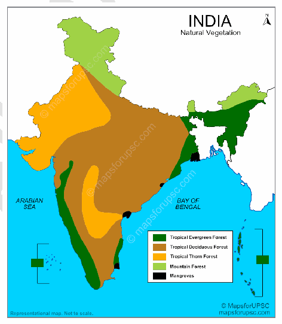

2. India contributes approximately **2% of the world's total forest area.** It has emerged as the **5th largest global carbon sink,** removing roughly **150 Mt of CO2** annually during the 2021-2025 period.

3. India and Indonesia together account for **70% of the global agroforestry area.**

4. The total carbon stock in India’s forests is estimated at **7,285.5 million tonnes,** marking an increase of 81.5 million tonnes from previous assessments.

5. **Regional Leaders-**

a. **By** Area-Madhya Pradesh, Arunachal Pradesh, and Chhattisgarh.

b. **By Percentage-Lakshadweep** (91%), Mizoram (85%), and Andaman & Nicobar Islands (82%).

**Resultant Impact on Climate Change**

**Positive Impacts**

1. **Carbon Sequestration-**

a. India’s forests have created an additional carbon sink of **2.29 billion tonnes of CO2 equivalent** since 2005.

b. This puts India on track to meet its Paris Agreement (NDC) target of 2.5-3 billion tonnes by 2030.

2. **Temperature Regulation-Dense** forest canopies in the Western Ghats and Northeast India play a critical role in maintaining regional micro-climates.

3. **Water Cycle Stability-Forests** act as biological sponges, regulating monsoon runoff, recharging groundwater and preventing flash floods during extreme precipitation events.

4. **Disaster Mitigation-Mangroves** act as a first line of defense against storm surges and tsunamis, particularly in the Sundarbans and Odisha coast.

5. **Soil Conservation-Dense** vegetation prevents topsoil erosion **Negative Impacts**

1. Research suggests that by 2085, nearly **77% of India's forested grids** could experience a shift in forest type (e.g., transition from temperate to tropical or moist to dry deciduous) due to rising temperatures.

2. **Increased Forest** Fires-Approximately **54.4%** of India's forest area is vulnerable to occasional fires.

Rising temperatures have made the peak fire season (February-May) more intense.

3. The spread of **invasive species** like **Lantana camara** now affects nearly **50% of forest lands,** suppressing native vegetation.

4. Infrastructure development has fragmented over **90,000 sq. km** of forest.

5. **Northeastern region** has seen a persistent decline in forest cover **(327 sq. km loss** in recent years) due to shifting cultivation and infrastructure.

**Government Efforts**

1. **Amended Forest Guidelines** 2026-allows non-government participation in restoring **2.08 lakh sq. km** of degraded forest land.

2. **Green Credit Program** to incentivize private and community-led afforestation on degraded lands.

3. **MISHTI** Scheme-Targeted restoration of **mangroves** across 540 sq. km.

4. **Nagar Van Yojana-Aimed** at developing **1,000 urban forests** to improve the micro-climate of cities by 2030.

5. **National Mission for a Green India (GIM)-One** of the eight missions under the NAPCC, focusing on enhancing ecosystem services and carbon sequestration.

6. **CAMPA** Funds-Utilizing Compensatory Afforestation funds for artificial regeneration and wildlife protection.

**Sustainable forest management, community participation and climate-resilient conservation strategies**

are needed to ensure forests continue to play a vital role in **India’s climate mitigation and adaptation efforts.**

---

1. Explanation_Drishti IAS:
Source Question: Examine the status of forest resources of India and its resultant impact on climate change.

According to the ‘India State of Forest Report 2019’ the total forest and tree cover in India is 80.73 million hectares which is around 24.56% of the total geographical area of the country. These forests and trees deliverimportant ecosystemgoods and services. Anymajor change caused in the available forestresources, directly or indirectly affects climate change.

### Forest Resources and Climate Change

- Different forest types are a gateway to different wood and non-wood forest resources. Forests also provide food, fiber, edible oils, and drugs. Forest is an important source of minerals and minor forest produce like tendu and honey.

- These forest resources in India despite being under protection laws suffer as open access resources. Due to this, almost 78% of the forest area issubjected to heavy grazing and other unregulated uses. Forests are also prone to illegal mining activities and slash and burn agricultural practices in certain areas. With increase in population, the pressure on forest resources have increased. This over-exploitation of resources has aggravated the impact of climate change.

- Forests help in carbon sequestration and oxygen enrichmentin environment.Unregulated use offorestresources and deforestation activities disturb the carbon cycle resulting in increase in globaltemperature levels. Thistranslates to change in wind pattern and precipitation levels.

- Climate change isincreasing the risk of droughtin some areas, while making many other areas prone to extreme precipitation and flooding situations. Increased temperature is increasing the melting rate of icebergs thereby resulting in increase in sea level and submergence of coastal areas and islands.

- Also, the unchecked forest resource utilization has resulted in frequent wildfires, storms, insect outbreaks, invasive species and diseases. The increase in human-animal conflict cases nowadays is also a result of over exploitation of forest resources.

- Thus, there is a close interrelationship between climate change and forests. The issue of unchecked human activities in forest areas needs to be addressed in a holistic manner not only at local level but also at global level. Making plantation mandatory along highways, road dividers, vacant land along railway tracks, etc. coupled with promoting sustainable usage of forest resources will serve the purpose.

---

1. Explanation_PWOnlyIAS:
Source Question: Examine the Status of forest resources of India and its resultant impact on climate change.

| **Approach:** **Introduction**  • Write the findings of the Forest Survey report. **Body**  • Status of forest resources in India.  • Significant impact on climate change.  • Vulnerable to the effects of climate change. **Conclusion**  • Conclude your Answer with the importance of Forest. |
| --- |

### Introduction

**According to the** India State of Forest Report 2019 **, the Indian forest cover is** around 24.56% **of its total geographical area. The country has lost around** 9.38 million hectares **of forest cover between 1991 and 2019.** Body: **Forests are a critical natural resource in India, providing numerous ecological, economic, and social benefits. They are home to diverse flora and fauna, regulate local weather patterns, and provide livelihoods to millions of people.**

**Status of forest resources of India as follows.**
- **Mangrove cover:** Mangroves are a vital ecosystem that plays a crucial role in coastal protection, carbon sequestration, and supporting biodiversity. Mangroves cover an area of **around 4,975 square km**. E.g. Sundarbans delta in the Bay of Bengal being the largest mangrove forest in the world.
- **Bamboo Cover:** Bamboo is a fast-growing and renewable resource in India’s economy and environment. India has the largest area under bamboo cultivation in the world, covering around **2 million hectares**.
- **Increase in forest and tree cover:** According to the **India State of Forest Report 2019**, Forest and tree cover increased by 13,000 square km. The government has implemented various afforestation and reforestation initiatives. Like the Green

**India Mission and the National Agroforestry Policy.**
- **Total carbon stock:** The total carbon stock in Indian forests is around 7,124 million tonnes. Deforestation and degradation of forests release carbon dioxide into the atmosphere, contributing to global warming. Preserving and increasing forest cover is crucial for mitigating climate change. **Significant impact on climate change:** Forests act as carbon sinks, absorbing and storing carbon dioxide from the atmosphere.

- They regulate local weather patterns and prevent soil erosion, desertification, and land degradation.
- Deforestation and forest degradation release carbon dioxide into the atmosphere, contributing to global warming. Preserving and increasing forest cover is crucial for mitigating climate change.
- The management of forest resources is crucial for the sustainable development of India, and efforts must be made to conserve and enhance their contribution to mitigating climate change.

**India is quite vulnerable to effect of climate change due to**
India is vulnerable to the effects of climate change due to its vast coastline, large population, and reliance on agriculture.
- The country is experiencing more frequent extreme weather events, such as droughts, floods, and heat waves.
- Melting Himalayan glaciers threaten the water supply of millions of people, while rising sea levels pose a threat to coastal areas.
- Climate change is expected to have significant impacts on India’s economy, food security, and public health.

### Conclusion

India’s forest resources play a crucial role in mitigating climate change and provide various economic, ecological, and social benefits. Deforestation and forest degradation pose a significant threat to the environment and exacerbate the effects of climate change.

---

1. Explanation_Superkalam:
Source Question: Examine the status of forest resources of India and its resultant impact on climate change.

Modern iron and steel industries have increasingly shifted away from raw material sources, driven by technological advancement and changing economic dynamics. This locational transformation reflects the evolution from traditional** resource-based **to** market-oriented **industrial patterns.

Iron and Steel Industry Location Scenarios

## Technological and Transportation Factors

-** Advanced Transportation Networks **-** Dedicated Freight Corridors **and efficient rail networks reduce raw material transportation costs
 -** Slurry pipelines **enable cost-effective iron ore transport (₹80-100 per 250km vs ₹2000-2500 by road)
 - Modern port infrastructure facilitates bulk handling of imported raw materials
 - Integrated logistics systems connect mines to distant steel plants economically
 - Multi-modal transport options provide flexibility in raw material sourcing

-** Import Dependency and Global Sourcing **- Access to** high-quality imported coking coal **(80% of India's requirement)
 - Proximity to ports for importing iron ore and metallurgical coal
 -** Strategic coastal locations **for receiving Australian and Indonesian raw materials
 - Foreign technology transfer requiring specific locational advantages
 - Global supply chain integration necessitating port connectivity

## Market Proximity and Economic Drivers

- Higher transportation costs for finished steel products (₹8000 per tonne)
- Growing demand from** automotive and construction sectors **in urban areas
-** Expected steel demand growth of 8.5% **in 2025 driving market-oriented locations
- Reduced inventory costs through just-in-time delivery to consumers
- Direct customer access and customization capabilities

## Contemporary Examples of Relocated Industries

| Plant Location | Distance from Raw Materials | Strategic Advantages |
| --- | --- | --- |
|** JSW Vijayanagar, Karnataka **| 300km from iron ore mines | Port access, market proximity |
|** Essar Steel, Hazira Gujarat **| 500km from coal sources | Coastal location, export facilities |
|** Tata Steel Kalinganagar **| Away from Jharkhand mines | Better infrastructure, port connectivity |

-** JSW Steel **at Dolvi, Maharashtra utilizes imported raw materials
-** POSCO-India project **in Odisha focuses on export-oriented production
-** ArcelorMittal **plants prioritize port connectivity over mine proximity

## Policy and Environmental Considerations

-** National Steel Policy 2017 **promotes integrated steel hubs
-** Industrial corridor development **creating new locational advantages
-** Special Economic Zones **offering fiscal incentives for strategic locations
- Infrastructure development through** PM Gati Shakti **improving connectivity
-** Green steel initiatives **encouraging cleaner production locations

This locational shift reflects the steel industry's adaptation to globalized supply chains and market-driven economics, supported by** India's infrastructure modernization **and evolving industrial policies.

---

1. Explanation_Unacademy:
Source Question: Q17. Examine the status of forest resources of India and its resultant impact on climate change. (250 words, 15 marks) Tag: Distribution of Key Natural Resources across the world (including South Asia and the Indian sub-continent)

## **Decoding the Question** - **In Introduction, briefly bring out the state of** **forest resources in India and importance of** **forest resources.** - **In Body, elaborate the status of forest** **resources of India and resultant impact on** **climate change.** 

- **In Conclusion, state and mention the** **government’s commitment and need to** **preserve the forest resources.** **Answer:** Forests help mitigate the impacts of climate change, provide economic benefits for the country, and meet specific facets of India’s sustainable development goals. Besides driving sustainable growth, forests act as a naturalstabilizingagentfortheclimateastheyregulate thecarboncyclesignificantly.India’sStateoftheForest **Report (ISFR) 2019** states that **India’s forest cover has** **increased by 3,976 sq. km since 2017 a rise of 0.56%,** but for India to achieve its climate commitments, it would need to bring 33 percent of its geographical area under forest cover by 2022. **An examination of the status of forest resources of** ## **India as follows** - **Forest Cover of India:** The total forest cover of the country is 7,12,249 sq. km that is 21.67% of the geographical area of the country.

- **Increase in forest and tree cover:** The current assessment shows an increase of 0.56% of forest cover, 1.29% of tree cover and 0.65% of forest and tree cover placed together at the national level as compared to the previous assessment i.e. ISFR 2017.

- **Increaseinforestcoverinstates:Thetopfivestates** in terms of increase in forest cover are Karnataka, Andhra Pradesh, Kerala, Jammu & Kashmir, and Himachal Pradesh.

- **North-Eastern region:** Total Forest cover in the North-Eastern region is 1,70,541 sq. km that is 65.05% of its geographical area. The current assessment indicates a decrease of forest cover to the extent of 0.45% in the region. Except for Assam and Tripura, all the States in the region show a decrease in forest cover.

- **Mangrove cover:** Mangrove cover in the country has increased by 1.10% as compared to the previous assessment.

- **Total Carbon Stock in the forest:** In the present assessment, the total carbon stock in the forest is assessed as 7,124.6 million tonnes. There is an increase of 42.6 million tonnes in the carbon stock of the country as compared to the last assessment of 2017.

- **21.40% of the forest cover in India is ‘highly’ to** **‘extremely’ fire prone.** Fire prone forest areas of different severity classes have been mapped in the grids of 5km x 5km based on the frequency of forest fires. India’s first comprehensive climate analysis report, **‘Assessment of Climate Change over the Indian** **Region’,** emphasizes on the role of forests as effective mechanisms to mitigate climate change impacts.

## **The impact can be seen as following** - **Forest resources of India’s resultant impact on** ## **climate change** - Forests act as a natural stabilizing agent for the climate as they **regulate the carbon cycle** significantly.

 - Forests are the **only unique, safe and** **inexpensive carbon capture and storage** **technology** that is naturally available at scale with the potential to neutralize global CO 2 concentrations.

 - **Carbonsequestrationthroughphotosynthesis** is considered one of the most potent and inexpensive methods for climate change mitigation.

 - The 2019 report highlights increased tree cover, but, **according to the Global Forest** **Watch (GFW)** the percentage of intact forest in India accounted for **only about 6.7** **percent** as of 2016. This considerably **skews** the perception of the **actual capability of the** **Indian peninsula for carbon sequestering.** - For a highly resource-dependent country such as India, any severe degradation of forests would have **far-reaching ramifications** for the economy, food and water security, and climate solutions. According to a study by the **non-** **government TERI** (The Energy and Resource Institute), the degradation of India’s forests is **depriving the country of 1.4 percent of its** **GDP annually.** In an attempt to restore deforested and degraded land, India’s forest policy targeted forest and tree cover for over **33% of the total geographical area.** India has also taken up various other commitments, such as the **Nationally Determined Contributions, and the Bonn** **Challenge to minimize** the impact of climate change. GiventhecriticalstateofIndia’sforests,thegovernment and various stakeholders must demonstrate a sense of urgency in proper and serious implementation on the ground.

---

---

Q46. Assess the impact of global warming on coral life system with examples.
[Year: 2019] [Group: UPSC CSE] [Exam: Mains] [Stage: Mains] [Paper: Mains - GS 1]
[Subject: GEOGRAPHY]
[Section Group: Environmental Geography & Climate Dynamics]
[Microtopic: Geographical features and their location-changes in critical geographical features (including water-bodies and ice-caps) and in flora and fauna and the effects of such changes.]
[Subtopic: Flora and Fauna]
[Macrotag: Analytical]
[Microtag: Assess]

1. Explanation_Civilsdaily:
Source Question: Assess the impact of global warming on the coral life system with examples. [Year: 2019] [Marks: 10]

According to the **NOAA Coral Reef Watch,** approximately **84% of the world’s reefs** have been impacted by bleaching-level heat stress.

**Impact of Global Warming on Coral Reef Systems**

1. **Coral Bleaching due to Rising Sea Surface Temperature-** Eg- In **2025,** the **Great Barrier Reef** suffered its 6th mass bleaching since 2016.

2. **Ocean Acidification-** reduces the availability of calcium carbonate. Corals cannot build strong skeletons, leading to **skeletal fragility** and slower growth rates in regions like the **Lakshadweep Atolls.**

3. **Infectious Disease Outbreaks-** Warmer waters facilitate the spread of pathogens. Eg- **Stony Coral Tissue Loss Disease (SCTLD)** has devastated over 20 species across the Caribbean.

4. **Reduced Reproductive Success-** Heat stress causes "pollen-like" sterility in coral spawning.

5. **Altered Species Composition-** Slow-growing "boulder" corals are replacing fast-growing "branching" corals (like Acropora), leading to less diverse and functional reefs.

6. **Loss of Marine Biodiversity** - Coral degradation leads to the disappearance of **reef-dependent species such as fish, molluscs, and crustaceans.**

7. **Disruption of the Food Web-** As corals disappear, the fish populations that rely on them for food and shelter (like parrotfish and snappers) decline, affecting the entire marine food chain.

8. **Metabolic Stress and Starvation-** Without zooxanthellae, corals lose their primary food source.

Long-term heatwaves (lasting over 8 weeks) lead to total colony mortality.

9. Climate change intensifies **cyclones and storms,** which physically break coral structures.

**Way Forward to Protect Coral Reefs**

1. **Reducing Greenhouse Gas Emissions** - Limiting global warming through **implementation of Paris Agreement commitments** is essential for coral survival.

2. **Expansion of Marine Protected Areas (MPAs)** - Eg- **Great Barrier Reef Marine Park.**

3. Accelerating **Kunming-Montreal Global Biodiversity Framework and** the **30x30 goal** (protecting 30% of oceans by 2030).

4. **Coral Gardening and Restoration-** Eg- India’s **Gulf of Kutch** successfully reintroduced **Staghorn corals** using "Biorock" technology.

5. **Developing** heat-tolerant "super corals" that can survive temperatures **1.5°C-2°C** above current averages.

6. **Cryopreservation-** Storing coral sperm and larvae in "frozen vaults" to preserve genetic diversity for future restoration.

7. **Blue Carbon Credits-** Integrating coral reefs into carbon markets to provide financial incentives for coastal communities to protect them.

8. **Cloud Brightening-** using sea-salt spray to brighten clouds over reefs, reflecting sunlight and cooling the water below.

9. **AI-Driven Early Warning Systems-** Utilizing **NOAA’s Coral Reef Watch** which uses satellite data to predict bleaching up to 4 months in advance.

10. **Community-Led Co-management-** Empowering local fishers to act as reef stewards, ensuring sustainable tourism and fishing practices. Eg- **Coral Triangle Initiative** As marine ecologist **Sylvia Earle** observed, **“No water, no life; no blue, no green.”** Protecting coral reefs is therefore crucial for sustaining the health of the planet’s oceans and coastal ecosystems.

---

1. Explanation_Drishti IAS:
Source Question: Assess the impact of global warming on the coral life system with examples.

Coral life system harbour the highest biodiversity of any ecosystem globally and directly support over 500 million people worldwide.

However, over the last three years, coral reefs ecosystem around the world have suffered from mass coral bleaching events. They are now **among the most threatened ecosystems on Earth,** largely due to unprecedented global warming and climate changes, combined with growing local pressures.

### Impact of global warming on the coral life system

- As temperature rises, mass coral bleaching events and infectious disease outbreaks are becoming more frequent. The bleaching of the Great Barrier Reef in 2016 and 2017, for instance, killed around 50% of its corals.

- Bleached corals are likely to experience reduced growth rates, decreased reproductive capacity, increased susceptibility to diseases and elevated mortality rates.

- Ocean acidification, or increased CO2 levels has reduced calcification rates in reef-building and reefassociated organisms, causing their skeletons to become weaker and growth to be impaired.

- Sea level rise may lead to increases in sedimentation for reefs located near land-based sources of sediment. Sedimentation runoff can lead to the smothering of coral.

- Changes in storm patterns, due to climate change, may lead to stronger and more frequent storms that can cause the destruction of coral reefs.

- Changes in coral ecosystem also affect the species that depend on them, such as the fish and invertebrates that rely on live coral for food, shelter, or recruitment habitat.

- Changes in precipitation result in increased runoff of freshwater, sediment, and land-based pollutants contribute to algal blooms and cause murky water conditions that reduce light.

- Altered ocean currents lead to changes in connectivity and temperature regimes that contribute to lack of food for corals and hampers dispersal of coral larvae.

- It is also expected that there will be a gradual decrease in the quantity of marine plants such as phytoplankton in warmer waters, effectively reducing the amount of nutrients available to animals further along the food chain.

- In addition, the collapse of coral life system due to global warming can have direct impacts on tourism, aquaculture, and pharmaceutical industries as well as reduce the overall resilience of coastal communities.

### Way forward

- Limiting global average temperature to well below 2°C above pre-industrial levels, addressing local pollution and destructive fishing practices provide chance for the survival of coral life system globally. Also, transformation of mainstream economic systems towards circular economic practices can help in mitigating rising global temperatures.

- According to UNESCO, the coral reefs in all 29 reef-containing World Heritage sites would cease to exist by the end of this century if global warming is not reduced. Reinforcing commitments to the Paris Agreement may be mirrored in all other global agreements such as the Sustainable Development Goals. SDG 13, for instance, calls for urgent action to combat climate change and its impacts.

---

1. Explanation_PWOnlyIAS:
Source Question: Assess the impact of global warming on the coral life system with examples.

**Answer:**

| **Approach:** **Introduction**  • Start your answer with the importance of coral reefs. **Body**  • Discuss impact of global warming on the coral life system. **Conclusion**  • Conclude your answer with a futuristic approach. |
| --- |

### Introduction

**Coral reefs are some of the most diverse and important ecosystems on the planet, providing habitat for a quarter of all marine life. They are under threat from the effects of global warming, including rising sea temperatures, ocean acidification, and increased frequency and severity of storms.** Body: ****

**Impact of global warming on the coral life system:**
- **Coral Bleaching:** Rising ocean temperatures cause coral bleaching, where corals expel the symbiotic algae living in their tissues. This leads to a loss of color and can eventually result in the death of the coral if it is bleached for prolonged periods. **g The Great Barrier Reef in Australia** is a well-known example of a coral site that has been impacted by coral bleaching due to rising ocean temperatures.
- **Ocean Acidification:** Increased levels of carbon dioxide in the atmosphere lead to increased absorption of CO2 by the ocean, resulting in a decrease in pH and increased acidity. This can weaken coral skeletons, making them more vulnerable to damage from storms and other environmental stressors.
- **Coral Mortality:** Coral bleaching and other impacts of global warming can lead to widespread coral mortality, which can have significant impacts on the entire reef ecosystem. E.g

**The Caribbean has experienced widespread coral mortality due to bleaching, disease, and other effects of climate change.**
- **Loss of Biodiversity:** Coral reefs are home to a diverse array of marine life, and the loss of coral reefs due to global warming can lead to a loss of biodiversity in the surrounding area.
- **Economic Impacts:** Coral reefs are also important for local economies, providing food and income for millions of people around the world. The loss of coral reefs due to global warming can have significant economic impacts on these communities. **Way forward:
- The loss of coral reefs due to global warming can lead to a loss of biodiversity and have significant economic impacts on communities that rely on them for food and income.
- Urgent action is needed to reduce greenhouse gas emissions and protect coral reefs from the impacts of global warming.

### Conclusion

Global warming impacts on coral life are significant and complex, threatening ecosystems and millions who rely on them. Urgent action to reduce greenhouse gas emissions, better management, and conservation efforts offer hope for the future of these vital ecosystems.

---

1. Explanation_Superkalam:
Source Question: Assess the impact of global warming on the coral life system with examples.

Recent studies reveal that ocean temperatures have risen by 0.6°C since 1969, triggering unprecedented stress on coral ecosystems worldwide. Global warming represents the most significant threat to coral reef systems, which support 25% of marine biodiversity.

Coral Bleaching Three Stage Process Diagram

## Temperature-Induced Coral Stress

### Coral Bleaching Mechanisms

-** Thermal Stress Response**: When water temperatures exceed 1-2°C above normal for 4-6 weeks, corals expel symbiotic zooxanthellae algae, causing white bleaching
-** Metabolic Disruption**: Loss of algae eliminates 90% of coral's energy source, leading to starvation and potential death
-** Recovery Limitations**: Severely bleached corals require 5-10 years for full recovery under optimal conditions
-** Cascading Effects**: Bleached reefs lose structural complexity, reducing habitat for reef fish by 60-80%
-** Frequency Increase**: Bleaching events now occur every 2-3 years instead of historical 25-30 year intervals

### Ocean Chemistry Changes

-** Ocean Acidification**: Increased CO2 absorption reduces pH by 0.1 units since pre-industrial times, weakening coral skeletons
-** Carbonate Saturation**: Reduced availability of carbonate ions slows coral growth rates by 10-15%
-** Shell Formation**: Marine organisms struggle to build calcium carbonate structures in acidic conditions
-** Dissolution Risk**: Existing coral structures become vulnerable to chemical dissolution
-** Synergistic Impact**: Combined warming and acidification create compound stress beyond individual effects

## Regional Impact Examples

### Great Barrier Reef, Australia

-** 2016-2017 Bleaching**: Consecutive mass bleaching events killed 50% of shallow-water corals
-** Northern Section**: 70% coral mortality in pristine northern areas previously unaffected by human activities
-** Economic Loss**: Tourism and fishing industries lost AUD 6 billion annually
-** Recovery Challenges**: Ongoing heat stress prevents natural regeneration cycles

### Indian Ocean Systems

-** Lakshadweep Islands**: 2023 marine heatwave caused 85% bleaching across Kavaratti and Minicoy atolls
-** Andaman & Nicobar**: Rising temperatures stress 572 coral species, with staghorn corals most vulnerable
-** Gulf of Mannar**: Temperature increases of 1.5°C above average triggered widespread bleaching in 2024

### Caribbean Region

-** Mass Bleaching 2023**: Record-breaking temperatures affected 90% of coral reefs from Florida to Venezuela
-** Elkhorn Coral Decline**: Populations reduced by 98% since 1980s due to repeated thermal stress
-** Hurricane Interaction**: Weakened corals show reduced resilience to physical storm damage

Current warming trends indicate that** 50% of coral reefs may disappear by 2030 **without immediate climate action. Conservation initiatives like Australia's** Reef Restoration and Adaptation Program **and India's** coral transplantation projects **offer hope, but require global temperature stabilization under** Paris Agreement targets **to ensure long-term coral ecosystem survival.

---

1. Explanation_Unacademy:
Source Question: Q4. Assess the impact of global warming on coral life system with examples. (150 words, 10 marks) Tag: Geography, Climate Change.

## **Decoding the Question** - **In Introduction, try to briefly write about the** **coral and global warming.** - **In Body, write the impact of global warming** **on coral reefs.** - **In Conclusion, try to write about the** **importance of corals and conservation** **measures.** **Answer:** Coral, a tiny fleshy sea polyp, is an indicator of the health of marine ecosystems. It harbors the highest biodiversity in the world but is **the most threatened** **ecosystem in the world according to the IUCN** **reports.** Coral reefs are experiencing massive die-outs all around the world, **around 50-70% of coral reefs** **are directly affected by anthropogenic global climate** **change.** ## **Impact of Global Warming on Coral Reefs** - Global warming imposes a severe threat to coral life. Due to rise of global temperature the ocean dynamics may face disorder which can be detrimental for marine ecosystems. Another major impact of global warming is an increase in sea surface temperature. This compels coral to die out.

- **Coral reefs would decline by 70-90 % with** **global warming of 1.5 degrees,** whereas virtually all (more than 99%) would be lost with a rise of 2 degree compared with preindustrial times**according to IPCC reports. Examples: Lord Howe** **Island,** affected due global warming in 2019, **Great** **Barrier Reef of Australia** Coral bleaching was reported in 2016-17 etc.

- Research shows that an increase of 1 to 3°C in sea surface temperature will cause widespread mortality and more frequent bleaching.

- The **increase in the levels of CO2 in oceans can** **cause ocean acidification,** it impacts the ability of corals to make calcium carbonate. Example: Red Sea reef etc.

- Corals need water that has a specific salinity and low turbidity, and these changes in weather create an environment that does not support healthy coral.

- The global warming **influxes freshwater, increases** **sedimentation and changes the salinity** of the ocean water, through the frequent phenomenon likeElNiño–SouthernOscillation(ENSO),stormgenerated precipitation etc. Coral reefs are an essential ecosystem to this planet and to lose them would be detrimental on many levels. Climate change and global warming are the key causes of problems associated with coral reefs. More research and data need to be conducted to discover the other factors of coral bleaching and its restoration. **New technology like Bio rock can be used** **to build new coral colonies, it can help in enhancing** **the biodiversity of marine ecosystems and fulfil the** **Sustainable Development Goal 14 of protection of life** **below water.** 

---

---

Q47. Discuss the causes of depletion of mangroves and explain their importance in main- taining coastal ecology.
[Year: 2019] [Group: UPSC CSE] [Exam: Mains] [Stage: Mains] [Paper: Mains - GS 1]
[Subject: GEOGRAPHY]
[Section Group: Environmental Geography & Climate Dynamics]
[Microtopic: Geographical features and their location-changes in critical geographical features (including water-bodies and ice-caps) and in flora and fauna and the effects of such changes.]
[Subtopic: Flora and Fauna]
[Macrotag: Descriptive, Analytical]
[Microtag: Explain, Discuss]
##### Subtopic: Miscellaneous

1. Explanation_Civilsdaily:
Source Question: Discuss the causes of depletion of mangroves and explain their importance in maintaining coastal ecology. [Year: 2019] [Marks: 10]

**Mangroves** are **coastal ecosystems** composed of **salt-tolerant trees and shrubs** that thrive in **intertidal**

**zones of tropical** and **subtropical regions.**

As per the latest **India State of Forest Report (ISFR) 2023** and **2025-26** updates, India's mangrove cover stands at approximately **4,992 sq km** (0.15% of total land area).

**Causes of Depletion of Mangroves**

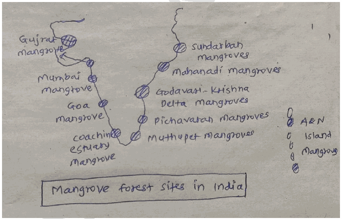

1. **Aquaculture Expansion-** The conversion of mangrove forests into commercial shrimp and fish ponds is the primary driver.

2. **Coastal Development and Urbanization-** Clearing for ports, highways, and luxury resorts in cities like **Mumbai** and **Panama City** leads to direct habitat loss.

3. **Reclamation of mangrove wetlands for farming.** Eg**Mangrove areas in Sundarbans cleared historically for paddy cultivation.**

4. **Global warming and Sea-Level Rise** - Changes in salinity and tidal patterns affect mangrove growth.

5. **Pollution-** Industrial effluents and plastic debris choke **pneumatophores** (breathing roots), causing asphyxiation of the trees.

6. **Over-exploitation for Fuelwood-** Local reliance on mangrove wood for charcoal and timber thins the canopy, preventing natural regeneration.

7. **Oil Spills-** Maritime traffic and offshore drilling leaks coat roots, preventing oxygen intake and killing local biodiversity.

8. **Invasive Species-** Aggressive plants like Prosopis juliflora (noted in **Tamil Nadu, 2026)** outcompete native species for nutrients.

9. **Climate Volatility-** Extreme events like the **2025 El Niño** caused massive "dieback" due to temporary sea-level drops and heat stress.

**Importance in Maintaining Coastal Ecology**

1. **Natural Disaster Buffer-** Mangroves can reduce wave energy by **up to 66%,** protecting inland areas from cyclonic storm surges and tsunamis.

2. **Blue Carbon Sequestration-** They store **4-10 times more carbon** per hectare than terrestrial tropical forests.

3. **Nursery for Marine Life-** Approximately **80% of global fish catches** depend directly or indirectly on mangroves as breeding and nursing grounds.

4. **Soil Stabilization-** Their intricate root systems trap sediments, preventing coastal erosion and "building" new land over time.

5. **Water Filtration-** Acting as "Kidneys of the Coast," they filter out heavy metals, pesticides, and nitrates from upland runoff.

6. **Protection of Coral Reefs-** By trapping silt and sediments, they prevent the "smothering" of adjacent coral reefs and seagrass beds.

7. **Biodiversity Hotspots-** They support unique species, such as the **Royal Bengal Tiger** in the Sundarbans and various endangered migratory birds.

8. **Nutrient Cycling-** Mangrove detritus (fallen leaves) forms the foundation of a complex food web that supports both marine and terrestrial fauna.

9. **Maintaining Water Quality-** Anaerobic bacteria in mangrove soil help in **denitrification,** reducing harmful nitrogen levels in coastal waters.

While initiatives like India's **MISHTI (2023-2026)** have shown success in community-led restoration, the survival of these ecosystems requires a shift from "extraction" to "stewardship."

---

1. Explanation_Drishti IAS:
Source Question: Discuss the causes of depletion of mangroves and explain their importance in maintaining coastal ecology.

Mangroves are salt-tolerant vegetation that grows in intertidal regions of rivers and estuaries. They are referred to as ‘tidal forests’ and belong to the category of ‘tropical wetland rainforest ecosystem’.

Mangrove forests occupy around 2,00,000 square kilometres across the globe in tropical regions of 30 countries. India has a total mangrove cover of 4,482 sq km. However, more than 35% of the world’s mangroves are already depleted.

### Causes of Depletion

- **Clearing:** Large tracts of mangrove forests have been cleared to make room for agricultural land, human settlements, industrial areas, shrimp aquaculture etc. As a result, mangroves get depleted to the tune of 2-8 percent annually.

- **Overharvesting:** They are also overexploited for firewood, construction wood and pulp production, charcoal production, and animal fodder.

- **Damming of rivers:** Dams built over the river courses reduce the amount of water and sediments reaching mangrove forests, altering their salinity level.

- **Destruction of coral reefs:** Coral reefs provide the first barrier against currents and strong waves. When they are destroyed, even stronger-than-normal waves reaching the coast can wash away the fine sediment in which the mangroves grow.

- **Pollution:** Mangroves also face severe threats due to fertilizers, pesticides, discharge of domestic sewage and industrial effluents carried down by the river systems.

- **Climate change:** Unusually low rainfall and very high sea surface and air temperatures caused severe threats to the survival of mangrove forests.

### Importance of mangroves in maintaining coastal ecology

- Mangroves are among the most productive terrestrial ecosystems and are a natural, renewable resource. For instance, Sundarbans in the Gangetic delta supports around 30 plant species of mangroves.

- Mangroves provide ecological niches for a wide variety of organisms. They serve as breeding, feeding and nursery grounds for fisheries and provide timber and wood for fuel.

- Mangrove forests act as water filters and purifiers as well. When water from rivers and floodplains flow into the ocean, mangroves filter a lot of sediments, hence protecting the coastal ecology including coral reefs.

- Mangroves act as shock absorbers. They reduce high tides and waves and protect shorelines from erosion and also minimise disasters due to cyclones and tsunami.

Given their importance, strict enforcement of the coastal regulation measures, scientific management practices and participation of the local community in conservation and management are essential for the conservation and sustainable management of the precious mangrove forests.

---

1. Explanation_PWOnlyIAS:
Source Question: Discuss the causes of depletion of mangroves and explain their importance in maintaining coastal ecology.

**Answer:**

| **Approach:** **Introduction**  • Start your answer with the importance of mangroves with Data. **Body**  • Discuss the reason for decline in mangroves and its Significance. **Conclusion**  • Conclude your answer with a futuristic approach. |
| --- |

### Introduction

** Mangroves are an important part of coastal ecosystems, providing a range of ecological, economic, and cultural benefits. Despite their importance, mangroves have been subject to significant depletion in recent decades, with estimates suggesting that up to 50% of mangrove forests have been lost globally.

### Body

**Reason for the decline in mangroves:**
- **Deforestation:** Mangrove depletion is deforestation, which is driven by the conversion of mangrove forests to agriculture, aquaculture, and urbanization. Like Sundarbans, a mangrove forest in Bangladesh.
- **Climate Change:** Climate change has had a significant impact on mangroves, with rising sea levels and changes in precipitation patterns leading to the loss of coastal habitats. E.g

**Climate change has also led to rising sea levels, which is causing saltwater intrusion and killing off the mangroves.**
- **Pollution:** Pollution, particularly from oil spills, can have a devastating impact on mangroves, destroying habitats and affecting the health of marine life. The emergence of shrimp farms has caused about **35%** of the overall loss of mangrove forests.
- **Overfishing:** Overfishing can disrupt the ecological balance of mangrove ecosystems, reducing the abundance of fish and other marine life.

**Significance of mangroves:**
- **Shoreline stabilization:** Mangroves serve as a natural buffer against coastal erosion, helping to stabilize shorelines and prevent the loss of land to the sea.
- **Biodiversity conservation:** Mangroves provide habitats for a diverse range of plant and animal species, including many that are endangered or threatened. They serve nurseries for juvenile fish and other marine life.
- **Carbon sequestration:** Mangroves are highly effective at storing carbon, making them important allies in the fight against climate change. They can store **up to five times** more carbon per hectare than tropical forests.
- **Coastal protection:** Mangroves can help to mitigate the impact of storms and natural disasters, reducing the risk of damage to coastal communities.
- **Economic benefits:** Mangroves provide a range of economic benefits to local communities, including timber and non-timber forest products, as well as fisheries and tourism.

### Conclusion

Mangroves are vital, but threatened ecosystems. Depletion caused by human activities has significant implications for coastal ecology. Conservation, sustainable management practices, and restoration are needed to ensure their long-term health and resilience.

---

1. Explanation_Superkalam:
Source Question: Discuss the causes of depletion of mangroves and explain their importance in maintaining coastal ecology.

Recent satellite data reveals that** India has lost 40% of its mangrove cover **since 1980s, highlighting an urgent ecological crisis threatening coastal stability.

Coastal Mangrove Ecosystem Cross Section Diagram

## Causes of Mangrove Depletion

### Natural Factors

-** Climate Change Impacts**: Rising sea levels (3.3mm annually) and intensifying cyclones cause coastal erosion and habitat destruction
-** Salinity Fluctuations**: Altered freshwater discharge patterns disrupt optimal salinity levels (15-30 ppt) required for mangrove survival
-** Coastal Erosion**: Natural tidal action and wave energy, particularly in** Sundarbans **where** 7.5 sq km **eroded annually
-** Extreme Weather**: Frequent storms and droughts affecting regeneration capacity
-** Sedimentation Changes**: Altered river flow patterns disrupting natural sediment deposition

### Anthropogenic Pressures

-** Aquaculture Conversion**: Coastal shrimp farming expanded to** 1.24 million hectares**, destroying mangrove nurseries
-** Urban Development**: Port construction and coastal infrastructure development, evident in** Mumbai **and** Chennai **coastlines
-** Industrial Pollution**: Untreated effluents from petrochemical and textile industries degrading water quality
-** Agricultural Expansion**: Rice cultivation and salt production encroaching mangrove areas
-** Overexploitation**: Excessive harvesting for timber, fuelwood, and construction materials

## Importance in Coastal Ecology

### Biodiversity Conservation

-** Species Habitat**: Home to** 2,100 plant species **and critical breeding grounds for marine life
-** Migratory Routes**: Essential stopover points for** over 200 bird species **including flamingos and pelicans
-** Endemic Species**: Supports unique fauna like** Royal Bengal Tiger **in Sundarbans and** saltwater crocodile **-** Marine Nurseries**:** 80% of global fish catch **depends on mangrove ecosystems for reproduction
-** Food Web Support**: Base of complex coastal food chains supporting both terrestrial and marine organisms

### Coastal Protection Services

-** Storm Buffering**: Reduces wave energy by** 70-90%**, protecting against cyclones and tsunamis
-** Erosion Control**: Root systems stabilize shorelines, preventing coastal land loss
-** Flood Mitigation**: Acts as natural sponges absorbing excess water during high tides
-** Sediment Trapping**: Filters sediments maintaining coastal water clarity and preventing siltation
-** Wind Resistance**: Provides natural windbreaks reducing wind speeds by** 75% **### Climate Regulation

-** Carbon Sequestration**: Stores** 4 times more carbon **than tropical rainforests (**1,023 tons per hectare**)
-** Blue Carbon Ecosystem**: Contributes** 10% of global oceanic carbon burial **despite covering only** 0.1% of Earth's surface **-** Temperature Moderation**: Coastal cooling effects reducing local temperatures by** 2-8°C **-** Oxygen Production**: Photosynthetic activity contributing to atmospheric oxygen levels
-** Greenhouse Gas Regulation**: Natural carbon sinks mitigating climate change impacts

|** Ecosystem Service **|** Economic Value (₹/hectare/year) **|** Example Location **|
| --- | --- | --- |
| Coastal Protection | 8.5 lakhs | Gujarat mangroves |
| Fisheries Support | 2.1 lakhs | Kerala backwaters |
| Carbon Storage | 1.3 lakhs | Sundarbans |
| Tourism Revenue | 95,000 | Andaman mangroves |

Protecting mangrove ecosystems through** Mangrove Cell initiatives **and** CAMPA funds **allocation becomes crucial for maintaining coastal resilience and supporting** 6 million coastal livelihoods **dependent on these invaluable ecosystems.

---

1. Explanation_Unacademy:
Source Question: Q5. Discuss the causes of depletion of mangroves and explain their importance in maintaining coastal ecology. (150 words, 10 marks) Tag: Geography, Climate Change.

## **Decoding the Question** - **In Introduction, try to briefly write about the** **mangroves and their depletion.** - **In Body,** - **Mention the importance of Mangrove in** **maintaining the coastal ecosystem.** - **Write about the causes of degradation of** **mangrove ecosystem** - **In Conclusion, try to write about the** **importance of mangroves.** **Answer:** Mangrove is a unique kind of vegetation found in the coastal intertidal zone. It is an ecosystem that is a conglomeration of different flora, fauna, and abiotic elements. **According to a survey of Indian Institute of** **Science researchers, India has lost 40 % of mangrove** **area in the last century.** The United Nations Food and Agriculture Organization (UN FAO) published Global Forest Resources Assessment (FRA) for 2020, and depicts that at the global scale mangroves have decreased by 1.04 million between 1990 to 2020. **Importance of Mangrove in Maintaining Coastal** ## **Ecology** - **Soil erosion:** Mangroves with the help of their unique adaptation support the soil of **stilt roots** the coastal region which is erosion prone due to its vulnerable location. Due to wind and wave action loosely bound soil particles move easily causing soil erosion. Mangrove helps in preventing this erosion.

- **Marine Ecosystem:** Mangrove is a crucial part of marine ecosystem as it represents a whole ecosystem containing animal, plant, environment, food chains, food webs etc. It provides a safe and

 favourable environment for breeding, spawning, rearing of several fishes.

- **Nutrient cycling:** Cycling of some essential nutrients are crucial for mangrove productivity. It collects sediments from rivers before they confluence towards estuaries.

## **Various Causes of Depletion of Mangrove** - **Shock absorbers:** Mangroves reduce high tide thus preventing flood, erosion.

- **Livelihood:** It is a major source of forest produce in coastal regions creating livelihood for coastal people, through fisheries, tourism, forest products etc. and provides numerous employment opportunities to local communities.

- **Natural causes** - **Global warming:** Due to global warming the sealevelgoesupcausingfloodsandsubduction of coastal regions including mangroves.

 - **Coastal Erosion and storms:** High rate of coastal erosion hinders mangrove growth.

 - **Siltation:** Rivers are at its mature stage near mangroves. Siltation from rivers can damage the growth of mangrove.

 - **Nutrient depletion:** Lack of several nutrients like phosphorus, nitrogen may hinder the growth of the mangrove ecosystem.

 - **Forest fire:** Excessive dryness can cause forest fires which may destroy the mangrove vegetation.

 - **Change in the ocean circulation pattern and** **rainfall also affect growth of mangroves, by** **affecting** propagule dispersal and the genetic structure of mangrove populations.

- **Anthropogenic causes** - **Overexploitation:Deforestation,Overgrazing,** Exhaustive resource collection can deplete the mangrove cover.

 - **Pollution:** Industrial development, riverine aquaculture, agriculture may dispose of pollutants such as fertilizer, pesticides, waste water, domestic wastes, and industrial garbage into the mangrove region.

 - **Cultivation:** Coastal agriculture, shrimp culture can impose threat on mangrove vegetation.

 - **Management:** Proper management of coastal ecosystem or mangrove is essential such as identification of soil texture, skilled human force for successful management, land utilization etc.

 - **Ballistic water issue:** Water transported from one region to the other causes extinction of natural resources by spreading various invasive species. Mangroveisanecotonebetweenterrestrialandaquatic ecosystems. So, due to the edge effect, the number of species is higher in this region. To maintain balance in the ecosystem prime focus should be given to development of mangrove. By involving local coastal communities, strict implementation of laws, proper monitoring technologies etc. can help in protecting both marine ecosystems and mangroves.

---

---

Q48. How does the Juno Mission of NASA help to understand the origin and evolution of the Earth?
[Year: 2017] [Group: UPSC CSE] [Exam: Mains] [Stage: Mains] [Paper: Mains - GS 1]
[Subject: GEOGRAPHY]
[Section Group: Environmental Geography & Climate Dynamics]
[Microtopic: Geographical features and their location-changes in critical geographical features (including water-bodies and ice-caps) and in flora and fauna and the effects of such changes.]
[Subtopic: Miscellaneous]
[Macrotag: Descriptive]
[Microtag: How]

1. Explanation_Drishti IAS:
Source Question: How does the Juno Mission of NASA help to understand the origin and evolution of the Earth? (2017)

With the principal goal to understanding the origin and evolution of Jupiter, the Juno spacecraft (NASA) was launched in 2011. Juno will study Jupiter much more thoroughly, given the array of nine scientific instruments that it carries on board.

The huge gas planet was likely the first planet formed and had a major impact on the formation of other planets. Like our sun, Jupiter is composed primarily of hydrogen and helium but is also imbued with other heavy elements fundamental to the creation of terrestrial planets.

By studying the atmosphere on Jupiter we can get an unprecedented insight into its origins and most importantly on the origins of other planets in our solar system including Earth. Once Jupiter’s current construction is known, it will then be possible to work out how, when and potentially where in the Solar System the first planet formed. The spacecraft will hunt for oxygen (in the form of water) in Jupiter’s atmosphere, which may also help explain how Earth got its water.

To summarize, we can expect to learn a wealth of information about Jupiter’s inner workings in the months and years to come. In discovering Jupiter, we’ll be discovering a part of ourselves.

---

1. Explanation_PWOnlyIAS:
Source Question: How does the Juno Mission of NASA help to understand the origin and evolution of earth?

| **Approach:** **Introduction**  • Start your answer with Juno Mission. **Body**  • Discuss the Juno Mission contributed to our understanding of Earth. **Conclusion**  • Conclude your answer with the importance of Juno Mission. |
| --- |

### Introduction

**The Juno Mission launched by NASA in 2011, aims to study Jupiter, the largest planet in our solar system. This mission also holds immense significance in understanding the origin and evolution of Earth, as Jupiter is believed to have formed around the same time as the Sun and the other planets.** Body: ****

**Juno Mission contributed to our understanding of Earth:**
- **Formation of the solar system:** Studying Jupiter’s composition, structure, and magnetic field, we can learn more about the conditions that existed during the solar system’s formation. This can help to better understand how Earth and the other planets in our solar system formed.
- **Magnetic field:** Jupiter’s magnetic field is incredibly strong and complex, and studying it can help us to better understand the Earth’s own magnetic field. The Earth’s magnetic field is crucial for protecting the planet from harmful solar radiation, and understanding its behavior is important for predicting and mitigating space weather events.
- **Water content of Jupiter:** One of the key objectives of the Juno Mission is to determine how much water is present in Jupiter’s atmosphere. This is important because water is a key ingredient for life as we know it, and understanding its distribution in our solar system can help us to better understand the likelihood of finding life on other planets.
- **Composition:** The heavy elements that are no longer present on Earth, but were present during the early formation of the solar system.
- **Atmosphere:** Jupiter’s distance from the Sun prevented solar winds from blowing away its hydrogen and helium. Consequently, Jupiter’s atmosphere evolved through a mechanism distinct from Earth’s atmosphere.

### Conclusion

The Juno Mission has provided significant insights into Jupiter’s composition, structure, and magnetic field, which has helped scientists understand the formation and evolution of not only Jupiter but also our entire solar system. The knowledge gained from this mission has contributed to our understanding of the early stages of planetary formation, and thus, the origin and evolution of Earth.
-

1. Explanation_Superkalam:
Source Question: How does the Juno Mission of NASA help to understand the origin and evolution of the Earth?

NASA's** Juno Mission **launched in 2011 provides crucial insights into Earth's formation by studying Jupiter's composition, structure, and evolution as our solar system's largest planet.

Jupiter's Interior Structure Cross Section Diagram

## Understanding Earth's Formation Through Jupiter's Composition

### Solar Nebula and Planetary Building Blocks

-** Primordial composition**: Jupiter's atmosphere contains original solar nebula materials (hydrogen, helium, water, ammonia) that formed all planets including Earth
-** Heavy element distribution**: Juno's data reveals how heavier elements were distributed during early solar system formation, explaining Earth's rocky composition
-** Isotopic ratios**: Jupiter's oxygen isotope ratios help understand the materials available during Earth's accretion 4.6 billion years ago
-** Water abundance**: Detection of water in Jupiter's atmosphere provides clues about water delivery to early Earth through comets and asteroids

### Magnetic Field Evolution and Planetary Dynamics

-** Dynamo processes**: Jupiter's complex magnetic field structure helps scientists understand how Earth's magnetic field originated and evolved
-** Core formation**: Juno's discovery of Jupiter's "fuzzy" core provides insights into how planetary cores, including Earth's iron-nickel core, formed through differentiation
-** Magnetosphere interactions**: Understanding Jupiter's magnetosphere helps explain how Earth's magnetic field protects our atmosphere from solar wind erosion

| Aspect | Jupiter (Juno Findings) | Earth Application |
| --- | --- | --- |
| Core Structure | Diluted, partially mixed | Models early Earth's core formation |
| Magnetic Field | Complex, time-variable | Explains geomagnetic field evolution |
| Atmospheric Loss | Minimal due to mass | Understanding early atmospheric retention |

### Gravitational Influence on Solar System Architecture

-** Planetary migration**: Juno's data supports theories about Jupiter's early migration, affecting Earth's orbital position in the** habitable zone **-** Asteroid belt formation**: Jupiter's gravitational influence shaped the asteroid belt, affecting bombardment patterns that influenced Earth's early evolution
-** Late Heavy Bombardment**: Understanding Jupiter's role helps explain the period of intense impacts that shaped Earth's surface and possibly delivered organic compounds

The** Juno Mission **continues providing revolutionary insights into planetary formation processes, directly supporting our understanding of Earth's origin and evolution within the broader context of solar system dynamics and the** Grand Tack model **of planetary migration.

---

1. Explanation_Unacademy:
Source Question: Q5. How does the Juno Mission of NASA help to understandtheoriginandevolutionoftheEarth? (150 words, 10 marks) Tag: Geography.

## **Decoding the Question** - **In Introduction, try to write about the Juno** **Mission briefly.** - **In Body,** - **Write how the Juno mission would** **help in understanding the origin and** **evolution of Earth.** - **In Conclusion, try to write the overall** **importance of the mission.** **Answer:** The Juno mission is the second spacecraft devised under NASA’s New Frontiers Program; it was launched in 2011 for understanding the origin and evolution of Jupiter. It will improve our understanding of the solar system’s beginnings by revealing the origin and evolution of Jupiter and enhance our knowledge about Earth. **How Juno Mission would help in Understanding** ## **Origin and Evolution of Earth** - It will determine how much water is in Jupiter’s atmosphere, which encourages determining whichplanet formation theoryiscorrect (or ifnew theories are needed).

- It would look deep into Jupiter’s atmosphere to measurecomposition,temperature,cloudmotions and other properties.

- It will prepare a map of Jupiter’s magnetic and gravity fields to reveal its deep structure.

- It will explore and study Jupiter’s magnetosphere near its poles, especially the auroras (Jupiter’s northern and southern lights), to provide new insights into how the planet’s enormous magnetic force field affects its atmosphere.

- It will reveal the fundamental processes and conditions that govern our solar system during its formation. As our primary example of a giant planet, Jupiter can also provide critical knowledge for understanding the planetary systems being discovered around other stars.

- Jupiter has the same ingredients as a star, but it did not grow massive enough to ignite. Studying their composition by Juno holds the key to reveal the heavy elements which are no more present in Earth’s system but were present at the time of creation.

- Unlike Earth, solar winds did not blow away Jupiter’s hydrogen and helium because of the distance factor. The mechanism of the formation of Jupiter is **vital to understand the origin of** **Earth’s atmosphere.** - At the time of evolution, atmospheric pressure converted Jupiter’s hydrogen into liquid and formed large oceans. Studying this will help to know Earth’s atmospheric gases.

- Jupiter’s gravitational influence is said to be so enormous that it affects the orbits of all planets. JUNO Mission’s gravitational readings will refine our understanding of Earth’s annual journey around the Sun. Juno uses Jupiter’s magnetic field, gravitational field and naturally occurring radio waves to study the mysterious interior of the giant planet. The spacecraft takes the first pictures of Jupiter’s polar regions and studies the vast auroras; this data will enhance our knowledge about earth formation and evolution.

---

---

Q49. South China Sea has assumed great geopolitical significance in the present context. Comment.
[Year: 2016] [Group: UPSC CSE] [Exam: Mains] [Stage: Mains] [Paper: Mains - GS 1]
[Subject: GEOGRAPHY]
[Section Group: Environmental Geography & Climate Dynamics]
[Microtopic: Geographical features and their location-changes in critical geographical features (including water-bodies and ice-caps) and in flora and fauna and the effects of such changes.]
[Subtopic: Miscellaneous]
[Macrotag: Analytical]
[Microtag: Comment]

1. Explanation_Drishti IAS:
Source Question: South China Sea has assumed great geopolitical significance in the present context. Comment. (2016)

South China Sea is a marginal sea of Pacific Ocean having the area of 3,500,000 square kilometer situated on the south of China. South China Sea has been “apple of discord” between US and China in international affairs for decades. Not only US-China rivalry but also regional countries have been motivated to involve on the territory as it’s one of the lucrative territories in both geopolitical and strategic dynamics. Now, it has become a global issue even small countries are involving vis-à-vis position. Philippine already has gone to Permanent Court of Arbitration against China and the court verdict is in favour of its claim.

**Geopolitical significance of South China Sea**

- South China Sea is the sea route for 50% global trade. It is the link between the Pacific Ocean and Indian Ocean. Malacca strait is the economical sea passage of Persian Gulf. Thus it becomes an imp Sea Lanes of Communications (SLOC) for US, China, Japan, Korean Peninsula and East Asian countries.

- It’s the territory where a vast number of gas, petroleum and mineral resources are preserved, hence SCS attains strategic place as energy store house, important for both developed and developing countries.

- South China Sea covers 12% of global fish products. China, Philippine, Vietnam etc produce a huge number of fisheries resources.

- There are some other valuable materials like Limonite, Monazite, Zircon, Cassiterite, Arenaceous quartz etc. which are very important raw materials for industries. South China Sea is also rich in salt.

While geopolitics indicates geographical relations with politics, it also has strategic importance. The power politics, military interests have made South China Sea important. The concept of Exclusive Economic Zone could be another conflicting zone between China and its neighbours.

---

1. Explanation_PWOnlyIAS:
Source Question: The South China Sea has assumed great geopolitical significance in the present context. Comment. [200 Words, 12.5 Marks]

| **Approach:** **Introduction**  • Write in brief about the south China sea. **Body**  • Significant or Significance of south China sea. **Conclusion**  • Conclude your answer with the importance of the south China sea. |
| --- |

### Introduction

**The South China Sea has become a significant geopolitical hotspot due to its strategic location. The region is home to more than 200 small islands, coral reefs, and atolls that are claimed by China, Taiwan, Vietnam, the Philippines, Malaysia, and Brunei. The dispute over territorial claims, freedom of navigation, and natural resources has raised tensions among regional and global powers.** Body: ****
**Significance of south China sea:** 

- **Territorial Claims:** The territorial claims in the South China Sea have been a long standing issue, with several countries claiming exclusive economic zones [EEZs] and rights over the islands and resources. China’s claim over the majority of the South China Sea, marked by the **nine-dash line,** has been contested by other countries and has led to tensions in the region.
- **Strategic Significance:** The South China Sea’s strategic location has made it a crucial sea route for trade and energy transportation, connecting major economies such as China, Japan, South Korea, and Southeast Asian countries. The region is also home to significant **oil and natural gas reserves, fisheries, and mineral resources**.
- **Geopolitical significance:** The conflicting territorial claims and strategic significance of the South China Sea have led to diplomatic and military tensions between the countries involved. The United States [US] has increased its military presence in the region, conducting freedom of navigation operations, and providing security assistance to its allies. China has responded by strengthening its maritime capabilities, building artificial islands, and asserting its territorial claims.
- **Environmental Concerns:** The South China Sea is facing environmental challenges due to pollution, overfishing, and coral reef destruction. These issues have threatened the region’s marine biodiversity and the livelihoods of millions of people who depend on its resources

### Conclusion

The South China Sea’s geopolitical significance is due to its location as a vital trade route, its rich natural resources, and the competing territorial claims among nations in the region. To ensure peace, stability, and sustainable development, a diplomatic and cooperative approach is necessary to resolve disputes and promote regional cooperation.

---

1. Explanation_Superkalam:
Source Question: The South China Sea has assumed great geopolitical significance in the present context. Comment.

The South China Sea has emerged as one of the world's most contested maritime regions, with overlapping territorial claims, strategic waterways, and vast economic resources creating unprecedented geopolitical tensions in contemporary international relations.

South China Sea Map Coastlines Outlined

## Strategic Maritime Importance

-** Critical Sea Lane**: Controls approximately** $5.3 trillion **worth of global trade annually, connecting Pacific and Indian Ocean trade routes
-** Chokepoint Geography**: Narrow straits and passages make it strategically vital for global shipping and energy supplies
-** Military Positioning**: Provides access to both the Indian Ocean and Western Pacific, crucial for naval power projection
-** SLOC Control**: Serves as primary** Sea Line of Communication (SLOC) **for East Asian economies
-** Gateway Function**: Links major economies including China, Japan, South Korea with Southeast Asian markets

(SK Map: South China Sea Trade Routes and Strategic Passages showing major shipping lanes, chokepoints, and naval bases)

## Territorial Claims and Disputes

|** Claimant **|** Claimed Features **|** Legal Basis **|** Key Tensions **|
| --- | --- | --- | --- |
| China | Nine-Dash Line (80-90%) | Historical claims | Artificial island construction |
| Philippines | West Philippine Sea | UNCLOS EEZ | Scarborough Shoal incidents |
| Vietnam | Paracel & Spratly Islands | Historical sovereignty | Oil rig confrontations |
| Malaysia | Southern Spratly features | Continental shelf extension | Fishing rights disputes |
| Brunei | Louisa Reef area | EEZ claims | Overlapping boundaries |

## Economic and Resource Significance

-** Hydrocarbon Reserves**: Contains estimated** 11 billion barrels of oil **and** 190 trillion cubic feet of natural gas **-** Fishing Grounds**: Provides** 12% of global fish catch**, supporting millions of livelihoods across littoral states
-** Rare Earth Minerals**: Seabed contains valuable** rare earth deposits **essential for modern technology
-** Trade Volume**:** 30% of global maritime trade **passes through these waters annually
-** Energy Security**: Critical for China's** 80% imported oil **transit route

## Current Geopolitical Dynamics

-** US-China Competition**:** Freedom of Navigation Operations (FONOPS) **by US Navy challenged by Chinese military responses in 2024
-** ASEAN Involvement**:** Code of Conduct negotiations **continue amid individual member state bilateral approaches
-** Recent Escalations**:** Second Thomas Shoal incidents **between Philippines and China intensified in 2024
-** Militarization**: China's construction of** artificial islands **with military installations alters regional balance
-** International Arbitration**:** 2016 Philippines vs. China tribunal **ruling remains unimplemented

The South China Sea's transformation from a regional maritime space to a global geopolitical theater reflects broader shifts in** 21st-century power dynamics**. Resolution requires balancing** UNCLOS principles **with regional stability and economic interdependence.

---

1. Explanation_Unacademy:
Source Question: Q16. South China Sea has assumed great geopolitical significance in the present context. Comment. (12.5 marks, 200 words) Tag: Distribution of key natural resources across the world (including South Asia and the Indian sub-continent).

## **Decoding the Question** - **In Introduction, try to write briefly about the** **reasons it is called the South China Sea and** **its importance.** - **In Body,** - **Elaborately examine the significance of** **the South China Sea.** - **Mention recent disputes over it and** **India’s position.** - **Conclude by suggesting what can be done** **to minimize the tension around the South** **China Sea.** **Answer:** The South China Sea is a **part of the Western Pacific** **Ocean.** It shares the boundary with the territory of South China that’s why it is called the South China Sea. It is a **region of tremendous economic and** **geostrategicimportance.Itisrichinnaturalresources** **and minerals** and has the potential to solve the energy deficiency of many nations. **The South China Sea Islands** comprises numerous **archipelagos, reefs,** that are subject to competing claims of **sovereignty by several countries.** China, Vietnam,Taiwan,Malaysia,thePhilippinesandBrunei all lay claims to these waters.

## **Geopolitical Significance in the Present Context** - **One-third of the world’s shipping** passes through here, carrying **over $3 trillion in trade each year,** makingthisstretchthesecond-mostusedsea-lane **in the world.** The main route to and from Pacific and Indian ocean ports is **through the Strait of** **Malacca and the South China Sea.** - As **for strategic resources,** the region has proven **oil reserves of around 7.7 billion barrels,** with an estimate of 28 billion barrels in all. **Natural gas** **reserves** are estimated to total around 266 trillion cubic feet.

- The most vital of them all, the **country controlling** **this maritime route** will have natural military advantages making this region the geopolitical pivot to controlling the rest of Asia.

- For China, the South China Sea also acts as a **natural shield** in terms of national security. It provides relative “sanctuary” for its second-strike nuclear submarines that would be its insurance in case of a first strike against it.

## **Recent Geopolitical Friction** - There has been an **ongoing territorial dispute** **betweenChina,Taiwan,Vietnam,thePhilippines,** **and Malaysia** concerning the ownership of the **Spratly Islands archipelago** and nearby geographical features like coral reefs etc.

- This geopolitical problem gained friction when **China began building artificial islands** in the South China Sea and took under its territory a major piece of the sea, which it separated with the **Nine-Dash Line.** This is a made-up line by China, also seen on the world map, which signifies the area in the South China Sea under China’s control.

- The USA **claims that the South China Sea is part** **of international waters** and China has no right to govern any part of it.

- The **United Nations Convention on Laws of the** **Sea (UNCLOS)** advocates similar rules that no country has any control on a region of high tide.

## **India’s Position** - Even though India is **not an active player in the** **high-stakes** jostle for the control of these waters, it will hardly remain an unaffected bystander in case the power structure there changes drastically.

- Over the past decade, China has been **using** **coercion on four major fronts:** in the East China Sea, South China Sea, China-India border, and toward the US on the question of freedom of navigation.

 - Of these, only the **border feud impacts India** **directly.** - Nearly **$200 billion worth of Indian trade** passes through the South China Sea and thousands of its citizens study, work and invest in the Association of Southeast Asian Nations (ASEAN) countries, China, Japan and the Republic of Korea. This makes it an area of **high strategic necessity for India.** - Access to the major waterways in Southeast Asia is an important consideration for Indian policymakers, as is the need to **build capacity in** **member states of the ASEAN and Indo-Pacific** **vision.** In recent times, there are lots of **geopolitical conflicts** **comingovertheSouthChinaSeaintermsofeconomic** interests, conflict of Interests, and the environment. TheissueoftheSouthChinaSeasituationcanbesolved when the bordering countries come together. There is a need for a **policy of co-engagement between major** **playerswithin theregion.Theirfulfilment** requiresthe employment of a combination of hard and soft levers of power, subtlety, and accommodation.

---

---

Q50. Mumbai, Delhi and Kolkata are the three mega cities of the country but the air pollution is much more serious problem in Delhi as compared to the other two. Why is this so?
[Year: 2015] [Group: UPSC CSE] [Exam: Mains] [Stage: Mains] [Paper: Mains - GS 1]
[Subject: GEOGRAPHY]
[Section Group: Environmental Geography & Climate Dynamics]
[Microtopic: Geographical features and their location-changes in critical geographical features (including water-bodies and ice-caps) and in flora and fauna and the effects of such changes.]
[Subtopic: Miscellaneous]
[Macrotag: Descriptive, Comparative, Applied]
[Microtag: Why, Compare, Problem]
##### Subtopic: Water Management

1. Explanation_PWOnlyIAS:
Source Question: Mumbai, Delhi and Kolkata are the three megacities of the country but the air pollution is a much more serious problem in Delhi as compared to the other two. Why is this so?[200 Words, 12.5 Marks]

**Answer:**

| **Approach:** **Introduction**  • Define air pollution and impact on Cities. **Body**  • Discuss the factors responsible for air pollution. **Conclusion**  • Conclude your answer with a summary of the answer with a futuristic approach. |
| --- |

### Introduction

**“Delhi has been consistently ranked as one of the most polluted cities in the world. In 2022, it was listed as the 4th most polluted city in the world, according to IQ Air’s World Air Quality Report.” Air pollution is contamination of the indoor or outdoor environment by any chemical, physical or biological agent.** Body: **Mumbai, Delhi, and Kolkata are the three most populous cities in India, and all three face significant air pollution challenges. Delhi’s air pollution problem is more severe than the other two cities.**

**Significant reasons:**
- **Geographical Location:** Delhi is situated in a landlocked area, with no nearby water bodies, while Mumbai and Kolkata are coastal cities. This geographic location of Delhi exacerbates the impact of pollution due to the absence of a natural outlet for pollutants.
- **Vehicular Traffic:** Delhi has a higher number of private vehicles compared to Mumbai and Kolkata. The high traffic density coupled with outdated public transportation infrastructure results in heavy traffic congestion, leading to more emissions.
- **Industrialization:** Delhi has a more significant number of small-scale industries and factories, which burn fossil fuels, emitting pollutants into the air. Mumbai and Kolkata have industrialized areas located outside the city, which reduces the impact of pollution on the city’s air.
- **Agricultural Residue Burning:** The practice of burning agricultural residue in the nearby states of Delhi is another major contributor to the city’s air pollution. **Example** :- stubble burning in Punjab and Haryana.

### Conclusion

Mumbai, Delhi, and Kolkata face significant air pollution challenges, Delhi’s problem is more severe due to several factors, including its geography, weather patterns, and urbanization trends. Delhi’s air pollution problem will require a multifaceted approach that considers both short-term and long-term solutions to improve air quality and protect public health.

---

1. Explanation_Superkalam:
Source Question: Mumbai, Delhi and Kolkata are the three Megacities of the country but the air pollution is a much more serious problem in Delhi as compared to the other two. Why is this so?

Delhi's air pollution crisis significantly exceeds Mumbai and Kolkata's levels due to unique geographical and meteorological disadvantages. Understanding these factors reveals why Delhi consistently ranks among the world's most polluted cities.

India's Major Cities Map: Delhi Mumbai Kolkata

## Geographical and Topographical Disadvantages

-** Landlocked Location**: Delhi's inland position lacks natural ventilation, unlike coastal Mumbai and Kolkata which benefit from** sea breeze circulation **that disperses pollutants effectively
-** Basin Topography**: Surrounded by** Aravalli Hills **and distant Himalayas, Delhi sits in a natural bowl that traps pollutants with limited escape routes
-** Indo-Gangetic Plain Position**: Located in the densely populated plain, Delhi receives pollution influx from neighboring industrial regions
-** Altitude Factor**: Delhi's higher elevation (216m) compared to Mumbai (14m) and Kolkata (17m) affects air circulation patterns
-** Urban Heat Island**: Extensive concrete development creates temperature variations that worsen pollution concentration

## Meteorological Conditions

-** Winter Inversions**: Cold surface air gets trapped under warm upper air, creating a** pollution cap **that prevents vertical mixing
-** Wind Speed Deficit**: Delhi experiences lower average wind speeds (8-12 km/h) compared to Mumbai's coastal winds (15-20 km/h)
-** Seasonal Stagnation**: Pre-winter months witness atmospheric stagnation with minimal air movement
-** Humidity Levels**: Lower humidity (60-70%) compared to Mumbai (75-80%) reduces natural pollutant washout
-** Temperature Extremes**: Sharp seasonal variations affect pollution dispersion mechanisms

## Anthropogenic and Regional Factors

-** Stubble Burning Impact**: Agricultural waste burning in** Punjab and Haryana **contributes 20-30% of Delhi's winter pollution
-** Trans-boundary Pollution**: Delhi receives pollutants from entire** National Capital Region (NCR) **covering 55,000 sq km
-** Vehicle Density**: Highest per capita vehicle ownership among the three megacities
-** Industrial Clustering**: Dense industrial activities in surrounding areas like Gurgaon, Faridabad, and Ghaziabad
-** Construction Boom**: Massive infrastructure projects generate significant** particulate matter (PM2.5 and PM10) **
**Recent Data Comparison (2024):** | City | PM2.5 (µg/m³) | AQI Average |
| --- | --- | --- |
| Delhi | 104.7 | 310-400 |
| Mumbai | 36.1 | 150-200 |
| Kolkata | 44.8 | 180-220 |

Delhi's unique combination of geographical disadvantages, meteorological conditions, and regional pollution sources creates a **pollution trap** effect. The **Commission for Air Quality Management (CAQM)** and **Graded Response Action Plan (GRAP)** represent ongoing efforts to address this complex challenge.

---

1. Explanation_Unacademy:
Source Question: Q15. Mumbai, Delhi and Kolkata are the three Megacities of the country, but the air pollution is a much more serious problem in Delhi as compared to the other two. Why is this so? (12.5 marks, 200 words) Tag: Urbanization.

## **Decoding the Question** - **In Introduction, start your answer with** **pollution and megacity.** - **In Body, discuss the reasons behind this** **pollution.** - **Conclude the answer with some positive** **suggestions.** **Answer:** Pollution is one of the most constant phenomena of Indian cities. All the mega cities in India undergo the problem of air pollution. But the toxic levels of air pollution in and around Delhi is creating quite a

## **menace. The reasons behind this soaring pollution are** - Delhi is landlocked, whereas Mumbai is surrounded by sea on three sides and Kolkata on twosides.So,thelevelofpollutionismoreinDelhi as the level of particulate matter and pollutants is not able to get discharged into the surrounding areas. But in Kolkata and Mumbai the pollutants are discharged into the surrounding large water bodies and the level of pollution over these cities comes to be less when compared to Delhi.

- National capital shares its border with the states of Haryana and Uttar Pradesh. Farmers burn rice stubbles in Punjab, Haryana and Uttar Pradesh. It is estimated that approximately 35 million tonnes of crop are set afire by these states. The wind carries all the pollutants and dust particles, which have got locked in the air.

- Unlike Kolkata and Mumbai, Delhi is landlocked. As the winter season sets in, dust particles and pollutants in the air become unable to move. Due to stagnant winds, these pollutants get locked in the air and affect weather conditions, resulting in smog.

- Delhi is close to industrial areas like Faridabad, Okhla and Noida industrial regions, whereas this is not the case with either Mumbai or Kolkata. The pollution level from the industries in nearby areas of Delhi has added more to the problem of Delhi. Thus, the geographical location of Delhi which we cannot alter has been disadvantageous for Delhi. People’s consciousness and efforts can really curb the man-made pollution in Delhi like pollution causing vehicles, burning of rice stubbles etc and shall enable to achieve Sustainable Development Goals.

---

---

Q51. The groundwater potential of the gangetic valley is on a serious decline. How may it affect the food security of India?
[Year: 2024] [Group: UPSC CSE] [Exam: Mains] [Stage: Mains] [Paper: Mains - GS 1]
[Subject: GEOGRAPHY]
[Section Group: Environmental Geography & Climate Dynamics]
[Microtopic: Geographical features and their location-changes in critical geographical features (including water-bodies and ice-caps) and in flora and fauna and the effects of such changes.]
[Subtopic: Water Management]
[Macrotag: Descriptive, Applied]
[Microtag: How, India]

1. Explanation_Civilsdaily:
Source Question: The groundwater potential of the gangetic valley is on a serious decline. How may it affect the food security of India? [Year: 2024] [Marks: 15]

The **Indo-Gangetic Valley** is home to one of the world's most prolific alluvial aquifer systems. Yet, according to the **United Nations (2025-26) reports,** several regions in this basin have crossed the "groundwater depletion tipping point."

**Declining groundwater potential**

- Nationwide, India extracts approximately 247 BCM of groundwater annually, more than China and the US combined.

- Groundwater storage in the Ganga basin is declining at an average rate of 2.6 cm per year. (CGWB)

- In Punjab and Haryana, nearly 78% of assessment units are categorized as "over-exploited." **Reasons Behind the Decline**

1. **Green Revolution Legacy-The** shift to High-Yielding Varieties (HYV) required 3-4 times more water than traditional seeds.

2. **Faulty Cropping** Patterns-Cultivation of water-guzzling crops like **Paddy** in semi-arid regions (Punjab/Haryana) where they are not ecologically suited.

3. **Energy Subsidies-Free** or heavily subsidized electricity leads to "blind pumping" in states like Punjab and Haryana.

4. **Inadequate Regulation-Under** the **Indian Easements Act 1882,** groundwater is tied to land ownership, allowing landowners to extract unlimited water without legal penalty.

5. **Rapid urban expansion** in cities like Delhi, Kanpur, and Patna has reduced the "pervious" area available for natural recharge.

6. **Climate Change & Monsoonal Shifts-Erratic** rainfall patterns mean shorter, more intense bursts of rain that run off rather than seeping into the ground.

7. **Inefficient Irrigation-Traditional Flood Irrigation** methods result in nearly **40% water wastage** through evaporation and runoff.

8. **Deforestation in Catchment Areas-Loss** of forest cover in the Himalayan foothills (Shivaliks) has disrupted the natural hydrological cycle that feeds the Gangetic aquifers.

9. **Industrial Contamination-Discharge** of untreated effluents reduces the "potable" potential of the remaining groundwater.

10. **Population Pressure-With** the IGP being one of the most densely populated regions globally, domestic demand has surged, competing directly with agriculture.

**Impact on Food Security**

1. **Yield Reductions-Studies** show a **1-meter decline** in the water table can lead to an **8% reduction** in food grain production.

2. **Threat to Staples-Punjab** and Haryana provide **50% of India’s rice** and **85% of its wheat,** depletion here directly threatens the National Buffer Stock.

3. **Increased Cost of Cultivation-Farmers** must drill deeper (up to 300-500 ft) and install expensive submersible pumps, leading to **rural indebtedness.**

4. **Punjab and Haryana supply a major portion of wheat and rice for the PDS. Reduced grain output affects government stocks.**

5. **Food Inflation-Reduced** supply and higher production costs lead to a spike in market prices, making food unaffordable for the poor.

6. **Quality Degradation (Nutritional Security)-As** water levels drop, concentrations of **Arsenic and Uranium** increase. These enter the food chain, compromising food safety.

7. **Land Degradation-Excessive** groundwater use leads to **soil salinization,** turning once-fertile alluvial tracts into barren "Usar" land.

8. **Reduced Cropping Intensity-Farmers** who previously grew three crops a year (Zaid, Kharif, Rabi) are being forced to skip seasons due to dry wells.

9. **Vulnerability of Small Farmers-While** wealthy farmers can afford deeper wells, marginal farmers lose access entirely, leading to **"de-peasantization"** and migration.

10. **Climate Instability-Without** groundwater, Indian agriculture becomes more dependent on the vagaries of the monsoon.

**Way Forward**

1. **Crop Diversification-Aggressively** shifting from Paddy to **Millets (Shree Anna),** pulses, and oilseeds in over-exploited blocks.

2. **Micro-Irrigation-Scaling** up the **"Per Drop More Crop"** initiative to make drip and sprinkler irrigation mandatory for water-intensive crops.

3. **Managed Aquifer Recharge** (MAR)-Utilizing the **Mission Amrit Sarovar** to rejuvenate 75,000+ local ponds to act as recharge pits.

4. **Power** Reforms-Transitioning from free electricity to **Direct Benefit Transfer (DBT)** for electricity.

5. **Unified Water** Governance-Implementing the **Mihir Shah Committee** recommendations to merge the CGWB and CWC into a single National Water Commission.

6. **Community-Led Management-Scaling** the **Atal Bhujal Yojana** model where villagers prepare "Water Security Plans" based on their local water budget.

7. **Legal** Reform-Updating the 19th-century Easement Act to treat groundwater as a **"Common Pool Resource"** rather than private property.

Aligning agricultural policies with **ecological limits and climate resilience** can ensure long term food security.

**Indian Geography**

---

1. Explanation_Drishti IAS:
Source Question: The groundwater potential of the Gangetic valley is on a serious decline. How may it affect the food security of India? (Answer in 250 words)

### Approach:

- Begin by giving a brief of the problem.

- Enlist the reasons for declining groundwater and explain how food security will be hampered with declining groundwater availability.

- Conclude by writing about how to address the issue.

### Introduction

The Gangetic valley, with its fertile alluvial soil and abundant water supply has supported dense populations for millennia, fostering civilizations and cultures. As per the Central Ground Water Board groundwater levels are declining at an alarming rate of 0.5 to 1 meter per year in this area.

### Body

**Reasons for Declining Groundwater**

- **Rapid Urbanization:** A rise in demand leads to over-extraction of groundwater. Unregulated drilling of borewells is a major cause.

- **Over-Irrigation:** A problem of abundance, this leads to detereorating soil health as well.

- **Inadequate Rainwater Harvesting:** Despite abundant monsoons, rainwater is lost instead of replenishing the groundwater.

- **Climate Change and Erratic Rainfall:** Irregular rainfall patterns, prolonged droughts, and increased evaporation due to rising temperatures hinder groundwater recharge.

**Food Security Amid Crisis**

- **Reduced Crop Yields:** With less groundwater available, farmers will face water shortages for irrigation, especially during dry seasons.

- This can lead to lower crop yields for water-intensive crops like rice and wheat, which are staples in India.

- **Increased Dependence on Rainfall:** As groundwater levels drop, farmers will rely more on unpredictable monsoons.

- Making agriculture more vulnerable to droughts and erratic rainfall patterns, resulting in unstable food production.

- **Higher Costs of Production:** Farmers may need to dig deeper wells or invest in more expensive water extraction methods, raising the cost of cultivation.

- This will in turn make food more expensive and less accessible, impacting affordability.

- **Loss of Livelihoods:** Declining groundwater could force small and marginal farmers to abandon agriculture, reducing agricultural output and threatening rural livelihoods, further affecting food security.

**Addressing Groundwater Decline**

- Promote Efficient Irrigation techniques like

**drip and sprinkler irrigation.**

- Implement **rainwater harvesting** systems in urban and rural areas to recharge groundwater levels.

- Shift from **water-intensive crops** like rice and sugarcane.

- Encouraging water efficient and technologically advanced

**methods of construction.**

- **Policy interventions:** such as providing **financial incentives** for farmers to adopt water-efficient technologies and practices is required.

- Proper implementation of river rejuvenation programmes such as Namami Gange, with addition of artificial recharge structures can help recharge groundwater.

### Conclusion

The decreasing groundwater potential in the Gangetic Valley threatens India's food security. Immediate actions are essential for sustainable groundwater management and adapting agricultural practices to secure the country's long-term food supply.

---

1. Explanation_PWOnlyIAS:
Source Question: The groundwater potential of the Gangetic valley is on a serious decline. How may it affect the food security of India?

| **Core Demand of the Question** ● Highlight that the groundwater potential of the gangetic valley is on a serious decline. ● Discuss how this decline may affect the food security of India. ● Suggest a Way Ahead |
| --- |

### Answer

**The** Gangetic Valley **plays a pivotal role in India’s total food production. However, this vital region faces a severe decline in groundwater levels due to** over-extraction **and** unsustainable agricultural practices, **jeopardising its ability to sustain crop yields and, consequently, the food security of millions across the nation.**

**Decline in Groundwater Potential of the Gangetic Valley:**
- **Over-extraction:** Excessive groundwater extraction for irrigation has led to a rapid depletion of aquifers, reducing the overall availability of groundwater.
  - **For instance:** The **Punjab region,** part of the larger Gangetic basin, has witnessed a significant drop in groundwater levels, with reports indicating a decline of over **1 metre per year** in some areas.
- **Pollution:** Agricultural runoff:** and industrial waste have contaminated groundwater sources, making them unsuitable for irrigation and affecting crop yields.
  - **For instance:** The Ganga river’s water quality in states like **Uttar Pradesh** has deteriorated due to industrial discharges, impacting both groundwater and surface water resources.
- **Urbanisation:** Increasing urban development in the region has **escalated groundwater usage,** further straining the already dwindling resources.
- **For example,:** Cities like **Kanpur** and **Varanasi** have seen rapid urbanisation, leading to over-extraction of groundwater to meet the needs of growing populations.
- **Climate Change:** Altered rainfall patterns due to climate change have reduced the natural recharge of aquifers, exacerbating groundwater depletion.
  - **For example:** The **erratic monsoon** patterns in **Bihar** have resulted in inconsistent groundwater replenishment, impacting farming practices.
- **Lack of Recharge Structures:** Inadequate implementation of rainwater harvesting and other groundwater recharge techniques has hampered efforts to restore groundwater levels.
- **Inefficient Irrigation Practices:** Outdated and inefficient irrigation methods, like **flood irrigation,** waste substantial amounts of water, compounding the decline in groundwater levels. **For instance**: **West Bengal,** where traditional irrigation methods are prevalent, water wastage has significantly contributed to the declining groundwater table.

**Effect on Food Security in India:**
- **Reduced Crop Yields:** Groundwater depletion in the Gangetic Valley directly limits irrigation, leading to significant crop yield reductions. **For example:** In **Haryana** and **Uttar Pradesh,** farmers have reported up to **30% lower yields** for staples like **paddy** and **wheat** due to insufficient water availability, posing a serious threat to food security in the region.

- **Increased Dependence on Rainfed Agriculture:** Reduced groundwater forces farmers in the Gangetic Valley to increasingly rely on rainfed agriculture, heightening risks during inconsistent monsoon seasons.
- **Crop Diversification Challenges:** The decline in groundwater restricts crop diversification in the Gangetic Valley where farmers heavily rely on water-intensive rice. **For example:** In **Punjab,** the depletion of groundwater discourages farmers from adopting less water-demanding crops like **pulses** and **maize**, threatening both **food diversity** and long-term agricultural sustainability.

- **Increased Dependence on Rainfed Agriculture:** Reduced groundwater forces farmers in the Gangetic Valley to rely more on rainfed agriculture, increasing vulnerability to erratic monsoons.
- **Threat to Livestock Farming:** Declining groundwater availability affects livestock health in the Gangetic Valley by limiting feed quality and quantity, reducing productivity in dairy and meat production, and exacerbating food security issues.
- **Long-term Sustainability Issues:** Continuous groundwater depletion threatens agricultural sustainability and future food security in the Gangetic Valley, with many districts facing potential water scarcity if current trends persist. ****

**Way Ahead:**
- **Promotion of Water-Efficient Crops:** Encourage farmers to shift towards less water-intensive crops like millets, pulses, and oilseeds, which require less water for growth.. **For example**: The Odisha government has promoted millet cultivation under the **“Millet Mission”** to reduce dependence on water-intensive rice.
- **Efficient Irrigation Techniques:** The adoption of water-saving techniques like drip irrigation and sprinklers can help reduce water wastage and improve groundwater management.. **For example**: The **Pradhan Mantri Krishi Sinchayee Yojana** (PMKSY) has introduced drip irrigation schemes in Gujarat, increasing water-use efficiency in farming.
- **Rainwater Harvesting and Recharge:** Strengthening rainwater harvesting systems and promoting groundwater recharge through check dams and ponds can help replenish groundwater reserves. **For example**: In Rajasthan, the **Mukhya Mantri Jal Swavlamban Abhiyan** has helped build check dams to recharge groundwater, improving water availability for agriculture.
- **Sustainable Agriculture Practices:** Integrating sustainable practices like crop rotation, conservation tillage, and organic farming can reduce water dependency and enhance soil moisture retention. **For example**: In Andhra Pradesh, farmers practising **Zero Budget Natural Farming (ZBNF)** have reduced water usage through mulching and natural fertilisers.
- **Policy Interventions:** Governments can introduce stricter regulations on groundwater extraction and provide subsidies or incentives for adopting water-efficient technologies. **For example**: Punjab has introduced **restrictions** on **early paddy transplantation** to prevent groundwater depletion, accompanied by incentives for farmers adopting sustainable practices.

To safeguard India’s food security, **immediate** and **collaborative efforts** are required, including sustainable groundwater management, water-efficient farming practices, and policy interventions. A **proactive approach** is essential to preserve the **agricultural backbone** of the Gangetic Valley and ensure long-term food sustainability for the nation.

---

1. Explanation_Superkalam:
Source Question: The groundwater potential of the Gangetic valley is on a serious decline. How may it affect the food security of India?

** Subject: **Indian Geography

The Indo-Gangetic Plain, India's agricultural backbone, is confronting an existential water crisis. According to the** UN Interconnected Disaster Risks Report 2023**, the basin has crossed the "groundwater depletion risk tipping point," threatening the collapse of entire food production systems.

Groundwater depletion in India

### Extent of Groundwater Decline in the Gangetic Valley

1.** Severe Over-extraction: **The** Central Ground Water Board (2024) **highlights critical unsustainability, with Punjab extracting** 156.36% **and Haryana** 136.75% **of their available groundwater.
2.** Irrigation Dominance: **An overwhelming** 94.74% **of extracted groundwater is diverted for irrigation, systematically draining deep aquifers.
3.** Overexploited Zones: **In Punjab alone,** 72.55% of assessment blocks **are officially categorized as over-exploited, rendering millions of agricultural tubewells increasingly unviable.
4.** Future Vulnerability: **The** WRI Aqueduct Water Risk Atlas 2023 **projects that continuous depletion in Northern India could cause agricultural production losses of up to 12% by 2050.

### Impact on India’s Food Security

1.** Threat to Buffer Stocks: **Plunging water tables in the 'breadbasket' directly endanger the procurement of rice and wheat, threatening the viability of the** Public Distribution System (PDS)**.
2.** Toxification of the Food Chain: **Depleting water levels concentrate heavy metals, leading the** NGT **to investigate rising** arsenic contamination in rice **grown in the Indo-Gangetic plains, compromising nutritional security.
3.** Yield Stagnation: **Insufficient irrigation during critical growth stages is causing stunted crops, leading to an estimated** 30% yield reduction **for staples in Western Uttar Pradesh and Haryana.
4.** Escalating Cultivation Costs: **As water tables plunge, farmers incur massive debts drilling deeper borewells, inflating food production costs and raising the Minimum Support Price (MSP) burden.
5.** Energy-Food Nexus Strains: **Pumping water from greater depths exponentially increases agricultural power consumption, threatening the subsidized power models states use to ensure food affordability.
6.** Soil Degradation: **Pumping deep, mineral-rich groundwater alters soil chemistry, progressively rendering fertile Gangetic soils saline, alkaline, and unfit for cultivation.
7.** Displacement of Marginal Farmers: **Unable to afford the lakhs required for deeper drilling, smallholder farmers are forced to abandon agriculture, threatening their household food security.
8.** Climate Vulnerability: **The loss of the groundwater buffer removes the primary insurance mechanism against erratic monsoons, causing extreme food production volatility.

### Way Forward for Sustainable Agriculture

1.** Strict Judicial Oversight: **Implementing stringent penalties against illegal extraction, aligning with the** Haryana High Court's 2024 **imposition of ₹157 crore in environmental compensation.
2.** Crop Realignment: **Promoting the rapid shift from water-guzzling paddy to climate-resilient** millets (Shree Anna)**, as advocated by the** Punjab Water Conservation Initiative Group (2024)**.
3.** Technological Adoption: **Scaling up** Direct Seeded Rice (DSR) **and micro-irrigation to reduce agricultural water demand by 40%, meeting obligations under** SDG 6.4**.
4.** Watershed Regeneration: **Prioritizing the** Watershed Development Component of PMKSY (2022–2026) **to aggressively scale up rainwater harvesting and aquifer recharge in rainfed regions.

To secure its food future, India must transition from a resource-intensive agricultural model to an ecologically sustainable paradigm. Treating groundwater as a shared national heritage, rather than an infinite private resource, is the only way to ensure food security for the next generation.

---

1. Explanation_Unacademy:
Source Question: Q14.The groundwater potential of the Gangetic valley is on a serious decline. How may it affect the food security of India? (250 Words 15 Marks)

**Introduction:** The Gangetic Valley is one of the most fertile and densely populated regions in the country.

 **Sources:** Central Ground Water Board - National Compilation on DYNAMIC GROUND WATER RESOURCES OF INDIA, 2023 **Gangetic Valley’s contribution to Indian Agriculture:** The Indo-Gangetic Plains (IGP) in India produce about 50% of the country’s food grains. The IGP is one of the world’s largest fluvial plains and is considered India’s “food bowl”. **Groundwater in Indian Agriculture:** A critical resource for agriculture in India, with over 60% of irrigated agriculture and 85% of drinking water supplies dependent on it **Body:** The overall stage of groundwater extraction in the country is 59.26%. Thestageofgroundwaterextractionisveryhighinthe States/UTs of Haryana, Punjab, Rajasthan, Dadra & Nagar Haveli and Daman & Diu where it is more than 100%, which implies that in these states the annual ground water consumption is more than annual extractable ground water resources. **Factor Contributing to Groundwater Decline** - High-yielding varieties during the Green Revolution

- Inefficient Irrigation Practices

- Urbanization and Industrial Use - Consumption Culture

- Population Growth

- Climate change - Changes in monsoon patterns affecting natural groundwater recharge **Consequences for India’s Food Security** - Lower groundwater levels - reduced Irrigation Capacity - lower yields - Lower agricultural productivity in the Gangetic Valley - decrease in the food grain production

- Decrease in grain supply - higher food prices unaffordable basic staples for poor

- Mismatch in demand and supply - dependance on imports of food grain

- It can limit the cultivation of a variety of crops, reducing dietary diversity. This limitation can lead to micronutrient deficiencies

- Over-extraction of groundwater - soil salinity

- reduced soil fertility- diminishing their productivity over time. **Conclusion:** Addressing the decline in groundwater potential

## **requires a multi-pronged approach** - **Regulate groundwater extraction** and **encourage** **rainwater harvesting and aquifer recharge.** - Encourage the adoption of micro-irrigation systems like drip and sprinkler irrigation to reduce water wastage.

- Promotingcultivationoflesswater-intensivecrops and improving market support for such crops to ensure farmer profitability.

- **Technological Innovations:** Utilising technology for better water management, such as remote sensing for monitoring groundwater levels and smart irrigation systems.

- **Reduce electricity subsidies to discourage water-** **intensive farming.** ---

---

Q52. Why is the world today confronted with a crisis of availability of and access to fresh- water resources?
[Year: 2023] [Group: UPSC CSE] [Exam: Mains] [Stage: Mains] [Paper: Mains - GS 1]
[Subject: GEOGRAPHY]
[Section Group: Environmental Geography & Climate Dynamics]
[Microtopic: Geographical features and their location-changes in critical geographical features (including water-bodies and ice-caps) and in flora and fauna and the effects of such changes.]
[Subtopic: Water Management]
[Macrotag: Descriptive, Applied]
[Microtag: Why, Today]

1. Explanation_Civilsdaily:
Source Question: Why is the world today confronted with a crisis of availability of and access to freshwater resources? [Year: 2023] [Marks: 10]

In **January 2026,** United Nations scientists formally declared the dawn of an **"Era of Global Water Bankruptcy,"** signaling that the world has exceeded its renewable hydrological limits.

**Fact File**

1. Approximately **4 billion people** (2/3rd of the global population) face severe water scarcity for at least one month every year.

2. Roughly **2.2 billion people** lack access to clean drinking water, leading to nearly **3.5 million deaths** annually.

3. **70% of the world’s major aquifers** are in long-term decline **Reasons for the Crisis of Availability**

1. Limited availability of freshwater - only 2% of global water resources are freshwater. 87% stored in glaciers.

2. Melting "Water Towers"-Eg- low-latitude mountain ranges have lost over 30% of their glacier mass since 1970, threatening the perennial flow of rivers like the Indus and Yangtze.

3. Hydrological Volatility-Climate change has intensified the water cycle, leading to "flash droughts" and "extreme precipitation."

4. Chronic Groundwater Over-extraction-Agriculture and industry are "mining" water faster than the earth can replenish it.

5. Water Quality Degradation-Over 80% of global wastewater is discharged into the environment untreated, contaminating remaining freshwater sources.

6. Deforestation and land degradation - Eg- Forested watersheds have lost up to 22% of their cover in the last 15 years, leading to increased sedimentation in reservoirs and reduced groundwater seepage.

**Reasons for the Crisis of Access**

1. Infrastructural Disrepair-aging or non-existent pipes and treatment plants limit access.

2. Lack of funding for water distribution infrastructure. Eg- Democratic Republic of Congo possesses 50% of Africa’s water but has a very low rate of per-capita access to potable water.

3. Urban-Rural Inequality-Infrastructure investment is disproportionately centered in affluent urban hubs, leaving rural areas behind.

4. Rapid, Unplanned Urbanization-Growth in "megacities" has outpaced the expansion of utility networks.

Eg- day zero in Chennai and Banglore

5. Institutional Failure & Corruption-Mismanagement of water utilities leads to high costs and unreliable service. Eg- tanker mafia in Pune To reverse the "global water bankruptcy," the way forward must include-

- Water-Smart Agriculture-Transitioning to drip irrigation and drought-resistant crops (like millets).

- Circular Water Economy-Mandatory recycling of industrial and municipal wastewater to "close the loop."

- Managed Aquifer Recharge (MAR)-Investing in "Sponge Cities" and artificial recharge

- Universal Water Governance-international treaty to protect transboundary basins.

---

1. Explanation_Drishti IAS:
Source Question: Why is the world today confronted with a crisis of availability of and access to freshwater resources?

Freshwater is essential for survival, health, and development. However, the world today is facing a crisis of freshwater. As per the UN, over 2 billion people live in countries with high water stress.

**Key reasons behind declining freshwater resources:**

- **Climate change:** Global warming disrupts the hydrological cycle, leading to precipitation shifts, glacier melt, droughts and floods, damaging freshwater resources.

- Cape Town’s “Day Zero” in 2018, where the city nearly ran out of water due to consecutive years of drought.

- **Over-extraction:** Overexploitation through irrigation, mining, and more, causing freshwater depletion and degradation.

- The Aral Sea, once the world's 4th-largest lake, has nearly vanished due to irrigation water diversion.

- **Pollution:** Polluting freshwater with untreated wastewater, industrial waste, agricultural runoff, and solid waste reduces its availability.

- Over 80% of wastewater is released without treatment, according to the UN.

- **Loss of natural reservoirs:** Harm to ecosystems that control water storage and filtration, like wetlands, forests, and aquifers.

- Lake Kolleru in Andhra Pradesh, is one of the largest freshwater lakes, but it's rapidly shrinking.

**Some remedial measures:**

- Promote water-saving practices like rainwater harvesting. (Tamil Nadu's 'Namma Ooru-Namma Veetu' initiative).

- Adopt water-efficient farming methods such as precision agriculture and conservation tillage.

- Use innovative solutions like smart irrigation systems and water-efficient appliances. ('Sarvajal' project's solar-powered water ATMs).

- Reduce water footprint through minimization, and offsetting of water use.

---

1. Explanation_PWOnlyIAS:
Source Question: Why is the world today confronted with a crisis of availability of and access to freshwater resources?

**Answer:**

| **Approach:** **Introduction**  • Start briefly with fresh water and its resources. **Body**  • Mention reasons behind the Crisis of Availability of Freshwater Resources  • Mention reasons behind the Crisis of Access to Freshwater Resources **Conclusion**  • Give appropriate conclusion in this regard |
| --- |

### Introduction

Freshwater resources encompass naturally occurring low-salt water sources like rivers, lakes, groundwater, and glaciers, serving vital human needs such as drinking, irrigation, industry, and ecological stability. **Yet, in the present world, about 1.1 billion lack consistent access to clean drinking water, and roughly 2.7 billion grapples with recurring water scarcity,** vividly highlighting the crisis in freshwater availability and access.

### Body

**Reasons Behind the Crisis of Availability of Freshwater Resources:**
- **Growing Demand vs. Limited Supply:** The world’s population is on a continuous rise, with **projections indicating an increase of nearly 2 billion people over the next 30 years**, leading to a surge in demand for freshwater resources, while the available supply remains relatively constant.
- **Climate Change and Altered Precipitation Patterns:** Climate change is causing shifts in weather patterns, leading to unpredictable rainfall and prolonged droughts in certain regions. This disrupts the natural replenishment of freshwater sources.

**For instance, in August 2023, India experienced an extraordinary shortfall in rainfall, amounting to 36% below the normal levels.**
- **Over-Extraction and Depletion of Aquifers:** Many regions are over-pumping groundwater faster than it can be naturally replenished, leading to the depletion of aquifers, which are critical sources of freshwater.

**For instance, if current patterns persist, it is projected that approximately 60% of India’s aquifers will be in a critical state within the next two decades.**
- **Pollution and Contamination:** Industrial, agricultural, and domestic activities release pollutants into freshwater sources, making them unsuitable for consumption and other critical uses.

**The World Bank reports that over 80% of wastewater in developing countries is discharged into rivers and lakes without treatment, leading to pollution.**
- **Inefficient Water Management:** Inadequate infrastructure for water storage, treatment, and distribution, as well as wasteful irrigation practices, contribute to the inefficient use of available freshwater resources. **An improperly maintained and operated automatic landscape irrigation system in a household has the potential to squander approximately 25,000 gallons of water each year.**

**Reasons Behind the Crisis of Access to Freshwater Resources:**
- **Inadequate Infrastructure:** Many regions lack the necessary infrastructure to provide freshwater to their populations, particularly in rural and marginalized communities.

**For example, even though the Democratic Republic of Congo possesses 50% of Africa’s water resources, it lacks access to potable water.**
- **Economic Disparities:** In many parts of the world, low-income communities struggle to afford the cost of water services.

**For instance, in urban slums of Mumbai, India, thousands of families are forced to rely on limited and often contaminated water sources due to the high price of clean water.**
- **Political and Social Conflicts:** Disputes over water rights, both within countries and between neighboring nations, can lead to restricted access to shared water resources,

**as exemplified by the ongoing conflict between Ethiopia, Sudan, and Egypt over the Grand Ethiopian Renaissance Dam on the Nile River.**
- **Natural Disasters and Conflicts:** Natural disasters, **such as floods and earthquakes**, and conflicts can disrupt water infrastructure, leading to restricted access to freshwater.
- **Lack of Education and Awareness:** Limited understanding of water hygiene and conservation practices hinder efforts to improve access to fresh water in certain communities.

### Conclusion

The urgency of addressing the crisis of availability and access to freshwater cannot be overstated, considering the vital role of freshwater in sustaining life, ecosystems, and socio-economic development. By implementing the proposed solutions and fostering collaboration among nations and communities, we can strive for a future where clean and accessible freshwater is available to all, thereby ensuring the well-being and sustainability of our planet.

---

1. Explanation_Rau IAS:
Source Question: Why is the world today confronted with a crisis of availability of and access to freshwater resources? (10 Marks, 150 Words)

### Introduction

Access to freshwater is a human right as it is not only essential for drinking, bathing, sanitation but also for industrial and food security purposes. According to Unicef, almost two-thirds of global population experiences severe water scarcity leading to child mortality, poor sanitation and hurting females and children.

### Body

**Reasons for reduced water availability:**

- Limited supply of freshwater as freshwater makes up only 1% of total global water supply.

- Skewed distribution of freshwater resources temporally and spatially. For ex. Monsoons concentrate 85% of India's precipitation in three-month period.

- Increasing global population even as water supply remains constant.

- Climate change induced water shortage

- Low water use efficiency, particularly in agriculture.

- Export of virtual water in the form of agricultural commodities like Rice and Sugarcane.

- Over-exploitation of groundwater resources

- Contamination of water with arsenic, cadmium etc. making it unusable.

**Reasons for crisis in access to freshwater:**

- Lack of proper water management and governance

- Inadequate investment and poor management of water supply infrastructure

- War and conflicts

- Forced migration

- Lack of cooperation on water among states and federal units

- Lack of adequate political focus on water issues.

### Conclusion

Thus, steps like identifying new water resources, improving efficiency of water resources, treating access to minimum quantity of water, mainstreaming use of wastewater, reducing wastage of water, promoting desalination in coastal areas, pricing of water and changing our behaviour towards water is required to improve both the access and availability of freshwater.

---

---

1. Explanation_Superkalam:
Source Question: Why is the world today confronted with a crisis of availability of and access to freshwater resources?

Freshwater constitutes** only 2.5% of the total water on Earth**, and** less than 1% **is easily accessible. Yet, demand for water has** tripled in the last 50 years **due to population growth, urbanisation, and industrialisation, leading to a freshwater** crisis both in terms of availability and access**.

Global freshwater crisis causes and effects

##** Causes of the Freshwater Crisis **1.** Unequal Geographical Distribution** - ~**60% of global freshwater** lies in just 10 countries (e.g., Brazil, Canada, Russia).
 - Water-stressed regions like the **Middle East**,** North Africa**, and** western India **face chronic shortages.

2.** Over-extraction of Groundwater **- India is the** largest extractor of groundwater**—more than China and the US combined (World Bank).
 -** Punjab’s water table **is falling by >1 metre annually.

3.** Climate Change and Glacial Melt **- Glaciers feeding rivers like** Ganga**,** Yangtze**, and** Mekong **are melting rapidly.
 - Erratic rainfall patterns cause** prolonged droughts **(e.g., Horn of Africa) and** flash floods **(e.g., Pakistan, 2022).

4.** Pollution of Water Bodies **- Industrial waste, sewage, and agricultural runoff pollute rivers and lakes.
 -** Yamuna **and** Citarum (Indonesia) **are among the world’s most polluted rivers.

5.** Rapid Urbanisation and Infrastructure Deficits **- Cities like** Jakarta **and** Bangalore **struggle with inadequate water supply and waste treatment.
 -** Leakages and theft **lead to 30–40% water loss in urban water systems.

6.** Population Growth and Rising Demand **- Global population is expected to reach** 9.7 billion by 2050**.
 - Water demand may rise by** 50% by 2030 **(UN Water Report).

7.** Unsustainable Agriculture Practices **- Agriculture consumes** ~70% of global freshwater**.
 - Flood irrigation and water-intensive crops (e.g.,** rice, sugarcane**) deplete aquifers—seen in** Maharashtra and Punjab**.

8.** Transboundary Water Disputes **- Rivers like** Nile**,** Tigris-Euphrates**, and** Indus **are shared by multiple countries.
 - Disputes over water allocation (e.g.,** India–Pakistan Indus Water Treaty**) hamper equitable access.

9.** Weak Governance and Regulatory Gaps **- Many countries lack** Integrated Water Resource Management (IWRM)**.
 - Poor implementation of policies like** Water (Prevention & Control of Pollution) Act, 1974 **in India.

The freshwater crisis reflects a complex interplay of** natural and anthropogenic factors**. A sustainable way forward involves** efficient water management, pollution control, equitable sharing, and climate-resilient infrastructure**.

---

1. Explanation_Unacademy:
Source Question: Q5. Why is the world today confronted with a crisis of availability of and access to freshwater resources? (10 Marks, 150 Words)

## **Approach** - **Introduction:** Present global freshwater scarcity data to set context.

- **Body:** Explain key reasons — population growth, climate change, urbanization, pollution,over-extraction,poormanagement, and unequal distribution.

- **Conclusion:** Suggest sustainable practices, technology, and cooperation linked with SDG-6. **Answer:** **Introduction:** Freshwater makes up only 3% of the world’s total water, of which nearly two-thirds is locked in glaciers or otherwise inaccessible. According to UNESCO, 2 billion people (26% of the global population) lack safe drinking water, while 3.6 billion (46%) are deprived of safely managed sanitation. This growing crisis of availability and access to freshwater has become one of the defining challenges of the 21st century. **Body** **Reasons for the Crisis of Freshwater Availability and** ## **Access** - **Population** **Growth:** Rising population, particularly in developing countries, reduces per capita water availability.

- **Climate Change:** Shifts in precipitation patterns, prolonged droughts, and frequent floods have destabilized water cycles.

- **Rapid Urbanization:** Escalating demand from expanding cities stresses already fragile water systems.

- **Water Pollution:** Industrial effluents, agricultural runoff, and untreated sewage contaminate rivers, lakes, and aquifers.

- Excessive **Over-Extraction and Depletion:** withdrawal of groundwater leads to falling water tables and aquifer depletion.

- **Ecosystem Degradation:** Loss of wetlands, lakes, and forests weakens natural water storage and purification functions.

- **Political and Economic Factors:** Mismanagement, weak governance, and transboundary disputes worsen water stress.

- **Unsustainable Practices:** Leaky distribution networks, inefficient irrigation, and waterintensive crops waste resources.

- **Unequal Distribution:** Geographic disparities and socio-economic inequalities make access difficult for vulnerable populations. According to the UN, for every 1°C rise in global average temperature, renewable water resources may decline by up to 20%. **Conclusion** Thefreshwatercrisisisbothanaturalandhuman-made problem that demands urgent attention. Solutions lie in sustainable water management, investment in modern infrastructure, watershed protection, and equitable international cooperation. Communitybased initiatives, grey-water management, and technological solutions such as desalination and water treatment plants are essential. Aligning policies with SDG-6 (Clean Water and Sanitation) will be critical in ensuring water security for present and future generations.

---

---

Q53. The interlinking of rivers can provide viable solutions to the multi-dimensional inter-relat- ed problems of droughts, floods and interrupted navigation. Critically examine.
[Year: 2020] [Group: UPSC CSE] [Exam: Mains] [Stage: Mains] [Paper: Mains - GS 1]
[Subject: GEOGRAPHY]
[Section Group: Environmental Geography & Climate Dynamics]
[Microtopic: Geographical features and their location-changes in critical geographical features (including water-bodies and ice-caps) and in flora and fauna and the effects of such changes.]
[Subtopic: Water Management]
[Macrotag: Analytical, Applied]
[Microtag: Critically examine, Problem]

1. Explanation_Civilsdaily:
Source Question: The interlinking of revivers can provide viable solutions to the multi-dimensional inter-related problems of droughts, floods and interrupted navigation. Critically examine. [Year: 2020] [Marks: 15]

**Interlinking of Rivers** refers to the transfer of water from **surplus river basins to deficit basins** through a network of canals and reservoirs. Proposed under the **National Perspective Plan (1980),** the project envisages

**30 river links (14 Himalayan and 16 Peninsular).**

**Significance of River Interlinking**

1. **Drought Mitigation-Eg- Ken-Betwa link** aims to irrigate **10.6 lakh hectares** in the drought-prone Bundelkhand region.

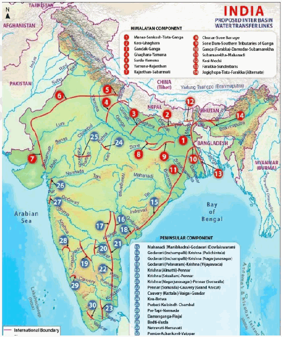

2. **Flood Control** by diverting excess monsoon flows from "surplus" rivers. Eg- Diverting water from the **Kosi-Mechi link** can alleviate the annual "Sorrow of Bihar."

3. **Year-round Navigation-Permanent** water levels in canals can facilitate a network of inland waterways. Eg- Linking **Godavari-Krishna rivers** may improve navigation along peninsular waterways.

4. **Hydropower Generation-Eg-** The ILR project is estimated to add **34,000 MW** to the national grid.

5. **Drinking Water Security-Ensures** a stable supply of potable water for growing urban and rural populations.

6. **Regional Water Balance - Redistribution helps address spatial inequality in water availability.** Eg- Water from **Mahanadi or Godavari basins** could support water-deficit areas of **TN and Karnataka.**

7. **Groundwater Recharge-Increased** surface water availability can reduce the "blind pumping" of aquifers.

8. **Agricultural Intensity-Allows** for multiple cropping seasons (Kharif, Rabi, and Zaid) in previously single-crop areas. Eg- in Bundelkhand and Marathwada regions

9. **Fisheries and Livelihoods-Creation** of new reservoirs provides opportunities for large-scale aquaculture.

10. **Salinity** Control-Freshwater diversion to deltas can prevent the ingress of seawater during low-flow seasons.

11. **Climate Resilience-Acts** as a "National Water Grid" to buffer against the erratic monsoons expected by 2026-2030.

**Challenges in River Interlinking**

1. **Ecological Disruption-Altering** natural river flows can destroy riverine habitats and aquatic biodiversity.

Eg- The Ken-Betwa link will submerge **98 km^2 of the Panna Tiger Reserve.**

2. **Questionable Surplus-Deficit Concept - Climate variability affects river flows.** Eg- Changing monsoon patterns may reduce flows in **so-called surplus rivers like the Brahmaputra**

3. **Social Displacement-Massive** land acquisition leads to the uprooting of indigenous and farming communities.

4. **Fiscal** Burden-Estimated costs exceed **₹5.5 lakh crore,** leading to concerns over debt-to-benefit ratios.

5. **Inter-State Disputes-Water** is a "State Subject," making consensus difficult between "donor" and "recipient" states.

6. **Sediment Starvation-Diverting** water also diverts silt, which is essential for maintaining deltas and soil fertility downstream.

7. **Water-Logging and** Salinity-Introduction of excess surface water in arid regions can lead to "alkalinization" of soil. Similar issues were seen after the **Indira Gandhi Canal** project in Rajasthan.

8. **International Complications-Interlinking** Himalayan rivers requires treaties with neighbors. Eg- Indus water treaty with Pakistan.

9. **Project Delays-Long** gestation periods often lead to massive cost overruns.

10. **Large projects may overshadow decentralized water management.** Eg- **Watershed development programmes in Maharashtra** have effectively addressed drought without large river transfers.

**Way Forward**

1. **Scientific Assessment of Water Surplus and Deficit** - Basin-level hydrological studies considering climate change impacts.

2. **Intra-State Prioritization-Focus** on smaller links within states (like Kosi-Mechi) to avoid federal and legal hurdles.

3. **Virtual Water** Trade-Optimize crop patterns so that water-rich regions grow thirsty crops, effectively moving water through food trade.

4. Implement **rainwater harvesting and watershed management** before resorting to inter-basin transfers.

5. Mandatory **drip and sprinkler systems** (Israel model) to ensure transferred water is used efficiently.

6. **Independent EIA** that goes beyond engineering feasibility.

A **balanced approach** is essential to ensure **long-term water security and environmental sustainability.**

---

1. Explanation_Drishti IAS:
Source Question: The interlinking of rivers can provide viable solutions to the multi-dimensional inter-related problems of droughts, floods, and interrupted navigation. Critically examine.

Unlike southern states,the northern plains of India are endowed with surplus water due to the presence of perennial rivers originating from the Himalayas. The river interlinking project aimsto link 60 riversso that water from the surplus basin to deficit basin can be transferred. The project aimsto link 60 rivers,some of which include Ken-Betwa, Daman Ganga-Pinjal, Mahanadi-Godavari.

### Proposed Benefits

- **Hydropower Generation:** The river interlinking project claims to generate a total power of 34 GW which will help India fulfil its growing requirements and commitment to the Paris Climate Deal.

- **Flood Control:** The objective is to conserve seasonal flows for irrigation, hydropower generation, and flood control. For instance, the linkage will transfer surplus flows of the Kosi, Gandak and Ghagra to the west.

- **Drought Mitigation:** The aim is to transfer water to drought-prone regions. A link with the Ganga and Yamuna is proposed to transfer the surplus water to drought-prone areas of Haryana, Rajasthan and Gujarat.

- **Round the Year Navigation:** As it would address the low levels of water in southern India’s rivers, it would provide around year waterways connectivity. Under the project, 10,000 km of navigation will be developed reducing the transportation cost.

- **Irrigation Benefits:** Interlinking of rivers will increase the country’s total irrigation potential. It will provide additional irrigation to 35 million hectares in the water-scarce regions.

### Concerns with the Project

- **Perennial Rivers are not so Perennial:** A new analysis of rainfall data reveals that monsoon shortages grow in river basins with surplus water falling in those with scarcities.

- **Federal Issue:** Historically, there has been dissent on the part of the states regarding water sharing. Examples include Cauvery, Mahadayi disputes.

- **Neighboring Countries:** Convincing neighbours will be a tough task. For example, Bangladesh being a lower riparian state is less likely to agree to India’s interlinking project.

- **High Environmental Cost:** Construction of dams will lead to submerging of Himalayan forests and wide-scale displacement of people. For example, Ken-Betwa project will consume 23 sq miles of forest land. Moreover, it would harm many ecological factors like delta formation, growth of mangroves, and aquatic life.

The necessity and feasibility of river-interlinking should be seen on case to case basis, with adequate emphasis on easing out federal issues and environmental costs. Alongside, localsolutions(like better irrigation practice) and watershed management should be focused on.

---

1. Explanation_PWOnlyIAS:
Source Question: The interlinking of rivers can provide viable solutions to the multi-dimensional inter-related problems of droughts, floods and interrupted navigation. Critically examine.

**Answer:**

| **Approach:** **Introduction**  • Discuss the motive of interlinking of rivers. **Body**  • Discuss pros and cons of interlinking rivers. **Conclusion**  • Conclude your answer with a futuristic approach. |
| --- |

### Introduction

**The interlinking of rivers aims to connect the rivers and reduce the imbalance between water-scarce and water-surplus regions. It generates hydropower, provides irrigation facilities, and improves the navigability of rivers.** Body: ****

**Pros of Interlinking of Rivers:**
- **Improved Water Management:** Interlinking of rivers aims to improve the management of water resources in India, reducing water scarcity and ensuring better utilization of water. **Example** the **Ken-Betwa river interlinking project** in Madhya Pradesh aims to transfer water from the Ken river basin to the Betwa river basin, providing irrigation facilities to farmers in the water-scarce region.
- **Hydroelectric Power:** Interlinking of rivers will provide an opportunity to generate hydropower, renewable and clean sources of energy. **Example** the **Damanganga-Pinjal river interlinking project** in Maharashtra and Gujarat aims to generate 1,775 MW of hydropower.

- **Agriculture:** Interlinking of rivers aims to provide irrigation facilities to farmers, leading to increased agricultural production and better crop yields. **Example** the **Godavari-Cauvery river interlinking project** in southern India aims to provide irrigation facilities to over 35 million hectares of land.
- **Navigation:** Interlinking of rivers will improve the navigability of rivers and promote inland waterways transportation. **Example** the proposed National Waterway 4 will connect the Godavari and Krishna rivers, improving transportation and promoting trade.

**Cons of Interlinking of Rivers:**
- **Environmental Concerns:** Interlinking of rivers can have adverse environmental impacts, like loss of biodiversity, loss of wetlands, and fragmentation of river ecosystems. **Example** the proposed Ken-Betwa river interlinking project may result in the submergence of around 4,000 hectares of forest land and affect the **Panna Tiger Reserve**.
- **Cost:** Interlinking of rivers is a massive project and requires significant investment. It may also lead to cost overruns, leading to economic inefficiencies. **Example** the estimated cost of the Godavari-Cauvery river interlinking project is over Rs. 60,000 crore, and it may require significant government subsidies and funding.
- **Displacement:** Interlinking of rivers may lead to the displacement of people, causing social and economic upheaval. **Example** the proposed Damanganga-Pinjal river interlinking project may displace around 11,000 people from their homes and livelihoods.
- **Inter-state conflicts:** Interlinking of rivers may lead to inter-state conflicts over water allocation and usage. **Example** the proposed Ken-Betwa river interlinking project has faced opposition from the Uttar Pradesh government, which is concerned about the allocation of water from the project to Madhya Pradesh.
- **Tension with Neighboring Countries:** The proposed interlinking of rivers may also lead to tension with neighboring countries, particularly lower riparian states. **Example** the proposed interlinking of rivers may affect the water flow of the Brahmaputra river, which may lead to tension with China and Bangladesh.

### Conclusion

Interlinking of rivers is a complex and contentious issue. It has the potential to provide improved water management, hydroelectric power, agriculture, and navigation, its adverse environmental impacts, displacement, cost overruns, and inter-state conflicts.

---

1. Explanation_Superkalam:
Source Question: The interlinking of rivers can provide viable solutions to the multi-dimensional inter-related problems of droughts, floods and interrupted navigation. Critically examine.

India's forests play a critical role in climate regulation and carbon sequestration. Current** forest and tree cover stands at 827,357 sq km (25.17% of geographical area)**, showing gradual progress toward environmental sustainability goals.

Forest Climate Change Feedback Loop Flowchart

## Current Status of Forest Resources

-** Forest Cover Distribution**: Total forest cover is** 715,343 sq km (21.76%)**, while tree cover accounts for** 112,014 sq km (3.41%) **of India's geographical area
-** Regional Variations**:** Madhya Pradesh leads with 77,493 sq km**, followed by Arunachal Pradesh and Chhattisgarh; northeastern states have highest forest density
-** Forest Types**: Tropical wet evergreen, deciduous, thorn forests, and montane forests distributed across different climate zones
-** Quality Assessment**:** 40% of forests are degraded**, affecting their carbon storage capacity and biodiversity conservation potential
-** Recent Trends**: Net increase of** 1,540 sq km since 2021**, with Telangana, Andhra Pradesh showing maximum gains

| State | Forest Cover (sq km) | Percentage of Geographical Area |
| --- | --- | --- |
| Madhya Pradesh | 77,493 | 25.15% |
| Arunachal Pradesh | 66,431 | 79.33% |
| Chhattisgarh | 55,717 | 41.18% |
| Odisha | 52,156 | 33.56% |

## Impact on Climate Change

-** Carbon Storage**: Indian forests store approximately** 4.5 billion tonnes of carbon**, serving as crucial carbon sinks for global climate stability
-** Deforestation Impact**: Annual loss of** 668,400 hectares during 2015-2020 **released significant CO₂, contributing to greenhouse gas emissions
-** Temperature Regulation**: Forest loss increases local temperatures by** 2-3°C**, disrupting regional weather patterns and monsoon cycles
-** Rainfall Patterns**: Deforestation reduces local precipitation by** 15-20%**, affecting agricultural productivity and water security
-** Extreme Weather**: Forest degradation increases vulnerability to floods, droughts, and cyclones in affected regions

## Mitigation and Conservation Initiatives

-** Green India Mission**: Targets additional** 5 million hectares **of forest cover, focusing on degraded forest restoration and afforestation
-** CAMPA Implementation**:** ₹47,000 crores allocated **for compensatory afforestation, supporting 1.5 million hectares of plantation activities
-** Mangrove Conservation**:** MISHTI Scheme **promotes coastal forest restoration, with mangroves sequestering** 4 times more carbon **than terrestrial forests
-** Community Participation**:** Joint Forest Management **involves 1.18 lakh committees, covering 24.6 million hectares for sustainable forest governance
-** NDC Commitments**: India pledges** 2.5-3 billion tonnes CO₂ equivalent **additional carbon sink through forests by 2030

India's forest conservation aligns with** Paris Agreement commitments **and supports achievement of** carbon neutrality by 2070**, demonstrating integration of environmental protection with climate action strategies.

---

1. Explanation_Unacademy:
Source Question: Q14. The interlinking of rivers can provide viable solutions to the multi-dimensional inter-related problems of droughts, floods, and interrupted navigation. Critically examine. (250 words, 15 marks) Tag: Distribution of key natural resources across the world (including South Asia and the Indian sub-continent)

## **Decoding the Question** - **In Introduction, Definition of interlinking of** **rivers (ILR) and its components.** - **In Body,** - **Assess the need, Positive and negative** **side of ILR and elaborate them.** - **You can also mention legal and** **Constitutional provisions in this regard.** - **In Conclusion, mention GOI’s various** **attempts and steps to expedite the project** **ILR.** **Answer:** India’s National Water Development Agency **(NWDA)** has suggested the interlinking of rivers in the country. **Inter Linking of Rivers (ILR) refers to inter-basin** **water transfer** between two or more rivers through human interventions on natural systems connecting two or more rivers through the means of Dams and Canals.Ithastwocomponents:theHimalayanandthe **Peninsular.** It is a mega project that engages money, resources, engineering, management, and human understanding. It is designed to ease water shortages in western and southern India and aims to link 30 major rivers.

## **Need for Inter River Linking of river** - Large variation in rainfall and subsequent availability of water resources in space and time: Because of this variability of available water, floods and drought coexist in our country in the same time and space. (Kerala, T.N and South Karnataka are facing drought while Rajasthan, Gujarat, and Assam are reeling under floods) . This creates a region of surplus water in some areas and creates a region of water scarcity in other

 **Fig: River Links under the National Perspective Plan. Source: National Water Development Agency** ## **The positive implications of ILR Plan** - It will most likely lead to enhanced and expanded irrigation i.e., the project asserts to provide additional irrigation to 35 million hectares in the water-scarce western and peninsular regions.

- The river interlinking project claims to generate a total power of 34,000 MW (34 GW).

- It will lead to ground water recharging.

- The inter-link would generate a path for aquatic ecosystems to migrate from one river to another, which may give livelihoods to the people who depend on the fishery as their income.

- It also seems to promote national integration and a fair sharing of the country’s natural water wealth.

- Render employment avenues for more than 10 lakh people for the next decade.

- It will most likely abolish the flooding problems which recur in the northeast and the northern part of the country every year.

- The large canals linking the rivers are also anticipated to promote inland navigation too. The River Linking Project involves multifaceted **issues and challenges** related to environmental, economic, ecological, political, legal, and social costs. It has potential for **disastrous and** **irreversible adverse after-effects** which has been widely discussed below.

## **The adverse effects of Inter-River Linking Plan** ## **y Ecological Costs** - Water scientists and environmentalists have observed that the water pouring into the sea is not waste. It is a crucial link in the water cycle. With the link broken, the ecological balance of land and oceans, freshwater and seawater, also gets disrupted.

 - Formation of River Basin Authority for coordinated action and subsequent building up of agreement among concerned States is prima facie necessary. Legal provisions for implementationofILRrelatedtorehabilitation andappropriateafforestationthroughCAMPA is to be concurrently addressed.

## **y Economic Costs** - As per Geological Survey of India, this project is of massive, estimated cost, a long-term planning and a sound financial simulation are needed to meet the standard for such proposals.

 - The huge expenditure of the project and the maintenance costs linked with the dams, canals, tunnels, and captive electric power generationwillinvolvehugefinancialburdens.

## **y Environmental Costs** - It will result in huge diversion of forest areas and submergence of land heading to deforestation and soil- erosion. For example, The Ken-Betwa link project lays in danger over 4,100 hectares of forest land or 8% of the Panna National Park)

 - Scientists pointed out that river diversion may bring significant changes in the physical and chemical compositions of the sediment load, river morphology and the shape of the delta formed at the river basin.

## **y Social Costs** - Reconstruction and rehabilitation due to displacement is not an simple task as seen before.

 - The construction of reservoirs and river linking canals in the peninsular component alone be expecting to displace more than 5, 83,000 people and submerge large areas of forest, agriculture and non-agriculture land.

## **y Political Implications** - Water being a state subject, the ILR plan further obscures existing water sharing and management problems between the riparian states.

 - Some of the ILR schemes have international implications that may create strained relationships with neighboring countries like Bhutan, Nepal, and Bangladesh. **The Constitution of India envisages a greater role for** **States in matters relating to rivers. Hence there are** **certain legal as well as Constitutional provisions.** ## **Legal and Constitutional Provisions** - Entry 17 of List II in the Schedule VII authorizes the States to make law for water.

- List I, Entry 56 authorizes the Union Government to make law for regulation and development of inter-State rivers and river valleys to the extent to which such regulation and development under the control of the Union is declared by Parliament in the public interest.

- Article 262 of the Constitution empowers the Parliament to make law on disputes relating to waters of inter State Rivers or river valleys.

- TheUnitedNationsadoptedtheConventiononthe Law of the Non-Navigational Uses of International Watercourses (CLNNUIW) in 1997.

- The convention is related to the use and conservation of all waters that cross international boundaries.

- However, the convention is not yet ratified. India, the USA, China, Canada, and Australia are major opponents of the CLNNUIW. The Government of India had formed a task force to examine the project, comprised of experts from science, engineering, economics, and social sciences and including as official stakeholders one member fromawaterdeficitstateandonememberfromawater surplus state. India’s river linking project presents and ensures a great concern for water conservation and optimal use of available water resources. Indeed, it is the need of the hour to have a water mission like IRL, which will enable availability of water to the fields, villages, towns and industries throughout the year post a comprehensive scientific assessment.

---

---

Q54. What is water stress? How and why does it differ regionally in India?
[Year: 2019] [Group: UPSC CSE] [Exam: Mains] [Stage: Mains] [Paper: Mains - GS 1]
[Subject: GEOGRAPHY]
[Section Group: Environmental Geography & Climate Dynamics]
[Microtopic: Geographical features and their location-changes in critical geographical features (including water-bodies and ice-caps) and in flora and fauna and the effects of such changes.]
[Subtopic: Water Management]
[Macrotag: Descriptive, Comparative, Applied]
[Microtag: What is, Why, How, Differ, India]

1. Explanation_Civilsdaily:
Source Question: What is water stress? How and why does it differ regionally in India? [Year: 2019] [Marks: 15]

**Water stress** refers to a situation where the **demand for water exceeds the available quantity or when poor**

**quality restricts its use** for domestic, agricultural and industrial needs. Water stress is measured using the **Falkenmark Indicator,** which calculates annual renewable freshwater per person-

- **Water Stress-Per** capita availability falls below **1,700 m^3.**

- **Water Scarcity-Falls** below **1,000 m^3.**

- **Absolute Scarcity-Falls** below **500 m^3.**

**NITI Aayog Composite Water Management Index (2018)**

a. About **600 million Indians face high to extreme water stress**

**b. 21 major cities** are reaching "Day Zero" scenarios where groundwater reserves are functionally exhausted.

**Regional Differences in Water Stress**

1. **Northwest (Punjab/Haryana)-Characterized** by **extreme groundwater over-exploitation.** Extraction stages in districts like Gurgaon (194%) and Karnal (273.5%) are among the highest globally.

2. **Western Arid Zone (Rajasthan/Gujarat)-Physical** scarcity due to low rainfall (often <300 mm). Reliance on deep fossil water and traditional harvesting (Kunds/Taankas).

3. **Southern Hard-Rock Terrain-States** like Karnataka and Tamil Nadu face stress due to the low storage capacity of crystalline aquifers and recurring disputes over the **Cauvery basin.**

4. **Central Highlands (Marathwada/Vidarbha)-Chronic** drought-prone zones where high evaporation rates and "water-intensive" sugarcane farming create artificial scarcity.

5. **Indo-Gangetic Plain (Central/East)-Transitioning** from "abundant" to "stressed" due to **quality degradation** (Uranium, Arsenic, and Nitrate contamination) as water tables drop.

6. **Northeast (Assam/Meghalaya)-Faces "Economic Scarcity"** - high physical availability but low access to treated, piped water due to hilly terrain and infrastructure gaps.

7. **Coastal Regions-Suffer** from **salinity ingress.** Over-pumping of fresh groundwater allows seawater to contaminate coastal aquifers.

**Reasons Behind Regional Differences**

1. **Geological Constraints-The Deccan Trap** (South/Central) consists of non-porous basalt, while the **North** has deep alluvial aquifers with much higher storage potential.

2. **Uneven Precipitation-Rainfall** varies from **11,000 mm** in the East to **100 mm** in the West.

3. **Cropping** Patterns-Incentives (MSP) for water-guzzling crops like **Paddy in Punjab** and **Sugarcane in Maharashtra** drive regional depletion.

4. **Energy Subsidies-Free** electricity for irrigation leads to "blind pumping" in the Northwest and South, regardless of crop need.

5. **Population Density-The** Gangetic belt houses 40% of India's population on 25% of its land, stretching local resources to their limit.

6. **Industrial Clusters-Heavy** extraction and untreated discharge in hubs like Gurgaon and Kanpur create localized "pollution-induced" stress.

7. **Inter-State Conflicts-Legal** battles (e.g., SYL Canal, Cauvery) prevent the optimal regional sharing of river waters.

8. **Urbanization-Cities** like Bengaluru have "concretized" recharge zones (lakes/wetlands), leading to 0% natural recharge.

9. **Climate Change-Shifts** in the **Southwest Monsoon** are causing traditional "surplus" regions to experience "flash droughts." **Way Forward**

1. **Water-Centric Crop Decoupling-Aligning** MSP and subsidies with regional water availability. Egshifting Paddy out of the Northwest.

2. **Managed Aquifer Recharge** (MAR)-Scaling the **Atal Bhujal Yojana** to all 150+ "Critical" districts.

3. Aiming for 100% drip/sprinkler coverage in "Over-exploited" blocks through the **Per Drop More Crop** scheme.

4. **Sponge** Cities-Mandatory urban rainwater harvesting and "blue-green" infrastructure to rejuvenate urban lakes.

5. **Virtual Water Accounting-Restricting** the export of water-intensive crops from water-scarce regions.

Eg- Basmati Rice

6. **Legal** Reform-Amending the **Easement Act (1882)** to treat groundwater as a "Common Pool Resource" rather than private property.

These measures can ensure **equitable and resilient water security for the country’s future development.**

---

1. Explanation_Drishti IAS:
Source Question: What is water stress? How and why does it differ regionally in India?

Water stress is a situation in which the water resources in a region or country are insufficient for its needs. Such a situation arises when the demand for water exceeds the available amount or when poor quality restricts its use.

### Water stress in India

- India is home to nearly 17% of the world’s population but has only 4% of the world’s freshwater resources.

- According to NITI Aayog’s **Composite Water Management Index** (CWMI) report 2018, 21 major cities including Delhi, Bengaluru, Chennai, and Hyderabad are racing to reach zero groundwater levels by 2020, affecting access for 100 million people. Besides, 12% of India’s population is already living the **‘Day Zero’** scenario.

- According to the Aqueduct Water Risk Atlas of **World Resources Institute**, India is ranked **13th among the 17** most water-stressed countries of the world.

This indicates that India is going through **water emergency**. However, there is regional variation i.e. not all regions are equally water stressed.

- While the northwestern and central parts of the country are severely water stressed, the eastern parts receive abundant rainfall for groundwater recharge.

- The variation is also at the intra-regional level. For example, the areas in north Bihar struggle due to flooding while that of south Bihar finds it difficult to beat the heat. Flooding in Mumbai has become a regular phenomena while the nearby Vidarbha faces drought.

### This uneven distribution of water crisis can be attributed to the following reasons:

- **Geographical factors:** India has diverse physiography, due to which different regions receive varying degrees of rainfall. For example, winter monsoon along the eastern coast and summer monsoon in northern India.

- Interior of southern India lies in the rain shadow zone and most of Rajasthan and northern Gujarat have arid climate.

- Also, the arid and semi-arid areas of northwestern India and central India are naturally occurring waterstressed areas.

- **Climatic factors:** Changing climate has led to an increase in the **frequency and intensity** of floods as well as droughts.

- Erratic monsoon is causing delayed and infrequent rainfall in different parts of India.

- **Agricultural practices:** In India, agriculture is **not practised according to the agro-climatic zone**. Groundwater is used to cultivate water intensive crops like paddy and sugarcane in rain deficit states like Punjab and Maharashtra respectively.

- State procurement policy and subsidised electricity in Punjab makes it profitable for farmers to produce rice. Similarly, farmers in Maharashtra cultivate sugarcane because they are assured of marketing.

- Moreover, flood irrigation is the most common form of irrigation in India which leads to a lot of water loss.

- All these have led to **excessive groundwater extraction** and have made **India virtual exporter of water**.

- **Human factors:** Rapid **urbanization** has led to the **concentration of population** in and around major cities which usually happen to be located in the rainfall deficient regions (like Delhi-NCR).

- The situation is aggravated by encroachment, contamination and consequent **destruction of water bodies** which otherwise help recharge the underground aquifers.

- Above all, there is a lack of awareness about water economy which demands judicious use of water.

- **Way forward:** India’s water challenge stems not only from the limited availability of water resources but also its mismanagement.

- There is a need to follow **conservation agriculture** i.e. farming practices adapted to the requirements of crops and local conditions. Cultivation of less water intensive crops like pulses, millets and oilseeds should be encouraged in water stressed regions.

- **Rainwater harvesting:** needs to be incorporated with urban development projects. **Mission Kakatiya (Telangana),** which seeks to restore tanks through community-based irrigation management, is commendable.

- Freshwater sources need to be declared as **water sanctuaries** on the lines of national parks and tiger reserves. Water must be treated **as a resource** rather than a commodity.

- The efforts like the formation of * **Jal Shakti *ministry** (to tackle water issues holistically) and the goal to provide **piped water to all rural households by 2024**, under the **Jal Jeevan mission**, are steps in the right direction.

---

1. Explanation_Superkalam:
Source Question: What is water stress? How and why does it differ regionally in India?

Water stress represents a critical challenge for India's sustainable development, with the** NITI Aayog 2024 **reporting that 40% of India's population will lack access to drinking water by 2030.

India Water Stress Regional Thematic Map

## Understanding Water Stress** Water stress **occurs when water demand exceeds available supply or when poor quality restricts usage, measured through:

-** Per capita water availability **below 1,000 cubic meters annually
-** Groundwater depletion rates **exceeding natural recharge
-** Water quality degradation **affecting usability
-** Withdrawal-to-availability ratio **crossing sustainable limits
-** Seasonal scarcity **during non-monsoon periods

## Regional Variations Across India

| Region | Water Stress Level | Key Characteristics | Examples |
| --- | --- | --- | --- |
|** Northwestern States **| Extreme | Over-exploitation, low rainfall | Punjab, Haryana, Rajasthan |
|** Peninsular India **| High-Moderate | Seasonal stress, hard rock aquifers | Karnataka, Telangana, Tamil Nadu |
|** Eastern States **| Low-Moderate | Adequate rainfall, better groundwater | West Bengal, Odisha, Assam |
|** Himalayan States **| Low | Abundant water resources | Himachal Pradesh, Uttarakhand |

## Physical Factors Causing Regional Differences** Climatic Variations: **-** Arid Regions**: Rajasthan receives <400mm annual rainfall
-** High Rainfall Zones**: Northeast gets >2,500mm annually
-** Monsoonal Dependency**: 70% of annual rainfall concentrated in 3-4 months
-** Temperature Impact**: Higher evaporation rates in hot regions
-** Drought Frequency**: Rajasthan faces drought every 2-3 years** Geological Factors: **-** Hard Rock Aquifers**: Limited groundwater storage in Deccan Plateau
-** Alluvial Plains**: High groundwater availability in Indo-Gangetic plains
-** Coastal Aquifers**: Saltwater intrusion in Gujarat, Tamil Nadu
-** Mountainous Terrain**: Natural water storage in Himalayas

## Human-Induced Regional Variations** Agricultural Practices: **-** Green Revolution States**: Punjab shows 165% groundwater over-exploitation
-** Water-Intensive Crops**: Sugarcane cultivation in Maharashtra's drought-prone areas
-** Irrigation Methods**: Flood irrigation wastage in northern states
-** Cropping Patterns**: Multiple paddy crops depleting groundwater in Punjab** Urban-Industrial Factors: **-** Mega Cities**: Delhi, Chennai face acute shortages during summers
-** Industrial Clusters**: Gujarat's chemical industry straining local resources
-** Population Density**: 600 million Indians face high-to-extreme water stress
-** Infrastructure Gap**: Uneven distribution systems across states

Government initiatives like** Jal Jeevan Mission **aim to provide tap water connections to all rural households by 2024, while** Atal Bhujal Yojana **focuses on sustainable groundwater management in critical states.

---

1. Explanation_Unacademy:
Source Question: Q14. Whatiswaterstress?Howandwhydoesitdiffer regionally in India? (15 Marks, 250 words) Tag: Distribution of Key Natural Resources.

## **Decoding the Question** - **In Introduction, try to briefly write about the** **water stress condition.** - **In Body,** - **Write how water stress conditions** **regionally differ in India.** - **InConclusion,trytomentionoverallreasons** **of water stress condition and conservation** **efforts.** **Answer:** Water stress is defined as the proportion of water withdrawal by all sectors in relation to the available water resources. Water stress affects every continent, hinders sustainability and limits social and economic development. **According to the Water Risk Atlas** **released by the World Resources Institute (WRI),** India is at 13th place among 17 countries in terms of water scarcity. **Regional Difference in the Condition of Water** ## **Scarcity** ## **y Southern States** - Many southern States are under a rain **shadow region** and the impermeable nature of the Deccan **plateau limits its ground water** **retention.** There are also **conflicts among** **various states for usage of river water** for several years. The **salinization of groundwater** due to seepage of ocean water in coastal areas.

 - Water in almost 83% of open wells in Kerala was unclean and most of its rivers too were **highly contaminated because of high human** **intervention.** - Because of **agriculture demand, industrial** **usage, catering to the high population** **density due to urbanisation,** exploitation of groundwater severely impacted its levels and quality in Maharashtra, Karnataka etc.

## **y Western & Northern States** - The States like Rajasthan, Delhi etc. face scarcity of rainfall due to the rain **shadow** **region.** - **The exploitation of groundwater** for agricultural activities due to the Green Revolution in regions like Punjab, Haryana **etc.Useofunsustainableagriculturepractices** likegrowingriceinwaterstressedStatesisalso creating water stress conditions.

 - **The uranium concentration** is an evolving phenomenon in Rajasthan, Gujarat etc., which crossed the WHO permissible limit of uranium levels in groundwater.

 - **Arsenic contamination** in the Ganges and Brahmaputra basins and States like West Bengal, Uttar Pradesh, Bihar etc. is resulting in cancer and eventually death of people.

 - **High population density and poor water** **management practices are also leading causes** **of water scarcity.** - Thereisalsotheproblemofdischargeofwaste **water & solid waste** in rivers and frequent floods are reducing fresh water availability.

 - **Climate change** is leading to melting of glaciers and changing the magnitude of water in the rivers and other water sources.

## **y Eastern States** - 17 major rivers of West Bengal are unfit for bathing because of the levels of **coliform** **bacteria** found mainly in human faeces which are much higher than the permissible limit.

 - **The mining activities, lack of water** **conservation strategies, pollution** etc. in the

 North-eastern States is responsible for water stress conditions. The water scarce conditions of India are an outcome of anthropological activities, climate conditions, administrative issues etc. The government steps like **Atal Bhujal Yojana, Pradhan Mantri Krishi Sichai** **Yojana, Swachh Bharat Mission** etc., are in right direction for achieving **United Nation’s Sustainable** **Development Goal 6- clean water and sanitation for** **all by 2030.** ---

---

Q55. The ideal solution of depleting ground water resources in India is water harvesting system. How can it be made effective in urban areas?
[Year: 2018] [Group: UPSC CSE] [Exam: Mains] [Stage: Mains] [Paper: Mains - GS 1]
[Subject: GEOGRAPHY]
[Section Group: Environmental Geography & Climate Dynamics]
[Microtopic: Geographical features and their location-changes in critical geographical features (including water-bodies and ice-caps) and in flora and fauna and the effects of such changes.]
[Subtopic: Water Management]
[Macrotag: Descriptive, Applied]
[Microtag: How, India]

1. Explanation_Civilsdaily:
Source Question: “The ideal solution to depleting ground water resources in India is a water harvesting system.” How can it be made effective in urban areas? [Year: 2018] [Marks: 15]

With nearly **18% of the world’s population** but only **4% of its freshwater,** India’s reliance on groundwater has reached a tipping point, making decentralized water harvesting not just an ideal solution, but a survival imperative.

**Fact File**

1. **Per Capita Availability-approximately 1,100 m^3,** close to the "scarcity" threshold of 1,000 m^3.

2. Over **600 million people** in India face high to extreme water stress. (NITI Aayog)

3. Agriculture accounts for **85%** of freshwater use.

4. Nearly **70%** of India's surface water is contaminated, increasing the pressure on groundwater for drinking.

**Depleting Groundwater Resources**

1. India is the world's largest consumer of groundwater, extracting over **25% of the global total** - more than China and the US combined.

2. **Over-Exploited Blocks-Roughly 14%** of India’s 7,000+ assessment units are "Over-exploited".

3. **Regional Crisis-In Gurgaon (2026),** groundwater extraction reached **194.6%** of its sustainable limit.

4. **The "Day Zero" Threat-21** major cities are projected to functionally exhaust their groundwater reserves by 2030.

5. Northern India has seen water tables drop by an average of **1.5 cm per year** over the last two decades.

6. Deep-well samples in Delhi and Punjab now show **Uranium levels** exceeding BIS limits in **15%** of cases due to over-extraction.

**Water Harvesting System as a Solution**

1. **Bridging the Supply-Demand Gap-RWH** captures monsoon runoff that would otherwise be lost to the sea.

2. **Managed Aquifer Recharge** (MAR)-Directs water into the ground to "bank" it for dry seasons.

3. **Improving Water Quality-Dilutes** the concentration of nitrates, fluoride, and arsenic in the groundwater.

4. **Flood Mitigation-Reduces** "peak flow" during monsoons, preventing urban drainage systems from overflowing.

5. **Energy Efficiency-Recharging** local aquifers reduces the "lifting height" for pumps, saving significant electricity.

6. **Low-Cost Infrastructure-Decentralized** RWH is cheaper than building massive dams and cross-country pipelines.

7. **Climate Change Adaptation** - Enhances resilience against irregular rainfall patterns.

8. **Supplementing Domestic Water Supply -** Eg- **Housing societies in Pune** use harvested rainwater for gardening and cleaning.

**Making Water Harvesting Effective in Urban Areas**

1. **Incorporating rainwater harvesting in building by-laws.** Eg- **Tamil Nadu and Delhi mandate RWH systems in buildings above certain sizes.**

2. **Revival of Urban Water Bodies - Restoration of lakes, tanks and wetlands improves recharge.** Eg**Bengaluru lake rejuvenation projects**

3. **Sponge City Infrastructure-Replacing** asphalt with **permeable pavements** in parking lots and sidewalks.

4. **Borewell Injection-Using** filtered rainwater to directly recharge exhausted private and public borewells.

5. **AI and IoT Monitoring-Using** real-time sensors to track recharge volumes. Eg- **Bengaluru's 2026 "Digital Water Atlas."**

6. **Water Positive Incentives-Offering** property tax rebates to societies that harvest more water than they consume.

7. **Restoration of Interlinked** Lakes-Reviving historical drainage channels where one lake overflows into another. Eg- The **Hebbal-Nagawara Valley project** in Karnataka.

8. **Community Water** Budgets-Empowering Ward Committees to map their local hydrogeology and manage "Ward Water Banks."

9. **Wastewater Circularity-Using** "greywater" for gardening and reserving 100% of rainwater for groundwater recharge.

10. **Hydrological Enforcement-Creating** bodies like **HYDRAA (Hyderabad)** to demolish illegal encroachments on lake-beds and floodplains.

Thus, water harvesting can significantly strengthen **urban water security and climate resilience** in India.

---

1. Explanation_Drishti IAS:
Source Question: “The ideal solution of depleting ground water resources in India is water harvesting system”. How can it be made effective in urban areas? (2018)

The NITI Aayog in its recently released **Composite Water Management Index** warned that India is facing its ‘worst’ water crisis in history. Critical groundwater resources, which accounted for 40% of India’s water supply, are being depleted at “unsustainable” rates.Twenty-one cities, including Delhi, Bengaluru, Chennai and Hyderabad will run out of groundwater by 2020, affecting 100 million people.

Though there are many ways to check the further depletion of ground water and increase the level of water such as limit of water-extraction, change in crop-patterns, diverting river streams, building reservoirs and plantation drives but water harvesting system provides ideal solution for the problem.

Water Harvesting (WH) means capturing rain water, where it falls and capture the runoff from, catchment and streams etc. Local people can easily be trained to build expand systems themselves. It will not only reduce water bills; provide an alternative supply during water restrictions but also ensure supply of high quality water - pure, free of chemicals. In fact, depending upon tank size and climate, rainwater harvesting can reduce main water use by 100%. RWH also decreases storm water runoff, thereby helping to reduce local flooding and scouring of creeks. RWH is most suitable where groundwater is scarce, contaminated, rugged or mountainous terrains, risk to aquifer from salt water intrusion.

**Approaches for Effectiveness of WH in Urban India**

- Water Harvesting in urban small areas is done by surface runoff harvesting and rooftop rainwater harvesting. Since present day urbanization has resulted both in shrinking of open spaces and very minimal area remaining unpaved, so small structures like recharge pit, recharge trenches, dug wells, recharge shafts, and percolation tanks should be built to capture the runoff and inject rainwater into the soil during rains.

- For better effectiveness of water harvesting in urban areas, existing water bodies should be protected and revived without allowing any further construction in them in future. This will have to be undertaken by the government. At the micro level every resident/individual should implement both rooftop and driveway runoff harvesting in their respective homes, commercial complexes, office premises, factories etc.

Most metro cities in India are water starved but not rain starved. We should not forget the fact that water harvested is water produced and make sincere attempts to harvest every drop of water that falls within every premises, locality, city and country. For this, WH should be made mandatory in new buildings.

---

1. Explanation_PWOnlyIAS:
Source Question: “The ideal solution to depleting ground water resources in India is a water harvesting system. “How can it be made effective in urban areas?

| **Approach:** **Introduction**  • Brief about status of water resources in India. **Body**  • Discuss water harvesting system and its significance with Example. **Conclusion**  • Conclude your answer with a futuristic approach. |
| --- |

### Introduction

**By 2030, the country’s water demand is projected to be twice the available supply, implying severe water scarcity for hundreds of millions and an eventual loss of around 6% of the country’s GDP. About 75 % of households do not have drinking water at home, 84% rural households do not have piped water access, and 70% of India’s water is contaminated, with the country currently ranked 120 among 122 in the water quality Index.** Body: ****

**Solutions for water harvesting in India**

- **Incentivize and Promote Water Harvesting:** The government can incentivize and promote water harvesting by providing tax rebates, subsidies, and other incentives to individuals and organizations that implement water harvesting systems. This would encourage more people to adopt this practice.
-

**E.g. In 2015, the Uttar Pradesh government announced a 50% subsidy on the cost of installing water harvesting systems in households in urban areas.**
- **Create Awareness:** Many people are not aware of the benefits of water harvesting, which hampers its adoption. The government can create awareness through campaigns and advertisements on various media platforms.

**E.g. The Union government launched the ‘Jal Shakti Abhiyan’ campaign in 2019 to raise awareness about the importance of water conservation and encourage the adoption of water harvesting.**
- **Mandate Water Harvesting:** Making water harvesting mandatory in urban areas would ensure that more people adopt this practice. The government can make it a requirement for new construction projects to have water harvesting systems installed.

**E.g. In 2001, the Karnataka government made it mandatory for all buildings with an area of 1200 sq. ft or more to have water harvesting systems installed.**
- **Use Innovative Techniques:** Innovative water harvesting techniques such as rooftop rainwater harvesting, vertical gardens, and permeable pavements can be implemented in urban areas to make the most of limited space. **E.g. In Mumbai, the Bombay High Court made it mandatory for all new constructions to have a rainwater harvesting system and a green cover on at least 10% of the plot area.**

### Conclusion

Effective implementation of water harvesting systems in urban areas can go a long way in conserving water and mitigating the depletion of groundwater resources. These measures can be implemented by governments, local authorities, and individuals to ensure a sustainable future for all.

---

1. Explanation_Superkalam:
Source Question: The ideal solution for depleting groundwater resources in India is a water harvesting system. How can it be made effective in urban areas?

India faces a critical groundwater crisis with** water levels declining by 0.3 meters annually**, making rainwater harvesting essential for sustainable urban water management.

Urban Rooftop Rainwater Harvesting System Diagram

## Infrastructural Measures for Urban Water Harvesting

-** Rooftop Rainwater Harvesting Systems **- Installation of proper filtration and storage tanks in residential and commercial buildings
 - Integration with existing plumbing systems for direct usage
 -** Chennai model**: Mandatory implementation since 2003, recharging 40% of annual rainfall
 - Smart collection systems with automated diverters for first flush removal
 - Modular storage solutions for space-constrained urban areas

-** Ground-Level Recharge Infrastructure **- Construction of** permeable pavements **and bio-retention areas in public spaces
 - Development of artificial recharge wells and percolation tanks in parks
 -** Bengaluru example**: 190,000 properties with harvesting systems, increasing groundwater by 3-5 meters
 - Installation of recharge pits along roadside drains and parking areas
 - Creation of urban wetlands and retention ponds for flood control and recharge

## Policy and Community Integration

-** Regulatory Framework **- Mandatory rainwater harvesting in new constructions above 100 sq meters
 - Integration with** Atal Bhujal Yojana **and** Jal Jeevan Mission **for funding support
 - Property tax rebates and reduced water tariffs for compliant buildings
 - Building permit linkage with harvesting system approval
 - Regular audits and maintenance protocols through urban local bodies

-** Community Participation and Technology **-** GIS-based mapping **to identify optimal harvesting zones and monitor performance
 - Training programs for residents and maintenance staff
 - Mobile apps for system monitoring and water quality testing
 - Public-private partnerships for financing and technical expertise
 - School-level awareness programs and demonstration projects

Effective urban water harvesting requires combining** technological innovation **with** strong policy enforcement **and** community ownership**, as demonstrated by successful implementations in Chennai and Bengaluru, ensuring sustainable groundwater replenishment for India's water-stressed cities.

---

1. Explanation_Unacademy:
Source Question: Q14. “The ideal solution to depleting groundwater resources in India is a water harvesting system.” How can it be made effective in urban areas? (15 marks, 250 words) Tag: Distribution of key natural resources across the world including India.

## **Decoding the Question** - **In Introduction, try to show the importance** **of groundwater, which has declined. Write** **the definition of water harvesting.** - **In Body, elaborate on a way for the water** **harvesting system to be effective in urban** **areas.** - **Conclude with the importance of water** **management.** Groundwater is the **most preferred source of water** **in various user** sectors in India on account of its near **universal availability, dependability, and low capital** **cost.** The adverse impacts of unplanned and nonscientific development of ground water resources can beobservedintheformoflong-termdeclineofground water levels in urban areas. Though there are many ways to check the further **depletion of groundwater** **and increase the level of water,** out of all, the **water** **harvesting system provides an ideal solution for the** **problem.** **Water Harvesting (WH) means capturing rainwater,** **where it falls and capturing the runoff from,** **catchment and streams, etc.** In urban areas, rainwater can be collected from the roof, paved and unpaved areas of a house, a block of flats, a colony, a park, a playground, parking areas, schools, office complexes, lakes and tanks. **Way for water harvesting system to be effective in** ## **urban areas** - Water Harvesting in **urban areas is done by** **surface runoff harvesting and rooftop rainwater** **harvesting.** - Since present day urbanization has resulted both in shrinking of open spaces and very minimal area remaining unpaved, so small structures like recharge pit, recharge trenches, dug wells, recharge shafts, and percolation tanks should be built to capture the runoff and inject rainwater into the soil during rains.

- **Planning construction of houses, modification** **of houses, existing houses etc. should provide for** **rainwater harvesting.** - Government buildings, institutions, hospitals, hotels, shopping malls & other buildings should accommodate **rainwater harvesting** in existing structures.  From rooftop and open areas.  On farmlands, public parks, playgrounds, and other open areas.  Paved and unpaved areas of layouts, cities, towns, and villages.

- **Government Initiatives:** Several steps for efficient management of rainwater harvesting and artificial recharge of ground water are being undertaken by

## **the Central and State Governments** - **The Central Government supplements** the efforts of the State Governments, by providing technical and financial assistance to them through various schemes and programmes.

 - **The National Water Policy (2012),** which has been formulated by the Ministry of Water Resources, River Development & Ganga Rejuvenation, advocates rainwater harvesting and conservation of water and highlights the need for augmenting the availability of water through direct use of rainfall.

 - **Various States/UTs** have made rainwater harvesting mandatory by enacting laws or by formulating rules & regulations or by including provisions in building bye laws or through suitable government orders.

 - **MPLADS permit installation of rainwater** **harvesting systems** (both for water storage and ground water recharging) in government buildings and public places like school, colleges, hospitals, community halls, water bodies etc. belonging to central, State and Local Self Government.

- **Smart City Mission Statement & Guidelines** has incorporated the conservation of rainwater and its harvesting in the essential features of Smart City.

- To take measures to **promote/adopt artificial** ## **recharge to ground water/rainwater like** - To large and medium industries using ground water in the over exploited and critical areas in the country (except in the waterlogged areas) to take up water conservation measures including recharge of ground water/rainwater harvesting and adopt practices of treatment, recycle and reuse of wastewater in their premises **Effective water management** is very essential for the growth and development of any country. Unless the water problem is adequately addressed with sufficient planning and care, life on earth itself could be threatened in the years to come. Every drop of water should be judiciously utilized to increase productivity and its wastage must be minimized. Effective strategies should be made to harvest water.

---

---

Q56. In what way can flood be converted into a sustainable source of irrigation and all-weather inland navigation in India?
[Year: 2017] [Group: UPSC CSE] [Exam: Mains] [Stage: Mains] [Paper: Mains - GS 1]
[Subject: GEOGRAPHY]
[Section Group: Environmental Geography & Climate Dynamics]
[Microtopic: Geographical features and their location-changes in critical geographical features (including water-bodies and ice-caps) and in flora and fauna and the effects of such changes.]
[Subtopic: Water Management]
[Macrotag: Descriptive, Applied]
[Microtag: What, India]

1. Explanation_Drishti IAS:
Source Question: In what way can floods be converted into a sustainable source of irrigation and all-weather inland navigation in India? (2017)

India experiences monsoons for a period of four months during which sometimes incessant rains cause floods and devastation, while for the rest of the year it remains dry for most parts, often resulting in water shortages. This excess flood water can surely be used as a valuable resource in water scarce regions for the non-monsoon months, thereby solving the twin problems of flood and water scarcity. The following methods may be used to achieve this objective:

- **River linking:** The government has been ambitious with this project of diverting excess water from overflowing rivers to rivers in non-perennial regions, in order to solve the problems of flood and water shortage. These river linking channels could also be useful as all-weather inland navigation waterways, thereby helping in creating a cheaper and pollution free mode of transport.

- **Rain water harvesting:** The excess water can be captured and stored in wells, tanks etc. during rains as was practiced in many parts of India during medieval period (in form of stepwells/baolis etc).

- **Multi-purpose projects/dams:** Dams can be erected in flood areas to capture excess water which can then be released slowly over the year as per irrigation requirements.

- **Inundation canals and weirs:** Flood water can also be managed by making diversions through inundation canals, small irrigation structures, and with weirs that take away excess water to the agricultural fields.

The methods stated above, can go a long way in solving various water woes of India if implemented expeditiously and on a large scale.

---

1. Explanation_PWOnlyIAS:
Source Question: In what way can floods be converted into a sustainable source of irrigation and all – weather inland navigation in India?

| **Approach:** **Introduction**  • Write briefly about floods. **Body**  • Discuss how it can be converted into a sustainable source of irrigation and all-weather inland navigation in India. **Conclusion**  • Summary of the answer with futuristic approach. |
| --- |

### Introduction

**Floods have been a recurring natural disaster in India, causing loss of life and property damage. However, floods also bring with them an opportunity to harness water resources for irrigation and inland navigation.** Body: **

** Converted into a sustainable source of irrigation and all-weather inland navigation in India: ****

**Irrigation:**
- **Inter-basin transfer:** involves moving water from areas with surplus water to those facing a shortage. India has implemented this method with projects such as the Beas-Sutlej link, Ken-Betwa link, and Telugu Ganga Project, which have also helped in developing inland navigation.
- **Barrages and dams:** help store excess water during monsoons to prevent floods, which can then be released in a regulated manner or used for power generation. The Damodar Valley Corporation is an example of this approach, which was set up in 1948 to control floods and generate power since 1953.
- **Rainwater harvesting:** involves collecting and storing rainwater for future use, which can be stored in wells, tanks or through rooftop harvesting. Countries such as China, Argentina, and Brazil practice this method to use rainwater for drinking, irrigation and to avoid groundwater depletion.
- **Irrigation:** is crucial in drought-prone areas, such as some southern Indian states like Maharashtra and Tamil Nadu. River interlinking projects and the use of barrages can transfer water to these regions, ensuring continuous agricultural growth.
- **Inter-linking of rivers:** so that excess water can be transferred to the areas with less water availability.
- **Inland Navigation:** Floods can also be used to facilitate inland navigation in India. During the monsoon season, many rivers in India experience high water levels, making them navigable. By improving river transport infrastructure, such as building ports and terminals, it is possible to facilitate all-weather inland navigation. This can improve connectivity between different regions, reduce transportation costs, and increase trade and economic growth
- **Sustainability:** To convert floods into a sustainable source of irrigation and inland navigation, it is essential to consider environmental sustainability. Water diversion projects must be designed to minimize ecological damage and prioritize the needs of local communities. Furthermore, infrastructure development should be carried out in a way that does not disrupt natural water flow or cause environmental degradation.

### Conclusion

The power of floods for irrigation and inland navigation can be an effective way to mitigate their destructive impacts and promote sustainable development in India. By investing in infrastructure such as canals and dams, we can ensure that floodwaters are efficiently and safely utilized, benefiting farmers and communities while also improving transportation networks.

---

1. Explanation_Superkalam:
Source Question: In what way can floods be converted into a sustainable source of irrigation and all-weather inland navigation in India?

India's geographic diversity presents both challenges and opportunities in water management, particularly in converting destructive floods into productive resources for irrigation and navigation.

India river basins Ganga Brahmaputra

##** Flood Water Conversion for Irrigation **-** Reservoir and Storage Systems**:

 - Construction of** multi-purpose reservoirs **like Bhakra-Nangal and Hirakud Dam to capture and store excess flood water
 - Implementation of** check dams and weirs **across seasonal rivers to create water retention structures
 - Development of** underground cisterns **and artificial recharge wells for groundwater enhancement
 - Creation of** farm ponds **at village level under MGNREGA for decentralized water storage
 - Establishment of** flood retention basins **in upper catchments to regulate downstream flow

-** Modern Water Management Technologies**:

 -** Underground Transfer of Floods for Irrigation (UTFI) **successfully implemented in Ramganga basin, demonstrating aquifer recharge potential
 -** Managed Aquifer Recharge (MAR) **systems using flood water for groundwater replenishment
 -** Conjunctive water use **combining surface and groundwater resources for optimal utilization
 -** Precision irrigation systems **like drip and sprinkler methods for efficient water distribution
 - Integration with** Jal Shakti Abhiyan **and** Amrit Sarovar Mission **for comprehensive water conservation

##** Flood Water Utilization for Inland Navigation **-** Waterway Infrastructure Development**:

 - Construction of** barrages with navigation locks **to maintain year-round navigable depths
 - Development of** channel modification works **including dredging and river training structures
 - Creation of** multi-modal transportation hubs **connecting waterways with road and rail networks
 - Implementation of** modern cargo handling facilities **at strategic locations along waterways
 - Establishment of** floating terminals **adaptable to varying water levels during flood and lean seasons

-** Navigation Technology Integration**:

 -** Real-time flood monitoring systems **using satellite imagery and IoT sensors for navigation planning
 -** Dynamic channel management **using GPS and sonar technology for safe navigation
 - Development of** weather-resistant vessels **designed for varying water conditions
 - Implementation of** digital logistics platforms **under National Waterways initiatives
 -** Jalvahak Cargo Promotion Scheme **offering subsidies for cargo transportation via inland waterways

##** Integrated Sustainability Framework **|** Component **|** Irrigation Benefits **|** Navigation Benefits **|
| --- | --- | --- |
|** Flood Control Infrastructure **| Water storage for dry seasons | Maintained navigable depths |
|** River Training Works **| Reduced soil erosion | Stable navigation channels |
|** Multi-purpose Reservoirs **| Assured irrigation supply | Regulated water releases |
|** Community Participation **| Local water management | Waterway maintenance |

-** Environmental Integration**:

 -** Wetland restoration projects **for natural flood control and biodiversity conservation
 -** Floodplain zoning **to prevent encroachment while maintaining natural water flow patterns
 -** Ecosystem-based adaptation **using natural infrastructure for flood management
 -** Carbon sequestration **through riparian vegetation along waterways
 -** Pollution control measures **ensuring water quality for both irrigation and navigation uses

Strategic implementation of integrated flood management systems, combining traditional wisdom with modern technology like** UTFI **and** National Waterways development**, can transform India's flood-prone regions into productive water resources supporting both agricultural sustainability and economic transportation networks.

---

1. Explanation_Unacademy:
Source Question: Q16.In what way can floods be converted into a sustainable source of irrigation and all-weather inland navigation in India? (15 marks, 250 words) Tag: Geography.

## **Decoding the Question** - **In Introduction, try to briefly write about** **floods and its role.** - **In Body,** - **Write how floods can be a sustainable** **source of irrigation and all-weather** **inland navigation.** - **In Conclusion, try to suggest a way forward.** **Answer:** Indian population depends on monsoonal rain water foragriculture,hydration,andindustry.Anyvariability in timing, duration and intensity of the monsoon rains have a significant impact on the lives of the people in India. In recent years, several parts of India have experienced devastating flooding events. These flood waters which devastate lives can be channelized into irrigation, all weather navigation etc. **Floods can be a Sustainable source of Irrigation and** ## **Inland Navigation** - Thehugeamountofexcessfloodwatercanbeused in **irrigation,** by channelizing it to nearby fields for irrigation through River linking projects.

- By **reducing the runoff** through afforestation, digging wells etc. can reduce the negative impact and water scarcity.

- Through volume reduction by using dams, marshy areasetc.cancontaintheflood water.Forexample: Ghaggar Reversion Scheme etc.

- Flood water can be used for **all-weather** **connectivity** by using canals, it can be used for inland navigation. Example- Tennessee valley project which was created from Ohio and several other small rivers. In India, inland navigation can

 be formed over Narmada River from the Gulf of Cambay. Narmada can further link with Tapi river.

- Flood water can be used to produce **hydroelectricity.** Hydroelectric power plant uses a dam to store river water in a reservoir. This water is then released through a turbine which it spins to activate a generator **which produces electricity.** Monsoon is seasonal but the rain water received from this can serve for water needs throughout the year, by channelizing excess water to the drought prone regions to mitigate water scarcity. The Government has taken the Flood **Management Programme for** critical flood control and river management works in the entire country would be covered. These works would include river management, flood control, antierosion, drainage development, anti-sea erosion, flood proofing works besides flood prone area development programmes in critical regions.

## **Characteristic of Indian Monsoon** ---

---

Q57. In what way micro-watershed Development projects help in water conservation in drought prone and semi-arid regions of India.
[Year: 2016] [Group: UPSC CSE] [Exam: Mains] [Stage: Mains] [Paper: Mains - GS 1]
[Subject: GEOGRAPHY]
[Section Group: Environmental Geography & Climate Dynamics]
[Microtopic: Geographical features and their location-changes in critical geographical features (including water-bodies and ice-caps) and in flora and fauna and the effects of such changes.]
[Subtopic: Water Management]
[Macrotag: Descriptive, Applied]
[Microtag: What, India]

1. Explanation_Drishti IAS:
Source Question: In what way micro-watershed development projects help in water conservation in drought-prone and semi-arid regions of India? (2016)

A watershed is a geo-hydrological unit, which drains into a common point. Watershed management is a comprehensive programme to maximize land and water utilization available in the region. Micro-watershed development projects involve regional planning at village and other micro levels to manage and improve water use efficiency that indirectly enhances agricultural productivity and income of rural households.

Micro-watershed management through development projects become imperative in drought-prone and semi-arid regions that reels under constant water scarcity and drought conditions. Ways in which such development projects help conserve water are:

- **Land Development:** that includes in-situ soil and moisture conservation measures like contour and graded bunds that are fortified by plantation.

- **Afforestation Programmes:** that include block plantations, agro-forestry and horticultural development. This increases the green cover of the region and enhancing ground water recharge rate.

- Repair, restoration and up-gradation of existing common property assets and structures under the watershed projects optimize sustained benefits.

- Innovative management practices like crop demonstrations for popularizing new crops/varieties that are less water dependent and are well suited to the agro-climatic conditions of the region.

- Other measures like renovation and augmentation of water resources, desiltation of tanks for drinking water/irrigation also improves water availability in the region.

- Development of small water harvesting structures such as low-cost farm ponds, check-dams under watershed management programmes also augments percolation & ground water recharge rates.

Send To My Progress
Send To My Bookmarks

---

1. Explanation_PWOnlyIAS:
Source Question: In what way micro- watershed development projects help in water conservation in drought – prone and semi- arid regions of India?[200 Words, 12.5 Marks]

**Answer:**

| **Approach:** **Introduction**  • Start your answer with Importance of Micro-watershed development Project. **Body**  • Discuss the Micro-watershed development Project role in water conservation in drought prone and semi-arid regions. **Conclusion**  • Conclude your answer with a futuristic approach. |
| --- |

### Introduction

**Micro-watershed development refers to the holistic approach of managing small-scale watersheds to promote sustainable land and water resource management. It involves implementing conservation measures, land use planning, and community participation for improved water availability and soil conservation.** Body: ****

**Micro-watershed development project role in water conservation in drought prone and semi-arid regions:**
- **Soil and Water Conservation:** Micro-watershed development projects focus on soil and water conservation through measures such as contour bunding, check dams, and water harvesting structures. This helps in reducing soil erosion and increasing water retention in the soil.
- **Rainwater Harvesting:** These projects promote rainwater harvesting, which helps to recharge groundwater levels and increase water availability during the dry season.
- **Sustainable Agriculture:** Micro-watershed development projects also promote sustainable agricultural practices that conserve water and reduce water use, such as crop diversification, organic farming, and efficient irrigation methods.
- **Community Participation:** These projects involve local communities in the planning and implementation process, creating a sense of ownership and promoting sustainability.
- **Livelihood Improvement:** The projects provide livelihood opportunities through the development of alternative income-generating activities such as horticulture, forestry, and livestock rearing, which are less water-intensive.

### Conclusion

Micro-watershed development projects have proven to be effective in conserving water resources in drought-prone and semi-arid regions of India. The projects have helped to improve soil health, increase groundwater recharge, and provide an additional source of water for irrigation and domestic use. The success of these projects depends on proper planning, community participation, and sustainable management practices.

---

1. Explanation_Superkalam:
Source Question: In what way micro-watershed development projects help in water conservation in drought-prone and semi-arid regions of India?

Micro-watershed development projects serve as integrated water management systems that enhance water security and agricultural resilience in India's drought-prone regions covering approximately 68% of cultivated land.

Micro Watershed Ridge to Valley Cross Section

## Water Harvesting and Storage Mechanisms

-** Rainwater Capture Structures**: Construction of check dams, farm ponds, and percolation tanks capture monsoon runoff, storing water for lean periods
-** Groundwater Recharge**: Recharge shafts and injection wells enhance aquifer replenishment, increasing groundwater availability by 15-20%
-** Surface Water Conservation**: Contour bunding and gabion structures reduce water velocity, allowing maximum infiltration into soil layers
-** Storage Optimization**: Community tanks and reservoirs provide water during critical crop growth phases
-** Runoff Management**: Drainage line treatments convert wasteland into productive water storage areas

## Soil and Moisture Conservation Techniques

-** Contour Farming**: Land shaping along natural contours reduces soil erosion and increases water retention capacity
-** Terracing Systems**: Step-wise cultivation on slopes prevents water runoff and enhances moisture conservation
-** Mulching Practices**: Organic matter application reduces evaporation losses and maintains soil moisture for extended periods
-** Vegetative Barriers**: Planting of drought-resistant species creates natural windbreaks and reduces water loss
-** Deep Tillage**: Soil loosening techniques improve water infiltration and root penetration in hard-pan soils

## Agricultural Productivity Enhancement

-** Crop Diversification**: Assured water availability enables farmers to grow multiple crops -** Maharashtra's Ahmednagar **achieved 40% increase in cropping intensity
-** Yield Improvements**:** Rajasthan's Alwar district **recorded wheat yield increase from 8 quintals to 24 quintals per hectare post-watershed intervention
-** Protective Irrigation**:** PMKSY-Watershed **covers 2.86 lakh hectares with ₹4,600 crore allocation (2021-26)
-** Income Generation**: Diversified cropping patterns increase farmer income by 200-300% in treated watersheds
-** Risk Mitigation**: Water storage reduces crop failure risks during consecutive drought years

## Economic and Social Benefits

|** Parameter **|** Before Treatment **|** After Treatment **|
| --- | --- | --- |
| Groundwater Level | 15-20 meters deep | 8-12 meters deep |
| Cropping Intensity | 100% | 150-180% |
| Farmer Income | ₹25,000/year | ₹75,000/year |
| Employment Days | 50 days | 200 days |

## Environmental Impact

-** Biodiversity Conservation**: Restored watersheds support native flora and fauna, creating ecological corridors
-** Carbon Sequestration**: Vegetative cover enhancement captures atmospheric carbon, contributing to climate change mitigation
-** Erosion Control**: Reduced soil loss from 10-15 tonnes/hectare to 2-3 tonnes/hectare annually

Micro-watershed development, integrated with** Mahatma Gandhi NREGS **and** Jal Jeevan Mission**, represents a sustainable approach to drought management, as demonstrated by successful models in** Hiware Bazar, Maharashtra **and** Sukhomajri, Haryana**.

---

1. Explanation_Unacademy:
Source Question: Q20. In what way micro-watershed development projects help in water conservation in drought- prone and semi-arid regions of India? (12.5 marks, 200 words) Tag: Distribution of key natural resources across the world (including South Asia and the Indian

sub-continent).

## **Decoding the Question** - **In Introduction, you can write some facts** **about drought and semi-arid regions** **and why a micro-watershed development** **program is required.** - **In Body, elaborate how micro-watershed** **development projects help in water** **conservation in drought-prone and semi-** **arid regions of India.** - **Concludewithhowmoreeffortsandstepsare** **required in micro-watershed development** **programmes.** **Answer:** **Drought-proneandsemi-aridregionsofIndiainvolve** states like **Rajasthan, Gujarat, Punjab, Haryana, AP,** **Karnataka, and Maharashtra. 11.8% of the country** is under **drought-prone and semi-arid regions.** To tackle the problems of water scarcity in these regions, **Micro-Watershed Management is required** which can integrate natural resource management with community livelihoods in a sustainable way. MicroWatershed management **involves the judicious use** **of natural resources** with active participation of institutions, organizations, and people’s participation in harmony with the ecosystem. **Micro-Watershed Development Projects Help in** **Water Conservation in Drought-Prone and Semi-** **Arid Regions of India:** **Micro-Watershed** **programmes** have been implemented in the country under schemes initiated by the Central Government.

- At the **central level, the Union Ministry of** **Water Resources** is responsible for development, conservation and management of water as a national resource.

- **Water being a state subject,** the state government has primary responsibility for use and control of this resource. The administrative control and responsibility for development of water rest with the various state departments and corporations.

- **Watershed development is not a new concept in** **Indiaandapeekintohistoryshowsthatthepeople** of India have adapted by either living along river banks or by harvesting, storing, and managing rainfall, runoff and stream flows.

- **Run-off Farming:** System of growing crops on harvested & stored water in the farm by earthen dam or a bund across the gentle slope of the farmland and shallow, gravelly and rocky uplands for grazing helps harvesting runoff water.

- **Silvi-pasture:** This method is used in areas with rainfall below 200 mm/yr. and food production is very difficult. On the other hand, there are some grass species, e.g. Cenchrus cilieria, Lasiurus sindicus etc., well adapted to such climate and make natural rangelands.

 - Tree species like **Prosopis cineraria and** **Zizyphus nummularia** come up in these rangelands & make a silvipastoral system. Animals such as cows, goats & sheep are part of this farming system.

- **Windbreak:Winderosion,highthermalregime&** hot desiccating winds are serious problems which affect the establishment, growth & yield of crops in arid areas. Mixtures of trees & shrubs planted across the wind direction help in reducing wind speed. The use of the micro-watershed as the basic unit for planning and intervention was found to be useful, but the larger goals of protecting and conserving hydrologic services and/or managing negative downstream and groundwater impacts remained to be addressed as the micro-watershed approach was carried out in isolation. **A micro project (at the sub-** **watershed level or micro-watershed level) needs to** **be planned for at least five to seven years in order to** **build sufficient social capital.** **ANSWERS AND EXPLANATION** ---

---

Q58. Present an account of the Indus Water Treaty and examine its ecological, economic and political implications in the context of changing bilateral relations.
[Year: 2016] [Group: UPSC CSE] [Exam: Mains] [Stage: Mains] [Paper: Mains - GS 1]
[Subject: GEOGRAPHY]
[Section Group: Environmental Geography & Climate Dynamics]
[Microtopic: Geographical features and their location-changes in critical geographical features (including water-bodies and ice-caps) and in flora and fauna and the effects of such changes.]
[Subtopic: Water Management]
[Macrotag: Analytical]
[Microtag: Examine]

1. Explanation_Drishti IAS:
Source Question: Present an account of the Indus Water Treaty and examine its ecological, economic and political implications in the context of changing bilateral relations.

Indus Water treaty was signed in 1960 by then Prime Minister Jawaharlal Nehru and then Pakistan President Ayub Khan, the treaty allocates 80% of water from the six-river Indus water system to Pakistan. India got control over the rivers Beas, Ravi and Sutlej whereas Pakistan got control over Indus, Chenab and Jhelum. India could use the water from Indus, Chenab and Jhelum for non consumptive purposes. A Permanent Indus Commission solves disputes arising over water sharing. The Treaty also provides arbitration mechanism to solve disputes amicably.

**Its implications in changing bilateral relations**

- About 65% area of Pakistan, including the entire Punjab province, is a part of the Indus basin. The water from Indus is important for the country for irrigation, drinking and other purposes. India’s decision to abrogate the treaty would affect Pakistan severely. Pakistan may face drought-like conditions.

- To deter India from employing its water leverage, the anxiety of Chinese retaliation has been invented. The main Indus stream and the Sutlej, originated in Tibet and collect their main water in India.

- India at present enjoys a moral high ground because it respects all its treaties with the neighbouring countries. The decision to abrogate the treaty would make other smaller neighbours uneasy.

- The China may take similar actions in future in case of conflict. Indus originates in China and if the country decides to divert the Indus, India would lose over 35% of its river water.

- The treaty has been brokered by World Bank. Abrogating the treaty may lead to Pakistan taking India to international dispute settlement agencies.

- It would affect India’s chances of diplomatically isolating Pakistan.

- India may face environmental challenges if it decides to scrap the treaty and starts building dams etc. Since river flows through earthquake prone region.

Hence, before taking a decision on such an important international treaty with huge diplomatic, environmental and security repercu-ssions, India should weigh in all pros of cons and take a practical view.

---

1. Explanation_PWOnlyIAS:
Source Question: Present an account of the Indus Water Treaty and examine its ecological, economic and bilateral relation. [200 Words, 12.5 Marks]

**Answer:**

| **Approach:** **Introduction**  • Brief about Indus Water Treaty. **Body**  • Discuss about the Ecological, Economic Implications and Bilateral Relations of Indus Water Treaty. **Conclusion**  • Conclude your answer with the significant role of the Indus Water Treaty. |
| --- |

### Introduction

**The Indus Water Treaty is a bilateral water-sharing agreement signed between India and Pakistan in 1960 to share the waters of the Indus River and its tributaries. The treaty provides for the allocation of the river waters between the two countries and regulates the construction of dams and other water-related infrastructure on the river.** Body: **

**

- **Ecological Implications:** The Indus Water Treaty has had significant ecological implications, particularly for the downstream areas in Pakistan. The construction of **dams and barrages** by India has resulted in reduced water flows downstream, leading to degradation of ecosystems, loss of biodiversity, and **reduced fish populations.**
- **Economic Implications:** The treaty has also had significant economic implications for both India and Pakistan. The treaty’s provisions have enabled the development of **hydroelectric power projects**, which have provided India with significant electricity generation capacity. However, the treaty has also resulted in disputes over the sharing of the river waters, which has impacted economic growth and development in the region.
- **Bilateral Relations:** The Indus Water Treaty has been a significant factor in the bilateral relations between India and Pakistan. While the treaty has been successful in managing water resources between the two countries, it has also been a source of contention and disputes. Recent tensions between the two countries have led to concerns about the treaty’s future, which could have significant geopolitical implications in the region.

### Conclusion

The Indus Water Treaty has played a significant role in managing the water resources of the Indus River system and preventing conflicts between India and Pakistan. However, ecological, economic, and bilateral relations aspects must be carefully considered to ensure sustainable development and equitable sharing of resources.

---

1. Explanation_Superkalam:
Source Question: Present an account of the Indus Water Treaty and examine its ecological, economic and political implications in the context of changing bilateral relations.

The** Indus Water Treaty (1960)**, mediated by the World Bank, remains one of the world's most successful transboundary water agreements despite evolving India-Pakistan relations and contemporary challenges.

Indus River System Geographical Map

##** Overview of Indus Water Treaty **-** Water Allocation**: Eastern rivers (Ravi, Beas, Sutlej) to India; Western rivers (Indus, Chenab, Jhelum) to Pakistan
-** Institutional Framework**:** Permanent Indus Commission **with commissioners from both countries
-** Dispute Resolution**: Three-tier mechanism - bilateral talks, neutral expert, Court of Arbitration
-** Key Provisions**: India permitted limited use of western rivers for irrigation, hydroelectric generation, and domestic purposes
-** World Bank Role**: Continues as mediator and facilitator in dispute resolution

##** Ecological Implications **-** River Flow Disruption**: Construction of** 330+ dams and barrages **has altered natural flow patterns, with 90% of silt trapped behind structures
-** Delta Degradation**: Reduced freshwater flow to** Indus Delta **causing mangrove loss (80% decline since 1960s) and seawater intrusion up to 100 km inland
-** Biodiversity Impact**: Aquatic ecosystems severely affected;** Indus River dolphin **population reduced to less than 2,000
-** Glacial Melt Effects**: Climate change accelerating** Himalayan glacial retreat**, affecting long-term water availability
-** Groundwater Depletion**: Over-extraction leading to** water table decline **of 1-3 meters annually in Punjab regions

##** Economic Implications **-** Agricultural Dependency**: Treaty directly impacts** 65% of Pakistan's irrigated agriculture **and 25% of India's irrigated area
-** Food Security**: Indus basin supports** 200 million people **across both countries, producing major food crops
-** Hydroelectric Potential**: India's projects like** Kishanganga (330 MW) **and** Ratle (850 MW) **generating economic tensions
-** Infrastructure Investment**: Over** $50 billion **invested in water infrastructure projects by both nations since 1960
-** Trade Impact**: Water disputes affecting bilateral trade worth** $2.4 billion annually **(pre-2019 levels)

##** Political Implications in Changing Relations **-** Post-2019 Escalation**: Following** Pulwama attack**, India threatened treaty review, linking water security to terrorism concerns
-** Diplomatic Tool**: Water increasingly used as** leverage in bilateral negotiations**, moving beyond technical cooperation
-** International Arbitration**:** Kishanganga and Ratle **disputes brought to international forums, testing treaty mechanisms
-** Domestic Politics**: Water scarcity becoming** electoral issue **in both countries, pressuring governments for aggressive stances
-** Strategic Competition**: Treaty implementation affected by broader** India-Pakistan strategic rivalry **and regional power dynamics

The treaty's survival depends on** depoliticizing water cooperation **while adapting to climate realities and ensuring equitable development for both nations through** modernized institutional frameworks**.

---

1. Explanation_Unacademy:
Source Question: Q18.PresentanaccountoftheIndusWaterTreatyand examine its ecological, economic and political implications in the context of changing bilateral relations. (12.5 marks, 200 words) Tag: Distribution of key natural resources across the world (including South Asia and the Indian sub-continent).

## **Decoding the Question** - **In Introduction, try to write a brief** **introduction of the Indus Water Treaty** **(IWT) and its components.** - **In Body, elaborate separately, the IWT’s** **Ecological, Economic and Political** **implications in the context of changing** ## **bilateral relations** - **Conclude with the success of the Indus Water** **Treaty.** **Answer:** Indus Water Treaty (IWT) is a **transboundary water** **distribution** agreement **between India and Pakistan** **mediated by the World Bank** on 19 September 1960. This treaty **determined and delimited the rights** and obligations of both countries regarding the **use of** **the water of the Indus River system.** It addressed the waters of the **western rivers, i.e., the Indus, Jhelum,** **and Chenab, to Pakistan** and those of the **eastern** **rivers, the Ravi, Beas, and Sutlej, to India.** The Indus Water Treaty plays a vital role in the area of ecological, economic, and political context and also it is one of the key points in the bilateral relation especially between India and Pakistan. **IWT’Ecological,EconomicandPoliticalImplications** ## **in the Context of Changing Bilateral Relations** ## **y Ecological Implications** - : The IWT clearly lays **Groundwater depletion** out the rules for the **use of surface water but** **groundwater management and governance** **are not addressed yet.**  TheIWTtendstodisregardenvironmental **and climatic factors,** whose impacts on the Indus Basin are unravelling gradually.  The Indus Basin is the **second most** **overstressed on the Earth,** as indicated by a NASA survey. Groundwater levels have fallen dismally in Punjab, Rajasthan and Haryana.  Policies such as free or subsidized power supply have given more edge to farmers to continue to abstract groundwater which is well beyond its recharge capacity.  In Pakistan’s case too, they have developed the **contiguous irrigation system to divert** **waters of the Indus Basin to its farms** **leading to depleted groundwater.** - **Climate change:** The Indus river system is said to **have maximum dependence on glacial** **meltwater.**  In the short-term, increased temperatures and glacial retreat in the Himalayas could result **in increased water availability, in** **the long run water availability** is expected to plummet steeply.  The construction of the small dams on the Indus river system will have devastating results as these dams are built on high seismic prone zones.

- **Economic Implications:** Both India and Pakistan, **being agrarian economies,** are heavily dependent on agriculture.

 - The **Indus river provides the key water** **resources** for the economy of India and Pakistan, especially the breadbasket of Punjab province on both sides, which accounts for most of the nation’s agricultural production.

 - It also **supports many heavy industries** and provides the main supply of potable water in Pakistan.

 - Many development projects like In India **a** **number of dams, barrages, and link canals** have been built to distribute water from **the** **eastern Indus tributaries to the Punjab and** **neighboring states.**  The **Harike Barrage,** at the confluence of the Beas and Sutlej, channels water into the Indira Gandhi Canal, which runs to the southwest to irrigate desert in western Rajasthan.

 - The **fast-growing populations and increasing** **demand for hydropower and irrigation** in both India and Pakistan means the Indus is coming under intense pressure.  The **Mangla Dam on the Jhelum River** generates some 1,000 megawatts of hydroelectricity. In addition, the reservoir has been developed as a fishing centre and a tourist attraction as well as a health resort.  The Ranjit Sagar Dam project will enable the power station to act as a peaking station in Punjab, besides having its own generation capacity of 206 MW and irrigation benefit of 37,173 hectare to Punjab and J&K.  The **Bhakra Dam** without which both Punjab and Rajasthan would be left dry and severely hampering India’s food production was described as “a **gigantic** **achievement and a symbol of the nation’s** **energy and enterprise”.** - **Political Implications:** The Indus Water Treaty (IWT) was **supposed to reduce conflicts** between India and Pakistan.

 - **India’s role** as a responsible upper riparian abiding by the provisions of the treaty has **been remarkable.** - The Indus Water treaty has remained “uninterrupted” because **India regards its** **signatory** and **values transboundary rivers** as an essential connector in the region in terms of both diplomacy and economic prosperity.

 - There have been several instances of terror attacks originating and planned from Pakistan soil like Indian Parliament in 2001, Mumbai in 2008, the incidents in Uri in 2016 and Pulwama in 2019 which could have prompted India, within **the Vienna Convention on the** **Law of Treaties, to withdraw from the IWT.** However, on each occasion, India chose not to do so. 19th September 2020 marked the **60th anniversary** **of the Indus Water Treaty (IWT)** between India and Pakistan. As a document, the treaty may have certain weaknesses which can be resolved through both the countries will and intent to resolve. Indus Water Treaty is **often cited as an example of the possibilities** **of peaceful coexistence that exist despite the troubled** **relationship.** In fact, many Scholars, diplomats dub this treaty as **“uninterrupted and uninterruptible”.** ---

---

Q59. The effective management of land and water resources will drastically reduce the human miseries. Explain
[Year: 2016] [Group: UPSC CSE] [Exam: Mains] [Stage: Mains] [Paper: Mains - GS 1]
[Subject: GEOGRAPHY]
[Section Group: Environmental Geography & Climate Dynamics]
[Microtopic: Geographical features and their location-changes in critical geographical features (including water-bodies and ice-caps) and in flora and fauna and the effects of such changes.]
[Subtopic: Water Management]
[Macrotag: Descriptive]
[Microtag: Explain]

1. Explanation_Drishti IAS:
Source Question: The effective management of land and water resources will drastically reduce the human miseries. Explain. (2016)

The twin problems of recurrent drought in Maharashtra- Telangana region resulting in suicides and furore over displacement of residents following forcible land acquisitions hold a common thread - increasing demand and avid scarcity of resources. While from the advent of life on earth water is a sin qua non for survival, exponential increase in population has put pressure on land too. Thus effective management of these two resources is important for mankind’s survival which involves the smart utilization of land and water for various purposes such as.

- **Economic:** Balancing industrialisation needs with that of land for cultivation. Thus as far as possible cultivable land should be left for agricultural purposes.

- **Social:** Land is required for settlement. Amid population explosion and transition of economy (Rostow’s model) has created urban clusters which if not managed will lead to slums development. Thus instead of a growth pole for industrialisation, India needs to develop more cities, industrial complexes.

- **Ecological:** Land development for ecological needs such as forestry, wetland, biodiversity rich parks etc. would stabalise the gene pool and the food web. At all tropical levels effective management of water involves these components.

- Recycling and reusing waste water through treatment.

- Storing excess water (rain water harvesting, building canals and reservoirs)

- Smart Agriculture (micro irrigation, hydroponics)

- Minimising water pollution through sewage treatment as well as treating industrial water before release.

---

1. Explanation_Superkalam:
Source Question: The effective management of land and water resources will drastically reduce the human miseries. Explain.

Recent data from** Ministry of Jal Shakti (2024) **shows** 193 districts **face water scarcity while** 32% of India's land **is degraded, highlighting the urgent need for effective resource management to reduce human suffering.

Vertical Flowchart with Three Sequential Blocks

## Reduction of Water-Related Miseries

-** Water Security**: Proper water management ensures** reliable access **to clean drinking water, reducing waterborne diseases affecting over** 37.7 million Indians **annually.
-** Agricultural Stability**: Efficient irrigation systems like** micro-irrigation **increase water use efficiency by** 40-60%**, reducing crop failures and farmer suicides.
-** Flood Control**: Integrated watershed management prevents floods that displace** millions annually**, protecting lives and property.
-** Drought Mitigation**: Water harvesting and storage systems provide** backup during dry spells**, reducing migration and livelihood loss.
-** Health Improvements**: Access to clean water reduces** diarrheal diseases**, particularly benefiting children under 5 years.

## Reduction of Land-Related Miseries

-** Food Security**: Sustainable land management practices increase** crop productivity by 20-40%**, reducing hunger and malnutrition.
-** Soil Conservation**: Preventing soil erosion saves** 5.3 billion tons of soil **lost annually, maintaining agricultural potential.
-** Desertification Control**: Afforestation and land restoration programs combat** desertification affecting 25% of land**, preserving livelihoods.
-** Urban Planning**: Proper land use reduces** slum formation **and provides adequate housing for growing populations.
-** Climate Resilience**: Well-managed land acts as** carbon sink**, reducing climate change impacts on vulnerable communities.

| Resource | Management Practice | Human Misery Reduced |
| --- | --- | --- |
| Water | Rainwater Harvesting | Drought-induced migration |
| Land | Contour Farming | Soil erosion and crop loss |
| Both | Integrated Watersheds | Flood and drought cycles |

## Successful Examples

-** Israel's Experience**: Advanced water management reduced water scarcity despite desert conditions, achieving** water surplus by 2016**.
-** Rajasthan's Success**:** Jal Jeevan Mission **provided tap connections to** 98% rural households **by 2024, transforming lives.

Effective resource management through initiatives like** Jal Jeevan Mission **and** National Mission on Sustainable Agriculture **will achieve** SDG 6 **and** SDG 15**, ensuring water and land security for India's sustainable future.

---

1. Explanation_Unacademy:
Source Question: Q15. The effective management of land and water resources will drastically reduce the human miseries. Explain. (12.5 marks, 200 words) Tag: Distribution of key natural resources across the world (including South Asia and the Indian sub-continent).

## **Decoding the Question** - **In Introduction, try to define effective** **management of land resources and effective** **management of water resources.** - **In Body, elaborate separately, how the** **effective management of land and water** **resources will drastically reduce the human** **miseries.** - **Conclude with the solutions, like using** **nuclear** **technologies,** **for** **effective** **management of land and water resources.** **Answer:** **Effective management of land resources** is the use of land to meet changing human needs (agriculture, forestry, conservation), by ensuring long-term socioeconomic and ecological functions of the land. **Effective management of water resources** incorporatesthereductioninlossandwastageofwater and harvesting, collection, and improved storage of water. The management of land and water are essential for mankind’s survival and to achieve growth and sustainable life.

 **Ways in which Effective Management of Land** **Resources will Drastically Reduce the Human** ## **Miseries** - **Soil conservation measures** are important for land **conservation and rehabilitation.** - **Ruralemploymentschemescanbeaneffective** way of **providing livelihoods to poor people** while investing in restoration of vegetation and land restoration.

- The **potential for sound land use practices** to **store** **carbon in soils.** - This can give poor farmers **financial benefits** from such practices as part of global efforts to tackle climate change. This would also bring **together poverty eradication, economic** **development and climate change objectives.** - **Effective management of land resources** encompasses established approaches such as soil and water conservation, natural resource management and integrated landscape management (ILM).

 - It involves a **holistic approach to achieve** productive and healthy ecosystems by integrating social, economic, physical and biological needs and values, and it contributes to sustainable and rural development.

- Land degradation and desertification **threaten** **the food security and livelihoods of millions of** **people, especially in drylands.** - **The prioritizing of the identification of** **affected communities and target areas** for implementing locally suitable Sustainable Land Management **(SLM)** options for managing land resources with the overall goal of scaling up SLM over large areas.

- The **participation of women in decision-making** **processes,** as the managers of land resources, is crucial to ensure the sustainable use of land resources. **Ways in which Effective Management of Water** **Resources will Drastically Reduce the Human** ## **Miseries** - Feeding 9 billion people by 2050 will require a 60% increase in agricultural production and a **15%** **increase in water withdrawals.** Water security is a major and often growing challenge for many countries today.

 - **Therefore, institutional tools** such as legal and regulatory frameworks, water pricing, and incentives are needed to **better allocate,** **regulate, and conserve water resources.** - **Climate change will worsen the situation** by altering hydrological cycles, making water more unpredictable and increasing the frequency and intensity of floods and droughts.

 - **Thus,** information **systems** are **needed** for resource monitoring, decision making under uncertainty, systems analyses, and **hydro-** **meteorological forecast and warning.** - Estimatesindicatethat40%oftheworldpopulation **live in water scarce areas,** and approximately **a** **quarter of the world’s GDP** is exposed to this challenge. By 2025, about 1.8 billion people will be living in regions or countries with absolute water scarcity.

 - ,investmentsin **Hence** **innovativetechnologies** **for enhancing** productivity, conserving, and protectingresources,recyclingstormwaterand wastewater, and developing non-conventional water sources **should be explored in addition** **to seeking opportunities** for enhanced water storage, including aquifer recharge and recovery.

- The **global population is growing fast, and** **estimates show that with current practices, the** **world will face a 40%** shortfall between forecast demand and available supply of water by 2030.

 - **Therefore, ensuring** the rapid dissemination and appropriate adaptation or application of these advances will be a key to **strengthening** **global water security.** Effective management of land and water resources are fundamental to global food security, especially in the face of climate change and increasingly erratic weather. **Using nuclear technologies,** the development of **sustainable land and water management practices** **can be achieved** which will contribute to increasing global agricultural production and food security while conserving natural resources.

---

---

Q60. India is well endowed with fresh water resources. Critically examine why it still suffers from water scarcity.
[Year: 2015] [Group: UPSC CSE] [Exam: Mains] [Stage: Mains] [Paper: Mains - GS 1]
[Subject: GEOGRAPHY]
[Section Group: Environmental Geography & Climate Dynamics]
[Microtopic: Geographical features and their location-changes in critical geographical features (including water-bodies and ice-caps) and in flora and fauna and the effects of such changes.]
[Subtopic: Water Management]
[Macrotag: Descriptive, Analytical, Applied]
[Microtag: Why, Critically examine, India]
### Section Group: Physical Geography & Geophysical Phenomena
#### Microtopic: Salient Features of World Physical Geography
##### Subtopic: Climatology

1. Explanation_PWOnlyIAS:
Source Question: India is well endowed with fresh water resources. Critically examine why it still suffers from water scarcity. [200 Words, 12.5 Marks]

| **Approach:** **Introduction**  • Start your answer with Data or Report. **Body**  • Discuss the reasons for water scarcity in India. **Conclusion**  • Summary of the answer with futuristic approach. |
| --- |

### Introduction

**India experiences an average precipitation of 1170 mm per year, or about 4000 cubic kilometers of rain annually or about 1720 cubic meters of fresh water per person every year. India accounts for 18 % of the world population and about 4 % of the world’s water resources. Despite this abundance, the country continues to face water scarcity, particularly in arid and semi-arid regions.** Body: ****

**Reasons for water scarcity in India:**
- **Unequal distribution:** The states of Uttarakhand, Himachal Pradesh, and the northeastern states of India have abundant water resources, while the arid regions of Rajasthan, Gujarat, and parts of Maharashtra face severe water scarcity.
- **Increasing demand:** Cities like Bangalore, Chennai, and Hyderabad are experiencing rapid urbanization and population growth, leading to increased demand for water.
- **Overexploitation of groundwater:** The states of Punjab, Haryana, and parts of Uttar Pradesh are known for intensive agriculture practices that rely heavily on groundwater, leading to the depletion of aquifers.
- **Unsustainable agricultural practices:** mono-cropping, fertilizers flow in the water bodies is polluting the water resources.
- **Climate change:** The states of Maharashtra, Karnataka, and Tamil Nadu have been affected by prolonged droughts in recent years, leading to water scarcity.
- **Poor water management:** The state of Bihar has poor irrigation infrastructure and practices, leading to inefficient use of water resources and exacerbating the problem of water scarcity.

### Conclusion

India has abundant freshwater resources, the country’s water scarcity problem is due to several factors, including inefficient water use, population growth, rapid urbanization, climate change, and poor water management practices. India’s water scarcity challenges will require a multifaceted approach that considers both short-term and long-term solutions to improve water management, protect freshwater resources, and ensure water security for all.

---

1. Explanation_Superkalam:
Source Question: India is well endowed with fresh water resources. Critically examine why it still suffers from water scarcity.

Despite receiving** 4,000 billion cubic meters **of annual precipitation, India faces acute water scarcity due to systemic management failures and growing demand pressures.

Map of India Showing Western Regions

##** Spatial and Temporal Distribution Issues **### Uneven Geographic Distribution

-** 85% of rainfall **concentrated during** 4-month monsoon period **(June-September)
-** Western Ghats **receive over** 2,500mm **annually while** Rajasthan desert **gets less than** 150mm **-** Flood-drought cycle**: Excessive water during monsoons, severe shortage in dry periods
-** Regional disparity**: Water-surplus states like** Assam **versus water-stressed regions like** Bundelkhand **### Seasonal Concentration

-** Pre-monsoon groundwater levels **declined in** 61% of monitoring wells **(Central Groundwater Board, 2024)
-** Reservoir storage **drops to** 20-30% **capacity during summer months
-** Inter-annual variability**: Drought years like** 2016 **and** 2019 **severely impacted water availability

##** Groundwater Over-exploitation **|** Category **|** Percentage of Assessed Area **|** States Affected **|
| --- | --- | --- |
| Over-exploited | 17% | Punjab, Haryana, Rajasthan |
| Critical | 5% | Gujarat, Tamil Nadu |
| Semi-critical | 14% | Karnataka, Telangana |

-** Annual depletion rate**:** 0.3 meters **in northwestern states
-** Green Revolution impact**: Intensive agriculture in Punjab-Haryana depleted water tables by** 10-15 meters **##** Infrastructure and Management Deficits **### Storage Inadequacy

-** Current storage capacity**: Only** 257 BCM **against requirement of** 450 BCM **-** Dam efficiency**: Many reservoirs operate at** 60-70% **capacity due to siltation
-** Traditional water bodies**: Over** 1 lakh tanks and ponds **lost in past 50 years

### Distribution Inefficiency

-** Water losses **in urban distribution:** 40-50% **due to leakages
-** Irrigation efficiency**: Only** 35-40% **compared to global standard of** 60-70% **-** Interstate disputes**:** Cauvery, Ravi-Beas **conflicts affecting water sharing

##** Demand-Side Pressures **### Population and Urbanization

-** Per capita availability **declined from** 5,177 cubic meters (1951) **to** 1,486 cubic meters (2021) **-** Urban water demand **expected to double by** 2030 **-** Industrial consumption **growing at** 4.2% **annually

### Agricultural Intensification

-** Agriculture consumes 78% **of total water usage
-** Water-intensive crops**: Sugarcane in Maharashtra, rice in Punjab despite unsuitable agro-climatic conditions
-** Groundwater irrigation**: Increased from** 12% **to** 65% **of irrigated area

##** Quality Degradation **-** Groundwater contamination**:** 60% **of districts report quality issues (NITI Aayog, 2024)
-** Industrial pollution**: Rivers like** Yamuna, Ganga **severely contaminated
-** Agricultural runoff**: Pesticide and fertilizer contamination affecting potable water sources

Addressing India's water paradox requires integrated management through** National Water Mission**, improved storage infrastructure, and sustainable agricultural practices to ensure equitable water security.

---

1. Explanation_Unacademy:
Source Question: Q16. India is well endowed with freshwater resources. Critically examine why it still suffers from water scarcity. (12.5 marks, 200 words) Tag: Distribution of key natural resources across the world.

## **Decoding the Question** - **In Introduction, begin your answer with** **defining water scarcity and include some** **data on freshwater resources and water** **scarcity.** - **In Body,** - **ExplainwhyIndiaisfacingwaterscarcity** **despite having enough freshwater** **resources.** - **State some initiatives taken by the** **Government.** - **Conclude your answer with some positive** **way out and SDG goals.** **Answer:** India constitutes 16 percent of the world’s population and has four percent of the world’s freshwater resources. The total renewable water resources of India are estimated at 1,897 sq km per annum. According to Falkenmark, a Swedish expert, water stress occurs when water availability is between 1,000 and 1,600 cubic metre per person per year. India ranks 133 in the world in terms of water availability per person per annum. By 2025, it is predicted that large parts of India will join countries or regions having absolute water scarcity. Water scarcity in most cases is caused by **over-** **exploitation, excessive use, and unequal access to** **water** among different social groups. An area or region may have ample water resources but still can face water scarcity. Many of our cities are such examples. Thus, water scarcity may be an outcome of **large and** **growing population and consequent greater demands** **for water, and unequal access** to it. A large population means more water not only for domestic use but also toproducemorefood.Hence,tofacilitatehigherfoodgrain production, water resources are being overexploited to expand irrigated areas and dry-season agriculture. It may lead to **falling groundwater levels,** adverselyaffectingwateravailabilityandfoodsecurity **of the people.** Post-independent India witnessed intensive industrialisation and urbanisation, creating vast opportunities for us. Today, large industrial houses are as commonplace as the industrial units of many MNCs (Multinational Corporations). The everincreasing number of industries has made matters worse by exerting pressure on existing freshwater resources. Industries, apart from being heavy users of water, also require power to run them. Much of this energy comes from hydroelectric power. Today, in India hydroelectric power contributes approximately 22 percent of the total electricity produced. Moreover, multiplying urban centres with large and dense populations and urban lifestyles have not only added to water and energy requirements but have further aggravated the problem. The housing societies or colonies in the cities have their own groundwater pumping devices to meet their water needs. Fragile water resources are being overexploited and have caused their depletion in several of these cities. Over exploitation and mismanagement of water resources will impoverish this resource and cause ecological crises that may have profound impact on our lives. The 2018 Composite Water Management Index (CWMI) noted that 6% of GDP will be lost by 2050, while water demand will exceed the available supply by 2030.Food supply is also at risk as areas for wheat cultivation and rice cultivation face extreme water scarcity. In many areas water is sufficiently available to meet the needs of the people, but the area still suffers from water scarcity. This scarcity may be due to **bad** **quality of water.** More than 50% of the population has no access to safe drinking water and about 200,000 people die every year for lack of access to safe water. Lately, there has been a growing concern that even if there is ample water to meet the needs of the people, much of it may be polluted by domestic and industrial wastes, chemicals, pesticides and fertilisers used in agriculture, thus, making it hazardous for human use. In urban areas, 50 million people in 15 cities have no access to safe, affordable water. India’s rivers, especially the smaller ones, have all turned into toxic streams and even the big ones like the Ganga and Yamuna are far frombeingpure.AspertheCitizens’FifthReport,CSE, 1999, the assault on India’s rivers – from population growth, agricultural modernisation, urbanisation and industrialisation – is enormous and growing by the day. This entire life stands threatened. Over the past years, the government has worked on groundwater **recharging projects, micro-irrigation,** and legislative changes to promote better water management. As many as 256 of 700 districts have reported ‘critical’ or ‘over-exploited’ groundwater levels, according to the latest data from the Central Ground Water Board (2017). Now the government is working on **piped potable water** to every rural household by 2024. In the past year, the **Jal Jeevan** **Mission** has served 20 million families with clean water. The private sector is also pitching in to put a lasting solution to this crisis. New water purification technologies like **smart water purifiers** and **auto-** **maintenance systems** are paving the way to a better future. The introduction of **IoT technology, sensors,** **and data-driven approach** in water purification by Indian start-ups are showing the ray of hope to solve this problem. With IoT (Internet of Things) technology real-time tracking of input water quality, water consumption, and filter use are being tracked which assures safe drinking water. The need of the hour is to conserve and manage water resources,tosafeguardhumansfromhealthhazards,to ensure food security, continuation of livelihoods and productive activities and also to prevent degradation of our natural ecosystems. As Confucius once said, “The man who moves a mountain begins by carrying away small stones”. Some small steps can create a way out. Our journey is to achieve goal six of the United Nations-mandated Sustainable Development Goals could just become easierifweremainengaged,influential,andproductive to ensure availability and sustainable management of water and sanitation for all by 2030.

---

---

Q61. Troposphere is a very significant atmospheric layer that determines weather pro- cesses. How?
[Year: 2022] [Group: UPSC CSE] [Exam: Mains] [Stage: Mains] [Paper: Mains - GS 1]
[Subject: GEOGRAPHY]
[Section Group: Physical Geography & Geophysical Phenomena]
[Microtopic: Salient Features of World Physical Geography]
[Subtopic: Climatology]
[Macrotag: Descriptive]
[Microtag: How]

1. Explanation_Civilsdaily:
Source Question: Troposphere is a very significant atmospheric layer that determines weather processes. How? [Year: 2022] [Marks: 15]

The **troposphere** is the lowermost layer of the atmosphere, extending from the Earth's surface to approximately **8 km** at the poles and **18 km** at the equator.

**Atmospheric Layers**

1. **Troposphere-** (0-18 km) Weather-active layer. Holds 75% of atmospheric mass.

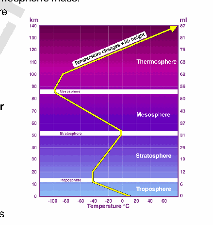

2. **Stratosphere-** (18-50 km) Home to the ozone layer. Temperature increases with height.

3. **Mesosphere-** (50-85 km) Coldest layer. Meteors burn up here.

4. **Thermosphere-** (85-600 km) Ionosphere location. Facilitates satellite orbits.

5. **Exosphere-** (600 km+) Fades into outer space.

**Significance of Troposphere**

1. **Hydrological Cycle Engine-** Holds **99% of atmospheric water vapor,** driving all rain and snow.

2. **Aerosol Nucleation-** Hosts dust and pollutants that act as "seeds" for raindrops.

3. **Environmental Lapse Rate-** Temperature drops **6.5°C per km,** facilitating cloud-forming condensation.

4. **Greenhouse Regulation-** Contains most **CO2 and Methane,** maintaining Earth's habitable temperature.

5. **Zone of atmospheric convection** - Vertical mixing redistributes heat and moisture. Eg- Cumulonimbus cloud development.

6. **Mass Concentration-** Contains **75% of the atmosphere’s mass,** providing the pressure needed for winds.

7. **Boundary Layer Dynamics-** The lowest part (PBL) interacts with the surface, determining local microclimates.

8. **Cyclogenesis Theatre-** All tropical and extra-tropical cyclones originate and intensify within this layer.

9. **Tropopause Lid-** Acts as a thermal ceiling, trapping weather within the troposphere.

10. **Jet streams at upper troposphere** steer weather systems. Eg- Subtropical jet influencing Indian winter weather.

**Major Challenges**

1. **Tropospheric Warming-** Breach of the **1.5°C threshold** has permanently altered weather baselines.

2. **Increased frequency and intensity of La Niña-El Niño** has destabilized global rainfall predictability.

3. **Polar Vortex Instability-** Stratospheric warming is pushing **Arctic air** into mid-latitudes. Eg- **cold waves** in Europe.

4. **Height Expansion-** As the troposphere warms, it is **physically expanding upward.**

5. **Ground-Level Ozone-** Increasing heat is turning tropospheric pollutants into **toxic smog.**

Understanding and protecting tropospheric processes is therefore critical for **weather prediction, disaster management, and sustainable human survival.**

---

1. Explanation_Drishti IAS:
Source Question: Troposphere is a very significant atmosphere layer that determines weather processes. How?

The troposphere is the first and lowest layer of the atmosphere of the Earth. Most of the mass (about 75-80%) of the atmosphere is in the troposphere, and is where most weather phenomena occur.

- Weather refers to short-lived temperature, wind and precipitation conditions that vary from place to place.

- **Elements of Weather Processes:** Cloud cover, rain, snow, low or high temperatures, storms and wind.

| **Layers of Atmosphere** | **Height ( in km)** |
| --- | --- |
| Exosphere | Beyond 400 |
| Thermosphere | 80- 400 |
| Mesosphere | 50- 80 |
| Stratosphere | 10- 50 |
| Troposphere | 0- 10 |

### Significance of Troposphere in Determination of Weather Phenomena

Increasing altitude decreases temperature in the troposphere, thus keeping water from leaving this atmospheric layer.

- That’s why the troposphere contains 99% of the total mass of water vapour and aerosols in the atmosphere, and it is therefore the source of most of the clouds that induce weather phenomena.

- Ozone absorbs sunlight in the stratosphere to raise the air temperature. Thus, temperatures in the stratosphere generally rise with elevation (opposite in case of troposphere)

- The Stratosphere acts as a knot that inhibits vertical motion of winds, resulting in weather phenomena that can only be seen in the troposphere.

- In the troposphere, water evaporates from the surface of the earth and is transported by the wind to other regions.

- The rise, expansion, and cooling of air causes water vapour to condense into clouds, producing an unstable atmosphere that causes rain.

- Global winds and fronts occur in the troposphere creating weather events such as thunderstorms, hurricanes, tornadoes, and blizzards.

Temperatures and weather patterns are shifting due to climate change, causing abnormal weather phenomena in the Troposphere like Heat Waves (recently in Europe and India). Therefore, there is a need to take urgent action to combat climate change and its impact (Sustainable Development Goal 13).

---

1. Explanation_Rau IAS:
Source Question: Troposphere is a very significant atmospheric layer that determines weather processes. How? (15 Marks, 250 Words)

### Introduction

The troposphere is the lowermost layer of the atmosphere extending roughly to a height of 8 km near the poles and about 18 km at the equator. All changes in climate and weather take place in this layer.

### Body

**Troposphere and weather process:**

- Troposphere contains 80% of the mass and most of the water vapor in the atmosphere, and consequently most of the clouds and stormy weather.

- Tropospheric processes, such as the water or hydrologic cycle (the formation of clouds and rain) and the greenhouse effect, have a great influence on meteorology and the climate.

- The lower levels of the troposphere (planetary boundary) are usually strongly influenced by Earth's surface. In this layer, surface influences temperature, moisture, and wind velocity through the turbulent transfer of mass. This layer is known for vertical and horizontal mixture of winds

- The temperature in troposphere decreases at the rate of 6.5°C/Km of height. The rising air parcel cools with adiabatic lapse rate and reaches the point of saturation. The latent heat of condensation released further pushes the air parcel upwards. After condensation, precipitation starts.

- Uneven heating of the Earth by the sun causes convection currents in this layer of the atmosphere, which is large scale pattern of winds that move heat and moisture around the planet.

- Presence of water vapour in this region traps the terrestrial radiation and warms the atmosphere which in turn affects humidity levels.

### Conclusion

Troposphere thus is an important layer in Earth's Atmosphere, as it is the layer that we live in and the layer that gives us weather.

---

---

1. Explanation_Superkalam:
Source Question: Troposphere is a very significant atmospheric layer that determines weather processes. How?

The** troposphere **is the lowest layer of the atmosphere, extending from the Earth’s surface up to** 8–18 km **depending on latitude and season. Containing** 75–80% of the atmospheric mass **and almost all water vapour, it is the most dynamic layer, directly influencing weather and climate.

##** Significance of the Troposphere in Weather Processes **

Diagram Earth's Atmosphere Structure

1.** Presence of Water Vapour and Clouds **- The troposphere contains nearly** all atmospheric moisture**, which is crucial for cloud formation, precipitation, fog, and dew.
 -** Example:Monsoon clouds over India **and tropical rainclouds form entirely within the troposphere.

2.** Vertical Temperature Gradient (Lapse Rate) **- Temperature decreases with altitude (~6.5°C/km), creating** convection currents**.
 - These currents drive wind systems, thunderstorms, and cumulonimbus clouds.
 -** Example:Summer thunderstorms in the Indo-Gangetic plains **arise from strong convective activity.

3.** Wind and Atmospheric Circulation **- Horizontal pressure differences produce** wind systems **(trade winds, westerlies) that redistribute heat and moisture globally.
 -** Example:Tropical easterlies in India **influence the onset of the southwest monsoon.

4.** Formation of Cyclones and Anticyclones **- Most cyclones, anticyclones, depressions, and low-pressure systems form within the troposphere.
 -** Example:Cyclone Amphan (2020) **and Bay of Bengal depressions develop entirely in this layer.

5.** Interaction with Earth’s Surface **- Exchanges of heat, moisture, and gases between surface and troposphere regulate local and regional weather.
 -** Example:Urban heat islands **increase convection, causing localized rainfall in cities like Mumbai and Delhi.

6.** Pollution Transport and Aerosol Mixing **- Vertical and horizontal mixing spreads dust, smoke, and pollutants, influencing rainfall patterns and air quality.
 -** Example:Smog in Delhi-NCR during winter **interacts with monsoon winds in the troposphere.

7.** Jet Streams and Weather Forecasting **- Upper tropospheric** jet streams **guide storm tracks, cyclones, and rainfall distribution.
 -** Example: **The** Subtropical Westerly Jet Stream **affects Indian winter rainfall and western disturbances.

8.** Ozone and UV Radiation Shielding (Indirectly) **- Though most ozone is in the stratosphere, the troposphere filters part of UV radiation and interacts with pollutants to form** tropospheric ozone**, influencing temperature and weather.

9.** Energy Redistribution **- Tropospheric processes transfer heat from equator to poles via winds and storms, maintaining** global energy balance**.
 -** Example: **The** Hadley, Ferrel, and Polar cells **operate entirely within the troposphere.

10.** Influence on Aviation and Human Activity **- Weather phenomena in the troposphere directly affect** flight safety**, agriculture, and disaster preparedness.
 -** Example: **Thunderstorms and high-altitude winds in the troposphere are critical for flight planning and monsoon-dependent farming.

The troposphere is the** primary engine of weather and climate**, hosting all clouds, storms, winds, and precipitation systems. Its interactions with the Earth’s surface, other atmospheric layers, and the global circulation make it indispensable for** weather forecasting, disaster management, and agriculture planning**.

---

1. Explanation_Unacademy:
Source Question: Q17. Troposphere is a very significant atmospheric layer that determines weather processes. How? (250 Words, 15 Marks) Approach

- **Introduction:** Write an introduction about the troposphere.

## **y Body** - Mention Earth’s Atmosphere image for better understanding.

- Explain the significance of Troposphere in determining weather processes

- **Conclusion:** Conclude the answer by order to counteract climate change and its effects, immediate action is required. **Answer:** **Introduction:** Most of the mass (about 75-80%) of the atmosphere is in the troposphere. Most types of clouds are found in the troposphere, and almost all weather occurs within this layer. The troposphere is by far the wettest layer of the atmosphere (all of the other layers contain very little moisture). **Body:** **Significance of Troposphere in determining weather** **processes** - Eighty per cent of the mass and the majority of the water vapour in the atmosphere, which are necessary for the development of clouds and precipitation, are found in the troposphere.

- TheEarth’ssurfaceheatsthetroposphere,resulting in temperature gradients and convection currents

 that propel the movement of air and moisture. Additionally, these currents produce zones of high and low pressure, which have an impact on how weather systems travel.

- Thewatercycle,whichincludeswaterevaporation, condensation, and precipitation, has an impact on the troposphere. The water cycle controls the air’s temperature and humidity while also generating various kinds of clouds and precipitation.

- Thegreenhouseeffect,whichisthetrappingofheat by certain gasses in the atmosphere, has an impact on the troposphere. The troposphere is warmed by the greenhouse effect, which also affects the temperature and weather patterns.

- Smog, a form of air pollution that impairs health andlowersvisibility,isexposedtothetroposphere. Smog is created when sunlight reacts with pollution from human activity like factories and automobiles. **Conclusion:** Climate change is altering temperatures and weather patterns, leading to unusual weather phenomena in the troposphere including Heat Waves. In order to counteract climate change and its effects, immediate action is required **(SDG13 - Climate** **action).** ---

---

Q62. Discuss the concept of air mass and explain its role in macro-climatic changes.
[Year: 2016] [Group: UPSC CSE] [Exam: Mains] [Stage: Mains] [Paper: Mains - GS 1]
[Subject: GEOGRAPHY]
[Section Group: Physical Geography & Geophysical Phenomena]
[Microtopic: Salient Features of World Physical Geography]
[Subtopic: Climatology]
[Macrotag: Descriptive, Analytical]
[Microtag: Explain, Discuss]

1. Explanation_Drishti IAS:
Source Question: Discuss the concept of air mass and explain its role in macro-climatic changes. (2016)

An air mass is a large volume of air in the atmosphere that is mostly uniform in temperature and moisture. Air masses can extend thousands of kilometers across the surface of the Earth, and can reach from ground level to the stratosphere—16 kilometers (10 miles) into the atmosphere.

Air masses form over large surfaces with uniform temperatures and humidity, called source regions. Low wind speeds let air remain stationary long enough to take on the features of the source region, such as heat or cold. Meteorologists identify air masses according to their place of origin.

There are four categories of air masses: arctic, tropical, polar and equatorial. Arctic air masses form in the Arctic region and are very cold. Tropical air masses form in low-latitude areas and are moderately warm. Polar air masses take shape in high-latitude regions and are cold. Equatorial air masses develop near the Equator, and are warm.

**Role of Air mass in Macro Climate Changes**

- The properties of an air mass which influence the accompanying weather are **vertical distribution temperature** (indicating its stability and coldness or warmness) and the **moisture content**.

- The air masses carry atmospheric moisture from oceans to continents and cause **precipitation** over landmasses.

- They transport **latent heat,** thus removing the latitudinal heat balance.

- Most of the migratory atmospheric disturbances such as temperate cyclones and storms originate at the **contact zone** between different air masses and the weather associated with these disturbances is determined by characteristics of the air masses involved.

---

1. Explanation_Superkalam:
Source Question: Discuss the concept of air mass and explain its role in macro-climatic changes.

Air masses are large bodies of air that acquire uniform temperature and humidity characteristics from extensive source regions. Understanding their behavior is crucial for comprehending regional and global climate dynamics.

Global Air Mass Source Regions Map

## Concept of Air Mass

-** Definition and Formation**:

 - Air masses are extensive bodies of air covering thousands of square kilometers with relatively uniform temperature and moisture properties
 - Form over** source regions **- large, uniform surfaces where air remains stationary for 3-7 days
 - Acquire thermal and moisture characteristics from underlying surface (land/water)

-** Classification System**:

 -** Temperature-based**: Continental Tropical (cT), Maritime Tropical (mT), Continental Polar (cP), Maritime Polar (mP), Continental Arctic (cA)
 -** Source region examples**: Siberian High (cP), Azores High (mT), Canadian High (cP)
 -** Modification process**: Air masses change properties while moving away from source regions

-** Key Characteristics**:

 -** Stability**: Determines vertical air movement and cloud formation
 -** Temperature profile**: Controls convection and weather patterns
 -** Moisture content**: Influences precipitation potential and fog formation

## Role in Macro-climatic Changes

-** Global Heat Distribution**:

 - Transport heat from** tropical to polar regions**, maintaining global energy balance
 -** Meridional heat transport **accounts for 40% of total poleward energy transfer
 - Create temperature gradients essential for atmospheric circulation patterns

-** Precipitation Patterns**:

 -** Frontal systems **form when contrasting air masses meet, producing widespread rainfall
 - India's** Southwest Monsoon **(2024) brought 108% of normal rainfall due to maritime tropical air mass interactions
 -** Orographic precipitation **occurs when moist air masses encounter mountain barriers

| Air Mass Type | Climate Impact | Regional Example |
| --- | --- | --- |
| Maritime Tropical | Heavy rainfall, high humidity | Indian Ocean → Indian Subcontinent |
| Continental Polar | Cold, dry conditions | Siberian High → North India winters |
| Maritime Polar | Moderate temperatures, steady precipitation | Atlantic → Western Europe |

-** Seasonal Climate Control**:

 -** Winter cooling**: Continental polar air masses bring severe cold waves (Delhi recorded -1°C in January 2024)
 -** Summer heating**: Continental tropical air masses create heat domes and extreme temperatures
 -** Monsoon dynamics**: Differential heating between land and ocean air masses drives seasonal wind reversals

-** Extreme Weather Generation**:

 -** Cyclogenesis**: Air mass boundaries provide energy for storm development
 -** Heat waves**: Persistent high-pressure systems trap continental tropical air masses (India experienced 99 heat wave days in 2024)
 -** Cold surges**: Polar air mass outbreaks cause sudden temperature drops

Air masses serve as the atmosphere's primary mechanism for redistributing heat and moisture globally. Their interactions drive weather systems and influence long-term climate patterns, making them essential for understanding both regional climate variability and global climate change impacts. The** India Meteorological Department's **enhanced forecasting capabilities now better predict air mass movements for improved climate adaptation strategies.

---

1. Explanation_Unacademy:
Source Question: Q13. Discuss the concept of air mass and explain its role in macro-climatic changes. (12.5 marks, 200 words) Tag: Salient features of the world’s physical geography.

## **Decoding the Question** - **In Introduction, define air mass and briefly** **write about their origination.** - **In Body,** - **Describe with emphasis on the concept** **of air mass like how they are formed and** **their types.** - **Explain how air mass affects weather** **conditions** **like** **temperature,** **precipitation, cyclones, anticyclones,** **etc.** - **Conclude with the significance of Air mass.** **Answer:** An air mass is a **large volume of air** in the atmosphere that is mostly **uniform in temperature** and **moisture.** Air masses can **extend thousands of kilometers** **across the surface of the Earth** and can reach from ground level to the stratosphere into the atmosphere. **The Earth’s major air masses originate in polar or** **subtropical latitudes.** The middle latitudes constitute essentially a zone of modification, interaction, and mixing of the polar and tropical air masses.

## **The Concept and the Source Regions of Air Mass** - Air masses form over large surfaces with **uniform** **temperatures and humidity, called source** **regions.** Low wind speeds let air remain stationary long enough to take on the features of the source region, such as heat or cold.

 - When winds move air masses, they carry their weatherconditions(heatorcold,dryormoist) from the **source region to a new region.** - When the air mass reaches a new region, it might clash with another air mass that has a different temperature and humidity. This can **create a severe storm.** - **The air masses are classified according to the** **source regions.** There are **five major source** **regions.** These are warm tropical and subtropical oceans, subtropical hot deserts, the relatively cold high latitude oceans, the very cold snow-covered continents in high latitudes, and permanently icecovered continents in the Arctic and Antarctica.

 - Accordingly, following types of air masses are recognized: Maritime tropical (mT), Continental tropical (cT), Maritime polar (mP), Continental polar (cP), and Continental arctic (cA). The **observable effects** of air masses are mostly in the realm of daily weather, the reliability of air-mass incursions in many regions make them **important** **contributors to regional climate conditions.** ## **Role of Air Mass in Macro-Climatic Changes** - **Role in the Precipitation and Temperature:** The climates of most regions worldwide **are affected** **by air masses.** Maritime air masses contribute to a **moderating climatic influence** on coastal temperatures, as oceans heat up and cool down moreslowlyandlessdramaticallythanlandmasses.

 - For example, maritime-tropical air sourced over warm waters of the Atlantic Ocean, Caribbean Sea and Gulf of Mexico, primarily between 10 and 30 degrees north of latitude, is the **main contributor of precipitation** for much of North America east of the Rocky Mountains.

 - It’s also the cause of the **persistent humidity** **typical** of these regions’ summer season.

- **Role in the Fronts formation:** When two different air masses meet, the boundary zone between them is called a **front.** The process of formation of the fronts is known as **frontogenesis.** - **Role in the Cyclones and Anticyclones:** Stormy cyclones form near the air-mass fronts. Anticyclones represent stable, singular air masses, and are typically larger.

- **Convectional lifting:** Weather conditions can be changed by moving the air masses vertically known as convectional lifting. These giant parcels often 1,600 kilometers broad exert **significant meteorological and climatic influence,** transporting characteristics of their regions of origin through the territory they move over. Thresholds of adjacent air masses form fronts, along which much of the world’s major weather action travels.

---

---

Q63. Most of the unusual climatic happenings are explained as an outcome of the El-Nino effect. Do you agree?
[Year: 2014] [Group: UPSC CSE] [Exam: Mains] [Stage: Mains] [Paper: Mains - GS 1]
[Subject: GEOGRAPHY]
[Section Group: Physical Geography & Geophysical Phenomena]
[Microtopic: Salient Features of World Physical Geography]
[Subtopic: Climatology]
[Macrotag: Descriptive, Analytical]
[Microtag: Explain, Do you agree]

1. Explanation_Superkalam:
Source Question: Most of the unusual climatic happenings are explained as an outcome of the El-Nino effect. Do you agree?

The world's fold mountain systems are predominantly located along continental margins due to tectonic processes, creating zones of intense seismic and volcanic activity that shape Earth's dynamic landscape.

Oceanic Continental Plate Convergence Geological Cross-Section

##** Location Along Continental Margins **-** Convergent Plate Boundaries**: Fold mountains form where tectonic plates collide at continental margins, creating intense compression that buckles and folds sedimentary rock layers into massive mountain chains.
-** Continental-Continental Collision**: The** Himalayas **exemplify this process, formed by the ongoing collision between the Indian and Eurasian plates, creating the world's highest peaks through crustal compression.
-** Oceanic-Continental Convergence**: The** Andes Mountains **demonstrate subduction-related folding, where the Nazca Plate subducts beneath the South American Plate, uplifting and folding continental crust.
-** Sedimentary Basin Compression**: Continental margins contain thick sedimentary deposits that become compressed and folded during plate convergence, forming linear mountain belts like the** Appalachians**.
-** Marginal Sea Closure**: Ancient continental margins often contain remnants of closed ocean basins, whose sediments become intensely folded during continental collision.

##** Association with Earthquakes and Volcanoes **|** Mountain System **|** Earthquake Frequency **|** Volcanic Activity **|** Plate Boundary Type **|
| --- | --- | --- | --- |
| Himalayas | High (Magnitude 7+ events) | Limited | Continental-Continental |
| Andes | Very High | Extensive | Oceanic-Continental |
| Alps | Moderate | Rare | Continental-Continental |
| Rockies | Moderate to High | Historical | Complex Convergent |

###** Earthquake Connection **-** Active Fault Systems**: Fold mountain regions contain numerous active faults generating frequent seismic activity - the** 2023 Turkey-Syria earthquake **(7.8 magnitude) occurred along the Anatolian fault system.
-** Ongoing Compression**: Continuous plate convergence creates stress accumulation and release cycles, as evidenced by Nepal's** 2015 Gorkha earthquake **(7.8 magnitude).
-** Deep Crustal Processes**: Recent 2024 research shows that deep mantle convection drives both mountain building and earthquake generation in convergent zones.

###** Volcanic Relationship **-** Subduction-Related Volcanism**: The** Pacific Ring of Fire **demonstrates active volcanism along fold mountain belts, with over 75% of world's active volcanoes located in subduction zones.
-** Magma Generation**: Subducting oceanic plates melt due to increasing temperature and pressure, creating magma that rises through fold mountain structures.
-** Recent Volcanic Events**: The** 2024 Reykjanes Peninsula eruptions **in Iceland highlight ongoing volcanic activity associated with tectonic processes in young fold mountain systems.

This intricate relationship between tectonics, seismicity, and volcanism makes fold mountain regions crucial for understanding Earth's dynamic processes and implementing effective hazard mitigation strategies.

---

1. Explanation_Unacademy:
Source Question: Q16. Most of the unusual climatic happenings are explained as an outcome of the El-Nino effect. Do you agree? (10 marks, 150 words) Tag: Important geophysical phenomenon.

## **Decoding the Question** - **In Introduction, start your answer with a** **brief introduction on El Nino.** - **In Body, discuss the undesirable** **circumstances.** - **Conclude your answer with the significance** **of El-Nino.** **Answer:** Thename‘El-Nino’isgiventotheperiodicdevelopment of a warm ocean current along the coast of Peru as a temporary replacement of the cold Peruvian current. ‘El Nino’ is a Spanish word meaning ‘the child’, and refers to the baby Christ, as this current starts flowing during Christmas. El Nino leads to a lot of undesirable

## **circumstances such as** - Due to El- Nino, warm water and low-pressure conditions develop in the Eastern Pacific (Peru) and Cold conditions and high pressure in Western Pacific (Australia). Since Pressure is inversely related to the amount of rainfall, El Nino causes drought situationsinAustraliaandSoutheastAsia.

- El Nino also leads to reversal of pressure difference between Indian and Pacific Ocean- known as El Nino Southern Oscillation. El Nino Southern Oscillation (ENSO) weakens the Trade winds, consequently less push to the Southwestern Monsoon Winds from Mascarene High to India, and therefore poor monsoon. Poor monsoon results in-

- Drought conditions which decrease agricultural output, lead to food inflation.

- Declined supply of cotton, oilseeds and sugarcane negatively affects the textile, edible oil and food processing industries respectively.

- In India, El Nino’s impact will be felt the most at rainfed regions of central, south, and northwest India, Maharashtra, Gujarat, Rajasthan, Karnataka, Jharkhand, and Bihar. Rice, soybean, cotton, maize, jowar, groundnut, sugarcane, kharif pulses and oilseed etc. crops will be affected.

- Drought situation over Southeast Asia and Australia hurts rice and wheat cultivation respectively.

- Warm conditions over the Peru coast are unsuitable for the Plankton population, thus bad for the fishing industry. Birds migrate in search of fishes, thus less guano dropping for the Fertilizer industry in Peru and Ecuador.

- Flood situations in South America & US Midwest lead to decline in coffee-cocoa and corn-wheat production respectively.

- El-Nino brings drought conditions in Indonesia as well. Thus, creating a forest fire situation.

- The presence of the El Nino leads to an increase in sea-surface temperatures

- With global warming there will be increasing number of El-Nino events It is a global phenomenon. Though happening in a limited area, it may have wider implications over the globe.

---

---

Q64. What do you understand by the phenomenon of temperature inversion in meteorol- ogy? How does it affect the weather and the habitants of the place?
[Year: 2013] [Group: UPSC CSE] [Exam: Mains] [Stage: Mains] [Paper: Mains - GS 1]
[Subject: GEOGRAPHY]
[Section Group: Physical Geography & Geophysical Phenomena]
[Microtopic: Salient Features of World Physical Geography]
[Subtopic: Climatology]
[Macrotag: Descriptive]
[Microtag: What, How]

1. Explanation_PWOnlyIAS:
Source Question: What do you understand about the phenomenon of temperature inversion in meteorology? How does it affect the weather and habitants of the place?

**Answer:**

| **Approach:** **Introduction**  • Define the temperature inversion. **Body**  • Temperature inversion can have several significant effects on weather and the environment. **Conclusion**  • Conclude your answer with serious impacts on the environment. |
| --- |

### Introduction

**Temperature inversion is a meteorological phenomenon where the normal decrease in temperature with height is reversed, and the temperature increases instead of decreasing. In other words, the air near the surface of the Earth is cooler than the air above it.** Body: **Temperature inversion can occur due to several factors such as radiation cooling, subsidence of air, advection of warm air, and the presence of an inversion layer.**

**Significant effects on weather and environment:**
- **Air pollution:** Temperature inversion can trap pollutants in the lower atmosphere and cause smog and poor air quality, leading to respiratory problems.
- **Fog:** Temperature inversion can lead to the formation of fog and low clouds due to the cooling of moist air near the surface.

**According to an IQAIR report Delhi will rank 4th position in the world in 2022.**
- **Temperature:** Temperature inversion can cause significant temperature differences in the air at different altitudes, which can affect temperature-sensitive crops and cause damage.
- **Flight Disruptions:** Temperature inversion can cause turbulence and affect aircraft operations due to the difference in temperature and pressure.
- **Delay in Weather Events:** Temperature inversion can delay or prevent the formation of thunderstorms, leading to drought conditions.

### Conclusion

Temperature inversion is a complex meteorological phenomenon that can have serious impacts on the environment and the people living in an area. Its effects can range from air pollution to extreme weather conditions and can be challenging to predict and manage. Therefore, it is essential to understand temperature inversion and its impacts to ensure better preparedness and management of its effects.

---

1. Explanation_Superkalam:
Source Question: What do you understand by the phenomenon of temperature inversion in meteorology? How does it affect the weather and the inhabitants of the place?

Temperature inversion is an atmospheric phenomenon where warm air overlies cooler air, reversing the normal temperature gradient. 

Temperature Inversion Mechanism showing warm air layer above cool surface air with trapped pollutants

Comparative 2D cross section diagram panels

##** Formation Mechanisms of Temperature Inversion **-** Radiation Inversion**: Clear nights cause rapid surface cooling through longwave radiation, cooling ground-level air while upper air remains warm
-** Subsidence Inversion**: High-pressure systems compress descending air masses, warming them and creating stable layers above cooler surface air
-** Valley Inversion**: Cold air drainage from mountain slopes pools in valleys, trapped beneath warmer air layers
-** Frontal Inversion**: Warm air mass overrides cold air mass during weather front passages
-** Marine Inversion**: Cool ocean surfaces create cold air layers beneath warm continental air masses

##** Weather Pattern Effects **-** Atmospheric Stability**: Prevents vertical air mixing, creating stable conditions that suppress convection and cloud formation
-** Fog Development**: Promotes** radiation fog **formation in valleys and** advection fog **in coastal areas
-** Precipitation Suppression**: Blocks moisture-laden air from rising, reducing rainfall and creating drought-like conditions
-** Wind Patterns**: Creates** temperature gradient winds **and affects local circulation systems
-** Freezing Rain Formation**: Causes precipitation to freeze upon contact with cold surface air

##** Impact on Human Inhabitants **|** Category **|** Effects **|** Examples **|
| --- | --- | --- |
|** Health **| Respiratory problems, cardiovascular stress | Delhi's winter smog (2023-24), Beijing pollution episodes |
|** Transportation **| Reduced visibility, flight delays |** IGI Airport **fog disruptions, highway accidents |
|** Agriculture **| Crop damage, frost formation | Punjab wheat crop losses, California citrus damage |
|** Energy **| Increased heating costs, power demand | Winter energy spikes in North India |

###** Urban Pollution Crisis **-** Smog Trapping**: Delhi's** PM2.5 levels **exceed 400 μg/m³ during inversion episodes (November 2024)
-** Industrial Emissions**: Pollutants accumulate near ground level, affecting millions
-** Vehicle Exhaust**: Traffic emissions remain concentrated in breathing zones

Temperature inversion significantly impacts both meteorological patterns and human health, requiring coordinated** air quality management **and** early warning systems **for effective mitigation.

---

1. Explanation_Unacademy:
Source Question: (Year: 2013 | Paper: GS I) Q20(b) What do you understand about the phenomenon of temperature inversion in meteorology? How does it affect the weather and the habitants of the place? (5 marks 100 words) Tags:Salientfeaturesofworldphysicalgeography.

## **Decoding the Question** - **In Introduction, try to define temperature** **inversion.** - **In Body, discuss the role played by** **temperature inversion.** - **Conclude the answer by showing the impact** **and significance of the phenomena.** **Answer:** **Temperature inversion** is a **reversal of the normal** **behaviour of temperature in the troposphere** (the region of the atmosphere nearest Earth’s surface), in which a layer of **cool air at the surface is overlain by** **a layer of warmer air.** (Under normal conditions air temperature usually decreases with height). It is also termed as thermal inversion.

## **Conditions for Temperature Inversion** - **Stable air flow,** as it would prevent the vertical mixing of air at the low levels.

- **Open and clear sky, as it would stimulate the** continuous evaporation of the radiation.

- **Longer nights, as this would help** in limiting the incomingradiationandwouldallowmoretimefor the radiation received in the daytime to emit.

- **Dry air on the ground level so that it can absorb** **the heat radiated.** **Effect of Temperature Inversion in the Weather and** ## **the Habitants** - **Air pollutants** like dust, smoke, etc., are limited as temperature inversion restricts the upward movement of the air.

- It plays a significant role in **regulating the** **formation of clouds,** precipitation levels, and visibility.

- **Prevents rain fall** or shower as the upward convection cloud movement is restricted resulting in agony of the agricultural sector.

- **Diurnal variations** are affected due to these phenomena, and it tends to be very small. Due to the **occurrence in the lower atmosphere,** the phenomena of temperature inversion play a vital role in **dictating the climatic conditions and on the habitat** **of the area under its influence.** ---

---

Q65. Major hot deserts in northern hemisphere are located between 20-30 degree north and on the western side of the continents. Why?
[Year: 2013] [Group: UPSC CSE] [Exam: Mains] [Stage: Mains] [Paper: Mains - GS 1]
[Subject: GEOGRAPHY]
[Section Group: Physical Geography & Geophysical Phenomena]
[Microtopic: Salient Features of World Physical Geography]
[Subtopic: Climatology]
[Macrotag: Descriptive]
[Microtag: Why]
##### Subtopic: Geomorphology

1. Explanation_PWOnlyIAS:
Source Question: Major hot deserts in the northern hemisphere are located between 20-30 degrees north and on the western side of the continents. Why?

| **Approach:** **Introduction**  • Brief about location of hot desert. **Body**  • Discuss about the various factors of geographical location. **Conclusion**  • Conclude your answer with the formation of a hot desert. |
| --- |

### Introduction

**Hot deserts are typically found in the subtropical regions of the world, with the majority located in the northern hemisphere. Interestingly, they are mostly located between the latitudes of 20-30 degrees north and on the western side of the Continents.** Body: **

**

**Various factors of geographical location:**
- **Global Wind Patterns:** The Earth’s atmospheric circulation pattern, also known as **the Hadley Cell**, plays a crucial role in the formation of deserts. The hot, moist air rises at the equator and travels towards the poles, then cools and descends around **20-30 degrees** north and south of the equator, creating arid conditions in those regions. E.g Azizia, Libya.
- **Rain Shadow Effect:** Mountains on the western side of the continents act as barriers to moisture-laden winds. When these winds encounter mountains, they rise, cool, and release their moisture as rainfall. As a result, the eastern side of the mountains receives abundant rainfall, while the western side is left relatively dry, creating desert conditions. E.g
- **Ocean Currents:** The major hot deserts are located adjacent to **cold ocean currents** that have a significant influence on their climate. The cold ocean currents cool the adjacent land, leading to stable atmospheric conditions that limit precipitation and create desert-like conditions. E.g **Humboldt Current , west Australian Current**.
- **Continental Drift:** The location of hot deserts in the northern hemisphere is also the result of continental drift. Millions of years ago, the continents were located differently than they are today. The current arrangement of the continents favors the formation of hot deserts in the areas mentioned above. E.g **Gobi desert.**

### Conclusion

The location of major hot deserts in the northern hemisphere is a result of complex interactions between the atmospheric circulation patterns, ocean currents, and land configurations. This unique combination of factors results in a specific set of climatic conditions that are conducive to the formation and maintenance of hot deserts in these regions. Understanding these factors is crucial for predicting and managing the impacts of desertification and global climate change.

---

1. Explanation_Superkalam:
Source Question: Major hot deserts in the northern hemisphere are located between 20-30 degrees north and on the western side of the continents. Why?

The formation of major hot deserts in the northern hemisphere between 20-30°N latitude on the western continental margins is a result of complex atmospheric and oceanic interactions.

Showing deserts on world map in 20-30 degree N latitude

Generalized Continent Diagram Landmass between Degrees

## Atmospheric Circulation Patterns

- The region experiences the influence of** Hadley Cell circulation**, where warm air rises at the equator and descends at around 30°N latitude creating a high-pressure zone.
- The descending air in the** subtropical high-pressure belt **becomes warm and dry through** adiabatic heating**, leading to stable atmospheric conditions.
- This creates** rain shadow regions **on the western continental margins, contributing to desert formation like the** Sahara Desert **and** Thar Desert**.

## Ocean Current Impact

-** Cold ocean currents **flowing along the western continental margins significantly influence desert formation.
- The** California Current **along North America and the** Canary Current **along Africa's western coast bring cold waters from higher latitudes.
- These cold currents create temperature inversions and stable air masses, preventing moisture-laden air from rising and forming precipitation.

## Trade Wind Effect

- The** trade winds **blow from east to west between 0-30°N latitude, losing most of their moisture over eastern continental margins.
- By the time these winds reach western continental margins, they are significantly dry, contributing to desert conditions.
- This explains why the** Atacama Desert **in South America and the** Namib Desert **in Africa are located on western margins.

## Topographical Influence

- Mountain ranges on eastern continental margins act as barriers, creating** rain shadow effects**.
- The** Rocky Mountains **in North America and the** Atlas Mountains **in Africa intercept moisture-laden winds.
- This orographic effect further intensifies desert conditions on western continental margins.

The interaction of these complex factors -** Hadley Cell circulation**,** cold ocean currents**,** trade winds**, and** topographical features **- creates ideal conditions for desert formation between 20-30°N latitude on western continental margins. Understanding these patterns is crucial for climate change adaptation and water resource management in these regions, as seen in initiatives like the** Great Green Wall **project in the Sahel region.

---

1. Explanation_Unacademy:
Source Question: Q21. Major hot deserts in the northern hemisphere are located between 20-30 degree N and on the western side of the continents. Why? (10 marks, 200 words) Tag: Salient features of the world’s physical geography.

## **Decoding the Question** - **In Introduction, try to define a hot desert** **with some examples.** - **In Body, discuss the reasons behind the hot** **deserts phenomenon.** - **In Conclusion, mention the impact and the** **significance of hot deserts.** **Answer:** **Hot deserts** are hot arid areas with **little rainfall,** **extreme temperature, and sparse vegetation.** Generally, the **deserts that are found** in the tropical and subtropical regions (western coasts of continents) between the **20 degrees and 30 degrees north and** **south of the equator are hot deserts.** **Some Popular Hot Deserts in the Northern** ## **Hemisphere** - Sahara Desert- Africa **(23° N)** - Thar Desert – Asia (India) **(27° N)** - Arabian Desert: Asia **(20° N)** **Reasons Most of the World’s Hot Deserts are Located** **near 20-30 degree N and on the Western Side of the** ## **Continents** ## **y Air-circulation** - The western part is the place where the **heated equatorial air begins to descend.** The descending air is dense and begins to warm again, evaporating large amounts of water from the land surface. The **resulting climate is** **very dry.** - Desert formation in these particular latitudes is primarily due to complex global aircirculation patterns caused by the **rotation** **of the earth on its axis (earth moves at great** **speed near the equator and slowly near the** **poles),** the seasonal tilting of the earth in relation to the sun.

## **y Continentality or (Distance from oceans)** - Mostwaterintheatmosphereevaporatesfrom the sea, and this water eventually precipitates on land. **Land closer to the sea generally** **receives much of this moisture.** - As air moves inland, it gets depleted of moisture and precipitation drops. Areas lying deep within a continent may become desert simply because air currents reaching them have already traversed vast land distances. **By** **the time they arrive over the deserts, these** **currents have already lost the moisture** they once carried.

## **y Off-shore trade winds** - In this latitude off-shore trade winds can be seen, which **creates a desertification effect** **to the western part of the continent.** Over a period of time they lose the moisture they carry as they travel long distances to reach the western part.

## **y Cold Current** - Deserts can form even on tropical coasts beside cold ocean currents, such as the west coast of South America.

 - The currents cool the air, which then rises and warms as it moves over land, **drawing up** **moisture that is later precipitated as the air** **moves farther inland.** Due to all these climatic and geographical factors most of the **Hot Deserts** in the northern hemisphere are located between 20- 30° N and on the western side of the continents.

---

---

Q66. Discuss how the changes in shape and sizes of continents and ocean basins of the planet take place due to tectonic movements of the crustal masses.
[Year: 2025] [Group: UPSC CSE] [Exam: Mains] [Stage: Mains] [Paper: Mains - GS 1]
[Subject: GEOGRAPHY]
[Section Group: Physical Geography & Geophysical Phenomena]
[Microtopic: Salient Features of World Physical Geography]
[Subtopic: Geomorphology]
[Macrotag: Descriptive, Analytical]
[Microtag: How, Discuss]

1. Explanation_Civilsdaily:
Source Question: Discuss how the changes in shape and sizes of continents and ocean basins of the planet take place due to tectonic movements of the crustal masses. [Year: 2025] [Marks: 15]

The **Theory of Plate Tectonics,** developed in the late 1960s, is based on earlier ideas of **continental drift**

**(Alfred Wegener)** and **seafloor spreading (Harry Hess).** It states that the **lithosphere is divided into rigid**

**plates** that move over the semi-fluid **asthenosphere** and modify the **shape, size, and distribution of**

**continents and ocean basins**

**Changes in the shape and size of continents and ocean basins due to tectonic movements**

1. Divergent Plate Movement - Increase in ocean basin size and breakup of continents.

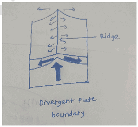

- Plates move apart → **magma rises and solidifies to form a new oceanic crust.**

- Causes **seafloor spreading** and widening of oceans.EgExpansion of the **Atlantic Ocean** along the Mid-Atlantic Ridge. **(2.5 cm per year.)**

- **Continental rifting** leads to fragmentation of landmasses.

a. **East African Rift valley**

b. **Formation of Linear Seas-** Eg- **Red Sea** due to drifting of Arabian Plate away from the African Plate.

2. Convergent Plate Movement - Shrinking of oceans and enlargement/upliftment of continents.

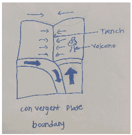

a) **Ocean-Continent Convergence**

- **Denser oceanic plate subducts,** leading to

a. formation of **trenches and volcanic mountain chains.**

b. Reduction in ocean basin area

c. Eg- Nazca Plate subducting under the South American Plate to form the **Andes Mountains** and the **Peru-Chile Trench.**

d. **The Pacific Ocean** is currently shrinking due to subduction along the "Ring of Fire".

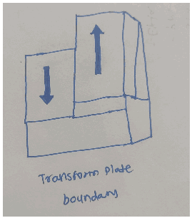

b) **Continent-Continent Convergence -** Collision causes **fold mountain formation and crustal thickening.** Eg- **Himalayas** formed after closure of the **Tethys Sea.**

3. Transform Plate Movement - Change in Continental Configuration

- Lateral sliding of plates causes **horizontal displacement of landforms.** Eg- **San Andreas Fault.**

- Modifies coastlines and continental margins.

4. It also leads to periodic assembly and break-up of supercontinents such as Pangaea.

These tectonic processes not only remodel the Earth’s surface but also influence **climate, ocean circulation, biodiversity, and natural resource distribution.**

---

1. Explanation_Drishti IAS:
Source Question: Discuss how the changes in shape and sizes of continents and ocean basins of the planet take place due to tectonic movements of the crustal masses. 15 (Answer in 250 words)

| **Approach:**  • Introduce tectonic movements and their role in shaping continents and ocean basins.  • Explain Alfred Wegener’s continental drift theory and its evolution into modern plate tectonics.  • Discuss how plate divergence (e.g., ocean basin expansion) and convergence (e.g., mountain formation) occur.  • Conclude with the impact of tectonic movements on Earth's surface and their link to natural disasters. |
| --- |

### Introduction

Tectonic movements of Earth's crustal masses play a significant role in shaping the planet’s surface, particularly in the formation and alteration of continents and ocean basins. These movements occur due to the **activity of tectonic plates,** which shift due to forces such as **mantle convection, slab pull, and ridge push**. The interaction between these plates leads to the rearrangement of landmasses and ocean floors, resulting in phenomena like **continental drift, mountain formation,** and ocean basin expansion or contraction.

### Body

**Continental Drift Theory and Its Evolution:**

- The concept of continental drift was first proposed by **Alfred Wegener in 1912,** suggesting that continents were once part of a single landmass known as

**Pangaea.**

- His theory laid the foundation for the modern understanding of plate tectonics, which was developed further by scientists such as Harry Hess and Robert Dietz in the 1960s. The discovery of **seafloor spreading** and the mapping of ocean ridges provided crucial evidence supporting this theory.

**Plate Tectonics and Crustal Deformation:**

- The movement of tectonic plates results in the **deformation of Earth’s crust.** The divergence of plates at **mid-ocean ridges** causes the ocean basins to widen, while their convergence leads to the formation of mountains and ocean trenches. For instance, the

**collision of the Indian Plate with the Eurasian Plate created the Himalayas.**

- Similarly, the Atlantic Ocean is expanding as the American and Eurasian plates move apart. Subduction zones, where one plate is forced beneath another, contribute to the shrinking of ocean basins and the creation of volcanic arcs.

### Conclusion

The constant movement of tectonic plates is fundamental in shaping the Earth's surface. These movements not only explain the current configuration of continents and ocean basins but also **hold implications for understanding natural disasters** like earthquakes and volcanic eruptions. Continued research and monitoring are crucial for better predicting the consequences of tectonic movements, particularly in regions vulnerable to seismic activity.

---

1. Explanation_PWOnlyIAS:
Source Question: Discuss how the changes in shape and sizes of continents and ocean basins of the planet take place due to tectonic movements of the crustal masses.

| **Core Demand of the Question**  • Changes in Shape and Sizes of Continents  • Changes in Shape and Sizes of Ocean Basins |
| --- |

### Introduction
**Continents** and **oceans** owe their present configuration to the dynamic processes of plate tectonics. **Divergent, convergent,** and **transform movements** of crustal masses continuously reshape Earth’s land–ocean balance.

### Body

**Changes in Shape and Sizes of Continents**
- **Divergent Boundaries (Rifting and Continental Break-up):** When continental crust is pulled apart, rift valleys develop, which eventually split landmasses. This leads to fragmentation and change in continental outlines.

  - **Eg:** The **East African Rift** may split Africa into two separate continental blocks.

- **Convergent Boundaries (Collision and Mountain Building):** When two continental plates collide, intervening seas close, and the crust folds and uplifts into mountains. This reshapes continents by enlarging landmass thickness.

  - **Eg:** The collision of the **Indian** and **Eurasian plates** formed the Himalayas and Tibetan Plateau.

- **Transform Boundaries (Lateral Displacements):** Strike-slip or transverse movements shift landmasses sideways, displacing continental margins and coastlines.

  - **Eg:** San Andreas Fault:** , a transform boundary, causes horizontal displacement, shifting California along the Pacific Plate margin.

- **Isostatic Adjustments (Vertical Re-shaping):** Removal or addition of weight (erosion, ice melt, sediment load) causes crust to rise or sink, changing continental relief.

  - **Eg:** Post-glacial rebound in Scandinavia has uplifted land, altering coastal shapes.

**Changes in Shape and Sizes of Ocean Basins**
- **Divergent Boundaries (Sea-Floor Spreading and Basin Expansion):** Magma upwells at mid-ocean ridges, creating new crust and widening ocean basins.

  - **Eg:** The Mid-Atlantic Ridge is pushing the Americas and Africa–Europe apart, expanding the Atlantic Ocean.

- **Ocean-ocean Convergent Boundaries (Subduction and Basin Shrinkage):** Oceanic crust descends into trenches at subduction zones, reducing basin area and volume.

  - **Eg:** The Pacific Ocean is shrinking along the **Mariana Trench** and Peru–Chile Trench.

- **Continent-continent Convergent Boundaries:** Convergence closes off ocean basins entirely as continents collide.

  - **Eg:** The **Tethys Sea** disappeared when India collided with Eurasia.

- **Transform Boundaries (Offsetting and Basin Reshaping):** Oceanic transform faults laterally displace ridges and trenches, altering basin geometry.

  - **Eg:** Fracture zones in the Atlantic offset the **Mid-Atlantic Ridge** segments.

- **Divergent to Ocean Formation (Continental Rift to Ocean):** Initial continental rifting can evolve into new ocean basins when seawater invades the rift.

  - **Eg:** The **Red Sea Rift** is an embryonic ocean basin forming between Africa and Arabia.

### Conclusion

**Plate tectonics** offers the most comprehensive explanation for the continuous changes in the shapes and **sizes** of **continents** and **ocean basins**. Though not fully precise in predicting every detail, it remains the most accepted and trusted framework to understand the **dynamic nature** of Earth’s crust.

---

1. Explanation_Superkalam:
Source Question: Discuss how the changes in shape and sizes of continents and ocean basins take place due to tectonic movements of the crustal masses.

Recent **GPS measurements** show the Himalayas rising 5mm annually. **Plate tectonic theory** explains how crustal mass movements continuously reshape Earth's continents and ocean basins over geological time.

## Tectonic Movements Affecting Continental Shape and Size

Plate tectonics causing seafloor spreading subduction

### Divergent Boundaries - Continental Separation

- **Continental Rifting**: Crust stretches and breaks, creating rift valleys and new oceans.** Example: **East African Rift System stretching** 6,000 km **from Red Sea to Mozambique, creating new oceanic basins
-** Seafloor Spreading**: At mid-ocean ridges (e.g., Mid-Atlantic Ridge), new crust forms, pushing continents apart.** Example: **Mid-Atlantic Ridge expanding at** 2.5 cm/year**, separating Americas from Europe-Africa
-** Basin Formation**: Red Sea formed** 30 million years ago **through Arabian Peninsula separation from Africa
-** Crustal Thinning**: Creates rift valleys like** Lake Baikal **(world's deepest freshwater lake)
-** New Ocean Creation**: Atlantic Ocean formation through** Pangaea breakup **175 million years ago

### Convergent Boundaries - Continental Collision and Growth

-** Mountain Building**: Collision of continental plates deforms landmasses causing rise of mountains. Himalayas formed through** Indo-Australian plate collision **with Eurasian plate 50 million years ago
-** Continental Accretion**: Western North America growth through** terranes addition **from Pacific Ocean
-** Crustal Thickening**: Tibetan Plateau elevation increase to** 4,500m average **through compression
-** Subduction Effects**: Oceanic plates subduct beneath continental plates, shrinking ocean basins.**Example:** Andes Mountains formation through **Nazca Plate subduction** beneath South American Plate
- **Volcanic Addition**: Japan's land area expansion through** volcanic island arc **formation

Divergent and Convergent Plates

## Tectonic Movements Affecting Ocean Basin Configuration

|** Process **|** Effect **|** Example **|** Rate **|
| --- | --- | --- | --- |
| Seafloor Spreading | Basin Expansion | Atlantic Ocean | 2-10 cm/year |
| Subduction | Basin Reduction | Pacific Ring of Fire | 5-15 cm/year |
| Transform Faulting | Lateral Movement | San Andreas Fault | 3-5 cm/year |

### Ocean Basin Evolution

-** Basin Creation**: Arctic Ocean formation through** Eurasian-North American **plate separation
-** Deep Trench Formation**: Mariana Trench (**11,034m deep**) through Pacific Plate subduction
-** Basin Closure**: Mediterranean Sea shrinking through** African-Eurasian **plate convergence
-** Sediment Accumulation**: Bay of Bengal depth reduction through** Ganges-Brahmaputra **delta deposition
-** Volcanic Island Formation**: Hawaiian Islands through** Pacific Plate movement **over hotspot

Modern** satellite geodesy **and** GPS technology **confirm these ongoing processes, demonstrating Earth's dynamic nature through initiatives like India's** National Centre for Seismology **monitoring system.

---

---

Q67. How are the fjords formed? Why do they constitute some of the most picturesque areas of the world?
[Year: 2023] [Group: UPSC CSE] [Exam: Mains] [Stage: Mains] [Paper: Mains - GS 1]
[Subject: GEOGRAPHY]
[Section Group: Physical Geography & Geophysical Phenomena]
[Microtopic: Salient Features of World Physical Geography]
[Subtopic: Geomorphology]
[Macrotag: Descriptive]
[Microtag: Why, How]

1. Explanation_Civilsdaily:
Source Question: How are the fjords formed? Why do they constitute some of the most picturesque areas of the world? [Year: 2023] [Marks: 10]

A **fjord** is a **long, narrow, and deep sea inlet with steep cliffed sides,** formed due to **glacial erosion and subsequent marine submergence.**

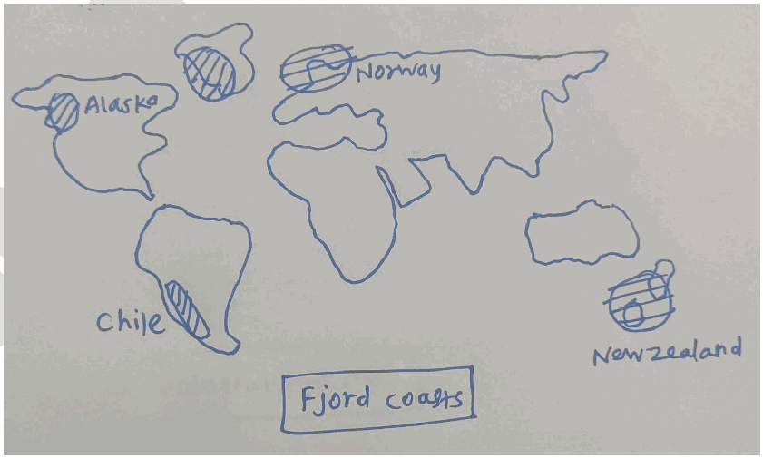

**Formation of fjords**

1. Glacial Erosion of Pre-existing River Valleys

- During the **Ice Age,** valley glaciers occupied pre-existing river valleys.

- Through processes like **plucking and abrasion,** glaciers **deepened and widened** these valleys.

- This produced a characteristic **U-shaped glacial trough** with very steep sides.

2. Overdeepening of the Valley Floor

- Glaciers erode the central part more intensely due to greater ice thickness.

- This creates **basins that are often deeper than the adjoining sea.**

3. Reduced erosion near the glacier’s snout leaves a shallow entrance (threshold or sill).

4. After the **melting of glaciers,** sea level rose and **drowned the glacial trough.** Seawater filled the valley forming a **fjord.**

**Fjords are among the most picturesque landscapes due to**

1. Steep and Towering Cliffs rising dramatically from the water attract adventure tourists. Eg- Sognefjord (Norway).

2. Deep, narrow inlets create a **mirror-like water surface.** This enhances visual beauty through reflection of peaks and clouds

3. Tributary glaciers form **hanging valleys.** After glaciation, these become **spectacular waterfalls.** Eg**Milford Sound (New Zealand).**

4. **Vibrant Contrasts-** The deep blue cold, oxygen-rich water provides a sharp color contrast against the dark granite rocks and white snow on the summits.

5. Indented Coastline creates numerous bays, islands, and peninsulas, giving a highly irregular and scenic coast.

6. Fjords have their own sheltered **micro-climates,** allowing for blossoms or orchards at the base of snowy mountains

7. Unique Light and Climatic Effects - High latitude locations produce long daylight hours, auroras, and misty environments.

Fjords represent classic **glacio-fluvial and marine interaction.** They also serve as important centres for **tourism, fisheries, and human settlement.**

**Economic geography**

---

1. Explanation_Drishti IAS:
Source Question: How are the fjords formed? Why do they constitute some of the most picturesque areas of the world?

Fjords are long, narrow, and deep inlets of the sea that are surrounded by steep cliffs or mountains. They are formed by the erosion of glacial ice, and are found in regions where the sea level has risen after the ice age.

[View Offline Local Backup](drishti ias/images/geography_q18_img1.png)

Some countries that have fjords are Norway, Chile, New Zealand, and the U.S. state of Alaska.

Fjords are some of the most picturesque areas because of their unique and dramatic landscape features. Some of the reasons are:

- The contrast between the calm, blue water and the rugged, snow-capped mountains.

- The reflection of the mountains and the sky on the water surface.

- The interplay of light and shadow on the water and the cliffs.

- The biodiversity of the fjords supports a variety of marine and terrestrial life forms, such as seals, penguins, dolphins, whales, seabirds, and plants.

- Fjord culture embodies centuries of history, with farms, villages, churches, and monuments harmonizing with the stunning natural surroundings.

- The recreational opportunities of the fjords attract tourists. Some of the activities include hiking, kayaking, fishing, skiing, and cruising.

Therefore, fjords are remarkable examples of how nature and culture can create some of the most picturesque areas of the world.

---

1. Explanation_PWOnlyIAS:
Source Question: How are the Fjords formed? Why do they constitute some of the most picturesque areas of the world?

**Answer:**

| **Approach:** **Introduction**  • Start with basic introduction of Fjord. **Body**  • Mention Formation of Fjords  • Mention reasons why Fjords constitute some of the Most Picturesque Areas in the World **Conclusion:**  • Give appropriate conclusion in this regard |
| --- |

### Introduction

A fjord is a narrow, deep inlet of seawater bordered by steep cliffs or mountains, extending inland from the ocean. **Examples of fjords include Sognefjord, Geirangerfjord, and Lysefjord.** These natural wonders boast unique geological features, rich biodiversity, and cultural importance.

### Body

**Formation of Fjords:**
- **Glacial Erosion:** Fjords took shape during ice ages when massive glaciers carved out deep U-shaped valleys as they moved, eroding the landscape.

**For instance, Norway’s Sognefjord was created through this glacial activity.**
- **Isostatic Rebound:** As glaciers advance and weigh down the Earth’s crust, the land sinks or subsides under the pressure. When the glaciers retreat, the crust slowly rebounds or rises in response, creating the fjord’s characteristic deep, narrow shape. An example of isostatic rebound is observed in **Drammensfjorden.** 

- **Sea-Level Rise:** Rising sea levels, often associated with the melting of glaciers and the end of ice ages, lead to the submergence of the glacially carved valleys. This submersion fills the valleys with seawater, forming the fjord.

**Milford Sound fjord in New Zealand was formed when the sea inundated a glacial valley.**
- **Tectonic Activity:** Fjords can also form due to tectonic activity, where the Earth’s crust undergoes vertical movement, causing the land to sink and allowing seawater to enter, creating fjords.

**Reasons Why Fjords Constitute Some of the Most Picturesque Areas in the World:**
- **Stunning Geological Formations:** Fjords are characterized by their unique and picturesque geological formations, including deep, narrow inlets, steep cliffs, and U-shaped valleys, creating a visually striking landscape,

**as exemplified by the Tracy Arm Fjord in Alaska (USA).**
- **Lush Greenery and Waterfalls:** The rugged cliffs that surround fjords are often adorned with lush green vegetation and punctuated by cascading waterfalls, adding vibrant colors and natural beauty to the scenery.

**The Milford Sound fjord in New Zealand is an example.**
- **Contrast of Elements:** Fjords offer a captivating contrast between the towering, rocky cliffs and the serene, deep blue waters. This juxtaposition of elements creates a visually arresting and harmonious landscape.

**Norway’s Geirangerfjord serves as an example.**
- **Tranquil and Remote Ambiance:** Fjords evoke a sense of tranquility and remoteness, with their secluded locations and calm waters providing an ideal atmosphere for relaxation and contemplation.

**The Hjørundfjord serves as an example of this serene ambiance.**
- **Rich Biodiversity:** Fjords support diverse ecosystems both above and below the water’s surface, with various flora and fauna, including marine life and bird species, enhancing their natural appeal.

**For instance, the fjords in the Western Antarctic Peninsula (WAP) are intense hotspots of pelagic and benthic productivity and biodiversity.**
- **Interplay of Light, Water, and Landscape:** Fjords offer a dynamic interplay of natural elements—the play of light on the water’s surface, the reflection of towering cliffs, and ever-changing weather conditions, creating a captivating and ever-evolving visual spectacle. **Alaska’s Glacier Bay serves as a prominent example.**

### Conclusion

Fjords are incredibly unique and visually captivating geological features on Earth, shaped through diverse natural processes. Nevertheless, these natural wonders are currently under threat from climate change. By fostering collective efforts, we can work towards securing their existence for future generations.

---

1. Explanation_Rau IAS:
Source Question: How are the fjords formed? Why do they constitute some of the most picturesque areas of the world? (10 Marks, 150 Words)

### Introduction

Fjords are unique geographical formations found in certain coastal regions of temperate regions formed by glacial erosion. It is a long, narrow valley with steep sides filled with seawater. It is deeper in inner and middle parts and shallow mountain threshold at the outer end.

Fjords are located on the edge of large continents. Fjords are found along the coasts of Norway, Greenland, Alaska, Chile, New Zealand and Antarctica.

### Body

**Formation of Fjords:**

- Fiords are the result of glacier's immense power to shape landscapes.

- They are essentially drowned glacial valleys formed because of interplay of glacial action and subsequent marine inundation.

- During ice ages, glaciers carved deep U-shaped troughs in valleys through plucking and frost shattering. Once glaciers receded, these valleys submerged due to land subsidence or sea level rise, forming fjords.

**Picturesque Nature of Fjords:**

- Deep carved valleys with rugged cliffs and U-shaped valleys.

- Shallow mouths of Fjords make the waters in Fjords quieter than sea.

- Towering vertical cliffs that rise dramatically from water's edge.

- Calm waters function as mirror like surface which reflects the surroundings.

- Numerous cascading waterfalls which add sound and beauty.

- Changing seasons has different appearance of fjords

- Rich in biodiversity.

- Norway's Geirangerfjord, a UNESCO World Heritage sites, exemplify this scenic attractiveness.

### Conclusion

Fjords, with their origin rooted in glacial activities and their unparalleled beauty, stand as a testament to nature's ability to craft awe-inspiring landscapes.

---

---

1. Explanation_Superkalam:
Source Question: How are the fjords formed? Why do they constitute some of the most picturesque areas of the world?

** Fjords **are long, narrow, deep inlets of the sea between high cliffs or steep slopes, formed by** glacial activity **during the last Ice Age. They are known for their dramatic landscapes and are considered among the most scenic natural formations globally.

##** Formation of Fjords **

Fjord Formation Diagram With Definitions.

1.** Glacial Erosion (Pre-Glacial Phase): **- During Ice Ages, massive** valley glaciers **carved out deep U-shaped valleys in mountainous coastal regions.
 - The weight and movement of the glacier eroded the valley floor** below sea level**. (Image a)

2.** Glacial Retreat (Deglaciation): **As the climate warmed, glaciers** melted and retreated**, leaving behind deep troughs. (Image b & c)
3.** Marine Inundation: **These valleys were then** flooded by rising sea levels**, creating deep inlets—**fjords**. (Image d)

##** Notable Examples of Fjords **| Region | Famous Fjords |
| --- | --- |
|** Norway **| Sognefjord, Geirangerfjord |
|** New Zealand **| Milford Sound |
|** Chile **| Aisén Fjords |
|** Canada **| Saguenay Fjord |

##** Why are Fjords Picturesque? **1.** Dramatic Landscapes: **High cliffs, cascading waterfalls, and deep blue waters create** awe-inspiring visuals**.
2.** Glacial Lakes & Clear Waters: **The glacial origin gives rise to** pristine, sediment-rich turquoise waters**.
3.** Biodiversity and Marine Life: **Home to unique** marine ecosystems **(e.g., orcas in Norway, dolphins in NZ).
4.** Tourism and Recreation **- Popular for** cruising, kayaking, and trekking**, fjords boost ecotourism.
 - Example:** Norway’s Geirangerfjord **is a UNESCO World Heritage Site.

5.** Cultural and Historical Significance: **Inhabited by** indigenous communities**, used as** ancient trade routes**.
6.** Contrasts of Light and Shadow: **Steep terrain and variable weather create** constantly changing scenery**—a favourite for photographers and artists.

Fjords are nature’s masterpieces shaped by the slow but powerful force of glaciation. Their** geological uniqueness**,** ecological richness**, and** visual grandeur **make them some of the most** breathtaking and valuable landscapes **on Earth.

---

1. Explanation_Unacademy:
Source Question: Q6. How are fjords formed? Why do they constitute some of the most picturesque areas of the world? (10 Marks, 150 Words)

## **Approach** - **Introduction:** Define fjords and their main physical characteristics.

- **Body:** Explain formation process by glaciers, and then highlight why they are scenic— geology, biodiversity, climate, and human activities.

- **Conclusion:** Emphasize their ecological, geological, and cultural value, along with need for conservation. **Answer:** **Introduction:** A fjord is a long, narrow valley with steep sides that is filled with seawater. It is usually deep in the middle and inner parts, with a shallower threshold at the outer end. Fjords are striking examples of glacial landforms, combining the grandeur of ice-carved valleys with the dynamism of marine environments. They are most common along the coasts of Norway, Greenland, Alaska, British Columbia, Chile, Antarctica, and New Zealand. **Body** **Formation of Fjords** - Fjords are formed when a glacier cuts a deep U-shaped valley through processes like ice segregation and abrasion.

- As glaciers retreat, these valleys become overdeepened and are later flooded by the sea, forming fjords.

- The combination of glacial erosion and marine inundation creates theirdistinct structure — steep cliffs, narrow inlets, and deep central basins. **Reasons They Are Picturesque** - **Geological Grandeur:** Steep cliffs, narrow channels, and dramatic U-shaped valleys create awe-inspiring scenery.

- **WaterfallsandRainfall:Highprecipitationinfjord** regions leads to abundant waterfalls cascading into the sea.

- **Biodiversity:** Fjords are rich in marine life due to their sheltered environments, supporting fisheries and ecosystems.

- **Seasonal Landscapes:** Lush green mountains in summer and snow-covered peaks in winter provide changing scenic beauty.

- **Coral Reefs and Skerries:** Features like small rocky islands and marine habitats enhance their ecological and visual appeal.

- **Recreation and Tourism:** Crystal-clear waters, cruises, and adventure activities make fjords popular leisure destinations. **Conclusion** Fjords represent the interplay of glacial, geological, ecological, and atmospheric processes, shaping some of the world’s most stunning landscapes over thousands of years. Their scenic beauty, biodiversity, and recreational value make them global heritage sites worth conserving. For instance, Norway has resolved to stop emissions from all water traffic in its western fjords by 2026, setting an example of sustainable management. Preserving these fragile ecosystems is essential to maintain their beauty and ecological balance for future generations.

---

---

Q68. Describe the characteristics and types of primary rocks.
[Year: 2022] [Group: UPSC CSE] [Exam: Mains] [Stage: Mains] [Paper: Mains - GS 1]
[Subject: GEOGRAPHY]
[Section Group: Physical Geography & Geophysical Phenomena]
[Microtopic: Salient Features of World Physical Geography]
[Subtopic: Geomorphology]
[Macrotag: Descriptive]
[Microtag: Describe]

1. Explanation_Civilsdaily:
Source Question: Describe the characteristics and types of primary rocks. [Year: 2022] [Marks: 10]

**Primary or igneous rocks are** formed by the **cooling and solidification of magma or lava.** They act as the **parent rocks** for sedimentary and metamorphic rocks.

**Characteristics of Primary (Igneous) Rocks**

1. Crystalline and Hard - Made up of interlocking mineral crystals. Very hard and compact. Eg- Granite.

2. Non-stratified Structure - Do not occur in layers or strata. Massive and unbedded in nature.

3. Absence of Fossils - High temperature of magma destroys any organic remains.

4. **Mineral Composition-** They are primarily composed of silicate minerals such as **Quartz, Feldspar, Mica,** and **Olivine.**

5. Impervious - Generally do not allow water percolation (except when fractured).

6. Texture depends on rate of cooling-

  - **Slow cooling** → coarse-grained.

  - **Rapid cooling** → fine-grained or glassy.

7. Rich in Minerals - Source of important minerals such as iron, nickel, copper, gold, and platinum.

8. Most of the **Earth’s crust and mantle** is composed of igneous rocks.

**Types of Primary (Igneous)**

**Rocks**

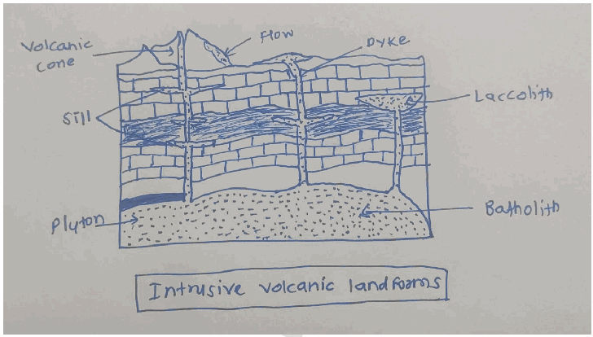

**Based on Mode of Occurrence**

**1. Intrusive (Plutonic) Rocks**

- Formed by **slow cooling of magma below the Earth’s surface.**

- **Coarse-grained** due to large crystal formation.

- Eg- **Diorite, Gabbro.**

**2. Extrusive (Volcanic) Rocks**

- Formed by **rapid cooling of lava on the Earth’s surface.**

- **Fine-grained or glassy texture.**

- Eg- **Basalt, Obsidian, Pumice.**

**Based on Silica Content**

**1. Acidic Igneous Rocks -** High silica content (>65%), light coloured and less dense. Eg- Granite.

**2. Basic Igneous Rocks -** Low silica (45-55%), rich in iron and magnesium. Dark coloured and denser.

Eg- Basalt, Gabbro.

**3. Intermediate Rocks -** Moderate silica content. Eg- Diorite, Andesite.

**4. Ultrabasic Rocks -** Very low silica(<45%), very high iron and magnesium. Eg- Peridotite.

Primary or igneous rocks are the **foundation of the rock cycle,** making them crucial for understanding the

**Earth’s interior, geomorphic processes, and economic geology.**

---

1. Explanation_Drishti IAS:
Source Question: Describe the characteristics and types of primary rocks.

Igneous rocks are called primary rocks because they are the first one to be formed in the rock cycle and they do not leave any organic remains. They form when hot, molten rock crystallizes and solidifies.

Depending upon where the molten rock solidifies, they can be divided into two types:

- **Intrusive Igneous Rocks:** They form when magma is trapped deep inside the Earth where it cools very slowly over many thousands or millions of years until it solidifies. Slow cooling means the individual mineral grains have a very long time to grow, so they grow to a relatively large size. These rocks have a coarse-grained texture. Example - Diabase, Granite, Pegmatite and Peridotite.

- **Extrusive Igneous Rocks:** They are produced when magma exits and cools above (or very near) the Earth's surface. These rocks form at erupting volcanoes, so molten rock erupts on the surface, the magma cools and solidifies almost instantly when it is exposed to the relatively cool temperature of the atmosphere. Quick cooling means that mineral crystals don't have much time to grow, so these rocks have a very fine-grained or even glassy texture. Hot gas bubbles are often trapped in the quenched lava, forming a bubbly, vesicular texture. Example - Basalt, Pumice, Obsidian and Andesite.

---

1. Explanation_PWOnlyIAS:
Source Question: Describe the characteristics and types of primary rocks.

**Answer:**

| **Approach:** **Introduction**  • Briefly define the Primary Rock. **Body:**  • Mention characteristics and types of Primary Rocks. **Conclusion**  • Conclude your answer with the importance of Primary Rock. |
| --- |

### Introduction

** Primary rock, also known as igneous rock, is formed through the solidification of molten material, such as magma or lava. It is characterized by its crystalline structure and diverse mineral composition. Primary rocks provide valuable insights into the Earth’s geological history and are essential components of the rock cycle.

**Body:**
- **Type of Primary Rock:** **Granite:** A **coarse-grained** intrusive rock composed of quartz, feldspar, and mica, widely used in construction.
- **Basalt:** A **fine-grained** extrusive rock rich in iron and magnesium, commonly found in volcanic areas and used in road construction.
- **Obsidian:** A volcanic glass formed from rapidly cooled lava, used for decorative purposes and as a cutting tool in ancient civilizations.

-

**Characteristics of primary rocks:**
- **Formation:** Primary rocks are formed through the solidification and **crystallization of molten magma or lava**. They are the first rocks to be formed in the Earth’s crust.
- **Mineral Composition:** Primary rocks are typically composed of minerals such as **quartz, feldspar, mica, and amphibole**. The specific minerals present in a primary rock depend on the chemical composition of the original magma.
- **Texture:** Primary rocks exhibit a variety of textures, ranging from fine-grained to coarse-grained. The texture is determined by the rate of cooling of the magma. Rapid cooling results in fine-grained rocks, while slow cooling leads to coarse-grained rocks.
- **Crystal Size:** Primary rocks often contain large, well-formed crystals due to the slow cooling process. These crystals are visible to the naked eye and can provide valuable information about the rock’s formation history.
- **Interlocking Structure:** Primary rocks typically have an interlocking crystalline structure, where individual mineral grains are tightly interconnected. This structure enhances the rock’s strength and durability.
- **Lack of Fossils:** Primary rocks are formed from molten material and do not contain any fossils or organic remains. They are generally devoid of any evidence of past life forms.
- **Intrusive and Extrusive Forms:** Primary rocks can exist in two main forms – intrusive and extrusive. Intrusive rocks cool and solidify beneath the Earth’s surface, resulting in larger crystal sizes. Extrusive rocks, on the other hand, cool rapidly at or near the Earth’s surface, leading to smaller crystal sizes.
- **Geological Significance:** Primary rocks provide valuable insights into the Earth’s geological processes and history. They can help in determining the origin of mountain ranges, volcanic activity, and the evolution of the Earth’s crust.

### Conclusion

Primary rocks are an essential component of the Earth’s crust, and they play a vital role in understanding the geological history of the planet. Primary rocks can provide valuable insights into the formation of the Earth and the processes that have shaped the planet over time.

---

1. Explanation_Rau IAS:
Source Question: Describe the characteristics and types of primary rocks. (10 Marks, 150 Words)

### Introduction

Primary rocks are formed at the first instance in the geological time scale and are result of solidification of magma and lava like granite, gabbro, pegmatite, basalt.

### Body

**Characteristics:**

- Hard and resistant to erosion.

- Sudden cooling results in small and smooth grains and slow cooling results in large-sized grains.

- Primarily eroded by mechanical weathering.

- Water seepage is low and hence does not have high groundwater levels

- Lack fossil deposits but are rich in ferrous deposits.

**Types:**

Depending upon their location there are following types of primary rocks:

**Intrusive rocks:**

- Formed due to cooling and solidification of magma within the Earth crust.

- Associated with features like dykes, batholiths, laccoliths, phacoliths etc.

- They generally have large crystals.

**Extrusive rocks:**

- Formed due to cooling and solidification of lava on the surface of the Earth.

- They have small-sized crystals.

### Conclusion

These primary rocks can help us to study the earth's interior and have high economic importance. UNESCO's global framework for geo-heritage can go a long way in guiding countries to conserve their landforms.

---

---

1. Explanation_Superkalam:
Source Question: Describe the characteristics and types of primary rocks.

Primary rocks, also known as** Igneous rocks**, are the** first-formed rocks of the Earth’s crust**, originating from the cooling and solidification of molten magma or lava. They are called "primary" because they are the** parent material **from which sedimentary and metamorphic rocks are derived.

Geological Cross Section of Earth's Crust

##** Characteristics of Primary (Igneous) Rocks **1.** Formation Process **– Solidify directly from** molten magma or lava**.
2.** Texture **– Generally** hard, crystalline, and massive **(lack bedding planes).
3.** Mineral Composition **– Rich in minerals like quartz, feldspar, mica, pyroxene.
4.** Porosity **– Mostly** non-porous**, hence resistant to weathering.
5.** Lack of Fossils **– Formed before life evolved; hence** fossil-free**.
6.** Durability **– Highly resistant to erosion; form prominent landforms like plateaus, hills, and mountains.
7.** Distribution in India **– Found in** Deccan Plateau (Basalt)**,** Rajmahal Hills**, and parts of** Himalayan batholiths (Granite)**.

##** Types of Primary (Igneous) Rocks **###** Based on origin: **1.** Plutonic (Intrusive) Igneous Rocks **- Formed from slow cooling of magma** deep inside the Earth’s crust**.
 - These have Large and coarse crystals.
 -** Examples: **Granite, Diorite, Gabbro.
 -** Landforms: **Batholiths, Laccoliths.

2.** Volcanic (Extrusive) Igneous Rocks **- Formed from rapid cooling of lava** on the Earth’s surface**.
 - These are Fine-grained, small crystals or glassy texture.
 -** Examples: **Basalt, Andesite, Obsidian, Pumice.
 -** Landforms: **Deccan Traps, volcanic cones.

###** Based on chemical composition: **1.** Acidic Igneous Rocks** – High silica content (>66%), light colour. *(Granite)*
2. **Basic Igneous Rocks** – Low silica (<52%), rich in iron & magnesium, dark colour. *(Basalt)*
3. **Intermediate Igneous Rocks** – Silica 52–66%. *(Diorite, Andesite)*
4. **Ultrabasic Igneous Rocks** – Very low silica (<45%), high in ferromagnesian minerals. *(Peridotite)*

Primary rocks form the **foundation of the Earth’s crust** and play a vital role in shaping landscapes, influencing soil types, and serving as sources of minerals. Understanding their types and characteristics helps in **geological mapping, mining, and land use planning**.

---

1. Explanation_Unacademy:
Source Question: Q4.Describe the characteristics and types of primary rocks. (150 Words, 10 Marks) Approach

- **Introduction:** Introduce with defining primary rocks.

-

## **Body** - Mention the characteristics of primary rocks .

 - Mention the various types of primary rocks.

- **Conclusion:Concludetheanswermentioning** applications of primary rocks. **Answer:** **Introduction:** Primaryrocks,alsoknownasigneousrocks,areformed through the solidification of molten material, such as magma or lava. They possess distinct characteristics and can be classified into different types based on their composition and texture. **Body:** **Characteristics of Primary Rocks:** **Origin:** Primary rocks originate from the cooling and solidification of molten material, either beneath the Earth’s surface (magma) or on the surface (lava). **Composition:** They primarily consist of silicate minerals, such as quartz, feldspar, mica, and pyroxene. The specific composition varies based on the cooling process and the presence of other elements. **Texture:** Primary rocks exhibit a range of textures, including coarse-grained, fine-grained, glassy, and vesicular (containing air bubbles). The texture is determined by the rate of cooling, with slower cooling allowing larger crystals to form. **Types of Primary Rocks:** **Intrusive Igneous Rocks:** These rocks are formed from magma that cools and solidifies beneath the Earth’s surface. As the magma slowly cools, mineral crystals have time to grow, resulting in coarse-grained rocks.

## **Examples include** a. Granite: Composed mainly of quartz, feldspar, and mica, granite is a common intrusive rock found in continental crusts.

b. Diorite: Similar to granite but with a higher proportion of dark-colored minerals like hornblende and biotite.

c. Gabbro: Composed mainly of pyroxene and plagioclase, gabbro is the intrusive equivalent of basalt. **ExtrusiveIgneousRocks:Theserocksareformedfrom** lava that cools and solidifies quickly on the Earth’s surface.Therapidcoolingresultsinfine-grainedrocks.

## **Examples include** a. Basalt: A common extrusive rock found in oceanic crusts and volcanic islands. It is composed mainly of pyroxene and plagioclase.

b. Andesite: Similar to diorite but with finer-grained texture due to rapid cooling on the surface.

c. Rhyolite: The extrusive equivalent of granite, composed mainly of quartz and feldspar. **Conclusion:** Primary rocks, or igneous rocks, possess distinct characteristics resulting from their formation through the solidification of molten material. Understanding the characteristics and types of primary rocks provides insights into Earth’s geological processes and their diverse applications in construction, manufacturing, and artistic pursuits. This knowledge is crucial for geologists, engineers, and anyone interested in studying the Earth’s composition and history.

---

---

Q69. Briefly mention the alignment of major mountain ranges of the world and explain their impact on local weather conditions, with examples.
[Year: 2021] [Group: UPSC CSE] [Exam: Mains] [Stage: Mains] [Paper: Mains - GS 1]
[Subject: GEOGRAPHY]
[Section Group: Physical Geography & Geophysical Phenomena]
[Microtopic: Salient Features of World Physical Geography]
[Subtopic: Geomorphology]
[Macrotag: Descriptive]
[Microtag: Explain, Mention]

1. Explanation_Civilsdaily:
Source Question: Briefly mention the alignment of major mountain ranges of the world and explain their impact on local weather conditions, with examples. [Year: 2021] [Marks: 15]

A **mountain range** is a long chain or system of mountains formed primarily due to **tectonic forces,** volcanic activity, or crustal deformation. Their **alignment (orientation)** significantly influences atmospheric circulation and regional weather patterns.

**Factors Responsible for Formation of Mountain Ranges**

1. Plate convergence (continental-continental collision)

2. Subduction zones (oceanic-continental convergence)

3. Volcanic activity

4. Folding of sedimentary rocks

5. Faulting and block uplift **Impact of Major Mountain Ranges on Local Weather Himalayas (East-West Alignment)**

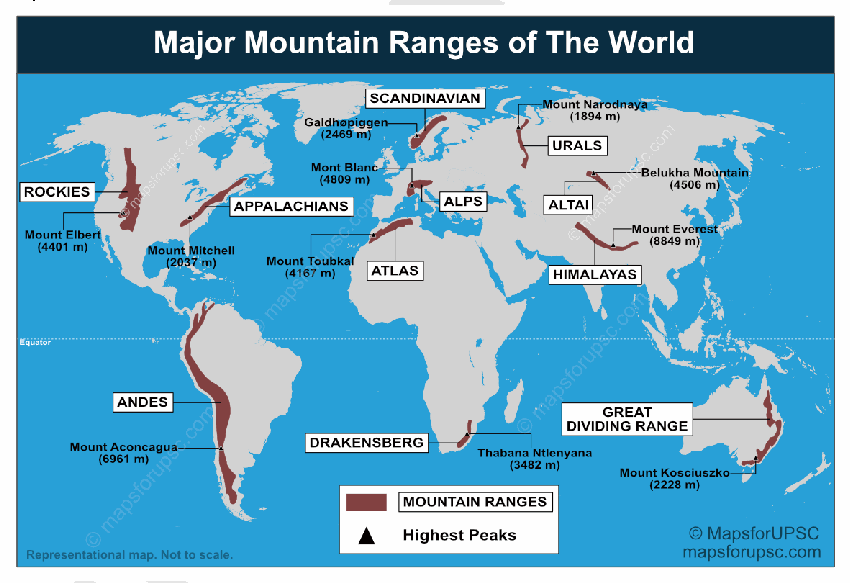

1. **Barrier to cold winds** - Blocks Siberian winds from entering India.

2. **Blocks** monsoon winds and brings rainfall in India

3. **Rain shadow effect** on the northern side in the **Tibetan Plateau. Eg- Ladakh**

4. **Glacial climate influence** - Regulates Ganga-Brahmaputra flow.

5. The range splits the **subtropical westerly jet stream**

a. Impacts **onset of the Indian Monsoon**

b. Brings **winter rain** (western disturbances) **Rocky Mountains (North-South Alignment)**

1. **Chinook winds formation** - Warm dry ("snow-eater") winds descend the eastern slopes

2. **Rain Shadow Effect-** They block Pacific moisture, creating the semi-arid **Great Plains** of the US and Canada. Eg- Great Basin desert.

3. **Temperature Gradients-** They create a sharp divide between the maritime climate of the Pacific Northwest and the continental climate of the interior.

4. Act as a catalyst for **tornado formation** in the central US.

**Andes (North-South Alignment)**

1. **Extreme Rain Shadow-** They block moisture from the Pacific, creating the **Atacama Desert**

2. **Rainfall** in eastern and northern part of Andes. Eg- Amazon rainforest

3. **Foehn Winds-** Known locally as the **Zonda,** these warm, dry winds descend the eastern slopes, causing rapid temperature spikes in Argentina.

4. **Altiplano Climate-** The high-altitude plateau creates a unique "cold-dry" climate at tropical latitudes.

**Alps (East-West Alignment)**

1. **Continental Divide-** They separate the mild Mediterranean climate of Italy from the cooler, humid climate of Northern Europe.

2. **Foehn Winds-** These warm winds can cause sudden snowmelt and avalanches on the northern slopes.

Eg- Switzerland.

3. **Fog Trapping-** Deep Alpine valleys often experience persistent winter fog and temperature inversions.

4. **Micro-Climates-** South-facing slopes receive significantly more sunlight and warmth than north-facing ones, affecting local agriculture.

5. **Precipitation Gradient-** The northern "windward" side receives significantly more rain/snow from Atlantic storms than the inner valleys. Eg- **Rain shadow zone in Swiss valleys**

6. **Cyclone deflection** - Alters European storm tracks.

**Western Ghats (North-South Alignment)**

1. **Orographic monsoon rainfall** - Heavy rain in Kerala.

2. **Rain shadow region** - Deccan Plateau semi-arid.

3. **Moderation of coastal climate** - High humidity west coast. Eg- Mumbai

4. **Biodiversity-rich humid climate** - Evergreen forests. Eg- Shola forests Thus, mountain systems function as critical regulators of global and local atmospheric dynamics.

**Impact of Mountains on Local Weather Conditions**

**Temperature**

1. **Altitude effect (lapse rate)** - Temperature decreases with height. Eg- Shimla cooler than Delhi, Andes highlands colder than Amazon basin.

2. **Blocking cold winds** - East-West ranges prevent polar air intrusion. Eg- Himalayas block Siberian winds from India, Alps shield Italy from cold northern winds.

3. **Temperature inversion in valleys** - Cold air trapped in basins. Eg- Kashmir Valley winter inversion, Swiss Alpine valleys fog trapping.

**Wind Systems**

1. **Barrier effect** - East-West mountains obstruct zonal winds. Eg- Himalayas obstruct mid-latitude westerlies, Alps deflect European storm winds.

2. **Channeling effect** - North-South ranges allow meridional air movement. Eg- Rockies allow Arctic air to move south into USA, Andes channel winds along Chilean coast.

3. **Local winds formation** - Descending warm winds on leeward side. Eg- Chinook east of Rockies; Foehn winds in Alps.

**Rainfall**

1. **Orographic rainfall** - Windward slopes receive heavy rain. Eg- Western Ghats heavy rainfall in Kerala, Andes eastern slopes high rainfall.

2. **Rain shadow effect** - Leeward side remains dry. Eg- Deccan Plateau behind Western Ghats, Atacama Desert behind Andes.

3. **Monsoon intensification** - Mountains enhance uplift of moist winds. Eg- Himalayas intensify South-West monsoon.

**Cyclones and Storm Systems**

1. **Cyclone weakening inland** - Mountains reduce storm intensity. Eg- Himalayas weaken Bay of Bengal cyclones, Andes weaken Pacific storms.

2. **Deflection of storm tracks** - Eg- Alps modify Mediterranean cyclone routes, Rockies influence US storm systems.

3. **Enhanced snowfall from disturbances** - Mountain uplift intensifies precipitation.

**Desert Formation**

1. **Rain shadow deserts** - Mountains block moist winds. Eg- Atacama Desert behind Andes, Deccan semi-arid region.

2. **Cold current + mountain interaction** - Enhances aridity. Eg- Atacama (Peru Current + Andes), Namib Desert (Benguela Current + Escarpment).

3. **Continental interior dryness** - Barrier limits maritime influence. Eg- Central Asian deserts behind Himalayas, Great Basin Desert behind Rockies.

---

1. Explanation_Drishti IAS:
Source Question: Briefly mention the alignment of major mountain ranges of the world and explain their impact on local weather conditions, with examples.

Mountain range refers to a series of ridges which originated in the same age and underwent the same processes. The most prominent or characteristic feature of mountain ranges is their long and narrow extension.

[View Offline Local Backup](http://drishtiias.com/images/uploads/1662102714_Mountain ranges and their influence.tif)

**Mountain ranges and their influence:**

- **Andes Mountain Range:** 

- The range stretches from north to south through seven countries in South America, along the west coast of the continent: Venezuela, Colombia, Ecuador, Peru, Bolivia, Chile, and Argentina.

- Because the Andes act as a large wall between the Pacific Ocean and the continent, they have a tremendous impact on weather in the region.

- The northern part of the Andes is typically rainy and warm, and the weather is also wet in the eastern part of central Andes, and the area to the southwest.

- To the west, the dry climate is dominated by the Atacama Desert in northern Chile. The mountains form a rain cover over the eastern plains of Argentina, which have extremely dry weather.

- **The Himalayas:** 

- The Himalayan mountain ranges are stretched over the northern borders of India. These mountain ranges run in a west-east direction from the Indus to the Brahmaputra. The Himalaya consists of 3 parallel ranges in its longitudinal extent.

- The mountain range in Asia separates the plains of the Indian subcontinent from the Tibetan Plateau.

- The Himalayas have a profound effect on the climate of the Indian subcontinent and the Tibetan Plateau. They prevent frigid, dry winds from blowing south into the subcontinent, which keeps South Asia much warmer than corresponding temperate regions in the other continents.

- **Rockies Mountain Range:** 

- These are massive mountain ranges that stretch from Canada to central New Mexico.

- These cast a fairly substantial rain shadow - a dry area on the leeward side of the mountain range, where wind does not hit, which forms because the mountains block rain-producing weather systems and create a metaphorical shadow of dryness.

- Wet weather systems begin in the Pacific Ocean and travel over the western states to the Rocky Mountains, and as the air moves higher up the western slope it cools and condenses, leaving rain and snow along the mountainside in its wake.

- Having been stripped of moisture, the air continues over the Rocky Mountains and dries out as it moves down the eastern slope. Because the air is now dry, it absorbs moisture from the landscape, leaving the earth more arid.

- Essentially, the rain shadow is a desert forced into existence because of the mountain range it borders, which prevents the eastern slopes and foothills from experiencing the same moisture that falls on the western side of the range.

- **Great Dividing Range:** 

- It runs roughly parallel to the east coast of Australia and forms the fifth-longest land-based mountain chain in the world, and the longest entirely within a single country.

- The Great Dividing Range blocks the flow of moist air coming from the Tasman Sea. This creates rain over the range and reduces the amount of rainfall in inland regions west of the range.

- **Atlas Mountains:** 

- The Atlas Mountains extend some 2,500 km across north-western Africa, spanning Morocco, Algeria and Tunisia. The mountain range separates the Mediterranean and Atlantic coastlines from the Sahara Desert.

- Westerly winds from the Atlantic Ocean carry moisture into the region, but the mountains act as a weather barrier between the coastal grasslands and wetlands and the Sahara Desert.

- The Atlas Range causes a rain shadow effect, preventing the areas beyond the mountains from receiving much rainfall. During the winter months, the highest peaks of the Atlas Mountains are among the few parts of Africa to see snow.

- **The Ural Mountains:** 

- It extends from the Kara Sea to the Kazakh Steppe along the border of Kazakhstan. Geographically, this range marks the northern part of the border between Europe and Asia.

- The northern side of the mountain range receives cool, rainy weather, while the southern side is a hot desert.

- The western side of the mountain range receives warm continental winds, while the eastern side is much cooler and drier.

The mountain ranges of the world provide essential ecosystem-based services to global communities as well as inspiration and enjoyment to millions. These are particularly important for their biodiversity, water, clean air, research, cultural diversity, leisure, landscape and spiritual values.

---

1. Explanation_PWOnlyIAS:
Source Question: Briefly mention the alignment of major mountain ranges of the world and explain their impact on local weather conditions , with examples.

| **Approach:** **Introduction**  • Briefly define the mountain ranges and its Characteristics **Body**  • Mention some mountain ranges of the word and its Climate Influence on local weather and climate. **Conclusion**  • Conclude your Answer with the importance of the mountain ranges. |
| --- |

### Introduction

** The major mountain ranges of the world are aligned along tectonic plate boundaries, where the movement of the Earth’s crust has resulted in the formation of large mountainous regions. The alignment of these mountain ranges can have a significant impact on local weather conditions, influencing temperature, precipitation, and wind patterns.

### Body

Mountain Ranges and its Climatic Influence. There are several important mountain ranges around the world that have significant climate influences on local weather and climate. Here are some examples: **The Himalayas**:

- It is located in Asia, the highest mountain range in the world.
- The Himalayas act as a barrier, preventing the movement of cold air from the north. Protect from harsh winters.

**Influence the** monsoon **winds that bring rainfall to India and other surrounding countries.** The Andes ****
It is located in South America, the longest mountain range in the world.
- The Andes act as a barrier, preventing the movement of moisture from the east and influencing the precipitation patterns in the region.
- It acts as a rain shadow zone for Atacama deserts.
- The Andes have an impact on the temperature and rainfall patterns in neighboring countries such as Argentina, Chile, and Peru. **The Rocky Mountains**:

- It is located in North America.
- The Rockies influence the movement of air masses, causing them to rise and cool, leading to increased precipitation on the western slopes and a rain shadow effect on the eastern slopes.
- They capture the moisturized winds from the Pacific and cause large amount of rainfall in its windward side,

**They also give a** rain-shadow effect **to the deserts in Southwest North America.** The Alps ****
The Alps, located in Europe.
- It acts as a barrier, preventing the movement of cold air from the north and influencing the precipitation patterns in the region.
- The Alps have a significant impact on the temperature and rainfall patterns in neighboring countries such as France, Switzerland, and Italy.
- Alps influence the presence and direction of local winds like Foehn, Mistral etc.

### Conclusion

Mountain ranges play a crucial role in shaping local weather, climate patterns, impacts on temperature, precipitation, and wind patterns, which can in turn have significant impacts on agriculture, water resources, and other aspects of local ecosystems and human societies. Therefore, understanding the impacts of mountain ranges on local weather and climate is important for managing natural resources and mitigating the impacts of climate change.

---

1. Explanation_Rau IAS:
Source Question: Briefly mention the alignment of major mountain ranges of the world and explain their impact on local weather conditions, with examples. (10 Marks, 150 Words)

### Introduction

The world's major mountain ranges align along plate boundaries and exert significant influence over regional weather and climate. Understanding their location and impacts is vital to human wellbeing, sustainable environmental management and geopolitical stability.

### Body

Mountain rangeAlignmentImpact on local weatherHimalayasStretches across complete west coast of North America from North to SouthActing as a barrier for monsoon winds. Shielding Indian landmass from cold and dry North Asian winds.RockiesStretches across complete west coast of North America from North to SouthCreation of Chinook local winds leading to now eater effect. The Great Plains, located east of the Rockies, are known for their prairie grasses.AtlasSouth West to North East direction stretching through Morocco, Algeria and Tunisia. Capture the moisture laden winds from Mediterranean causing rainfalls on windward side and also causing deficit on leeward side. Separating mediterranean type climate from dry Sub Saharan climate.AlpsWest to east, across 8 alpine countries, such as: France, Switzerland, Italy etc. Precipitation patterns, in South Europe and Eurasia.  The local winds like Foehn, Mistral induce unique weather patterns

### Conclusion

While shaping diverse natural environments, the world's mountain ranges make certain areas more habitable and prosperous but also prone to disasters. Their critical role in regional sustainability, development and climatic stability cannot be understated in this era of rapid change.

---

---

1. Explanation_Superkalam:
Source Question: Briefly mention the alignment of major mountain ranges of the world and explain their impact on local weather conditions, with examples.

Recent climate studies show mountain ranges control over 60% of global precipitation patterns, making their alignment crucial for understanding weather systems worldwide.

Orographic effect on a mountain cross section

##** Alignment of Major Mountain Ranges **###** East-West Aligned Ranges **-** Himalayas**: 2,400 km barrier from Pakistan to Myanmar, world's highest peaks
-** Alps**: European chain stretching 1,200 km across 8 countries
-** Caucasus Mountains**: 1,200 km between Black and Caspian Seas
-** Atlas Mountains**: 2,500 km across North Africa (Morocco to Tunisia)
-** Kunlun Range**: 3,000 km across Central Asia, separating Tibetan Plateau

###** North-South Aligned Ranges **-** Andes**: 7,000 km spine along South America's Pacific coast
-** Rocky Mountains**: 4,800 km from Canada to New Mexico
-** Ural Mountains**: 2,500 km dividing Europe and Asia
-** Great Dividing Range**: 3,500 km along Australia's eastern coast
-** Western Ghats**: 1,600 km parallel to India's west coast

##** Impact on Weather Conditions **|** Weather Effect **|** Windward Side **|** Leeward Side **|** Example **|
| --- | --- | --- | --- |
|** Precipitation **| Heavy rainfall (1,500-3,000mm) | Rain shadow (200-500mm) | Western Ghats vs Deccan Plateau |
|** Temperature **| Cooler, moderate | Warmer, extreme variations | Andes: Pacific vs Amazon sides |
|** Humidity **| High (80-90%) | Low (30-50%) | Rockies: Pacific Northwest vs Great Plains |

###** Specific Weather Phenomena **-** Orographic Rainfall**: Himalayas receive 2,500mm+ during monsoons, creating world's wettest regions like Cherrapunji
-** Foehn Winds**: Rocky Mountains create warm Chinook winds, raising temperatures by 20°C in hours
-** Monsoon Blocking**: East-west Himalayas trap monsoon moisture, preventing it from reaching Central Asia
-** Desert Formation**: Andes create Atacama Desert (0.1mm annual rainfall) through rain shadow effect
-** Valley Winds**: Daily thermal circulation in Alpine valleys affects local agriculture and settlement patterns

Mountain alignments fundamentally shape regional climates, with** Climate Change **intensifying these effects through altered precipitation patterns and** extreme weather events**.

---

1. Explanation_Unacademy:
Source Question: Q14. Briefly mention the alignment of major mountain ranges of the world and explain their impact on local weather conditions, with examples. (15 Marks, 250 Words) Tags: Salient features of world’s physical geography, geographical features and their location-changes in critical geographical features (including water-bodies and ice-caps) and in flora and fauna and the effects of such changes.

## **Decoding the Question** - **Introduction: Define the mountain ranges.** - **Body: Mention important mountain ranges** **along with its characteristics and its** **influence on the climate and local weather.** - **Conclusion: Conclude suitably.** **Answer:** A mountain range is a collection of ridges that developed simultaneously and underwent similar processes. The most notable or distinguishing characteristic of mountain ranges is their long and narrow extent. The Himalayas, the Alps Mountain range, the Atlas mountain range, the Andes mountain range, and the Rocky mountain ranges are among the world’s largest mountain ranges.

## **Important mountain ranges** 

 **Fig: Major Mountain Ranges of the World (In Brown,** **Pink and Grey Colour)** - **Alps:** It spans eight Alpine nations, including France, Switzerland, and Italy, and is the highest mountain range system in all of Europe. The Alps have an impact on local winds like the Foehn and Mistral, as well as the presence and direction of precipitationpatternsinSouthEuropeandEurasia.

- **The Ural Mountain range:** The Ural Mountain range runs sternly north to south through western Russia, from the shore of the Arctic Ocean to the Ural River and northern Kazakhstan. They emergedasaresultofthesupercontinentLaurussia colliding with the young, feeble continent of Kazakhstan. It is often believed that Asia and Europe’s natural border lies on their eastern sides. Since the 18th century, the mountains have served as a significant resource base for Russia.

- **Andes:** They are the longest continental mountain rangesintheentireworld.Theypassthroughseven South American countries as they move from north to south. In the north, east, and southwest of the Andes, it rains and is humid. The Atacama Desert is shielded from rain by the Andes.

- **The Himalayan Mountain range:** The lowlands of the Indian subcontinent are separated from the Tibetan Plateau in Asia by the Himalayan Mountain range. Some of the tallest peaks in the world, including Mount Everest, are found in this range. The Himalayas have an impact on the climate of the Tibetan Plateau and the Indian subcontinent. They maintain the subcontinent of South Asia much warmer than temperate regions on other continents by preventing cold, dry winds from flowing south into the area.

- **The Atlas:** The more than 2,500-kilometer-long Atlas Mountain range extends through Algeria, Morocco, and Tunisia (1,600 miles). The highest peak is Toubkal (4 165 metres), which is located in southwest Morocco. These mountains were created when Africa and Europe collided.

- **Rocky mountain range:** Southwest of the United States, from northern British Columbia to New Mexico, the Rocky Mountains are located. The formation of these winds depends heavily on the size and position of the warm, snow-eating Chinook winds. On their windward side, the Rockies produce ample rainfall and absorb moisture-rich Pacific breezes, while throwing a rain shadow over Southwest North America’s deserts. **Influence of Major Mountain Ranges on the Climate** ## **and Local Weather** - Mountains are unique ecosystems that stand out for their complexity and diversity.

- Extreme climatic and geomorphic events are more likely to be sparked by steep topographic, climatic, and biological gradients paired with stark seasonal contrasts, which may then have a significant impact on natural and human settings. Example: Patagonian deserts (cold).

- A change in climatic circumstances may have an impact on poverty and food security because 12 percent of the world’s population lives in mountains, and the vast majority of them do so in developing nations that are economically and physically marginalised.

- Mountains serve a vital function in the nearby lowlandsas“watertowers,”storingandtransporting fresh water to downstream communities as well as having the ability to generate electricity through hydropower.

- Mountain environments are “fragile,” they can be harmed by a variety of factors, including deforestation, overgrazing by livestock, cultivation on marginal soils, and advancement of urbanisation, all of which may cause a rapid decline in biodiversity and water resources as well as an increase in natural hazards, putting at-risk populations nearby at risk. Mountain ranges have a huge impact on the local weather and the way of life of the populace. They are therefore important in terms of cultural and economic issues in addition to geography. These are especially **significantfortheirbiodiversity,cleanwater,freshair,** **research, diversity of cultures, leisure, and spiritual** **benefits.** Communities rely on them as sources of revenue from agriculture, tourism, and the utilisation of natural resources.

---

---

Q70. Why is India considered as a subcontinent? Elaborate your answer.
[Year: 2021] [Group: UPSC CSE] [Exam: Mains] [Stage: Mains] [Paper: Mains - GS 1]
[Subject: GEOGRAPHY]
[Section Group: Physical Geography & Geophysical Phenomena]
[Microtopic: Salient Features of World Physical Geography]
[Subtopic: Geomorphology]
[Macrotag: Descriptive, Applied]
[Microtag: Elaborate, Why, India]

1. Explanation_Civilsdaily:
Source Question: Why is India considered as a sub-continent? Elaborate your answer. [Year: 2021] [Marks: 10]

A **subcontinent** is a large, distinct landmass that is geographically, geologically, climatically, and culturally separate from the rest of a continent.

The term "Indian Subcontinent" typically includes India, Pakistan, Bangladesh, Nepal, Bhutan, Sri Lanka, and the Maldives.

**India is considered a subcontinent due to following reasons**

1. Distinct Geographical Boundaries

- Bounded by **Himalayas in the north, Indian Ocean in the south, Arabian Sea in the west,** and **Bay of Bengal in the east.**

- These natural barriers provide a **clear physical separation from the rest of Asia.**

2. Independent Geological Evolution

- The **Indian Plate** was originally part of **Gondwanaland** and drifted northward.

- Its collision with the **Eurasian Plate** led to the formation of the **Himalayas.** This gives India a **separate tectonic identity.**

3. Physiographic Diversity - Presence of Himalayas, Indo-Gangetic plains, Peninsular plateau, Thar desert, coastal plains, and islands.

4. Climatic Variations

- Dominance of the **monsoon system (80% of rainfall),** which is unique in its seasonal reversal.

- At the same time, it has **tropical, subtropical, temperate, and alpine climates.**

5. Major river systems such as **Himalayan and Peninsular rivers** form an integrated and independent drainage network.

6. Cultural and Historical Distinctiveness

- A long and continuous **civilizational history.** Eg- From indus valley civilization to present day “mother of democracies"

- Enormous **linguistic, religious, and ethnic diversity,** yet a strong cultural coherence. EgIndo-Aryan, Dravidian, Austroasiatic, and Tibeto-Burman

7. Economic and Resource Base - Self-sufficient in terms of agriculture, minerals, and human resources.

Eg- green revolution These features collectively make it a **well-defined and self-contained geographical unit within Asia.**

---

1. Explanation_Drishti IAS:
Source Question: Why is India considered as a subcontinent? Elaborate your answer.

The Indian subcontinent, or simply the subcontinent, is a physiographic region in South Asia. It is situated on the Indian Plate, projecting southwards into the Indian Ocean from the Himalayas.

Geologically, the Indian subcontinent is related to the landmass that drifted from the supercontinent Gondwana during the Cretaceous and merged with the Eurasian landmass nearly 55 million years ago. Geographically, it is the peninsular region in South-Central Asia, delineated by the Himalayas in the north, the Hindu Kush in the west, and the Arakanese in the east.

This natural physical landmass in South Asia has been relatively isolated from the rest of Eurasia. The Himalayas (from Brahmaputra River in the east to Indus River in the west), Karakoram (from Indus River in the east to Yarkand River in the west) and the Hindu Kush mountains (from Yarkand River westwards) form its northern boundary. The Indian Ocean, Bay of Bengal and Arabian Sea form the boundary of the Indian subcontinent in the south, south-east and south-west.

Moreover, India’s high population and its multiple races, religions, castes, languages, customs make it look like a small continent like the subcontinent. The diversity is largely a result of physical aspects of the land itself, which in turn shaped historical events such as migrations and invasions. However, in spite of numerous differences, at the root there are numerous similarities in the socio-cultural-economic way of life.

---

1. Explanation_Rau IAS:
Source Question: Why is India considered as a subcontinent? Elaborate your answer. (10 Marks, 150 Words)

### Introduction

The Indian subcontinent (also known as the subcontinent) is a physiographic area in South Asia. It is located on the Indian Plate, which extends southwards from the Himalayas into the Indian Ocean. Bangladesh, Bhutan, India, Maldives, Nepal, Pakistan, and Sri Lanka are all part of it.

### Body

**India being called a Subcontinent because:**

- Indian landmass sits over its own distinguished plate which is different from Eurasian plate

- India used to be a continent in the past. It then became a part of Asia as a result of continual land migration and continental drift.

- It takes up 2.4 percent of the entire land area on the planet. It has a land border of around 15,200 kilometres and a coastline of about 7516.6 kilometres.

- Natural boundaries such as the Himalayas in the north and the Deccan Peninsula in the south give it a distinct global character.

- India, Pakistan, Nepal, Bhutan, Bangladesh, Sri Lanka, and the Maldives are the nations that make up the Indian subcontinent from a political standpoint.

- Ethnic, linguistic, cultural, and historical ties bind the people of the Indian subcontinent.

### Conclusion

While powerful displays of nature, volcanic eruptions can devastate communities and environments. Advance monitoring, disaster preparedness and risk aware development around volcanoes are essential locally and internationally. Equitable cooperation on resilience and compensation can aid recovery to safeguard lives, livelihoods, public health and regional security in this age of global connections.

---

---

1. Explanation_Superkalam:
Source Question: Why is India considered as a subcontinent? Elaborate your answer.

India is classified as a subcontinent due to its distinct geological formation and unique geographical characteristics that set it apart from the rest of Asia.

Indian Subcontinent physical map and landmass

##** Geological Distinctiveness **-** Tectonic Independence**: India sits on the separate Indian Plate, which collided with the Eurasian Plate around 50 million years ago, creating the Himalayas
-** Ancient Rock Formations**: Peninsular India contains some of Earth's oldest rocks dating back 3.8 billion years in the Dharwar Craton
-** Deccan Plateau Formation**: One of world's largest basaltic formations created by volcanic activity 66 million years ago
-** Ongoing Geological Activity**: Recent 2024 studies show continued crustal delamination beneath the Himalayas
-** Distinct Geological History**: India's geological evolution differs significantly from mainland Asia due to its northward drift from Gondwana

Indian Plate Movement and Collision with Eurasian Plate showing formation of Himalayas and India's geological boundaries

##** Physical Isolation through Natural Boundaries **|** Direction **|** Natural Barrier **|** Isolation Effect **|
| --- | --- | --- |
| North | Himalayas (8,848m peak) | Complete separation from Central Asia |
| West | Arabian Sea + Thar Desert | Isolation from Middle East |
| East | Bay of Bengal + Dense forests | Separation from Southeast Asia |
| South | Indian Ocean | Maritime frontier |

-** Himalayan Wall**: World's highest mountain range creating impenetrable northern barrier
-** Maritime Boundaries**: Three sides surrounded by water bodies providing natural isolation
-** Desert Barriers**: Thar Desert adds to western isolation along with Arabian Sea

##** Climatic Uniqueness **-** Independent Monsoon System**: India's monsoon operates largely separate from other Asian weather patterns
-** Seasonal Wind Reversal**: Unique thermal contrasts between landmass and oceans drive distinctive seasonal changes
-** Multiple Climate Zones**: Spans from arctic conditions in Ladakh to tropical climates in Kerala within single political boundary
-** Western Ghats Effect**: Creates unique orographic rainfall patterns different from mainland Asia
-** Recent Climate Patterns**: 2024-25 data shows monsoon arriving 5-7 days earlier, demonstrating autonomous weather system

##** Size and Biodiversity Significance **-** Substantial Size**: 3.28 million km² representing 2.4% of global land area - larger than most continents' individual countries
-** Biodiversity Hotspots**: Contains 4 of world's 36 biodiversity hotspots (Western Ghats, Eastern Himalayas, Indo-Burma, Sundaland)
-** Endemic Species**: Over 91,000 animal species and 45,000 plant species with high endemism rates
-** Ecological Distinctiveness**: Unique flora and fauna evolved due to geographical isolation
-** Continental Scale**: Comparable in size to Europe, supporting diverse ecosystems and populations

India's subcontinental status reflects its geological independence, comprehensive natural boundaries, autonomous climate systems, and continental-scale biodiversity, making it a geographically self-contained entity within Asia.

---

1. Explanation_Unacademy:
Source Question: Q8. Why is India considered as a sub-continent? Elaborate your answer. (10 Marks, 150 words) Tags: Characteristics of Indian Landmass

## **Decoding the Question** - **Introduction: Define a Subcontinent.** ## **y Body** - **Give characteristics of Indian Landmass** **what makes it a subcontinent.** - **Mentionothergeographicalpeculiarities** **of the Indian Subcontinent.** - **Conclusion: Conclude with how even after so** **much geographical diversity there is cultural** **similarity which makes it a sub-continent.** **Answer:** The term subcontinent signifies a **“subdivision of a** **continentwhichencompassesadistinctgeographical,** **political, or cultural identity”** and also a **“large land** **mass somewhat smaller than a continent”.** In most cases, subcontinent is on a distinct tectonic plate from the remainder of the continent, providing a geological justification for the terminology.

## **Characteristics of Indian Landmass** - India may be a subcontinent located in South of Asian continent. It’s considered a subcontinent because it covers an expansive area of land that has the Himalayan region within the north, the Gangetic Plain likewise because the plateau region within the south. It **includes the countries** **of Bangladesh, Bhutan, India, Maldives, Nepal,** **Pakistan, etc.** - This natural physical landmass in South Asia has been relatively isolated from the rest of Eurasia.

- The Himalayas (from **Brahmaputra within the** east to **river within the** west), Karakoram (from **river within the** east to Yarkand River **within** **the** west) **and therefore the range of mountains** mountains (from Yarkand River westwards) form its boundary **within the** north.

- In the west it’s bounded by the mountain ranges of **Hindu Kush Mountains,** Sulaiman Mountains, Kirthar Mountains, among others, with the Western side of the border (between **the Sulaiman** **Range and also the Chaman Fault)** is the western boundary of the Indian Plate, where, along the Eastern **Hindu Kush Mountains,** lies the Afghanistan-Pakistan border.

- **In the east, it is bounded by Patkai, Naga, Lushai** **and Chin hills.** 

 **Fig: Indian Sub-continent** ## **Other Geographical Peculiarities** - **Geologically,** the Indian subcontinent is expounded to the landmass that drifted from the supercontinent Gondwana during the Cretaceous and merged with the Eurasian landmass nearly 55 million years ago.

- **Geographically,** it’s the peninsular region in South-Central Asia, delineated by the Himalayas within the north, the chain of mountains within the west, and therefore the Arakan chain within the east.

- **Climatically,** India has variation in climate almost liketheAsianmainland.WhiletheAsianmainland experiences cold polar winds, India has a polar climate along the Himalayan belt. Similarly, desert climate exists along the North western region while rainiest place within the world occurs at Mawsynram.

- **The neighbouring geographic regions round the** subcontinent include the Tibetan Plateau to the north, Indo-Chinese Peninsula to the east, and Persian Plateau (or Greater Iran) to the west. The ocean, Bay of Bengal and Arabian Sea forms the boundary of the Indian subcontinent within the south, south-east and south-west. **Within the** **subcontinent itself, there is a wide variety of** **peoples, languages and religions.** However, in spite of numerous differences, at the root there are **numerous similarities in the sociocultural-** **economic way of life which are unique and makes this** **region a proper subcontinent.** ---

---

Q71. Discuss the geophysical characteristics of Circum-Pacific Zone.
[Year: 2020] [Group: UPSC CSE] [Exam: Mains] [Stage: Mains] [Paper: Mains - GS 1]
[Subject: GEOGRAPHY]
[Section Group: Physical Geography & Geophysical Phenomena]
[Microtopic: Salient Features of World Physical Geography]
[Subtopic: Geomorphology]
[Macrotag: Analytical]
[Microtag: Discuss]

1. Explanation_Civilsdaily:
Source Question: Discuss the geophysical characteristics of Circum- Pacific Zone. [Year: 2020] [Marks: 10]

The Circum-Pacific Zone, popularly known as the **"Ring of Fire,"** is a 40,000 km horseshoe-shaped belt encircling the Pacific Ocean.

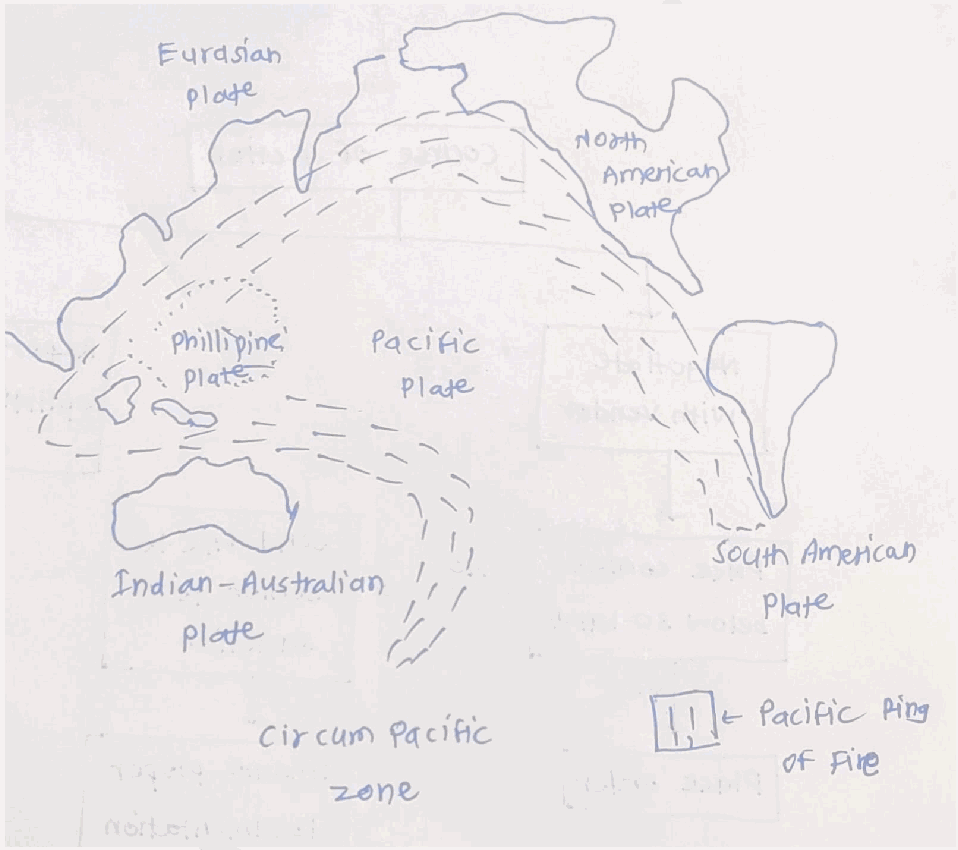

**Major Geophysical Characteristics**

1. Convergent Plate Boundaries - Oceanic plates subduct beneath continental or oceanic plates leading to formation of Benioff seismic zones (deep-focus earthquakes).

a. Nazca Plate subducting under the South American Plate,

b. Pacific Plate under the Eurasian Plate.

2. **Transform boundary faults-** Eg- **San Andreas Fault** in California and the **Alpine Fault** in New Zealand.

3. About **90% of the world’s earthquakes** occur in this belt. Includes **shallow, intermediate, and deep focus earthquakes.** Eg- Japan, Chile, Alaska earthquake zones.

4. Contains nearly **75% of the world’s active and dormant volcanoes.** Eg- **Mount Fuji (Japan), Mount St. Helens (USA), Cotopaxi (Ecuador).**

5. Volcanic Arcs

a. Curved chains of volcanic islands formed parallel to trenches. Eg- **Philippines, Indonesia, Aleutian Islands.**

b. Continental volcanic arcs. Eg- **Andes Mountains.**

6. Back-Arc Basins- Behind volcanic arcs, the crust sometimes stretches and thins, creating basins like the Sea of Japan.

7. Deep Ocean Trenches - Long, narrow, and deepest parts of the oceans formed due to subduction. EgMariana Trench, Peru-Chile Trench, Japan Trench.

8. Young Fold Mountains - Formed due to intense compression and orogenic activity. Eg- Rockies and Andes.

9. Tsunami-Prone Region due to undersea earthquakes and volcanic eruptions. Eg- 2011 Japan tsunami.

Its geophysical features not only explain the concentration of natural hazards but also provide significant **mineral resources, geothermal energy, and fertile volcanic soils**

---

1. Explanation_Drishti IAS:
Source Question: Discuss the geophysical characteristics of Circum-Pacific Zone.

The Circum-Pacific Belt, also referred to as The Ring of Fire, is a path along the PacificOcean characterized by active volcanoes and frequent earthquakes.

### Basic characteristics

- **Location:** A nearly continuous chain of volcanoessurroundsthe Pacific Ocean. The chain passes along the west coast of North and South America, from the Aleutian Islandsto the south of Japan, from Indonesia to the Tonga Islands, and New Zealand.

- **Formation:** This Circum-Pacific chain of volcanoes and themountain ranges associated with it owe theirformation to the repeated subduction of the oceanic lithosphere beneath the continents and the islands that surround the Pacific Ocean. The Ring of Fire is the result of plate tectonics (Convergent, Divergent Plate Boundary, Transform Plate Boundary).

- **Formation of Hot Spots:** The Ring of Fire is also home to hot spots, areas deep within the Earth’s mantle from which heat rises. This heat facilitatesthe melting of rock in the brittle, upper portion of the mantle. The melted rock, known as magma, often pushesthrough cracksin the crust to form volcanoes. The examples of volcanoes include Mount Fuji of Japan, Aleutian Islands of US, Krakatau Island of Indonesia, etc.

- **Harbors Majority of Volcano & Earthquakes:** 75% of Earth’s volcanoes are located along the Ring of Fire. 90% of earthquakes occur along its path, including the planet’s most violent and dramatic seismic events.

As the Circum-Pacific Belt harbors the majority of global Volcanic eruptions & Earthquakes, it holds immense significance regarding the study of the earth’s interior.

---

1. Explanation_PWOnlyIAS:
Source Question: Discuss the geophysical characteristic of the Circum- Pacific zone.

**Answer:**

| **Approach:** **Introduction**  • Write briefly about the Circum- Pacific Zone. **Body**  • Mention the salient geophysical characteristics of Circum- Pacific Zone. **Conclusion**  • Conclude your answer with a Futuristic Approach. |
| --- |

### Introduction

**The Circum-Pacific Zone, also known as the** Ring of Fire **, is a region surrounding the Pacific Ocean characterized by high seismic and volcanic activity.**

### Body

**Characteristics of Circum- Pacific Zone:**
- **Formation:** The Circum-Pacific zone was formed by the **subduction** of oceanic plates beneath the continents and islands surrounding the Pacific Ocean, resulting in volcanic activity and seismic activity.
- **Location:** The Circum-Pacific zone is a nearly continuous chain of volcanoes that surrounds the Pacific Ocean, passing along the west coast of North and South America, Asia, and Oceania.
- **Formation of Hotspot:** The formation of hotspots in the Circum-Pacific zone is facilitated by the rising of heat from areas deep within the Earth’s mantle, which causes the melting of rock in the upper portion of the mantle. This melted rock, called magma, often pushes through the crust to form volcanoes.
- **Volcanoes and earthquakes:** The Circum-Pacific zone is home to more than 75% of Earth’s volcanoes, including famous ones like **Mount Fuji in Japan** and **Krakatau in Indonesia.** It also experiences around 90% of the world’s earthquakes, including some of the most powerful ones in history, due to its location along tectonic plate boundaries.

### Conclusion

Geophysical characteristics of the Circum-Pacific Zone make it a region of significant geological activity and hazards, including earthquakes, volcanic eruptions, and tsunamis. These characteristics are essential for ensuring the safety and resilience of the communities living in this region.

---

1. Explanation_Rau IAS:
Source Question: Discuss the geophysical characteristics of Circum- Pacific Zone. (15 Marks, 250 Words)

### Introduction

The Circum-Pacific Zone, also known as the Pacific Ring of Fire, is a horseshoe-shaped belt encircling the Pacific Ocean, notable for its frequent earthquakes and numerous active volcanoes, indicative of the dynamic tectonic interactions within this region.

### Body

**Geophysical characteristics of Circum- Pacific Zone**

**Tectonic Activity:**

- **Plate Movements:** This area is where tectonic plates interact with each other. One plate is pushed under another by subduction, and there are also transform and divergent boundaries, each with its own geophysical effects.

- **Earthquakes:**Tectonic movements trigger frequent earthquakes, rendering this zone one of the most seismically active regions globally. For instance, the devastating 2011 Tohoku earthquake in Japan emanated from the subduction activity in this zone.

**Volcanism:**

- **Volcanic Arcs:** Subduction of oceanic plates beneath continental plates engenders volcanic arcs, exemplified by the Cascade Range in North America and the Andes in South America.

- **Volcanic Islands:** Similarly, the subduction zones foster the formation of volcanic islands such as the Philippines and Japan, which collectively host over 200 active volcanoes.

**Orogenesis:**

- **Mountain Building:** The intense tectonic activity culminates in the formation of significant mountain ranges like the Rockies and the Andes, epitomizing the dynamic geology of the zone.

**Marine Trenches:**

- **Formation:**The subduction activity creates profound marine trenches like the Mariana Trench, which plunges to a depth of about 36,070 feet, and the Tonga Trench.

- **Depth and Features:**These trenches, being among the deepest parts of the world's oceans, embody the colossal geological forces operational in the Circum-Pacific Zone.

### Conclusion

The Circum-Pacific Zone's geophysical features show how strong the natural forces are that are at work, creating an interesting geological scene. Through diligent research and monitoring, the inherent natural hazards can be better anticipated, fostering safer habitation and sustainable development across the Pacific Rim.

---

---

1. Explanation_Superkalam:
Source Question: Discuss the geophysical characteristics of Circum- Pacific Zone.

The** Circum-Pacific Zone **or "Ring of Fire" forms a 40,000 km belt around the Pacific Ocean, representing Earth's most geologically active region with 90% of global earthquakes and 75% of active volcanoes.

Pacific Ring of Fire Map 2020

## Tectonic Framework

-** Convergent Plate Boundaries**: Multiple oceanic plates (Pacific, Nazca, Juan de Fuca) subducting beneath continental plates
-** Transform Faults**: San Andreas Fault system extending 1,200 km along California coast
-** Triple Junctions**: Complex intersections like the Mendocino Triple Junction off California
-** Subduction Zones**: Cascadia, Japan Trench, and Peru-Chile systems creating continuous seismic activity
-** Back-Arc Basins**: Sea of Japan and Philippine Sea formed by extensional processes

## Volcanic Characteristics

-** Stratovolcanoes**: Dominant volcanic type including Mount Fuji, Mount Rainier, and Cotopaxi
-** Volcanic Arcs**: Japanese archipelago, Aleutian Islands, and Andes mountain chain
-** Calderas**: Yellowstone (USA), Toba (Indonesia), and Taupo (New Zealand) supervolcanic systems
-** Recent Activity**: 2022 Hunga Tonga eruption and ongoing Kilauea eruptions demonstrate continuous volcanism
-** Pyroclastic Flows**: Regular occurrence along the entire belt affecting millions of people

## Bathymetric Features

| Feature | Location | Depth/Height |
| --- | --- | --- |
| Mariana Trench | Western Pacific | 11,034 m (deepest) |
| Peru-Chile Trench | Eastern Pacific | 8,065 m |
| Japan Trench | Northwestern Pacific | 9,000 m |
| Aleutian Trench | North Pacific | 7,679 m |

-** Abyssal Plains**: Extensive flat seafloor areas interrupted by seamount chains
-** Guyots**: Flat-topped underwater mountains indicating past sea-level changes

## Seismic Activity

-** Earthquake Frequency**: Over 80% of world's largest earthquakes (magnitude 8+)
-** 2024 Statistics**: 15,847 earthquakes above magnitude 4.0 recorded
-** Tsunami Generation**: Pacific Tsunami Warning Center monitors 46 countries
-** Recent Events**: 2024 Noto Peninsula earthquake (Japan) and Taiwan's Hualien earthquake
-** Seismic Gaps**: Identified zones with potential for future major earthquakes

## Geothermal and Mineral Resources

-** Geothermal Energy**: Philippines, Indonesia, and New Zealand leading producers
-** Mineral Deposits**: Copper (Chile), gold (Alaska), and rare earth elements
-** Hydrothermal Vents**: Unique ecosystems and potential mining sites
-** Oil and Gas**: Significant reserves in Alaska, California, and Southeast Asia
-** Polymetallic Nodules**: Deep-sea mining potential in abyssal regions

The Circum-Pacific Zone remains Earth's most dynamic geological laboratory, with the** 2025 Pacific Ring of Fire Monitoring Initiative **utilizing AI-based early warning systems to protect over 500 million people living within this tectonically active belt.

---

1. Explanation_Unacademy:
Source Question: Q4.DiscussthegeophysicalcharacteristicsofCircum- Pacific Zone. (150 words, 10 marks)

**Tag:** Salient features of the world’s physical geography.

## **Decoding the Question** - **In Introduction, try to begin by writing** **about Circum-Pacific Zone.** - **In Body, talk about physical features i.e.,** **Area, Composition, etc., of the Circum-** **Pacific Zone.** - **Conclude by citing the importance of** **Circum-Pacific Zone.** **Answer:** The Circum-Pacific Zone is the **area or path around** **the rim of the Pacific Ocean.** It is also called the **‘ring** **of fire’** due to the existence of active volcanoes in this area.

## **Geophysical Characteristics of Circum-Pacific Zone** - **Length and Shape:** The Ring of Fire looks like a **horseshoe-shaped belt** which is about 40,000 km long and 500 km wide.

- **Geographical Area:** It traces boundaries between **several tectonic plates** including the Pacific, Juan de Fuca, Cocos, Indian-Australian, Nazca, North American, and Philippine Plates.

- **Volcanoes and Earthquakes:** Approximately 75% of Earth’s volcanoes including underwater volcanoes are located along the Ring of Fire and 90% of Earth’s earthquakes occur along its path. Examples: Mount St Helens in the USA, Ojos del Salado on Andes Mountain, Mount Fuji of Japan.

- **Composition:** Many of these volcanoes were formed through the **process of subduction.** The plates overlap at convergent boundaries called subduction zones. Therefore, **it is the result of** **Convergent Plate Boundary, Divergent Plate** **Boundary, and Transform Plate Boundary.** - **Soils:** The soils of the Pacific Ring of Fire include **andosols,** created by the weathering of volcanic ash. They contain large proportions of volcanic glass. As circum-pacific zone **holds earth’s most volcanic** **activity** and earthquakes, it gives scientists the insight of earth’s interior. The study of this zone also proves the hypothesis such as, **sea floor spreading.** The deep study by scientists and geologists is used by policymakers for natural disaster management and mitigation programs.

---

---

Q72. Define mantle plume and explain its role in plate tectonics.
[Year: 2018] [Group: UPSC CSE] [Exam: Mains] [Stage: Mains] [Paper: Mains - GS 1]
[Subject: GEOGRAPHY]
[Section Group: Physical Geography & Geophysical Phenomena]
[Microtopic: Salient Features of World Physical Geography]
[Subtopic: Geomorphology]
[Macrotag: Descriptive]
[Microtag: Define, Explain]

1. Explanation_Civilsdaily:
Source Question: Define mantle plume and explain its role in plate tectonics. [Year: 2018] [Marks: 10]

A **mantle plume** is a narrow, localized column of abnormally hot, buoyant rock that rises through the Earth's mantle from the **core-mantle boundary** (approx. **2,900 km** deep).

**Characteristics of Mantle Plumes**

1. **Mushroom-shaped structure** - Broad head and narrow tail.

2. **Temperature-** Plumes are 100-300°C hotter than the surrounding ambient mantle.

3. **Buoyant upwelling** due to lower density.

4. **Stationary relative to moving plates** - Forms volcanic chains.

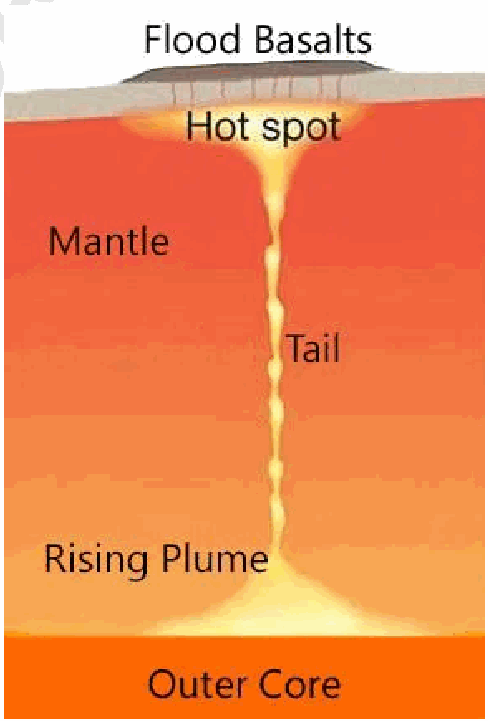

5. **Basalts** derived from plumes show **distinct isotopic and chemical signatures** compared to mid-ocean ridge basalts. Eg- high MgO concentrations **Role of mantle plumes in plate tectonics**

**1.** Plumes provide evidence of vertical convection within mantle.

**2. Intraplate Volcanism (Hotspots) -** Mantle plumes create volcanic activity away from plate boundaries.

Eg- Hawaiian Island chain formed over a Pacific plate hotspot.

**3. Formation of Volcanic Island Chains -** As tectonic plates move over stationary plumes, a chain of volcanoes forms. Eg- Hawaiian-Emperor Seamount Chain

**4. Continental Flood Basalts -** Plume head eruption can cause massive basalt outpourings. Eg- Deccan Traps in India (~66 million years ago).

**5. Plate Breakup and Rifting -** Mantle plumes can weaken lithosphere, initiating continental rifting.

a. East African Rift System.

b. Role in breakup of Gondwana

**6. Thermal Uplift of Lithosphere -** Hot plume material causes crustal doming before volcanic eruption.

7. Recent **research** suggests that the intense thermal weakening caused by a plume can cause a tectonic plate to collapse under its own weight, potentially **initiating a new subduction zone.**

Plume activity and plate motion together form an integrated framework for understanding Earth's tectonic evolution.

---

1. Explanation_Drishti IAS:
Source Question: Define mantle plume and explain its role in plate tectonics. (2018)

Mantle plume is an upwelling of abnormally hot rock within the earth's mantle which carries heat upward in narrow, rising columns, driven by heat exchange across the core-mantle boundary. Eventually, the rising column of hot rock reaches the base of the lithosphere, where it spreads out, forming a mushroom-shaped cap to the plume. Heat transferred from the plume raises the temperature in the lower lithosphere to above melting point, and forms magma chambers that feed volcanoes at the surface. It is a secondary way through which earth loses heat. In 1971, geophysicist W. Jason Morgan developed the hypothesis of mantle plumes.

**Role of Mantle Plumes in Plate Tectonics**

- Mantle plumes transport primordial mantle material from below the zone of active convection; produce time-progressive volcanic chains; break up continents; and act as a driving force for plate tectonics.

- The narrow conduits of deep-mantle material rise through the solid mantle before spreading out laterally in the upper asthenosphere. From there, they cause the lithosphere to swell and shear as the heat from the plume increases the temperature of lower lithosphere.

- Mantle plumes are also thought to be the cause of volcanic centers known as hotspots and probably have also caused flood basalts.

- As the plume remains anchored at the core-mantle boundary and it does not shift position over time, a string of volcanoes is created when the lithospheric plate moves above it. The formation of the Hawaiian Island and Emperor Seamount chain in the middle of the Pacific Plate are caused by mantle plume.

---

1. Explanation_Superkalam:
Source Question: Define mantle plume and explain its role in plate tectonics.

A** mantle plume **is a column of hot, buoyant rock rising from Earth's deep mantle, creating hotspot volcanism and significantly influencing plate tectonic processes.

2018 Mantle plume geological cross section

## Definition and Structure of Mantle Plumes

-** Mushroom-shaped structure **consisting of a large bulbous head (1000-2000 km diameter) and narrow tail (100-200 km wide)
- Originate from the** core-mantle boundary **at 2,900 km depth in the D" layer
- Composed of material** 100-200°C hotter **than surrounding mantle, making it less dense and buoyant
- Rise through** thermal convection **at rates of 5-10 cm/year
- Remain relatively** stationary **while tectonic plates move over them

## Formation Mechanism

-** Temperature differences **at core-mantle boundary create thermal instabilities
- Hot material accumulates and eventually breaks free as ascending plumes
-** Decompression melting **occurs as plumes approach surface, generating magma
- Recent studies suggest some plumes may originate from** transition zone **at 410-660 km depth
- Chemical composition often differs from mid-ocean ridge basalts, indicating deep mantle source

## Role in Plate Tectonics

### Plate Boundary Formation

-** Continental breakup**: Karoo-Ferrar plume contributed to Gondwana fragmentation 180 million years ago
-** Rift initiation**: Ethiopian plume system creating East African Rift System
-** Triple junction formation**: Afar plume creating Red Sea-Gulf of Aden junction

### Hotspot Volcanism

-** Hawaiian-Emperor chain**: Pacific plate movement over Hawaiian plume for 80 million years
-** Yellowstone track**: North American plate motion over Yellowstone hotspot
-** Iceland**: North Atlantic plume creating unique on-ridge hotspot

### Large Igneous Provinces (LIPs)

-** Deccan Traps **(66 Ma): Réunion plume creating massive flood basalts during India's northward journey
-** Siberian Traps **(252 Ma): Associated with Permian-Triassic mass extinction
-** Columbia River Basalts **(16 Ma): Yellowstone plume activity

Mantle plumes serve as** deep Earth's thermal engines**, driving plate reorganization and creating some of Earth's most spectacular volcanic features while providing insights into mantle dynamics.

---

1. Explanation_Unacademy:
Source Question: Q6. Define mantle plume and explain its role in plate tectonics. (10 marks, 150 words) Tag: Salient features of the World’s Physical Geography.

## **Decoding the Question** - **In Introduction, define Mantle plume.** - **In Body, try to write the role of plume in** **plate tectonics.** - **In Conclusion, mention the debate between** **plume and plate theory, eventually helping** **in understanding the origin of Earth.** **Answer:** Mantle plume is an **upwelling of abnormally hot rock** within the earth’s mantle, which carries heat upward in narrow,risingcolumns,drivenbyheatexchangeacross the core-mantle boundary. Because the plume head partially melts on reaching shallow depths, a plume is often invoked as the cause of volcanic hotspots, such as Hawaii or Iceland, and large igneous provinces such as the Deccan and Siberian traps. Some such volcanic regions lie far from tectonic plate boundaries, while others represent unusually large-volume volcanoes near plate boundaries.

## **Role of mantle plume in plate tectonics** - The plate tectonics suggests that **“anomalous”** volcanism results from lithospheric extension that permits melt to rise from the asthenosphere. The driving force which causes motion of the plates is the **convection current** formed in the mantle.

 - It is, thus, the **conceptual inverse of the plume** **hypothesis because the plate hypothesis** attributes volcanism to shallow, near-surface processes associated with plate tectonics, rather than active processes arising at the core-mantle boundary.

- **Lithospheric extension is attributed to processes** **related to plate tectonics.** - These processes are well understood at **mid-** **ocean ridges,** where most of Earth’s volcanism occurs.

 - It is less commonly recognized that the plates themselves deform internally, and can permit volcanism in those regions where the deformation is extensional. For example, the BasinandRangeProvinceinthewesternUSA, the East African Rift Valley, and the Rhine Graben.

 - Under this hypothesis, variable volumes of magmaareattributedtovariationsinchemical composition (large volumes of volcanism corresponding to more easily molten mantle material) rather than to temperature differences.

 - Mantle plumes are also **thought to be the** **cause of volcanic centers** known as hotspots and probably have also caused flood basalts. Since 1971, the mantle plume hypothesis, although never universally accepted, has become **the most** **widely held explanation for so-called anomalous** **volcanism.** Over the years, the hypothesis has continuedtobedebated.Thedebatebetweenplate-and **plume-tectonics** is considered in view of the growth and breakdown of supercontinents, active rifting, the formation of passive volcanic-type continental margins, and the **origin of time-progressive volcanic** **chains on oceanic and continental plates.** Due to its abnormal significance, mantle plume plays a major part in geomorphology.

---

---

Q73. Why are the world’s fold mountain systems located along the margins of continents? Bring out the association between the global distribution of Fold Mountains and the earthquakes and volcanoes.
[Year: 2014] [Group: UPSC CSE] [Exam: Mains] [Stage: Mains] [Paper: Mains - GS 1]
[Subject: GEOGRAPHY]
[Section Group: Physical Geography & Geophysical Phenomena]
[Microtopic: Salient Features of World Physical Geography]
[Subtopic: Geomorphology]
[Macrotag: Descriptive]
[Microtag: Bring out, Why]

1. Explanation_PWOnlyIAS:
Source Question: Why are the world’s fold mountain systems located along the margins of continents? Bring out the association between the global distribution of fold mountains and the earthquakes and volcanoes.

| **Approach:** **Introduction**  • Brief about fold mountains. **Body**  • Discuss factors association between fold mountains, earthquakes and volcanoes **Conclusion**  • Conclude your answer with a summary of the answer. |
| --- |

### Introduction

**Fold mountains are formed by the folding and uplift of rock layers due to tectonic plate movements. The collision of two continental plates, or the subduction of an oceanic plate beneath a continental plate, can create compressional forces that cause the Earth’s crust to buckle and fold, resulting in the formation of fold mountains.** Body: ****

**The world’s fold mountain systems are located along the margins of continents due to the following reasons:**
- **Plate Tectonics:** Fold mountains are formed by the collision or convergence of tectonic plates. When continental plates collide, the intense compressional forces cause the crust to buckle, fold, and uplift, leading to the formation of mountain ranges along the plate boundaries.

**g Himalayas.**
- **Subduction Zones:** Subduction zones, where one tectonic plate is forced beneath another, are common along continental margins. This process can result in the formation of volcanic arcs and accompanying fold mountains.
- **Crustal Thickening:** Along continental margins, the accumulation of sedimentary layers, coupled with the collision of plates, leads to the thickening of the continental crust. This thickened crust is less buoyant, causing it to rise and form fold mountains.

**g The Andes.**
- **Compression and Uplift:** The compression and uplift of rock layers occur along the margins of continents due to the convergence of tectonic plates. These forces cause the crust to fold and uplift, creating mountainous topography.

- **Association Between Fold Mountains and Earthquakes:** Fold mountains are formed as a result of the collision of two tectonic plates. The movement and collision of these plates can cause earthquakes, as the plates grind against each other or one plate is forced beneath the other in a process known as subduction.

- **Examples:** The Himalayas are located at the boundary between the Indian Plate and the Eurasian Plate and are one of the most seismically active regions in the world.

- **Association Between Fold Mountains and Volcanoes:** Volcanoes are another common feature associated with fold mountains. As tectonic plates collide, one plate is often forced beneath the other, a process known as subduction. This can cause the mantle to melt, creating magma that rises to the surface and forms volcanoes. The Andes Mountains.

- **Examples:** are located along the western coast of South America and are associated with the subduction of the Nazca Plate beneath the South American Plate. This subduction has led to the formation of a chain of volcanoes, including the active Cotopaxi and Tungurahua volcanoes in Ecuador.

### Conclusion

The concentration of fold mountain systems along the margins of continents can be attributed to plate tectonics, which is the theory that explains the movement of the Earth’s lithosphere. The interaction of tectonic plates can lead to the formation of mountain ranges, as well as earthquakes and volcanoes. The study of these natural phenomena is crucial for understanding the geologic processes that shape the Earth’s surface and for developing strategies to mitigate the potential hazards associated with earthquakes and volcanic eruptions.

---

1. Explanation_Superkalam:
Source Question: Why are the world’s fold mountain systems located along the margins of continents? Bring out the association between the global distribution of fold mountains and the earthquakes and volcanoes.

The world's oceans contain vast untapped resources that could significantly address global resource scarcity. With initiatives like India's** Deep Ocean Mission **(2021) and the UN's** Blue Economy **framework gaining momentum, oceanic resource utilization has become increasingly strategic.

Ocean floor resource distribution cross section

## Energy Resources from Oceans

-** Offshore Wind Energy**: India allocated** ₹4,077 crores **for offshore wind development in 2023, targeting** 30 GW capacity **by 2030
-** Tidal Energy**: Predictable and renewable, with technologies like** tidal barrages **and** underwater turbines **showing promise
-** Wave Energy**: Conversion through** Oscillating Water Columns **and** Point Absorber Buoys **with global potential of** 2 TW **-** Ocean Thermal Energy Conversion (OTEC)**: Utilizing temperature gradients between surface (25°C) and deep waters (4°C)
-** Offshore Solar**: Floating photovoltaic systems with** 40% higher efficiency **than land-based installations

## Mineral and Material Resources

-** Polymetallic Nodules**: Deep-sea deposits containing** manganese, nickel, copper, and cobalt **- essential for battery technologies
-** Hydrothermal Vents**: Rich in** rare earth elements, gold, and silver **with minimal surface disruption
-** Seawater Mining**: Extraction of** lithium, magnesium, **and other critical minerals through advanced desalination
-** Offshore Hydrocarbons**:** 60% **of global oil reserves located in offshore fields
-** Deep-sea Sediments**: Source of** phosphorites **for fertilizer production

## Biological and Food Resources

-** Marine Aquaculture**:** Blue Revolution 2.0 **targets** 15 million tonnes **of fish production by 2025
-** Seaweed Cultivation**: Rich in** proteins, minerals, **and potential biofuel source
-** Marine Biotechnology**: Pharmaceuticals from marine organisms -** ocean-derived drugs **market worth** $8.6 billion **-** Sustainable Fisheries**: Advanced techniques ensuring** Maximum Sustainable Yield (MSY) **## Critical Challenges and Solutions

|** Challenge **|** Impact **|** Solution **|
| --- | --- | --- |
| Environmental Degradation | Ecosystem disruption, biodiversity loss | Marine Protected Areas, sustainable extraction |
| High Investment Costs | Limited private participation | Public-private partnerships, technology sharing |
| Technological Barriers | Deep-sea access limitations | R&D investment, international cooperation |
| Regulatory Framework | Unclear exploitation rights | UN Convention on Law of Sea implementation |

The sustainable harnessing of ocean resources through** Marine Spatial Planning **and** Blue Economy principles **can address global resource crises while maintaining ecological balance and supporting coastal communities' livelihoods.

---

1. Explanation_Unacademy:
Source Question: Q17. Why are the world’s fold mountain systems locatedalongthemarginsofcontinents?Bringout the association between the global distribution of fold mountains and the earthquakes and volcanoes. (10 marks, 150 words) Tag: Salient features of the world’s physical geography.

## **Decoding the Question** - **In Introduction, try to give a brief** **introduction of Fold Mountains.** - **In Body,** - **Provide reasons why world’s fold** **mountain systems are located along the** **margins of continents.** - **Depict the association between the** **global distribution of fold mountains** **and the earthquakes, and with the** **volcanoes as well.** - **Conclude with the significance of fold** **mountains and by giving some examples of** **fold mountains.** **Answer:** FoldmountainsarecreatedwheretwoormoreofEarth’s **tectonic plates are pushed together.** At these colliding, compressing boundaries, rocks and debris are warped and folded into rocky outcrops, hills, mountains, and entire mountain ranges. Fold mountains are created through a **process called orogeny.** An orogenic event takes millions of years to create a fold mountain.

 **ReasonsWhyWorld’sFoldMountainSystemsLocated** ## **Along the Margins of Continents** - Fold mountains are often **associated with** **continental crust.** They are created at **convergent** **plate boundaries,** sometimes called **continental** **collision zones or compression zones.** - Convergent plate boundaries are sites of collisions, where tectonic plates crash into each other. **Compression describes a set of stresses directed** **at one point in a rock or rock formation.** - At a compression zone, tectonic activity forces crustal compression at the leading edge of the crust formation. **For this reason, most fold** **mountains are found on the edge or former edge** **of continental plate boundaries.** - Rocks on the **edge of continental crust are** **often weaker and less stable** than rocks found in the continental interior. This can make them more susceptible to folding and warping. **Most fold mountains are composed primarily** **of sedimentary rock** and metamorphic rock formed under high pressure and relatively low temperatures. **Association Between the Global Distribution of Fold** ## **Mountains and the Earthquakes** - When Earth’s **tectonic plates grind past one** **another,** enormous amounts of **energy can be** **released in the form of earthquakes.** - **Typically, convergent plate boundary can result** **in one tectonic plate diving underneath another.** This process, called **“subduction,”** involves an older, denser tectonic plate being forced deep into the planet underneath a younger, less-dense tectonic plate.

- When this process occurs in the ocean, an **ocean** **trench can form. These trenches are some of the** **deepest places in the ocean, and they are often the** **sites of strong earthquakes.** **Association Between the Global Distribution of Fold** **Mountains and the Volcanoes.** - Volcanoes are also often found **near convergent** **plate boundaries** because molten rock from deep within Earth called magma can travel upward at these intersections between plates.

- **When subduction occurs, a chain of volcanoes** **often develops near the convergent plate** **boundary.** - One such chain of volcanoes can be found on the western coast of the United States, spanning across the states of California, Oregon, and Washington. Fold mountains are the **most common type of** **mountain in the world.** The rugged, soaring heights of the Himalayas, the Andes, and the Alps are all **active** **fold mountains. The Himalayas** stretch through the borders of China, Bhutan, Nepal, India, and Pakistan. **The Andes** are the **world’s longest mountain chain.** They stretch along the entire west coast of South America, from Colombia in the north and through Ecuador, Peru, Bolivia, Chile, and Argentina to the south and the **Alps roughly** mark the top of the “boot” of the Italian Peninsula.

---

---

Q74. There is no formation of deltas by rivers of the Western Ghat. Why?
[Year: 2013] [Group: UPSC CSE] [Exam: Mains] [Stage: Mains] [Paper: Mains - GS 1]
[Subject: GEOGRAPHY]
[Section Group: Physical Geography & Geophysical Phenomena]
[Microtopic: Salient Features of World Physical Geography]
[Subtopic: Geomorphology]
[Macrotag: Descriptive]
[Microtag: Why]

1. Explanation_PWOnlyIAS:
Source Question: There is no formation of deltas by rivers of the western Ghat. Why?

**Answer:**

| **Approach:** **Introduction**  • Brief about formation of Deltas. **Body**  • Discuss about the Western Ghats no deltas due to several reasons. **Conclusion**  • Conclude your answer with a summary of the answer. |
| --- |

### Introduction

**Deltas are landforms that occur at the mouth of rivers where they meet a body of standing water, sea or lake. They are typically formed when the river deposits sediment as it flows into the standing water, creating a fan-shaped pattern of land.** Body: ****

**Western Ghats no deltas due to several reasons:**
- **Steep Gradient:** The rivers of the western Ghats have a steep gradient, which means that they flow rapidly and do not deposit sediment as readily as rivers with a gentler gradient.
- **Short Distance:** The distance between the western Ghats and the Arabian Sea is relatively short, so the rivers do not have enough time to deposit sediment and form a delta.
- **Rocky Terrain:** The terrain around the rivers in the western Ghats is often rocky and hilly, which makes it difficult for sediment to accumulate and form a delta.
- **Wave Action:** The Western Ghats are exposed to high wave action, which means that the sediment deposited at the mouth of the rivers is quickly eroded by the waves. This leads to the formation of beaches instead of deltas.

### Conclusion

The absence of deltas in Western Ghats rivers could be due to the steep gradient of the rivers, their relatively short length, and the fact that they often flow into estuaries rather than directly into the sea. Other factors such as high rainfall, fast-flowing water, and steep topography may also contribute to the lack of delta formation in this region.

---

1. Explanation_Superkalam:
Source Question: There is no formation of deltas by rivers of the Western Ghats. Why?

Rivers of the Western Ghats do not form deltas due to their unique geographical setting and hydrological characteristics. This phenomenon results from distinct physical factors that prevent sediment accumulation at river mouths.

Peninsular India West to East Cross Section

##** Topographical Constraints **-** Steep gradient**: Western Ghats create high-velocity rivers with strong erosional power, carrying sediments directly to the sea without deposition
-** Short river length**: Rivers like** Narmada (1,312 km) **and** Tapti (724 km) **have limited sediment-carrying capacity compared to east-flowing rivers
-** Narrow coastal plains**: The** Konkan **and** Malabar **coasts provide insufficient space for delta formation
-** Rocky coastline**: Hard rock formations prevent natural sediment spreading and accumulation
-** High sea cliffs**: Vertical coastal relief restricts horizontal sediment deposition

##** Marine Environment Factors **-** Deep Arabian Sea**: Ocean depths exceeding** 3,000 meters **near the coast allow sediments to disperse rapidly into deep waters
-** Strong tidal currents**:** Arabian Sea's **powerful currents continuously transport sediments away from river mouths
-** High wave energy**: Monsoon-driven waves with heights up to** 4-6 meters **prevent sediment accumulation
-** Submarine canyons**: Underwater valleys like those off** Mumbai **facilitate direct sediment transport to abyssal depths
-** Limited continental shelf**: Narrow shelf width (**20-50 km**) compared to east coast (**120-200 km**) restricts delta formation space

##** Hydrological Characteristics **-** Seasonal flow regime**: Rivers experience extreme seasonal variations, with** 80% **discharge during monsoons
-** Flash flood nature**: Rapid runoff during monsoons creates high-energy conditions unsuitable for deposition
-** Limited sediment load**: Crystalline rocks of Western Ghats produce less sediment compared to alluvial plains
-** Estuarine conditions**: Rivers form** estuaries **and** backwaters **(like** Kerala's Vembanad**) instead of deltas
-** Rift valley formation**: Rivers like** Narmada **flow through fault-controlled valleys, creating different depositional patterns

This unique combination explains why Western Ghat rivers create distinctive coastal features like the** Kerala backwaters **and** Konkan estuaries**, demonstrating India's diverse fluvial geomorphology.

---

1. Explanation_Unacademy:
Source Question: (Year: 2013 | Paper: GS I) Q22(b). There is no formation of deltas by rivers of the Western Ghat. Why? (5 marks, 100 words) Tag: Salient features of the world’s physical geography.

## **Decoding the Question** - **In Introduction, try to define delta.** - **In Body, discuss the reasons why there is no** **formation of deltas by rivers of the Western** **Ghat.** - **In Conclusion, mention the significance of** **such a phenomenon.** **Answer:** Delta is a more or less **triangular and level tract** **of alluvium formed at the mouth of the river** and traversedbythedistributariesoftheriver.Westflowing peninsular rivers emptying into sea **have no deltas but** **instead they have the shape of a gradually widening** **mouth** cutting deep inland. Such a mouth is **called an** **estuary.** **Reasons Behind the Formation of Estuaries and not** ## **Delta by the Rivers of the Western Ghat** - **Rivers** of the **Western Ghat** have **short river** **courses.** So, they **cannot erode many sediments** due to less water capacity. Example: Length of River Ganga is 2510 kms, while that of Narmada is around 1300 kms.

- Rivers flow through coarse hilly regions of the Western Ghats. So, they are **unable to gather** **many sediments.** Also, the speed of the **river flow** **is higher** for the rivers of the Western Ghat due to smaller distance and a more **inclined terrain.** - Sincethelandofthewesterncoastismoreinclined, the **rivers drain faster into the Arabian Sea.** Hence, the peninsular rivers flowing to the Arabian Sea **do not form deltas** due to the geographical factors of the terrain, high gradient, distance to the Sea, etc., while the exact opposite is observed for the rivers flowing into Bay of Bengal.

---

---

Q75. What do you understand by the theory of continental drift? Discuss the prominent evidences in its support.
[Year: 2013] [Group: UPSC CSE] [Exam: Mains] [Stage: Mains] [Paper: Mains - GS 1]
[Subject: GEOGRAPHY]
[Section Group: Physical Geography & Geophysical Phenomena]
[Microtopic: Salient Features of World Physical Geography]
[Subtopic: Geomorphology]
[Macrotag: Descriptive, Analytical]
[Microtag: What, Discuss]

1. Explanation_PWOnlyIAS:
Source Question: What do you understand about the theory of continental drift? Discuss the prominent evidences in its Support.

| **Approach:** **Introduction**  • Explain the continental drift theory. **Body**  • List the evidence in support of the theory. **Conclusion**  • Summary of the answer. |
| --- |

### Introduction

**The theory of continental drift was proposed by Alfred Wegener in 1912, but it was not widely accepted until the 1950s. Continental drift suggests that the Earth’s continents were once joined together as a single landmass called Pangaea, which began to break apart around 200 million years ago, and have been moving away from each other since then.** Body: ****
**Theory based on evidence:** 

- **Fit of the continents:** The coastlines of many continents fit together like puzzle pieces, suggesting that they were once part of a larger landmass. **Example**: - South American and African plate.
- **Fossil evidence:** Fossils of the same species have been found on opposite sides of oceans, indicating that the continents were once connected. **Example**: - Gold reserves in South America and Western Africa.
- **Rock formations:** Similar rock formations and mountain ranges have been found on different continents, suggesting that they were once part of the same landmass.
- **Paleoclimate evidence:** The distribution of ancient **glacial deposits** and coal deposits suggest that these areas were once in different climatic zones, which would only make sense if the continents were in different locations at that time.
- **Plate tectonics:** The theory of plate tectonics, which explains the movement of the Earth’s crust, provides a mechanism for how the continents could have moved over time.

### Conclusion

The prominent evidence in support of the theory include the matching coastlines, similar geological formations on opposite sides of oceans, and the distribution of fossils across different continents.

---

1. Explanation_Superkalam:
Source Question: What do you understand by the theory of continental drift? Discuss the prominent evidence in its support.

The theory of continental drift, proposed by** Alfred Wegener **in 1912, suggests that continents were once united in a supercontinent called** Pangaea **and have since drifted to their present positions. This revolutionary concept transformed our understanding of Earth's dynamic crustal movements.

South America and Africa coastline fitting

## Fundamental Concepts of Continental Drift Theory

-** Pangaea Formation**: All continents were joined as a single landmass approximately** 200-250 million years ago **-** Continental Movement**: Lighter continental crust floats and drifts on denser oceanic crust through geological time
-** Gradual Separation**: Continents gradually moved to current positions over millions of years
-** Dynamic Earth**: Earth's surface is constantly changing rather than being static
-** Crustal Mobility**: Continental blocks can move horizontally across Earth's surface

## Evidence Supporting Continental Drift Theory

### Geological Evidence

-** Gondwana System**: Similar rock formations and sedimentary sequences found across India, Antarctica, Africa, Australia, and South America
-** Mountain Continuity**:** Appalachian Mountains **of North America align with** Caledonian Mountains **of Scotland when continents are fitted together
-** Rock Age Correlation**: Identical** Precambrian rocks **of similar age found on opposite sides of Atlantic Ocean
-** Structural Matching**:** Cape Mountains **of South Africa align with** Sierra de la Ventana **in Argentina
-** Mineral Deposits**: Similar coal and iron ore deposits across now-separated continents

### Paleontological Evidence

-** Glossopteris Flora**: Fossil remains of this ancient fern found across India, Antarctica, Australia, and South America
-** Mesosaurus Reptile**: Freshwater reptile fossils found only in Brazil and South Africa, indicating land connection
-** Cynognathus**: Triassic period reptile fossils discovered in both Africa and South America
-** Lystrosaurus**: Mammal-like reptile fossils found in Antarctica, India, and South Africa
-** Species Distribution**: Similar fossil assemblages across southern continents suggesting common origin

### Paleoclimatic Evidence

-** Glacial Deposits**:** Permian-Carboniferous glaciation **evidence found in tropical regions like India and Australia
-** Striations Pattern**: Glacial scratches and grooves show ice movement from ocean toward land in southern continents
-** Tillite Deposits**: Glacial sediments found in now-tropical regions indicating past polar conditions
-** Climate Zones**: Coal deposits in Antarctica suggest past tropical climate
-** Desert Indicators**: Ancient desert sandstones in regions that were never suitable for desert formation

### Jigsaw Fit Evidence

-** Continental Margins**: Atlantic coastlines of Africa and South America fit together like puzzle pieces
-** Continental Shelves**: Better fit achieved when considering continental shelf boundaries rather than coastlines
-** Bathymetric Matching**: Ocean floor features align when continents are repositioned
-** Geometric Correspondence**: Statistical analysis shows** 96% fit accuracy **between Atlantic margins
-** Modern Technology**:** GPS measurements **confirm continuing continental drift at rates of** 2-10 cm per year **Despite providing substantial evidence, Wegener's theory lacked explanation for the driving mechanism, which was later provided by** plate tectonic theory **incorporating mantle convection and seafloor spreading processes.

---

1. Explanation_Unacademy:
Source Question: (Year: 2013 | Paper: GS I) Q19(a). What do you understand about the theory of ‘continental drift’? Discuss the prominent evidence in its support. (5 marks 100 words) Tags: Salient Features of World’s physical geography – Geomorphology.

## **Decoding the Question** - **In Introduction, try to start the answer with** **the background of continental drift theory.** - **In Body,** - **Discuss postulations of continental drift** **theory.** - **Discuss the prominent evidence in the** **support of the theory.** - **Conclude with mentioning its importance in** **leading to geomorphology.** - **Answer:** **AbrahamOrtelius,aDutchmapmaker,firsttopropose** such a possibility as early as 1596. Antonio Pellegrini drew a map showing the continents together. It was **Alfred Wegener, a German meteorologist,** who put forth a comprehensive argument in the form of **“the** **continental drift theory” in 1912.** This theory talks about the **distributions of oceans and continents.** ## **Theory of ‘Continental Drift’** - According to Wegener, **all the continents formed** **a single continental mass,** and the mega ocean surrounded the same. The supercontinent was named **Pangaea,** the mega-ocean was called **Panthalassa.** - Hearguedthatthesupercontinent,Pangaea,began **to split** around 200 million years ago. Pangaea firstly broke into two large continental masses **as Laurasia and Gondwanaland** creating the northern and southern components, respectively.

- Eventually,LaurasiaandGondwanalandcontinued to break into various smaller continents as it can be seen today. The **Tethys** Ocean existed **between** the continents of Gondwanaland and Laurasia.

## **Evidence in Support of the Continental Drift** - **Matching coastlines-zig-saw fit:** The **shorelines** **of Africa and South America** facing each other match very accurately. **Greenland** also fits in well with Ellesmere and Baffin islands. The east coast of **India, Madagascar and Africa** seem to have been joined, looking at their coastline structures.

- **Similarity of age of the rocks:** The belt of ancient rocks of 2,000 million years from **Brazil** **coast matches with those from western Africa.** The **Caledonian mountains** of Europe and the Appalachians of the USA seem to be one continuous series.

- **Fossil evidence:** Lemurs occur in India, Madagascar, and Africa. The skeletons of Mesosaurus have been found in South Africa as well as in Brazil which are **presently 4,800 km** **apart** with an ocean in between them.

- **Rich placer deposits** of gold are found in the Ghana coast, Chile, Kimberly, Drakensberg in South Africa, and Kolar in India.

- **Glaciation evidence:** Tillites, sedimentary rock formed out of deposits of glaciers, are found in India, Africa, Falkland Island, Madagascar, Antarctica, and Australia. Continental drift theory may be outdated and was not approved by recent geological scientists. But it is true that **continental drift theory is the pillar stone of** **geomorphology.** **19(b) The recent cyclone on the east coast of India** **was called “Phailin”. How are tropical cyclones** **namedacrosstheworld?Elaborate.(5marks,100** **words)** **Tags:** Important Geophysical Phenomenon.

## **Decoding the Question** - **InIntroduction,trytodefinecyclonesbriefly.** - **In Body, discuss how tropical cyclones are** **named across the world.** - **Conclude the answer with some relatable** **facts on tropical cyclones and “Phailin”.** **Answer:** **A cyclone** is a **weather condition** caused by various **factors** like **wind speed, wind direction, temperature,** **and humidity.** A tropical cyclone or hurricane is like a heat engine energized by the release of latent heat due to the condensation of moisture that the wind gathers aftermovingovertheoceansandseas.Thus,itprovides a smashing impact on coastal regions, not in the inner part of the continent.

## **Naming of the Tropical Cyclones** - The World Meteorological Organization ( ) **WMO** and the United Nations Economic and Social Commission for Asia and the Pacific ( ) **ESCAP** **started the tropical cyclone naming system in** **2000.** Tropical cyclones are named to provide ease of communication between forecasters and the public regarding forecasts, watches, and warnings.

- TheCyclonesworldwidearenamedby9regions— North Atlantic, Eastern North Pacific, Central NorthPacific,WesternNorthPacific,NorthIndian Ocean, South West Indian Ocean, Australian, Southern Pacific, South Atlantic. **Cyclones in** **the North Indian Ocean basin** are named **by the** **Indian Meteorological Department** and the **first** **tropicalcyclonewasnamedin2004asOnil(given** by Bangladesh).

- **Eight north Indian Ocean countries** — Bangladesh,India,theMaldives,Myanmar,Oman, Pakistan, Sri Lanka, and Thailand, gave eight names each which was combined into a list of 64 names. One name from each country is picked in an order to name the cyclones.

- **ThestormMorathatcausedseverefloodingacross** Northeast India in May was **named by Thailand.** Mora is the name of one of the healing stones and meansstarofthesea.Thename‘Phailin’wasgiven by Thailand.

- In other parts of the world, a similar roaster is followed as well. In the Atlantic region, the US navy used to name the cyclones with the names of their wives, girlfriends, infamous politicians, etc. Currently, they have a list of designated names to follow from. If an.y cyclone causes severe damages, then the name giventoit,isnotusedagaininlieuofpublicsentiments. Example: Katrina. Usually, **short names are preferred** **for better communication** and understanding while naming the tropical cyclones.

---

---

Q76. Explain the formation of thousands of islands in Indonesian and Philippines archipelagos.
[Year: 2014] [Group: UPSC CSE] [Exam: Mains] [Stage: Mains] [Paper: Mains - GS 1]
[Subject: GEOGRAPHY]
[Section Group: Physical Geography & Geophysical Phenomena]
[Microtopic: Salient Features of World Physical Geography]
[Subtopic: Geomorphology]
[Macrotag: Descriptive]
[Microtag: Explain]
##### Subtopic: Monsoon

1. Explanation_PWOnlyIAS:
Source Question: Explain the formation of thousand of islands in Indonesian and Philippines archipelagos.

**Answer:**

| **Approach:** **Introduction:**  • Explain what archipelago is. **Body:**  • Explain the geography and physical processes in the formation of these islands of the region. **Conclusion:**  • Conclude your answer with a summary of the answer. |
| --- |

### Introduction

**The Indonesian and Philippine archipelagos are renowned for their thousands of islands. The formation of these islands is a result of complex geological processes that have taken place over millions of years. Understanding the mechanisms behind the formation of these islands is crucial for developing strategies to mitigate the potential hazards associated with natural phenomena in these regions.** Body: ****

**Plate Tectonics and Volcanism:**
- **The Role of Plate Tectonics:** The islands of Indonesia and the Philippines are located along the Pacific Ring of Fire, a region characterized by active volcanoes and frequent earthquakes. This region is also the site of intense plate tectonic activity, where several tectonic plates collide and interact with each other.
- **The Subduction Process:** The islands of Indonesia and the Philippines are situated on the boundaries of several tectonic plates, including the Eurasian Plate, the Philippine Sea Plate, the Pacific Plate, and the Indo-Australian Plate. The interaction of these plates has created a zone of subduction, where the denser oceanic plate is forced beneath the less dense continental plate.

- **Volcanic Eruptions:** The subduction of the oceanic plate results in the melting of rock in the Earth’s mantle, which generates magma that rises to the surface and forms volcanoes. Over time, repeated volcanic eruptions can result in the accumulation of volcanic material, which can build up and eventually create new islands.

**Sedimentation and Erosion:**
- **Role of Sedimentation:** Volcanism is the formation of islands in the Indonesian and Philippine archipelagos that is also influenced by sedimentation and erosion. Rivers that flow into the ocean bring large amounts of sediment, which can accumulate on the ocean floor and form shallow banks or reefs.
- **Island Formation:** The accumulation of sediment and organic material can lead to the formation of islands. Erosion plays a role in shaping the landscape of the archipelagos, as the forces of wind and water can erode the volcanic material and expose underlying rock formations.

**Sea Level Changes:**
- **The Impact of Sea Level Changes:** Sea level changes can contribute to the formation of islands in the Indonesian and Philippine archipelagos. During times of low sea level, areas that are currently submerged can become exposed, creating new land masses.
- **Rising Sea Levels:** Conversely the rising sea levels can submerge areas that were once above water, resulting in the disappearance of islands. The interplay of these various geological processes has contributed to the formation and evolution of the Indonesian and Philippine archipelagos, resulting in the diverse and complex island systems that exist today.

### Conclusion

The formation of islands in the Indonesian and Philippine archipelagos is the result of several geological processes, including plate tectonics, volcanism, sedimentation, erosion, and sea level changes. These processes have interacted over millions of years to create the diverse and complex island systems that exist today. Knowledge of these processes is critical for understanding the natural phenomena associated with the islands and for developing strategies to mitigate potential hazards.

---

1. Explanation_Superkalam:
Source Question: Explain the formation of thousands of islands in the Indonesian and Philippines archipelagos.

Recent data shows these three basins account for** over 65% of global tropical cyclone activity**, with specific meteorological and geographical factors creating ideal storm-forming conditions.

Thematic World Map of Latitudes

## Geographic Location and Latitude

-** Optimal Latitude Range**: All three basins lie between** 5-30°N latitude**, where Coriolis force is sufficient for cyclonic rotation but not too strong to inhibit formation
-** Distance from Equator**: Located far enough from the equator to have adequate Coriolis effect, yet close enough to benefit from high solar heating
-** Semi-enclosed Basin Structure**: These water bodies have restricted oceanic circulation, allowing heat accumulation and preventing rapid cooling

## Sea Surface Temperature Conditions

-** Consistently Warm Waters**: Maintain temperatures** above 26.5°C **throughout cyclone seasons - essential threshold for storm development
-** Deep Warm Layer**: South China Sea and Bay of Bengal have** mixed layer depths of 50-80m**, providing sustained energy source
-** Limited Cold Water Upwelling**: Shallow continental shelves and weak upwelling currents preserve warm surface temperatures
-** Example**: Bay of Bengal records** 28-31°C **during April-May and October-November peak seasons

## Atmospheric Circulation Patterns

-** Low Vertical Wind Shear**: Weak upper-level winds allow vertical storm development without disruption
-** Monsoon Influence**: Seasonal monsoon troughs create persistent low-pressure areas and atmospheric instability
-** Inter-Tropical Convergence Zone (ITCZ)**: Seasonal ITCZ migration provides necessary convergence zones
-** Trade Wind Patterns**: Consistent easterly trade winds provide initial disturbances for cyclogenesis

## Moisture and Instability Factors

-** High Atmospheric Humidity**: These regions maintain** relative humidity above 80% **during cyclone seasons
-** Convective Instability**: Regular thunderstorm activity indicates favorable atmospheric conditions
-** Heat Island Effect**: Land masses surrounding these basins create additional thermal contrasts** Recent Example**:** Super Typhoon Mawar (2023) **in South China Sea demonstrated how these combined factors - 30°C water temperatures, weak wind shear, and monsoon trough positioning - created a Category 5 storm.

These basins represent the perfect convergence of geographical positioning, thermal conditions, and atmospheric dynamics necessary for sustained tropical cyclone development, making them the world's most active cyclone-generating regions.

---

1. Explanation_Unacademy:
Source Question: Q18. Explain the formation of thousands of islands in Indonesian and Philippines archipelagos. (10 marks, 150 words) Tag: Salient features of the world’s physical geography.

## **Decoding the Question** - **In Introduction, define archipelago and** **Malay Archipelago which consists of both** **the islands of Indonesia and Philippines.** - **InBody,elaboratetheformationofthousands** **of islands in Indonesian and Philippines** **archipelagos separately.** - **Conclude with the significance and the** **features of archipelagos.** **Answer:** An **archipelago is a group of islands** closely scattered in a body of water. Most archipelagoes are made of oceanic islands. This means the islands were **formed** **by volcanoes erupting from the ocean floor.** Many island arcs were formed over a **single “hot spot”.** **Malay Archipelago, largest group of islands in the** **world,** consisting of the more than **17,000 islands** **of Indonesia** and the approximately **7,000 islands of** **the Philippines.** The **regional name “East Indies”** is sometimes used as a synonym for the archipelago. **Reasons for Formation of Thousands of Islands in** ## **Indonesian and Philippines Archipelagos** ## **Indonesia** - The tectonics of Indonesia are very complex, as it is a **meeting point of several tectonic plates.** - Indonesia is located between **two continental** **plates** i.e., the Eurasian Plate and Australian Plate and between **two oceanic plates:** the Philippine Sea plate and the Pacific plate.

- The **subduction of the Indian oceanic plate** beneath the Eurasian continental plate formed the volcanic arc in western Indonesia, one of the most **seismically active areas on the planet** with a long history of powerful eruptions and earthquakes.

- This **chain of active volcanoes formed** Sumatra, Java, Bali, and Nusa Tenggara islands, most of which, particularly Java and Bali, emerged within the last 2–3 million years.

- The Pacific and Australian plate movements **controlled the tectonics of the eastern portion of** **Indonesia.** ## **Philippines** - Few countries around the world are archipelagos, madeupofthousandsofislands.Onesuchcountry is the **Philippines** which is made up of **over 7,000** **islands.** - The country is situated along the **Pacific Rim of** **Fire,** an **active volcanic zone.** The **movement** **of tectonic plates and volcanic eruptions** have contributed over millions of years to the formation of the islands of the Philippines.

- The **movement of these plates** is made possible by the churning of **magma** (molten rock) found beneath the crust.

- The plates are classified into **two categories based** **on size:** major plates and minor plates. The planet is made up of seven **major plates** and numerous other minor plates.

- At times one plate will collide with another, the result of which is that the heavier plate will move under the lighter one in what is known as **subduction** of plates.

- The process forces the underlying magma to the crust from where it emerges in violent nature. When the subduction and resultant eruptions happen in submerged sections of the crust over an extended period of geological time, it **leads to the** **formation of island arcs.** The archipelagos have distinct landscapes. The **reason** **is the constant shifting of the earth’s plates.** From **stony beaches to waterfalls to mountainous terrains** **and volcanic emission,** one can see it all. Archipelagos also vary in size. The archipelagos in Indonesia are one of the world’s **largest and have outstanding physical** **features,** whereas in the Philippines, archipelagos have **irregular configuration.** ---

---

Q77. Why is the South-West monsoon called ‘Purvaiya’ (easterly) in Bhojpur Region? How has this directional seasonal wind system influenced the cultural ethos of the region?
[Year: 2023] [Group: UPSC CSE] [Exam: Mains] [Stage: Mains] [Paper: Mains - GS 1]
[Subject: GEOGRAPHY]
[Section Group: Physical Geography & Geophysical Phenomena]
[Microtopic: Salient Features of World Physical Geography]
[Subtopic: Monsoon]
[Macrotag: Descriptive]
[Microtag: Why, How]

1. Explanation_Civilsdaily:
Source Question: Why is the South-West monsoon called ‘Purvaiya’ (easterly) in Bhojpur Region? How has this directional seasonal wind system influenced the cultural ethos of the region? [Year: 2023] [Marks: 10]

The **Monsoon** is a seasonal reversal of winds accompanied by corresponding changes in precipitation. In India, it brings nearly **75% of annual rainfall,** shaping agrarian, ecological, and cultural life.

**South-West monsoon is called as ‘Purvaiya’ because**

1. **Bay of Bengal Branch branch** monsoon winds hit the **Purvanchal Himalayas** and are deflected westward into the Ganga Plains.

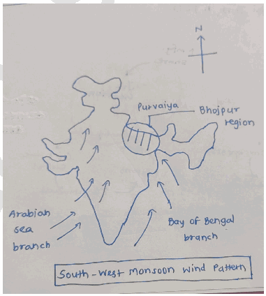

2. **Coriolis Effect and Meghalaya Plateau** help "turn" the southwestern winds into a westward-flowing stream before they reach Bhojpur.

3. For the Bhojpur region, the moisture-laden winds arrive from the **East/South-East.**

4. In Bhojpuri, the suffix **‘-aiya’** denotes "originating from". Thus, winds from the East are called **Purvaiya Influence of ‘Purvaiya’ on cultural ethos of Bhojpur Region**

1. **Agrarian calendar structuring** - Sowing of paddy linked to arrival of Purvaiya.

2. **Agrarian deities and rituals** - Prayers for timely Purvaiya winds. Eg- Indra worship during drought conditions.

3. **Folk songs and oral traditions** - Eg- Purvaiya is personified in **Kajri songs** as a messenger of love and longing for women waiting for their husbands.

4. **Emotional-cultural symbolism** - Rain as metaphor for longing and reunion. Eg- Bhojpuri cinema and poetry portraying Purvaiya romantically.

5. **Festivals of Fertility- Hariyali Teej** and **Nag Panchami** celebrate the rejuvenation of the earth brought by the moisture-laden Purvaiya.

6. **Architectural adaptation** - Sloped roofs and raised plinths designed for heavy rainfall. Also, eastern-facing verandahs (Dalan) to catch the cooling breeze.

7. **Culinary patterns** - Seasonal foods linked to rainy months. Eg- Consumption of saag, pakoras, and millets during monsoon.

8. Traditional **“Madhubani painting”** also depicts purvailya frequently.

Thus, Purvaiya highlights the deep interlinkage between **climate and culture** in the Indo-Gangetic plains.

---

1. Explanation_Drishti IAS:
Source Question: Why is the South-West Monsoon called ‘Purvaiya’ (easterly) in Bhojpur Region? How has this directional seasonal wind system influenced the cultured ethos of the region?

The **South-West Monsoon, active from June to September**, delivers substantial rainfall to India. When these monsoon winds encounter various mountain ranges, they alter course, creating **easterly 'Purvaiya' winds in the Bhojpur region.** This distinct wind pattern significantly shapes **Bhojpur's cultural identity, spanning parts of India and Nepal.**

**Influence of Purvaiya on Cultural Ethos of Bhojpur:**

- **Agriculture and Festivals:** Purvaiya starts the planting season and is celebrated with festivals like Teej.

- **Rituals and Beliefs:** People worship rain gods like **Indra and Parjanya** for good harvests. Madhushravani involves worshiping Vishahara and Gosaun.

- **Traditional Cuisine:** Purvaiya enables the **growth of rice, vegetables, and fruits**, influencing the region’s cuisine. Also, special dishes like

**Pua are made during this season.**

- **Folklore:** ‘Purvaiya’ appears in proverbs, songs, and poems that express the winds’ importance and emotions. Proverbs like “ **Purvaiya chale to khet khile”** and folk songs like ‘Birha’ are examples.

Therefore, **Purvaiya** winds are essential to Bhojpur’s culture, shaping its

**traditions, rituals, and daily life.**

- --

1. Explanation_PWOnlyIAS:
Source Question: Why is the South-West Monsoon called ‘Purvaiya’ (easterly) in Bhojpur Region? How has this directional seasonal wind system influenced the cultural ethos of the region?

**Answer:**

| **Approach** **Introduction**  • Write about South-West Monsoon and its nomenclature around various regions. **Body**  • Mention reasons behind calling the South-West Monsoon ‘Purvaiya’ (Easterly) in the Bhojpur Region  • Influence of Directional Seasonal Wind System on the Cultural Ethos of the Region **Conclusion**  • Give appropriate conclusion in this regard |
| --- |

### Introduction

The South-West Monsoon is a seasonal wind system that typically originates from the southwest direction and brings heavy rainfall during the summer months, thus significantly impacting the socio-economic landscape of the Indian subcontinent. It is recognized by various names across India, **such as “Varsha Ritu” in Hindi and “Edavappathi” in Malayalam.** In the **Bhojpur Region**, it is referred to **as ‘Purvaiya (** easterly),’ owing to the following reasons:

### Body

**Reasons Behind Calling the South-West Monsoon ‘Purvaiya’ (Easterly) in the Bhojpur Region:**
- **Geographical Orientation:** The Bhojpur region, which is located in the eastern part of India, experiences the South-West Monsoon winds coming from the Bay of Bengal. These winds blow in from the east, which is why they are referred to as “Purvaiya,” meaning winds from the east.
- **Historical Influence:** The use of the term “Purvaiya” may have historical roots, where local communities and cultures developed their own names for weather phenomena based on their observations and experiences. Over time, these names became ingrained in the local culture and language.
- **Linguistic Influence:** “Purvaiya” originates from the Hindi language, and since spoken Bhojpuri is significantly influenced by Hindi, it has adopted this term. In Hindi, “Purv” signifies east, and the suffix “aiya” denotes direction or origin. Consequently, “Purvaiya” directly translates to “eastern winds.”

**Influence of Directional Seasonal Wind System on the Cultural Ethos of the Region:**
- **Cropping:** The South-West Monsoon determines the cropping calendar of the Bhojpur region. Farmers eagerly await its arrival to begin planting various crops, **including staples like rice and wheat.** Rituals like **“Kheti-Bari”** celebrate this crucial event, emphasizing the close relationship between agriculture and the monsoon.
- **Attire:** Traditional clothing in Bhojpur is designed to withstand the monsoon weather, with lightweight, breathable fabrics chosen to provide comfort during heavy rains.

**For instance, men often wear “dhotis” and “kurta,” while women prefer “sarees”.**
- **Cuisine and Food Practices:** The monsoon influences the culinary traditions of the region, with certain dishes like **“pakoras” and “khichdi”** becoming popular during this season for their warmth and comfort.
- **Folk Songs and Music:** In Bhojpur, folk songs and music often celebrate the arrival of the monsoon, highlighting the joy and relief brought by the monsoon rains.

**For example, the popular folk song “Barso Re” is a vivid expression of this cultural celebration of the monsoon’s arrival.**
- **Festival and Fairs:** Festivals like **“Teej” and** fairs like **“Chaiti Mela”** are timed with the monsoon, showcasing the deep cultural significance of rain in the Bhojpuri region. These events often feature processions, dances, and performances that celebrate the region’s cultural diversity, emphasizing the importance of the monsoon in the local cultural ethos.
- **Language and Literature:** The seasonal wind system and its impact on climate and nature serve as prominent themes in Bhojpuri language and literature. Poem “baras jaait paani” (“बरस जाईत पानी”) exemplifies this.

### Conclusion

‘Purvaiya’ encapsulates the spirit of the Bhojpur Region, where the monsoon is not just a weather pattern but a cultural heartbeat. It underscores the resilience and adaptability of its people and serves as a reminder of the enduring relationship between nature and culture in this remarkable part of India.

---

1. Explanation_Rau IAS:
Source Question: Why is the South-West Monsoon called 'Purvaiya' (easterly) in has this directional seasonal wind system influenced the region? (10 Marks, 150 Words)

### Introduction

Most parts of India receive Southwestern monsoonal winds in the months of June to September. However, these winds change their direction due to the presence of local factors.

### Body

**Easterly winds in Bhojpur region:**

**Impact on cultural ethos of Bhojpur:**

- Agriculture: The timing of the arrival of these winds is critical for sowing and planting crops like Paddy.

- Festivals: Communities celebrate festivals like Hariyali Teej, Nag panchami etc in these months celebrating the arrival of monsoon.

- Rituals, Folk songs and dances: Many of the folk songs and dance mention their significance. E.g Kajari songs and Jhijhia dance.

- Cuisine: types of crops grown in the region affect the local cuisine. E.g rice, wheat and various vegetables are used to prepare dishes like Peetha, litti chokha etc

- Clothing and Lifestyle: Light, breathable clothing is preferred. Eg- saree, dhoti, kurtas.

### Conclusion

Thus, these winds show the human-environment relationship in one of the most beautiful manners.

---

---

1. Explanation_Superkalam:
Source Question: Why is the South-West monsoon called ‘Purvaiya’ (easterly) in Bhojpur Region? How has this directional seasonal wind system influenced the cultural ethos of the region?

The** South-West monsoon**, though generally westerly in origin, is locally referred to as** ‘Purvaiya’ (easterly) **in the** Bhojpur region **of Bihar and eastern Uttar Pradesh. This nomenclature is a reflection of** local perception **shaped by geography and wind direction relative to the region.

##** Why South-West Monsoon is Called 'Purvaiya' in Bhojpur Region **

Indian Monsoon and Topography Interaction Diagram

1.** Relative Direction of Windflow**:

 - The South-West monsoon winds, after deflecting around the** Bay of Bengal**, move** northwestwards **into the** middle Ganga plains**.
 - In Bhojpur, these winds** arrive from the east/southeast direction**, and thus are locally perceived as** easterlies **or** Purvaiya**.

2.** Geographic Orientation**:

 - Bhojpur lies** east of the Vindhyas and west of the Bay of Bengal**. The wind, after travelling from the Bay, approaches** from the east**.
 - Hence, villagers name it from their experiential geography, not its true origin.

3.** Oral Traditions and Linguistic Custom**:

 - Local languages like** Bhojpuri **use cardinal directions in ways that reflect** experiential association**, not meteorological precision.
 - The term ‘Purvaiya’ is embedded in** folklore, songs, and idioms **passed through generations.

##** Influence on Cultural Ethos of Bhojpur Region **1.** Agricultural Festivals and Rhythms: **- The arrival of** Purvaiya **heralds** kharif sowing**, especially** paddy cultivation**.
 - Festivals like** Asadh and Sawan **celebrate the joy of monsoon rains through folk songs and rituals.

2.** Folk Songs and Music: **-** Kajri **and** Birha** songs often personify the *Purvaiya* as a **messenger of longing and fertility**.
 - Example:** *Purvaiya bahar laage la, piya ke sandesh laage la* **– expressing love and seasonal change.

3.** Architecture and Lifestyle: **- Traditional homes in the region have** verandahs and sloping roofs**, adapted to monsoon rains.
 - Cultural practices like** rainwater harvesting in ponds (ahars and pynes) **evolved with the monsoon cycle.

4.** Religious Significance: **-** Chhath Puja**, though post-monsoon, celebrates the** sun and water**—elements deeply tied to monsoon ecology.
 - Monsoon-fed rivers like the Ganga are considered** sacred lifelines**.

5.** Migration and Memory: **During monsoon, Bhojpuri migrants often sing songs yearning for home, connecting** climate and emotion**.

The term** Purvaiya **reflects how** geographical phenomena are internalized and named culturally**. In Bhojpur, the South-West monsoon is not just a meteorological event but a** life-structuring force**—deeply embedded in its agriculture, folklore, and seasonal identity.

---

1. Explanation_Unacademy:
Source Question: Q7.WhyistheSouth-WestMonsooncalled‘Purvaiya’ (easterly) in the Bhojpur Region? How has this directional seasonal wind system influenced the cultural ethos of the region? (10 Marks, 150 Words)

## **Approach** - **Introduction:** Briefly define the SouthWest Monsoon and why it is locally called “Purvaiya.”

- **Body:** Explain the geographical reason for the naming, then analyze how the wind system shaped agriculture, festivals, folklore, music, cuisine, and attire.

- **Conclusion:** Emphasize the monsoon as both a climatic and cultural force that defines Bhojpur’s ethos. **Answer:** **Introduction:** The South-West Monsoon, which sustains much of India’s agriculture, is locally referred to as “Purvaiya” (easterly) in the Bhojpur region of Bihar and eastern Uttar Pradesh. This nomenclature stems from the direction from which the Bay of Bengal branch of the monsoon enters the region, appearing as an easterly wind to the people of Bhojpur. **Why it is Called “Purvaiya”** - The South-West Monsoon, after breaking at the Indian peninsula, bifurcates into the Arabian Sea and Bay of Bengal branches.

- The Bay of Bengal branch travels northwestward, appearing to arrive from the east in Bhojpur.

- Orographic effects of the Arakan Mountains and the Himalayas lift the moisture-laden winds, causing heavy rainfall across the Ganga plains.

- Hence, locals perceive the monsoon as the easterly “Purvaiya.” **Cultural Influence of Purvaiya in Bhojpur** - **Agriculture:** Ensures fertile soils and good harvests, shaping agrarian life.

- **Festivals and Rituals:** Celebrations like Teej and Madhushravani are directly tied to the arrival of rains.

- **Folklore and Music:** Bhojpuri folk songs often romanticize the “Purvaiya,” especially in Sawan (monsoon month).

- **Cuisine:** Seasonal foods and delicacies emerge, often linked to monsoon harvests.

- **Clothing and Lifestyle:** Light, breathable fabrics and green attire symbolize fertility and prosperity.

- **Oral Traditions:** Elders predict rains by observing atmospheric changes, reflecting deep environmental knowledge. **Conclusion** The “Purvaiya” is not just a meteorological phenomenon but also a cultural and social lifeline in Bhojpur. It shapes agriculture, festivals, rituals, folklore, cuisine, attire, and even the rhythms of daily life. The cyclical arrival of the monsoon embodies the intimate bond between human societies and their environment, making it central to the cultural ethos of the region.

---

---

Q78. What characteristics can be assigned to monsoon climate that succeeds in feeding more than 50 percent of the world population residing in Monsoon Asia?
[Year: 2017] [Group: UPSC CSE] [Exam: Mains] [Stage: Mains] [Paper: Mains - GS 1]
[Subject: GEOGRAPHY]
[Section Group: Physical Geography & Geophysical Phenomena]
[Microtopic: Salient Features of World Physical Geography]
[Subtopic: Monsoon]
[Macrotag: Descriptive]
[Microtag: What]

1. Explanation_Drishti IAS:
Source Question: What characteristics can be assigned to monsoon climate that succeeds in feeding more than 50 percent of the world population residing in Monsoon Asia? (2017)

Some parts of the world experience seasonal winds like land and sea breezes but do so, on a much larger scale. There are tropical monsoon lands with on-shore wet monsoons in the summer and off-shore dry monsoons in the winter. They are best developed in Indian sub-continent, Myanmar, Thailand, Laos, Cambodia, parts of South China and Northern Australia. **Characteristics of Monsoon Climate** **Temperature:** Monthly mean temperature in Monsoon climate is above 18°C but temperature ranges from 15-45°C in summer and 15-30°C in winters. This temperature range helps in cultivating various crops such as wheat and rice, staple crop for the large population in the world. **Precipitation:** Monsoon is associated with high precipitation. Annual mean rainfall ranges from 200-250cm but varies according to the intensity of seasonal winds. It also helps in paddy cultivation. **Distinct season:** Seasons are chief characteristics of monsoon climate. Distinct seasons have been observed with the movement of sun between the Tropic of Cancer and Capricorn. It facilitates the cultivation of various types of crops.

- **The Cool dry season:** Out blowing dry winds, the North-East Monsoon, bring little or no rain to the Indian sub-continent. It has been observed during October to February.

- **The Hot dry season:** The temperature rises sharply with the sun’s northward shift to the Tropic of Cancer. Coastal regions are a little relieved by sea breezes.

- **The Rainy season:** Rainy season has been observed during mid June to September. With the burst of the South-west monsoon in mid June, torrential downpours sweep across the country. Almost all the rain for the year falls within this rainy season.

- This pattern of concentrated heavy rainfall in summer is a characteristic feature of the Tropical Monsoon climate.

- **The Retreating Monsoon:** The amount and frequency of rain decreases towards the end of the rainy season. It retreats gradually southwards after mid September until it leaves the continent altogether.

The role of monsoon is vital in the economy of major parts of the world because it is the main source of irrigation in rain-fed areas and facilitates in feeding more than 50 percent of the world population residing in Monsoon Asia.

---

1. Explanation_PWOnlyIAS:
Source Question: What characteristic can be assigned to monsoon climate that succeeds in feeding more than 50 % of the world population residing in monsoon Asia?

**Answer:**

| **Approach:** **Introduction**  • Brief about Monsoon climate. **Body**  • Describe the Characteristics of monsoon climate **.** **Conclusion**  • Conclude your answer with a futuristic approach. |
| --- |

### Introduction

**Monsoon climate is a distinct climate pattern that prevails in several regions across the world. This climate is characterized by seasonal changes in wind patterns, which result in alternating wet and dry seasons. The monsoon climate plays a crucial role in supporting agricultural production and food security, particularly in monsoon Asia, where over 50% of the world’s population resides.** Body: ****

**Characteristics of monsoon climate:**
- **Seasonal rainfall:** One of the defining features of monsoon climate is the seasonal rainfall patterns. During the wet season, which typically lasts from June to September, monsoon Asia experiences heavy rainfall, which can be as high as 90% of the region’s annual precipitation. This rainfall is critical for supporting agricultural production and replenishing water resources, which are essential for food security.

- The monsoon climate in India is characterized by **distinct seasons**, which facilitate the cultivation of various types of crops. The movement of the sun between the Tropic of Cancer and Capricorn results in these distinct seasons.
- The **Cool Dry Season** occurs during October to February, as the North-East Monsoon brings out blowing dry winds that result in little or no rain across the Indian subcontinent.
- The **Hot Dry Season** is marked by a sharp rise in temperature with the sun’s northward shift to the Tropic of Cancer. However, coastal regions experience some relief from the heat due to sea breezes.
- The **Rainy Season** is observed from mid-June to September. With the burst of the South-west monsoon in mid-June, torrential downpours sweep across the country. Almost all the rain for the year falls within this rainy season.
- The **Retreating Monsoon** occurs towards the end of the rainy season, as the amount and frequency of rain decrease. The monsoon gradually retreats southwards after mid-September until it leaves the continent altogether.
- **High temperature and humidity:** The wet season in monsoon Asia is also characterized by high temperatures and humidity. These conditions are ideal for the growth of crops, particularly rice, which is a staple food in many countries in the region. The high temperatures and humidity also create an environment conducive to the growth of tropical fruits and vegetables.
- **Rivers and deltas:** The monsoon climate is also characterized by large rivers and deltas, which provide fertile soils and ample water resources for agricultural production. The Ganges-Brahmaputra delta, for example, is one of the most fertile agricultural regions in the world and supports the cultivation of crops such as rice, wheat, and jute.
- **Adaptation strategies:** The people in monsoon Asia have developed various adaptation strategies to cope with the seasonal changes in the monsoon climate. These strategies include crop diversification, crop rotation, and water management techniques such as irrigation, rainwater harvesting, and building reservoirs.

### Conclusion

The unique characteristics of monsoon climate, including seasonal rainfall patterns and ample sunlight, have enabled the development of highly productive agricultural systems in monsoon Asia. Understanding the factors that contribute to the success of these systems is essential for ensuring food security and sustainable development in the region and beyond.

---

1. Explanation_Superkalam:
Source Question: What characteristics can be assigned to the monsoon climate that succeeds in feeding more than 50 percent of the world population residing in Monsoon Asia?

Recent studies show that monsoon regions support over 3.8 billion people, making the monsoon climate system crucial for global food security and agricultural sustainability.

Arrows show influence from Indian Ocean

## Seasonal Wind Reversal System

-** Complete wind direction reversal **between summer and winter due to differential heating of land and ocean masses
- Creates distinct wet (June-September) and dry (October-May) seasons enabling systematic agricultural planning
-** Thermal contrast mechanism **between Asian landmass and surrounding oceans drives this seasonal pattern
- Predictable timing allows farmers to plan cropping calendars and water management strategies
- Wind reversal brings moisture-laden air from oceans during summer, ensuring water availability for crops

## Rainfall Characteristics and Distribution

-** Heavy concentrated precipitation **during monsoon months with 75-200cm average rainfall
-** 80-90% of annual rainfall **occurs in 3-4 months, creating water abundance during growing season
- Spatial variation creates diverse agro-climatic zones from Western Ghats (300cm) to rain-shadow areas (50cm)
- Pronounced dry period facilitates harvesting, threshing, and crop storage activities
-** Orographic precipitation **in mountain regions creates additional water resources through rivers and groundwater recharge

## Agricultural Productivity Benefits

- Supports** intensive rice cultivation **covering over 50% of cultivated land in monsoon Asia
- Enables** multiple cropping patterns**: Kharif (monsoon), Rabi (winter), and Zaid (summer) crops
-** Natural irrigation system **reduces dependency on artificial water sources during peak growing season
- High temperatures (25-35°C) during monsoon period accelerate crop growth and photosynthesis
- Creates ideal conditions for** staple crops**: rice, wheat, sugarcane, cotton, and pulses

## Water Resource Management

- Seasonal rainfall concentration facilitates** water storage **in reservoirs, tanks, and groundwater aquifers
- Traditional systems like** check dams, baolis, and step wells **maximize water harvesting during monsoon
- River systems like Ganga, Brahmaputra, and Mekong receive monsoon recharge supporting year-round irrigation
-** Flood plains **get annual nutrient deposition improving soil fertility naturally
- Integration of** rainwater harvesting **with modern irrigation creates resilient water security systems

The monsoon climate's predictable seasonality, abundant rainfall, and supporting ecosystem create optimal conditions for intensive agriculture, enabling sustainable food production for over half the world's population through efficient water-crop-climate integration.

---

1. Explanation_Unacademy:
Source Question: Q17.What characteristics can be assigned to a monsoon climate that succeeds in feeding more than 50 percent of the world population residing in Monsoon Asia? (15 marks, 250 words) Tag: Geography.

## **Decoding the Question** - **InIntroduction,trytostartbydefiningmonsoon.** - **In Body,** **Discuss various characteristics of monsoon.** - **In Conclusion, try to write about the overall** **significance of the monsoon.** **Answer:** A monsoon is a seasonal change in the direction of the prevailing, or strongest, winds of a region. Monsoons cause wet and dry seasons throughout much of the tropics. Monsoons are most often associated with the Indian Ocean.

- **Periodicity of rain-** The monsoon rains occur in wet spells of a few days duration at a time. The wet spells are interspersed with rainless intervals known as breaks.

- **Unpredictability in the amount of rain-** Rainfall amounts vary from one area to the other. Even in one area rainfall varies from season to season. The average annual rainfall in India is about 125 cm, but it has great spatial variations

 - **Areas of High Rainfall:** The highest rainfall happens along the west coast, on the Western Ghats, and in the sub-Himalayan areas is the northeast and the hills of Meghalaya, where the rainfall exceeds 200 cm.

 - In some parts of Khasi and Jaintia hills, it exceeds 1,000 cm, and in the Brahmaputra valley and the adjoining hills, it is less than 200 cm.

 - **Areas of Medium Rainfall:** Rainfall between 100-200 cm is received in the southern parts of Gujarat, east Tamil Nadu, northeastern Peninsula covering Odisha, Jharkhand, Bihar, eastern Madhya Pradesh, northern Ganga plain along the sub-Himalayas and the Cachar Valley and Manipur.

 - **AreasofLowRainfall:WesternUttarPradesh,** Delhi, Haryana, Punjab, Jammu and Kashmir, easternRajasthan,GujaratandDeccanPlateau receive rainfall between 50-100 cm.

 - **Areas of Inadequate Rainfall:** Parts of the Peninsula, especially in Andhra Pradesh, KarnatakaandMaharashtra,Ladakhandmost of western Rajasthan, receive rainfall below 50 cm.

 - Snowfall is restricted to the Himalayan region.

- **Variability in the onset:** A variability of less than 25 per cent exists on the western coasts, Western Ghats, north-eastern Peninsula, eastern plains of the Ganga, north-eastern India, Uttarakhand and Himachal Pradesh and south-western part of Jammu and Kashmir.

- **Retreat of monsoon:** The months of October and November are known for retreating monsoons. By the end of September, the southwest monsoon becomes weak as the low-pressure trough of the Ganga plain starts moving southward in response to the southward march of the sun. Monsoon plays a vital role in the social and economic lives of people. About 64 per cent of India’s people depend on agriculture for their livelihood, and agriculture itself is based on the southwest monsoon. **18.The women’s questions arose in modern India as** **a part of the 19th century social reform movement.** **What are the major issues and debates concerning** **women in that period? (15 marks, 250 words)** **Tag:** Society of India.

## **Decoding the Question** - **In Introduction, try to start by writing about** **the social reform status of women in India.** - **In Body,** - **Discuss some major issues and debates** **concerning women in the social reform** **movement.** - **In Conclusion, summarize the answer with a** **futuristic view.** **Answer:** The position of women in India has diversified in different periods and varied classes, religions and ethnic groups. By the nineteenth century, there were several evil social practices like Sati, child marriage, the ban on widow remarriage, polygamy etc. Social reform movements began in the 19th century with the emergenceofwesterneducationandrationalthinking. It concentrated on improving the status of women, promoting their education, and attacked social practicesembeddedinsocialandlegalinequalitiesand religious traditions of various communities. **Major Issues and Debates Concerning Women in the** ## **Social Reform Movement** - In the earlier 19th century, when the social reform movement emerged, the leadership was provided by male reformers like Raja Ram Mohan Roy, Vidyasagar and many others. They took up Sati, ill-treatment of widows, polygyny, ban on widow remarriage, child marriage and denial of women’s property rights.

- Struggle for women’s education resulted in establishing women’s schools, colleges, hostels, widow homes, protection homes etc.

- The social reformers assumed that female education would revitalise the family system threatened by the growing communication gap between educated men and uneducated wives.

- Many women leaders like Pandita Ramabai, Savitribai Phule etc., came forward to work for the upliftment of women.

- This movement saw the emergence of women’s organisations and institutions, but it was led by male leaders and originated only in metropolitan cities.

- Its leaders also realised that religious reforms could not be separated from it. With the struggles of Raja Ram Mohan Roy and other leaders, the governmentformulatedlawagainsttheSatisystem and other evils. For example, Bengal Regulation Act XXI termed female infanticide, Abolition of Sati Act 1829 etc.

- The social reform movement never emerged as a unified movement but developed within each community. Various organisations proliferated during this period.

- These Women’s and Movement organisations took the lead to project essential issues, which adversely affected the status of women in society. The most important of these organisations were the Brahmo **Samaj, Prarthana Samaj, Arya Samaj etc.** Thus, the Women’s movement during the 19th century was an important variant of social movement because it intended to bring reforms in the institutional arrangements, values, customs and beliefs in the society that had subjugated women over the years.

---

---

Q79. How far do you agree that the behavior of the Indian monsoon has been changing due to humanizing landscapes? Discuss.
[Year: 2015] [Group: UPSC CSE] [Exam: Mains] [Stage: Mains] [Paper: Mains - GS 1]
[Subject: GEOGRAPHY]
[Section Group: Physical Geography & Geophysical Phenomena]
[Microtopic: Salient Features of World Physical Geography]
[Subtopic: Monsoon]
[Macrotag: Analytical, Applied]
[Microtag: Do you agree, How far, Discuss, India, Indian]
##### Subtopic: Oceanography

1. Explanation_PWOnlyIAS:
Source Question: How far do you agree that the behavior of the Indian monsoon has been changing due to humanizing landscape? Discuss.[200 Words, 12.5 Marks]

**Answer:**

| **Approach:** **Introduction**  • Write the importance of Indian Monsoon. **Body**  • Discuss the change behavior of the Indian monsoon. **Conclusion**  • Summary of the answer with futuristic approach. |
| --- |

### Introduction

** The Indian monsoon, one of the most significant weather phenomena in South Asia, is critical for the country’s agriculture, economy, and livelihoods. With climate change and human activities the monsoon pattern has changed.

There is increasing evidence to suggest that human activities are affecting the behavior of the Indian monsoon:-

- **Land Use Changes:** Human-induced alterations in the landscape that could impact the Indian monsoon are land-use changes. Agricultural expansion, deforestation have altered the land surface and vegetation cover, which could impact the atmospheric moisture balance and influence the behavior of the monsoon.

- **E.g:** The Western Ghats and Northeast India, has affected the local climate and monsoon patterns. Deforestation in the Amazon rainforest has also been linked to changes in the South American monsoon

- **Air Pollution:** The rapid industrialization and urbanization in cities like **Delhi** have led to severe air pollution, with high levels of particulate matter and pollutants. This pollution can affect the monsoon by altering cloud formation processes and reducing rainfall, as observed in studies linking air pollution with reduced precipitation over the Indo-Gangetic Plain.
- **Climate Change:** Climate change, primarily driven by greenhouse gas emissions from human activities, is also likely to influence the behavior of the Indian monsoon. Rising temperatures, altered precipitation patterns, and changing weather patterns could have significant impacts on the timing, intensity, and duration of the monsoon.

- **E.g:** Research suggests that increased warming over the Indian Ocean and decreased temperature gradients between land and ocean can lead to changes in the monsoon circulation, resulting in altered rainfall patterns and prolonged dry spells.

### Conclusion

Indian monsoon is a complex weather phenomenon influenced by several natural and human factors, there is growing evidence that human activities are changing the monsoon’s behavior. These challenges require a coordinated effort between policymakers, scientists, and local communities to adopt sustainable land-use practices and mitigate the impacts of climate change to protect the Indian monsoon’s stability and predictability.

---

1. Explanation_Superkalam:
Source Question: How far do you agree that the behaviour of the Indian monsoon has been changing due to humanising landscape? Discuss.

Recent meteorological data and climate studies indicate a significant correlation between landscape modifications and changing monsoon behavior, though the extent varies regionally across India.

Humanizing Landscape Impact on Indian Monsoon

##** Urbanization Impact on Monsoon Patterns **-** Urban Heat Island Effect**: Cities like Mumbai and Delhi experience 2-4°C higher temperatures, creating localized convection patterns that alter rainfall timing and intensity
-** Surface Modification**: Concrete surfaces reduce evapotranspiration by 60-70%, disrupting the natural water cycle and moisture feedback loops
-** Aerosol Pollution**: Industrial emissions act as condensation nuclei, affecting cloud formation and precipitation patterns over urban areas
-** Wind Pattern Disruption**: High-rise buildings create turbulence, affecting natural wind corridors essential for monsoon circulation
-** Demographic Pressure**: India's urban population projected to reach** 600 million by 2031**, intensifying anthropogenic influence on local climate systems

##** Deforestation and Agricultural Land Conversion **-** Forest Cover Loss**: India lost** 1.97 million hectares **of forest cover between 2000-2020, reducing evapotranspiration and moisture recycling capacity
-** Western Ghats Degradation**: Deforestation in this biodiversity hotspot has altered orographic rainfall patterns along the west coast
-** Wetland Destruction**: Loss of 38% of wetlands since 1970s has reduced natural water storage and local humidity levels
-** Monoculture Expansion**: Replacement of diverse vegetation with single crops affects local microclimate and soil moisture retention
-** Soil Degradation**: Over** 96.4 million hectares **affected by land degradation, reducing natural water absorption capacity

|** Factor **|** Impact on Monsoon **|** Evidence **|
| --- | --- | --- |
| Urbanization | Localized rainfall increase/decrease | Mumbai receives 15% more rainfall than surrounding areas |
| Deforestation | Reduced moisture recycling | 20% decline in forest-dependent rainfall |
| Agriculture | Altered evapotranspiration | Changed soil moisture patterns |

##** Regional Variations and Evidence **-** Western Coast**: Increased rainfall intensity due to urban heat islands in Mumbai and Pune regions
-** Gangetic Plains**: Delayed monsoon onset linked to reduced forest cover in catchment areas
-** Central India**: Erratic rainfall patterns correlating with mining and industrial activities
-** Northeast Region**: Shifting rainfall patterns due to slash-and-burn agriculture and deforestation
-** Coastal Areas**: Sea-level rise and coastal development affecting traditional monsoon dynamics

##** Climate Data Supporting Evidence **-** Temperature Rise**: India experienced** 0.7°C warming **over the past century, altering atmospheric circulation patterns
-** Rainfall Variability**: Increased coefficient of variation in rainfall from 12% (1951-1980) to 18% (1991-2020)
-** Extreme Events**: 75% increase in heavy precipitation events over urban areas since 2000
-** Seasonal Shift**: Monsoon onset delayed by 5-7 days in several regions due to anthropogenic factors

The evidence strongly supports that human landscape modifications have significantly altered monsoon behavior through the** National Monsoon Mission **and** Climate Change Action Plan**, requiring urgent implementation of nature-based solutions and sustainable urban planning.

---

1. Explanation_Unacademy:
Source Question: Q18. How far do you agree that the behaviour of the Indian monsoon has been changing due to humanizing landscape? Discuss. (12.5 marks, 200 words) Tag: Effect of urbanization.

## **Decoding the Question** - **In Introduction, begin your answer with how** **monsoonal fluctuations and its impact.** - **In Body, discuss the anthropogenic causes** **that may affect the monsoon pattern. You** **may cite some recent issues.** - **Conclude your answer with giving some** **recent developments and a way forward.** **Answer:** The monsoon season lasts three months, from June to September. More than 70% of the total rainfall falls in these months. Monsoons are of particular strategic importance to India because of its agriculture sector. While irrigation systems have been expanding since independence, 60% of crops remain rain-fed, and are hence entirely dependent on the monsoon season. Further, employment in agriculture accounts for close to half the population in India, and 15% of its GDP. Perhaps even more pertinently, the monsoons hold a tight grip on economic development. A poor monsoon causes a declining agriculture sector, food inflation, farmer distress and political agitation. Recent study lists a series of historical events that validate the strong and weak phases of monsoons in theAsianregion.Forinstance,during1586/87,thereis evidence of half of the population of the eastern Gansu region of China fleeing their homelands and there are reports of them even indulging in cannibalism. This fits in perfectly with a lean monsoon period during the time as informed by data.

- The scientists also looked at various natural cycles like the Pacific Decadal Oscillation and North Atlantic Oscillation impacting the enhanced decreasing trend observed in the last 80 years. They found that this was not the case, hence they considered human pollutant emissions as a possible cause. They postulate that sulphate (SO42-) emissions from industries and vehicles could be responsible for the declining trend.

- The influence of anthropogenic activities on the Indiansummermonsoonrainfall(ISMR)hasbeen investigated in a number of studies. Most of them indicate that emissions of **greenhouse** gases, that alter the heat budget of the system and therefore the land-sea temperature contrast, could increase the monsoon intensity and/or variability.

- On the other hand, there is evidence of an **aerosol-** induced reduction of precipitation or of no clear indication for an influence of global warming at all. In a recent study of the Intergovernmental Panel on Climate Change (IPCC) (IPCC, 2001) revealed that under several greenhouse gas and sulphate aerosol forcing scenarios of monsoon precipitation, heavy rainfall events exhibit a rising trend in frequency and magnitude over the last 50 years. Air pollution and reduced precipitation caused by climate change results in a reduction of agriculture production in India.

---

---

Q80. How do ocean currents and water masses differ in their impacts on marine life and the coastal environment? Give suitable examples?
[Year: 2019] [Group: UPSC CSE] [Exam: Mains] [Stage: Mains] [Paper: Mains - GS 1]
[Subject: GEOGRAPHY]
[Section Group: Physical Geography & Geophysical Phenomena]
[Microtopic: Salient Features of World Physical Geography]
[Subtopic: Oceanography]
[Macrotag: Descriptive, Comparative]
[Microtag: How, Differ]

1. Explanation_Civilsdaily:
Source Question: How do ocean currents and water masses differ in their impacts on marine life and coastal environment? Give suitable examples. [Year: 2019] [Marks: 15]

**Ocean currents** are continuous, directed movements of seawater generated by a combination of **physical,**

**climatic, and planetary forces. Water masses** are large bodies of seawater having **uniform temperature and**

**salinity characteristics.**

**Impact of ocean currents**

**On Marine Life**

1. **Nutrient upwelling** - Enhances plankton productivity. Eg- Humboldt Current supporting Peru’s anchovy fishery.

2. **Convergence zones** - Warm and cold currents boost fish abundance. Eg- Grand Banks (Gulf Stream + Labrador Current).

3. **Migration pathways** - Guide movement of pelagic species. Eg- Tuna along Kuroshio Current.

4. **Larval dispersal** - Transport eggs and juvenile fish. Eg- Coral larvae spread via Indian Ocean currents.

5. **Temperature regulation** - Influences biodiversity distribution. Eg- Gulf Stream sustaining North Atlantic fisheries.

6. **Pollution Transport-** Currents aggregate plastic into "Garbage Patches," impacting the health of pelagic species.

**On Coastal Environment**

6. **Shoreline Erosion-** Strong currents (e.g., **Florida Current)** constantly reshape coastlines by wearing away beaches and soft cliffs.

7. **Longshore Drift-** Currents move sand parallel to the shore, creating landforms like **spits, bars, and barrier islands.**

8. The **desiccating effect** of cold currents form **deserts on western coasts** of the continent. Eg**Atacama Desert** in Chile (influenced by the cold Humboldt Current.)

9. **Climate Moderation-** The **North Atlantic Drift** keeps Western Europe **5°C-10°C warmer** than similar latitudes in Canada.

**Impact of Water Masses**

**On Marine Life**

1. **Vertical Stratification-** Different water masses create distinct "layers," effectively partitioning the ocean into niche habitats (epipelagic, mesopelagic, etc.).

2. **Benthic Habitats-** Dense masses like **Antarctic Bottom Water (AABW)** create the high-pressure, cold environment required by specialized deep-sea fauna.

3. **Stable Breeding Grounds-** Large, stable masses provide the consistent temperature ranges needed for sensitive species, like **Cod,** to spawn.

4. **Oxygen Minimum Zones (OMZs)-** Stagnant water masses can become depleted of oxygen, creating "dead zones" where most life cannot survive.

5. **Carbon Sequestration-** Deep water masses "lock away" CO-2 for centuries, regulating the acidity and habitability of the upper ocean.

**On Coastal Environment**

6. **Deep-Water Renewal-** Sinking water masses at the poles drive the "Global Conveyor Belt," which eventually influences long-term coastal sea levels.

7. **Nutrient Reservoirs-** Deep water masses act as "banks" that store nutrients, which are only released during seasonal upwelling events.

8. **Thermal Expansion-** As deep-water masses warm slightly over decades, they contribute significantly to **global sea-level rise.**

**Difference in their impact**

| Basis | Ocean Currents | Water Masses |
| --- | --- | --- |
| Nature | Horizontal movement of water | Body of water with uniform properties |
| Time scale | Short-term to seasonal | Long-term and stable |
| Impact intensity | Immediate productivity changes | Gradual habitat alteration |
| Coastal effect | Erosion, storms, upwelling | Sea-level, salinity, thermal stress |
| Driver | Winds and Coriolis force | Temperature and salinity formation |
| Example | Humboldt Current | North Atlantic Deep Water |

Both are interlinked yet operate at **different temporal and spatial scales,** collectively shaping marine biodiversity and coastal sustainability.

---

1. Explanation_Drishti IAS:
Source Question: How do ocean currents and water masses differ in their impacts on marine life and coastal environment? Give suitable examples.

Ocean currents (surface or deep ocean currents) are streams of water flowing constantly in definite path and direction, for example, Gulf Stream (warm current) and Labrador current (cold current ). Water masses are the extensive homogeneous body of immense volume of ocean water in terms of temperature and salinity. These are generally characterised by the the downwelling of denser cold water and upwelling of less dense water, for example, the North Atlantic Deep water mass in the Norwegian Sea.

### Impacts of ocean currents

- **On marine life:** Ocean currents act as distributing agents of nutrients, oxygen and other elements necessary for the existence and survival of fishes and zooplanktons.

- They also transport planktons from one area to the other area. For example, Gulf Stream carries planktons from the Mexican Gulf to the coasts of Newfoundland and north-western Europe. Many significant fishing grounds of the world are developed in these areas.

- Mixing of warm and cold ocean currents bring rich nutrients which support marine organisms. For example, seas north of Japan is a rich fishing ground due to the mixing of warm Kuroshio and cold Kurile currents.

- Sometimes, a few ocean currents destroy planktons. For example, El Nino current destroys planktons off the Peruvian coasts resulting into mass deaths of fishes.

- **On coastal environment:** Ocean currents maintain the horizontal heat balance of the earth. The warm currents transport warm waters of the tropics to colder areas of temperate and polar zones. Cold currents on the other hand bring cold waters of the high latitudes to the areas of low latitudes.

- Surface ocean currents also modify the weather conditions of the coastal areas. The ideal and favourable European type of climate of the western coasts of Europe is due to the moderating effects of the North Atlantic warm currents.

- Cold currents also intensify the desert-like conditions in the coastal areas, exemplified by the presence of some deserts in the western edges of continents, e.g., Namib Desert in Africa.

- The convergence of warm and cold currents causes foggy conditions, e.g., near Newfoundland due to convergence of warm Gulf Stream and cold Labrador current.

### Impacts of water masses

- **Downwelling of water masses:** It transports oxygen downward which is much needed by the marine organisms.

- This process discourages enrichment of seawater by bringing nutrients, and hence the areas of downwelling of water masses are not conducive to marine life and hence they are the areas of low marine productivity.

- **Upwelling of water masses:** It is beneficial to the rich marine life because dissolved oxygen and nutrients are brought to the surface through upwelling. For example, the upwelling of nutrient rich cold water off the coast of Peru has made the region one of the richest fishing grounds.

Global warming is disrupting the sinking of cold, salty water as a result of increased melting of glaciers and sea ice. This could slow or even stop the circulation of ocean waters, which could result in potentially drastic impact on marine life and coastal environment. Thus, arresting global warming is the need of the hour.

---

1. Explanation_PWOnlyIAS:
Source Question: How do ocean currents and water masses differ in their impact on marine life and coastal environment? Give suitable examples.

| **Approach:** **Introduction**  • Write your answer with a brief about the marine ecosystem. **Body**  • Significance of Ocean currents in marine ecosystem and its impacts on coastal environment. **Conclusion**  • Conclude your answer with the importance of marine ecosystems. |
| --- |

### Introduction

** Ocean currents are continuous streams of water that flow in specific directions and paths. They can be cold or warm currents and exist on the ocean’s surface or deep within it.

Water masses refer to distinct bodies of water characterized by their temperature, salinity, and density. Water masses, like the North Atlantic Deep Water found in the Norwegian Sea, differ from ocean currents as they represent large volumes of water with consistent properties rather than continuous flowing streams.

### Body

**Significant of Ocean currents in marine ecosystem:**
- **Nutrient Distribution:** Ocean currents can transport nutrients across vast distances, influencing the distribution and abundance of phytoplankton bases of the marine food chain. Like

**The Gulf Stream is a powerful ocean current that transports warm water from the Gulf of Mexico to the North Atlantic.**
- **Migration Patterns:** Marine species Like sea turtles, whales, and certain fish, follow ocean currents during their annual migrations. E.g

**Leatherback sea turtles are known to follow ocean currents during their annual migration from nesting beaches in the Caribbean to feeding grounds in the North Atlantic.**
- **Biodiversity:** The convergence of different ocean currents can create areas of high biodiversity, as different species are brought together in one place. E.g

**The mixing of warm and cold water currents creates a nutrient-rich environment that supports a diverse range of marine life.**
- **Climate change:** Changes in ocean currents due to climate change can have significant impacts on marine life, altering water temperatures, and affecting the distribution and survival of various species. **Significant impacts on coastal environment**:

- **Erosion:** Strong ocean currents can cause erosion along the coast, wearing away beaches and cliffs over time. E.g

**The strong ocean currents along the coast of California have caused erosion in areas such as Big Sur**
- **Beach nourishment:** Conversely, ocean currents can also bring in sediment from offshore areas, providing natural beach nourishment.
- **Pollution transport:** Ocean currents can transport pollutants, such as oil spills or plastic debris, to coastal areas, potentially harming marine life and human health.
- **Water quality:** Changes in ocean currents can also affect water quality in coastal areas, altering salinity levels and nutrient concentrations.
- **Tourism and recreation:** Ocean currents can influence the quality of surfing and other recreational activities, making them more or less favorable depending on conditions. **Impact of water mass on the climate and marine life :
- **1. The movement of water masses has profound effects on the marine environment. Downwelling, the sinking of surface waters to deeper depths, can provide a source of food for deep-sea organisms. It can lead to oxygen depletion in deep waters, creating:** “dead zones”** where marine life struggles to survive. The downwelling of water can contribute to oceanic carbon storage, playing a role in the global carbon cycle and climate change.
2. The upwelling of water, the rising of deep waters to the surface, has its own set of impacts. Upwelling stimulates the growth of phytoplankton, microscopic marine plants, which form the basis of the marine food chain. This increased availability of phytoplankton can support a range of marine life, from small zooplankton to large fish and marine mammals. Upwelling can influence the distribution and migration patterns of various marine species, creating areas of high biodiversity and productivity.

### Conclusion

Ocean currents and water masses are both important components of the marine environment. Ocean currents can influence the distribution of nutrients, migration patterns, and biodiversity of marine species.

---

1. Explanation_Superkalam:
Source Question: How do ocean currents and water masses differ in their impacts on marine life and coastal environment? Give suitable examples.

Recent studies show that 80% of marine species depend on specific water conditions, highlighting how ocean currents and water masses create distinct impacts on marine ecosystems and coastal environments.

Coastal Ocean Environment Cross Section Diagram

## Impact of Ocean Currents on Marine Life

### Physical Transport and Migration

-** Species Distribution**: The** Gulf Stream **transports tropical fish larvae northward, extending species ranges and creating biodiversity hotspots along the US East Coast
-** Breeding Cycles**:** Bluefin Tuna **migration follows the** Kuroshio Current**, with spawning grounds directly linked to current patterns and temperature zones
-** Food Chain Transport**: The** California Current **carries nutrient-rich waters supporting** sardine and anchovy **populations, forming the base of marine food webs
-** Seasonal Movements**:** Humpback Whales **follow the** East Australian Current **during migration, utilizing current-driven productivity zones
-** Larval Connectivity**: Ocean currents connect coral reef systems across the** Indo-Pacific**, enabling genetic exchange and species resilience

### Coastal Environment Effects

-** Upwelling Zones**: The** Benguela Current **creates one of the world's richest fishing grounds, supporting** 70% of South Africa's **commercial fish catch
-** Coral Reef Formation**: Warm currents like the** Agulhas Current **maintain optimal temperatures for coral growth along the** Mozambique coast **-** Coastal Erosion**: Strong currents accelerate shoreline changes -** 33.6% of India's coastline **experienced erosion between 1990-2018
-** Sediment Distribution**: The** Labrador Current **deposits nutrient-rich sediments, creating productive coastal wetlands in Atlantic Canada

## Impact of Water Masses on Marine Ecosystems

### Chemical and Physical Properties

-** Oxygen Levels**: The** Arabian Sea Water Mass **creates oxygen minimum zones, hosting specialized bacteria and unique deep-sea communities
-** Salinity Gradients**:** Baltic Sea Water Mass **(salinity: 7-8 ppt) supports brackish water species like** Baltic herring**, distinct from oceanic populations
-** Temperature Stratification**:** Antarctic Intermediate Water **creates thermal barriers affecting vertical fish distribution in the Southern Ocean
-** pH Variations**: Different water masses show varying acidity levels, influencing** shellfish and coral **calcification rates
-** Density Layers**: Water mass boundaries create distinct habitats -** Mediterranean Deep Water **supports endemic deep-sea species

### Coastal Productivity Patterns

-** Nutrient Distribution**:** North Atlantic Deep Water **carries nutrients globally, influencing primary productivity in surface waters
-** Seasonal Productivity**:** Indian Ocean Water Masses **drive monsoon-related productivity cycles affecting** tuna fisheries **across the region
-** Mixing Zones**: Water mass convergence areas like the** Subtropical Convergence **create highly productive marine ecosystems

|** Factor **|** Ocean Currents **|** Water Masses **|
| --- | --- | --- |
|** Primary Impact **| Physical transport and movement | Chemical-physical habitat creation |
|** Marine Life Effect **| Migration patterns, breeding cycles | Species adaptation, vertical distribution |
|** Coastal Influence **| Erosion, sediment transport | Productivity zones, ecosystem boundaries |
|** Examples **| Gulf Stream (fish transport), Benguela (upwelling) | AAIW (thermal barriers), Baltic Water (salinity adaptation) |

Understanding these differential impacts remains crucial for marine conservation strategies and implementing frameworks like the** UN Ocean Decade **for sustainable ocean management.

---

1. Explanation_Unacademy:
Source Question: Q17. How do ocean currents and water masses differ in their impacts on marine life and coastal environment? Give suitable examples? (15 Marks, 250 words) Tag: Geography.

## **Decoding the Question** - **In Introduction, try to briefly write about the** **water mass and ocean currents.** - **In Body, write briefly about Impact of ocean** **current & water mass on marine life and** **coastal environment.** - **In Conclusion, try to mention the** **overall significance of these and coastal** **management.** **Answer:** **Ocean currents** are dedicated, and continuous movement of sea water is generated due to different forces on water like wind, Coriolis forces, temperature, salinity etc. A **water mass** is a body of ocean water with a different narrow range of temperature, salinity and density. It has different physical properties than its surroundings. Both ocean current and water mass play an effective role in determining marine life and coastal environment. **Impact of Ocean Current & Water Mass on Marine** ## **Life** - **Connectivity and biogeography: many animals** **and plants drift with ocean current and** water mass in different regions. There are countless animals (zooplankton), plants, bacteria and viruses that spend their entire life drifting. This pattern of drifting influences species diversity of various regions. These can also carry animals and plants into unfavourable areas, which can threaten their survival.

- **Growth and survival:** The mixing of warm and cold ocean currents helps in replenishing the oxygen and nutrients in the water and Coast lines also provides a photic zone for marine life, which favoursgrowthofplanktonsandalga.Forexample: Newfoundland, eastern coast of Japan etc.

- Sometimes the cold currents and water mass impact the local environment adversely and threaten the lives of animals. For example: cold current leads to coral bleaching in several areas etc.

- **Climate change:** Ocean currents may change due to wind patterns, heat balance and freshwater

 inflowsfromglacialmelting.However,thatchange is not uniform, and may in fact be quite episodic. This impacts the connectivity and population of marine life. For example: Great Barrier Reef etc. **Impact of Ocean Current and Water Mass on Coastal** ## **Environment** - **Economic life:** Coastal economy is a crucial outcome of successful management of ocean and marine resources. The national ocean economy includes; Construction, Living Resources, Minerals, Ship & Boat Building, Tourism & Recreation, Transportation etc. The formation of fog, freezing or water etc. also negatively impacts the transport and navigation of coastal regions. For example: fishing grounds near Newfoundland etc.

- **Coastal environment:** The warm and cold ocean current impacts the coastal ecosystem for example cold ocean currents in the western side of continents lead to formation of deserts in the region. For example: Atacama Desert etc.

 - Mixing of ocean currents also leads to formation of fog-like conditions and brings rainfallincoastalregions.Forexample:Britain type climate, El Niño-Southern Oscillation (ENSO) etc.

 - Climate change is reflected in sea surface temperature and characteristics of tropical storms.

- **Rising water level:** Indian coasts are highly vulnerable to sea level rise, due to the extensive low-lying area, high population density, frequent occurrence of cyclonic storms, high rate of coastal environmental degradation and non-sustainable development. The ocean currents and water mass are **very crucial** **for the coastal environment and marine life.** Thus, the protection of coastal zones and measures for climate change adaptation and mitigation are very important for addressing negative impacts. Coastal zones are becoming more **environmentally significant,** as life and economy are largely dependent on it and the changing climate poses a threat to it.

---

---

Q81. What are the consequences of spreading of ‘Dead Zones’ on marine ecosystem?
[Year: 2018] [Group: UPSC CSE] [Exam: Mains] [Stage: Mains] [Paper: Mains - GS 1]
[Subject: GEOGRAPHY]
[Section Group: Physical Geography & Geophysical Phenomena]
[Microtopic: Salient Features of World Physical Geography]
[Subtopic: Oceanography]
[Macrotag: Descriptive]
[Microtag: What]

1. Explanation_Civilsdaily:
Source Question: What are the consequences of spreading ‘Dead Zones’ on marine ecosystems? [Year: 2018] [Marks: 10]

A **Dead Zone** is an area of a water body (ocean, lake, or estuary) where oxygen levels are so low (hypoxia) that they can no longer support most marine life. It results from **Eutrophication,** which fuels algal blooms.

**Fact File**

1. There are over **750 dead zones** globally, up from 400 in 2008.

2. The **Baltic Sea** is the world’s largest permanent dead zone (approximately **70,000 sq km).**

3. Dead zones cause over **$2.5 billion** in annual losses to global fisheries. **(UN report) Consequences of Spreading ‘Dead Zones’**

1. **Mass Mortality of Benthic Life-** Sedentary organisms like clams, oysters, and lobsters cannot flee oxygen-poor waters. Eg- "crab kills" along the **Oregon coast** in early 2026 due to hypoxic events.

2. **Loss of Marine Biodiversity** - Sensitive species disappear while only hypoxia-tolerant organisms survive. Eg- Decline of benthic fauna in the **Baltic Sea.**

3. **Increase in Harmful Algal Blooms (HABs)** - Dead zones often coincide with **toxic blooms that release neurotoxins.**

4. **Decline in Coral and Seagrass Ecosystems** - Hypoxia weakens coral reefs and seagrass beds that require oxygenated waters.

5. **Forced Habitat Migration-** Eg- In the **Gulf of America,** shrimp populations have shifted to "crowded edges" of the dead zone, leading to over-competition for food.

6. **Disruption of Marine Food Webs-** The loss of bottom-dwelling prey species starves higher-level predators.

7. **Nutritional & Reproductive Impairment-** hypoxia causes endocrine disruption, leading to smaller eggs and reduced spawning success.

8. Hypoxic zones favor **resilient, "opportunistic" species** that thrive in low-oxygen environments. Egjellyfish blooms in the Sea **of Japan.**

9. **Release of Toxic Substances** - Oxygen-poor conditions lead to **release of hydrogen sulfide and methane,** harmful to marine life.

**Way Forward**

1. **Nutrient Management Plans-** Implementing **Precision Agriculture** to reduce fertilizer runoff.

2. **Riparian Buffer Zones-** Creating "Green Belts" of vegetation along rivers to filter out nutrients before they reach the ocean. Eg- **Chesapeake Bay Model.**

3. **Upgrade Wastewater Treatment-** Transitioning to **Tertiary Treatment** plants that specifically remove nitrogen and phosphorus.

4. **Restore Natural Filters-** Large-scale restoration of **Wetlands and Oysters,** which act as natural water purifiers.

5. Shifting to **Integrated Multi-Trophic Aquaculture (IMTA),** where seaweed and shellfish absorb excess nutrients from fish farms.

6. **Integrated Coastal Zone Management (ICZM)** - Coordinated management of coastal resources to reduce pollution and habitat degradation.

Protecting ocean oxygen levels is essential for sustaining **healthy marine ecosystems and the livelihoods dependent on them.**

---

1. Explanation_Drishti IAS:
Source Question: What are the consequences of spreading of ‘Dead Zones’ on marine ecosystems? (2018)

"Dead Zone" is a more common term for hypoxia, which refers to a reduced level of oxygen in the water in some parts of the world's oceans and large lakes. In March 2004, Global Environment Outlook Year Book, published by the UN Environment Programme, reported 146 dead zones in the world's oceans. One of the largest dead zones forms in the Gulf of Mexico every spring. Hypoxic zones can occur naturally but climate change, nutrients run-off from the land, and eutrophication are leading to algal bloom and causing further depletion of oxygen level in water. As a result dead zones are spreading at much faster pace.

**Consequences of spreading dead zones on marine ecosystem:**

- The reduced dissolved oxygen in ocean water results in loss of marine life thus the habitats which were teeming with life become biological desert.

- Toxic algal blooms release toxins that can poison fish, molluscs and marine mammals like dolphins. Thus, affecting marine ecosystem by altering its food chain.

- The reproductive problems emanate when the oxygen level depletes i.e. there is lower egg count and less spawning.

- Slow moving bottom-dwelling creatures like clams, lobsters and oysters are unable to escape the dead zone and face extinction.

- When fast moving marine species flee from the dead zones and occupy a new habitat, they cause overcrowding of their new habitats and affect the ecosystem services over there.

It is clear that the spread of dead zones can affect most marine ecosystems and have socio-economic ramifications due to human dependency on marine goods and services.

---

1. Explanation_PWOnlyIAS:
Source Question: What are the consequences of spreading ‘Dead Zone’ on marine ecosystems?

**Answer:**

| **Approach:** **Introduction**  • Define the Dead Zone. **Body**  • Discuss the Significance of dead zones on marine ecosystems. **Conclusion**  • Conclude your answer with a significant threat to the marine ecosystem with a futuristic approach. |
| --- |

### Introduction

**A Dead Zone is an area of the ocean with low or no oxygen levels, where marine life cannot survive. The main cause of Dead Zones is eutrophication, the process by which excessive nutrients, such as nitrogen and phosphorus, enter coastal waters from agricultural and industrial sources, causing an overgrowth of algae. When these algae die, they sink to the bottom and decompose, depleting the oxygen in the water.** Body: ****

**Consequences of Dead Zones on marine ecosystems:**
- **Loss of Marine Life:** Dead Zones can cause significant losses of marine life, as oxygen-deprived fish, crabs, and other organisms suffocate and die. These organisms are crucial to the food chain, and their loss can have cascading effects throughout the ecosystem.
- **Changes in Food Web:** Dead Zones can cause changes in the marine food web, as the loss of oxygen-loving organisms allows other, more resilient species to thrive. This can alter the balance of the ecosystem, leading to unpredictable and potentially damaging changes.
- **Economic Impacts:** Dead Zones can have significant economic impacts, as they can lead to reduced fish catches and lost revenue for fishing communities. They can also harm the tourism industry, as people are less likely to visit areas with poor water quality.
- **Climate Change:** Dead Zones can contribute to climate change, as the decomposition of organic matter in these areas releases large amounts of carbon dioxide and other greenhouse gasses into the atmosphere.
- **Human Health:** Dead Zones can also pose a risk to human health, as they can lead to the proliferation of harmful bacteria and toxins, which can contaminate seafood and pose a risk to human health. **Some examples of dead zones:**

**

**
- **Gulf of Mexico Dead Zone:** 

**Baltic Sea Dead Zone**
- **Chesapeake Bay Dead Zone:** 

**Black Sea Dead Zone**
- **Lake Erie Dead Zone:** 

### Conclusion

The spreading of ‘Dead Zones’ poses a significant threat to the marine ecosystem. It can lead to a decline in fish populations, an increase in harmful algal blooms, and a shift in the species composition. We can take measures to reduce nutrient pollution and protect our oceans from these growing environmental issues.

---

1. Explanation_Superkalam:
Source Question: What are the consequences of the spreading of ‘Dead Zones’ on the marine ecosystem?

The expansion of marine 'Dead Zones' - hypoxic areas with dissolved oxygen below 2mg/L - poses severe threats to ocean ecosystems, with over 700 documented zones globally as of 2024.

Coastal Dead Zone Formation in Marine Ecosystem

## Biodiversity and Species Impact

-** Mass Mortality Events**: Hypoxic conditions cause widespread fish kills and shellfish deaths, as seen in the** Gulf of Mexico's 8,776 square mile dead zone in 2024 **-** Species Migration**: Mobile marine organisms flee to oxygen-rich waters, creating overcrowding in habitable zones and abandoning traditional breeding grounds
-** Reproductive Disruption**: Low oxygen levels impair fish reproduction, reducing spawning success rates by up to 80% in affected areas
-** Genetic Adaptation**: Some species develop smaller body sizes and altered metabolism to survive hypoxic conditions, affecting long-term evolutionary patterns
-** Benthic Community Collapse**: Bottom-dwelling organisms like crabs, worms, and mollusks experience near-complete elimination in severe dead zones

## Food Web and Ecosystem Structure

-** Trophic Cascade Effects**: Loss of key predator species disrupts entire food chains, leading to algal blooms and further ecosystem degradation
-** Habitat Compression**: Vertical habitat compression forces species into shallow waters, increasing competition and predation pressure
-** Nutrient Cycling Disruption**: Decomposer organisms' death impairs organic matter breakdown, altering carbon and nitrogen cycles
-** Primary Productivity Changes**: Reduced grazing pressure leads to phytoplankton composition shifts, favoring harmful algal species
-** Marine Desert Formation**: Complete absence of higher-order marine life creates biological deserts spanning thousands of square kilometers

## Economic and Ecological Consequences

-** Fisheries Collapse**: The** Black Sea's dead zone eliminated 80% of commercial fish species**, causing USD 2.9 billion in economic losses annually
-** Tourism Impact**: Beach pollution and fish die-offs reduce coastal tourism revenue, as observed along** India's Konkan coast in 2024 **-** Carbon Sequestration Loss**: Disrupted marine food webs reduce ocean's carbon storage capacity, accelerating climate change
-** Recovery Timeline**: Dead zones persist for decades even after nutrient reduction, with the** Chesapeake Bay requiring 30+ years **for partial recovery
-** Ecosystem Service Loss**: Reduced water filtration, coastal protection, and waste assimilation services worth billions globally

Dead zones represent critical marine degradation requiring urgent action through initiatives like** Mission Blue Economy **and international cooperation under** SDG-14 **to restore ocean health and prevent further ecosystem collapse.

---

1. Explanation_Unacademy:
Source Question: Q7. What are the consequences of spreading ‘Dead Zones’ on marine ecosystems? (10 marks, 150 words) Tag: Critical geographical features, flora, fauna (changes and effects thereof).

## **Decoding the Question** - **In Introduction, try to define the Dead** **Zone, write in one or two lines how they are** **formed.** - **In Body, explain the consequences** **of spreading ‘Dead Zone’ on marine** **ecosystems.** - **Conclude with providing a solution from the** **consequences.** **Answer:** Dead Zones are **low-oxygen,** or **hypoxic,** areas in the world’s oceans and lakes. Because most organisms need oxygen to live, few organisms can survive in hypoxic conditions. That is why these areas are called Dead Zones. Dead Zones occur because of a **process** **called eutrophication,** which happens when a body of watergetstoomanynutrients,suchasphosphorusand nitrogen **resulting in Algal Blooms.** Dead Zones are especially harmful for marine ecology and ecosystems. **Consequencesofspreadingof‘DeadZones’onmarine** ## **ecosystem** - **Hypoxia** which refers to low or **depleted oxygen** **in a water body.** Hypoxia events often follow **Algal** **Blooms.** This **lack of oxygen creates dead zones** in which most aquatic species cannot survive.

- **Dead Zones, beneath,** prevent light from penetrating the water’s surface. They also prevent oxygenfrombeingabsorbedbyorganismsbeneath them. Because of this, the number and diversity of benthic, or bottom-dwelling, species are especially reduced.

- Dead zones cause larger-scale problems, such as **human illness.** - Shellfish, such as oysters, are filter feeders. As they filter water, they absorb microbes associated with Algal Blooms.

 - Many of these microbes are toxic to people. People may become sick or even die from shellfish poisoning.

- **Algal Blooms, which is the reason behind dead** **zones,** can also lead to the death of marine mammals and shore birds that rely on the marine ecosystem for food.

 - Wading birds, such as herons, and mammals, such as sea lions, depend on fish for survival.

 - With fewer fish beneath Algal Blooms, these animals lose an important food source.

- Despite most other life forms being killed by the lack of oxygen, jellyfish can thrive and are sometimespresentinDeadZonesinvastnumbers.

 - Jellyfish blooms produce large quantities of mucus, leading to major changes in food webs intheoceansincefeworganismsfeedonthem.

 - The organic carbon in mucus is metabolized by bacteria which return it to the atmosphere in the form of carbon dioxide in what has been termed a **“jelly carbon shunt”.** - This means the carbon is lost as a direct source of organic energy for transfer up the food web. **Better practices and accountability must be put in** **place to protect the ocean. A major step would be to** **stop letting so many chemicals find their way into** **the ocean.** Funding research initiatives to understand the role of nutrients in formation of dead zones and to document the historical changes in nutrient loading is required. **Investment in research and collective effort** of the world community are essential to reverse the present scenario.

---

---

Q82. Account for variations in oceanic salinity and discuss its multi-dimensional effects.
[Year: 2017] [Group: UPSC CSE] [Exam: Mains] [Stage: Mains] [Paper: Mains - GS 1]
[Subject: GEOGRAPHY]
[Section Group: Physical Geography & Geophysical Phenomena]
[Microtopic: Salient Features of World Physical Geography]
[Subtopic: Oceanography]
[Macrotag: Descriptive, Analytical]
[Microtag: Account for, Discuss]

1. Explanation_Drishti IAS:
Source Question: Account for variations in oceanic salinity and discuss its multidimensional effects. (2017)

Salinity refers to the amount of salt dissolved in 1000 gms of sea water. It is usually expressed as parts per thousand or ppt. The salinity for normal open ocean ranges between 33 o/oo and 37 o/oo. Oceanic salinity varies significantly due to the free movement of ocean water and its distribution has two aspects:

- **Horizontal:** The areas of highest salinity (about 37o/oo, in Atlantic Ocean) are found near the Tropics due to active evaporation owing to clear skies, high temperature and steady Trade Winds.

- From the tropical areas, salinity decreases both towards the equator and towards the poles. Salinity is relatively low near the equator (about 35 o/oo, in Atlantic Ocean) due to high rainfall, high relative humidity, cloudiness and calm air of the doldrums.

- In polar seas, salinity decreases (20-32 o/oo) due to very little evaporation and due to melting ice yielding fresh water.

- **Vertical:** Generally salinity decreases with increasing depth. Surface water is more saline due to loss of water from evaporation. This varies greatly with latitudes and is influenced by the cold and warm currents. In higher latitudes, salinity increases with depth and in middle latitudes it increases upto 35 meters and then decreases.

- The multidimensional effects of oceanic salinity are as follows:

- Salinity determines compressibility, thermal expansion, temperature, density, absorption of insolation, evaporation and humidity.

- **Salinity & Water Cycle:** Water in liquid state dissolves rocks and sediments which creates a complex solution of mineral salts in ocean basins. Conversely, in other states such as vapor and ice, water and salt are incompatible and water vapor and ice are essentially salt free. By tracking ocean surface salinity we can directly monitor variations in the water cycle: land runoff, sea ice freezing and melting, and evaporation and precipitation over the oceans.

- **Salinity, Ocean Circulation & Climate:** Ocean circulation in deep waters is primarily driven by changes in seawater density, which is determined by salinity and temperature. In the North Atlantic near Greenland, cooled high-salinity surface waters can become dense enough to sink to great depths.

- **Salinity & Climate Density:** The ocean stores more heat in the uppermost three meters than the entire atmosphere. Thus density-controlled circulation is key to transporting heat in the ocean and maintaining Earth's climate. Excess heat associated with the increase in global temperature during the last century is being absorbed and moved by the ocean.

- Ocean also influences the distribution of fish and other marine resources.

- NASA studies suggest that sea water is getting fresher in high latitudes while saltier in sub-tropical latitude. This will significantly impact not only ocean circulation but also the climate in which we live.

---

1. Explanation_PWOnlyIAS:
Source Question: Account for variations in oceanic salinity and discuss its multidimensional effect.

**Answer:**

| **Approach:** **Introduction**  • Brief definition of the Oceanic salinity. **Body**  • Describe the Reasons for oceanic salinity and its multi-dimensional effects and variation. **Conclusion**  • Conclude your answer with significance of Oceanic salinity. |
| --- |

### Introduction

**Oceanic salinity, or the concentration of salt in seawater, varies across the world’s oceans due to a range of factors. These variations can have far-reaching impacts on ocean circulation, marine ecosystems, and climate patterns. The average salinity of the water body of the oceans is 35 parts per thousand.** Body: ****

**Reasons for oceanic salinity and its multi-dimensional effects:**
- **Precipitation:** Regions with high precipitation rates tend to have lower salinity levels because freshwater from rain dilutes the saltwater in the ocean. On the other hand, regions with low precipitation rates have higher salinity levels.

- **Evaporation:** When seawater evaporates, it leaves behind the dissolved salts, causing the salinity level to increase. Regions with high evaporation rates, such as the tropics, tend to have higher salinity levels.
- **River runoff:** Rivers carry freshwater into the ocean, which can significantly lower the salinity level in coastal regions.

**The multi-dimensional effects of oceanic salinity variations include:**
- **Ocean currents:** Differences in oceanic salinity levels drive the formation of ocean currents, which are responsible for distributing heat and nutrients around the world. Changes in ocean currents can impact climate patterns and marine ecosystems.
- **Marine life:** Many marine organisms are sensitive to changes in salinity levels. A significant change in salinity can affect the distribution and abundance of marine species, which can have ripple effects throughout the food chain.
- **Water cycle:** Oceanic salinity levels are closely tied to the global water cycle, which is responsible for moving water between the oceans, land, and atmosphere. Changes in salinity levels can affect the water cycle, leading to changes in precipitation patterns and the availability of freshwater resources.

### Conclusion

The multi-dimensional effects of oceanic salinity are vast, ranging from changes in ocean circulation and climate patterns to impacts on marine biodiversity and fisheries. Understanding the factors that contribute to variations in oceanic salinity is critical for predicting and mitigating the impacts of climate change on the world’s oceans and the communities that depend on them.

---

1. Explanation_Superkalam:
Source Question: Account for variations in oceanic salinity and discuss its multi-dimensional effects.

Recent oceanographic studies reveal that ocean salinity variations significantly impact global climate systems, marine ecosystems, and coastal economies worldwide. Understanding these variations is crucial for climate prediction and marine resource management.

Ocean salinity versus latitude line graph

## Factors Causing Variations in Oceanic Salinity

### Climatic Controls

-** Evaporation Patterns**: Tropical regions show higher salinity due to intense evaporation (Red Sea: 40 PSU vs global average 35 PSU)
-** Precipitation Distribution**: Equatorial regions experience reduced salinity from heavy rainfall
-** Seasonal Variations**: Monsoon patterns create significant salinity fluctuations in Arabian Sea and Bay of Bengal
-** Temperature Influence**: Warmer waters enhance evaporation rates, concentrating salt content
-** Wind Systems**: Trade winds accelerate evaporation in subtropical high-pressure belts

### Geographic and Hydrological Factors

-** River Discharge**: Amazon outflow reduces Atlantic salinity up to 3,000 km offshore
-** Ice Formation**: Arctic ice formation increases surrounding water salinity through brine rejection
-** Ocean Basin Configuration**: Mediterranean Sea maintains 38-39 PSU due to restricted circulation
-** Coastal Upwelling**: Brings deeper, more saline waters to surface
-** Landlocked Seas**: Dead Sea reaches 340 PSU due to high evaporation and mineral influx

## Multi-dimensional Effects of Salinity Variations

### Marine Ecosystem Impact

-** Species Distribution**: Affects osmoregulation capacity of marine organisms
-** Food Chain Dynamics**: Influences phytoplankton distribution and marine productivity
-** Migration Patterns**: Determines fish breeding grounds and migration routes
-** Coral Reef Health**: Optimal salinity ranges (34-37 PSU) crucial for coral survival
-** Biodiversity Hotspots**: Salinity gradients create unique ecological niches

### Climate System Regulation

-** Thermohaline Circulation**: Drives global ocean conveyor belt system affecting climate
-** Deep Water Formation**: High salinity water sinks, driving Atlantic Meridional Overturning Circulation
-** Heat Transport**: Influences poleward heat transfer through ocean currents
-** Weather Patterns**: Affects cyclone intensity and monsoon systems
-** Sea Level Variations**: Density changes cause regional sea level differences

### Economic and Social Implications

-** Fisheries Industry**: India's marine fish production (3.7 million tonnes, 2023-24) affected by salinity-driven fish movements
-** Coastal Agriculture**: Salinity intrusion threatens 6.73 million hectares in coastal India (2024 assessment)
-** Desalination Plants**: Gulf countries invest $15 billion annually in desalination due to high regional salinity
-** Maritime Transport**: Density variations affect ship ballast calculations and fuel efficiency
-** Tourism**: Coral bleaching from salinity stress impacts coastal tourism revenue

### Scientific and Technological Applications

-** Climate Modeling**: ESA's SMOS satellite provides crucial salinity data for climate predictions
-** Ocean Monitoring**: Real-time salinity measurements help predict El Niño/La Niña events
-** Aquaculture**: Optimal salinity management increases fish farm productivity
-** Research Applications**: Salinity tracers help understand ocean mixing processes

| Ocean Region | Average Salinity (PSU) | Primary Controlling Factor |
| --- | --- | --- |
| Red Sea | 40 | High evaporation |
| Mediterranean | 38-39 | Restricted circulation |
| Atlantic | 35-37 | Balanced evaporation-precipitation |
| Pacific | 34-35 | Lower evaporation rates |
| Arctic | 30-32 | Ice melting, low evaporation |

Advanced monitoring systems including SMAP and Aquarius satellites continue enhancing our understanding of salinity's role in Earth's climate system, supporting better prediction models and sustainable ocean management strategies.

---

1. Explanation_Unacademy:
Source Question: Q14. Account for variations in oceanic salinity and discuss its multi-dimensional effects. (15 marks, 250 words) Tag: Geography.

## **Decoding the Question** - **In Introduction, try to briefly write about** **salinity.** - **In Body,** - **Write various factors affecting salinity** **of oceans and write variation in ocean** **salinity.** - **Also, write its multidimensional effects.** - **In Conclusion, try to mention the overall** **importance of ocean salinity.** **Answer:** Salinity is the term used to define the total content of dissolvedsaltsinseawater.Itiscalculatedastheamount of salt (in gm) dissolved in 1,000 gm of seawater. It is usually expressed as parts per thousand or ppt. The normal range of salinity is 33-37 ppt.

## **Factors Affecting Ocean Salinity** - The salinity of water in the surface layer of oceans dependsmainlyonevaporationandprecipitation.

- Surface salinity is greatly influenced **in coastal** **regions by the freshwater flow from rivers,** and in polar regions by the processes of **freezing and** **thawing of ice.** - **Wind also** influences salinity of an area by transferring water to other areas.

- The **ocean currents** contribute to the salinity variations. Salinity, temperature and density of water are interrelated. Hence, any change in the temperature or density influences the salinity of water in an area.

## **Variations in Ocean Salinity** - **The salinity decreases from equator towards** **poles,** due to frequent rainfall and influx of fresh water at equator. The tropical regions record the highest salinity.

- **Theareasofoceans/seasborderingthecontinental** **areas are less saline** than interior areas due to influx of fresh water from rivers.

- **The salinity of inland sea or partially enclosed sea** doesnotdependonthelatitudes,itiscontrolledby influx of fresh water.

- **The salinity of the water body increases with** **increase in depth of oceans.** Due to rainfall and influx of fresh waters from rivers, the salinity of surface water is less.

- **The overall salinity of water in the upper zone is** **higher than the salinity of the lower zone, which** **is separated by a transition zone called halocline.** ## **Multi-dimensional Effects of Salinity** - There are parts of the ocean where hardly any rain falls but warm dry winds cause lots of evaporation. It evaporation removes water, when water vapour rises into the atmosphere, it leaves the salt behind, sothesalinityoftheseawaterincreases.Thiscauses the seawater to become denser. A combination of high salinity and low temperature makes seawater sodensethatitsinkstothebottomoftheoceanand flows across ocean **basins as deep, slow currents.** 

- Ocean salinity impacts rainfall and local weather of different regions. The freshwater added at the surface dilutes the seawater, reduces the salinity and so makes the seawater less dense. Seawater can also be less saline near land, where rivers and freshwater.

- It controls the climate and atmosphere, by **transporting heat** from one area to different areas.

- **Thecoralreefsthriveinsalinewaters;thus,salinity** impacts the **biodiversity of marine ecosystems.** Salinitylevelisveryimportant,alongwithtemperature it directly affects seawater density and therefore the circulation of ocean currents from the tropics to the poles. These currents control how heat is carried within the oceans and ultimately regulate the world’s climate. The sea surface salinity is intimately linked to Earth’s overall water cycle and to how much freshwater leaves and enters the oceans through evaporation and precipitation. Measuring salinity is one way to probe the water cycle in greater detail.

---

---

Q83. Explain the factors responsible for the origin of ocean currents. How do they influ- ence regional climates, fishing and navigation?
[Year: 2015] [Group: UPSC CSE] [Exam: Mains] [Stage: Mains] [Paper: Mains - GS 1]
[Subject: GEOGRAPHY]
[Section Group: Physical Geography & Geophysical Phenomena]
[Microtopic: Salient Features of World Physical Geography]
[Subtopic: Oceanography]
[Macrotag: Descriptive]
[Microtag: Explain, How]

1. Explanation_Superkalam:
Source Question: Explain the factors responsible for the origin of ocean currents. How do they influence regional climates, fishing and navigation?

Ocean currents, driven by multiple natural forces, significantly influence global climate patterns and human maritime activities.

World Map of Major Ocean Currents

## Factors Responsible for Ocean Currents Origin

###** Primary Driving Forces: **-** Wind Systems**: Trade winds and westerlies create surface currents through frictional drag on ocean surfaces. Example: Northeast trade winds drive the North Equatorial Current westward across the Pacific.
-** Earth's Rotation**:** Coriolis Effect **deflects moving water masses, creating clockwise gyres in Northern Hemisphere and counterclockwise in Southern Hemisphere.
-** Density Differences**: Temperature and salinity variations create** thermohaline circulation**. Cold, saline water sinks while warm water rises, driving deep ocean currents.
-** Gravity**: Creates pressure gradients that drive water from high to low pressure areas.
-** Tidal Forces**: Gravitational pull of moon and sun generates tidal currents in coastal areas.

###** Secondary Factors: **-** Ocean Basin Configuration**: Continental shelves, mid-ocean ridges, and underwater topography channel and modify current flows.
-** Seasonal Temperature Changes**: Monsoon winds reverse current directions, particularly evident in the Indian Ocean.

## Influence on Regional Climates

###** Temperature Regulation: **-** Warm Currents**: Gulf Stream moderates Western Europe's climate, making it 5-10°C warmer than similar latitudes
-** Cold Currents**: California Current brings cooling effect to US West Coast, creating Mediterranean climate
-** Heat Transfer**: Currents transport approximately 40% of global heat from equator to poles

###** Precipitation Patterns: **- Warm currents increase evaporation and rainfall along coasts
- Cold currents reduce precipitation, creating arid coastal regions like Atacama Desert
-** El Niño-La Niña**: Pacific current changes affect global weather patterns, influencing monsoons and droughts

###** Seasonal Climate Modifications: **- Indian Ocean currents reverse with monsoons, affecting rainfall patterns across South Asia
- Upwelling currents bring nutrient-rich cold water, moderating coastal temperatures

## Impact on Fishing and Navigation

###** Fishing Activities: **-** Convergence Zones**: Meeting points of warm and cold currents create rich fishing grounds like Grand Banks off Newfoundland
-** Upwelling Areas**: Peru Current brings nutrients to surface, supporting world's largest anchovy fishery
-** Seasonal Migration**: Current patterns guide fish migration routes, affecting fishing seasons and locations
-** Marine Productivity**: Nutrient distribution through currents determines fish population density

###** Navigation Benefits: **-** Fuel Efficiency**: Ships utilizing favorable currents save up to 15-20% fuel costs on major shipping routes
-** Time Optimization**: Proper current utilization reduces transit time significantly on routes like Cape of Good Hope passage
-** Safety Enhancement**: Understanding current patterns helps avoid dangerous areas and optimize routes during storms
-** Economic Impact**: Container ships through Strait of Malacca leverage monsoon currents for efficient cargo movement

Understanding ocean current dynamics through modern technologies like** Argo floats **and** satellite altimetry **remains crucial for climate prediction, sustainable fishing, and efficient maritime transportation in our interconnected global economy.

---

1. Explanation_Unacademy:
Source Question: Q14. Explain the factors responsible for the origin of ocean currents. How do they influence regional climates, fishing, and navigation? (12.5 marks, 200 words) Tag: Distribution of key natural resources across the world.

## **Decoding the question** - **In Introduction, try to begin with defining** **ocean current.** - **In Body,** - **Explain the factors responsible for it.** - **Discuss the influence of ocean current.** - **Conclude the answer with the importance of** **ocean Currents.** **Answer:** The term ‘current’ describes the motion of the water (when used in association with water). Regular movement of streams of water in a definite path & direction that flows through a narrow and shallow (up to500metersdeep)region,circulatingalongtheocean margins is called ocean current. It circumnavigates the earth. The speed & direction (velocity) of currents can bemeasured&recorded.ItismeasuredbytheNational Oceanic and Atmospheric Administration.

## **FactorsResponsiblefortheOriginofOceanCurrents** - **Wind –** It is the most dominant factor or force behind the creation of ocean currents. Wind drivesthecurrentsnearcoastalareasonalocalized scale and in open ocean on a global scale. Ocean currents all over the globe follow planetary wind systems.

- **Thermohaline circulation** – A process driven by density differences in water due to temperature(thermo)& salinity in different parts of the ocean. Currents driven by thermohaline circulation occur at both deep and shallow ocean levels and move much slower than tidal or surface currents.

- **Solar Energy** – Solar energy creates a difference in heating on a horizontal scale. Hence indulging the planetary current flow.

- **Coriolis force** – Ferrel’s law says that when the winds pass the equator from southern hemisphere and enter the northern hemisphere, they suddenly turn their direction towards right and it happens due to Coriolis force which is created for earth rotation. The Coriolis effect bends the direction of surface currents to the right in the Northern Hemisphere and left in the Southern Hemisphere.

- **Tides-** Rise and fall of tides which is driven by the gravitational attraction of the moon & sun creates local level tidal currents.

## **Influence of Ocean Current** - Ocean currents act much like a conveyor belt, transporting warm water and precipitation from the equator toward the poles and cold water from the poles back to the tropics. Thus, ocean currents regulate **global climate,** helping to counteract the uneven distribution of solar radiation reaching Earth’s surface.

## **y Upwelling** - Upwelling currents are currents that move from deep in the ocean heading towards the surface. They are responsible for bringing organic matter from below the ocean towards its surface.

 - For instance, they sweep nutrients upwards, helping some marine life. It can be seen when there are tremors or earthquakes on the surface below the ocean and the waves are pushed upwards.

 - In Antarctica, upwelling currents pump nitrogen and phosphates up from the deep sea to blooms of algae and other plants. The planktons can then be eaten by crustaceans called krill, which in turn are eaten by penguins, seabirds, seals, and the baleen whales, the largest animals on earth. These are very important for **fishing grounds.** For example - meeting of cold Labrador current and warm gulf stream.

## **y Transportation by humans** - Humans rely on ocean currents to move some of their sea vessels, such as boats, on water. Currents are also important as they help when docking and undocking boats, speeding up shipping lanes, and keeping the ships safe, primarily in narrow waterways. There are a number of factors which impact the origin of ocean currents, but also the ocean currents themselves play a significant role in determining regional as well as global climate, fishing patterns and the navigation routes.

---

---

Q84. Critically evaluate the various resources of the oceans which can be harnessed to meet the resource crisis in the world.
[Year: 2014] [Group: UPSC CSE] [Exam: Mains] [Stage: Mains] [Paper: Mains - GS 1]
[Subject: GEOGRAPHY]
[Section Group: Physical Geography & Geophysical Phenomena]
[Microtopic: Salient Features of World Physical Geography]
[Subtopic: Oceanography]
[Macrotag: Analytical]
[Microtag: Critically evaluate]

1. Explanation_Superkalam:
Source Question: Critically evaluate the various resources of the oceans that can be harnessed to meet the resource crisis in the world.

El Niño significantly influences global climate patterns, but attributing all unusual climatic events solely to this phenomenon oversimplifies Earth's complex climate system.

El Nino Pacific Ocean Cross Section Diagram

## Role of El Niño in Climate Variability

-** Global Temperature Anomalies**: El Niño warming in the eastern Pacific disrupts atmospheric circulation, causing temperature variations across continents, contributing to record-breaking heat waves like those in 2023-2024.
-** Precipitation Disruption**: The 2023-24 El Niño caused severe droughts in Australia and floods in Peru, demonstrating its far-reaching impact on rainfall patterns.
-** Monsoon Suppression**: India experienced delayed monsoons in 2023, with IMD linking it to moderate El Niño conditions affecting agricultural productivity.
-** Extreme Weather Events**: Studies show 50% higher likelihood of extreme daily rainfall in certain regions during El Niño years, despite overall reduced precipitation.
-** Economic Impacts**: The 2015-16 strong El Niño caused $45 billion in global damages through droughts, floods, and agricultural losses.

## Other Significant Climate Drivers

-** Indian Ocean Dipole (IOD)**: The positive IOD in 2019 intensified Australian bushfires, independent of El Niño conditions, affecting over 18 million hectares.
-** Arctic Oscillation**: Controls polar vortex movements, causing extreme cold snaps like the 2024 winter freeze across North America and Europe.
-** Atlantic Multidecadal Oscillation**: Influences hurricane activity and European climate patterns over 20-30 year cycles.
-** Climate Change**: Anthropogenic factors intensify extreme events - 2023 recorded as the hottest year globally, with greenhouse gases being the primary driver.
-** Regional Factors**: Deforestation in Amazon affects local precipitation, while urbanization creates heat islands, modifying regional climate patterns.

While El Niño remains a crucial climate driver affecting billions globally, the climate system involves multiple interacting factors. The 2023 global temperature records occurred due to combined El Niño effects and long-term warming trends. Understanding this complexity is essential for accurate climate prediction and effective adaptation strategies in our changing world.

---

1. Explanation_Unacademy:
Source Question: Q24. Critically evaluate the various resources of the oceans which can be harnessed to meet the resourcecrisisintheworld.(10marks,150words) Tag: Distribution of key natural resources across the world.

## **Decoding the Question** - **InIntroduction,startwithbrieflymentioning** **ocean resources.** - **In Body, discuss significant resources of the** **ocean elaborately.** - **Conclude the answer by mentioning** **the overall significance of the resources** **available and how it can solve many crises** **in the world.** **Answer:** The ocean is one of Earth’s most valuable natural resources.Thesecanbeharnessedtomeettheresource crisis in the world. **Continental Shelf:** It is the shallowest part of the ocean (Depth approximately 200 m). It is a photic zone. Some

## **resources of this region** - Marine life like floating planktons, benthos (crabs) and nektons (fishes). Fishes are rich in nitrate and phosphate, high protein, medicinal use. Fish provide about 16% of the total world’s protein needs. About 200 billion pounds of fish and shellfish are caught each year from the ocean.

- 90 % of Petroleum reserves of the world are found in continental shelves. Like Bombay high, gulf of Cambay, Persian Gulf, North Sea, Barents Sea, Gulf of Mexico, Norwegian sea.

- Sulphur can be rarely found on land. Available in sea during marine volcanism. Example- Gulf of Mexico is a rich source of sulphur.

- Placer deposits are the deposits made when wave action erodes the beach rocks. Some stable minerals freed from the rocks due to weathering and waves shift the lighter material more rapidly than heavier. Concentration of heavy minerals on the shelf creates these deposits. ExampleMonazite sand (source of thorium) at Kerala coast, Gold (Alaska), Zircon (Brazil, Australia), Diamond (South Africa)

- Calcium which is least soluble in ocean water can be obtained from continental shelf. Peruvian coast has rich deposits of calcium and phosphate.

- Precious stones like pearls can be found here. **Abyssal Plain:** It occupies 40% of the ocean floor. It exhibits tremendous diversity in terms of landforms.

- It has deposits from continents (terrigenous), marine life (biogenous) and salts and mineral (inorganic)

- Concentration of metals around a core is called PMN (Poly Metallic Nodules) or Manganese nodules.PMNarebasicallysmallnodulesofmetals like Manganese, Iron, Silicon, Al, Nickel and Cobalt etc. These can be seen at the depth 40006000m. Some of the minerals are rare on land. PMN First found in Kara Sea, Arctic Ocean. These nodulesarefoundinalltheoceans.Ithasimmense economicimportanceforthecentralIndianOcean and Eastern Pacific Ocean. India collects nickel, cobalt etc for industrial developments from Indian ocean in the form of PMN. These resources can be harnessed to meet the resource crisis in the world if effectively explored and pursued.

---

---

Q85. What are the forces that influence ocean currents? Describe their role in the fishing industry of the world.
[Year: 2022] [Group: UPSC CSE] [Exam: Mains] [Stage: Mains] [Paper: Mains - GS 1]
[Subject: GEOGRAPHY]
[Section Group: Physical Geography & Geophysical Phenomena]
[Microtopic: Salient Features of World Physical Geography]
[Subtopic: Oceanography]
[Macrotag: Descriptive]
[Microtag: Describe, What]
#### Microtopic: Important Geophysical phenomena such as earthquakes, Tsunami, Volcanic activity, cyclone etc.,
##### Subtopic: Aurora

1. Explanation_Civilsdaily:
Source Question: What are the forces that influence ocean currents? Describe their role in the fishing industry of the world. [Year: 2022] [Marks: 15]

**Ocean currents** are continuous, directed movements of seawater generated by a combination of **physical,**

**climatic, and planetary forces.** They regulate **heat distribution, nutrient circulation, marine productivity,**

**and global climate.**

**Forces Influencing Ocean Currents**

1. **Solar Energy-** Differential heating at the equator causes water to expand and rise slightly, creating a gradient that initiates water flow. Eg- Gulf Stream transporting warm water to Europe.

2. **Temperature Gradients-** Cold water is denser and sinks, while warm water is lighter and rises, driving vertical circulation.

3. **Planetary winds** - Trade winds and westerlies drive surface currents. Eg- North Equatorial Current driven by trade winds.

4. **Coriolis Force-** Earth’s rotation deflects moving water to the **right** in the Northern Hemisphere and the **left** in the Southern Hemisphere, forming massive circular **Gyres.**

5. **Salinity Variations-** High salt content increases water density. The interplay of temperature and salt creates the **Thermohaline Circulation** (The Global Conveyor Belt).

6. **Continental Configuration-** Landmasses deflect currents. Eg- the **Brazilian coast** bifurcates the Atlantic South Equatorial Current.

7. **Gravitational pull of Moon and Sun** - Generates tidal currents. Eg- Strong tidal currents in Bay of Fundy.

8. **Ocean basin topography** - Submarine ridges and basins redirect flows. Eg- Mid-Atlantic Ridge influencing deep circulation.

9. **Atmospheric pressure systems** - Cyclones and anticyclones alter local currents. Eg- Seasonal reversal in Indian Ocean currents.

**Role of ocean currents in the fishing industry**

1. **Upwelling zones increase productivity** - Bring nutrient-rich deep water to the surface. Eg- Peru (Humboldt Current) world’s major anchovy fishery.

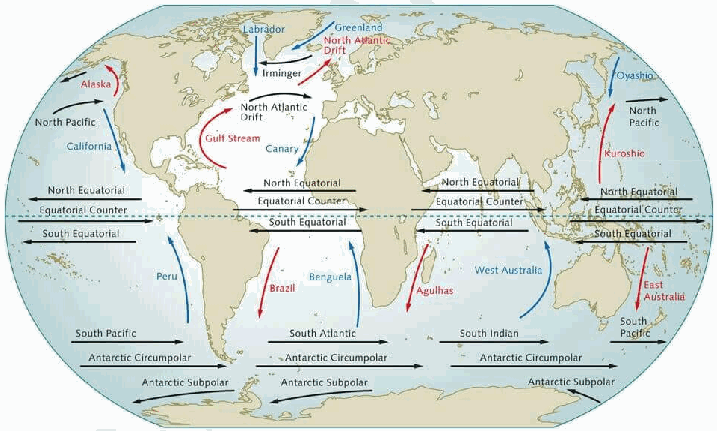

2. **Convergence of warm and cold currents** - Enhances plankton growth. Eg- Grand Banks (Labrador + Gulf Stream).

3. **Nutrient redistribution** Currents spread plankton across oceans. Eg- North Sea fisheries supported by Atlantic Drift.

4. **Temperature regulation** Determines species distribution. Eg- Tuna migration along warm Kuroshio Current.

5. **Oxygenation of waters** - Supports marine biodiversity. Eg- Upwelling off Namibia (Benguela Current).

6. **Transport of fish larvae** - Currents aid breeding and dispersal. Eg- Japanese fisheries influenced by Oyashio Current.

7. **Formation of rich continental shelf fisheries** - Interaction of currents with shallow waters. Eg- Dogger Bank in the North Sea.

8. **Climate moderation for fishing communities** - Eg- Gulf Stream moderating European coasts.

9. Fishermen follow current-driven **seasonal fish migration patterns.** Eg- Monsoon-linked fishing cycles in Arabian Sea.

10. **El Niño impacts** - Disrupts upwelling and fish stocks. Eg- Collapse of Peruvian fisheries during strong El Niño years.

Climate variability and disruptions like **El Niño** increasingly threaten these systems, highlighting the need for **sustainable and climate-resilient fisheries management.**

---

1. Explanation_Drishti IAS:
Source Question: What are the forces that influence ocean currents? Describe their role in fishing industry of the world.

Ocean currents are like river flow in oceans. They represent a regular volume of water in a definite path and direction.

Ocean currents are influenced by two types of forces i.e. Primary Force, which initiates the movement of water while the secondary force influences the currents to flow. These forces are:

- **Primary Force:** **Heating by Solar Energy**: It causes the water to expand which causes water to spread from hot to cold regions.

- **Wind:** Wind blowing on the ocean surface pushes the water to move on.

- **Gravity:** Gravity tends to pull the water down the pile and create gradient variation.

- **Coriolis Force:** It causes the water to move to the right in the northern hemisphere and to the left in the southern hemisphere.

- **Secondary Force:** **Landmass**: Interaction of ocean with landmass results in change in direction of ocean current. For example: Brazil Ocean Current.

- **Salinity:** Water with high salinity is denser than water with low salinity, leading to variation in ocean currents as denser water tends to sink, while relatively lighter water tends to rise.

**Ocean currents affect fishing industries in the following ways:**

- **Creation of Fishing Zones:** Meeting of cold and warm ocean currents forms fishing zones in the ocean.

- Prominent examples are North East Pacific Zone, Newfoundland (Labradour & Gulf Stream), North West Pacific Zone along Japan (kuroshio and oyashio current) etc.

- Upwelling is a process in which currents bring deep, cold water to the surface of the ocean. Upwelling is a result of winds and the rotation of the Earth.

- **Movement of Planktons:** Planktons are the organisms that come with ocean currents. They act as the base of the marine food chain and attract the fish populations towards them, leading to accumulation of fishes in a particular zone.

- Upwelling is a process in which currents bring deep, cold water to the surface of the ocean. The deeper water that rises to the surface during upwelling is rich in nutrients. These nutrients “fertilize” surface waters, encouraging the growth of plant life, including phytoplankton.

- **Long Shelf Life:** Fishes in cold ocean currents have longer shelf life as compared to warm ocean currents, leading to non-perishable fish products.

- **Ecological Balance:** Ocean currents maintain ecological balance by transferring water to the areas of less oceanic current and having low fish population to maintain oxygen level and fishes in the deficit area. Example: Saragasso Sea; Dead Zone.

Although ocean current is the main player in creating fishing zones, the use of technology could be carried to develop fishing industries in other potential zones as well.

---

1. Explanation_PWOnlyIAS:
Source Question: What are the forces that influence ocean currents? Describe their role in the fishing industry of the world.

| **Approach:** **Introduction**  • Write about Ocean Current in brief. **Body**  • Mention the forces that influence ocean currents.  • Write about the impact of Ocean Current on the Fishing Industry. **Conclusion**  • Conclude your answer with the importance of ocean current with a futuristic Approach. |
| --- |

### Introduction

** Ocean currents are the continuous, directed movements of seawater. They play an essential role in the earth’s climate and weather patterns, as well as in the distribution of marine life.

### Body

**Forces influence ocean currents:**
- **Wind:** Wind is one of the primary forces that drive ocean currents. The direction and intensity of the wind determine the direction and speed of the currents.
- **Temperature:** Differences in water temperature between different regions of the ocean create density gradients, which drive the movement of water.
- **Salinity:** Variations in salinity levels also create density gradients, which affect the movement of water.
- **Earth rotation:** The Coriolis effect, which is the result of the earth’s rotation, causes ocean currents to move in a clockwise direction in the northern hemisphere and a counter clockwise direction in the southern hemisphere.
- **Atmospheric pressure:** Differences in air pressure can affect ocean currents by changing the direction and intensity of the wind.

**The fishing industry is heavily dependent on ocean currents as they affect the distribution and abundance of fish stocks.**
- **Fish industries develop at the junction or meeting point of cold and warm currents as there is large concentration of phytoplanktons. Examples:** Near the coast of Japan.: **Fish tend to concentrate in areas with** favorable environmental conditions **, such as areas with abundant food, oxygen, and suitable temperature and salinity levels. Ocean currents play a significant role in the distribution of these favorable conditions, which affect the spread and abundance of fish stocks.Like** Gulf Stream.
- **Ocean currents maintain:** ecological balance **by transferring water to areas of less oceanic current and having low fish population to maintain oxygen level and fish in the deficit area. Like** Equatorial Current.
- **Fishing boats and fleets use ocean currents to:** track and locate **fish, which helps to increase their catch rates.like** Atlantic Drift. ****

### Conclusion

Ocean currents are driven by various forces. Ocean currents play a critical role in Earth climate and weather patterns, as well as in the distribution of marine life. It is essential to understand and monitor ocean currents to ensure sustainable fishing practices and the long-term health of marine ecosystems.

---

1. Explanation_Rau IAS:
Source Question: What are the forces that influence ocean currents? Describe their role in fishing industry of the world. (15 Marks, 250 Words)

### Introduction

Ocean currents are driven by various forces including winds, temperature and salinity gradients, Earth's rotation and gravity. They transport heat, influence weather, distribute nutrients and support fishing activities around the world.

### Body

**Forces influencing ocean currents:**

- **Earth's rotational force:** It moves ocean water in the opposite direction to the west to east rotation of the earth, generating the Equatorial currents. Coriolis force affects the direction of the currents towards right in northern hemisphere.

- **Atmospheric forces:** Winds drive the ocean current in the direction in which they move because of friction. Rainfall and evaporation create level differences and thus move the water.

- **Gradient forces:** Temperature, salinity and density differences create gradients leading to expansion, floatation and sinking of water. Eg. - Labrador current moves as subsurface currents from the pole towards equator.

- Direction, shape and configuration of coastline- currents flow parallel to the coastline. Equatorial current after being obstructed by Brazilian coast gets bifurcated into two branches and then moves along the coast.

- **Bottom reliefs:** North Atlantic drift is deflected to the right when it crosses Wyville Thomson ridge.

**Role of ocean currents in fishing industry:**

- Meeting of the cold and warm ocean currents make the ideal place for breeding of fishes. For eg- the Grand Banks area.

- Upwelling currents bring cold nutrient-rich waters and support the growth of phytoplankton which provide the energy base for fish. Eg- fishing grounds on west coast of Africa and America.

- Current motion aids navigation thereby helping global trade. This in turn develops forward-backwards linkages for fishing industries.

### Conclusion

However, in addition to this, other factors like the availability of vast shelves, government policies, consumption patterns etc also affect fishing industries.

---

---

1. Explanation_Superkalam:
Source Question: What are the forces that influence ocean currents? Describe their role in the fishing industry of the world.

Ocean currents are** large-scale horizontal movements of seawater **that distribute heat, nutrients, and marine life across the globe. They are driven by a combination of atmospheric, geographical, and astronomical forces, and play a crucial role in regulating climate and sustaining global fisheries.

##** Forces Influencing Ocean Currents **

World Map Showing Different Ocean Currents

1.** Planetary Winds (Trade Winds & Westerlies) **- Push surface waters in consistent directions; e.g.,** Trade Winds **drive the North and South Equatorial Currents.
 - Seasonal reversal of winds (monsoons) alters currents in the Indian Ocean.

2.** Coriolis Force (Earth’s Rotation) **- Deflects moving water to the** right in the Northern Hemisphere **and** left in the Southern Hemisphere**.
 - Causes circular gyres and influences the direction of current loops (e.g., North Atlantic Gyre).

3.** Temperature and Salinity Differences (Thermohaline Circulation) **- Cold, saline water is denser and sinks, driving deep ocean currents; warm water rises and flows poleward.
 -** Example: **North Atlantic Deep Water formation off Greenland.

4.** Configuration of Coastlines and Ocean Basins **- Land masses block currents, deflecting them (e.g., South Equatorial Current deflected northward along Brazil).

5.** Gravity and Tides **- Tidal forces generated by the Moon and Sun influence local current patterns, especially in coastal areas.

6.** Upwelling and Downwelling **- Wind-driven movement of surface waters away from coasts brings nutrient-rich cold water up (e.g., Peruvian coast).
 - Enhances biological productivity and fishing grounds.

##** Role in the Global Fishing Industry **1.** Nutrient Enrichment through Upwelling **- Cold currents (e.g.,** Humboldt Current, Benguela Current**) bring nutrients to the surface, supporting plankton growth—the base of the marine food chain.
 -** Example: **Peru’s anchovy fisheries thrive due to Humboldt Current upwelling.

2.** Creation of Productive Fishing Grounds **- Meeting points of warm and cold currents (convergence zones) promote rich biodiversity.
 -** Example:Grand Banks **(Labrador + Gulf Stream) and** Dogger Bank **(North Sea).

3.** Seasonal Variability and Migration of Fish **- Currents influence fish breeding and migration routes (e.g., sardine migration along South Africa due to Agulhas Current).

4.** Stabilizing Marine Ecosystems **- Currents regulate water temperature and oxygen levels, maintaining favorable habitats for commercial fish species.

5.** Impact of Climate Phenomena on Fisheries **- El Niño disrupts the Humboldt Current, reducing nutrient upwelling and causing major fishery collapses in Peru and Chile.

6.** Support for Coastal Livelihoods **- Fishing-dependent economies (Namibia, Japan, Norway) rely on cold current regions for export-oriented fishing industries.

Ocean currents are the lifelines of the world’s fishing industry, determining the distribution, abundance, and seasonal movement of fish stocks. Understanding their patterns is vital for sustainable fisheries management, especially as climate change and ocean warming alter current systems, threatening global food security.

---

1. Explanation_Unacademy:
Source Question: Q14. What are the forces that influence ocean currents? Describe their role in the fishing industry of the world. (250 Words, 15 Marks) Approach

- **Introduction:** Introduce with defining ocean currents .

## **y Body** - Mention the Factors that influence Ocean Currents.

 - Mention the Role of ocean currents in the Fishing Industry.

- **Conclusion:Concludetheanswermentioning** way forward measures. **Answer:** **Introduction:** Ocean currents, the continuous movement of ocean water in a definite direction, are primarily influenced by a combination of several forces.

## **Body: Factors that influence Ocean Currents** - **Solar Energy:** The heating effect of the sun causes the water at the equator to heat up more than the water at the poles, creating a difference in water temperatures, which results in the formation of currents.

- **Wind:** Wind creates friction on the water’s surface and pushes the water in the direction the wind is blowing. This effect is prominent in the formation of surface currents.

- Differences in water temperature and **Gravity:** salinity create variations in water density. Colder or saltier water is denser and tends to sink, while warmer or less salty water is less dense and rises. This movement, along with the gravitational pull, contributes to the formation of deep ocean currents, a process known as thermohaline circulation.

- **Coriolis Effect:** The rotation of the Earth on its axis affects the path of currents, causing them to move clockwise in the northern hemisphere and counterclockwise in the southern hemisphere.

- **Salinity:** Salinity, or the concentration of salt in seawater, influences ocean currents by affecting the water’s density. Higher salinity increases water density, causing it to sink, while lower salinity decreases density, leading to upwelling and the movement of currents.

- **Coastlines and Ocean Bottom Topography:** The physical shape of coastlines and the underwater landscape can redirect ocean currents.

## **Role in the Fishing Industry** - **Nutrient Circulation:** Currents help circulate nutrients from the deep sea to the surface waters, a process known as upwelling. These nutrient-rich waters encourage the growth of phytoplankton, forming the base of the ocean food chain and leading to thriving fish populations. Areas with strong upwelling, like the coasts of Peru and Namibia, often have lucrative fisheries.

- **Fish Migration:** Many fish species rely on ocean currentsformigrationandspawning.Forexample, the Gulf Stream in the North Atlantic is a crucial route for many migratory fish species.

- **Habitat Creation:** Ocean currents contribute to the creation of diverse marine habitats, such as coral reefs and kelp forests, which support a wide range of fish species.

- **Climate Regulation:** Currents like El Niño can affect weather patterns and ocean temperatures, impacting fish populations and their distribution. Recognizing these patterns can help fisheries predict changes in fish stocks. **Conclusion:** By understanding and monitoring these currents, the fishing industry can optimize their operations, leading to more sustainable and efficient fishing practices. However, it’s essential to note that changes in ocean currents due to climate change can disrupt marine ecosystems and pose challenges to the fishing industry.

---

---

Q86. What are aurora australis and aurora borealis? How are these triggered?
[Year: 2024] [Group: UPSC CSE] [Exam: Mains] [Stage: Mains] [Paper: Mains - GS 1]
[Subject: GEOGRAPHY]
[Section Group: Physical Geography & Geophysical Phenomena]
[Microtopic: Important Geophysical phenomena such as earthquakes, Tsunami, Volcanic activity, cyclone etc.,]
[Subtopic: Aurora]
[Macrotag: Descriptive]
[Microtag: What, How]
##### Subtopic: Cloudbursts

1. Explanation_Civilsdaily:
Source Question: What are aurora australis and aurora borealis? How are these triggered? [Year: 2024] [Marks: 15]

An **aurora** is a natural luminous phenomenon seen in high-latitude skies, caused by the **interaction between charged particles from the Sun and Earth’s upper atmosphere,** producing dynamic light displays in various colors.

**Aurora Australis (Southern Lights)**

1. **Occurs in the Southern Hemisphere** - Visible near the Antarctic Circle.

2. **Observed in countries like** - **Antarctica, Tasmania (Australia), New Zealand,** and the southern tip of **Argentina.**

3. **Forms luminous arcs and curtains** - Green, red, purple colors dominate.

4. **Best viewed during the Southern Hemisphere's winter (May to September) due to the long hours of darkness.**

**Aurora Borealis (Northern Lights)**

1. **Occurs in the Northern Hemisphere** - Visible near the Arctic Circle.

2. **Observed in countries like** - Norway, Sweden, Finland, Canada, Alaska.

3. **Displays dynamic wave-like patterns** - Curtains, spirals, and arcs.

4. March and September **equinoxes** are peak viewing times due to the **Russell-McPherron effect,** which allows solar energy to enter the atmosphere more easily.

**Triggers of Auroras**

1. **Solar Activity**

a. The Sun's corona constantly releases a stream of **protons and electrons** at speeds up to **900 km/s.**

b. **Coronal Mass Ejections** launch billions of tons of plasma toward Earth.

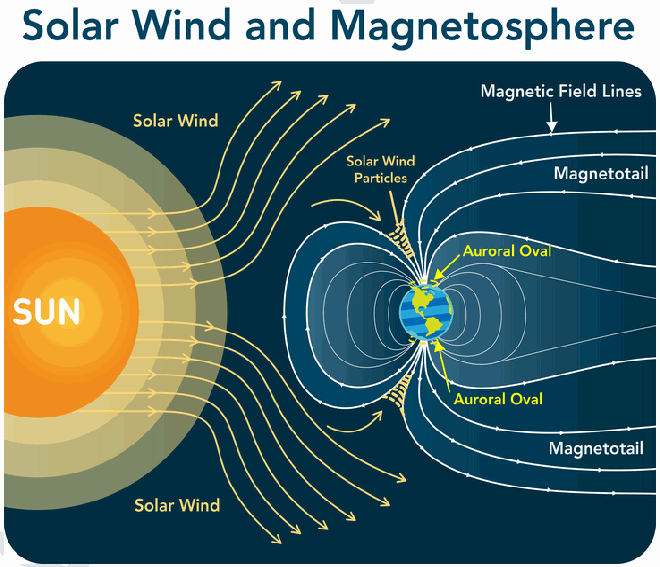

2. These particles hit the **Magnetosphere** (Earth’s magnetic shield), which deflects most of them.

3. Magnetic lines guide particles poleward as Earth's magnetic field lines are weakest and more vertical at the **North and South Poles.**

4. **Acceleration (Birkeland Currents)-** Particles gain speed as they spiral down the field lines toward the **Ionosphere.**

5. **Atmospheric Collision-** Charged particles collide with gas atoms (Oxygen and Nitrogen) in the **Thermosphere** (approx.

100km-400km up).

6. The collision transfers energy to the gas atoms, moving their electrons to a **higher-energy state.**

7. These atoms release that energy as a **photon** (a packet of light).

8. **Color Differentiation- Oxygen** produces **green** and **red, Nitrogen** produces **blue or purple** light.

They illustrate the protective role of the **magnetosphere** while producing one of the most visually stunning atmospheric phenomena.

---

1. Explanation_Drishti IAS:
Source Question: What are aurora australis and aurora borealis? How are these triggered? (Answer in 250 words) (Answer in 250 words)

### Approach:

- Explain Aurora

- Explain types of aurora and how are they triggered

- Conclusion

- Answer-

### Introduction

An aurora is a natural light display that shimmers in the sky. These are visible only at night, and usually only appear in lower polar regions. Auroras primarily appear near the poles of both the northern and southern hemispheres all year round but sometimes they expand to lower latitudes.

### Body

**Types of Aurora**

- **Aurora Australis (Southern Lights):** Visible in the Southern Hemisphere, especially around the Antarctic Circle, in countries like Australia, New Zealand, Antarctica, and southern parts of South America.

- **Aurora Borealis (Northern Lights):** Seen near the Arctic Circle, caused by solar particles interacting with Earth’s magnetic field and atmosphere. It displays green, red, and purple lights in countries like Norway, Sweden, Finland, Iceland, Canada, and Alaska.

**Auroras are Triggered By**

- **Solar Winds:** Interaction of Solar Wind particles produced by sun with earth magnetic fields trigger auroras.

- **Coronal Mass Ejections (CMEs):** CMEs are huge bubbles of coronal plasma threaded by intense magnetic field lines that are ejected from the Sun over the course of several hours. These can enhance auroral activity by increasing the number of charged particles reaching Earth.

- **Magnetosphere Disturbances:** It plays a crucial role in triggering auroras. When the solar wind, which consists of charged particles from the Sun, interacts with Earth’s magnetosphere, it causes disturbances.

- **Atmospheric Interaction:** Charged particles, primarily electrons and protons, are directed towards the polar regions by Earth’s magnetic field. When these particles collide with gases in the upper atmosphere, they excite these gasses, resulting in the emission of light.

### Conclusion

Auroras are the outcome of intricate space weather events, showcasing the dynamic interplay between Earth’s magnetic field and solar activity. The recent occurrence of which was seen at Hanle village in Ladakh in the form of aurora borealis.

---

1. Explanation_PWOnlyIAS:
Source Question: What are aurora australis and aurora borealis? How are these triggered?

| **Core Demand of the Question** ● Explain Aurora Australis (Southern Lights) and Aurora Borealis (Northern Lights). ● Discuss how the auroras are triggered. |
| --- | **Aurora Australis** and **Aurora Borealis,** commonly referred to as the **Southern** and **Northern Lights,** are remarkable atmospheric phenomena that manifest as vibrant light displays in the polar regions. These auroras are generated through the **interaction** of **charged particles** from **solar winds** with the Earth’s magnetic field and atmosphere, resulting in a **dazzling array** of colours that illuminate the night sky.

**Aurora Borealis (Northern Lights):**
- **Location:** The Aurora Borealis occurs predominantly in areas close to the **magnetic North Pole**, including regions like Alaska, Canada, Scandinavia, and parts of Russia.
- **Appearance:** This phenomenon presents as colourful displays of light, primarily in shades of green, but can also feature **pink, red, yellow,** and **purple hues**, depending on the type of gas involved and the altitude at which the interaction occurs.
- **Frequency and Visibility:** The **Northern Lights** are frequently observed and can sometimes be seen at **lower latitudes** during intense solar activity, making them accessible to a broader audience.
- **Cultural Significance:** Many cultures have **myths** and **legends** associated with the Northern Lights, often viewing them as omens or messages from the divine.
- **Recent Observations:** There are several recent notable occurrences of the **Aurora Borealis**, such as significant displays in the fall of 2023, spurred by **heightened solar activity.**

**Aurora Australis (Southern Lights):**
- **Location:** The Aurora Australis occurs in the Southern Hemisphere, primarily around Antarctica and can also be seen in parts of southern **Australia, New Zealand,** and **Chile.**
- **Appearance:** Like its northern counterpart, this aurora displays vibrant colours, with **green** and **pink** being the most common, influenced by atmospheric conditions.
- **Less Frequent Visibility:** Due to fewer populated areas in the southern regions, the **Southern Lights** are less frequently observed by the general public compared to the **Northern Lights.**
- **Scientific Research:** The **Aurora Australis** offers unique opportunities for scientific research, particularly in **Antarctica**, where researchers study space weather’s effects on the atmosphere.
- **Recent Events:** Notable occurrences include visibility during solar storms, such as the displays witnessed in early 2024 in **southern New Zealand**, which drew significant attention.

**Triggering of the Auroras:**
- **Solar Wind:** Auroras are initiated by the solar wind, which consists of charged particles emitted by the Sun. When these particles reach Earth, they interact with the planet’s magnetic field.
- **Magnetosphere Interaction:** The Earth’s magnetosphere channels these solar particles towards the polar regions, where the **magnetic field** is **strongest** and provides a pathway for these particles to enter the atmosphere.
- **Excitation of Atmospheric Gases:** Upon colliding with **oxygen** and **nitrogen** atoms in the upper atmosphere, these **solar particles** transfer **energy,** exciting these gases and causing them to emit light, thus creating the auroras.
- **Altitude Variations:** The colours observed in auroras depend on the type of gas and the altitude of the collisions. For instance, **oxygen** at **higher altitudes** can **emit red light,** while at **lower altitudes**, it produces **green light**.
- **Impact of Solar Activity:** The frequency and intensity of auroras are significantly influenced by solar activity, such as **solar flares** and **coronal mass ejections**, which can enhance the visibility of auroras even in lower latitudes.

Gaining insight into the processes behind the Aurora Australis and Aurora Borealis deepens our admiration for these **remarkable natural displays**, while also shedding light on the relationship between **solar activity** and **Earth’s magnetic field**. Ongoing studies and careful observation of **solar winds** and **geomagnetic disruptions** are crucial for advancing our understanding of their impact on atmospheric science.

---

1. Explanation_Superkalam:
Source Question: What are aurora australis and aurora borealis? How are these triggered?

** Subject: **World Geography

The majestic** Aurora Borealis **(Northern Lights) and** Aurora Australis **(Southern Lights) are among nature's most spectacular phenomena, serving as celestial ballet of lights in Earth's polar regions.

These natural light shows have captivated scientists and sky-watchers alike, particularly during the current** solar maximum period (2024-2026)**.

Aurora Formation

## Formation and Characteristics

- These auroras form when** charged particles **from the Sun (solar wind) interact with Earth's** magnetic field **and** atmosphere**.
- The** Northern Lights **are visible primarily in the** Arctic Circle **regions, while the** Southern Lights **illuminate the** Antarctic skies**.
- They typically display vibrant colors like** green **(from oxygen molecules),** red **(from nitrogen), and** blue **(from hydrogen).

## Triggering Mechanism

-** Solar Wind Interaction**:

 - When** solar wind **particles collide with Earth's** magnetosphere**, they create** geomagnetic storms**.
 - The intensity is measured on the** Kp index **(scale 0-9), with stronger storms (Kp 6-9) pushing auroras to lower latitudes.

-** Particle Collision Process**:

 -** Charged particles **from the Sun excite atoms in Earth's atmosphere.
 - When these atoms return to their ground state, they release energy in the form of light.
 - Different atmospheric gases produce different colors.

## Recent Observations and Research

-** NASA **predicts intense aurora displays through** 2025 **and early** 2026 **due to increased solar activity.
- Recent research has identified** Fragmented Aurora-like Emissions (FAEs) **near the aurora's poleward boundary.
-** Satellite measurements **have revealed** carbon dioxide aurora **emitting infrared radiation globally.

The increasing frequency and intensity of auroral displays, coupled with advancing scientific understanding through projects like** Aurorasaurus**, continue to enhance our knowledge of these mesmerizing celestial phenomena. The current** solar maximum **presents an exceptional opportunity for both scientific research and public observation of these** natural light shows**.

---

1. Explanation_Unacademy:
Source Question: Q15.What are aurora australis and aurora borealis? How are these triggered? (250 Words 15 Marks)

## **Answer** ## **Introduction** - Aurora australis and aurora borealis are natural light displays in the Earth’s upper atmosphere that are caused by solar activity, such as solar flares and coronal mass ejections.

- The aurora can be seen in high-latitude regions near the poles of both the northern and southern hemisphere.

- In the north the display is known as the aurora borealis often seen in countries like Norway, Sweden, Canada, and Alaska.

- In the south it is called the aurora australis visible from Antarctica, New Zealand, and southern parts of Australia..

- Both auroras display similar colours and patterns and are triggered by the same solar phenomena, though they occur at opposite ends of the Earth.

## **Body** ## **How Auroras Are Triggered** ## **1. Solar Wind and Magnetosphere Interaction** - The Sun continuously emits a stream of charged particles, known as **solar wind.** - Duringonekindofsolarstormcalledacoronal massejection,theSunburpsoutahugebubble of electrified gas that can travel through space at high speeds. **Diagram** - The protective magnetic field around Earth shields us from most of the energy and particles, and we don’t even notice them.

 - However, near the poles, the magnetic field is weaker and allows some particles to enter Earth’s atmosphere.

## **2. Excitation of Atmospheric Particles** - When solar wind particles (mostly electrons andprotons)collidewithatomsandmolecules in Earth’s atmosphere, they transfer energy to these particles.

 - This process excites the **oxygen** and **nitrogen** molecules in the atmosphere, raising them to a higher energy state.

## **3. Emission of Light** - When the excited particles return to their normal state, they release the excess energy in the form of light. The type of gas and the altitude of the collision determine the colour of the aurora.  The two primary gases in the Earth’s atmosphere are nitrogen and oxygen, and these elements give off different colours during an aurora display.  The green we see in the aurora is characteristic of oxygen, while hints of purple,blueorpinkarecausedbynitrogen.  Scarlet red colour, and this is caused by very high altitude oxygen interacting with solar particles

## **Conclusion** - Auroras provide valuable information about Earth’s **magnetosphere** and its interaction with solar wind.

- Studying them helps scientists better understand **space weather** phenomena, which can affect satellite communications, GPS systems, and even power grids.

---

---

Q87. What is the phenomenon of ‘cloudbursts’? Explain.
[Year: 2024] [Group: UPSC CSE] [Exam: Mains] [Stage: Mains] [Paper: Mains - GS 1]
[Subject: GEOGRAPHY]
[Section Group: Physical Geography & Geophysical Phenomena]
[Microtopic: Important Geophysical phenomena such as earthquakes, Tsunami, Volcanic activity, cyclone etc.,]
[Subtopic: Cloudbursts]
[Macrotag: Descriptive]
[Microtag: Explain, What is]
##### Subtopic: Cyclone

1. Explanation_Civilsdaily:
Source Question: What is the phenomenon of ‘cloudbursts’? Explain. [Year: 2024] [Marks: 10]

IMD defines cloudburst as an extreme weather event involving **very high-intensity rainfall (often >100 mm/hour)** over a **small geographical area** (20-30 sq. km.) within a **short duration.**

**Mechanism of Cloudburst**

**1.** Orographic Uplift

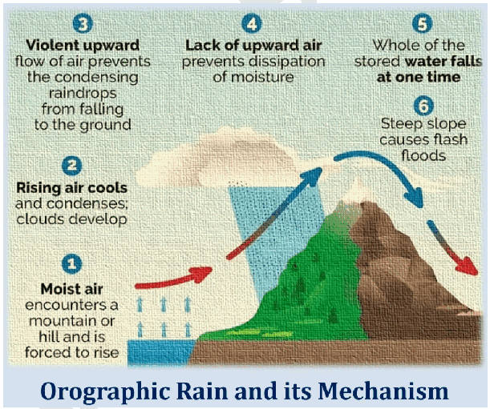

- Moist air masses are **forced to rise abruptly** when they encounter **steep mountain slopes.**

- Rapid ascent causes **condensation and release of latent heat,** intensifying convection.

**2.** Strong Convective Clouds (Cumulonimbus) up to 12-15 km.

**3.** Moisture Supply from Monsoon Systems enhances instability.

**4.** When updrafts weaken, large volumes of accumulated rainwater are released at once, causing cloudburst-like rainfall.

**Occurrence of cloudburst in the Indian**

**Subcontinent**

**1.** Himalayan and Western Ghat Topography - Steep slopes promote rapid vertical uplift.

**2.** Monsoon Dynamics - High atmospheric moisture during June-September.

**3.** Climate Change - Rising temperatures increase atmospheric moisture-holding capacity. Eg- every 1°C rise lets air hold ~7% more moisture.

**4.** Land-Use Changes - Deforestation, slope cutting, and urbanisation increase runoff and disaster impact.

**Major Cloudbrusts**

1. **Kedarnath/Uttarakhand Catastrophe (June 2013) - loss of more than 5,000 lives**

2. **Himachal Pradesh Cloudbursts in 2025 -** Losses at about Rs 4,300 crore and nearly 380 deaths

**3. South Lhonak Lake Outburst (Sikkim) - October 2023 Mitigation measures**

**1. Structural**

a. **Engineering solutions** - Retaining walls, slope drainage, rock bolting, geo-textiles,

b. **Nature based solutions** - Afforestation in himalaya

**2. Non-Structural**

**a. Expansion of multi-hazard insurance**

**b. Disaster resilient urban planning (Mishra committee on Joshimath crisis)** The **Sendai Framework’s** proactive approach is essential for making Bharat a **‘weather-ready and climate-smart’ nation.**

**Geomorphology**

---

1. Explanation_Drishti IAS:
Source Question: What is the phenomenon of cloudbursts? Explain. (Answer in 150 words)

### Approach

- Introduce the phenomenon of cloudburst with recent examples.

- Mention the mechanism and impacts of cloudburst

- Conclude Suitably

### Introduction

Cloudbursts are **intense rainfall events, exceeding 100 mm/h, over a small area of 20-30 square km**. Recent cloudbursts in hilly regions like Uttarakhand and Himachal Pradesh have highlighted this phenomenon.

### Body **Mechanism of Cloudburst** 
[View Offline Local Backup](drishti ias/images/geography_q11_img1.png) Cloudbursts happen when warm, moist air rapidly rises due to various factors like:

- **Orographic lift:** Moist air is pushed upward by mountains or hills, cooling quickly and condensing into heavy rainfall.

- **Convective processes:** The warm air near the surface rises due to temperature differences and forms **cumulonimbus clouds**.

- If the air at higher altitudes cools rapidly, it can trap the moisture, leading to sudden, concentrated rainfall.

When the **moisture in these clouds becomes too heavy**, it is released in a short, violent downpour, often accompanied by thunder and lightning.

**Impacts:**

- **Flash Floods:** Sudden water release causes rivers to overflow, devastating communities.

- **Landslides:** Rain in mountainous areas triggers landslides.

- **Infrastructure Damage:** Roads, bridges, and buildings suffer severe damage.

- **Loss of Life:** Cloudbursts, especially in hilly areas, can lead to fatalities.

### Conclusion

India has seen a rise in cloudburst events, especially in vulnerable areas like the Himalayas and coastal cities. Improved weather monitoring and climate adaptation plans are urgently needed to mitigate these disasters.

---

1. Explanation_PWOnlyIAS:
Source Question: What is the phenomenon of ‘cloudbursts’? Explain.

| **Core Demand of the Question** ● Discuss the phenomenon of cloudbursts. ● Shed light on the characteristics of the cloudbursts. |
| --- |

### Answer

A **cloudburst** is an extreme weather event characterised by **sudden, intense rainfall** over a **localised** area, often within an hour **,** leading to **flash floods**. For instance, in **2013**, a cloudburst in **Uttarakhand**

**, India, triggered devastating floods and landslides, illustrating the destructive potential of such events, especially in mountainous regions. Phenomenon of Cloudburst:**
- **Rapid Upward Movement and Orographic Lifting:** Cloudbursts occur when warm, moisture-laden air rapidly rises, cools, and condenses into dense clouds. **For example**: In the Himalayas, steep terrain accelerates orographic lifting, causing heavy rainfall, as seen in the **2013 Kedarnath tragedy.**
- **Localised Low-Pressure Zones:** The development of low-pressure areas in high-altitude regions attracts moisture-laden winds, leading to heavy cloud formation and eventual cloudbursts. **For example**: The **2020 cloudburst** in **Himachal Pradesh can be linked to such low-pressure zones in the atmosphere.**
- **Saturation of Air:** When air holds more moisture than it can sustain, any sudden atmospheric disturbance can lead to excessive rainfall.
- **Atmospheric Instability:** Collisions between warm, moist air and cooler air pockets create unstable atmospheric conditions, triggering cloudbursts. **For example**: The **2014 cloudburst** in **Jammu and Kashmir**, which led to widespread destruction, was a result of such instability.
- **Global Warming and Climate Change:** Rising global temperatures have led to an increase in atmospheric moisture levels, making cloudbursts more frequent and intense..

**Characteristics of Cloudbursts:**
- **High-Intensity Rainfall:** Cloudbursts are defined by rainfall exceeding **100 mm** in an **hour,** leading to significant flooding. **For example**: The **Leh cloudburst** of **2010** dumped an immense amount of rain in a very short period, overwhelming local drainage systems **.**
- **Localised Nature:** Cloudbursts typically affect small areas, less than **20-30 square kilometres.** **For example**: In **2022 Amarnath Yatra cloudburst,** where a specific zone experienced extreme rainfall, causing rapid flooding.
- **Short Duration:** Though cloudbursts last only a few minutes to an hour, the intensity of rainfall causes immense damage. **For example**: The 2021 **Uttarakhand cloudburst** lasted for about **30 minutes**, causing flash floods in several areas.
- **Sudden River Surge and Dam Breach:** Cloudbursts often cause a rapid and uncontrolled surge in river water levels, putting immense pressure on dams, sometimes causing breaches that result in catastrophic flash floods.
- **Occurrence in Hilly Regions:** Cloudbursts are most common in mountainous regions like the Himalayas, due to the orographic effect.
- **Lack of Predictability:** Cloudbursts are difficult to forecast due to their sudden and localised nature.

As climate patterns shift, the frequency and intensity of cloudbursts are expected to rise, particularly in vulnerable areas. Enhanced **weather forecasting** and **disaster preparedness** will be essential to mitigate their impacts and help communities adapt to these unpredictable events in the future.

---

1. Explanation_Superkalam:
Source Question: What is the phenomenon of cloudbursts? Explain.

** Subject: **Physical Geography

Indian Meteorological Department (IMD) defines cloud burst as an extreme, localized precipitation event recording** 100 mm or more per hour **over a small geographical area of 10 to 30 square kilometres.

### Understanding the Phenomenon of Cloudbursts

Cloudburst

1.** Orographic Lifting: **Moisture-laden winds hitting mountain barriers are rapidly forced upwards, condensing into massive cumulonimbus clouds.
2.** Convective Instability: **Strong vertical updrafts suspend water droplets until they become too heavy, triggering violent and sudden downpours.
3.** Clausius-Clapeyron Effect: **Global warming intensifies this mechanism, as every 1°C temperature rise allows the atmosphere to hold 7% more moisture.
4.** Geographical Expansion: **The phenomenon is spreading beyond the Himalayas to the orographically lifted Western Ghats, contributing to catastrophes like the** Wayanad landslides (2024)**.

Formation of Cloudburst

### Impacts and Mitigation Strategies

1.** Micro-climatic Extremes: **Increasing "mini-cloudbursts" cause sudden urban flooding, like the** September 2025 Dehradun event **which recorded 192 mm of rainfall in hours.
2.** Economic Devastation: **Sudden flash floods wipe out critical infrastructure, causing** ₹541 crore **in damages in Himachal Pradesh during a single July 2025 spell.
3.** Anthropogenic Aggravation: **Unplanned highway expansion worsens slope instability, as highlighted by the** SC-Appointed High-Powered Committee on Char Dham**.
4.** Nowcasting Capabilities: **The government is expanding the** Doppler Weather Radar **network to 126 by 2026 for hyper-local early warnings.
5.** Sustainable Limits: **The** Supreme Court (2024) **ordered carrying capacity evaluations for 13 Himalayan states to halt unsustainable tourist and infrastructure influx.

Mitigating cloudbursts requires transitioning from reactive rescue to proactive climate resilience, integrating real-time hydrodynamic modeling and aligning local developmental policies with the** Sendai Framework**.

---

1. Explanation_Unacademy:
Source Question: Q6.What is the phenomenon of ‘cloudbursts’? Explain. (150 Words 10 Marks)

**Answer:** **Introduction:** Acloudburstisanextremeweathereventcharacterised byasuddenandintensedownpour,oftenaccompanied by hail and thunder, capable of causing flash floods. According to the Indian Meteorological Department (IMD), a rainfall event is termed a cloudburst when 10 cm of rainfall occurs within an hour at a particular location. **Body** - It is caused by strong upward air currents that prevent condensing raindrops from falling, allowing large amounts of water to accumulate at high altitudes.

- When these currents weaken, all the accumulated water falls rapidly in a concentrated area, leading to heavy rainfall.

- Cloudbursts are especially common in mountainous regions, where warm air currents tend to follow the slopes upward, contributing to rapid rainfall.

- The steep terrain also intensifies the effects, as water flows into valleys and gullies, causing flash floods and significant damage.

- Example: Cloudburst in Himachal Pradesh (August 2024), Cloudburst near the Amarnath cave in Jammu and Kashmir (2022), Cloudburst in Uttarakhand in 2013

## **Measures to Mitigate Cloudburst Impacts** - **Early Warning Systems:** Improved forecasting and real-time monitoring by IMD to issue early warnings can help mitigate the impact of cloudbursts.

- **Disaster Preparedness:** Strengthening disaster response mechanisms, especially in vulnerable mountainous regions, can save lives and minimise damage.

- **Afforestation and Water Management:** Plantation of trees and better water management practices can reduce runoff and mitigate the impact of flash floods caused by cloudbursts. **Conclusion** As Cloudbursts are unpredictable, enhancing early warning systems and preparedness can help mitigate their damaging effects, particularly in areas prone to flash floods.

---

---

Q88. What is sea surface temperature rise? How does it affect the formation of tropical cyclones?
[Year: 2024] [Group: UPSC CSE] [Exam: Mains] [Stage: Mains] [Paper: Mains - GS 1]
[Subject: GEOGRAPHY]
[Section Group: Physical Geography & Geophysical Phenomena]
[Microtopic: Important Geophysical phenomena such as earthquakes, Tsunami, Volcanic activity, cyclone etc.,]
[Subtopic: Cyclone]
[Macrotag: Descriptive]
[Microtag: What is, How]

1. Explanation_Civilsdaily:
Source Question: What is sea surface temperature rise? How does it affect the formation of tropical cyclones? [Year: 2024] [Marks: 10]

**Sea Surface Temperature (SST) rise** refers to the **increase in temperature of the upper layer of ocean**

**water.** It is a critical indicator of the Earth's climate health

**Fact File**

1. Oceans absorb **90% of the excess heat** from greenhouse gas emissions

2. SST increased by approximately 0.88°C between 1850-1900 and 2011-2020 (IPCC) **Causes of sea surface temperature rise**

1. **Greenhouse gas emissions** - Eg- Atmospheric CO₂ crossed 425 ppm.

2. **Global warming trend** - Eg- Earth warmed ~1.44°C since pre-industrial levels. (IPCC)

3. **Marine heatwaves** - Persistent abnormal warming events.

4. **Weakening ocean circulation** reduces heat redistribution. Eg- Slowing Atlantic Meridional Overturning Circulation (AMOC).

5. **El Niño events** - Periodic warming of Pacific surface waters.

6. **Declining polar ice cover** - Reduced albedo effect increases absorption.

7. **Ocean Stratification-** As surface water warms, it becomes lighter and fails to mix with deeper, cooler water **Impact of SST rise on formation of tropical cyclones** Minimum SST of **26.5°C** was required for a cyclone to form. Rising sea temperature has led to

1. Expansion of the **geographic area and the seasons** during which this threshold is met.

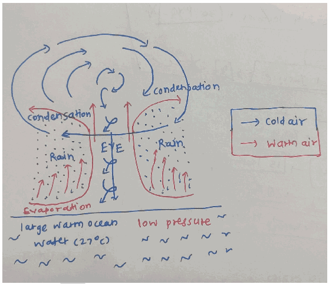

a. Cyclones in **South Atlantic** and higher latitudes of the Pacific

b. Arabian Sea witnessing more intense storms. Eg- Cyclone Nisarga (2020) near Maharashtra coast.

2. **Enhanced evaporation** - Warmer oceans increase moisture supply. Eg- Rapid moisture buildup before Cyclone Amphan (2020).

3. **Rapid Intensification (RI)-** High SSTs provide an explosive amount of latent heat.

Eg- **Hurricane Milton (2024)** jumped from Category 1 to Category 5 in under 24 hours.

4. **Greater Storm Size-** Eg- Super Cyclone **Amphan (2020)** covered almost the entire Bay of Bengal during its peak.

5. For every **1°C** of SST rise, the air holds **7% more water vapor.** This leads to **greater rainfall** during cyclonic activity.

6. High SSTs allow storms to carry their **moisture further inland** before dissipating. Eg- **Hurricane Harvey in** Texas

7. **Higher storm surge risk** - Combined SST rise and sea-level rise amplify flooding. Eg- Cyclone Idai (2019) caused severe coastal inundation.

8. **Shift in cyclone tracks and behavior** due to altered SST gradients. Eg- Increasing westward shift of North Indian Ocean cyclones.

Addressing this challenge requires a **multi-layered climate and disaster strategy-**

1. **Mitigate greenhouse gas emissions**

2. **Strengthen ocean monitoring systems**

3. **Improve cyclone early warning systems**

4. **Protect natural buffers. Eg- mangroves**

---

1. Explanation_Drishti IAS:
Source Question: What is sea surface temperature rise? How does it affect the formation of tropical cyclone ? (Answer in 150 words)

### Approach

- Define Sea Surface Temperature (SST).

- Explain the role of SST rise in the formation of tropical cyclone.

- To conclude, suggest safeguarding mechanisms for rising sea surface temperature.

### Introduction **Sea Surface Temperature (SST)** is defined as the temperature of the uppermost layer of the ocean. The rise in sea surface temperature is primarily driven by human-induced climate change, with significant contributions from greenhouse gas emissions. **SST** plays a crucial role in influencing weather patterns, especially in the formation of tropical cyclones.

[View Offline Local Backup](drishti ias/images/geography_q9_img1.jpg)

### Body

**Impact of SST Rise on Tropical Cyclone Formation :**

- **Energy Source:** Rising sea surface temperatures provide the necessary heat and moisture, which are crucial for the formation and intensification of tropical cyclones.

- **Convection:** Higher SSTs enhance convection processes, leading to the development of tropical cyclones.

- **Development Threshold:** If SSTs are below the 26°C threshold, the energy available for cyclone development is insufficient.

- **Intensity:** Warmer SSTs not only initiate cyclone formation but also contribute to the intensification of existing storms, potentially increasing their wind speeds and destructive capacity.

- **Frequency:** Rising global temperatures may increase the frequency and intensity of tropical cyclones by raising sea surface temperatures.

- **Changing Tracks:** As SSTs rise globally, tropical cyclones may form in new regions or shift their paths, affecting areas previously unaffected. 
[View Offline Local Backup](drishti ias/images/geography_q9_img2.png) ### Conclusion

To safeguard marine ecosystems from rising sea surface temperatures, it is essential to reduce greenhouse gas emissions and develop climate-resilient infrastructure. At the same time, conserving marine ecosystems through sustainable practices and improving forecasting capabilities will enhance the region's resilience to extreme weather events.

---

1. Explanation_PWOnlyIAS:
Source Question: What is sea surface temperature rise? How does it affect the formation of tropical cyclones?

| **Core Demand of the Question** ● Discuss the phenomenon of sea surface temperature rise. ● Highlight how does sea surface temperature rise affect the formation of tropical cyclones. |
| --- | **Sea Surface Temperature rise** (SST) refers to the significant increase in the temperature of ocean surface waters, primarily driven by anthropogenic climate change. This trend has profound implications for the global climate system. For example, the average sea surface temperature (SST) over the **extrapolar ocean** has increased by about **0.6°C** over the last four decades and about **0.9°C** since the pre-industrial era. **,** influencing **cyclone formation** and **intensity**.

**The Phenomenon of Sea Surface Temperature Rise:**
- **Greenhouse Gas Emissions and Ocean Heat Absorption:** Increased **greenhouse gas concentrations** trap heat in the atmosphere, causing oceans to absorb more heat. This absorption results in a rise in **sea surface temperatures (SST)**, contributing to global warming and altering **marine ecosystems.**
- **Carbon Dioxide Absorption:** Oceans act as **carbon sinks**, absorbing about **30%** of human-emitted **CO₂**. As CO₂ dissolves in water, it reacts to form **carbonic acid**, altering **ocean chemistry** and contributing to the warming of surface waters.
- **Albedo Effect:** The **melting of polar ice** reduces the Earth’s reflective surface (albedo), allowing more sunlight to be absorbed by ocean waters. This accelerates **SST rise**, leading to further ice melt in a **feedback loop**, which worsens sea level rise and disrupts polar ecosystems.
- **Global atmospheric temperature rise:** According to **NASA’s Goddard Institute for Space Studies (GISS)**, global sea surface temperatures (SST) have risen in parallel with global atmospheric temperatures, increasing by approximately **1°C since 1880**.
- **Altered Ocean Currents:** Changes in ocean currents, like the slowdown of the **Atlantic Meridional Overturning Circulation (AMOC)**, disrupt heat distribution and lead to localized warming.
- **Increased Solar Radiation:** Enhanced greenhouse gas concentrations trap more heat in the atmosphere, causing oceans to absorb more solar energy and increase surface temperatures. **For example**: The **Mediterranean Sea** has warmed by approximately **4°C per decade** from 1985 to 2006, altering marine ecosystems and weather patterns in surrounding regions.

**Impact of SST Rise on Tropical Cyclone Formation:**
- **Increased Intensity:** Higher SST provides **more energy** to developing tropical cyclones, intensifying their strength. **For example: Cyclone Amphan (2020)**, which struck **India** and **Bangladesh**, was fueled by abnormally warm **Bay of Bengal** waters, reaching super-cyclone status.
- **More Frequent and Severe Storms:** Rising SSTs lead to an increase in the number of severe tropical cyclones. **For example:** The **2020 Atlantic hurricane season,** which was one of the most active on record, saw 30 named storms, driven in part by higher-than-average SSTs in the Atlantic.

- **Amplified Rainfall:** Warmer ocean surfaces increase the **moisture content** in the atmosphere, leading to heavier rainfall during cyclones. This can cause devastating **floods**.
- **Extended Duration:** Cyclones fueled by higher SSTs tend to last longer and travel further inland. **For example:Cyclone Idai (2019),** maintained its intensity well after landfall in Mozambique due to the unusually warm waters of the **Mozambique Channel.**
- **Shifts in Cyclone Tracks:** SST rise can alter cyclone tracks, pushing them toward regions that historically experienced fewer such storms. **For instance:** **Hurricane Ophelia (2017)** reached as far as Ireland, a rare occurrence attributed to anomalous SSTs in the **North Atlantic.**
- **Impact on Vulnerable Regions:** Countries with warmer waters, such as those bordering the Indian and Pacific Oceans, are more prone to intensified tropical cyclones.

For example: **The** Philippines **and the** Caribbean **already have frequent targets of** typhoons **and** hurricanes, and face increased risks due to the warming ocean temperatures.

The rise in sea surface temperatures significantly challenges us by increasing the **intensity** and **frequency** of tropical cyclones. However, global climate action, including reducing greenhouse gas emissions and adopting sustainable coastal development practices, can help mitigate this rise. Furthermore, advancements in **cyclone forecasting** and **coordinated international efforts** are crucial for enhancing **resilience** and safeguarding ecosystems and communities.

---

1. Explanation_Superkalam:
Source Question: What is sea surface temperature rise? How does it affect the formation of tropical cyclones?

** Subject: **Physical Geography

The** sea surface temperature (SST) **represents the temperature of the ocean's upper layer, which has experienced significant warming due to anthropogenic climate change and natural variability. Oceans absorb nearly 90% of the excess heat trapped by greenhouse gases, leading to a steady increase in sea surface temperatures.

Tropical Cyclone structure and formation

## Understanding Sea Surface Temperature Rise

-** Global Warming Impact**: The** Indian Ocean **is experiencing a concerning warming trend of** 1.7-3.8°C per century**, indicating accelerated thermal absorption.
-** Regional Variations**: While some regions like the** equatorial Indian Ocean **showed near-average temperatures in March 2025, other areas exhibited above-average SSTs in January 2025.
-** Heat Exchange**: SST rise affects the** ocean-atmosphere interaction**, influencing heat flux, evaporation rates, and atmospheric circulation patterns.

## Impact on Tropical Cyclone Formation

### Prerequisites for Cyclogenesis

-** Temperature Threshold**: SSTs of** 28-29°C **or higher create favorable conditions for cyclone formation in the** Arabian Sea **and** Bay of Bengal**.
-** Energy Transfer**: Warmer waters enhance** heat and moisture transfer **to the atmosphere, providing the necessary fuel for cyclone development.

### Changes in Cyclone Patterns

-** Spatial Distribution**: The traditional** 4:1 ratio **of cyclones between the Bay of Bengal and Arabian Sea is shifting due to warming trends.
-** Arabian Sea Intensification**: Recent decades have witnessed a** 1.2-1.4°C increase **in cyclogenesis-supporting SSTs in the Arabian Sea compared to previous decades.
-** Rapid Intensification**: For instance, Cyclone Amphan (2020) in the Bay of Bengal rapidly intensified into a super cyclone due to SSTs exceeding 30°C

### Impact on Cyclone Characteristics

-** Rainfall Intensity**: Higher SSTs lead to increased precipitation during cyclonic events.
-** Wind Velocity**: Warmer waters contribute to stronger wind speeds and more intense storms.
-** Track Modification**: Rising SSTs can influence cyclone trajectories and their geographical distribution.

Rising sea surface temperatures have emerged as a critical factor in shaping tropical cyclone behavior, as evidenced by the increasing frequency of** rapid intensification events **in regions like the** Gulf of Mexico **and** Caribbean Sea**, necessitating enhanced disaster preparedness and climate adaptation strategies.

---

1. Explanation_Unacademy:
Source Question: 4. What is sea surface temperature rise? How does it affect the formation of tropical cyclones? (150 Words 10 Marks)

**Answer:** **Introduction:** Seasurfacetemperaturerisereferstotheincreaseinthe average temperature of the ocean’s surface, primarily due to global warming and climate change.

- Warmer sea surfaces act as a key factor in driving the formation of tropical cyclones, as they provide the heat and moisture necessary to fuel these storms. **What are Tropical Cyclones?** - Tropical cyclones are violent storms that originate over oceans in tropical areas and move over to the coastalareasbringingaboutlargescaledestruction caused by violent winds, very heavy rainfall and storm surges.

- Tropical cyclones originate and intensify over warm tropical oceans.

- The conditions favourable for the formation and

## **intensification of tropical storms are** (i) Large sea surface with temperature higher than 27° C;

(ii) Presence of the Coriolis force; (iii)Small variations in the vertical wind speed; (iv)A pre-existing weak-low-pressure area or lowlevel-cyclonic circulation;

(v) Upper divergence above the sea level system.

## **Impact on Tropical Cyclone Formation** - Tropical cyclones are formed in the Inter tropical convergence zone.

- They are developed because of the differential heating of land and sea.

- The rise in sea surface temperatures intensifies this

## **process in several ways** - **Increased Moisture:** Warm ocean waters lead to more evaporation, increasing moisture in the atmosphere, fueling the cyclone’s growth.

 - **Stronger Winds:** Higher sea temperatures provide more energy for cyclones, leading to stronger winds, higher storm surges, and increased precipitation.

 - **FrequentandIntenseCyclones:Asseasurface** temperatures rise, more tropical cyclones form, and they tend to be more intense and last longer. **Conclusion** Thus,theriseinseasurfacetemperaturesplaysacritical role in intensifying tropical cyclones by providing additional heat and moisture to fuel these storms. This not only increases the frequency of cyclones but also makes them more destructive, with stronger winds, heavier rainfall, and higher storm surges, posing significant threats to coastal regions.

---

---

Q89. Discuss the meaning of colour-coded weather warnings for cyclone prone areas given by India Meteorological Department.
[Year: 2022] [Group: UPSC CSE] [Exam: Mains] [Stage: Mains] [Paper: Mains - GS 1]
[Subject: GEOGRAPHY]
[Section Group: Physical Geography & Geophysical Phenomena]
[Microtopic: Important Geophysical phenomena such as earthquakes, Tsunami, Volcanic activity, cyclone etc.,]
[Subtopic: Cyclone]
[Macrotag: Analytical, Applied]
[Microtag: Discuss, India]

1. Explanation_Civilsdaily:
Source Question: Discuss the meaning of colour-coded weather warnings for cyclone prone areas given by India Meteorological department. [Year: 2022] [Marks: 10]

The **India Meteorological Department (IMD)** issues **colour-coded weather warnings** to communicate the **severity, impact potential, and required response level** for extreme weather events, including cyclones.

**IMD’s 4 stage weather warning for cyclones**

1. **Pre-cyclone watch** - 72 hours in advance.

2. **Cyclone Alert (Yellow)** - 48 hrs in advance. **Action Required-**

a. Disaster response teams mobilized

b. Possible evacuation planning

c. Suspension of fishing activities

3. **Cyclone warning (Orange)** - Issued at least 24 hrs in advance indicating the latest position of Tropical Cyclone, intensity, time and point of landfall, storm surge height, type of damages expected and actions suggested.

a. Immediate evacuation

b. Closure of schools and offices

c. Emergency services fully activated

4. **Post-Landfall Outlook (Red)** - Issued about 12 hrs before landfall & till cyclone force winds prevail. It details the expected movement of the cyclone after it crosses the coast into the interior.

a. Immediate life-saving actions and "stay-at-home" orders are strictly enforced.

5. **‘De-Warning’ message** issued when the Tropical Cyclone weakens into the Depression stage.

**Communication methods used-**

1. Digital & Mobile Channels

- **SACHET Platform**

- **SMS & Cell Broadcast**

- **Mobile Apps- MAUSAM, MEGHDOOT**

- **Social Media-** Real-time updates via **X (Twitter), Facebook, and WhatsApp** community groups.

2. Traditional Mass Media - All India Radio (AIR), Doordarshan etc

3. Maritime Systems - NavIC & GAGAN - satellite-based messaging for fishermen deep at sea .

4. Railway & Airport Announcements **Significance**

1. **Improves early warning dissemination** with simplified technical forecasts.

2. **Reduces disaster mortality** by ensuring timely evacuation.

3. **Enables graded response** - Escalation from monitoring to action.

4. **Supports NDMA and state authorities** in integrated disaster planning.

5. **Protects fishermen and coastal communities** through early sea warnings.

This graded system plays a critical role in **preparedness, evacuation planning, and minimizing loss of life and property,** thereby strengthening India’s disaster resilience framework.

---

1. Explanation_Drishti IAS:
Source Question: Discuss the meaning of colour-coded weather warnings for cyclone prone areas given by India Meteorological Department.

The IMD uses four colour-coded weather warnings to signify the intensity of the weather situation and alert people about possible widespread disruption or danger to life:

- **Green (All is well):** No advisory is issued.

- **Yellow (Be Aware):** Yellow indicates severely bad weather spanning across several days. It also suggests that the weather could change for the worse, causing disruption in day-to-day activities.

- **Orange (Be prepared):** The orange alert is issued as a warning of extremely bad weather with the potential of disruption in commute with road and rail closures, and interruption of power supply.

- **Red (Take Action):** When extremely bad weather conditions are certainly going to disrupt travel and power and have significant risk to life, the red alert is issued.

In Cyclone prone areas, the IMD issues cyclone warnings to state government officials in four stages:

- **Pre-Cyclone Watch:** It is issued 72 hours prior and contains early warning about the development of a cyclonic disturbance in the north Indian Ocean.

- **Cyclone Alert:** It is issued at least 48 hours prior to the expected commencement of adverse weather over the coastal areas.

- **Cyclone Warning:** It is issued at least 24 hours in advance. Landfall point is forecast at this stage.

- **Post Landfall Outlook:** it is issued at least 12 hours in advance of the expected time of landfall. It gives the likely direction of movement of the cyclone after its landfall.

| **Stage of Warning** | **Colour Code** |
| --- | --- |
| Cyclone Alert | Yellow |
| Cyclone Warning | Orange |
| Post landfall out look | Red |

---

1. Explanation_PWOnlyIAS:
Source Question: Discuss the meaning of color-coded weather warnings for cyclone prone areas given by India Meteorological department.

| **Approach:** **Introduction**  • Briefly mention the Functions of India Meteorological Department (IMD). **Body**  • Discuss the color-coded warnings issued by the IMD for cyclones. **Conclusion**  • Conclude your answer with a Futuristic Approach. |
| --- |

### Introduction

**
**India Meteorological Department (IMD)** issues color-coded weather warnings for cyclone-prone areas in India to alert people about the potential danger from cyclones. These color codes represent the intensity of the cyclone and the likely impact on people and property in the affected areas.

### Body

**Color-coded warnings issued by the IMD for cyclones:** 

- **Green (All is well):** This is the least **severe warning** and indicates that there is no immediate danger. It is issued when a cyclone is expected to form in the coming days but is not yet close to the affected area.
- **Yellow (Be Aware):** This warning is issued when **a cyclone is likely to hit the affected area in the next few days**. It indicates that people should be cautious and take necessary precautions.
- **Orange/ Amber (Be Prepared):** This warning is issued when a cyclone is **expected to hit the affected area in the next 24 hours**. It indicates that people should take all necessary precautions and be prepared for the worst.
- **Red (Take Action):** This is the **most severe warning** and is issued when a cyclone is expected to hit the affected area within the next few hours. It indicates that people should take immediate action to protect themselves and their property.

### Conclusion

The IMD also provides detailed information on the potential impact of the cyclone, such as **wind speed, rainfall, storm surge, and flooding, along with the warning**. The color-coded weather warnings issued by the IMD for cyclone-prone areas in India are an important tool to alert people about the potential danger from cyclones and to help them take necessary precautions to protect themselves and their property.

---

1. Explanation_Rau IAS:
Source Question: Discuss the meaning of colour-coded weather warnings for cyclone prone areas given by India Meteorological Department. (10 Marks, 150 Words)

### Introduction

In order to strengthen the early warning system and reduce potential damages due to cyclonic winds, IMD follows a special matrix to decide the colour of weather situations.

### Body

It is based on the probability of occurrence of the event as well as its impact assessment. The decision of the colour also depends on the meteorological factors, hydrological factors, geophysical factors that indicate the risk.

**Colour code****Meaning**Green• All is well.• No adverse weather conditions.• No advisory issued.Yellow• Be aware.• Severely bad weather may span across several days• Warning of affecting daily activities.Orange• Be prepared.• Warning of extreme damage to communication disruptions.• Sign for evacuation and keeping the basic necessities ready for families.Red• Take action.• Threat to life with the worst weather conditions.• Measures are taken to handle the situation along with the help of disaster management response teams.

### Conclusion

These warnings are mainly meant for administrators to keep ready and position their resources to handle situations arising out of weather-related disastrous events.

---

---

1. Explanation_Superkalam:
Source Question: Discuss the meaning of colour-coded weather warnings for cyclone prone areas given by India Meteorological Department.

The** India Meteorological Department (IMD) **issues** colour-coded weather warnings **to alert authorities and the public about upcoming severe weather events, especially in** cyclone-prone coastal areas**. These warnings are designed to indicate the** severity of the situation **and the** level of preparedness required **for safeguarding life and property.

Four Tier Pyramid Weather Warning System

##** Meaning of IMD Colour Codes for Cyclones **|** Colour Code **|** Meaning **|** Action Required **|
| --- | --- | --- |
|** Green **| No warning – Normal situation. | No action needed; routine monitoring. |
|** Yellow **| Be updated – Weather may deteriorate; potential cyclone watch issued. | Keep monitoring official updates; prepare emergency kits; authorities activate preliminary readiness. |
|** Orange **| Be prepared – Cyclone likely to hit; significant impact expected. | Authorities prepare evacuation plans; fishermen advised not to venture into sea; coastal residents start shifting to shelters. |
|** Red **| Take action – Severe cyclone imminent or ongoing; very high risk to life and property. | Immediate evacuation; disaster management teams fully mobilised; emergency response in full swing. |

##** Example of Application **-** Cyclone Fani (2019): **- IMD issued** Orange alerts **3 days in advance for Odisha.
 -** Red alert **was issued 24 hours before landfall, leading to evacuation of over** 1.2 million people **— minimising loss of life.

-** Cyclone Tauktae (2021): **- IMD issued** Yellow and Orange warnings **for coastal Gujarat and Maharashtra well in advance.
 - Escalation to** Red warning **before landfall enabled relocation of over 1.5 lakh people and safeguarding of critical infrastructure.

##** Significance of Colour-Coded Cyclone Warnings **1.** Facilitates Timely Evacuation **-** Example: **During** Cyclone Phailin **(2013), early** Orange and Red alerts **helped evacuate ~1 million people in Odisha and Andhra Pradesh, reducing fatalities to under 50 compared to thousands in the 1999 super cyclone.

2.** Ensures Resource Mobilisation: **Allows state disaster response forces (SDRF), NDRF, and armed forces to pre-position rescue boats, relief materials, and medical teams in high-risk areas.
3.** Minimises Economic Losses **- Protects fisheries, agriculture, and port operations.
 - Example: Pre-warning before** Cyclone Yaas **(2021) saved fishing vessels worth crores along the Bay of Bengal.

4.** Supports Public Awareness and Behavioural Preparedness: **Colour codes (Yellow, Orange, Red) are simple for communities to understand, improving compliance with evacuation orders.
5.** Enables Coordination Between Agencies: **IMD alerts trigger inter-agency meetings between meteorological, disaster management, health, transport, and power departments for integrated response.
6.** Builds Long-term Climate Resilience: **Data from warning issuance and community responses is used to improve cyclone modelling, coastal zoning, and resilient infrastructure planning.

IMD’s colour-coded cyclone warnings serve as a** simple yet effective tool **for risk communication, ensuring timely response and disaster mitigation. Their** success during recent cyclones **reflects the importance of** clear, actionable, and science-based early warning systems **in safeguarding vulnerable coastal populations.

---

1. Explanation_Unacademy:
Source Question: Q5.Discuss the meaning of colour-coded weather warnings for cyclone prone areas given by India Meteorological Department. (150 Words, 10 Marks) Approach

- **Introduction:** Introduce with usage of colour coded weather warnings by IMD.

-

## **Body** - Mention the meaning of colour-coded weather warnings and their significance.

- **Conclusion:Concludetheanswermentioning** necessitiesofcolour-codedweatherwarnings. **Answer:** **Introduction:The** India Meteorological Department (IMD) provides colour-coded weather warnings for cyclone-prone areas to inform and alert the public aboutthepotentialimpactofcyclones.Thesewarnings use a specific colour code system to indicate the severity of the cyclonic conditions and the associated risks. **Body:Themeaningofcolour-codedweatherwarnings** **and their significance:** **Green Alert:** The green alert signifies a cyclone that is not expected to have a severe impact. It indicates that the cyclonic conditions pose minimal risk and that people should remain cautious but not panic. Precautions may include staying informed, following weather updates, and taking necessary measures for safety. **Yellow Alert:** The yellow alert indicates a cyclone with the potential to cause moderate damage. It advises people to be alert and prepared for adverse weather conditions. Precautionary measures may involve securing loose objects, preparing emergency kits, and following evacuation orders if necessary. **Orange Alert:** The orange alert represents a cyclone that is likely to cause significant damage and pose a serious threat to life and property. People are advised to take immediate action and prepare for evacuation if directed by authorities. It is essential to closely monitor weather updates, follow safety guidelines, and be prepared for disruptive conditions. **Red Alert:** The red alert signifies an extremely severe cyclone with the potential for widespread devastation. It indicates a high-risk situation that demands immediate action. People should follow evacuation orders without delay, take shelter in safe locations, and be prepared for the possibility of prolonged disruption to daily life and infrastructure. The colour-coded weather warnings help in raising public awareness, enabling individuals and communities to take appropriate measures to protect themselves and their belongings. The warnings also assist authorities in implementing evacuation plans, allocating resources, and coordinating emergency responses effectively. **Conclusion:** The colour-coded weather warnings provided by the India Meteorological Department for cyclone-prone areas are crucial in alerting the public about the severity of cyclonic conditions. They serve as a guide for individuals, communities, and authorities to undertake necessary precautions, mitigate risks, and ensure the safety and well-being of the affected regions.

---

---

Q90. Tropical cyclones are largely confined to South China Sea, Bay of Bengal and Gulf of Mexico. Why?
[Year: 2014] [Group: UPSC CSE] [Exam: Mains] [Stage: Mains] [Paper: Mains - GS 1]
[Subject: GEOGRAPHY]
[Section Group: Physical Geography & Geophysical Phenomena]
[Microtopic: Important Geophysical phenomena such as earthquakes, Tsunami, Volcanic activity, cyclone etc.,]
[Subtopic: Cyclone]
[Macrotag: Descriptive]
[Microtag: Why]

1. Explanation_PWOnlyIAS:
Source Question: Tropical cyclones are largely confined to the South China Sea, Bay of Bengal and Gulf of Mexico. Why?

**Answer:**

| **Approach:** **Introduction**  • Brief about tropical cyclones. **Body**  • Discuss the importance of geographic limitation. **Conclusion**  • Conclude your answer with significant tropical cyclones. |
| --- |

### Introduction

**Tropical cyclones, also known as hurricanes or typhoons, are severe weather events that can cause devastating damage to coastal communities. These storms are largely confined to specific regions of the world, including the South China Sea, Bay of Bengal, and Gulf of Mexico.** Body: **

**

**Important of geographic limitation:**
- **Warm sea surface temperature [SST]:** Tropical cyclones require warm ocean waters of at least 26.5°C to develop and strengthen. **The South China Sea, Bay of Bengal, and Gulf of Mexico** have warm sea surface temperatures throughout the year, making them ideal regions for the formation and strengthening of tropical cyclones.
- **Coriolis force:** The Coriolis force is a result of the Earth’s rotation and causes the air to circulate around low-pressure systems, such as tropical cyclones. The Coriolis force is stronger near the poles and weaker near the equator. The circulation of air around a low-pressure system is weaker in the tropics, limiting the development of tropical cyclones.
- **Low vertical wind shear:** Vertical wind shear refers to the change in wind speed and direction with height. High vertical wind shear can inhibit the development of tropical cyclones. The South China Sea, Bay of Bengal, and Gulf of Mexico have relatively low vertical wind shear, which allows tropical cyclones to develop and strengthen.
- **Monsoonal winds:** The monsoon winds in the Bay of Bengal and the South China Sea are characterized by seasonal changes in direction and strength. These winds create favorable conditions for the formation and strengthening of tropical cyclones during the summer and fall seasons.
- **Bathymetry:** The shape and depth of the ocean floor can also influence the development of tropical cyclones. The Bay of Bengal and South China Sea have shallow coastal waters, which allow for greater mixing of the ocean water and a more favorable environment for tropical cyclone formation.

### Conclusion

The geographic confinement of tropical cyclones to the South China Sea, Bay of Bengal, and Gulf of Mexico is due to a combination of factors, including warm ocean temperatures, favorable atmospheric conditions, and the specific geography of these regions. While these storms can cause significant damage, continued research and preparedness measures can help to minimize the impact on coastal communities.

---

1. Explanation_Superkalam:
Source Question: Tropical cyclones are largely confined to the South China Sea, the Bay of Bengal and the Gulf of Mexico. Why?

The Iron and Steel industry has experienced dramatic spatial transformation globally, shifting from traditional Western centers to emerging Asian economies, driven by technological innovation and changing economic dynamics.

Iron and steel industry location changes

## Historical Pattern and Traditional Centers** Early Development (1800s-1950s)**:

-** Europe and North America **dominated global production due to abundant coal deposits and early industrialization
- Major centers in** Pittsburgh (USA), Ruhr Valley (Germany), and Birmingham (UK) **leveraged proximity to coal and iron ore
-** Technology transfer **from Britain established steel production in colonies and dominions
-** Transport infrastructure **like railways connected raw materials to production centers
- Limited production capacity concentrated in developed Western economies

## Contemporary Spatial Distribution

| Region | Leading Producers | Annual Production (Million Tonnes) | Market Share |
| --- | --- | --- | --- |
|** Asia-Pacific **| China, India, Japan | 1,300+ | 75% |
|** Europe **| Germany, Italy, Turkey | 160 | 10% |
|** North America **| USA, Canada, Mexico | 120 | 8% |
|** Others **| Russia, Brazil, Iran | 110 | 7% |

## Factors Driving Spatial Change

-** Raw Material Access**:

 -** Australia **and** Brazil **emerged as iron ore exporters, enabling coastal steel plants
 - Development of** pelletization technology **allowing efficient transport of low-grade ores
 -** Natural gas availability **in Middle East enabling Direct Reduced Iron (DRI) production

-** Market Proximity**:

 - Rapid** urbanization in Asia **creating massive steel demand for infrastructure
 -** China's Belt and Road Initiative **driving regional steel consumption
 - Proximity to automobile and shipbuilding industries in** South Korea and Japan **-** Technology and Investment**:

 -** Electric Arc Furnace (EAF) **technology reducing location constraints
 -** Foreign Direct Investment **in developing countries establishing modern facilities
 -** Scrap steel availability **in developed economies supporting mini-mills

## Current Production Leaders and Trends

-** China**: Dominates with** 1.01 billion tonnes **(54% global share), though implementing capacity controls under** 14th Five-Year Plan **-** India**: Second-largest producer with** 140 million tonnes**, targeting** 300 million tonnes **by 2030 under National Steel Policy
-** Coastal Integration**: Modern plants like** POSCO (South Korea) **and** JFE (Japan) **utilize imported raw materials

The spatial transformation reflects the industry's evolution from resource-based to market-oriented location strategy, with** Asia's manufacturing boom **and** sustainable steel initiatives **like India's hydrogen-based green steel projects shaping future geographical patterns.

---

1. Explanation_Unacademy:
Source Question: Q19. Tropical cyclones are largely confined to the South China Sea, Bay of Bengal and Gulf of Mexico. Why? (10 marks, 150 words) Tags: Modern Indian History.

## **Decoding the Question** - **In Introduction, try to define a tropical** **cyclone.** - **In Body, discuss why tropical cyclones are** **largely confined to the South China Sea, Bay** **of Bengal, and Gulf of Mexico.** - **Conclude the answer with some** **characteristics and different names of** **tropical cyclones.** **Answer:** Atropicalcycloneislikeaheatenginethatisenergized by the release of latent heat on account of the condensation of moisture that the wind gathers after moving over the oceans and seas. Tropical cyclones are violent storms that originate over oceans in tropical areasandmoveovertothecoastalareasbringingabout large-scale destruction caused by violent winds, very heavy rainfall and storm surges. Tropical cyclones are largely confined to the South China Sea, Bay of Bengal and Gulf of Mexico. The conditions favourable for the formation and intensification of tropical storms here

## **are** - **Tropicalwater-Largeseasurfacewithtemperature** higher than 27° C intensifies the formation of tropical cyclones.

- **Warm ocean currents-** Warm ocean currents near the equator further supply energy to the cyclone system.

- **Increase of Sea Surface Temperature in late** **summer-** In late summer Sea Surface Temperature increases which intensifies the cyclone.

- **Tropical cyclones move east to west-** tropical cyclones originate only over the seas and on reaching the land they dissipate. As they move from East to West, they collect huge amounts of moisture for their sustenance.

- **Landmass on western coast-** Landmass on the Western coast helps in cyclone formation.

- **Coriolis force -** Presence of strong Coriolis force near equator helps in creating strong whirling effect.

- **Vertical wind speed-** Small variations in the vertical wind speed creates a strong cyclone

- **Low-pressure area-** A pre-existing low-pressure area helps developing a strong cyclone Cyclones are one of the most devastating natural calamities. They are known as Cyclones in the Indian Ocean, Hurricanes in the Atlantic, Typhoons in the WesternPacificandSouthChinaSea,andWilly-willies in the Western Australia.

---

---

Q91. The recent cyclone on the east coast of India was called “Phailin”. How are the tropi- cal cyclones named across the world?
[Year: 2013] [Group: UPSC CSE] [Exam: Mains] [Stage: Mains] [Paper: Mains - GS 1]
[Subject: GEOGRAPHY]
[Section Group: Physical Geography & Geophysical Phenomena]
[Microtopic: Important Geophysical phenomena such as earthquakes, Tsunami, Volcanic activity, cyclone etc.,]
[Subtopic: Cyclone]
[Macrotag: Descriptive, Applied]
[Microtag: How, India]
##### Subtopic: Landslides

1. Explanation_PWOnlyIAS:
Source Question: The recent cyclone on the east coast of India was called “Phailin”. How are tropical cyclones named across the world? Elaborate.

| **Approach:** **Introduction**  • Brief about how tropical cyclones can be named tropical cyclones. **Body**  • Discuss tropical cyclones are named across the world. **Conclusion**  • Conclude your answer with a summary of the answer. |
| --- |

### Introduction

**Tropical cyclones are named differently across the world based on a set of guidelines established by regional meteorological agencies. The naming conventions aim to provide quick identification of storms, assist in communication, and raise awareness among people in the affected areas.** Body: ****
**Tropical cyclones are named across the world:** 

- **Bay of Bengal and Arabian Sea:** The India Meteorological Department **[IMD]** names tropical cyclones in the Bay of Bengal and the Arabian Sea. They use a list of names that rotate every few years and include names contributed by **13 countries**.
- **North Atlantic:** The National Hurricane Center **[NHC]** in the United States names tropical storms and hurricanes in the North Atlantic basin. They use a list of names that rotate every six years, and each year, they use names starting from the next letter in the alphabet, Like **Q, U, X, Y, and Z**.
- **Eastern North Pacific:** The Eastern North Pacific basin includes the coastal areas of North and Central America. The naming of tropical cyclones in this basin is also done by the NHC, using the same system as in the North Atlantic.
- **Western North Pacific:** The Western North Pacific basin is the most active tropical cyclone basin in the world. The naming of tropical cyclones in this basin is done by the **Japan Meteorological Agency [JMA]**, using a list of names that rotate every **six years.**
- **South West Indian Ocean:** The tropical cyclones that form in the South West Indian Ocean are named by the **Regional Specialized Meteorological Center** in La Réunion. They use a list of names that rotate every **four years**.

### Conclusion

**Different parts of the world use distinct systems for naming tropical cyclones. Some of the commonly used methods include using alphabetical lists of names, assigning numbers, and using names based on the year or the location of the storm. The naming systems help in efficient tracking, forecasting, and management of tropical cyclones.**

1. Explanation_Superkalam:
Source Question: The recent cyclone on the east coast of India was called “Phailin”. How are the tropical cyclones named across the world? Elaborate.

The naming of tropical cyclones follows a systematic global framework coordinated by international meteorological organizations to ensure effective disaster communication and preparedness.

World Map of Tropical Cyclone Basins

## Global Cyclone Naming Framework

-** World Meteorological Organization (WMO) **coordinates the international naming system through Regional Specialized Meteorological Centres (RSMCs) across different ocean basins
- Each RSMC maintains** rotating lists of pre-approved names **used sequentially for tropical cyclones in their designated regions
- Names are selected to be** short, easily pronounceable, and culturally neutral **to facilitate clear communication during emergencies
-** Gender-balanced naming **is maintained with alternating male and female names in most regions
- Names causing** extensive damage are permanently retired **from future use (Example: Hurricane Katrina, Cyclone Nargis)

## Regional Naming Systems Across Ocean Basins** (SK Map: Global Cyclone Naming Regions - showing different ocean basins and their respective naming authorities) **|** Ocean Basin **|** Naming Authority **|** Contributing Countries/Regions **|** Total Names **|
| --- | --- | --- | --- |
| North Indian Ocean | IMD (RSMC New Delhi) | 8 countries (India, Bangladesh, Myanmar, Maldives, Oman, Pakistan, Sri Lanka, Thailand) | 104 names |
| North Atlantic | National Hurricane Center (USA) | Single authority using alphabetical lists | 21 names per season |
| Western Pacific | ESCAP/WMO Typhoon Committee | 14 Asian countries | 140 names |
| South Pacific | Regional committees | Australia, Fiji, New Zealand | Multiple lists |

## North Indian Ocean Naming Process

-** India Meteorological Department (IMD) **serves as RSMC for the North Indian Ocean region since 2020
- Each of the** 8 member countries contributes 13 names**, creating a comprehensive pool used sequentially
- Recent examples from the list:** Cyclone Amphan (2020), Cyclone Yaas (2021), Cyclone Mandous (2022) **- Names reflect** regional linguistic diversity **while maintaining international pronunciation standards
-** Phailin (2013) **was contributed by Thailand, demonstrating the multilateral nature of the system

## Benefits and Significance

- Enables** simultaneous tracking **of multiple storms without confusion
- Facilitates** rapid communication **between meteorological centers, disaster management agencies, and media
- Promotes** regional cooperation **in disaster preparedness and response coordination
- Supports** public awareness campaigns **and evacuation planning through memorable storm identification

This systematic approach has significantly improved** early warning systems **and disaster response mechanisms. The success is evident in recent cyclones like** Cyclone Fani (2019)**, where coordinated naming and communication helped evacuate over 1.2 million people, minimizing casualties despite the storm's intensity.

---

---

Q92. Differentiate the causes of landslides in the Himalayan region and Western Ghats.
[Year: 2021] [Group: UPSC CSE] [Exam: Mains] [Stage: Mains] [Paper: Mains - GS 1]
[Subject: GEOGRAPHY]
[Section Group: Physical Geography & Geophysical Phenomena]
[Microtopic: Important Geophysical phenomena such as earthquakes, Tsunami, Volcanic activity, cyclone etc.,]
[Subtopic: Landslides]
[Macrotag: Comparative]
[Microtag: Different]

1. Explanation_Civilsdaily:
Source Question: Differentiate the causes of landslides in the Himalayan region and Western Ghats. [Year: 2021] [Marks: 10]

A landslide is the **downslope movement** of rock, debris, or earth under the direct influence of **gravity,** representing a form of **mass wasting.**

**Difference in causes of landslides- Himalayas vs Western Ghats**

| Basis | Himalayan Region | Western Ghats |
| --- | --- | --- |
| Geological age & structure | Young fold mountains and highly fractured rocks → slope instability. Eg- Frequent slides in Joshimath | Very old basaltic and crystalline rocks, but deeply weathered → slope failure due to regolith movement. Eg- Idukki & Wayanad |
| Tectonic activity | High seismicity triggers slope failure. Eg- Landslides after 2015 Nepal earthquake | Negligible tectonic influence. |
| Nature of slopes | Very steep slopes, high relief, vertical escarpments | Steep western escarpment but generally moderate plateau topography |
| Weathering type | Dominantly mechanical weathering (freeze-thaw action) | Dominantly chemical weathering → thick lateritic soil mantle prone to slipping |
| Hydrological influence | Glacial melt, snowmelt, and river undercutting destabilise slopes. Eg- Chamoli region | Soil saturation due to intense monsoon rainfall is the main trigger. Eg- 2018 Kerala floods landslides |
| River action | Active youthful rivers cause toe erosion and valley widening | Limited undercutting. slope failure mainly due to runoff and saturation |
| Type of landslides | Rockfalls, debris avalanches, large-scale mass wasting. Eg- Kinnaur rockfalls (HP) | Shallow debris flows and mudslides. Eg- Malin landslide (Maharashtra, 2014) |
| Human interventions | Road widening, tunnelling, hydropower, and unplanned hill urbanisation. Eg- Char Dham road project region | Plantation farming, quarrying, slope cutting for roads and settlements. Eg- Tea plantation slopes in Munnar |

**Common Causes of Landslides**

1. **Intense rainfall and cloudbursts** - Saturation reduces shear strength.

2. **Deforestation and loss of vegetation** - Reduces slope-binding capacity.

3. **Unscientific slope cutting for roads and construction** - Creates unstable slopes.

4. **Expansion of settlements in hazard-prone zones** - Eg- **Shimla urban expansion, Munnar tourism infrastructure.**

To prevent a catastrophe like the Wayanad **Landslide of 2024, engineering** as well as **nature-based solutions** along with **early warning systems, and effective land use practices** are essential.

---

1. Explanation_Drishti IAS:
Source Question: Differentiate the causes of landslides in the Himalayan region and Western Ghats.

A landslide is defined as the movement of a mass of rock, debris, or earth down a slope. They are a type of mass wasting, which denotes any downward movement of soil and rock under the direct influence of gravity. Landslides are caused due to three major factors: geology, morphology, and human activity.

**Causes of landslides in Himalayan region:**

- **Geology:** Himalayas are young, fragile mountains still growing, hence susceptible to natural landslides, tectonic activity, with the plate moving up which causes instability.

- **Morphological:** Steep and sharp slope in the Himalayas.

- **Anthropogenic:** These include, jhum cultivation, deforestation etc., leading to landslides.

**Causes of landslides in Western Ghats:**

- **Geology:** These factors play a very little role here as the Western Ghats are one of the most stable landmasses.

- **Anthropogenic:** Heavy mining activities, deforestation for settlements and cutting for road construction, windmill projects have led to huge fractures on the mountains, loosening structures.

**Following measures for the mitigation of landslides can be taken:**

- Restriction on the construction and other developmental activities such as roads and dams in the areas prone to landslides.

- Limiting agriculture to valleys and areas with moderate slopes.

- Promoting large-scale afforestation programmes and construction of bunds to reduce the flow of water.

Terrace farming should be encouraged in the north-eastern hill states where Jhumming (Slash and Burn/Shifting Cultivation) is still prevalent.

---

1. Explanation_PWOnlyIAS:
Source Question: Differentiate the causes of landslides in the Himalayan region and western Ghat.

**Answer:**

| **Approach:** **Introduction**  • Briefly define landslides and causes of landslides **Body**  • Mention some of the causes which are associated with the particular region. **Conclusion**  • Conclude your Answer with summary of the answer. |
| --- |

### Introduction

** A landslide is a natural disaster that occurs when a mass of earth or rock suddenly moves downhill under the influence of gravity. It is common in many regions around the world, including the Himalayan region and the Western Ghats of India.

### Body

**Causes of landslides in the Himalayan region:**
- **Geological causes:** The Himalayan region is a **seismically active zone** due to the collision of the Indian and Eurasian tectonic plates. This collision has resulted in the formation of steep slopes and unstable rock formations, making the region highly susceptible to landslides. E.g Assam. Earthquakes in the region also result in landslides.
- **Climatic causes:** The Himalayan region experiences heavy rainfall during the monsoon season, which can saturate the soil and rock formations, leading to landslides. The region is also prone to flash floods, which can trigger landslides by eroding the soil and destabilizing slopes. E.g The 2013 Uttarakhand landslides were triggered by heavy rainfall and cloudbursts, causing flash floods and landslides that killed over 5,000 people and damaged infrastructure in the region.
- **Human causes:** Deforestation, mining activities, and road construction can weaken the soil and rock formations, making the slopes more vulnerable to landslides. E.g Mining in Uttarakhand

**Causes of landslides in the Western Ghats:**
- **Geographical causes:** The Western Ghats are characterized by steep slopes and high rainfall, which can lead to the erosion of the soil and rock formations, causing landslides.
- **Climatic causes:** The region experiences heavy rainfall during the monsoon season, which can saturate the soil and rock formations, making them more prone to landslides.
- **Human causes:** Human activities such as deforestation, construction of buildings and roads, and mining can weaken the soil and rock formations, making the slopes more vulnerable to landslides.
- In **August 2021, Kerala** witnessed landslides in the hilly district of Idukki due to heavy rainfall, which caused severe damage to property and claimed several lives.
- In **July 2021, the Mahad region of Maharashtra** was hit by landslides triggered by heavy rainfall, leading to the loss of several lives and damaging infrastructure in the area.

### Conclusion

Landslides are caused by a combination of geological, climatic, and human factors. The causes of landslides in the Himalayan region and the Western Ghats are different due to their distinct geographical and geological features.

---

1. Explanation_Rau IAS:
Source Question: Differentiate the causes of landslides in the Himalayan region and Western Ghats. (10 Marks, 150 Words)

### Introduction

12 percent of the land area in India is prone to landslides (according to NDMA) and two areas majorly contribute to maximum instances, Himalayas and Western ghats. The year 2021 was marked by extensive events of devastating landslides occurring in both these regions.

### Body

- While the overall causes of landslides (geological, physiological, climatic and anthropogenic) remain the same overall, their priority changes depending upon the region.

- The varying major causes of landslides in Western ghats and Himalayas in order of priority is as follows:

**Western Ghats****Himalayas**Leading cause is unimpeded mining activitiesLeading cause is active plate tectonics causing frequent earthquakes.Protracted high intensity rainfallHimalayas being young fold mountains have vast unconsolidated and loose sediments.Deforestation and road construction activities Extensive anthropogenic interference, as part of developmental activities

### Conclusion

The causes behind landslides might vary from region to region, the increasing imprint of anthropogenic interference is clearly visible both in Himalayas and the Western Ghats. In this regard, it is time for all the mountain states to take steps (for example: Implementation of draft Kasturirangan notification) to conserve these resource rich biodiverse regions.

---

---

1. Explanation_Superkalam:
Source Question: Differentiate the causes of landslides in the Himalayan region and Western Ghats.

Recent landslide disasters in Wayanad (2024) and Kedarnath highlight the distinct causative factors affecting India's two major mountain systems.

India map showing the Himalayan region

## Causes of Landslides in the Himalayan Region

-** Geological Instability**: Young fold mountains (formed 50 million years ago) with active tectonic movement and numerous** fault lines **creating structurally weak zones

-** Seismic Activity**: Located on** Indo-Australian and Eurasian plate boundary**, experiencing frequent earthquakes that trigger slope failures and rock displacement

-** Steep Terrain**: Extremely steep slopes (often >45°) with** highly fractured rock masses **and loose sedimentary deposits increasing gravitational pull

-** Freeze-Thaw Cycles**: High altitude regions experience** periglacial weathering **where repeated freezing-thawing weakens rock structure and creates debris

-** Infrastructure Development**:** Unplanned road construction **and tunnel boring (like Char Dham project) destabilizing mountain slopes through vibrations and slope cutting

## Causes of Landslides in Western Ghats

-** Ancient but Stable Geology**:** Precambrian crystalline rocks **(over 2.5 billion years old) with stable basement but weathered upper layers forming unstable regolith

-** Intense Monsoon Precipitation**: Receives** 3,000-7,000mm annual rainfall **concentrated in 3-4 months, causing rapid soil saturation and pore pressure increase

-** Lateritic Soil Formation**: Deep** chemical weathering **creates thick lateritic soil layers that become unstable when water-logged during monsoons

-** Forest Degradation**:** Deforestation for plantations **(coffee, tea, spices) removes root binding, reducing slope stability and increasing surface runoff

-** Mining Activities**:** Quarrying and iron ore extraction **in states like Goa and Karnataka creating artificial steep slopes and removing natural slope support

|** Aspect **|** Himalayas **|** Western Ghats **|
| --- | --- | --- |
|** Primary Cause **| Tectonic instability + freeze-thaw | Heavy rainfall + soil saturation |
|** Rock Type **| Young sedimentary/metamorphic | Ancient crystalline with weathered layer |
|** Seasonality **| Year-round (earthquakes + monsoon) | Mainly monsoon season |

The** Geological Survey of India's **National Landslide Susceptibility Mapping program (2024) covers both regions, enabling targeted early warning systems and risk mitigation strategies.

---

1. Explanation_Unacademy:
Source Question: Q4. Differentiate the causes of landslides in the Himalayan region and Western Ghats. (10 Marks, 150 Words) Tags: Important Geophysical Phenomena

## **Decoding the Question** - **Introduction: Briefly define landslides.** ## **y Body** - **Mention the causes and classification of** **landslides.** - **Discuss the particular causes of** **landslides that are specific to the** **Himalayan region and the Western** **Ghats.** - **Conclusion: Conclude with a way forward.** **Answer:** A landslide is defined as the movement of a mass of rock, debris, or earth down a slope. Landslides are a type of “mass wasting,” which denotes any downslope movement of soil and rock under the direct influence of gravity. The term “landslide” encompasses **five modes of slope movement: falls, topples, slides,** **spreads,andflows.Thesearefurthersubdividedbythe** type of geologic material (bedrock, debris, or earth). Debris flows (commonly referred to as mudflows or mudslides) and rock falls are examples of common landslide types.

## **Almost every landslide has multiple causes, such as** - **Slopemovementoccurswhenforcesactingdown-** slope (mainly due to gravity) exceed the strength of the earth materials that compose the slope.

- **Causes include** factors that increase the effects of down-slope forces and factors that contribute to low or reduced strength.

 - Landslidescanbeinitiatedinslopesalreadyon the verge of movement by **rainfall, snowmelt,** **changes in water level, stream erosion,** **changes in groundwater, earthquakes,** **volcanic activity, disturbance by human** **activities,oranycombinationofthesefactors.** - **Earthquake shaking and other factors** can also induce landslides underwater. These landslides are called submarine landslides. Submarine landslides sometimes cause tsunamis that damage coastal areas. **Fig: Landslides** ## **Classification of Landslides** - **Slumping:** It is a particularly common phenomenonwherepermeabledebrisorrocklayer lies over impermeable strata such as clay. In this water sinks below through the permeable rocks or strata but this water is held by clay. Consequently, this clay leads to providing a smooth and slippery surface over which the upper layer easily slides.

- **Debris Slide:** In this type of sliding, materials fall almost vertically, and hence there is no occurrence of backward rotation.

- **Rockslide:** In this, individual rock masses get slid over the underlying surface. Rockslide is the sliding of individual rock masses down bedding joints or fault surfaces. It generally occurs on steep slopes.

 - Superficial layers of the rock generally fall. Slides occur as planar failures along discontinuities, like bedding planes that dip steeply. Rock fall is the free falling of rock blocks over any steep slope keeping itself away from the slope.

 - Rock falls occur from the superficial layers of the rock face, an occurrence that distinguishes it from rockslide, which affects materials up to a substantial depth. According to the Geological Survey of India (GSI), more than **12 percent of the total country’s land area** **is prone to landslides.** The Himalayan region and the Western Ghats of Peninsular India are the most vulnerable regions to landslides. **Fig: Landslide Zones of India** **Various Reasons for Landslides in the Himalayan Region and the Western Ghats:** **Himalayan Region** **The Western Ghats** - **The** sediments in the mountains are loose and y **One of the main causes of landslides is the** unconsolidated.

- **Landslides in the Himalayas are caused by** **region’s** heavy mining activity **in the western** **ghats.** anthropogenicactivitiessuchasjhumagriculture y **Due to rain and gravity, the debris on top of the** **and deforestation, among others.** - **The Himalayas’** steep and abrupt slope **is one of** **the main causes of landslides in the area.** - **The Himalayas are brittle,** young mountains that **anomalous slopes that** anthropogenic activity **created, falls frequently.** - **Large fractures caused by** windmill projects **have** **loosened mountain formations.** are still rising, **making them prone to natural** y Deforestation **due to road building and land** **landslides.** **clearing for communities.** - **Landslides can happen during the dry seasons** y Strong rainfall **that falls in concentrated regions.** **because of** tectonic activity, **where the plate is** y **Ratnagiri, Satara, etc., are a few examples of** **rising higher and causing instability.** - **Almora, Rudraprayag, etc. are a few examples of** **the affected areas.** ## **Mitigatory Measures** - In general, the chief mitigatory measures to be adopted for such areas are

 - Drainage correction

 - Proper land use measures **affected areas.** - Reforestation for the areas occupied by degraded vegetation

 - Creation of awareness among the local population The threat of landslides has increased in recent years as a result of human activity. In this regard, indigenous knowledge should be utilised in conjunction with sustainable development initiatives. Construction must be monitored in eco-sensitive areas. The **Kasturirangan and Madhav Gadgil reports and the** **NDMA’s landslide guidelines** must be followed in order to reduce the damage of life and property.

---

---

Q93. The Himalayas are highly prone to landslides. Discuss the causes and suggest suit- able measures of mitigation.
[Year: 2016] [Group: UPSC CSE] [Exam: Mains] [Stage: Mains] [Paper: Mains - GS 1]
[Subject: GEOGRAPHY]
[Section Group: Physical Geography & Geophysical Phenomena]
[Microtopic: Important Geophysical phenomena such as earthquakes, Tsunami, Volcanic activity, cyclone etc.,]
[Subtopic: Landslides]
[Macrotag: Analytical]
[Microtag: Discuss]

1. Explanation_Drishti IAS:
Source Question: “The Himalayas are highly prone to landslides.” Discuss the causes and suggest suitable measures of mitigation. (2016)

Landslides are simply defined as the mass movement of rock, debris or earth down a slope and have come to include a broad range of motions whereby falling, sliding and flowing under the influence of gravity dislodges earth material. They often take place in conjunction with earthquakes, floods and volcanoes. In the hilly terrain of India including the Himalayas, landslides have been a major and widely spread natural disaster that often strike life and property and occupy a position of major concern. Example: the Uttarakhand tragedy.

The reason why Himalayas are particularly vulnerable to landslides is because the mountain belt comprises of tectonically unstable younger geological formations subjected to severe seismic activity. The slides in the Himalayas region are huge and massive and in most cases the overburden along with the underlying lithology is displaced during sliding particularly due to the seismic factor. The landslide-prone Himalayan terrain also belongs to the maximum earthquake-prone zones and thus is also prone to earthquake-triggered landslides. The slopes of the mountains have immature and rugged topography, high seismicity and high rainfall, all contributing to the region's high vulnerability to landslides.

Like any other natural hazard they can't be entirely eliminated. The damage however can be reduced by planning and disaster management. This can be done through:

- Treating vulnerable slopes and existing hazardous landslides.

- Restricting development in landslide-prone areas.

- Preparing codes for excavation, construction and grading.

- Protecting existing developments.

- Monitoring and warning systems.

- Putting in place arrangements for landslide insurance and compensation for losses.

Above measures, if integrated in development and planning of Himalayan states will ensure sufficient protection against tragedies like Uttarakhand floods.

---

1. Explanation_PWOnlyIAS:
Source Question: “The Himalayas are highly prone to landslides.” Discuss the causes and suggest suitable measures of mitigation.[200 Words, 12.5 Marks]

**Answer:**

| **Approach:** **Introduction**  • Start your answer with a brief about the Himalayas. **Body**  • Significant of Causes of Landslides and its measures of mitigation in the Himalayas. **Conclusion**  • Conclude your answer with the importance of Himalayas. |
| --- |

### Introduction

**The Himalayas is the highest mountain range in the world, and has 9 out of 10 of the world’s highest peaks. One of the most geologically active mountain ranges in the world, it is highly prone to landslides. Landslides occur due to various reasons and can cause significant damage to life, property, and infrastructure.** Body: **

**

**Causes of Landslides in the Himalayas:**
- **Geological Composition:** The Himalayas are geologically unstable due to tectonic plate movements, resulting in frequent earthquakes and landslides. E.g

**In 2015, a massive earthquake of magnitude 7.8 struck Nepal, causing widespread damage and loss of life. The earthquake was caused by the movement of tectonic plates beneath the Himalayan region.**
- **Topography:** The steep terrain and high elevation of the Himalayas make them susceptible to landslides.E.g

**In 2017, a massive landslide occurred in the Indian state of Himachal Pradesh, burying two buses and killing more than 50 people. The steep terrain of the region contributed to the severity of the landslide.**
- **Deforestation:** The clearing of forests for agriculture and construction destabilizes the soil and increases the risk of landslides. E.g

**In 2013, a landslide in Uttarakhand, India killed over 5,000 people and destroyed homes, bridges, and roads.**
- **Climate Change:** The melting of glaciers and changes in rainfall patterns due to climate change contribute to landslides in the region. E.g

**In 2018, a massive landslide in Sikkim, India killed at least six people and destroyed several homes.**
- **Excessive rainfall in monsoon also leads to landslides in the himalayas.:** 

**Measures of Mitigation:**
- **Early warning systems:** Developing and implementing early warning systems using remote sensing, satellite imagery, and real-time monitoring of rainfall and soil moisture levels can provide advance warning of potential landslides, allowing for timely evacuation and rescue operations. like the IMD department.
- **Landslide zoning:** Identifying and mapping high-risk landslide zones and prohibiting human activities in those areas can help prevent landslides.
- **Afforestation:** Planting trees and vegetation on the slopes can help stabilize the soil, prevent soil erosion, and reduce the risk of landslides.
- **Slope stabilization:** Stabilizing slopes using techniques such as terracing, retaining walls, and drainage systems can prevent the loss of soil and rock material due to landslides.
- **Building codes:** Developing and enforcing building codes that consider the local geological and hydrological conditions can ensure that new infrastructure is designed to withstand landslides and minimize damage.

### Conclusion

Landslides are a significant natural hazard in the Himalayan region, posing a severe threat to human lives and infrastructure. A collaborative effort between the government, communities, and scientists is necessary to develop sustainable solutions to reduce the risk of landslides in the region.

---

1. Explanation_Superkalam:
Source Question: “The Himalayas are highly prone to landslides.”Discuss the causes and suggest suitable measures of mitigation.

The Himalayas experience approximately** 15% of global landslides**, with recent cloudbursts in Himachal Pradesh and Uttarakhand (2023-24) highlighting their extreme vulnerability to mass wasting events.

Steep Mountain Slope Landslide Causes Mitigation

## Causes of Landslides in Himalayas

### Geological and Structural Factors

-** Young Mountain System**: Himalayas are geologically young (50 million years) with unconsolidated rocks and active tectonism
-** Rock Structure**: Presence of shales, slates, and phyllites which are inherently weak and prone to weathering
-** Fault Systems**: Multiple active fault lines like** Main Central Thrust (MCT) **and** Main Boundary Thrust (MBT) **create zones of weakness
-** Steep Slopes**: Average slope gradient of 30-45° exceeding the angle of repose for most materials
-** Weathering**: Intense physical and chemical weathering due to temperature variations and moisture

### Climatic Triggers

-** Monsoon Rainfall**: Concentrated precipitation (80% annual rainfall in 3-4 months) causing soil saturation
-** Cloudbursts**: Extreme precipitation events like** Kedarnath (2013) **receiving 375mm in 24 hours
-** Glacial Lake Outburst Floods (GLOFs)**: Sudden discharge from glacial lakes destabilizing slopes
-** Temperature Fluctuations**: Freeze-thaw cycles weakening rock structures
-** Climate Change**: Increasing precipitation intensity and erratic weather patterns

### Anthropogenic Causes

-** Infrastructure Development**: Construction of roads like** Char Dham Pariyojana **involving extensive slope cutting
-** Deforestation**: Forest cover loss of** 1,318 sq km in Himalayan states (2019-21) **reducing slope stability
-** Unplanned Construction**: Building on unstable slopes without proper geological assessment
-** Mining Activities**: Quarrying and illegal mining destabilizing hill slopes
-** Agricultural Practices**: Terrace farming on steep slopes without proper drainage

## Mitigation Measures

### Structural Solutions

-** Slope Stabilization**: Construction of retaining walls, gabion structures, and rock bolting systems
-** Drainage Management**: Installation of** horizontal drains **and surface water diversion channels
-** Bioengineering**: Use of** vetiver grass **and bamboo plantation for natural slope reinforcement
-** Check Dams**: Construction of debris flow barriers in vulnerable valleys
-** Road Engineering**: Adoption of** hill road construction guidelines **with proper cut-slope design

### Early Warning and Monitoring

-** ISRO's Landslide Atlas**: Real-time monitoring using satellite technology covering** 0.42 million sq km **-** Geological Survey of India (GSI)**:** National Landslide Susceptibility Mapping **identifying 2.97 lakh settlements at risk
-** Weather-based Warnings**: Integration of rainfall threshold data for landslide prediction
-** Community-based Systems**: Training local populations in hazard identification and response
-** Automated Monitoring**: Installation of** inclinometers **and** piezometers **at critical locations

|** Mitigation Type **|** Technology/Method **|** Coverage/Impact **|
| --- | --- | --- |
| Monitoring | ISRO Landslide Atlas | 0.42 million sq km |
| Mapping | GSI Susceptibility Maps | 2.97 lakh settlements |
| Early Warning | Rainfall Threshold Systems | 13 Himalayan states |
| Structural | Slope Stabilization | 500+ critical locations |

### Policy and Planning Framework

-** National Disaster Management Authority (NDMA) **guidelines for landslide risk reduction
-** Himachal Pradesh **model of integrating landslide risk in development planning
-** Building Codes**: Mandatory geological clearance for construction above 1,000m altitude
-** Insurance Schemes**:** Pradhan Mantri Fasal Bima Yojana **covering landslide damages
-** Research Initiatives**: Establishment of** National Centre for Seismology **landslide monitoring division

Effective landslide mitigation requires integrated approach combining advanced technology with community participation. The** National Landslide Risk Management Strategy (2019) **aims to reduce landslide fatalities by 50% through systematic implementation of these measures.

---

1. Explanation_Unacademy:
Source Question: Q14. “The Himalayas are highly prone to landslides.” Discuss the causes and suggest suitable measures of mitigation. (12.5 marks, 200 words) Tag: Important Geophysical phenomena such as earthquakes, Tsunami, Volcanic activity, cyclones etc., geographical features and their locationchanges in critical geographical features.

## **Decoding the Question** - **In Introduction, start with the definition** **of landslide and give some facts by GSI** **and NDMA about the landslides. Show the** **severity of landmass in Himalayan region.** - **In Body,** - **Give reason for the causes of landslides** **in the Himalayan regions.** - **Suggest measures to mitigate and** **minimize the risk reduction.** - **Conclude with the NDMA guideline to** **mitigate the landslides.** **Answer:** Landslides are a natural phenomenon causing the **downward and outward movement of slope materials** **likerocks,soilandsoonundertheinfluenceofgravity.** According to the **Geological Survey of India (GSI),** roughly **15% of India’s landmass** is highly vulnerable to landslides. The National Disaster Management Authority (NDMA) **lists the Himalayan states as the** **most landslide-prone areas and places them in the** **category of Very High Landslide Vulnerability Zones.** ## **The Causes for Landslide in the Himalayan Region** - The Himalayan mountain range was **formed due** **to the collision of Indian and Eurasian plates.** The northward movement of the Indian plate causes **continuous stress on the rocks,** rendering them friable, weak, and prone to landslides and earthquakes.

- Mountainous slopes combined **with rugged** **topography as well as high seismic vulnerability** and rainfall makes the Himalayan region augment the susceptibility to landslides.

- The Himalayan regions already are prone to **heavy** **downpours and this creates floods** and landslides, and the problem gets **aggravated with man-made** **constructions.** - Relentless rain is the trigger. But the use of heavymachinerytoflattenlandforagriculture or other purposes aggravates the crumbling of hilltops. **Suitable Measures of Mitigation and Possible Risk** ## **Reduction** - **Hazard mapping** locates areas prone to slope failures.Thiswillhelptoavoidbuildingsettlements in such areas. These maps will also serve as a tool for mitigation planning.

## **y Land use practices such as** - Areas covered by degraded natural vegetation inupperslopesaretobeafforestedwithsuitable species. Existing patches of natural vegetation in good condition should be preserved.

 - Any developmental activity initiated in the area should be taken up **only after a detailed** **study** of the region has been carried out.

 - In construction of roads, irrigation canals etc. proper care is to be taken **to avoid blockage of** **natural drainage.** - **Total avoidance of settlement** in the risk zone should be made mandatory.

 - **Relocate settlements and infrastructure** that fall in the possible path of the landslide.

 - No construction of buildings in **areas beyond** **a certain degree of slope.** - **Retaining Walls** can be built to stop land from slipping (these walls are commonly seen along roads in hill stations). These are constructed to prevent smaller sized and secondary landslides that often occur along the toe portion of the larger landslides.

- The **surface drainage control works** are implemented to control the movement of landslidesaccompaniedbyinfiltrationofrainwater and spring flows.

- **Engineered structures** with strong foundations can withstand or take the ground movement forces. Underground installations (pipes, cables, etc.) should be made flexible to move in order to withstand forces caused by the landslide.

- **Increasing vegetation** cover is the cheapest and most effective way of arresting landslides. This helps to bind the top layer of the soil with layers below, while preventing excessive run-off and soil erosion.

- **Insurance will assist** individuals whose homes are likely to be damaged by landslides or by any other natural hazards. The National Disaster Management Authority has given **comprehensive guidelines** on the management oflandslidestowhittledowntheirdestructivepotential and minimize the consequential losses. To minimize and mitigate landslides, the **contribution of an aware** **and vigilant community** that is aware of the warning signs of impending landslides is pivotal. In fact, the management of landslides **requires a coordinated and** **multi-faceted approach among many stakeholders** strengthened by the requisite operational, legal, institutional, and financial support.

---

---

Q94. Bring out the causes for more frequent landslides in the Himalayas than in Western Ghats
[Year: 2013] [Group: UPSC CSE] [Exam: Mains] [Stage: Mains] [Paper: Mains - GS 1]
[Subject: GEOGRAPHY]
[Section Group: Physical Geography & Geophysical Phenomena]
[Microtopic: Important Geophysical phenomena such as earthquakes, Tsunami, Volcanic activity, cyclone etc.,]
[Subtopic: Landslides]
[Macrotag: Descriptive]
[Microtag: Bring out]
##### Subtopic: Tsunamis

1. Explanation_PWOnlyIAS:
Source Question: Bring Out the causes for more frequent landslide in the Himalayas than in western Ghat.

| **Approach:** **Introduction**  • Brief about the Landslide . **Body**  • Discuss about the Causes for more frequent landslides in the Himalayas than in the Western Ghats. **Conclusion**  • Conclude your answer with a summary of the answer. |
| --- |

### Introduction

**Landslides are a common natural phenomenon in mountainous regions, causing significant damage to property and human lives. The Himalayas and Western Ghats are two prominent mountain ranges in India. The Himalayas witness more frequent landslides than the Western Ghats.** Body: ****

**Causes for more frequent landslides in the Himalayas than in the Western Ghats:**
- **Geology:** The Himalayas are geologically **young mountains** formed by the collision of the Indian and Eurasian tectonic plates. They have **steep slopes**, and their rocks are less stable and prone to landslides. The Western Ghats are older mountains formed by volcanic activity, and their slopes are gentler and more stable.
- **Topography:** The Himalayas have a **rugged topography with deep valleys** and steep hillsides that are prone to landslides. The Western Ghats have a more

**gentle topography with fewer steep slopes.**
- **Climate:** The Himalayas experience heavy rainfall during the monsoon season, which saturates the soil and increases the likelihood of landslides. The Western Ghats receive rainfall throughout the year, but the intensity is much lower than that in the Himalayas.
- **Vegetation:** The Himalayas have **sparse vegetation** due to the high altitude and cold climate, which results in less soil stability and a higher risk of landslides. The Western Ghats have dense vegetation cover, which helps to stabilize the soil and reduce the risk of landslides.
- **Human activity:** Human activities such as **deforestation, construction of roads,** and mining have destabilized the slopes in the Himalayas and increased the risk of landslides. In the Western Ghats, human activity is less intense and has had a lesser impact on the stability of the slopes.

### Conclusion

The Himalayas and Western Ghats are two prominent mountain ranges in India. Although both regions experience landslides, the Himalayas witness more frequent landslides than the Western Ghats. The major causes of this difference include geological factors such as the steepness of the Himalayan slopes, tectonic activity, and heavy rainfall.
-

1. Explanation_Superkalam:
Source Question: Bring out the causes for more frequent landslides in the Himalayas than in the Western Ghats.

Recent landslide data shows the Himalayas recording over 4,600 incidents in Uttarakhand alone (2015-2024), significantly higher than Western Ghats regions. This disparity stems from distinct geological, climatic, and anthropogenic factors.

India Landslide Hazard Zones Himalayan Arc

##** Geological Causes in Himalayas vs Western Ghats **|** Factor **|** Himalayas **|** Western Ghats **|
| --- | --- | --- |
|** Age & Stability **| Young (50 million years), tectonically active | Old (150 million years), stable |
|** Rock Type **| Sedimentary, metamorphic, highly fractured | Hard crystalline rocks, basaltic plateaus |
|** Soil Composition **| Inceptisols/Entisols, loose, unconsolidated | Lateritic soils, well-consolidated |
|** Structural Weakness **| Multiple fault lines, thrust zones | Fewer structural discontinuities |
|** Seismic Activity **| High (Zone IV-V) | Moderate (Zone II-III) |

##** Climatic Factors Contributing to Himalayan Vulnerability **-** Extreme Weather Events**: Receives both monsoon rains (1000-3000mm) and heavy snowfall, creating freeze-thaw cycles
-** Glacial Processes**:** 68% of Indian glaciers retreating **(2023 study), creating unstable moraines and debris
-** Temperature Fluctuations**: Daily variations of 15-20°C cause rapid rock weathering
-** Cloud Burst Phenomena**: Sudden intense rainfall (100mm/hour) common in Himalayan valleys
-** Seasonal Variations**: Winter snow loading followed by rapid spring melting increases slope instability

##** Anthropogenic Pressures in Himalayas **-** Infrastructure Development**: Extensive road cutting for projects like** Char Dham Yatra corridor **destabilizes slopes
-** Deforestation Rate**:** 11% forest decline in Western Himalayas (1991-2023) **vs 5% in Western Ghats
-** Hydroelectric Projects**: Over** 200 dams planned/operational **in Himalayas alter natural drainage
-** Unplanned Urbanization**:** Tripura witnessed 315,000 displacements **(2024) due to slope failures
-** Mining Activities**: Limestone and slate quarrying weakens hill slopes

The Himalayas' geological youth, intense tectonic activity, and extreme climatic variations create inherently unstable conditions. Implementing** bio-engineering techniques **and strict environmental impact assessments under** Forest Conservation Act 2023 **are crucial for mitigating landslide risks.

---

1. Explanation_Unacademy:
Source Question: (Year: 2013 | Paper: GS I) Q22(a). Bring out the causes for more frequent landslides in the Himalayas than in the Western Ghats. (5 marks, 100 words)

**Tag:** Important geophysical phenomenon.

## **Decoding the Question** - **In Introduction, try to define landslides.** - **In Body, discuss the causes for frequent** **landslides in the Himalayas than in Western** **Ghats.** - **Conclude with showing the impacts of these** **landslides in the region.** **Answer:** **Landslides** are simply defined as **the mass movement** **of rock, debris or earth down a slope** and have come to include a broad range of motions whereby falling, sliding, and flowing under the **influence of gravity** dislodges earth material. The two regions **most** **vulnerable to landslides are the Himalayas and the** **Western Ghats.** Compared to the Western Ghats region, the slides in the Himalayas region are huge and massive and more frequent.

## **Causes for Frequent Landslides in the Himalayas** ## **y Natural Causes** - The Himalayas Mountain belt comprises **tectonically unstable younger geological** **formations** subjected to **severe seismic** **activity.** The **Western Ghats and the Nilgiris** **are geologically stable** but have uplifted plateau margins influenced by neo- tectonic activity.

 - Being very **high in height,** the Himalayan Mountains are steeper than the Western Ghat as well, which **increases the chances of** **landslides** even further.

## **y Man-made Causes** - **Excavation** (particularly at the toe of slope, loading of slope crest, draw -down (of reservoir), **deforestation, irrigation, mining,** **artificial vibrations, water impoundment** and leakage from utilities have made the area prone to landslides. The Western Ghat faces no such challenges. The geographical factors, such as the steepness of the Himalayas, coupled with various infrastructure projects, **increases the chances of landslides in the** than in the Western Ghats. **Himalayas** ---

---

Q95. What are Tsunamis? How and where are they formed? What are their consequenc- es? Explain with examples.
[Year: 2025] [Group: UPSC CSE] [Exam: Mains] [Stage: Mains] [Paper: Mains - GS 1]
[Subject: GEOGRAPHY]
[Section Group: Physical Geography & Geophysical Phenomena]
[Microtopic: Important Geophysical phenomena such as earthquakes, Tsunami, Volcanic activity, cyclone etc.,]
[Subtopic: Tsunamis]
[Macrotag: Descriptive]
[Microtag: Explain, What, How]
##### Subtopic: Twisters

1. Explanation_Civilsdaily:
Source Question: What are Tsunamis ? How and where are they formed ? What are their consequences ?

Explain with examples. [Year: 2025] [Marks: 10]

A **tsunami** is a series of large ocean waves generated by the **sudden displacement of a massive volume of water,** usually due to **undersea earthquakes, volcanic eruptions, landslides, or meteorite impacts.**

**Tsunami Formation Process**

1. **Tectonic Plate Movement** - Occurs mainly at **subduction zones** where one plate sinks beneath another.

2. **Sudden Seafloor Displacement** due to vertical uplift or subsidence of seabed

3. **Energy Transfer to Water Column** leading to upward push.

4. **Wave Propagation in Deep Ocean** - Waves travel at high speeds (up to 700-800 km/h) with low height.

5. **Wave Shoaling Near Coast** - As depth decreases, wavelength decreases and height increases

6. Waves strike land with great force, causing flooding and destruction.

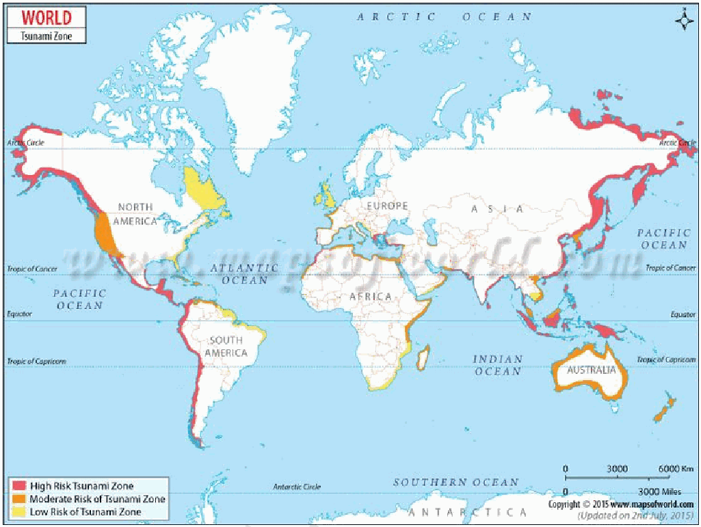

**Consequences of Tsunamis**

**Social Consequences**

1. **Mass casualties** - Over 2,30,000 deaths in 2004 Indian Ocean tsunami.

2. **Large-scale displacement** - Millions displaced in Indonesia and Sri Lanka (2004).

3. **Health crises** - Water-borne diseases in relief camps.

4. **Psychological trauma** - Long-term PTSD among survivors in Japan (2011).

**Economic Consequences**

5. **Infrastructure destruction** - Ports, roads, airports damaged. Eg- Severe infrastructure loss in Fukushima (2011).

6. **Loss of livelihoods** - Fisheries and tourism collapse.

7. **High reconstruction costs** - Japan’s 2011 losses estimated over $200 billion.

**Environmental Consequences**

8. **Coastal ecosystem damage** - Eg- Coral reef degradation in Andaman & Nicobar (2004).

9. **Soil salinization** - Agricultural lands turned infertile.

10. **Secondary disasters.** Eg- Fukushima nuclear accident (2011).

11. **Groundwater Contamination-** Saltwater and sewage penetrate freshwater aquifers While they cannot be prevented, **early warning systems, ecological buffers, and resilient coastal planning** can significantly reduce their human and economic toll.

---

1. Explanation_Drishti IAS:
Source Question: What are Tsunamis? How and where are they formed? What are their consequences? Explain with examples. (Answer in 150 words) 10

| **Approach:**  • **Introduction:** Introduce tsunamis with definition and defining term.  • **Body:** Explain the different causes of tsunamis (which form tsunamis) with relevant examples, and discuss its consequences.  • **Conclusion:** Conclude suitably. |
| --- |

### Introduction

Tsunamis are **large, powerful sea waves caused** by the sudden displacement of water, usually due to undersea earthquakes. Derived from the Japanese words *tsu* (harbour) and *nami* (wave), tsunamis pose significant threats to coastal ecosystems, infrastructure, and human lives, particularly in tectonically active regions.

### Body
**Formation of Tsunamis**

- **Undersea Earthquakes:** Sudden vertical displacement along subduction zones.

- E.g., 2004 Indian Ocean tsunami caused by a 9.1 magnitude quake near Sumatra.

- **Volcanic Eruptions:** Submarine or coastal volcanic activity displaces water.

- E.g., The Tonga Hunga-Hunga Ha'apai volcanic eruption in 2022, caused a global tsunami.

- **Landslides (Submarine or Coastal):** Collapse of land into the ocean.

- E.g., Lituya Bay tsunami, Alaska (1958).

- **Glacial Calving or Meteoritic Impact:** Rare, but large-scale ice collapses or cosmic impacts can displace water.

- Example: The **Chicxulub impact (66 million years ago)** is believed to have triggered tsunamis that contributed to the

**extinction of the dinosaurs.**

- **Underwater Nuclear Blast:** Nuclear explosions beneath the ocean’s surface can displace large volumes of water and cause significant tsunami waves.

**Consequences of Tsunamis**

- **Human Casualties:** Tsunamis can lead to massive loss of life due to the overwhelming force of the waves.

- Example: The *2004 Indian Ocean tsunami* claimed over 230,000 lives across several countries.

- **Economic Loss:** Tsunamis cause severe damage to infrastructure, homes, agriculture, and industries like fisheries.

- Example: The 2011 Tohoku tsunami in Japan resulted in loss of billions of dollars and human capital as well.

- **Environmental Impact:** Coastal habitats like mangroves, coral reefs, and marshlands can be destroyed, leading to long-term ecological damage.

- Saltwater intrusion into freshwater sources can also disrupt local ecosystems.

- **Health and Sanitation Crisis:** The destruction of infrastructure can lead to waterborne diseases, lack of medical care, and poor sanitation.

- Example: After the *2004 tsunami*, cholera outbreaks were reported in affected regions.

- The 2004 tsunami increased household **out-of-pocket health expenses by 35% in heavy damage areas in** the short run.

- **Psychological and Social Trauma:** Tsunami survivors often face long-term mental health issues, including post-traumatic stress disorder (PTSD).

- Loss of cultural landmarks and displacement of communities add to the psychological impact.

### Conclusion

Climate change and rising sea levels have increased vulnerability to tsunamis. Strengthening early warning systems (such as the INCOIS Tsunami Warning Centre), promoting coastal resilience, and enhancing community preparedness are crucial for mitigating their impact - aligning with SDG 13: Climate Action and SDG 11: Sustainable Cities and Communities.

---

1. Explanation_PWOnlyIAS:
Source Question: What are Tsunamis? How and where are they formed? What are their consequences? Explain with examples.

| **Core Demand of the Question**  • What are Tsunamis (Introduction)  • How Tsunamis are Formed  • Where Tsunamis are Formed  • Consequences of Tsunamis |
| --- |

### Introduction

Tsunamis are series of **large sea waves** generated by **sudden displacement of seawater** due to undersea earthquakes, volcanic eruptions, or landslides. They travel at high speeds across oceans and cause massive destruction upon reaching **shallow coastal areas**.

### Body

**How Tsunamis are Formed**
- **Undersea Earthquakes:** Subduction zone quakes cause **vertical seabed displacement**, pushing water upward. This sudden uplift generates powerful waves that evolve into tsunamis.

  - **Eg:** The ***2004 Indian Ocean tsunami** * from a 9.1 magnitude quake near Sumatra.

- **Volcanic Eruptions:** Submarine eruptions or the collapse of volcanic flanks displace huge water volumes.

  - **Eg:** 1883 Krakatoa eruption, Indonesia.

- **Landslides/Glacier Falls:** Coastal or submarine landslides push water upward, creating localized tsunamis.

  - **Eg:** 1958 Lituya Bay, Alaska:** , produced a 500 m wave.

**Where Tsunamis are Formed**
- **Pacific Ocean (Ring of Fire):** Most tsunamis originate here due to intense tectonic subduction zones (Japan, Chile, Alaska).
- **Indian Ocean Margins:** Seismic zones like the Sunda Trench near Sumatra and the Andaman–Nicobar region.
- **Mediterranean and Atlantic:** Smaller but destructive tsunamis from submarine quakes and landslides (Lisbon 1755 earthquake).
- **Polar Regions:** Glacial collapses in Greenland and Alaska sometimes trigger local tsunamis.

 **Fig: Tsunami Zones**

**Consequences of Tsunamis**
- **Human Losses and Displacement:** Large coastal populations face massive casualties and forced migration.

  - **Eg:** The 2004 Indian Ocean tsunami killed over **2.3 lakh people**.

- **Economic and Infrastructure Damage:** Ports, fisheries, industries, and tourism infrastructure collapse under inundation.

  - **Eg:** The **2011 Japan tsunami** caused **$235 billion** in damages.

- **Environmental Degradation:** Saltwater intrusion into groundwater and farmland, along with mangrove destruction, disrupt ecosystems.

  - **Eg:** In Tamil Nadu (2004), extensive paddy fields turned saline and unproductive.

- **Public Health and Social Crisis:** Spread of diseases, scarcity of drinking water, and psychological trauma prolong recovery.

  - **Eg:** Cholera and diarrheal outbreaks occurred in Sri Lanka and Indonesia post-2004.

### Conclusion

Tsunamis highlight the intersection of natural hazards and human settlements. Investing in resilient infrastructure and regional cooperation ensures both safety and sustainable development.

---

1. Explanation_Superkalam:
Source Question: What are Tsunamis? How and where are they formed? What are their consequences? Explain with examples.

The** 2004 Indian Ocean Tsunami **highlighted the devastating power of these ocean waves, killing over 230,000 people across 14 countries and emphasizing the urgent need for global tsunami preparedness.

## What are Tsunamis?** Tsunamis **are series of ocean waves generated by sudden displacement of large water volumes, traveling at speeds of** 500-800 km/hr **in deep waters. Unlike regular waves caused by wind, tsunamis involve entire water columns from surface to seabed.

## How and Where are Tsunamis Formed?

Tsunami formation and coastal inundation process

### Causes of Tsunamis

|** Cause **|** Process **|** Examples **|
| --- | --- | --- |
|** Underwater Earthquakes **| Seismic activity displaces seafloor vertically | 2004 Indian Ocean (Magnitude 9.1), 2011 Japan (Magnitude 9.0) |
|** Underwater Volcanic Eruptions **| Underwater explosions displace water masses | 2022 Hunga Tonga-Hunga Ha'apai |
|** Submarine Landslides **| Underwater slope failures create water displacement | 1998 Papua New Guinea |
|** Meteorite Impacts **| Large objects hitting ocean surfaces | Chicxulub crater (historical) |

### Mechanism of a Tsunami

-** Seafloor Disturbance: **A strong undersea earthquake, volcanic eruption, or landslide causes sudden vertical displacement of the seabed.
-** Water Column Displacement: **This movement pushes or pulls a massive volume of water above, disturbing the ocean’s surface.
-** Wave Propagation: **Energy travels outward in the form of long, fast-moving waves (up to 800 km/h) across the deep ocean with low height.
-** Shoaling and Coastal Impact: **As waves enter shallow coastal waters, they slow down and grow in height dramatically, resulting in giant, destructive waves that flood coastal areas.

### Formation Locations

-** Pacific Ring of Fire**: 80% of global tsunamis occur here
-** Subduction Zones**:** Andaman**,** Makran**, and** Java trenches **-** Volcanic Islands**:** Indonesia**,** Philippines**,** Japan **-** Transform Fault Lines**:** California coast**,** Mediterranean Sea **-** Continental Margins**: Areas with steep underwater topography

## Consequences of Tsunamis

### Immediate Impacts

-** Human Casualties**:** 2004 tsunami **killed 230,000+ people across Indian Ocean
-** Infrastructure Destruction**:** 2011 Japan tsunami **caused** $235 billion **in damages
-** Coastal Inundation**: Waves reaching** 40 meters height **in Japan (2011)
-** Nuclear Disasters**:** Fukushima Daiichi **meltdown triggered by tsunami
-** Port Disruption**: Major shipping routes and fishing industries paralyzed

### Long-term Consequences

-** Environmental Degradation**:** Saltwater intrusion **affecting agriculture for years
-** Economic Disruption**: Tourism losses in** Thailand **and** Sri Lanka **post-2004
-** Social Displacement**:** 160,000 people **still displaced in Japan (2011)
-** Groundwater Contamination**: Coastal aquifers affected by saltwater
-** Ecosystem Damage**: Coral reefs and mangrove destruction** IOWave23 **exercises and** Indian Ocean Tsunami Warning System **demonstrate international cooperation in building resilient coastal communities through early warning systems and disaster preparedness.

---

---

Q96. What is a twister? Why are the majority of twisters observed in areas around the Gulf of Mexico?
[Year: 2024] [Group: UPSC CSE] [Exam: Mains] [Stage: Mains] [Paper: Mains - GS 1]
[Subject: GEOGRAPHY]
[Section Group: Physical Geography & Geophysical Phenomena]
[Microtopic: Important Geophysical phenomena such as earthquakes, Tsunami, Volcanic activity, cyclone etc.,]
[Subtopic: Twisters]
[Macrotag: Descriptive]
[Microtag: What is, Why]
##### Subtopic: Volcanic activity

1. Explanation_Civilsdaily:
Source Question: What is a twister? Why are the majority of twisters observed in areas around the Gulf of Mexico? [Year: 2024] [Marks: 15]

A **twister** is the common term for a **tornado** - a **narrow, violently rotating column of air that extends from the base of a thunderstorm to the ground.**

**Key Features of a Twister**

1. **Funnel-shaped cloud** - Visible condensation funnel extending downward.

2. **Very high wind speeds** - Can exceed **300 km/h (EF5 category).**

3. **Short duration** - Typically lasts minutes but causes intense damage.

4. **Narrow path of destruction** - Damage track often a few hundred meters wide.

5. **Associated with supercell thunderstorms**

6. **Low pressure core** - Central pressure drop causes debris uplift.

7. **Occurs mostly in mid-latitudes** - Especially continental interiors.

**Formation Process of a Twister**

1. **Warm, moist air near the surface** rises rapidly.

2. **Cold, dry air above** descends below.

3. **Wind shear develops** - Change in wind speed and direction with height.

4. **Horizontal rotation forms** in the lower atmosphere.

5. **Updraft tilts rotation vertically,** forming a mesocyclone.

6. **Supercell thunderstorm develops.**

7. **A funnel cloud forms and extends to ground,** becoming a tornado.

**Reasons for Majority of Twisters Around the Gulf of Mexico**

1. **Continuous supply of warm, moist air** - Gulf waters average **25-30°C.**

2. **Collision of contrasting air masses** - Warm Gulf air meets cold Canadian air over central U.S.

3. **No Latitudinal Barriers-** Unlike Europe's Alps, North America has no east-west mountain ranges to block the collision of these contrasting air masses.

4. **Low-Level Jet Streams** from the Gulf provide the necessary wind shear to initiate rotation near the ground.

5. **Dryline effect - Dry air from Rockies** creates a sharp moisture gradient leading to storm development.

6. The **Great Plains and Mississippi Valley** offer a smooth "runway" that prevents the disruption of rotating storm structures.

7. **Proximity to Tornado Alley** - Central U.S. records **~75% of world’s tornadoes.**

8. The high frequency of thunderstorms in the gulf region creates tornados. **83% of Gulf hurricanes** since 1950 have produced at least one tornado.

As climate variability enhances the frequency and intensity of tornados, advanced radar detection and robust disaster preparedness is needed for disaster risk reduction.

---

1. Explanation_Drishti IAS:
Source Question: What is a twister? Why are the majority of twisters observed in areas around the Gulf of Mexico? (Answer in 250 words)

### Approach

- Introduce the answer by defining Twisters.

- Mention the reasons of frequent occurrence of twister in Gulf of Mexico

- Conclude by summarizing key points.

### Introduction

A twister (tornadoes) is a violent windstorm featuring a twisting, **funnel-shaped cloud.** It consists of a rotating column of air that connects the Earth's surface to a **cumulonimbus cloud,** or occasionally a cumulus cloud. They can occur globally but are most common in the Gulf of Mexico region.

### Body:

**Factors that lead to frequent occurrence of Twisters in Gulf of Mexico:**

- **Warm, Moist Air:** The Gulf of Mexico supplies warm, moist air that rises, creating conditions for thunderstorms.

- **Cold, Dry Air:** Cold, dry air from the Rocky Mountains or Canada moves south, clashing with warm, moist air and causing atmospheric instability.

- **Wind Shear:** Variations in wind speed and direction at different altitudes create wind shear, leading to a horizontal spinning effect essential for tornado formation.

- **Geographical Features:** The flat terrain of the Great Plains and Mississippi River Valley heats quickly, providing ideal conditions for tornadoes.

- **Tropical Storms and Hurricanes:** The Gulf is prone to tropical storms and hurricanes that can spawn tornadoes upon landfall.

### Conclusion

Thus twisters, or tornadoes, are destructive windstorms formed by rotating columns of air. The Gulf of Mexico region experiences frequent tornadoes due to the collision of warm, moist air with cold, dry air, along with favorable geography and seasonal patterns.

---

1. Explanation_PWOnlyIAS:
Source Question: What is a twister? Why are the majority of twisters observed in areas around the Gulf of Mexico?

| **Core Demand of the Question** ● Define Twister and its characteristics. ● Highlight the reasons for high twister frequency around the Gulf of Mexico. |
| --- |

### Answer

A **twister,** commonly known as a **tornado**, is a **rapidly rotating column of air** that extends from a thunderstorm to the ground, characterised by its **destructive potential** and associated severe weather conditions. For instance, the recent **tornado outbreak** in **Texas** in **2023** caused extensive damage in the affected region.

**Characteristics of Twisters:**
- **Funnel Shape:** Twisters typically form a **visible funnel cloud** that extends from a thunderstorm base to the ground.
  - **For example:** The **Mayfield Tornado** in **Kentucky (2021),** which produced a prominent funnel that caused extensive damage across multiple counties.
- **Rapid Rotation:** Twisters are characterised by extremely fast rotation, with wind speeds that can range from **40 miles per hour** in weak twisters to over **300 miles per hour** in the most severe cases.
  - **For instance:** The **EF5** rated **Moore Tornado** in **Oklahoma** in **2013** demonstrated such intense rotation, resulting in catastrophic destruction.
- **Varied Intensity:** The intensity of a twister is classified using the **Enhanced Fujita (EF)scale,** which ranges from EF0 (weak) to EF5 (extremely strong).
  - **For instance:** The **EF3 Joplin Tornado** in **Missouri** in **2011** caused extensive damage and loss of life, emphasising the destructive power of mid-range intensity twisters.
- **Short Duration:** Most twisters are short-lived, lasting only a few minutes to an hour.
  - **For example:** The **El Reno Tornado** in **Oklahoma** in **2013,** despite its brief existence, was one of the widest ever recorded and caused significant destruction in a short time frame.
- **Formation Conditions:** Twisters form under specific atmospheric conditions, particularly when warm, moist air from the ground meets cooler, drier air aloft, coupled with strong wind shear.
  - **For example:** The **Tuscaloosa–Birmingham twister** in **Alabama** in **2011** formed under ideal conditions, leading to severe impacts.
- **Path of Destruction:** Twisters can leave a path of destruction that varies in width and length.
  - **For example:** The twister that struck **Rolling Fork,Mississippi (2023)** carved a path of devastation, showcasing how localised yet impactful these storms can be on communities. ****

**Reasons for High Twister Frequency Around the Gulf of Mexico:**
- **Warm, Moist Air:** The Gulf of Mexico supplies warm, moist air that interacts with cooler northern air, creating **unstable conditions** ideal for thunderstorm and twister formation.
- **Seasonal Storm Patterns:** The Gulf Coast sees **distinct seasonal storm patterns** in spring and early summer, marked by the clash of warm and cold air masses, which leads to increased twister activity.
- **Geographic Features:** The flat terrain and proximity to water bodies along the Gulf Coast allow easy movement of air masses **,** facilitating the development of severe thunderstorms that can produce twisters.
- **Wind Shear:** The region often experiences significant wind shear, which is crucial for the **rotation** necessary for twister formation.
- **Thunderstorm Frequency:** The **Gulf Coast** experiences more frequent **severe thunderstorms** due to moisture from the Gulf and favourable atmospheric conditions, increasing the likelihood of twisters.

Reducing the devastating impact of twisters requires effective **early warning** systems, **public awareness,** and coordinated **disaster response** plans. Advanced **meteorological tools** and timely alerts save lives, while education and preparedness empower communities. A robust **disaster management framework** ensures both immediate safety and swift recovery following such events.

---

1. Explanation_Superkalam:
Source Question: What is a twister? Why are the majority of twisters observed in areas around the Gulf of Mexico?

** Subject: **World Geography

A** twister**, also known as a tornado, is a violently rotating column of air extending from a thunderstorm cloud to the ground, characterized by its funnel-shaped appearance and devastating potential.

These natural phenomena represent one of nature's most intense and destructive atmospheric disturbances, capable of generating wind speeds exceeding** 190 mph **as recorded in** Diaz, Arkansas **in March 2025.

## Formation of Twisters

Tornado Alley Air Mass Interactions

## Characteristics of Twisters

-** Funnel Formation**: Develop from supercell thunderstorms with a rotating updraft called a mesocyclone.
-** Wind Speeds**: Can range from mild to extremely violent, causing catastrophic damage to infrastructure and landscapes.
-** Size Variation**: Range from narrow ropes to massive wedges, sometimes over a mile wide.
-** Duration**: Usually last for a few minutes but can persist longer in favorable conditions.

## Reasons for High Frequency in Gulf of Mexico Region

-** Atmospheric Conditions**:

 - The region serves as a meeting point between warm, moist air masses from the Gulf and cool, dry continental air from the north.
 - This interaction creates ideal conditions for severe thunderstorm development.

-** Geographic Factors**:

 -** Proximity to Tornado Alley**: The Gulf region's location near the traditional** Tornado Alley **enhances tornado formation potential.
 - The flat terrain allows unimpeded movement of air masses.

-** Meteorological Elements**:

 -** Sea Breezes**: Enhanced thunderstorm activity due to sea breeze convergence.
 -** Seasonal Timing**: Earlier spring tornado season, as evidenced by** 43 tornadoes **in the northern Gulf Coast region during 2024.
 - High moisture content from the Gulf waters provides fuel for storm development.

-** Climate Patterns**:

 - The region experiences consistent weather patterns conducive to tornado formation.
 - Recent data shows** 350 preliminary tornado reports **in central Gulf Coast states, demonstrating the area's vulnerability.

The combination of these geographical and meteorological factors makes the Gulf of Mexico region a** natural tornado laboratory**, consistently producing conditions favorable for twister formation throughout the year, particularly during spring months.

---

1. Explanation_Unacademy:
Source Question: Q16.What is a twister? Why are the majority of twisters observed in areas around the Gulf of Mexico? (250 Words 15 Marks)

## **Introduction** - A twister, commonly known as a tornado, is a rotating column of air that descends from a thunderstorm to the ground.

- The twisters are characterised by their funnelshaped cloud and extremely high wind speeds, which can cause significant destruction in their path.

## **Body** ## **How Tornadoes Form** - Tornadoes form when a thunderstorm has a particular combination of winds.

- Air rising in a thunderstorm can begin to spin when it is affected by winds blowing it in different directions.

- It starts to rise and is pushed to the side by wind.

- Winds moving in different speeds and directions at different altitudes cause the rising air to start spinning.

- The key ingredient for tornado formation is wind shear, where winds at different altitudes blow in different directions or speeds, causing a rotation in the lower atmosphere.

- Air that spins as it rises is typical in a supercell, the strongest type of thunderstorm, but not all spinning air creates a tornado.

- Intense heating of the ground causes strong convection current.

- The upthrust of warm and moist tropical and subtropicalairmassbycoldpolarairmasspresents an ideal condition for formation of tornadoes. **Diagram** **Why Are the Majority of Twisters Observed Around** **the Gulf of Mexico?** ## **y Warm, Moist Air from the Gulf** - **TheGulfofMexicoprovidesasteadysupplyof** warm, moist air, which is a critical ingredient for the formation of thunderstorms and tornadoes.

 - This warm air rises, creating instability in the atmosphere.

- : **Cold, Dry Air from the North** - The region is also affected by cold, dry air descending from the northern United States and Canada.

 - When this cold air meets the warm, moist air from the Gulf, it creates a sharp temperature contrast, which can lead to the development of strong thunderstorms capable of producing tornadoes.

## **y Wind Shear from the Jet Stream** - The **jet stream,** a high-altitude current of fast-moving air, often passes over the central United States, particularly the area around the Gulf of Mexico.

 - This creates significant wind shear, a critical factor for tornado formation.

## **y Flat Terrain** - The relatively flat topography of areas surrounding the Gulf, including the **Great** **Plains** and parts of the **Mississippi River** , allows storms to develop and intensify **Valley** without interference from mountainous terrain, which can disrupt storm systems.

## **Conclusion** - Tornadoes, particularly those occurring in regions around the Gulf of Mexico, have significant social, economic, and environmental impacts.

- They can cause widespread devastation, including the destruction of homes, infrastructure, and agricultural fields.

- The high winds and flying debris pose severe risks to life, leading to injuries and fatalities.

- Communities often face long-term challenges due to displacement, economic loss, and mental trauma following a tornado strike.

---

---

Q97. Mention the global occurrence of volcanic eruptions in 2021 and their impact on regional environment.
[Year: 2021] [Group: UPSC CSE] [Exam: Mains] [Stage: Mains] [Paper: Mains - GS 1]
[Subject: GEOGRAPHY]
[Section Group: Physical Geography & Geophysical Phenomena]
[Microtopic: Important Geophysical phenomena such as earthquakes, Tsunami, Volcanic activity, cyclone etc.,]
[Subtopic: Volcanic activity]
[Macrotag: Descriptive]
[Microtag: Mention]

1. Explanation_Civilsdaily:
Source Question: Mention the global occurrence of volcanic eruptions in 2021 and their impact on the regional environment. [Year: 2021] [Marks: 10]

Volcanic eruptions are major **endogenic geomorphic processes** associated with plate boundaries and hotspots.

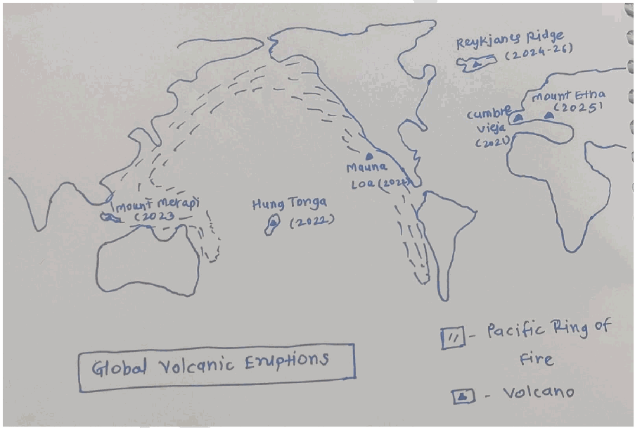

**Impact on Regional Environment**

**Positive Impacts**

1. **Cooling effect** as an eruption blocks solar radiation.

2. **Soil fertility enhancement - Volcanic ash is rich in Potassium, Phosphorus, and Iron.** Eg- Slopes of Mt. Etna supports vineyards and orchards.

3. **Creation of new landforms** - Formation of lava plateaus, cones, and new islands. Eg- New lava delta at La Palma (Spain).

4. **Geothermal energy potential** - Eg- Iceland.

5. **Nutrient Cycling in Oceans-** Volcanic iron fertilization can trigger phytoplankton blooms.

6. **Mineral resource concentration** - Eg- Copper deposits in volcanic belts of the Andes.

7. **Tourism development** - Volcanic landscapes attract visitors. Eg- Fagradalsfjall eruption

8. **Scientific research opportunities** - Understanding Earth’s interior and climate.

9. **Formation of fertile volcanic islands** - Eg- Indonesian islands.

**Negative Impacts**

1. **Air Quality Degradation-** High emissions of **Sulfur Dioxide ($SO_2$)** create volcanic smog (vog).

2. **Water Contamination-** Ash fallout introduces fluorine and heavy metals into reservoirs.

3. **Marine Ecosystem Shock-** Lava entering the sea causes "Laze" (Lava Haze) and kills coral/fish through thermal shock.

4. **Loss of life and displacement due to** sudden eruptions and lava flows.

5. **Destruction of infrastructure and settlements** Eg- Houses and roads buried in La Palma.

6. **Damage to agriculture and forests** - Burial of crops and vegetation.

7. **Disruption of air and sea transport** - Ash clouds affect aviation.

8. **Tsunamis** - Submarine eruptions trigger waves. Eg- Hunga Tonga eruption, 2022.

Thus, volcanism remains a **destructive as well as constructive force shaping the Earth’s surface.**

---

1. Explanation_Drishti IAS:
Source Question: Mention the global occurrence of volcanic eruptions in 2021 and their impact on regional environment.

A volcano is an opening or rupture in the earth’s surface that allows magma (hot liquid and semi-liquid rock), volcanic ash and gases to escape. The volcanic eruption could have implications for the local and regional environment like earthquake, landslides, lahars (mudflows), ash and thunderstorms. 2021 witnessed several volcanic eruptions viz. Mount Sinabung (Indonesia); Klyuchevskoy (Kamchatka, Russia); Fournaise (Réunion); Mount Etna (Italy); and Erebus (Antarctica).

**Impact of volcanic eruption on the environment:**

- Volcanic eruptions are responsible for forming new rock on the Earth’s surface.

- The gases and dust particles thrown into the atmosphere during volcanic eruptions have influences on climate.

- Volcanoes have also caused global warming over millions of years during times in Earth’s history when extreme amounts of volcanism occurred, releasing greenhouse gases into the atmosphere.

- Even though volcanoes are in specific places on Earth, their effects can be more widely distributed as gases, dust, and ash get into the atmosphere

- Volcanic eruptions are generally preceded by increased seismic activity.

Most of the active volcanoes on earth occur on the Circum-Pacific Belt, also referred to as the Ring of Fire. Volcanoes are a natural exogenic phenomenon that cannot be avoided, but developing disaster risk resilience will surely be a step in the right direction.

---

1. Explanation_PWOnlyIAS:
Source Question: Mention the global Occurrence of volcanic eruptions in 2021 and their impact on the regional environment.

**Answer:**

| **Approach:** **Introduction**  • Briefly defining What is Volcano and their occurrence at global level. **Body**  • Some of the examples of volcanic eruptions.  • Discuss the Impact of volcanic eruption on the environment. **Conclusion**  • Mention significant importance of volcanic eruption. |
| --- |

### Introduction

Volcanic eruptions are a natural phenomenon that can have significant impacts on the environment and society. In 2021, several volcanic eruptions occurred around the world, which had varying impacts on the regional environment.

 **Body:** | Mount Sinabung Volcano | Indonesia |
| --- | --- |
| Klyuchevskoy volcano | Russia far eastern Kamchatka peninsula |
| Fournaise volcano | Reunion |
| Mount Etna | Italy |
| Erebus | Antarctica | **Significant impacts of Volcanic eruptions**:

- **Air Quality:** Volcanic eruptions release fine particles into the air, such as ash and aerosols, which can lead to reduced visibility, crop damage, and other environmental impacts.
- **Climate:** The gasses and particles released by eruptions can block sunlight, causing cooling of the Earth’s surface. This can lead to changes in weather patterns, including changes in rainfall and temperature. Volcanic eruptions contribute to **global climate change** by releasing large amounts of greenhouse gasses into the atmosphere.
- **Ecosystems:** Eruptions can cause physical damage to ecosystems, such as burying plants and animals under ash and lava flows. They can also cause toxic gasses to be released into the environment, which can kill plants and animals. Volcanic eruptions can **change the soil chemistry**, making it difficult for plants to grow and affecting aquatic life also.
- **Human Health:** The gasses and particles released by eruptions can cause **respiratory problems**, such as asthma and bronchitis. They can also cause eye irritation and skin irritation.

### Conclusion

The occurrence of volcanic eruptions in 2021 had varying impacts that can be both short-term and long-term and can vary depending on the size and location of the eruption on the environment and society, there is a need for continued monitoring and preparedness for volcanic eruptions. While volcanic eruptions can have devastating impacts, they can also provide benefits, such as creating new land and geothermal energy resources.

---

1. Explanation_Rau IAS:
Source Question: Mention the global occurrence of volcanic eruptions in 2021 and their impact on regional environment. (10 Marks, 150 Words)

### Introduction

The year 2021 witnessed several volcanic eruptions around the world that disrupted lives, polluted the environment and altered landscapes. Understanding their regional impacts is vital to disaster risk reduction and sustainable development.

### Body

**Important volcanic activities of 2021 are as follows:**

- Iceland MOR emitted fresh lava in 2021.

- Mount Semeru, a volcano in the East Java province of the Indonesian island of Java.

- La Soufrière, a stratovolcano on the Caribbean island, had an explosive eruption.

- Taal Volcano in Batangas, Philippines

- Hunga Tonga-Hunga Haʻapai: a submarine volcano in the South Pacific

**Impacts on regional environment:**

- Advancing Lava (hot and molten) destroyed the natural ecosystem.

- Volcanism is also associated with earthquakes which result in mass movements.

- Drastic reduction in air quality due to release of ash, polluting gases (Carbon, Nitrogen and Sulfur Oxides)

### Conclusion

However some of the effects of volcanism are also beneficial. For example release of sulfur aerosols induces cooling, creation of new landforms, creation of mineral resources and opportunities to generate Geo-thermal energy.

---

---

1. Explanation_Superkalam:
Source Question: Mention the global occurrence of volcanic eruptions in 2021 and their impact on regional environment

Recent volcanic activity demonstrates Earth's dynamic geological processes and their far-reaching environmental consequences. The year 2021 marked a particularly active period for global volcanism with significant regional impacts.

2021 World Map of Major Volcanic Eruptions

## Major Volcanic Events of 2021

-** La Palma, Spain**: Cumbre Vieja volcano erupted for 85 days (September-December), achieving** VEI-3 **intensity and becoming the longest recorded eruption on the island
-** La Soufrière, St. Vincent**: Major explosive eruption in April with** 32 eruptive events**, forcing mass evacuations across the Caribbean island
-** Mount Etna, Italy**: Multiple eruptions throughout 2021, with** spectacular lava fountains **reaching heights of 1,500 meters
-** Fagradalsfjall, Iceland**: Effusive eruption lasting six months, creating new lava fields and attracting global scientific attention
-** Mount Sinabung, Indonesia**: Continued pyroclastic flows and ash emissions affecting** North Sumatra **region

## Atmospheric and Air Quality Impacts

| Impact Type | La Palma | La Soufrière | Global Effect |
| --- | --- | --- | --- |
| SO2 Emissions | 1.84 Tg released | Widespread dispersion | Tropospheric pollution |
| Ash Dispersal | Regional spread | Caribbean-wide | Aviation disruptions |
| PM Concentrations | Elevated PM10/PM2.5 | Health hazards | Air quality degradation |

## Regional Environmental Consequences

-** Ecosystem Disruption**: Lava flows destroyed** 370 hectares **of banana plantations in La Palma, while ash deposits affected agricultural productivity across affected regions
-** Water Contamination**: Volcanic ash contaminated freshwater sources in St. Vincent, requiring emergency water supplies for** 110,000 residents **-** Marine Environment**: Lava-seawater interaction in La Palma created new land formations while releasing toxic gases affecting marine life
-** Climate Effects**: Enhanced aerosol concentrations contributed to localized cooling effects and altered precipitation patterns
-** Biodiversity Impact**: Habitat destruction and species displacement occurred in volcanic zones, particularly affecting endemic flora in Canary Islands

The 2021 volcanic events highlighted the interconnected nature of geological processes and environmental systems. Advanced** satellite monitoring systems **like TROPOMI and VIIRS enabled real-time tracking of emissions, supporting disaster response and environmental protection efforts globally.

---

1. Explanation_Unacademy:
Source Question: Q7. Mention the global occurrence of volcanic eruptions in 2021 and their impact on regional environment. (10 Marks, 150 words) Tags: Volcanoes

## **Decoding the Question** - **Introduction: Give a brief introduction of** **volcanic eruptions.** ## **y Body** - **o Briefly discuss global volcanic eruptions** **in 2021 and their impact on the regional** **environment.** - **Conclude: Conclude suitably.** **Answer:** An **eruption or rupture** in the earth’s surface known as a volcano allows gases, volcanic ash, and hot, liquid, or semi-liquid rock to escape. An eruption occurs when lava and gas are released from a volcano, frequently in an explosive manner. **The most dangerous sort of** **eruption** is known as a **“glowing avalanche,”** which happens when recently erupted lava rolls down a volcano’s flanks. **Global Volcanic Eruption in 2021:** As may be seen from the instances of the following volcanoes in 2021, volcanic eruptions have a huge impactonthelocalenvironment.Someoftheeruptions of 2021 are mentioned below.

- **Kilauea, United States.** - **La Palma, Spain.** - **Ulawun, Papua New Guinea.** - **Krakatau and Merapi, Indonesia.** - **Bezymianny, Russia.** - **Taal volcano, Philippines.** **Impact on Regional Environment** - Volcanic ash plumes can cover wide swaths of the sky, **obstructing visibility.** - It is well known that the **volcanic ashes increase** **the soil fertility** in the area.

- Volcanic ash creates **a localised drop in** **temperature** by reflecting incoming solar light. For instance, **Mt. Krakatau started a mini-ice age.** - Volcanic ash can accumulate **carbon dioxide and** **fluorine gas,** which can contaminate the local environment and make it difficult for people and animals to breathe.

- In the area, earthquakes are known to be triggered by volcanic eruptions.

 **Fig: Eruption of Cumbre Volcanic Ridge, La Palma** **Island, Spain** Volcanism is a result of nature. The Pacific Rim of Fire region is home to the majority of active volcanoes. Volcanism cannot be prevented, but their harmful consequences can be reduced to least with the right strategies and approach.

---
