# Paper: GS-IV

## Subject: ETHICS, INTEGRITY & APTITUDE

### Section Group: Ethics & Human Values

#### Microtopic: Ethics and Human Interface: Essence, Determinants, Consequences, and Dimensions of Ethics

##### Subtopic: Essence of Ethics
[Subject: ETHICS, INTEGRITY & APTITUDE]
[Section Group: Ethics & Human Values]
[Microtopic: Ethics and Human Interface: Essence, Determinants, Consequences, and Dimensions of Ethics]
[Subtopic: Essence of Ethics]

###### Card 1: Essence of Ethics (Theme 1)
*   **Quote:**
    > “Ethics is doing the right thing, even when no one is watching.”

*   **Introduction:**
*   **Ethics is the architecture of inner conviction** a silent force that transforms action into duty by aligning it with universal values like **justice, compassion, integrity, and self-restraint**, beyond external compulsion or law.

*   **Examples:**
*   **IAS Armstrong Pame** built a 100-km road via crowdfunding, driven solely by **moral duty**.
*   **ISRO scientists** work relentlessly, often beyond the call of duty, reflecting **silent ethical commitment**.
*   Sanitation workers during COVID-19 served amid personal risk without complaint or recognition.
w
*   **Conclusion:**
*   Ethics humanizes authority and anchors public behavior in moral legitimacy, ensuring that decisions are not just lawful but also righteous.

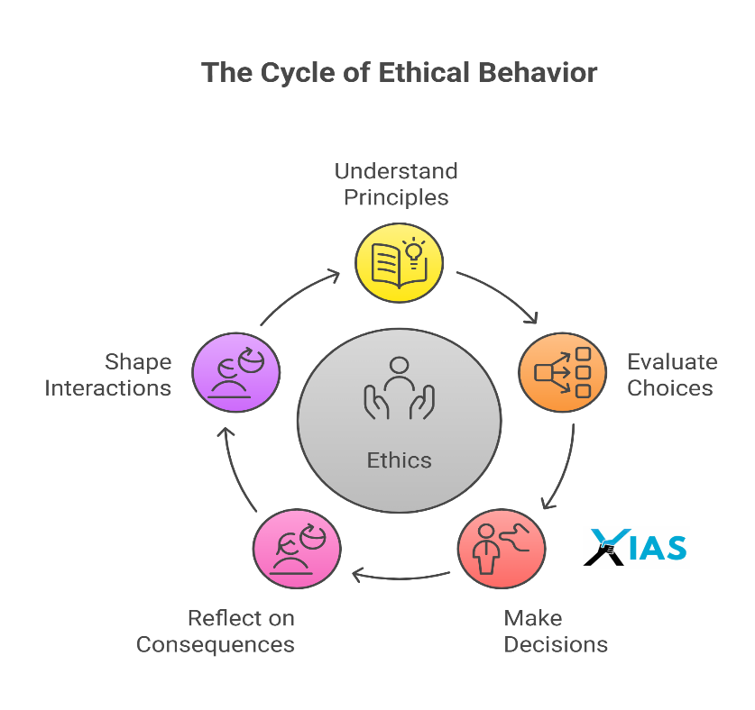

---

##### Subtopic: Determinants of Ethics
[Subject: ETHICS, INTEGRITY & APTITUDE]
[Section Group: Ethics & Human Values]
[Microtopic: Ethics and Human Interface: Essence, Determinants, Consequences, and Dimensions of Ethics]
[Subtopic: Determinants of Ethics]

###### Card 1: Determinants of Ethics (Theme 1)
*   **Quote:**
    > “A life of integrity is the most fundamental source of personal worth.” – A.P.J. Abdul Kalam

*   **Introduction:**
*   **Determinants of ethics** are the inner and external factors—**intentions, motives, consequences, culture, upbringing,** **and reason**—that shape the **moral worth of human action**, especially in ethically conflicting situations.

*   **Examples:**
*   **Lal Bahadur Shastri’s resignation** after a train mishap showed **motive-led moral responsibility**.
*   **Swachh Bharat Abhiyan** was launched with the ethical **intent to restore dignity** to sanitation work.
*   S. Manjunath, IOCL officer, stood against corruption and sacrificed his life for integrity.

*   **Conclusion:**
*   **Awareness of ethical determinants** enables morally informed choices that uphold both **personal integrity** and **public interest**.

###### Card 2: Moral Relativism vs Universalism (Theme 1)
*   **Quote:**
    > “Let us pick up our books and pens; they are our most powerful weapons.” – Malala Yousafzai

*   **Introduction:**
*   **Moral relativism acknowledges the diversity of ethical norms**, while **moral universalism upholds timeless values** like human dignity, justice, and equality as applicable across all cultures and contexts.

*   **Examples:**
*   **Abolition of Sati** reflected **universal human rights over cultural practice**.
*   **India’s stand on gender rights at the UN** affirms **ethical universalism**.
*   **Triple Talaq verdict** prioritized **universal gender justice over traditional custom**.

*   **Conclusion:**
*   Ethical balance lies in respecting culture while ensuring universal moral principles are never compromised in the name of tradition.

---

##### Subtopic: Consequences of Ethics
[Subject: ETHICS, INTEGRITY & APTITUDE]
[Section Group: Ethics & Human Values]
[Microtopic: Ethics and Human Interface: Essence, Determinants, Consequences, and Dimensions of Ethics]
[Subtopic: Consequences of Ethics]

###### Card 1: Consequences of Ethics in Human Actions (Theme 1)
*   **Quote:**
    > “Ethics and equity and the principles of justice do not change with the calendar.” – Dr. B.R. Ambedkar

*   **Introduction:**
*   **Ethical actions produce not only immediate outcomes but also long-term societal ripples**—strengthening **trust,** **institutions, and justice**, or conversely, eroding them if ethical principles are compromised.

*   **Examples:**
*   **Durga Shakti Nagpal** upheld the law against illegal mining despite **political threats**.
*   India’s Vaccine Maitri initiative earned global goodwill through value-driven diplomacy.
*   **SEBI’s regulatory actions** enhanced **ethical practices in financial markets**.

*   **Conclusion:**
    *   The **moral weight of action** is revealed in its **long-term impact**—building **trust, justice**, and **sustainable legitimacy**. **

---

##### Subtopic: Normative Ethics (Deontology vs Teleology)
[Subject: ETHICS, INTEGRITY & APTITUDE]
[Section Group: Ethics & Human Values]
[Microtopic: Ethics and Human Interface: Essence, Determinants, Consequences, and Dimensions of Ethics]
[Subtopic: Normative Ethics (Deontology vs Teleology)]

###### Card 1: Dimensions of Ethics (Theme 1)
*   **Quote:**
    > “Ethics is nothing but a sense of responsibility that extends beyond oneself.” – S. Radhakrishnan

*   **Introduction:**
*   **Ethics operates across personal, interpersonal, societal, professional, and global domains**—each demanding consistent application of values, collectively shaping one’s **moral reasoning and conduct** in diverse situations.

*   **Examples:**
*   **Irom Sharmila’s fast** reflected **personal ethics** against perceived state violence.
*   **President Rajendra Prasad’s neutrality** in office demonstrated **institutional ethics**.
*   **India’s global climate stance** reflects **ethical responsibility at the international level**.

*   **Conclusion:**
*   **Ethical maturity lies in harmonizing these dimensions**, ensuring that personal virtue and social duty coexist meaningfully.

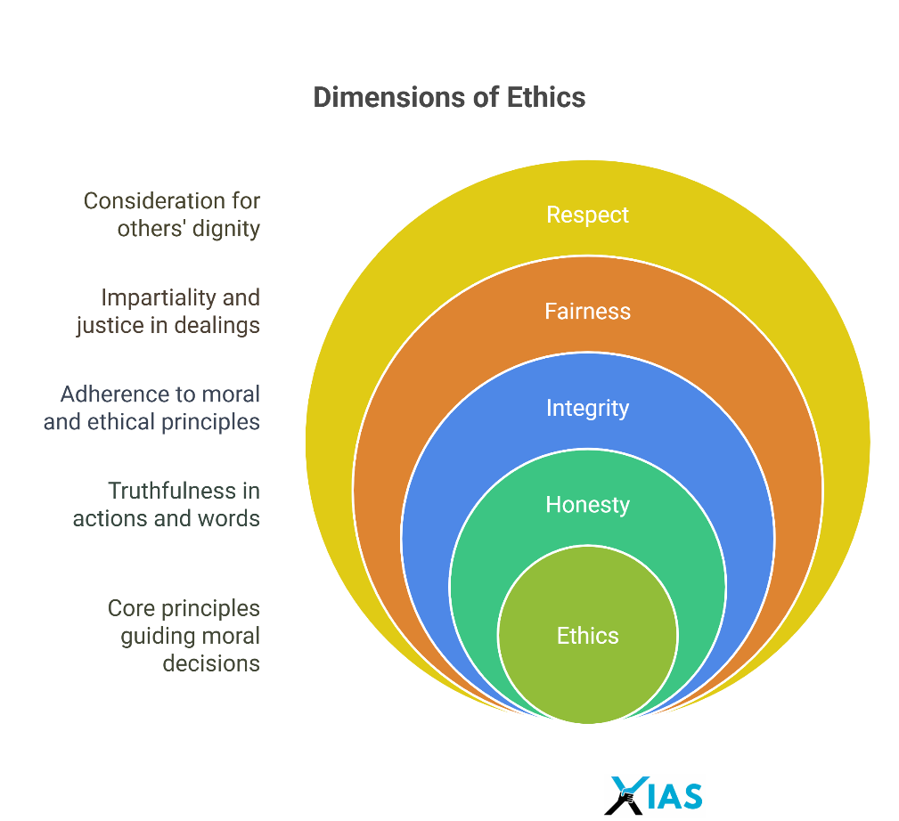

---

##### Subtopic: Ethics in Private and Public sphere
[Subject: ETHICS, INTEGRITY & APTITUDE]
[Section Group: Ethics & Human Values]
[Microtopic: Ethics and Human Interface: Essence, Determinants, Consequences, and Dimensions of Ethics]
[Subtopic: Ethics in Private and Public sphere]

###### Card 1: Ethics in Private Relationships (Theme 1)
*   **Quote:**
    > “Values must be practiced first in the home, then in society.” – Dr. A.P.J. Abdul Kalam

*   **Introduction:**
*   **Private relationships are the training ground for moral values** like **trust, empathy, loyalty, and responsibility**. These values later reflect in a person’s public conduct and character.

*   **Examples:**
*   **Gandhi’s confession to his father** demonstrated **deep-rooted honesty and guilt** in personal relationships.
*   **Sonu Sood’s humanitarian work** was underpinned by **familial values and upbringing**.
*   **PM Modi’s devotion to his mother** highlights **humility and rooted ethics**.

*   **Conclusion:**
*   **Private morality forms the core of public ethics**—a strong personal value system strengthens larger social and institutional ethics. **

###### Card 2: Ethics in Public Relationships (Theme 1)
*   **Quote:**
    > “Public service must be more than doing a job efficiently; it must be a complete dedication to the people.” – Sardar Vallabhbhai Patel

*   **Introduction:**
*   **Ethics in public relationships demands fairness, transparency, impartiality, and responsiveness**, ensuring that public servants act with **integrity and accountability** in the exercise of their duties.

*   **Examples:**
*   **E. Sreedharan’s leadership** in metro projects reflected **honesty and public dedication**.
*   **S. R. Sankaran’s service** to bonded labourers upheld **empathy in governance**.
*   **COVID-19 frontline officials** risked personal safety, reflecting **duty-bound ethics**.

*   **Conclusion:**
*   Ethical public behavior fosters institutional trust, ensuring that governance remains citizen-centric and morally accountable.

---

##### Subtopic: Term Based
[Subject: ETHICS, INTEGRITY & APTITUDE]
[Section Group: Ethics & Human Values]
[Microtopic: Ethics and Human Interface: Essence, Determinants, Consequences, and Dimensions of Ethics]
[Subtopic: Term Based]

###### Card 1: Ethics and Law Interface (Theme 1)
*   **Quote:**
    > “Law and order are the medicine of the body politic and when the body politic gets sick, medicine must be administered.” – Dr. B.R. Ambedkar

*   **Introduction:**
*   **Law provides the external boundaries of behavior**, while **ethics governs the internal compass**. Ethics aspires for the ideal, often exceeding what the law requires, making both mutually reinforcing.

*   **Examples:**
*   **Ashok Khemka’s transfer history** shows **ethical resistance to legal misuse**.
*   **Gandhi’s Civil Disobedience** ethically challenged **legally valid but unjust laws**.
*   **Judicial activism** often interprets **law through ethical reasoning** in PILs.

*   **Conclusion:**
*   Law without ethics is coercion, and ethics without law is vulnerability—together they ensure justice with conscience and accountability.

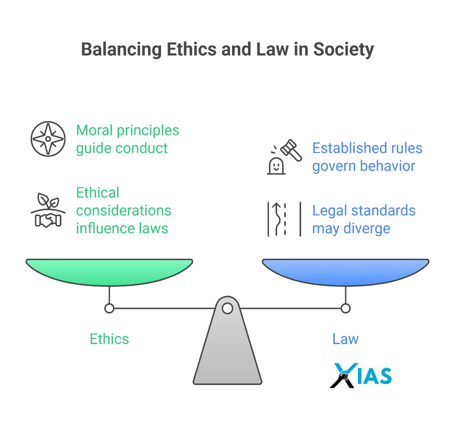

---

#### Microtopic: Human Values: Role of family society and educational institutions in inculcating values

##### Subtopic: Value Based Questions
[Subject: ETHICS, INTEGRITY & APTITUDE]
[Section Group: Ethics & Human Values]
[Microtopic: Human Values: Role of family society and educational institutions in inculcating values]
[Subtopic: Value Based Questions]

###### Card 1: Meaning and Scope of Human Values (Theme 2)
*   **Quote:**
    > “Where there is righteousness in the heart, there is beauty in the character.” – Dr. A.P.J. Abdul Kalam

*   **Introduction:**
*   **Human values are the invisible architecture of human dignity and ethical purpose.** They are intrinsic moral ideals that elevate behavior from **instinct to intention**, from **habit to humanity**—forming the ethical bedrock of civilization.

*   **Examples:**
*   **Raja Ram Mohan Roy’s reformist zeal** stemmed from the value of **human dignity**.
*   **Gandhi’s Satya and Ahimsa** defined the **spiritual core of non-violent struggle**.
*   **NITI Aayog’s Aspirational Districts Programme** promotes **equity and justice** for the most underserved.

*   **Conclusion:**
*   Human values cultivate the soul of a just society, ensuring that development is grounded in compassion, fairness, and dignity for all.

###### Card 2: Role of Family in Inculcating Values (Theme 2)
*   **Quote:**
    > “The family is the first school of social and moral learning.” – Jawaharlal Nehru

*   **Introduction:**
*   **Family is the crucible where the first moral impressions are forged.** It teaches not by rules but by **example**, shaping a child’s compass through **unspoken lessons in empathy, honesty, and discipline**.

*   **Examples:**
*   **Gandhi’s respect for truth** was instilled by his **mother’s spiritual discipline**.
*   **Dr. Kalam credited his father** for teaching him **honesty and austerity**.
*   **Many civil servants attribute their service ethics** to **family role-modeling**.

*   **Conclusion:**
*   A value-rich family nurtures ethical citizens, laying the foundation of public integrity in private morality.

###### Card 3: Role of Society in Inculcating Values (Theme 2)
*   **Quote:**
    > “Society is the mirror where we refine our character.” – Dr. S. Radhakrishnan

*   **Introduction:**
*   **Society functions as a collective moral ecosystem**, shaping ethics through **traditions, culture, peer behavior, and** **collective narratives**. It provides the stage where personal values are either **reinforced or resisted**.

*   **Examples:**
*   **Societal acceptance of LGBTQ+ rights** reflects growing **inclusivity and empathy**.
*   **Narmada Bachao Andolan** built a movement on **environmental and indigenous values**.
*   **COVID-19 community kitchens** showcased **solidarity and compassion**.

*   **Conclusion:**
*   **A just society nurtures ethical reflexes**, making moral action the norm not the exception across public and private life.

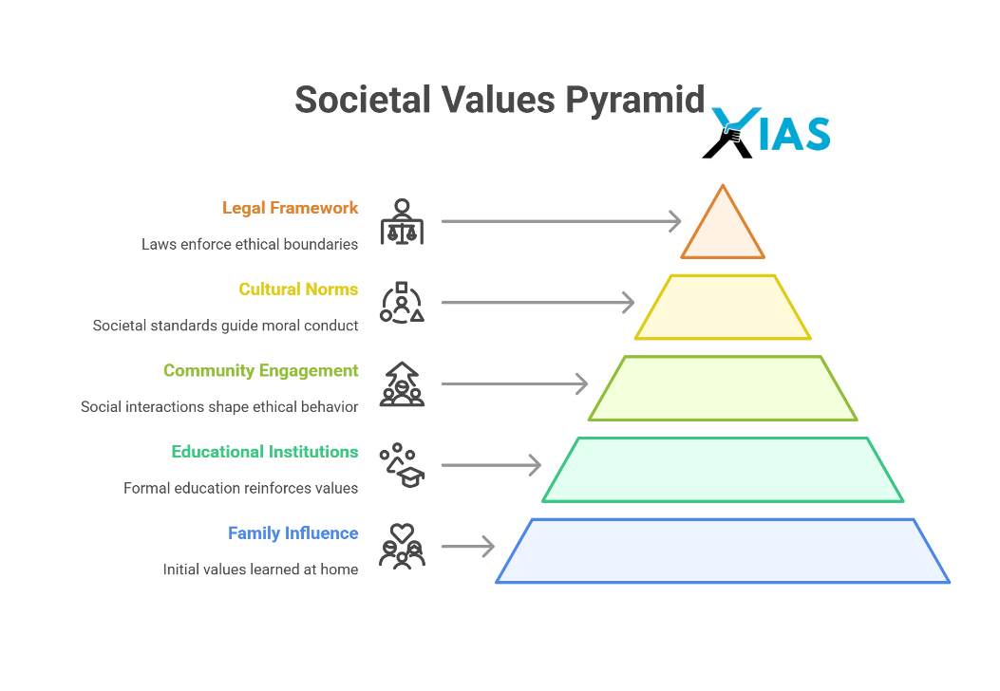

---

##### Subtopic: Role of Educational institutions
[Subject: ETHICS, INTEGRITY & APTITUDE]
[Section Group: Ethics & Human Values]
[Microtopic: Human Values: Role of family society and educational institutions in inculcating values]
[Subtopic: Role of Educational institutions]

###### Card 1: Role of Educational Institutions in Inculcating Values (Theme 2)
*   **Quote:**
    > “Education must build character before it builds careers.” – Swami Vivekananda

*   **Introduction:**
*   **Educational institutions are nurseries of ethical citizenship**, transforming intelligence into wisdom. Through curriculum, mentorship, and peer culture, they embed **empathy, service, and moral reasoning** in future generations.

*   **Examples:**
*   **CBSE’s value education modules** promote **life skills, empathy, and ethics**.
*   **TISS fosters ethical public engagement** through **field immersion and reflection**.
*   **Navodaya Vidyalayas** instill **discipline, fraternity, and national integration**.

*   **Conclusion:**
*   **Education rooted in values produces not just professionals, but public-spirited individuals** who uplift society through both knowledge and character. **

---

##### Subtopic: Crisis of Ethical Values
[Subject: ETHICS, INTEGRITY & APTITUDE]
[Section Group: Ethics & Human Values]
[Microtopic: Human Values: Role of family society and educational institutions in inculcating values]
[Subtopic: Crisis of Ethical Values]

###### Card 1: Value Conflicts in Public and Private Life (Theme 2)
*   **Quote:**
    > “Your beliefs become your thoughts, your thoughts become your words… your destiny.” – Mahatma Gandhi

*   **Introduction:**
*   **Value conflict is the ethical friction between personal beliefs and professional expectations.** It tests **moral clarity,** **emotional courage, and ethical prioritization** when one must choose between conscience and convenience.

*   **Examples:**
*   An IAS officer exposing corruption may face backlash from within the system.
*   Ratan Tata’s refusal to bribe demonstrated value over profit.
*   **Whistleblowers in corporate scams** uphold **public ethics over private loyalty**.

*   **Conclusion:**
*   Resolving value conflict demands principled balance, where the ethical high ground is maintained without forsaking role-responsibility or human dignity.

---

### Section Group: Psychology & Foundational Values

#### Microtopic: Aptitude and Foundational Values for Civil Service

##### Subtopic: Foundational values
[Subject: ETHICS, INTEGRITY & APTITUDE]
[Section Group: Psychology & Foundational Values]
[Microtopic: Aptitude and Foundational Values for Civil Service]
[Subtopic: Foundational values]

###### Card 1: Aptitude – Meaning and Relevance (Theme 4)
*   **Quote:**
    > “Excellence happens not by accident. It is a process.” – Dr. A.P.J. Abdul Kalam

*   **Introduction:**
*   **Aptitude is the innate or acquired ability to understand, act, and adapt effectively in specific contexts.** It reflects **mental sharpness, emotional regulation, and ethical clarity**, making it foundational for sound public decision- making.

*   **Examples:**
*   **IAS topper Pradeep Singh’s consistent preparation** reflected both **analytical aptitude and emotional**
*   discipline.
• **District collectors managing disaster zones** combine **crisis aptitude** with **empathetic field leadership**.
• **Aptitude tests in UPSC exams** assess **problem-solving, comprehension, and judgment** under pressure.

*   **Conclusion:**
*   **Aptitude ensures efficiency with integrity**, enabling civil servants to respond with competence, sensitivity, and ethical balance in dynamic governance settings. **

###### Card 2: Objectivity (Theme 4)
*   **Quote:**
    > “Facts are sacred; opinion is free.” – Jawaharlal Nehru

*   **Introduction:**
*   **Objectivity is the ability to make decisions based on evidence, logic, and fairness rather than emotions, bias, or** **external pressures.** It is essential for equitable governance and rational public service delivery.

*   **Examples:**
*   **Right to Information (RTI)** institutionalized **evidence-based decision-making**.
*   **UPSC interview panels** are designed to be **objective and neutral**.
*   **E-governance tools like JAM trinity** reduce **subjectivity in welfare distribution**.

*   **Conclusion:**
*   **Objectivity ensures that fairness prevails over favoritism**, building credibility and predictability in public institutions. **

###### Card 3: Dedication to Public Service (Theme 4)
*   **Quote:**
    > “The best way to find yourself is to lose yourself in the service of others.” – Mahatma Gandhi

*   **Introduction:**
*   **Dedication to public service is a value that prioritizes collective welfare over personal gain.** It transforms duty into **devotion**, and office into an **instrument of justice and compassion**.

*   **Examples:**
*   **IAS Armstrong Pame’s road-building mission** in Manipur showed **selfless administrative commitment**.
*   **Healthcare workers during COVID-19** exemplified **sacrifice for public well-being**.
*   **Civil servants working in LWE regions** show **unwavering service under risk**.

*   **Conclusion:**
*   **Dedication fuels ethical resilience**, making civil servants true agents of inclusive and responsive governance. **

###### Card 4: Tolerance (Theme 4)
*   **Quote:**
    > “Tolerance and patience are much stronger than brute force.” – Subhas Chandra Bose

*   **Introduction:**
*   **Tolerance is the willingness to accept views, behaviors, or beliefs different from one’s own.** It reflects **maturity in** **pluralism**, and is vital for harmony in a diverse, democratic society.

*   **Examples:**
*   **India’s constitutional protection of religious and linguistic minorities** is rooted in **tolerance**.
• **Civil society protests (e.g., Anna Hazare Movement)** were largely respected in a **tolerant democratic**
*   amework.
• **Public officials dealing with aggressive stakeholders** often practice **patience and restraint**.

*   **Conclusion:**
*   **Tolerance builds bridges in conflict**, making peaceful coexistence and inclusive progress not just possible, but sustainable. **

---

##### Subtopic: Integrity
[Subject: ETHICS, INTEGRITY & APTITUDE]
[Section Group: Psychology & Foundational Values]
[Microtopic: Aptitude and Foundational Values for Civil Service]
[Subtopic: Integrity]

###### Card 1: Integrity (Theme 4)
*   **Quote:**
    > “It is easy to stand with the crowd. It takes courage to stand alone.” – Dr. A.P.J. Abdul Kalam

*   **Introduction:**
*   **Integrity is the unwavering consistency between one’s values, words, and actions—even in the absence of** **external scrutiny.** It is the ethical anchor of public trust and the hallmark of true character.

*   **Examples:**
*   **S. Manjunath and Satyendra Dubey**, both martyred while upholding **professional integrity**.
*   Ashok Khemka’s repeated transfers reflect his stand against systemic malpractice.
*   **T.N. Seshan’s fearless election reforms** were driven by a **non-negotiable integrity of purpose**.

*   **Conclusion:**
*   **Integrity transforms authority into trust**, ensuring that governance is not only lawful, but also morally credible. **

---

##### Subtopic: Impartiality and Non-Partisanship
[Subject: ETHICS, INTEGRITY & APTITUDE]
[Section Group: Psychology & Foundational Values]
[Microtopic: Aptitude and Foundational Values for Civil Service]
[Subtopic: Impartiality and Non-Partisanship]

###### Card 1: Impartiality and Non-partisanship (Theme 4)
*   **Quote:**
    > “A public servant belongs to the people, not to a party.” – Sardar Vallabhbhai Patel

*   **Introduction:**
*   **Impartiality is the ability to decide without prejudice or personal bias**, while **non-partisanship means maintaining** **distance from political influence**.

*   **Examples:**
*   **Election Commission officers during polls** exemplify **non-partisan duty over political pressure**.
*   **Supreme Court rulings** often reinforce **institutional impartiality** in sensitive cases.
*   **Whistleblowing in politically connected scams** reflects **ethical courage above party lines**.

*   **Conclusion:**
*   **Impartiality and non-partisanship uphold the Constitution above convenience**, ensuring justice is served without fear, favor, or faction.

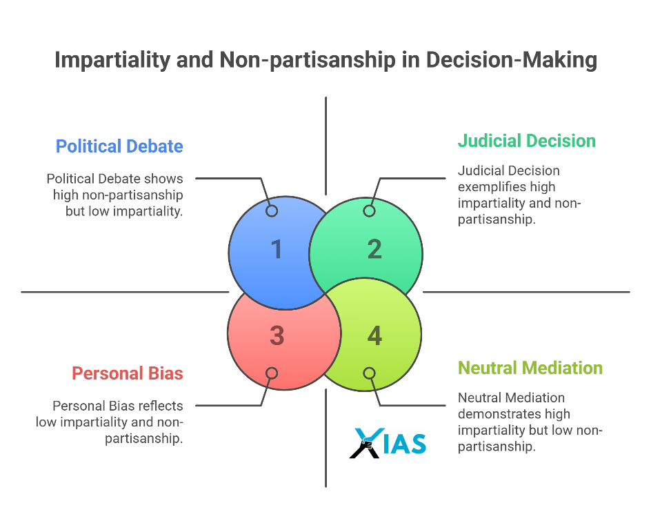

---

##### Subtopic: Empathy and Compassion
[Subject: ETHICS, INTEGRITY & APTITUDE]
[Section Group: Psychology & Foundational Values]
[Microtopic: Aptitude and Foundational Values for Civil Service]
[Subtopic: Empathy and Compassion]

###### Card 1: Empathy (Theme 4)
*   **Quote:**
    > “Leadership is not about being in charge. It is about taking care of those in your charge.” – Narendra Modi

*   **Introduction:**
*   **Empathy is the ability to perceive and internalize others’ emotions, experiences, and struggles,**It bridges the gap between **policy intent and lived realities**, especially for the vulnerable.

*   **Examples:**
*   **IAS officer Rohini Sindhuri’s work for manual scavengers** reflected **deep human empathy**.
*   **District-level helplines for migrant workers during lockdowns** were rooted in **empathetic governance**.
*   **PM’s ‘Mann Ki Baat’** often highlights stories that evoke **public emotional connect**.

*   **Conclusion:**
*   **Empathy creates emotionally intelligent leadership**, ensuring that the state does not act as a machine, but as a moral organism. **

###### Card 2: Compassion toward the Weaker Sections (Theme 4)
*   **Quote:**
    > “A nation's greatness is measured by how it treats its weakest members.” – Mahatma Gandhi

*   **Introduction:**
*   **Compassion is not charity it is moral responsiveness.** It is the inner call to **uplift the vulnerable with dignity**, and ensure that governance does not neglect those most in need of care and protection.

*   **Examples:**
*   PM Garib Kalyan Yojana offered urgent support to the poor during the pandemic.
*   **Mission Antyodaya and DAY-NRLM** reflect **compassion-driven development models**.
*   **IAS officers working with tribal communities** promote **culturally sensitive and inclusive administration**.

*   **Conclusion:**
*   **Compassion ensures that justice reaches the last citizen**, transforming welfare from a policy to a promise fulfilled with empathy.  **

---

#### Microtopic: Attitude: Content, Structure, Function, Moral and Political Attitudes, Social Influence

##### Subtopic: Attitude for Individuals
[Subject: ETHICS, INTEGRITY & APTITUDE]
[Section Group: Psychology & Foundational Values]
[Microtopic: Attitude: Content, Structure, Function, Moral and Political Attitudes, Social Influence]
[Subtopic: Attitude for Individuals]

###### Card 1: Content of Attitude (Theme 3)
*   **Quote:**
    > “Watch your thoughts, they become words... your destiny.” – Mahatma Gandhi

*   **Introduction:**
    *   Attitude is a **structured mental orientation toward a person, object, or idea, shaped by beliefs, emotions, and** **behavioral intentions.** It forms the psychological filter through which individuals interpret and respond to the world.

*   **Examples:**
*   A **positive attitude towards public service** motivated IAS officer **Arunraj K** to voluntarily teach
*   underprivileged students.
*   **Social media trolling** often stems from **negative attitudes formed by bias and misinformation**.
*   Swachh Bharat campaign targeted public attitude change towards cleanliness, not just infrastructure.

*   **Conclusion:**
*   **Understanding attitude content helps shape constructive behavior**, fostering rational thinking, empathy, and proactive public engagement. **

###### Card 2: Structure of Attitude (Theme 3)
*   **Quote:**
    > “What we think, we become.” – Gautama Buddha

*   **Introduction:**
*   **Attitude has a tripartite structure—cognitive (belief), affective (feeling), and behavioral (intention).** These components interact to form a consistent psychological disposition, shaping how individuals evaluate and respond to stimuli.

*   **Examples:**
*   **Gender bias** in hiring often stems from **cognitive stereotypes, emotional discomfort, and discriminatory**
*   behavior.
*   **Clean Ganga Mission** built on **belief in sacredness, emotional attachment, and volunteering actions**.
*   Public attitude toward disability is evolving from sympathy to inclusion—across all three dimensions.

*   **Conclusion:**
*   **Dissecting attitude structure enables targeted reforms**, addressing not just what people think, but also how they feel and act.                 **

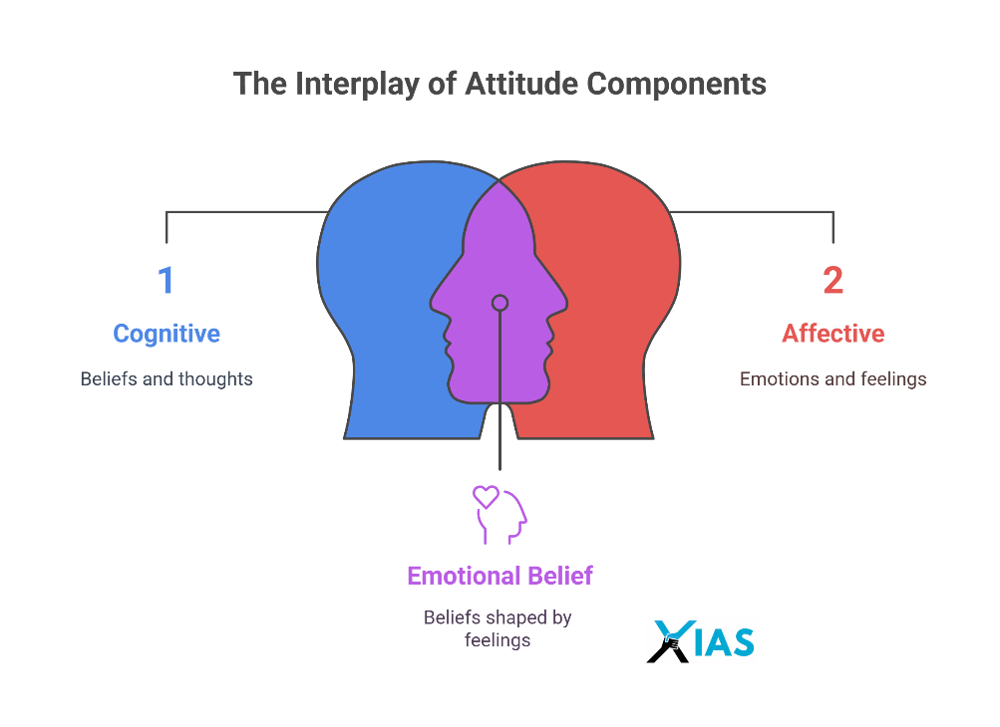

###### Card 3: Functions of Attitude (Theme 3)
*   **Quote:**
    > “We are kept from our goal not by obstacles, but by a clear path to a lesser goal.” – Bhagavad Gita

*   **Introduction:**
*   **Attitudes serve key functions—adaptive, ego-defensive, value-expressive, and knowledge-based** helping individuals navigate complex environments while maintaining **psychological stability and social identity.**

*   **Examples:**
*   **Caste prejudices** serve **ego-defensive functions** to justify inherited privilege.
*   **Patriotism in national service** performs a **value-expressive function**, as seen during disaster relief.
*   **Voting choices** often reflect the **knowledge function**, simplifying political complexity.

*   **Conclusion:**
*   **Recognizing attitude functions enables tailored policy interventions**, transforming resistance into acceptance and apathy into participation. **

###### Card 4: Formation of Attitude (Theme 3)
*   **Quote:**
    > “You don’t just live in a society; society lives in you.” – Dr. B.R. Ambedkar

*   **Introduction:**
*   **Attitudes are formed through socialization, experience, conditioning, role models, and media exposure.** They evolve over time, influenced by family, culture, institutions, and life events.

*   **Examples:**
*   **Stereotypes about manual labor** are often learned in childhood through **family and societal messaging**.
*   **School campaigns promoting gender equality** shape **positive attitudes early**.
*   **Media glorification of violence** can foster **aggressive or insensitive attitudes** in youth.

*   **Conclusion:**
*   **Early and ethical attitude formation** is critical to building citizens who are socially conscious and emotionally intelligent. **

###### Card 5: Attitude-Behaviour Relationship (Theme 3)
*   **Quote:**
    > “Action is the real measure of intelligence.” – Napoleon Hill

*   **Introduction:**
*   **While attitudes influence behavior, the relationship is moderated by factors like social pressure, opportunity, and** **perceived consequences.** Alignment of belief and action defines authenticity and ethical consistency.

*   **Examples:**
*   A civil servant may value **honesty** but **remain silent in corruption** due to fear or peer pressure.
*   RTI activists act on attitudes of transparency, converting beliefs into action.
*   Plastic bans often fail when attitudes are positive but behavior remains unchanged due to inconvenience.

*   **Conclusion:**
*   **Bridging the attitude-behavior gap** requires not just awareness but supportive environments, courage, and value reinforcement. **

---

##### Subtopic: Moral and Political Attitude
[Subject: ETHICS, INTEGRITY & APTITUDE]
[Section Group: Psychology & Foundational Values]
[Microtopic: Attitude: Content, Structure, Function, Moral and Political Attitudes, Social Influence]
[Subtopic: Moral and Political Attitude]

###### Card 1: Moral and Political Attitudes (Theme 3)
*   **Quote:**
    > “Politics without principles is a sin.” – Mahatma Gandhi

*   **Introduction:**
*   **Moral attitude reflects an individual’s internalized sense of right and wrong**, while **political attitude expresses** **views on power, authority, and governance**. Together, they shape civic conduct and public reasoning.

*   **Examples:**
*   **Moral attitude led whistleblowers** like **Manjunath and Satyendra Dubey** to act against corruption.
*   **Youth participation in elections** reflects evolving **political attitudes of empowerment**.
*   **Polarized media** can distort both **moral clarity and political tolerance**.

*   **Conclusion:**
*   **Balanced moral and political attitudes are vital** to nurture participative democracy and ethical governance. **

---

##### Subtopic: Social influence and persuasion
[Subject: ETHICS, INTEGRITY & APTITUDE]
[Section Group: Psychology & Foundational Values]
[Microtopic: Attitude: Content, Structure, Function, Moral and Political Attitudes, Social Influence]
[Subtopic: Social influence and persuasion]

###### Card 1: Social Influence (Theme 3)
*   **Quote:**
    > “A man is but the product of his thoughts and the environment he lives in.” – Mahatma Gandhi

*   **Introduction:**
*   **Social influence refers to how individuals’ attitudes and behaviors are shaped by others through conformity,** **obedience, persuasion, or peer pressure.** It can lead to both constructive and destructive choices.

*   **Examples:**
*   **Bystander effect** in public emergencies shows how **conformity dampens moral action**.
*   **Youth volunteering inspired by peers** in NSS or NCC is **positive social influence**.
*   **Mass disinformation on social media** creates **herd mentality** and reactive attitudes.

*   **Conclusion:**
*   **Understanding social influence helps guard autonomy**, enabling individuals to act with conviction, not conformity. **

###### Card 2: Persuasion (Theme 3)
*   **Quote:**
    > “You can change people’s minds by touching their hearts.” – Dr. A.P.J. Abdul Kalam

*   **Introduction:**
*   **Persuasion is the ethical art of changing attitudes through reason, emotion, and credibility.** It is central to public communication, behavior change, and leadership in democratic societies.

*   **Examples:**
*   **IEC campaigns in Swachh Bharat** used **emotive and logical appeal** to shift mindsets.
*   **Gandhi’s speeches** persuaded masses using **moral authority over rhetoric**.
*   **Nudging through policy design** (e.g., UPI adoption) used **soft persuasion over compulsion**.

*   **Conclusion:**
*   **Effective persuasion respects autonomy while inspiring transformation**, making it a cornerstone of ethical governance and citizen engagement.                    **

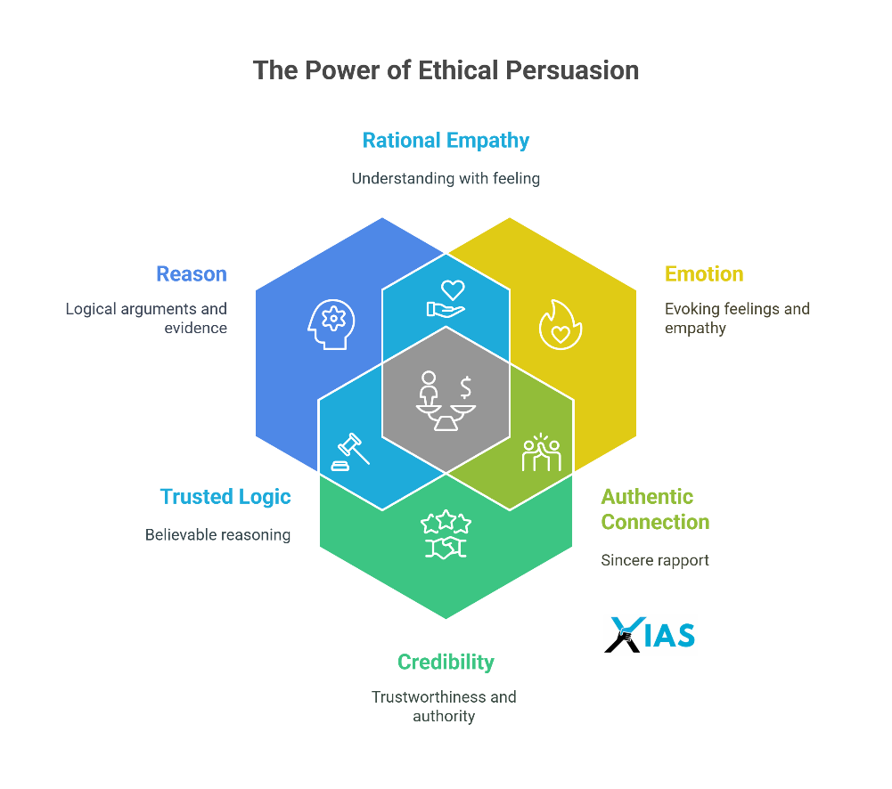

---

#### Microtopic: Emotional intelligence: Concepts, utilities and application in administration

##### Subtopic: EI: Concept and utility
[Subject: ETHICS, INTEGRITY & APTITUDE]
[Section Group: Psychology & Foundational Values]
[Microtopic: Emotional intelligence: Concepts, utilities and application in administration]
[Subtopic: EI: Concept and utility]

###### Card 1: Definition and Relevance of Emotional Intelligence (Theme 5)
*   **Quote:**
    > “To handle yourself, use your head; to handle others, use your heart.” – Jawaharlal Nehru

*   **Introduction:**
*   **Emotional Intelligence is the integration of emotional awareness and cognitive regulation**, enabling individuals to **understand, manage, and apply** **emotions** effectively for ethical judgment, adaptive behavior, and constructive human interaction.

*   **Examples:**
*   IAS officers during COVID-19
*   responded with empathy to
*   public panic.
*   Chandrayaan-3 team managed
*   emotional highs and lows with
*   composure.
*   Police handling farmers’
*   protests relied on emotional
*   balance over force.

*   **Conclusion:**
*   **Emotional intelligence creates** **emotionally stable institutions**, where empathy and ethics inform governance beyond rigid procedures.

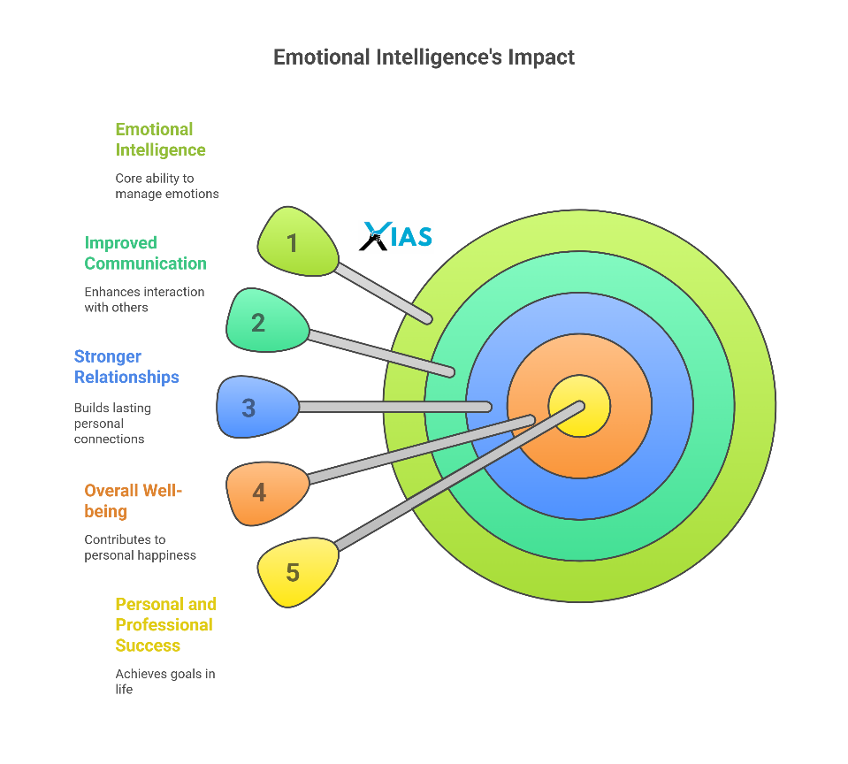

###### Card 2: Self-awareness (Theme 5)
*   **Quote:**
    > “The first step in solving a problem is to recognize your role in creating it.” – Dr. A.P.J. Abdul Kalam

*   **Introduction:**
*   **Self-awareness is the capacity to introspectively access one’s emotional states, values, and impulses**, forming the basis for **emotional self-regulation, authenticity, and ethical alignment** in personal and administrative contexts.

*   **Examples:**
*   Dr. Kalam’s humility stemmed from conscious self-understanding.
*   Ira Singhal’s resolve reflected clarity of purpose and emotional identity.
*   LBSNAA’s feedback exercises promote introspection and ethical grounding.

*   **Conclusion:**
*   **Self-awareness cultivates moral clarity**, enabling public servants to lead with inner balance and transparent intentions. **

###### Card 3: Self-regulation (Theme 5)
*   **Quote:**
    > “Calmness is the cradle of power.” – Jawaharlal Nehru

*   **Introduction:**
*   **Self-regulation is the internal capacity to manage emotions, delay impulses, and maintain equilibrium**, especially under stress, enabling **measured, ethical, and policy-aligned responses** in public life.

*   **Examples:**
*   IPS officers during violent protests acted with restraint despite provocation.
*   Judges avoid reaction to public pressure, maintaining courtroom neutrality.
*   Civil servants under political heat choose silence over reactive statements.

*   **Conclusion:**
*   **Self-regulation stabilizes public authority**, ensuring dignity, legality, and maturity in emotionally charged situations. **

###### Card 4: Motivation (Theme 5)
*   **Quote:**
    > “Dreams are not what you see in sleep; dreams are those that do not let you sleep.” – Dr. A.P.J. Abdul Kalam

*   **Introduction:**
*   **Motivation in emotional intelligence refers to the** **inner emotional drive toward meaningful goals**, sustained by purpose, resilience, and moral conviction, beyond external rewards.

*   **Examples:**
*   Kiran Bedi’s prison reforms emerged from
*   inner ethical passion.
*   ISRO scientists' perseverance reflects long-
*   term goal commitment.
*   Officers in remote tribal areas work under
*   extreme hardship with inner dedication.

*   **Conclusion:**
*   **Motivated public servants convert vision into action**, sustaining reforms even in adversity or institutional inertia.

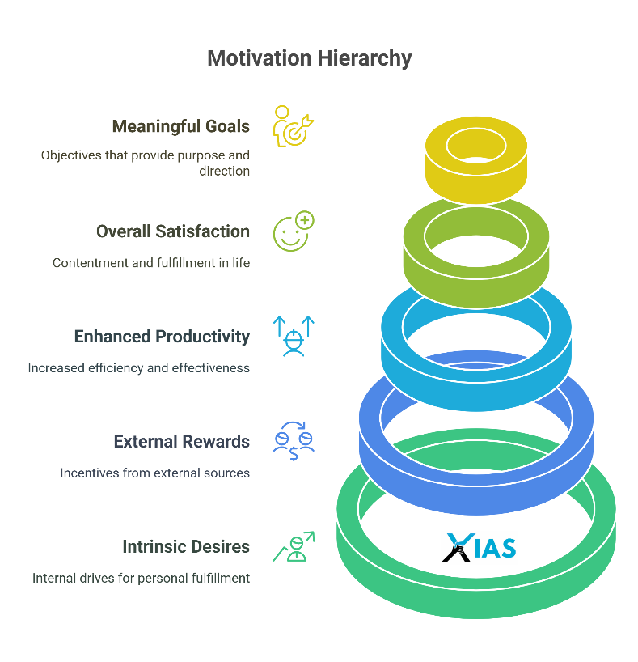

###### Card 5: Empathy (Theme 5)
*   **Quote:**
    > “The best way to find yourself is to lose yourself in the service of others.” – Mahatma Gandhi

*   **Introduction:**
*   **Empathy is the cognitive-emotional ability to vicariously understand others’ emotions**, enabling **inclusive,** **sensitive, and dignity-driven governance** rooted in lived human realities.

*   **Examples:**
*   Rohini Sindhuri’s support for manual scavengers reflected empathetic intervention.
*   COVID migrant camps responded to the emotional distress of the displaced.
*   Disability-inclusive designs in administration reflect institutional empathy.

*   **Conclusion:**
*   **Empathy brings humanity into statecraft**, transforming delivery into dignity-based service. **

###### Card 6: Social Skills (Theme 5)
*   **Quote:**
    > “The art of communication is the language of leadership.” – Dr. A.P.J. Abdul Kalam

*   **Introduction:**
*   **Social skills encompass emotionally intelligent behaviors like communication, collaboration, and conflict** **resolution**, essential for **trust-building, participatory governance, and effective team functioning** in administration.

*   **Examples:**
*   Disaster response teams work through inter-agency coordination and clarity.
*   Gram Sabha engagement relies on communication and persuasion.
*   Mann Ki Baat demonstrates emotional resonance in political outreach.

*   **Conclusion:**
*   **Social skills make governance accessible and participatory**, fostering collaboration between state and citizen. **

---

##### Subtopic: EI in Administration
[Subject: ETHICS, INTEGRITY & APTITUDE]
[Section Group: Psychology & Foundational Values]
[Microtopic: Emotional intelligence: Concepts, utilities and application in administration]
[Subtopic: EI in Administration]

###### Card 1: Application of EI in Administration (Theme 5)
*   **Quote:**
    > “Man becomes great exactly in the degree in which he works for the welfare of his fellow men.” – Mahatma Gandhi

*   **Introduction:**
*   **Application of emotional intelligence in administration involves using emotional insight to manage people, defuse** **tensions, and resolve conflicts**, with **ethical composure and social awareness**.

*   **Examples:**
*   Collectors using dialogue
*   over force in protests show
*   EI in crisis.
*   Juvenile justice boards
*   prefer emotional restoration
*   over punishment.
*   Public grievance cells
*   demand calm, tactful
*   engagement.

*   **Conclusion:**
*   **EI enhances the emotional** **architecture of governance**, where decisions are humane, not just procedural.

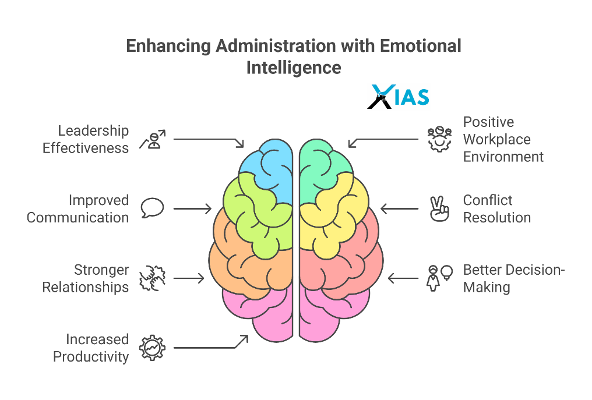

###### Card 2: Building EI in Civil Services (Theme 5)
*   **Quote:**
    > “Character is the foundation upon which leadership is built.” – Dr. S. Radhakrishnan

*   **Introduction:**
*   **Building EI in civil services involves structured cultivation of emotional competencies** self-awareness, empathy, and social sensitivity through **training, feedback, and experiential learning**.

*   **Examples:**
*   LBSNAA uses role-play, feedback, and mindfulness modules.
*   360-degree reviews build self-insight in leadership roles.
*   Peer learning during Bharat Darshan builds empathy and cultural sensitivity.

*   **Conclusion:**
*   **Emotionally intelligent civil servants uphold ethics with compassion**, enriching both policy and people with value- based conduct  **

---

### Section Group: Moral Thinkers & Leaders

#### Microtopic: Contributions of Moral Thinkers and Philosophers from India and World

##### Subtopic: Mahatma Gandhi
[Subject: ETHICS, INTEGRITY & APTITUDE]
[Section Group: Moral Thinkers & Leaders]
[Microtopic: Contributions of Moral Thinkers and Philosophers from India and World]
[Subtopic: Mahatma Gandhi]

###### Card 1: Contributions of Mahatma Gandhi (Theme 6)
*   **Quote:**
    > “In matters of conscience, the law of the majority has no place.” – Mahatma Gandhi

*   **Introduction:**
*   **Gandhi’s moral philosophy was a fusion of ethical absolutism and spiritual activism**, where **truth (Satya)** and **non-** **violence (Ahimsa)** were not just ideals but actionable instruments of civil resistance and human dignity.

*   **Examples:**
*   **Salt March** exemplified **ethical protest over violent agitation**.
*   **Trusteeship theory** encouraged **compassionate capitalism**.
*   **His influence on civil rights movements** gave **global ethical resonance** to Indian values.

*   **Conclusion:**
*   **Gandhi transformed morality into mass action**, making values the core force of national and global transformation. **

---

##### Subtopic: Swami Vivekananda
[Subject: ETHICS, INTEGRITY & APTITUDE]
[Section Group: Moral Thinkers & Leaders]
[Microtopic: Contributions of Moral Thinkers and Philosophers from India and World]
[Subtopic: Swami Vivekananda]

###### Card 1: Contributions of Swami Vivekananda (Theme 6)
*   **Quote:**
    > “They alone live who live for others.” – Swami Vivekananda

*   **Introduction:**
*   **Vivekananda’s moral philosophy blended Vedantic spirituality with social uplift**, where **service, strength, and self-** **mastery** became tools for both national regeneration and ethical self-realization.

*   **Examples:**
*   **Ramakrishna Mission** embodies his **“service as worship”** doctrine.
*   **His Chicago address** stressed **unity beyond religion**.
*   **Youth empowerment campaigns** draw on his vision of **inner character over outer achievement**.

*   **Conclusion:**
*   **Vivekananda awakened India’s moral confidence**, making ethics an instrument of national and individual excellence. **

---

##### Subtopic: Immanuel Kant
[Subject: ETHICS, INTEGRITY & APTITUDE]
[Section Group: Moral Thinkers & Leaders]
[Microtopic: Contributions of Moral Thinkers and Philosophers from India and World]
[Subtopic: Immanuel Kant]

###### Card 1: Contributions of Immanuel Kant (Theme 6)
*   **Quote:**
    > “Act only on that maxim which you can will to become a universal law.” – Immanuel Kant

*   **Introduction:**
*   **Kant’s deontological ethics located morality in rational autonomy**, where ethical actions stem not from outcomes, but from **duty governed by reason and universalizability**.

*   **Examples:**
*   **Whistleblowers like Satyendra Dubey** acted from **duty, not utility**.
*   **Rule-following in public institutions** echoes **Kant’s respect for moral law**.
*   **Right to dignity** in constitutional law reflects **Kantian influence**.

*   **Conclusion:**
*   **Kant’s rational ethics safeguards dignity**, making law a servant of reason and conscience. **

---

##### Subtopic: Aristotle
[Subject: ETHICS, INTEGRITY & APTITUDE]
[Section Group: Moral Thinkers & Leaders]
[Microtopic: Contributions of Moral Thinkers and Philosophers from India and World]
[Subtopic: Aristotle]

###### Card 1: Contributions of Aristotle (Theme 6)
*   **Quote:**
    > “Moral excellence is not an act, but a habit.” – Aristotle

*   **Introduction:**
*   **Aristotle’s virtue ethics focused on character formation through habituated excellence**, where the **‘Golden Mean’** guided moral action between deficiency and excess in real-life contexts.

*   **Examples:**
*   **Civil servant neutrality** balances **courage with caution**.
*   **Honesty practiced with discretion** reflects **virtue in equilibrium**.
*   **Ethics training in services** aims to build **moral habit, not just knowledge**.

*   **Conclusion:**
*   **Aristotle turned ethics into a lived craft**, making moral maturity a matter of trained disposition. **

---

#### Microtopic: Lessons from the Lives and Teachings of Great Leaders, Reformers and Administrators

##### Subtopic: Teachings of Great Leaders
[Subject: ETHICS, INTEGRITY & APTITUDE]
[Section Group: Moral Thinkers & Leaders]
[Microtopic: Lessons from the Lives and Teachings of Great Leaders, Reformers and Administrators]
[Subtopic: Teachings of Great Leaders]

###### Card 1: Lessons from Great Leaders (Theme 2)
*   **Quote:**
    > “Be the change you wish to see in the world.” – Mahatma Gandhi

*   **Introduction:**
*   **The lives of great leaders are living texts of values in motion.** Their leadership does not command through power, but **persuades through virtue**—showing how **character fused with courage** becomes a force for lasting change.

*   **Examples:**
*   **Gandhi’s Dandi March** embodied **truth and non-violent resistance**.
*   **Dr. Kalam’s humility** and scientific pursuit reflected **service over self**.
*   **Nelson Mandela’s forgiveness** after release demonstrated **restorative justice and healing**.

*   **Conclusion:**
*   Great leaders shape moral imagination, offering living examples of values applied under pressure—a compass for both citizens and statesmen.

###### Card 2: Lessons from Reformers (Theme 2)
*   **Quote:**
    > “Educate, agitate, organize.” – Dr. B.R. Ambedkar

*   **Introduction:**
*   **Reformers are moral engineers of society**—they challenge entrenched injustice by rooting action in **universal values** **like liberty, equality, and rationality**, reorienting tradition through a moral and constitutional lens.

*   **Examples:**
*   **Dr. Ambedkar’s fight for Dalit rights** advanced **dignity and social justice**.
*   **Raja Ram Mohan Roy’s campaign against Sati** upheld **women’s rights and reason**.
*   **Vidyasagar’s promotion of widow remarriage** reflected **compassion and gender equality**.

*   **Conclusion:**
*   Reformers inject ethics into history, turning personal conviction into collective transformation through values- driven activism.

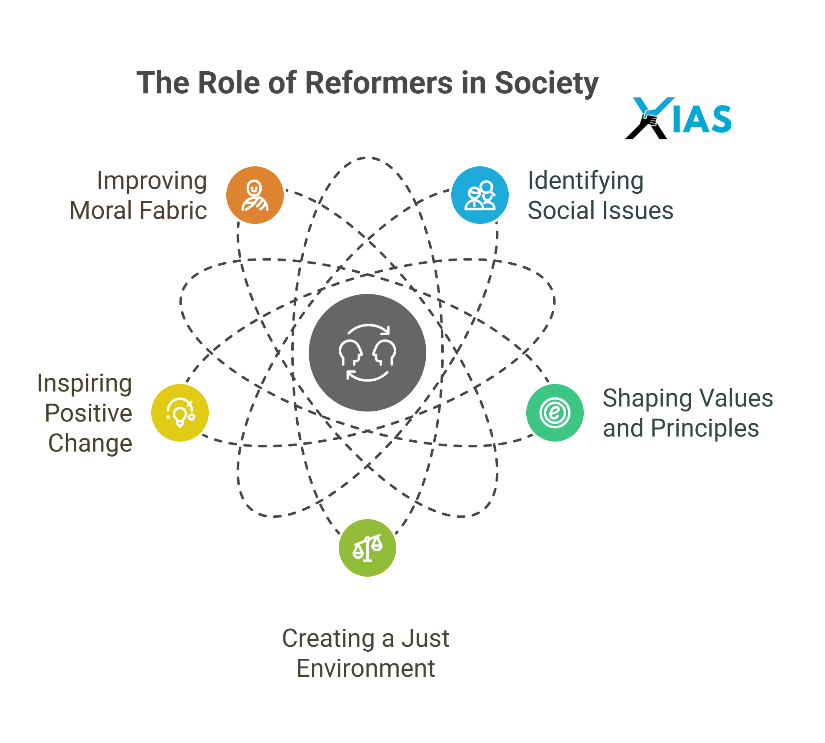

###### Card 3: Lessons from Administrators (Theme 2)
*   **Quote:**
    > “A civil servant’s greatest asset is the trust of the people.” – T.N. Seshan

*   **Introduction:**
*   **Ethical administrators are institutional conscience-keepers.** They don't merely enforce rules but **embed values like** **fairness, empathy, and integrity into governance**, transforming policy into ethical public service.

*   **Examples:**
• **T.N. Seshan’s electoral reforms** redefined **accountability and fearlessness** in public institutions.
• **Kiran Bedi’s prison reforms in Tihar** were rooted in **dignity and rehabilitation**.
• **IAS officer Pradeep Singh’s work in Naxal areas** shows **commitment to inclusive development**.

*   **Conclusion:**
*   Administrators driven by values build public trust, ensuring that governance upholds both efficiency and ethical legitimacy.

###### Card 4: Contributions of Dr. B.R. Ambedkar (Theme 6)
*   **Quote:**
    > “I measure the progress of a community by the degree of progress which women have achieved.” – Dr. B.R. Ambedkar

*   **Introduction:**
*   **Ambedkar’s moral vision was rooted in the dismantling of inherited hierarchies through rationality, equality, and** **constitutional ethics**, making **dignity and justice non-negotiable principles of public morality**.

*   **Examples:**
*   **Hindu Code Bill** advanced **gender justice**.
*   **Drafting the Constitution** embedded **social morality into legal order**.
*   **Conversion to Buddhism** rejected caste as **morally illegitimate**.

*   **Conclusion:**
*   **Ambedkar moralized modernity**, ensuring the Indian state’s ethical architecture rests on liberty, justice, and equality. **

###### Card 5: Contributions of Rabindranath Tagore (Theme 6)
*   **Quote:**
    > “The highest education is that which does not merely give us information but makes our life in harmony with all existence.” – Rabindranath Tagore

*   **Introduction:**
*   **Tagore’s ethics was rooted in aesthetic humanism**, where **freedom, creativity, and universal compassion** merged into a moral vision beyond borders, religions, or narrow nationalisms.

*   **Examples:**
*   **Santiniketan** fostered **value-based creative education**.
*   **Critique of hyper-nationalism** reflected his **ethical universalism**.
*   **Gitanjali’s poetic morality** blends **individual conscience with cosmic empathy**.

*   **Conclusion:**
*   **Tagore gave Indian ethics a global voice**, rooted in beauty, freedom, and emotional universality.

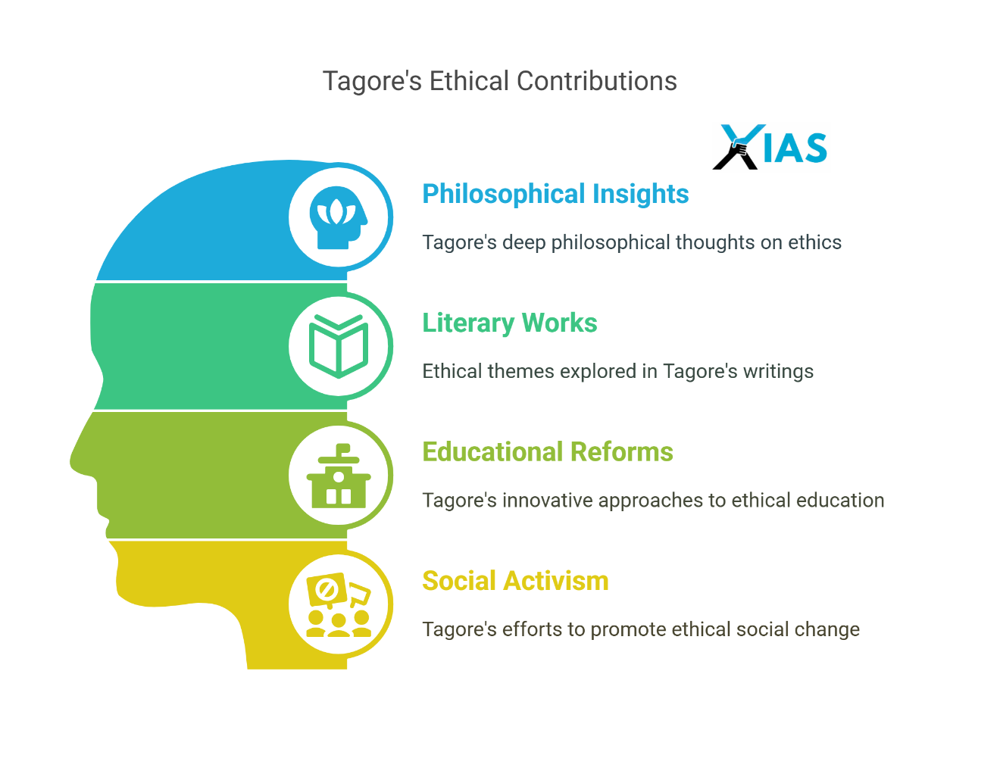

###### Card 6: Contributions of Gautama Buddha (Theme 6)
*   **Quote:**
    > “Hatred does not cease by hatred, but only by love—this is the eternal rule.” – Gautama Buddha

*   **Introduction:**
*   **Buddha’s moral thought was psychological, experiential, and pragmatic**, centering on **suffering, mindfulness, and** **ethical causality**, where morality emerged not from divine command, but from awareness and right action.

*   **Examples:**
*   **Eightfold Path** prescribes **ethical living through mindfulness**.
*   **Ashoka’s Dhamma** turned Buddhist ethics into **state policy**.
*   **Vipassana in Indian prisons** uses his method for **inner moral reform**.

*   **Conclusion:**
*   **Buddha offered a self-cultivated ethics**, where transformation begins within and radiates into society. **

###### Card 7: Contributions of John Stuart Mill (Theme 6)
*   **Quote:**
    > “A person may cause evil to others not only by his actions but by his inaction.” – J.S. Mill

*   **Introduction:**
*   **Mill’s utilitarianism anchored morality in consequences**, where ethical action aims to **maximize happiness and** **minimize harm**, while safeguarding individual liberty through his famous **‘harm principle’**.

*   **Examples:**
*   **Public health campaigns** follow **greatest-good logic**.
*   **Free speech jurisprudence** draws on **Mill’s liberty ethics**.
• **Welfare schemes** weigh **cost-benefit ethical calculus**.

*   **Conclusion:**
*   **Mill made utility ethically respectable**, bridging liberal freedoms with collective welfare in modern governance.  **

---

### Section Group: Governance & Probity

#### Microtopic: Public/Civil Service Values and Ethics in Public Administration: Status and Problems; Ethical Concerns and Dilemmas in Government and Private Institutions; Laws, Rules, Regulations and Conscience as Sources of Ethical Guidance; Accountability and Ethical Governance; Strengthening of Ethical and Moral Values in Governance; ethical Issues in International Relations and Funding; Corporate Governance

##### Subtopic: Public/Civil Service Values
[Subject: ETHICS, INTEGRITY & APTITUDE]
[Section Group: Governance & Probity]
[Microtopic: Public/Civil Service Values and Ethics in Public Administration: Status and Problems; Ethical Concerns and Dilemmas in Government and Private Institutions; Laws, Rules, Regulations and Conscience as Sources of Ethical Guidance; Accountability and Ethical Governance; Strengthening of Ethical and Moral Values in Governance; ethical Issues in International Relations and Funding; Corporate Governance]
[Subtopic: Public/Civil Service Values]

###### Card 1: Values in Public Administration (Theme 7)
*   **Quote:**
    > “The end of all education, all training, should be man-making.” – Swami Vivekananda

*   **Introduction:**
*   **Public service values are abstract ethical benchmarks that transform bureaucratic power into moral authority**, guiding officials to act with **duty, fairness, empathy, and institutional loyalty** in complex governance environments.

*   **Examples:**
*   **T.N. Seshan’s electoral reforms** embodied **integrity and fearlessness**.
*   **E. Sreedharan’s leadership in Delhi Metro** reflected **excellence and punctuality**.
*   **Mission Karmayogi** focuses on **value-based bureaucratic capacity building**.

*   **Conclusion:**
*   **Values are the ethical compass of administration**, ensuring that efficiency does not outpace accountability and authority remains anchored in legitimacy. **

---

##### Subtopic: Accountability and Ethical Governance
[Subject: ETHICS, INTEGRITY & APTITUDE]
[Section Group: Governance & Probity]
[Microtopic: Public/Civil Service Values and Ethics in Public Administration: Status and Problems; Ethical Concerns and Dilemmas in Government and Private Institutions; Laws, Rules, Regulations and Conscience as Sources of Ethical Guidance; Accountability and Ethical Governance; Strengthening of Ethical and Moral Values in Governance; ethical Issues in International Relations and Funding; Corporate Governance]
[Subtopic: Accountability and Ethical Governance]

###### Card 1: Status of Ethics in Governance (Theme 7)
*   **Quote:**
    > “A person who is morally educated will be a lot better equipped to move up the ladder of life.” – Dr. A.P.J. Abdul Kalam

*   **Introduction:**
*   **The status of ethics in governance reflects how deeply moral reasoning like justice, transparency, and restraint—** **has permeated administrative behavior, political culture, and institutional decision-making.**

*   **Examples:**
*   **Frequent high-level scams** indicate **ethical vulnerability** in governance.
*   **RTI Act and Lokpal** show attempts at **restoring institutional morality**.
*   Whistleblowing in Vyapam and coal block cases reflect ethical assertion from within.

*   **Conclusion:**
*   **A government is only as ethical as its daily conduct**, not merely its constitutional promises or public declarations.

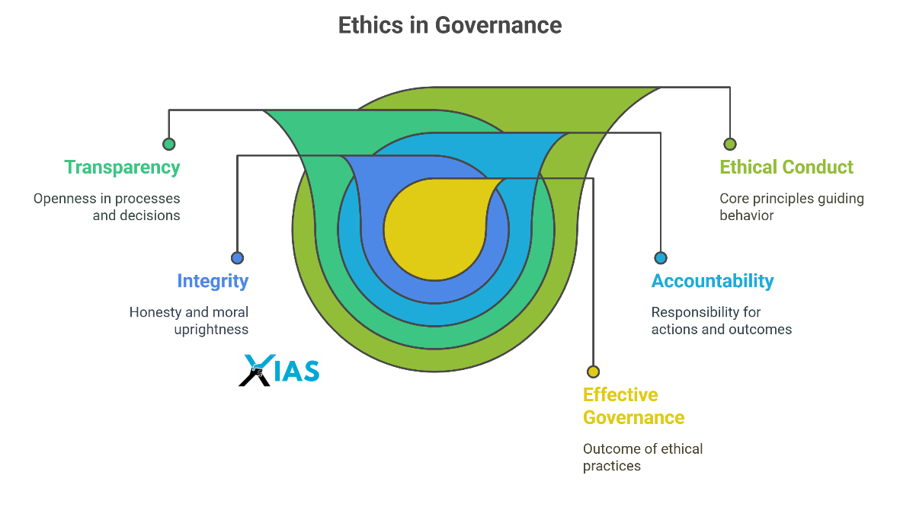

###### Card 2: Accountability and Ethical Governance (Theme 7)
*   **Quote:**
    > “Power must always be accompanied by responsibility.” – Pandit Jawaharlal Nehru

*   **Introduction:**
*   **Accountability is the moral architecture of governance**, ensuring that authority is exercised under **scrutiny,** **answerability, and consequence**—thereby aligning public power with ethical performance.

*   **Examples:**
*   RTI ensures administrative transparency to citizens.
*   CAG reports expose misuse of public funds.
*   Social audits in MGNREGA allow community-level accountability.

*   **Conclusion:**
*   **Accountability institutionalizes humility in governance**, transforming power from privilege to public stewardship. **

###### Card 3: Strengthening Ethical and Moral Values in Governance (Theme 7)
*   **Quote:**
    > “Morality cannot be legislated, but behavior can be regulated.” – Dr. Martin Luther King Jr.

*   **Introduction:**
*   **Strengthening values in governance involves institutionalizing virtues such as integrity, compassion, and** **impartiality through systemic reform, ethical leadership, and norm-setting public behavior.**

*   **Examples:**
*   Mission Karmayogi introduces ethics modules in training.
• **Ethics audits in government bodies** review moral climate.
• **Role models like Vinod Rai** inspire ethical emulation.

*   **Conclusion:**
*   **Ethics in governance must be cultivated like a habit**, not enforced like a rule. **

---

##### Subtopic: Ethical dilemmas in Public Administration
[Subject: ETHICS, INTEGRITY & APTITUDE]
[Section Group: Governance & Probity]
[Microtopic: Public/Civil Service Values and Ethics in Public Administration: Status and Problems; Ethical Concerns and Dilemmas in Government and Private Institutions; Laws, Rules, Regulations and Conscience as Sources of Ethical Guidance; Accountability and Ethical Governance; Strengthening of Ethical and Moral Values in Governance; ethical Issues in International Relations and Funding; Corporate Governance]
[Subtopic: Ethical dilemmas in Public Administration]

###### Card 1: Ethical Concerns in Government and Private Institutions (Theme 7)
*   **Quote:**
    > “The line between right and wrong is often drawn by self-interest.” – Nani Palkhivala

*   **Introduction:**
*   **Ethical concerns emerge when institutional conduct diverges from normative standards of responsibility**, resulting in **abuse of power, conflict of interest, and erosion of public or stakeholder trust.**

*   **Examples:**
*   **Banking scandals (e.g., PMC, Yes Bank)** exposed **regulatory negligence and greed**.
*   **Nirav Modi case** showed **weak ethical oversight in public banking**.
*   Corporate greenwashing misrepresents ethical responsibility as image-building.

*   **Conclusion:**
*   **Institutional ethics cannot depend on compliance alone**; it must be grounded in moral culture and individual accountability. **

---

##### Subtopic: Laws, Rules, Regulations and Conscience as Ethical Guidance
[Subject: ETHICS, INTEGRITY & APTITUDE]
[Section Group: Governance & Probity]
[Microtopic: Public/Civil Service Values and Ethics in Public Administration: Status and Problems; Ethical Concerns and Dilemmas in Government and Private Institutions; Laws, Rules, Regulations and Conscience as Sources of Ethical Guidance; Accountability and Ethical Governance; Strengthening of Ethical and Moral Values in Governance; ethical Issues in International Relations and Funding; Corporate Governance]
[Subtopic: Laws, Rules, Regulations and Conscience as Ethical Guidance]

###### Card 1: Sources of Ethical Guidance (Theme 7)
*   **Quote:**
    > “Law is only a floor; morality is the ceiling.” – Dr. B.R. Ambedkar

*   **Introduction:**
*   **Ethical guidance originates from a blend of codified rules, constitutional ideals, social norms, and inner** **conscience**, offering both **external direction and internal restraint** in decision-making under ambiguity.

*   **Examples:**
*   All India Services Conduct Rules formalize ethical standards.
*   Judicial references to constitutional morality surpass mere legality.
*   Grassroots movements like RTI reflect public moral expectations.

*   **Conclusion:**
*   **Sustainable ethics emerge when law, role, and inner conscience converge** to guide action under uncertainty. **

---

##### Subtopic: Ethical Issues in International Relations and Funding
[Subject: ETHICS, INTEGRITY & APTITUDE]
[Section Group: Governance & Probity]
[Microtopic: Public/Civil Service Values and Ethics in Public Administration: Status and Problems; Ethical Concerns and Dilemmas in Government and Private Institutions; Laws, Rules, Regulations and Conscience as Sources of Ethical Guidance; Accountability and Ethical Governance; Strengthening of Ethical and Moral Values in Governance; ethical Issues in International Relations and Funding; Corporate Governance]
[Subtopic: Ethical Issues in International Relations and Funding]

###### Card 1: Ethical Issues in International Relations and Funding (Theme 7)
*   **Quote:**
    > “A just world order must be rooted in values, not just power.” – Atal Bihari Vajpayee

*   **Introduction:**
*   **Ethics in international relations involves reconciling national interest with global justice**, where foreign aid, diplomacy, and negotiations are filtered through **principles of fairness, sovereignty, and human dignity.**

*   **Examples:**
*   **India’s Vaccine Maitri** showed **compassion-driven diplomacy**.
*   **Debate over IMF loan conditions** raises **ethics of debt and sovereignty**.
*   **India’s stance on Russia–Ukraine war** balanced **neutrality with humanitarian concerns**.

*   **Conclusion:**
*   **Ethical diplomacy earns global trust**, especially when morality aligns with strategic clarity.                       **

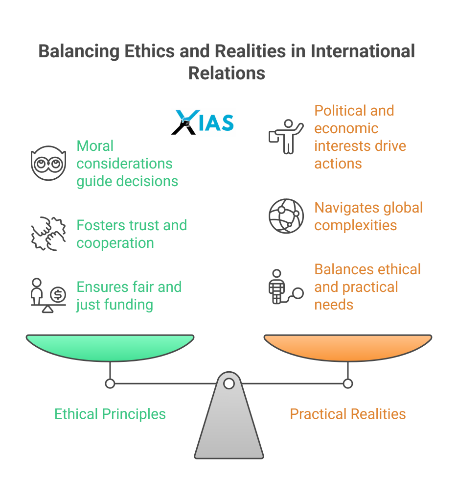

---

##### Subtopic: Corporate Governance
[Subject: ETHICS, INTEGRITY & APTITUDE]
[Section Group: Governance & Probity]
[Microtopic: Public/Civil Service Values and Ethics in Public Administration: Status and Problems; Ethical Concerns and Dilemmas in Government and Private Institutions; Laws, Rules, Regulations and Conscience as Sources of Ethical Guidance; Accountability and Ethical Governance; Strengthening of Ethical and Moral Values in Governance; ethical Issues in International Relations and Funding; Corporate Governance]
[Subtopic: Corporate Governance]

###### Card 1: Corporate Governance and Ethics (Theme 7)
*   **Quote:**
    > “Profit in business comes from repeat customers, customers that boast about your product or service.” – J.R.D. Tata

*   **Introduction:**
*   **Corporate ethics refers to the moral framework that governs business conduct**, demanding **transparency,** **accountability, and stakeholder equity** beyond mere legal compliance or shareholder gain.

*   **Examples:**
• **Tata Group’s ethical legacy** promotes **values alongside value creation**.
• **Infosys whistleblower case** highlighted internal ethical vigilance.
• **CSR mandates under Companies Act** formalized business social responsibility.

*   **Conclusion:**
*   **Ethical corporates build not just markets but moral ecosystems**, where growth includes governance and conscience.  **

---

#### Microtopic: Probity in Governance: Concept of Public Service; Philosophical Basis of Governance and Probity; Information Sharing and Transparency in Government, Right to information; Codes of Ethics, Codes of Conduct, Citizen’s Charters, Work Culture, Quality of Service Delivery, utilization of Public Funds, Challenges of Corruption.

##### Subtopic: Probity in Governance
[Subject: ETHICS, INTEGRITY & APTITUDE]
[Section Group: Governance & Probity]
[Microtopic: Probity in Governance: Concept of Public Service; Philosophical Basis of Governance and Probity; Information Sharing and Transparency in Government, Right to information; Codes of Ethics, Codes of Conduct, Citizen’s Charters, Work Culture, Quality of Service Delivery, utilization of Public Funds, Challenges of Corruption.]
[Subtopic: Probity in Governance]

###### Card 1: Concept of Public Service (Theme 8)
*   **Quote:**
    > “Public service must be more than doing a job efficiently and honestly. It must be a complete dedication to the people.” – Margaret Chase Smith

*   **Introduction:**
*   **The concept of public service refers to the ethical obligation of using state authority for collective welfare**, grounded in **duty, neutrality, compassion, and responsible stewardship of public trust.**

*   **Examples:**
*   **Lal Bahadur Shastri’s resignation after a train accident** exemplified **moral accountability**.
*   **Ashok Khemka’s frequent transfers** reflect **unwavering dedication to integrity**.
*   **Civil servants in aspirational districts** work with **mission-mode selflessness**.

*   **Conclusion:**
*   **Public service transforms office into obligation**, where power becomes a moral commitment to uplift the weakest without bias or fear. **

###### Card 2: Philosophical Basis of Governance and Probity (Theme 8)
*   **Quote:**
    > “A man of character will make himself worthy of any position he is given.” – Mahatma Gandhi

*   **Introduction:**
*   **Probity is the philosophical expression of moral uprightness in public life**, where **virtue, truth, and transparency** converge to ensure that governance is not just lawful but ethically legitimate.

*   **Examples:**
*   **Kautilya in Arthashastra** emphasized **ethical conduct of rajadharma (king’s duty)**.
*   **Sardar Patel’s emphasis on impartial civil services** reflected **value-centric governance**.
*   **Anti-corruption laws** institutionalize **ethical behavior as a normative expectation**.

*   **Conclusion:**
*   **Governance without probity breeds legalism without legitimacy**, where compliance exists but conscience collapses. **

---

##### Subtopic: Transparency X RTI
[Subject: ETHICS, INTEGRITY & APTITUDE]
[Section Group: Governance & Probity]
[Microtopic: Probity in Governance: Concept of Public Service; Philosophical Basis of Governance and Probity; Information Sharing and Transparency in Government, Right to information; Codes of Ethics, Codes of Conduct, Citizen’s Charters, Work Culture, Quality of Service Delivery, utilization of Public Funds, Challenges of Corruption.]
[Subtopic: Transparency X RTI]

###### Card 1: Information Sharing and Transparency in Government (Theme 8)
*   **Quote:**
    > “Information is the currency of democracy.” – Thomas Jefferson

*   **Introduction:**
*   **Transparency in governance is the proactive disclosure of institutional processes, decisions, and performance**, allowing public scrutiny and trust through **openness, visibility, and participative accountability.**

*   **Examples:**
*   RTI Act empowered citizens with access to decision-making.
*   **Digital dashboards (e.g., PM Gati Shakti)** improve **real-time transparency**.
*   **e-Samiksha portal** monitors government work with **inter-ministerial openness**.

*   **Conclusion:**
*   **Transparency converts secrecy into service**, ensuring that state power operates under the light of public awareness. **

###### Card 2: Right to Information (RTI) (Theme 8)
*   **Quote:**
    > “When the people are well informed, they can be trusted with their own government.” – Thomas Jefferson

*   **Introduction:**
*   **The Right to Information is a legal and ethical tool that transforms passive subjects into active citizens**, empowering them to question, audit, and engage with the machinery of governance.

*   **Examples:**
*   **RTI exposed the Adarsh housing scam** and **many recruitment irregularities**.
*   **Public Distribution System leakages** were revealed via **RTI filings**.
*   **Whistleblowers like RTI activist Amit Jethwa** laid bare **environmental violations**.

*   **Conclusion:**
*   **RTI institutionalizes democratic ethics**, turning governance from a monologue into a monitored dialogue. **

---

##### Subtopic: Codes of Ethics and Codes of Conduct
[Subject: ETHICS, INTEGRITY & APTITUDE]
[Section Group: Governance & Probity]
[Microtopic: Probity in Governance: Concept of Public Service; Philosophical Basis of Governance and Probity; Information Sharing and Transparency in Government, Right to information; Codes of Ethics, Codes of Conduct, Citizen’s Charters, Work Culture, Quality of Service Delivery, utilization of Public Funds, Challenges of Corruption.]
[Subtopic: Codes of Ethics and Codes of Conduct]

###### Card 1: Codes of Ethics and Codes of Conduct (Theme 8)
*   **Quote:**
    > “Ethics is knowing the difference between what you have a right to do and what is right to do.” – Potter Stewart

*   **Introduction:**
*   **Codes of Ethics provide aspirational moral standards, while Codes of Conduct lay down enforceable behavioral** **rules**, together creating an ethical infrastructure for professional accountability in public service.

*   **Examples:**
*   **All India Services Conduct Rules (1968)** prescribe **civil servant behavior.**
*   **Model Code of Conduct during elections** ensures **fairness and neutrality.**
*   Many PSUs follow internal Codes of Ethics for conflict management.

*   **Conclusion:**
*   **Ethical codes translate values into action**, ensuring clarity, consistency, and institutional conscience in public functionaries. **

---

##### Subtopic: Citizen's Charter
[Subject: ETHICS, INTEGRITY & APTITUDE]
[Section Group: Governance & Probity]
[Microtopic: Probity in Governance: Concept of Public Service; Philosophical Basis of Governance and Probity; Information Sharing and Transparency in Government, Right to information; Codes of Ethics, Codes of Conduct, Citizen’s Charters, Work Culture, Quality of Service Delivery, utilization of Public Funds, Challenges of Corruption.]
[Subtopic: Citizen's Charter]

###### Card 1: Citizen’s Charters (Theme 8)
*   **Quote:**
    > “The true ruler is the one who serves his people best.” – Chanakya

*   **Introduction:**
*   **Citizen’s Charters are public declarations of service commitments, timelines, and grievance redressal**, fostering **transparency, accountability, and responsiveness** in public service delivery.

*   **Examples:**
*   **Passport Seva Kendras** operate under **defined service charters.**
*   **Railways and hospitals** display **time-bound commitments for public services.**
*   **E-Seva in Andhra Pradesh** incorporated **charters with real-time tracking.**

*   **Conclusion:**
*   **Citizen's charters operationalize ethical governance**, converting intent into accessible and time-bound delivery. **

---

##### Subtopic: Work Culture
[Subject: ETHICS, INTEGRITY & APTITUDE]
[Section Group: Governance & Probity]
[Microtopic: Probity in Governance: Concept of Public Service; Philosophical Basis of Governance and Probity; Information Sharing and Transparency in Government, Right to information; Codes of Ethics, Codes of Conduct, Citizen’s Charters, Work Culture, Quality of Service Delivery, utilization of Public Funds, Challenges of Corruption.]
[Subtopic: Work Culture]

###### Card 1: Work Culture (Theme 8)
*   **Quote:**
    > “Culture eats strategy for breakfast.” – Peter Drucker

*   **Introduction:**
*   **Work culture in governance refers to the collective ethos, values, and behavioral norms that shape how public** **duties are performed**, influencing **efficiency, accountability, and ethical climate** in institutions.

*   **Examples:**
*   **Kerala’s decentralized planning** is rooted in **collaborative and responsive work culture**.
*   **E. Sreedharan’s Metro team** reflected **professional punctuality.**
*   **Citizen feedback under SPARSH platform** helps improve **attitudinal ethos.**

*   **Conclusion:**
*   **Work culture is the silent ethic of governance**, shaping daily performance more than rules ever can. **

---

##### Subtopic: Quality of Service Delivery
[Subject: ETHICS, INTEGRITY & APTITUDE]
[Section Group: Governance & Probity]
[Microtopic: Probity in Governance: Concept of Public Service; Philosophical Basis of Governance and Probity; Information Sharing and Transparency in Government, Right to information; Codes of Ethics, Codes of Conduct, Citizen’s Charters, Work Culture, Quality of Service Delivery, utilization of Public Funds, Challenges of Corruption.]
[Subtopic: Quality of Service Delivery]

###### Card 1: Quality of Service Delivery (Theme 8)
*   **Quote:**
    > “The customer is the most important visitor on our premises.” – Mahatma Gandhi

*   **Introduction:**
*   **Quality of service delivery in governance reflects how effectively, fairly, and empathetically public goods and** **services reach beneficiaries**, measuring both **procedural efficiency and moral inclusiveness.**

*   **Examples:**
*   **Mohalla Clinics in Delhi** deliver **accessible and timely health services.**
*   **Jan Dhan-Aadhaar-Mobile (JAM) trinity** ensures **leakage-free benefit transfers.**
*   **One Nation One Ration Card** enhances **delivery portability.**

*   **Conclusion:**
*   **Service quality transforms citizens from beneficiaries to stakeholders**, deepening both inclusion and trust.

---

##### Subtopic: Utilization of Public Funds
[Subject: ETHICS, INTEGRITY & APTITUDE]
[Section Group: Governance & Probity]
[Microtopic: Probity in Governance: Concept of Public Service; Philosophical Basis of Governance and Probity; Information Sharing and Transparency in Government, Right to information; Codes of Ethics, Codes of Conduct, Citizen’s Charters, Work Culture, Quality of Service Delivery, utilization of Public Funds, Challenges of Corruption.]
[Subtopic: Utilization of Public Funds]

###### Card 1: Utilization of Public Funds (Theme 8)
*   **Quote:**
    > “Public money must be treated with the same sacredness as temple offerings.” – Chanakya

*   **Introduction:**
*   **Utilization of public funds involves ethical allocation, spending, and monitoring of taxpayer resources**, ensuring **efficiency, equity, and integrity in financial stewardship.**

*   **Examples:**
• **CAG audits reveal misuse in MPLADS and MNREGA.**
• **Direct Benefit Transfers reduce leakages in subsidies.**
• **PFMS platform tracks real-time fund flows.**

*   **Conclusion:**
*   **Fiscal probity upholds public faith**, making every rupee spent a reflection of responsibility, not recklessness.

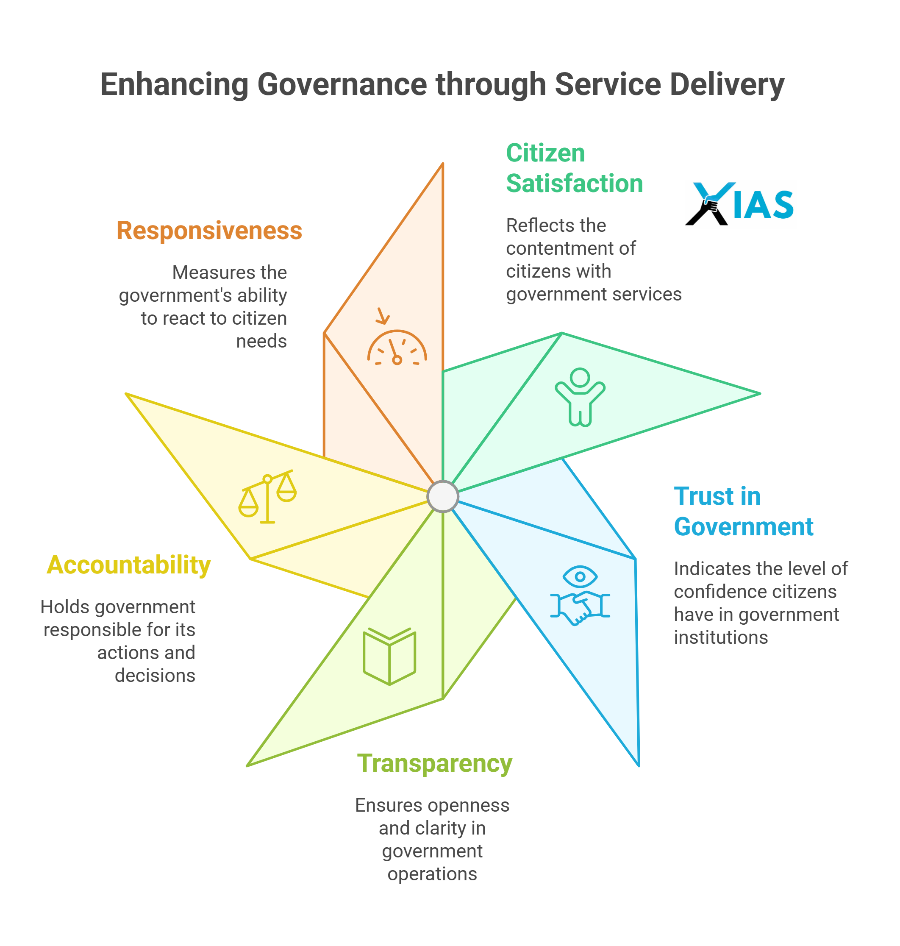

---

##### Subtopic: Challenges of Corruption
[Subject: ETHICS, INTEGRITY & APTITUDE]
[Section Group: Governance & Probity]
[Microtopic: Probity in Governance: Concept of Public Service; Philosophical Basis of Governance and Probity; Information Sharing and Transparency in Government, Right to information; Codes of Ethics, Codes of Conduct, Citizen’s Charters, Work Culture, Quality of Service Delivery, utilization of Public Funds, Challenges of Corruption.]
[Subtopic: Challenges of Corruption]

###### Card 1: Challenges of Corruption (Theme 8)
*   **Quote:**
    > “Corruption is worse than prostitution. It destroys the soul of the nation.” – Baba Ramdev

*   **Introduction:**
*   **Corruption is the unethical use of entrusted power for private gain**, eroding **trust, weakening institutions**, and distorting the **moral foundation** of public service and development.

*   **Examples:**
*   2G and coal scams undermined resource transparency.
*   **PDS and MGNREGA leakages** weakened **last-mile trust**.
*   PC Act (1988) amendments and Lokpal aim to check corruption.

*   **Conclusion:**
*   **Corruption is not merely a legal failure but a moral collapse**, demanding reform, transparency, and inner restraint.

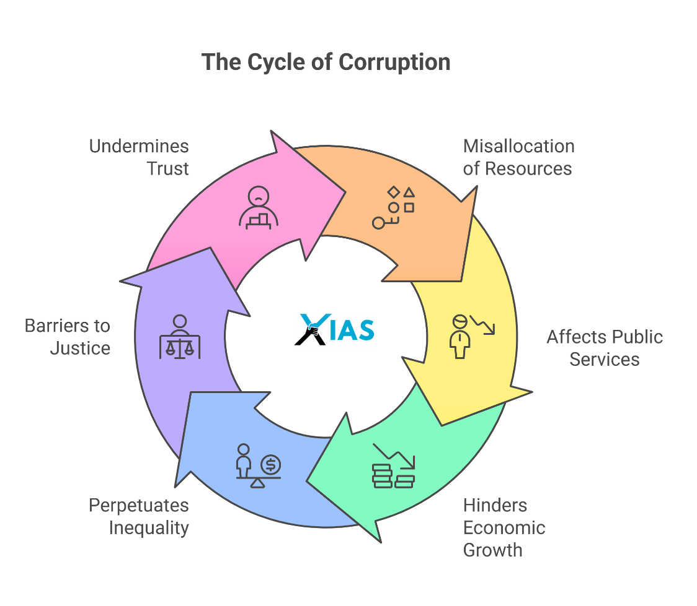

